# 🧠 MATCHUNT — Godmode-Gesamtanalyse

> **Erstellt:** 2026-06-08 · **Methode:** 17 KI-Analyse-Agenten (13 Domänen + 4 Synthese) über den vollständigen Quellcode · **Repo:** hire-speedy-ai (intern `matchunt`) · **Backend:** Supabase `dngycrrhbnwdohbftpzq`

Dieses Dokument bildet das **gesamte Matchunt-Projekt von A–Z** ab: Architektur, Datenmodell, den Triple-Blind-Kern, alle Subsysteme, ihre Vernetzungen und eine Roadmap zum Erfolg — die Grundlage, auf der wir aufbauen.

---

## 📑 Inhaltsverzeichnis

1. [0. Executive Summary](#0-executive-summary)
2. [0b. Systemarchitektur & Vernetzungs-Landkarte](#0b-systemarchitektur--vernetzungs-landkarte)
3. [01. Architektur, Stack & Deployment](#01-architektur-stack--deployment)
4. [02. Datenmodell, RLS & DB-Logik](#02-datenmodell-rls--db-logik)
5. [03. Triple-Blind Anonymisierung](#03-triple-blind-anonymisierung)
6. [3b. Triple-Blind perfektionieren (Soll-Zustand & Plan)](#3b-triple-blind-perfektionieren-soll-zustand--plan)
7. [04. Auth, Rollen & Zugriffskontrolle](#04-auth-rollen--zugriffskontrolle)
8. [05. Kandidaten-Lifecycle & Intake](#05-kandidaten-lifecycle--intake)
9. [06. Job-Lifecycle & Anreicherung](#06-job-lifecycle--anreicherung)
10. [07. Matching-Engine & ML](#07-matching-engine--ml)
11. [08. Fit-Assessment (KI-Eignung)](#08-fit-assessment-ki-eignung)
12. [09. Pipeline: Submission, Interview, Offer, Placement](#09-pipeline-submission-interview-offer-placement)
13. [10. Finanzen, Stripe & Auszahlungen](#10-finanzen-stripe--auszahlungen)
14. [11. Integrationen (HubSpot, OAuth, E-Mail, Crawling)](#11-integrationen-hubspot-oauth-e-mail-crawling)
15. [12. Automatisierung, Engines, Notifications & Analytics](#12-automatisierung-engines-notifications--analytics)
16. [13. Frontend-Architektur & Design-System](#13-frontend-architektur--design-system)
17. [99. Roadmap zum Erfolg](#99-roadmap-zum-erfolg)

---

## 0. Executive Summary

> Aufbau-Dokument fuer die Recruiting-Plattform **Matchunt** (matchunt.ai).
> Quelle = Quellcode dieses Repos (intern `matchunt`, GitHub `RecruitigEntrepreneur/hire-speedy-ai`), Stand der Analyse: 2026-06-08.
> Verifizierter Kontext: Frontend ueber **Lovable** (Projekt `7a26b296-848c-4f57-af34-75297cbf024b`), Backend = **Supabase**-Projekt `dngycrrhbnwdohbftpzq`.
> Diese Zusammenfassung verdichtet die Detail-Kapitel 01–13. Belege stehen dort; hier zaehlt die Fuehrungssicht.

---

### 0.1 Was ist Matchunt

Matchunt ist eine KI-gestuetzte Recruiting-Plattform, die drei Personas auf einer Infrastruktur verbindet: **Clients** (Unternehmen, `/dashboard/*`) schreiben Stellen aus, **Recruiter** (`/recruiter/*`) liefern Kandidaten, **Admins** (`/admin/*`) steuern Freigaben, Honorare und Plattform-Betrieb.

Das Geschaeftsmodell ist **erfolgsbasiert**: Honorar entsteht erst bei Angebotsannahme als `placement` (Default 20 % des Jahresgehalts, davon 75 % an den Recruiter), gefolgt von einer 90-Tage-Escrow-Periode und Auszahlung via Stripe Connect. Kein Vermittlungserfolg, keine Rechnung.

Der **Kern-USP ist das Triple-Blind-Verfahren**: Der Client sieht die Kandidaten-Identitaet erst nach Opt-In/Interview-Bestaetigung, der Recruiter sieht den Firmennamen erst nach gestuftem Reveal, der Recruiter besitzt seinen Kandidaten und bleibt ungeblindet. Anonymisiertes Matching, KI-Eignungsgutachten und ein vollstaendiger Pipeline-Flow (Submission → Interview → Offer → Placement) bilden das Produkt darum herum.

**Vision:** schnelleres, fairer anonymisiertes, KI-beschleunigtes Recruiting, bei dem Bias durch Verblindung reduziert wird und die Plattform nur am tatsaechlichen Vermittlungserfolg verdient.

---

### 0.2 Tech-Realitaet (in einem Absatz)

Matchunt ist eine **reine React-18-SPA** (Vite 5, TypeScript, Tailwind/shadcn) **ohne SSR, ohne Code-Splitting** — `src/App.tsx` importiert alle ~80 Pages statisch und zentralisiert Routing samt einzigem Auth-Gate. Es gibt **kein eigenes API-Backend**: das gesamte Backend liegt in **einem** Supabase-Projekt (Postgres 15 mit Row Level Security, ~115 Tabellen, ~79–81 Edge Functions in Deno, 93 Migrationen). Das Frontend spricht ausschliesslich (a) direkt mit Postgres ueber den Supabase-Client unter RLS und (b) ueber `supabase.functions.invoke()` mit Edge Functions; 75 von 79 Functions laufen mit dem Service-Role-Key (RLS-Bypass), abgesichert nur durch `verify_jwt` plus funktionseigene Autorisierungslogik. **KI laeuft fast durchgaengig ueber das Lovable AI Gateway** (`google/gemini-2.5-flash`), nicht ueber direkte OpenAI-Keys. Persona-Gating erfolgt zentral via `ProtectedRoute` gegen die Tabelle `user_roles` (reine UX — die echte Sicherheit liegt in RLS). Backend-Verdrahtung laeuft ueber DB-Trigger und `pg_cron`/`pg_net` (Auto-Fit-Assessment, Influence-/Escalation-Engines), Live-Updates ueber Supabase Realtime.

---

### 0.3 Reifegrad pro Subsystem

Skala Reife: **Produktiv** (live & verdrahtet) · **Funktional** (laeuft, mit Luecken) · **Fragil** (lauffaehig, aber kritische Defekte/Drift) · **Defekt** (Kernfunktion nicht erfuellt) · **Nicht ausgerollt** (Backend live, Frontend fehlt).

| Subsystem | Reife | Risiko | Kernbefund |
|---|---|---|---|
| Architektur & Deployment | Fragil | **Hoch** | Publish-Gap: Live-Frontend laeuft hinter Git/Backend her; zwei Git-Linien auf einem Supabase-Projekt |
| Datenmodell & RLS | Funktional | **Hoch** | ~115 Tabellen, sauberes Trigger-Geruest; RLS setzt Triple-Blind-Stufen aber NICHT durch |
| Triple-Blind (USP) | Fragil | **Kritisch** | Anonymisierung nur clientseitig/im Prompt; PII per DevTools vor Opt-In abgreifbar |
| Auth, Rollen & Zugriff | Fragil | **Kritisch** | Privilege-Escalation ueber Signup-Metadaten + offene `user_roles`-Insert-Policy |
| Kandidaten-Intake | Funktional | **Hoch** | 4 Eingangskanaele live; Embeddings defekt (64-dim in `vector(1536)`) |
| Job-Lifecycle & Anreicherung | Funktional | Mittel | 3-Phasen-Flow funktioniert; Anonymisierung nur per LLM-Prompt, kein Scrub |
| Matching-Engine & ML | Fragil | **Hoch** | v3.1 produktiv, aber 4 Versionen parallel; "ML" ohne Trainingsschleife; Vektorsuche tot |
| Fit-Assessment (KI) | Nicht ausgerollt | Mittel | Backend live & auto-getriggert; Client-Card im publizierten Frontend nicht enthalten |
| Pipeline (Submission→Placement) | Funktional | **Hoch** | Kern-Flow steht; dualer Placement-Pfad, zwei Scheduling-Systeme, Reminder feuern nie |
| Finanzen, Stripe & Payout | Defekt | **Kritisch** | Auszahlung verdrahtet, aber Einnahme-Seite fehlt → Escrow springt nie auf `held` |
| Integrationen | Funktional | **Hoch** | OAuth/E-Mail/Outreach gebaut; Webhooks signaturlos, Sandbox-Absender, kein Scheduler |
| Automation Engines | Funktional | Mittel | Influence-/Escalation-Engines via `pg_cron` aktiv; abhaengig von DB-Settings (GUCs) |
| Frontend & Design-System | Fragil | **Hoch** | Kein Code-Splitting; invertierte `darkMode`-Config; verifizierter Render-Loop |

---

### 0.4 Die 5 wichtigsten Staerken

1. **Konsistente, schlanke Architektur.** Ein Frontend-Pattern (Supabase-Client) + ein Backend (Supabase) + ein KI-Gateway (Lovable). Keine Microservice-Zersplitterung, keine eigene Server-Flotte — das senkt Betriebslast und macht das System fuer ein kleines Team beherrschbar.

2. **Durchgaengige ereignisgetriebene Verdrahtung.** Das Muster DB-Trigger → `pg_net`/`pg_cron` → Edge Function → DB-Write zieht sich konsistent durch (Auto-Fit-Assessment, Influence-/Escalation-Engines, ML-Datenerfassung). Kern-Automationen laufen bereits ohne manuelles Zutun.

3. **Reicher, funktionsfaehiger Produkt-Kern.** Der gesamte Pipeline-Flow (Submission → Interview → Offer → Placement) inkl. Token-Portalen fuer Kandidaten, Honorar-/Escrow-Berechnung und ML-Feedback-Erfassung ist gebaut und im Backend lauffaehig — die Plattform ist deutlich mehr als ein Prototyp.

4. **Klares, sauber getrenntes Rollen- und Datenmodell.** `user_roles` ist bewusst von `profiles` getrennt (Privilege-Escalation-Schutz im Design), `has_role()` ist die einzige Autorisierungs-Quelle, und der Hub `submissions` buendelt fast die gesamte operative Logik per FK — eine wartbare Grundstruktur.

5. **Differenzierendes Produktkonzept.** Triple-Blind + erfolgsbasiertes Honorar + KI-Eignungsgutachten ist ein echter Markt-USP. Die fachliche Idee ist konsistent durchdacht; die Luecken liegen in der Durchsetzung, nicht im Konzept.

---

### 0.5 Die 5 groessten Risiken / Luecken

1. **Live-Publish-Gap (verifiziert) — Backend aktuell, Frontend veraltet.** Lovable koppelt Git-Push und Backend-Migration NICHT an den Live-Deploy; "Publish" ist ein manueller Klick. Folge: **matchunt.ai ist ein aelterer Build ohne Fit-Analyse, Trust-Gate und Task-Inbox**, waehrend Backend-Trigger und Cron diese Features bereits produktiv feuern. Funktionalitaet ist im Backend live, im Frontend unsichtbar — auto-generierte Assessments sammeln sich (und kosten LLM-Geld), ohne dass ein Nutzer sie sieht. *Sofort: Publish in den Release-Prozess aufnehmen, Versions-/Commit-Hash im UI sichtbar machen, neue Backend-Features hinter Feature-Flags legen.*

2. **Triple-Blind ist nicht erzwungen — der USP ist technisch umgehbar.** Die Anonymisierung lebt ausschliesslich client- bzw. prompt-seitig; **RLS liefert Kandidaten-PII und echte Arbeitgebernamen an Clients vor jedem Opt-In, und den Firmennamen an Recruiter vor dem Reveal** — beides per DevTools/Network-Tab sichtbar und im direkten Widerspruch zum Marketing-Claim. *Sofort: PII erst nach Reveal ueber SECURITY-DEFINER-Views/RPCs ausliefern, Reveal-Flags in die RLS-Bedingungen ziehen, Firmenname serverseitig aus AI-Output scrubben.*

3. **Auth-Privilege-Escalation — jeder kann sich Admin geben.** `handle_new_user()` uebernimmt die Rolle ungeprueft aus client-kontrollierten Signup-Metadaten, und die Policy *"Users can insert their own role"* erlaubt jedem User, sich selbst `admin` in `user_roles` zu schreiben. Zusaetzlich sind `suspended`/`verified` wirkungslos (nirgends erzwungen). *Sofort: Trigger auf `client`/`recruiter` whitelisten und `admin` ablehnen, die offene Insert-Policy entfernen, Suspend/Verify in `ProtectedRoute` und RLS durchsetzen.*

4. **Einnahme-Seite fehlt — der Geldfluss ist blockiert.** Es existiert **kein Code, der Rechnungen erzeugt oder einen Stripe-PaymentIntent/Checkout fuer den Client anlegt**. Dadurch wird `invoices.stripe_payment_intent_id` nie gesetzt, der Webhook feuert nie, `escrow_status` bleibt auf `pending`, und der regulaere Auszahlungsfluss ist ohne manuelle DB-Eingriffe vollstaendig blockiert. Verschaerfend: ein clientseitig manipulierbarer Auszahlungsbetrag und drei divergierende Placement-Pfade (zwei davon fehlerhaft). *Sofort: `create-invoice`/Checkout-Function ergaenzen, Payout-Betrag serverseitig aus `placement.recruiter_payout` ableiten, Placement-Erzeugung auf einen Pfad konsolidieren.*

5. **Defekte Such-/Match-Foundation + strukturelle Frontend-Fragilitaet.** Die semantische Suche ist tot (`generate-embeddings` schreibt 64-dim Vektoren in eine `vector(1536)`-Spalte; keine Match-Version nutzt Embeddings ueberhaupt), das Matching laeuft in **vier parallelen Versionen** mit divergierenden Scores, und die "ML"-Schleife sammelt nur Daten ohne zu lernen. Im Frontend invertiert eine fehlerhafte `darkMode`-Config alle 314 `dark:`-Varianten, und ein verifizierter Render-Loop (*Maximum update depth exceeded*) sitzt in fragilen Effekt-Dependencies. *Sofort: Embedding-Dimension/Modell angleichen oder Vektorsuche entfernen, v3.1 als Single Source of Truth festlegen, `darkMode`-Config korrigieren, Loop per Profiler einkreisen.*

---

### 0.6 Querschnitts-Risiko: Backend-Drift durch zwei Git-Linien

Unabhaengig von den fuenf Punkten oben besteht ein **organisatorisches Grundrisiko**: Zwei parallele Repos — `hire-speedy-ai` (aktiv) und `matchunt-platform` (eingefroren Feb 2026) — teilen sich **dasselbe** Supabase-Projekt `dngycrrhbnwdohbftpzq` (identische `project_id`) ohne technischen Schutz gegen widerspruechliche Migrationen oder Deploys. Zusaetzlich ist `.env` mit `VITE_SUPABASE_URL` und anon-Key im Git eingecheckt, was das gesamte Sicherheitsgewicht implizit auf RLS + `verify_jwt` verschiebt. *Empfehlung: kanonisches Repo festlegen und dokumentieren, `matchunt-platform` vom Backend entkoppeln/archivieren, `.env` aus Historie entfernen und Keys rotieren.*

---

### 0.7 Fuehrungs-Fazit

Matchunt hat ein **starkes Konzept und einen ueberraschend vollstaendigen Backend-Kern**, aber die Plattform ist heute **nicht release-reif**: Der USP (Triple-Blind) ist technisch umgehbar, der Auth-Layer erlaubt Selbst-Promotion zum Admin, der Geldfluss ist blockiert, und das, was im Backend laeuft, ist im Live-Frontend gar nicht sichtbar. Die gute Nachricht: Es sind ueberwiegend **gezielte, abgrenzbare Korrekturen** (RLS-Durchsetzung, eine Checkout-Function, Trigger-Whitelist, Embedding-/Theme-Fix, Publish-Disziplin) — kein Architektur-Umbau. Priorisierung in dieser Reihenfolge: **(1) Auth & Triple-Blind absichern → (2) Geldfluss schliessen → (3) Publish-Gap & Drift beseitigen → (4) Such-/Match- und Frontend-Stabilitaet.**


---

## 0b. Systemarchitektur & Vernetzungs-Landkarte

> **Lead-Architekt / CTO-Team ("Godmode").** Diese Datei ist die **System-Landkarte**, die alle 13 Domaenen-Analysen (`01-` bis `13-*.md`) zu einem Gesamtbild verknuepft. Sie ersetzt keine Detail-Sektion, sondern zeigt die **Topologie**: Wie haengen Personas, Edge Functions, Tabellen, Trigger/Cron und externe Dienste zusammen? Quelle der Wahrheit bleibt der Code; Referenzen als `pfad/datei.ts:zeile`.
>
> **Eine-Satz-Zusammenfassung des Systems:** Matchunt ist eine **React-18-SPA ohne SSR** (Lovable-Deploy) auf **einem** Supabase-Projekt (`dngycrrhbnwdohbftpzq`, Postgres 15 + RLS, ~79 Edge Functions, 93 Migrationen). Das Frontend spricht das Backend ausschliesslich ueber (a) **RLS-Direktqueries** (`supabase.from`) und (b) **`functions.invoke()`** an; das eigentliche "Nervensystem" laeuft serverseitig ueber **DB-Trigger + pg_cron + pg_net + Database-Webhooks**, die Edge Functions feuern, die wiederum mit Service-Role (RLS-Bypass) schreiben und externe Dienste (Lovable AI Gateway, Stripe, Resend, HubSpot, Firecrawl) ansprechen.

---

### 0b.1 Master-Diagramm: Gesamtarchitektur

Gruppiert in fuenf Ebenen: **(1) Personas/Frontend** → **(2) Edge Functions** (nach Funktionsbereich geclustert) → **(3) Kern-Tabellen** → **(4) Backend-Orchestrierung** (Trigger/Cron/Webhook) → **(5) Externe Dienste**. Kanten zeigen den dominanten Datenfluss; gestrichelte Kanten sind asynchron/fire-and-forget.

```mermaid
flowchart TB
    %% ============ EXTERNE DIENSTE ============
    subgraph EXT["Externe Dienste"]
        AIGW["Lovable AI Gateway<br/>gemini-2.5-flash (21 Fn)"]
        STRIPE["Stripe Connect<br/>Express + Webhooks"]
        RESEND["Resend<br/>E-Mail + Webhooks"]
        HUBSPOT["HubSpot<br/>OAuth + CRM-Sync"]
        FIRE["Firecrawl<br/>Career-Page-Crawl"]
        OPENR["OpenRouter<br/>(nur intake-briefing)"]
    end

    %% ============ PERSONAS / FRONTEND ============
    subgraph FE["Frontend - React 18 SPA (Lovable Publish, manuell)"]
        CLIENT["CLIENT<br/>/dashboard/* (21 Seiten)"]
        RECRUITER["RECRUITER<br/>/recruiter/* (16 Seiten)"]
        ADMIN["ADMIN<br/>/admin/* (22 Seiten)"]
        TOKEN["TOKEN-PUBLIC<br/>/interview /offer<br/>/invite /reference"]
        GATE{{"ProtectedRoute + useAuth<br/>role aus user_roles<br/>(UX-Gate, admin = all)"}}
        RT["Realtime-Hooks (7x)<br/>postgres_changes"]
        CLIENT --- GATE
        RECRUITER --- GATE
        ADMIN --- GATE
    end

    %% ============ EDGE FUNCTIONS (geclustert) ============
    subgraph EF["~79 Edge Functions (Deno, 75x Service-Role / RLS-Bypass)"]
        direction LR
        subgraph EF_AI["KI: Parse / Match / Fit / Summary"]
            PARSE["parse-cv / parse-pdf<br/>parse-job-url / parse-job-pdf"]
            ENRICH["enrich-job-data<br/>extract-intake-briefing"]
            MATCH["calculate-match-v3-1<br/>generate-match-recommendation"]
            FIT["assess-candidate-fit"]
            SUMM["client-candidate-summary<br/>format-job-for-recruiters<br/>generate-job-summary/-expose"]
            EMB["generate-embeddings<br/>normalize-skills"]
        end
        subgraph EF_PIPE["Pipeline / Aktionen"]
            INTV["send-interview-invitation<br/>process-interview-response<br/>schedule-interview"]
            OFFER["create-offer / send-offer<br/>process-offer-response"]
            REJ["process-rejection<br/>request-reference / analyze-reference"]
            THA["process-talent-hub-action"]
        end
        subgraph EF_ENG["Engines (Cron / Webhook)"]
            INFENG["influence-engine"]
            ESCENG["escalation-engine"]
            CISENG["calculate-influence-score"]
            AHUB["automation-hub<br/>(DB-Webhook-Router)"]
            ANALYT["calculate-analytics<br/>refresh-analytics"]
            FRAUD["fraud-detection"]
        end
        subgraph EF_FIN["Finanzen"]
            SCONN["stripe-connect"]
            SWH["stripe-webhooks"]
            PAYOUT["process-payout"]
            DEAL["deal-health"]
        end
        subgraph EF_INT["Integrationen / E-Mail / Outreach"]
            OAUTH["oauth-connect / -callback<br/>integration-api-key"]
            HSYNC["hubspot-sync"]
            MAIL["send-email"]
            INGEST["process-candidate-email<br/>process-candidate-import"]
            OUTQ["process-outreach-queue<br/>process-sequences"]
            RWH["resend-webhooks<br/>process-inbound-email"]
            CRAWL["crawl-career-page<br/>crawl-company-data"]
        end
        subgraph EF_GDPR["DSGVO / Tracking / Dashboard"]
            GDPR["gdpr-export / gdpr-deletion"]
            TRACK["track-event<br/>track-candidate-engagement"]
            CDASH["client-dashboard-data"]
        end
    end

    %% ============ KERN-TABELLEN ============
    subgraph DB["Postgres 15 - Kern-Tabellen (RLS aktiv, ~115 Tabellen)"]
        direction LR
        T_AUTH[("user_roles<br/>profiles")]
        T_SUB[("submissions HUB<br/>UNIQUE job+candidate")]
        T_JOB[("jobs")]
        T_CAND[("candidates<br/>+ experiences/skills")]
        T_FIT[("candidate_fit_assessments")]
        T_INTV[("interviews")]
        T_OFF[("offers / offer_events")]
        T_PLACE[("placements")]
        T_FIN[("invoices / payout_requests<br/>stripe_accounts / payment_events")]
        T_NOTIF[("notifications<br/>messages")]
        T_INFL[("influence_alerts<br/>recruiter_influence_scores")]
        T_BEH[("candidate_behavior<br/>user_behavior_scores")]
        T_EVT[("platform_events<br/>sla_deadlines")]
        T_FRAUD[("fraud_signals<br/>recruiter_trust_levels")]
        T_OUT[("outreach_leads / -emails<br/>-send_queue")]
        T_INTG[("recruiter_integrations<br/>oauth_states")]
        T_FUNNEL[("funnel_metrics<br/>deal_health")]
    end

    %% ============ BACKEND-ORCHESTRIERUNG ============
    subgraph ORCH["Backend-Verdrahtung (Postgres -> HTTP)"]
        CRON["pg_cron + pg_net<br/>5 / 15 / 60 min + taeglich"]
        TRIG["DB-Trigger (AFTER INSERT/UPDATE)<br/>trg_generate_fit_assessment<br/>reveal_company_on_opt_in<br/>grant_full_access_on_interview_confirm<br/>handle_new_user / activity_log"]
        WHOOK["Supabase DB-Webhook<br/>(NICHT im Repo versioniert)"]
    end

    %% ---- Frontend -> Backend ----
    GATE -->|"functions.invoke()"| EF
    GATE -->|"supabase.from() RLS"| DB
    CLIENT -.->|invoke| CDASH
    TOKEN -->|"token-auth (verify_jwt=false)"| INTV
    TOKEN --> OFFER
    DB -. "Realtime postgres_changes" .-> RT
    RT --> FE

    %% ---- Edge Functions -> Tabellen (Service-Role) ----
    PARSE --> T_CAND
    PARSE --> T_JOB
    ENRICH --> T_JOB
    MATCH --> T_SUB
    FIT --> T_FIT
    SUMM --> T_JOB
    INTV --> T_INTV
    INTV --> T_SUB
    OFFER --> T_OFF
    OFFER --> T_PLACE
    OFFER --> T_SUB
    REJ --> T_SUB
    THA --> T_SUB
    INFENG --> T_INFL
    INFENG --> T_BEH
    ESCENG --> T_BEH
    ESCENG --> T_EVT
    CISENG --> T_INFL
    AHUB --> T_NOTIF
    AHUB --> T_CAND
    ANALYT --> T_FUNNEL
    FRAUD --> T_FRAUD
    SWH --> T_FIN
    SWH --> T_PLACE
    PAYOUT --> T_FIN
    PAYOUT --> STRIPE
    SCONN --> STRIPE
    SCONN --> T_FIN
    DEAL --> T_FUNNEL
    HSYNC --> T_CAND
    INGEST --> T_CAND
    OAUTH --> T_INTG
    OUTQ --> T_OUT
    MAIL --> T_NOTIF
    TRACK --> T_EVT
    GDPR --> T_AUTH

    %% ---- Edge Functions -> Externe Dienste ----
    PARSE --> AIGW
    MATCH --> AIGW
    FIT --> AIGW
    SUMM --> AIGW
    EMB --> AIGW
    INFENG --> AIGW
    ENRICH --> OPENR
    MAIL --> RESEND
    INTV --> RESEND
    OFFER --> RESEND
    OUTQ --> RESEND
    RWH --- RESEND
    HSYNC --> HUBSPOT
    OAUTH --> HUBSPOT
    CRAWL --> FIRE
    ENRICH --> FIRE
    SWH --- STRIPE

    %% ---- Orchestrierung ----
    CRON -->|net.http_post| INFENG
    CRON -->|net.http_post| ESCENG
    CRON -->|net.http_post| CISENG
    CRON -. "(geplant, fehlt)" .-> OUTQ
    T_SUB ==> TRIG
    TRIG -. "pg_net fire-and-forget" .-> FIT
    TRIG -->|UPDATE| T_SUB
    T_AUTH -. handle_new_user .- TRIG
    WHOOK -->|"{type,table,record}"| AHUB
    T_SUB -. "DB-Webhook" .-> WHOOK
    T_PLACE -. "DB-Webhook" .-> WHOOK
    T_INTV -. "DB-Webhook" .-> WHOOK
    T_OFF -. "DB-Webhook" .-> WHOOK

    classDef ext fill:#e8f0ff,stroke:#3b6fd4;
    classDef hub fill:#fff0d9,stroke:#e0a800,stroke-width:2px;
    classDef risk fill:#ffe0e0,stroke:#c00;
    class AIGW,STRIPE,RESEND,HUBSPOT,FIRE,OPENR ext;
    class T_SUB hub;
    class WHOOK,RT risk;
```

**Drei Leitmotive aus der Topologie:**
1. **`submissions` ist der Gravitationspunkt.** Pipeline-, Fit-, Influence-, Deal-Health-, Payment- und ML-Tabellen haengen alle daran; der INSERT in `submissions` ist gleichzeitig Trigger fuer Fit-Assessment, ML-Logging, Trust-Aktivierung und (per Webhook) Notification-Fan-out.
2. **Drei Ausloeser-Klassen** fuer Edge Functions: **Frontend-invoke** (Aktionen/KI on-demand), **pg_cron** (Engines), **DB-Trigger/Webhook** (reaktiv). Nur die invoke-Klasse ist im Frontend sichtbar — der Rest laeuft unsichtbar serverseitig.
3. **Lovable AI Gateway ist Single Point of Dependency** fuer 21 Functions; **Stripe + Resend** sind die einzigen geldwert-/zustellungskritischen externen Abhaengigkeiten.

---

### 0b.2 Konsolidierte Vernetzungs-Tabelle (dedupliziert)

Aus allen `interconnections`-Eintraegen der 13 Domaenen zusammengefuehrt und entdoppelt (z.B. der Fit-Trigger taucht in 6 Sektionen auf → **eine** Zeile). Sortiert nach Schicht.

#### A) Frontend → Backend (Eintrittspunkte)

| Von | Nach | Mechanismus | Zweck |
|---|---|---|---|
| `App.tsx` / `auth.tsx` ProtectedRoute | `user_roles` | `supabase.from('user_roles').select('role')` (`auth.tsx:53`) | Persona-Gating (UX); Rolle aus DB-Tabelle, nicht aus JWT |
| `useClientDashboard` | `client-dashboard-data` (EF) | `useQuery → functions.invoke` (staleTime 30s) | Server-aggregierte Client-Dashboard-Stats in **einem** Call (Goldstandard) |
| ~60 Feature-Hooks | diverse Edge Functions | `supabase.functions.invoke(name,{body})` | KI/Aktionen/3rd-Party |
| Mehrheit der Pages | Tabellen direkt | `supabase.from(...).select/insert/update` unter RLS | CRUD/Reads (Top: submissions 92x, jobs 45x, interviews 44x) |
| 7 Realtime-Hooks | Postgres Realtime | `supabase.channel().on('postgres_changes')` | Live-Updates: notifications, messages, submissions, tasks, influence_alerts |
| Token-Portale (public) | `process-interview-response` / `process-offer-response` | `invoke` ohne Login (`verify_jwt=false`) | Kandidat antwortet auf Interview/Offer ohne Account |

#### B) Persona-Aktionen → Edge Functions → Tabellen

| Von | Nach | Mechanismus | Zweck |
|---|---|---|---|
| Client: CreateJob | `parse-job-url/-pdf`, `enrich-job-data`, `extract-intake-briefing` | `invoke` (return-only) | KI-Extraktion/Anreicherung; **Browser** schreibt `jobs` (`CreateJob.tsx:610`) |
| Client: JobApprovalDialog (Admin) | `format-job-for-recruiters` → `jobs` | `invoke`, dann UPDATE status=published | Triple-Blind-anonymisiertes `formatted_content` erzeugen |
| Client: ClientJobDetail | `generate-job-summary` → `jobs.job_summary` | `invoke` (on-demand) | Executive Summary fuer Client-Sicht |
| Recruiter: CvUpload/Email/HubSpot/Form | `parse-pdf`→`parse-cv` / `process-candidate-import` / `hubspot-sync` → `candidates` (+Kind-Tabellen) | `invoke` bzw. Webhook-Pipeline | Vier Intake-Kanaele → ein Kandidatenmodell |
| Recruiter: Submission-Insert | `candidates`/`jobs` → `submissions` | `supabase.from('submissions').insert` (RLS Owner) | Kandidat auf Job einreichen (loest Trigger-Kaskade aus) |
| Recruiter: CandidateJobMatchingV3 | `calculate-match-v3-1` | `invoke` via `useMatchScoreV31` (mode preview) | Batch-Match 1 Kandidat × N Jobs (Triple-Blind, ohne company_name) |
| Client: InterviewWizard | `send-interview-invitation` → `interviews` (response_token) + `submissions.stage` | `invoke` (`ProfessionalInterviewWizard.tsx:51`) | Interview anfragen; Opt-In-Flow starten + Mail an Kandidat |
| Client: useOffers | `create-offer` → `send-offer` | Zwei-Schritt-`invoke` | Angebot anlegen (draft) → versenden (sent) |
| Client: useTalentHubActions | `process-talent-hub-action` | `invoke` (`useTalentHubActions.ts:46`) | EINE Function fuer 5 Client-Aktionen (request_interview, confirm_opt_in, move, reject, feedback) |
| Recruiter: useReferenceChecks | `analyze-reference` → `reference_responses.ai_*` | `invoke` nach Antwort-Insert | KI-Referenzanalyse (Gemini + deterministischer Fallback) |
| Recruiter: StripeOnboarding | `stripe-connect` → `stripe_accounts` | `invoke({action})` | Express-Konto anlegen + charges/payouts-Status syncen |
| Admin: PayoutApproval | `process-payout` → Stripe `transfers.create` | `invoke({action:approve})` | Auszahlung freigeben nach Escrow-Reife |
| Admin: useFraudSignals | `fraud-detection` → `fraud_signals` | `invoke` (regelbasiert, 6 Heuristiken) | Triple-Blind-/Self-Submission-Schutz |
| Admin: useFunnelAnalytics | `calculate-analytics` → `funnel_metrics` | `invoke` (sonst read-only) | Funnel/Leaderboard-Aggregation |

#### C) Edge Functions ↔ Externe Dienste

| Von | Nach | Mechanismus | Zweck |
|---|---|---|---|
| 21 Edge Functions | **Lovable AI Gateway** | `POST ai.gateway.lovable.dev/v1/chat/completions` mit `LOVABLE_API_KEY`, `google/gemini-2.5-flash`, Function-Calling | Zentrale KI (Parse, Match, Fit, Summary, Influence). `assess-candidate-fit` cached per SHA-256-Input-Hash |
| `extract-intake-briefing` | **OpenRouter** | `OPENROUTER_API_KEY` | **Ausreisser**: einzige Function ausserhalb des Lovable-Gateways |
| `stripe-connect` / `process-payout` | **Stripe** | `stripe.accounts/transfers.create` (`esm.sh/stripe@14.21.0`) | Recruiter-Onboarding + Auszahlung |
| **Stripe** (extern) | `stripe-webhooks` | `POST` mit `stripe-signature` vs. `STRIPE_WEBHOOK_SECRET` | Payment-/Transfer-Events → `escrow_status=held`/payout-Bestaetigung. **Fallback ohne Signaturpruefung** bei fehlendem Secret |
| 8 Edge Functions (`send-email`, Interview/Offer/Outreach) | **Resend** | REST mit `RESEND_API_KEY` | Transaktions-/Outreach-Mails (drei divergierende Absenderdomaenen!) |
| **Resend** (extern) | `resend-webhooks` / `process-inbound-email` | `POST` (`verify_jwt=false`, **ohne** Signaturpruefung) | Delivery-Lifecycle + Inbound-Reply-Verarbeitung |
| `hubspot-sync` / `oauth-callback` | **HubSpot** | OAuth 2.0 (PKCE/State), Token AES-256-GCM in `recruiter_integrations` | CRM-Kontakt-Import; Token-Refresh bei <5min Restlaufzeit |
| `crawl-career-page` / `enrich-job-data` | **Firecrawl** | `/v1/map` + `/v1/scrape` mit `FIRECRAWL_API_KEY` | Career-Page-Crawl fuer Lead-Priorisierung / Company-Enrichment |

#### D) Backend-Orchestrierung (Postgres → HTTP, das Nervensystem)

| Von | Nach | Mechanismus | Zweck |
|---|---|---|---|
| `submissions` AFTER INSERT | `assess-candidate-fit` | Trigger `trg_generate_fit_assessment` → `net.http_post` (Service-Role-Bearer) | Fit-Gutachten vorab erzeugen, bevor Client die Seite oeffnet (fire-and-forget) |
| `submissions` INSERT/UPDATE | `match_outcomes` / `ml_training_events` | Trigger `sync_submission_outcome_to_match` / `log_ml_training_event` | ML-Datenerfassung (Prediction↔Outcome, Snapshot) |
| `submissions` INSERT | `recruiter_trust_levels` / `recruiter_job_activations` / `fraud_signals` | Trigger `mark_activation_submitted` / `check_bulk_activation` | Aktivierungsquote + Bulk-Fraud-Flag (>5/h) |
| `submissions.status='candidate_opted_in'` | `submissions.company_revealed` | BEFORE-UPDATE-Trigger `reveal_company_on_opt_in` | Triple-Blind Stufe 1. **BUG**: prueft `status`, Frontend setzt `stage` → feuert nie |
| `interviews.candidate_confirmed=true` | `submissions.full_access_granted` | AFTER-UPDATE-Trigger `grant_full_access_on_interview_confirm` | Triple-Blind Stufe 2 (Cross-Table-Reveal) |
| `submissions.status IN (rejected,withdrawn,hired,…)` | offene `interviews`/`offers` → cancelled | Trigger `cancel_orphaned_interviews_offers` | Verwaiste Pipeline-Objekte automatisch schliessen |
| `auth.users` INSERT | `profiles` + `user_roles` | Trigger `handle_new_user()` (liest `raw_user_meta_data.role` **ungeprueft**) | Identitaet + Rolle materialisieren (**Privilege-Escalation-Risiko**) |
| `candidates`/`jobs` UPDATE | `embedding_queue` → `generate-embeddings` | Trigger `queue_*_embedding_update` | Embedding-Generierung (defekt: 64-dim in vector(1536)-Spalte; kein Cron-Drainer) |
| **pg_cron** `*/5` | `escalation-engine` | `cron.schedule` + `net.http_post` (Service-Role) | SLA-Breach → Eskalation, schreibt `user_behavior_scores` |
| **pg_cron** `*/15` | `influence-engine` | `net.http_post` | Deal-Coaching: `candidate_behavior` + 7 Alert-Typen in `influence_alerts` + `recruiter_influence_scores` |
| **pg_cron** `0 * * * *` | `calculate-influence-score` | `net.http_post` | Recruiter-Score (redundant zur influence-engine, andere Formel) |
| **pg_cron** `0 3 * * *` | `influence_alerts` | reines SQL-UPDATE | Cleanup abgelaufener Alerts |
| **Supabase DB-Webhook** auf submissions/placements/interviews/offers/payout_requests | `automation-hub` | `{type,table,record,old_record}` → Router | **Zentraler Notification-Fan-out** + monotone Kandidaten-Stage-Pipeline. **Verdrahtung nur im Dashboard, NICHT im Repo** |
| `notifications` / `influence_alerts` | `useRealtimeNotifications` / `useInfluenceAlerts` → `NotificationBell` | Realtime `postgres_changes` | Push ins Frontend (**Quelle des "Maximum update depth"-Loops**) |

#### E) Querschnitt: Edge-Function → Edge-Function (interne Verkettung)

| Von | Nach | Mechanismus | Zweck |
|---|---|---|---|
| `process-candidate-email` | `process-candidate-import` | interner `fetch` fire-and-forget (Service-Role-Bearer) | Schnellen Webhook-Ack von langsamer KI-Pipeline entkoppeln |
| `process-candidate-import` | `parse-pdf` → `parse-cv` | interne Function-Calls | CV-Text extrahieren → strukturieren → `candidates` |
| `process-sequences` | `generate-outreach-email` | interner `fetch`, Ergebnis in `outreach_send_queue` | Outreach-Sequenz-Schritt generieren |
| `process-outreach-queue` | `resend-webhooks` | Resend-Versand setzt `resend_id`, Webhook matcht zurueck | Delivery-Lifecycle (≥3 Complaints/24h pausieren Kampagne) |
| `create-offer` | `send-offer` | Zwei-Schritt (draft→sent), nur `send-offer` mailt+benachrichtigt | Offer-Versand entkoppeln |
| `send-email` | `track-candidate-engagement` | Tracking-Pixel-URL + href-Rewrite | Open/Click-Tracking → `candidate_behavior` |

---

### 0b.3 Die wichtigsten End-to-End-Fluesse

Vier kanonische Durchstiche, die zeigen, wie Personas, Functions, Tabellen, Trigger und externe Dienste **zusammen** wirken. Bekannte Bruchstellen sind je Fluss markiert.

#### Fluss 1 — Job anlegen (Client → Admin → Recruiter)
1. **Client** erfasst Stelle (`/dashboard/jobs/new`) via PDF/URL/Text/manuell. `parse-job-url` / `parse-job-pdf` / `enrich-job-data` / `extract-intake-briefing` extrahieren/anreichern per **KI (return-only)** — kein DB-Write.
2. Der **Browser** schreibt `jobs` (`CreateJob.tsx:610`, status `draft` oder `pending_approval`). `client_id` ist RLS-Anker.
3. **Admin** genehmigt im `JobApprovalDialog`, setzt Fees/Urgency; `format-job-for-recruiters` erzeugt **Triple-Blind-anonymisiertes** `formatted_content` und setzt status=`published`.
4. **Recruiter** sieht die anonymisierte `formatted_content` (Self-Healing: wird per `useEffect` nachgeneriert, falls null). **Client** sieht die per `generate-job-summary` erzeugte Executive Summary.
> ⚠ **Bruchstellen:** KI-Arbeit lebt nur im Tab bis `handleSubmit` (kein Draft-Autosave); PDF/Text-Pfad ist datenaermer (zweites Schema, kein Enrichment); Anonymisierung haengt allein am LLM-Prompt (kein Regex-Scrub von `company_name`).

#### Fluss 2 — Kandidat einreichen + Fit-Assessment (Recruiter, automatisch)
1. **Recruiter** legt Kandidat ueber einen der 4 Kanaele an (CV-Upload / weitergeleitete E-Mail / HubSpot / Formular) → `candidates` + Kind-Tabellen.
2. **Recruiter** reicht ein: `supabase.from('submissions').insert` (RLS Owner) → `submissions` (UNIQUE job+candidate).
3. Der INSERT loest **parallel** aus: (a) Trigger `trg_generate_fit_assessment` → `net.http_post` → **`assess-candidate-fit`** (sammelt 7 Datenquellen, SHA-256-Cache, **Lovable AI Gateway**, upsert `candidate_fit_assessments`); (b) ML-Trigger (`match_outcomes`/`ml_training_events`); (c) Trust-/Fraud-Trigger; (d) **DB-Webhook → `automation-hub`** → Notification an `jobs.client_id` + monotone Kandidaten-Stage.
4. **Client** sieht die neue Submission live (Realtime `useRealtimeSubmissions`) und liest das Fit-Gutachten (RLS: nur eigener Job).
> ⚠ **Bruchstellen:** Fit-Trigger braucht `app.settings.*`-GUCs (sonst stilles Fehlschlagen); `verify_jwt=true` vs. Service-Role-Bearer ist fragil; **im publizierten matchunt.ai fehlt die Fit-Card** (Publish-Gap) → Assessments sammeln sich unsichtbar an und kosten LLM-Budget.

#### Fluss 3 — Match (Recruiter-Sicht)
1. **Recruiter** oeffnet `CandidateJobMatchingV3` → `useMatchScoreV31` ruft **`calculate-match-v3-1`** (Batch 1 Kandidat × bis 50 published Jobs, **ohne company_name** = Triple-Blind).
2. Die Function liest Gewichte/Schwellen aus `matching_config`, wendet Hard-Kills, multiplikative Dealbreaker, Tech-Domain-Trennung und Policy-Tiers (hot/standard/maybe/hidden) an.
3. `generate-match-recommendation` erzeugt optional eine KI-Begruendung (anonymisiertes Firmenprofil).
> ⚠ **Bruchstellen:** Vier Match-Generationen (v1–v3.1) **plus** eine zweite client-seitige Logik (`useJobMatching`) liefern divergierende Scores; v3.1 schreibt `match_score` **nicht** nach `submissions` zurueck und inserted `match_outcomes` **ohne** submission_id → Feed≠DB, ML-Outcome-Zuordnung scheitert; Embeddings/Vektorsuche faktisch defekt (Dimensionskonflikt), kein Matcher nutzt sie.

#### Fluss 4 — Interview → Offer → Placement → Payout (die Geld-Strecke)
1. **Interview:** Client laedt via `send-interview-invitation` ein → `interviews(status=pending_response, response_token)`, `submissions.stage=interview_requested`. Kandidat antwortet im **Token-Portal** → `process-interview-response`.
2. **Triple-Blind-Reveal (Stufe 2):** Bei `accept` setzt die Function `identity_unlocked / company_revealed / full_access_granted = true` und mailt dem **Client Klarnamen + Telefon** (zusaetzlich feuert der DB-Trigger `grant_full_access_on_interview_confirm`).
3. **Offer:** Client erstellt/sendet via `create-offer` → `send-offer`. Kandidat nimmt signiert an → **`process-offer-response`**: `offers.status=accepted`, `submissions.status=placed`, **INSERT `placements`** mit `total_fee` (Default 20% Gehalt), `recruiter_payout` (75% davon), `platform_fee`, `escrow_status=pending`, `escrow_release_date=+90d`. Trigger schreibt zugleich `match_outcomes` (ML-Feedback).
4. **Payment-Einzug (Plattform← Client):** ⛔ **fehlt komplett** — kein Code erzeugt `invoices`/Stripe-PaymentIntent, daher springt `escrow_status` nie auf `held`.
5. **Payout (Plattform→Recruiter):** Recruiter onboarded via `stripe-connect` (Express), fordert in `payout_requests` an; **Admin** approved via `process-payout` → `stripe.transfers.create`; `stripe-webhooks` bestaetigt → `payment_status=paid`, `escrow_status=released`.
> ⚠ **Bruchstellen:** **Einnahme-Seite nicht funktionsfaehig** (kritisch — Escrow nie `held`, regulaerer Payout blockiert); **zweiter Placement-Pfad** (`ClientInterviews.handleComplete`) erzeugt Placements ohne Fees und kollidiert mit `UNIQUE(submission_id)`; Auszahlungsbetrag client-seitig manipulierbar (nicht gegen `recruiter_payout` validiert); oeffentliche Tokens via `Math.random()` (nicht kryptografisch); Reveal an Annahme statt an Consent gekoppelt (DSGVO-Consent-Felder werden nie geschrieben).

---

### 0b.4 Systemweite Quer-Risiken (domaenenuebergreifend verdichtet)

Diese Punkte tauchen in **mehreren** Sektionen auf und sind daher Architektur-Risiken, keine lokalen Bugs:

| # | Risiko | Schwere | Betroffene Domaenen |
|---|---|---|---|
| 1 | **Triple-Blind ist kosmetisch** — RLS liefert PII (full_name/email/phone/company_name/Arbeitgeber) ungefiltert in den Browser; Anonymisierung nur client-/prompt-seitig → per DevTools umgehbar | **kritisch** | data-model, triple-blind, job-lifecycle, matching, pipeline |
| 2 | **Publish-Gap** — Live-Frontend (matchunt.ai) haengt hinter Backend; Trigger/Cron feuern Features (Fit, Task-Inbox), deren UI nicht publiziert ist | **hoch** | architecture, fit-assessment, frontend |
| 3 | **Einnahme-Seite (Client→Plattform) fehlt** — kein Invoice/PaymentIntent, Escrow nie `held`, Payout-Flow blockiert | **kritisch** | financials, pipeline |
| 4 | **Privilege Escalation** — `handle_new_user` uebernimmt `role` aus Signup-Metadaten ungeprueft + offene Policy "Users can insert their own role" | **kritisch** | auth-access, data-model |
| 5 | **Embeddings/Vektorsuche defekt** — 64-dim Gemini-Vektor in vector(1536)-Spalte, kein Cron-Drainer, kein Matcher nutzt sie | **kritisch** | candidate-intake, matching-engine |
| 6 | **DB-GUCs (`app.settings.*`) nie in Migration gesetzt** — Cron + Fit-Trigger schlagen **still** fehl, wenn nicht extern konfiguriert | **hoch** | architecture, data-model, fit-assessment |
| 7 | **Render-Loop** (`Maximum update depth`) — instabile `user`-Ref aus `useAuth` × Realtime-Hooks + nicht-memoisierter Context | **hoch** | automation-engines, frontend, auth-access |
| 8 | **Webhook-Sicherheit** — Stripe-Fallback ohne Signatur; Resend/Inbound ganz ohne Signaturpruefung | **hoch/mittel** | architecture, financials, integrations |
| 9 | **Doppelte/divergierende Logik** — Recruiter-Score (2 Engines), Analytics-Writer (kollidierende onConflict), Placement (3 Pfade), Reveal-Flags (`identity_unlocked` vs `identity_revealed`), updated_at-Trigger (2x), Match (4 Versionen) | **hoch–mittel** | quer durch alle |
| 10 | **`automation-hub`-Webhook nicht im Repo** — zentrale Notification-Quelle nur in Dashboard-Config; bei Projekt-Neuaufbau lautlos weg | **hoch** | automation-engines |
| 11 | **Zwei Git-Linien auf einem Backend** — `hire-speedy-ai` (aktiv) und `matchunt-platform` (eingefroren) teilen `dngycrrhbnwdohbftpzq` ohne Drift-Schutz; `.env` eingecheckt | **hoch** | architecture |
| 12 | **Status/Stage-Drift** — `submissions.status` vs `.stage` als freie TEXT-Felder ohne Constraint; verschiedene Schreiber setzen verschiedene Felder → Trigger feuern nicht, Quellen der Wahrheit divergieren | **hoch** | data-model, pipeline, triple-blind |


---

## 01. Architektur, Stack & Deployment

> Domaenen-Analyse fuer die Recruiting-Plattform **Matchunt** (matchunt.ai).
> Quelle = Quellcode dieses Repos (intern "matchunt", GitHub `RecruitigEntrepreneur/hire-speedy-ai`), Stand der Analyse: 2026-06-08.
> Verifizierter Deployment-Kontext: Frontend ueber **Lovable** (Projekt `7a26b296-848c-4f57-af34-75297cbf024b`), Backend = **Supabase**-Projekt `dngycrrhbnwdohbftpzq`.

---

### 1.1 Kurzfassung (TL;DR)

Matchunt ist eine **reine Single-Page-Application (SPA)** ohne SSR: React 18 + Vite 5 + TypeScript + Tailwind/shadcn im Frontend, das gesamte Backend liegt in **einem** Supabase-Projekt (Postgres 15, Row Level Security, ~79 Edge Functions in Deno, 93 Migrationen). Es gibt **kein eigenes API-Backend** und keinen Node-Server — das Frontend spricht ausschliesslich (a) direkt mit Postgres ueber den Supabase-Client (RLS-geschuetzt) und (b) ueber `supabase.functions.invoke()` mit Edge Functions. KI laeuft fast durchgaengig ueber das **Lovable AI Gateway** (`ai.gateway.lovable.dev`, Modell `google/gemini-2.5-flash`), nicht ueber direkte OpenAI-Keys.

Die zentrale Reibung dieser Domaene ist **organisatorisch, nicht technisch**: Lovable koppelt Git-Push und Live-Deploy *nicht* automatisch — "Publish" ist ein manueller Klick. Dadurch ist die Live-Seite matchunt.ai ein **aelterer Build** (ohne Fit-Analyse, Trust-Gate, Task-Inbox), waehrend das Supabase-Backend bereits die neuen Tabellen/Functions/Trigger besitzt. Der lokale Code ist dem publizierten Frontend voraus. Zusaetzlich existieren **zwei parallele Git-Linien auf demselben Supabase-Projekt** (`hire-speedy-ai` = aktiv, `matchunt-platform` = eingefroren Feb 2026), was ein latentes Risiko fuer Backend-Drift darstellt.

---

### 1.2 Tech-Stack (verifiziert aus `package.json`)

| Schicht | Technologie | Version | Beleg |
|---|---|---|---|
| Build-Tool | Vite | `^5.4.19` | `package.json:82` |
| React-Plugin | `@vitejs/plugin-react-swc` (SWC, nicht Babel) | `^3.11.0` | `package.json:71`, `vite.config.ts:2` |
| UI-Runtime | React / React DOM | `^18.3.1` | `package.json:52-54` |
| Sprache | TypeScript | `^5.8.3` (strict **aus**, s.u.) | `package.json:80` |
| Routing | `react-router-dom` | `^6.30.1` | `package.json:57`, `src/App.tsx:5` |
| Server-State | `@tanstack/react-query` v5 | `^5.83.0` | `package.json:43`, `src/App.tsx:107` |
| Styling | Tailwind CSS + `tailwindcss-animate` + `@tailwindcss/typography` | `3.4.17` | `package.json:79`, `tailwind.config.ts` |
| Komponenten | shadcn/ui auf Radix-Primitives (~30 `@radix-ui/*` Pakete) | — | `package.json:15-41`, `components.json` |
| Forms / Validierung | `react-hook-form` + `zod` + `@hookform/resolvers` | `7.61 / 3.25 / 3.10` | `package.json:14,55,63` |
| Charts | `recharts` | `^2.15.4` | `package.json:58` |
| Toasts | `sonner` + shadcn `toaster` (beide aktiv) | `^1.7.4` | `src/App.tsx:1-2,469-470` |
| Datum | `date-fns` | `^3.6.0` | `package.json:47` |
| Backend-Client | `@supabase/supabase-js` | `^2.86.2` | `package.json:42` |
| Lovable-Spezifik | `lovable-tagger` (dev-only Component-Tagging) | `^1.1.11` | `package.json:77`, `vite.config.ts:4,12` |

Backend-Laufzeit (aus Edge-Function-Quellen): **Deno** mit `serve()` aus `deno.land/std`, Supabase-JS via `esm.sh`. Stripe via `esm.sh/stripe@14.21.0` (`supabase/functions/stripe-webhooks/index.ts:2`).

**Beobachtung zur Typsicherheit:** Trotz CLAUDE.md-Regel "TypeScript strict, keine `any`" ist `strict: false`, `noImplicitAny: false`, `strictNullChecks: false` gesetzt (`tsconfig.json:4-13`, `tsconfig.app.json:16-25`). Die dokumentierte Regel und die reale Compiler-Konfiguration widersprechen sich.

---

### 1.3 Repo-Struktur

```
hire-speedy-ai/
├── src/                              # SPA-Frontend (568 .ts/.tsx Dateien)
│   ├── main.tsx                      # Entry; createRoot, Theme-Init aus localStorage
│   ├── App.tsx                       # Routing-Skelett + Provider-Stack
│   ├── index.css / App.css           # Tailwind-Layer + globale Styles
│   ├── pages/                        # Seiten je Persona
│   │   ├── dashboard/   (21 Dateien) # client  → /dashboard/*
│   │   ├── recruiter/   (16 Dateien) # recruiter → /recruiter/*
│   │   ├── admin/       (22 Dateien) # admin    → /admin/*
│   │   ├── onboarding/ interview/ offer/ reference/ organization/ public/
│   │   └── Index.tsx Auth.tsx NotFound.tsx
│   ├── components/                   # 37 Feature-Ordner + ui/ (shadcn)
│   ├── hooks/           (89 Dateien) # ein Hook ~ eine Edge Function / Tabelle
│   ├── lib/                          # auth.tsx + Anonymisierung/Normalisierung
│   ├── integrations/supabase/        # client.ts (handgepflegt) + types.ts (GENERIERT, 8.684 Z.)
│   ├── types/  assets/
│   └── vite-env.d.ts
├── supabase/
│   ├── config.toml                   # project_id + verify_jwt je Function
│   ├── functions/   (~79 + _shared)  # Edge Functions (Deno)
│   │   └── _shared/                  # encryption.ts, provider-config.ts, token-refresh.ts
│   └── migrations/  (93 *.sql)       # Schema, RLS, Trigger, Cron, Storage-Buckets
├── .lovable/plan.md                  # zuletzt von Lovable generierter Implementierungsplan
├── .env                              # ⚠ committed (VITE_SUPABASE_* — siehe Friction)
├── vite.config.ts  tailwind.config.ts  components.json  eslint.config.js
└── tsconfig*.json  package.json  package-lock.json
```

Auffaellig: `src/integrations/supabase/client.ts` und `types.ts` tragen den Kommentar *"automatically generated. Do not edit"* — sie werden von Lovable/Supabase regeneriert. Die `types.ts` (8.684 Zeilen) ist die maschinengenerierte Single-Source-of-Truth des DB-Schemas im Frontend.

---

### 1.4 Build & lokale Entwicklung

| Befehl | Wirkung | Beleg |
|---|---|---|
| `npm run dev` | Vite Dev-Server auf `host "::"`, Port **8080** | `package.json:7`, `vite.config.ts:8-11` |
| `npm run build` | Produktions-Build (statische Assets) | `package.json:8` |
| `npm run build:dev` | Build im `development`-Mode (aktiviert `componentTagger`) | `package.json:9`, `vite.config.ts:12` |
| `npm run preview` | lokale Vorschau des Build-Outputs | `package.json:11` |
| `npm run lint` | ESLint (flat config) | `package.json:10`, `eslint.config.js` |

Vite-Konfig ist minimal (`vite.config.ts`): SWC-React-Plugin, `componentTagger()` **nur** im `development`-Mode, Alias `@` → `./src`. Kein manuelles Code-Splitting, keine PWA-, Proxy- oder Env-Spezialisierung. Die Backend-URL wird zur Build-Zeit aus `import.meta.env.VITE_SUPABASE_URL` / `VITE_SUPABASE_PUBLISHABLE_KEY` injiziert (`src/integrations/supabase/client.ts:5-6`).

---

### 1.5 Deployment-Modell: Lovable (Frontend) + Supabase (Backend)

```mermaid
flowchart TB
    Dev["Lokaler Code\n(IDE / Claude / Cursor)"] -->|git push origin| GH["GitHub\nhire-speedy-ai"]
    LovUI["Lovable Editor\n(Prompting)"] -->|Auto-Commit| GH
    GH <-->|Bi-direktionale Sync| Lov["Lovable\nProjekt 7a26b296"]

    subgraph Frontend-Deploy["FRONTEND-DEPLOY (manuell!)"]
        Lov -. "Share → Publish\n(manueller Klick)" .-> Live["matchunt.ai\n(statische SPA, CDN)"]
    end

    subgraph Backend["BACKEND (Supabase dngycrrhbnwdohbftpzq)"]
        PG[("Postgres 15\n+ RLS")]
        EF["~79 Edge Functions\n(Deno)"]
        ST["Storage\ncv-documents / job-documents"]
        AUTH["Supabase Auth\nEmail + OAuth"]
        CRON["pg_cron + pg_net"]
    end

    Live -->|"supabase-js (anon key)\nRLS-Queries"| PG
    Live -->|"functions.invoke()"| EF
    Live --> AUTH
    Live --> ST
    EF -->|service_role (RLS-Bypass)| PG
    EF -->|service_role| ST
    EF -->|"LOVABLE_API_KEY"| AIGW["Lovable AI Gateway\ngoogle/gemini-2.5-flash"]
    CRON -->|net.http_post| EF
    PG -. "Trigger (pg_net)" .-> EF

    style Frontend-Deploy fill:#fff3cd,stroke:#e0a800
    style Live fill:#f8d7da,stroke:#dc3545
```

**Kernpunkt:** Git-Push und Backend-Migration aktualisieren *nicht* automatisch die Live-Seite. Der gestrichelte Pfad `Lov -. Publish .-> Live` ist die einzige Bruchstelle, die ein Mensch ausloesen muss. Backend-Aenderungen (Migrationen, Edge Functions) werden ueber den Lovable/Supabase-Sync hingegen *unmittelbar* wirksam — daher der Versatz.

#### Der Build-/Publish-Gap (verifizierter Kernbefund)

| Ebene | Stand `hire-speedy-ai` (lokal/Git) | Stand Supabase-Backend (live) | Stand Frontend matchunt.ai (live) |
|---|---|---|---|
| Fit-Analyse (`assess-candidate-fit`, Tabelle `candidate_fit_assessments`) | vorhanden | **deployed** (Trigger feuert) | **fehlt** |
| Trust-Gate / Verifizierungs-Hooks | vorhanden | deployed | fehlt |
| Unified Task Inbox (`useUnifiedTaskInbox`, Cron) | vorhanden | deployed (Cron laeuft) | fehlt |
| Letzte Commits (`9903dbd` …) | gepusht | wirksam | **nicht publiziert** |

Konsequenz: Das Backend feuert bereits Trigger und Cron-Jobs (z.B. `trg_generate_fit_assessment`, `influence-engine-run`) gegen Tabellen, deren UI auf der Live-Seite noch nicht existiert. Die neuen Edge Functions sind erreichbar, werden aber vom alten Frontend nicht aufgerufen — die Funktionalitaet ist "im Backend live, im Frontend unsichtbar".

#### Zwei parallele Git-Linien auf demselben Backend

Beide Repos zeigen auf **dasselbe** Supabase-Projekt `dngycrrhbnwdohbftpzq` (verifiziert via beider `supabase/config.toml`):

| Merkmal | `hire-speedy-ai` (dieses Repo, "matchunt") | `~/matchunt-platform` (eingefroren) |
|---|---|---|
| `package.json` name | `matchunt` | `vite_react_shadcn_ts` |
| Git-Remote | `origin` → hire-speedy-ai | `matchunt` → matchunt-platform |
| Letzter Commit | `9903dbd` (Fit-Auto-Trigger, aktuell) | `9f2f062` "Add project docs", letzte Aenderung **Feb 2026** |
| Edge Functions (Ordner) | **79** | 59 |
| Migrationen | **93** | 86 |
| Supabase project_id | `dngycrrhbnwdohbftpzq` | `dngycrrhbnwdohbftpzq` (**identisch!**) |
| Doku | `.lovable/plan.md`, `PROJECT_ANALYSIS.md` | `CLAUDE.md`, `docs/EDGE_FUNCTION_MAP.{md,json}` |

`matchunt-platform` enthaelt die wertvollere konzeptionelle Doku (CLAUDE.md, Edge-Function-Map) und definiert die Triple-Blind- und Datenmodell-Regeln, ist aber im Code eingefroren. **Risiko:** Wuerde jemand aus `matchunt-platform` heraus eine Migration oder Function gegen dasselbe Projekt deployen, kollidiert das mit dem aktiven `hire-speedy-ai`-Stand — es gibt keinen technischen Schutz gegen Backend-Drift zwischen den beiden Linien.

---

### 1.6 Routing-Skelett & die drei Personas

Das gesamte Routing liegt zentral in `src/App.tsx` (`AppRoutes`, `src/App.tsx:137-464`). Provider-Stack (`src/App.tsx:466-479`): `QueryClientProvider` → `TooltipProvider` → `BrowserRouter` → `AuthProvider` → `AppRoutes` + `CookieConsentBanner`.

**Auth-Gate:** `ProtectedRoute` (`src/App.tsx:109-135`) liest `useAuth()`. Logik:
1. `loading` → Spinner;
2. kein `user` → Redirect `/auth`;
3. `role === 'admin'` → **immer** Zugriff (Admin sieht alles, `src/App.tsx:125-127`);
4. sonst Rollen-Check gegen `allowedRoles`, bei Mismatch Redirect auf `/recruiter` bzw. `/dashboard`.

Die Rolle stammt aus der Tabelle `user_roles` (`src/lib/auth.tsx:53-63`, `fetchUserRole` → `select('role').eq('user_id', …).maybeSingle()`), nicht aus dem JWT-Claim. **Das ist eine reine UX-Schicht** — die eigentliche Sicherheit liegt in RLS (CLAUDE.md: "Frontend-Checks sind UX, NICHT Security").

| Persona | Pfad-Praefix | Seiten | Kernfunktion |
|---|---|---|---|
| **client** (Unternehmen) | `/dashboard/*` | 21 | Jobs anlegen/aktivieren, Command Center (`/dashboard/command/:jobId`), Bewerber/Kandidaten ansehen (anonymisiert bis Reveal), Interviews, Offers, Placements, Billing, Analytics, Team, Integrationen, DSGVO |
| **recruiter** (Headhunter) | `/recruiter/*` | 16 | Jobs ansehen (Firmenname verdeckt bis Reveal), Kandidaten einreichen, Submissions verfolgen, Earnings/Payouts (Stripe Connect), Influence/Trust-Level, Talent-Pool, Integrationen |
| **admin** | `/admin/*` | 22 | Clients/Recruiter/Jobs/Candidates/Interviews/Placements verwalten, Payments & Payout-Approval, Fraud, Deal-Health, Analytics, Matching-Config, Domains, Skill-Synonyms, Outreach |

**Oeffentliche, token-basierte Routen** (ohne Login, fuer Triple-Blind- und externe Flows, `src/App.tsx:437-452`): `/interview/select/:token`, `/interview/respond/:token`, `/offer/view/:token`, `/invite/:token`, `/reference/:token`, plus Marketing-Seiten (`/about`, `/blog`, `/impressum`, …). Diese Tokens sind der Mechanismus, ueber den Kandidaten/Externe ohne Account agieren (Slot waehlen, Offer ansehen, Referenz geben).

Die Landing-Page (`/`, `src/pages/Index.tsx`) ist aus ~15 `landing/*`-Sektionen komponiert (`HeroSection`, `EngineSection`, `PricingSection`, `TrustSecuritySection`, …).

---

### 1.7 Frontend ↔ Backend: Verbindungsmuster

Es gibt **genau zwei** Wege vom Frontend ins Backend:

**(A) Direkte RLS-Queries** via `supabase.from('<table>')`. Top-beruehrte Tabellen aus dem Frontend (Zaehlung `.from()`-Aufrufe in `src/`):

| Tabelle | `.from()`-Treffer | Rolle in der Domaene |
|---|---|---|
| `submissions` | 92 | Herzstueck: Kandidaten-Vorschlag + Triple-Blind-Flags |
| `jobs` | 45 | Stellen |
| `interviews` | 44 | Terminplanung |
| `outreach_leads` | 29 | Admin-Outreach |
| `candidates` | 29 | Bewerberprofile |
| `influence_alerts` | 25 | Recruiter-Influence (Cron-gefuettert) |
| `profiles` / `user_roles` | 17 / 13 | Identitaet + Rolle |
| `recruiter_tasks` / `notifications` / `messages` | 11 / 9 / 11 | Realtime-Feeds |

**(B) Edge-Function-Aufrufe** via `supabase.functions.invoke('<name>', { body: {...} })`. Konvention (CLAUDE.md): Body traegt oft `{ action, ...params }`, Function macht `serve() → req.json() → switch(action) → Response` mit CORS-Header und JSON-Antwort. Die meistgerufenen Functions aus dem Frontend:

| Edge Function | Invoke-Treffer | Aufgerufen aus (typisch) |
|---|---|---|
| `schedule-interview` | 7 | Interview-Scheduling-Hooks/Komponenten |
| `generate-outreach-email` | 4 | Admin-Outreach |
| `stripe-connect` | 3 | Recruiter-Payouts/Onboarding |
| `send-email` | 3 | diverse |
| `process-interview-response` | 3 | Interview-Antwort (auch public) |
| `gdpr-deletion` | 3 | DSGVO |
| `deal-health` | 3 | Admin Deal-Health |
| `crawl-company-data` | 3 | Job/Company-Enrichment |

Hooks kapseln dieses Muster konsequent: ein Hook pro Feature, der entweder React-Query um eine `.from()`-Query oder um einen `functions.invoke()`-Call legt (89 Hooks, z.B. `useCandidateFitAssessment.ts`, `useStripeConnect.ts`, `useJobMatching.ts`, `useUnifiedTaskInbox.ts`).

**Realtime:** Postgres-Changes werden in 7 Stellen abonniert (`.channel()` / `postgres_changes`): `useRealtimeMessages.ts`, `useRealtimeNotifications.ts`, `useRealtimeSubmissions.ts`, `useRecruiterTasks.ts`, `useUnifiedTaskInbox.ts`, `useInfluenceAlerts.ts`, `ClientNotificationCenter.tsx`. Damit aktualisieren sich Nachrichten, Benachrichtigungen, neue Submissions und Tasks live.

---

### 1.8 Backend-Architektur: Edge Functions, KI, Trigger, Cron, Webhooks

**Service-Role-Pattern:** 75 von 79 Functions lesen `SUPABASE_SERVICE_ROLE_KEY` (Zaehlung `Deno.env.get`), d.h. sie umgehen RLS und arbeiten mit Vollzugriff. Beleg-Muster z.B. `supabase/functions/assess-candidate-fit/index.ts:33-44` (CORS-Header, Service-Role-Client, Pruefung `LOVABLE_API_KEY`). Sicherheit haengt damit an `verify_jwt` (`supabase/config.toml`) plus eigener Autorisierungslogik in der Function.

**`verify_jwt`-Verteilung (`supabase/config.toml`):** Webhooks/Cron-/oeffentliche Endpunkte sind bewusst offen (`verify_jwt = false`): u.a. `stripe-webhooks`, `resend-webhooks`, `process-offer-response`, `process-interview-response`, `accept-invite`, `analyze-reference`, `talent-pool-match`, `influence-engine`, `escalation-engine`, `calculate-influence-score`, `refresh-analytics`, `process-*` (Queues/Inbound), `seed-ml-training-data`. Diese Functions muessen ihre Autorisierung selbst sicherstellen (Signatur-Pruefung bzw. Service-Token im Body).

**KI-Schicht:** 21 Functions rufen das **Lovable AI Gateway** (`ai.gateway.lovable.dev/v1/chat/completions`) mit `LOVABLE_API_KEY` auf; dominantes Modell `google/gemini-2.5-flash` (24 Referenzen), vereinzelt `google/gemini-3-flash-preview` (3) und `gpt-4o-mini` (3, via Gateway). **Kein** direkter `api.openai.com`-Aufruf im Code. Function-Calling/Tool-Choice wird fuer strukturierte Ausgaben genutzt (z.B. Fit-Assessment mit SHA-256-Input-Hash-Caching, `supabase/functions/assess-candidate-fit/index.ts`).

**Externe Provider (Secrets in Functions):** `RESEND_API_KEY` (E-Mail, 8×), `FIRECRAWL_API_KEY` (Web-Crawl, 4×), `STRIPE_SECRET_KEY` + `STRIPE_WEBHOOK_SECRET` (Payments), `GOOGLE_MAPS_API_KEY` / `OPENROUTE_API_KEY` (Geocoding), `ENCRYPTION_KEY` (OAuth-Token-Verschluesselung). OAuth-Token-Handling liegt geteilt in `supabase/functions/_shared/encryption.ts`, `provider-config.ts`, `token-refresh.ts`.

**DB-Trigger als Backend-Verdrahtung** (Auswahl aus 93 Migrationen):

| Trigger | Tabelle/Event | Wirkung |
|---|---|---|
| `on_auth_user_created` | `auth.users` INSERT | legt Profil/Rolle an |
| `trg_generate_fit_assessment` | `submissions` AFTER INSERT | `pg_net` → `POST /functions/v1/assess-candidate-fit` (fire-and-forget), Body `{submissionId}` — `supabase/migrations/20260307000000_fit_assessment_auto_trigger.sql:19-26` |
| `trigger_queue_candidate_embedding` / `trigger_queue_job_embedding` | candidates/jobs | stellt Embedding-Generierung in Queue |
| `invalidate_recommendations_on_candidate_update` | candidates | invalidiert Match-Empfehlungen |
| `on_interview_confirmed`, `on_submission_opt_in` | interviews/submissions | Folge-Workflows der Triple-Blind-Logik |
| `*_activity_log` (jobs/interviews/submissions/placements) | diverse | Audit-Log |

**Cron (pg_cron + pg_net), definiert in `supabase/migrations/20260225200000_unified_task_inbox.sql`:**

| Job | Zeitplan | Ziel |
|---|---|---|
| `escalation-engine-run` | `*/5 * * * *` | `POST /functions/v1/escalation-engine` |
| `influence-engine-run` | `*/15 * * * *` | `POST /functions/v1/influence-engine` |
| `influence-score-calc` | `0 * * * *` | `POST /functions/v1/calculate-influence-score` |
| `cleanup-expired-alerts` | `0 3 * * *` | reines SQL-UPDATE auf `influence_alerts` |

Cron und der Fit-Trigger nutzen `current_setting('app.settings.supabase_url')` + `current_setting('app.settings.service_role_key')` als DB-Settings — diese **muessen pro Projekt gesetzt sein**, sonst schlagen die HTTP-Calls still fehl (relevanter Drift-Punkt zwischen den beiden Git-Linien).

**Webhooks (eingehend):**
- `stripe-webhooks` (`verify_jwt=false`): verifiziert `stripe-signature` gegen `STRIPE_WEBHOOK_SECRET`, loggt nach `payment_events`, aktualisiert `invoices`, `placements`, `stripe_accounts`, `payout_requests` (`supabase/functions/stripe-webhooks/index.ts:41-135`). **Achtung:** Faellt auf `JSON.parse(body)` ohne Signaturpruefung zurueck, wenn `STRIPE_WEBHOOK_SECRET` fehlt (`index.ts:26-30`) — Forgery-Risiko bei Fehlkonfiguration.
- `resend-webhooks` (`verify_jwt=false`): E-Mail-Events (Resend).
- `process-inbound-email` / `process-inbound-reply` (`verify_jwt=false`): eingehende Outreach-Antworten.

**Storage-Buckets** (aus Migrationen): `cv-documents` und `job-documents`, beide **private** (`public=false`). Zugriff ueber signierte URLs / Service-Role aus Edge Functions.

---

### 1.9 End-to-End-Datenfluss: neue Submission (repraesentativer Pfad)

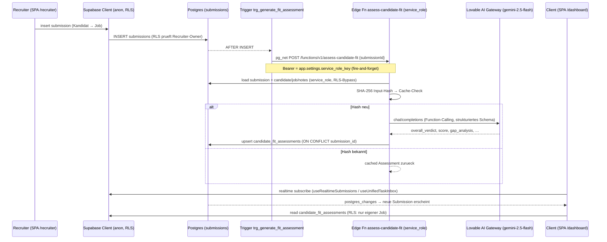

Dieser eine Pfad illustriert alle Domaenen-Bausteine zusammen: RLS-Query (Insert), DB-Trigger via `pg_net`, Service-Role-Edge-Function, Lovable-AI-Gateway, Caching, Upsert und Realtime-Rueckkanal ins Client-Frontend. **Genau hier wird der Publish-Gap sichtbar:** Backend erzeugt das `candidate_fit_assessments`-Ergebnis bereits, das *publizierte* Live-Frontend hat aber keine UI, um es darzustellen.

---

### 1.10 Bekannte Reibungs- & Risikopunkte (Architektur-Ebene)

1. **Publish-Gap (organisatorisch, hoch):** Git-Push/Backend-Migration ≠ Live. "Publish" ist manuell; Live-Frontend laeuft hinter Backend her. Symptom: neue Trigger/Functions feuern produktiv, aber ohne sichtbare UI.
2. **Zwei Git-Linien, ein Backend (hoch):** `hire-speedy-ai` (aktiv) und `matchunt-platform` (eingefroren) teilen `dngycrrhbnwdohbftpzq`. Kein technischer Schutz gegen widerspruechliche Migrationen/Deploys.
3. **`.env` ist eingecheckt (hoch):** `git ls-files .env` → tracked. Enthaelt `VITE_SUPABASE_*` (anon key + URL). Anon-Key ist zwar fuer den Client gedacht (RLS schuetzt), aber das Committen ist ein schlechter Default und maskiert, dass die *echte* Sicherheit komplett auf RLS + `verify_jwt` ruht.
4. **strict-Mode aus, Doku sagt strict (mittel):** `tsconfig*` mit `strict:false`/`noImplicitAny:false`; CLAUDE.md verlangt "keine `any`". Realer Typ-Schutz schwaecher als dokumentiert → latente Laufzeitfehler.
5. **Stripe-Webhook-Fallback ohne Signaturpruefung (mittel):** `supabase/functions/stripe-webhooks/index.ts:26-30` akzeptiert unsignierte Bodies, wenn `STRIPE_WEBHOOK_SECRET` nicht gesetzt ist — bei Fehlkonfiguration faelschbar.
6. **Cron/Trigger abhaengig von DB-Settings (mittel):** `app.settings.supabase_url` / `app.settings.service_role_key` muessen gesetzt sein; fehlen sie nach einem Projekt-/Linien-Wechsel, schlagen Cron- und Fit-Trigger-HTTP-Calls **still** fehl.
7. **Invoke-/Config-Drift (niedrig–mittel):** Frontend ruft `analyze-interview`, `google-auth`, `microsoft-auth` via `functions.invoke()`, doch es gibt **keine** gleichnamigen Function-Ordner → tote/fehlschlagende Calls oder OAuth-Bruch. Umgekehrt fehlt `extract-intake-briefing` als Eintrag in `config.toml` (nutzt damit den `verify_jwt`-Default).
8. **Monolithisches Routing & generierte Riesendatei (niedrig):** `App.tsx` mit ~80 Imports/Routen ohne Lazy-Loading (alles im initialen Bundle); `types.ts` mit 8.684 generierten Zeilen darf nicht von Hand angefasst werden (Regenerations-Konflikte).

---

### 1.11 Offene Fragen

- Loest "Publish" in Lovable einen Voll-Build des aktuellen Git-Heads aus, oder eines internen Lovable-Snapshots? D.h. genuegt ein Klick, um den Gap zu schliessen, oder braucht es vorher einen Sync?
- Existieren `analyze-interview`, `google-auth`, `microsoft-auth` als **deployte** Functions im Supabase-Projekt, obwohl die Quell-Ordner im Repo fehlen (z.B. nur in Lovable angelegt)? Falls nein: Welche Frontend-Flows (OAuth-Login Microsoft/Google, Interview-Analyse) sind aktuell gebrochen?
- Sind die DB-Settings `app.settings.supabase_url` / `app.settings.service_role_key` im aktiven Projekt korrekt gesetzt — laufen Cron-Jobs und der Fit-Trigger real?
- Welches der beiden Repos ist die *kanonische* Quelle fuer Backend-Migrationen? Gibt es einen Prozess, der verhindert, dass `matchunt-platform` versehentlich deployt?
- Ist der Stripe-Webhook in Produktion mit gesetztem `STRIPE_WEBHOOK_SECRET` konfiguriert (sonst greift der unsichere Fallback)?


---

## 02. Datenmodell, RLS & DB-Logik

# 02. Datenmodell, RLS & DB-Logik

> Domänen-Tiefenanalyse für das Matchunt-CTO-Team. Quelle der Wahrheit: `supabase/migrations/*.sql` (93 Dateien), gegengeprüft mit Edge Functions (`supabase/functions/<name>/index.ts`) und Frontend-Zugriffsmustern (`src/hooks/*`, `src/pages/*`). Die ältere `PROJECT_ANALYSIS.md` diente nur als Orientierung.

Das Schema umfasst **~115 Tabellen** plus 2 Views (`candidate_job_overview`, `unified_task_inbox`), ein zentrales Enum (`app_role`), ~25 SECURITY-DEFINER-Funktionen/Trigger-Handler und **4 pg_cron-Jobs**. RLS ist auf praktisch jeder Tabelle aktiviert. Die Architektur folgt einer phasenweisen Migrationsstrategie ("Phase 1 Foundation" → "Phase 4 Enterprise" → Outreach/Trust/Fit-Assessment).

---

## 02.1 Architektur-Grundprinzipien des Datenmodells

Vier Muster ziehen sich durch das gesamte Schema:

1. **`auth.users` als Wurzel-Identität, `user_roles` als Autorisierungs-Quelle.** Personas werden **nicht** über ein Feld in `profiles`, sondern über die separate Tabelle `user_roles` (Enum `app_role`) modelliert — bewusst getrennt aus Sicherheitsgründen (Privilege-Escalation-Schutz). Geprüft wird ausschließlich über die SECURITY-DEFINER-Funktion `has_role(_user_id, _role)` (`20251204171610_*.sql:141`).
2. **`submissions` ist der zentrale Hub.** Fast jede operative Tabelle (interviews, offers, placements, candidate_behavior, deal_health, candidate_fit_assessments, influence_alerts, rejections, match_outcomes …) hängt per FK an `submissions.id`. Eine Submission = genau ein `(job_id, candidate_id)`-Paar (`UNIQUE(job_id, candidate_id)`).
3. **Direkter Tabellenzugriff (RLS-gated) für CRUD + Reads, Edge Functions (Service-Role) für KI/Orchestrierung/3rd-Party.** Das Frontend liest/schreibt die meisten Tabellen direkt via `supabase.from(...)` unter RLS; rechenintensive oder vertrauenswürdige Operationen laufen über ~81 Edge Functions mit `SUPABASE_SERVICE_ROLE_KEY` (umgeht RLS).
4. **„System"-Policies (`WITH CHECK (true)` / `USING (true)`).** 68 Policy-Klauseln erlauben uneingeschränktes Insert/Update — gedacht für Service-Role-Writes (Events, Scores, Fraud, Behavior). Das ist funktional notwendig, aber ein **Härtungsrisiko** (siehe Friction Points).

### Persona → Routing → Datenzugriff

| Persona | Routen-Präfix (`src/App.tsx`) | Guard | Primäre eigene Tabellen (RLS-Owner) |
|---------|------------------------------|-------|-------------------------------------|
| `client` | `/dashboard/*` | `ProtectedRoute allowedRoles={['client']}` (`src/App.tsx:144 ff.`) | `jobs` (client_id), `company_profiles`, `client_verifications`, `offers`, `invoices`, `organizations` |
| `recruiter` | `/recruiter/*` | `allowedRoles={['recruiter']}` (`src/App.tsx:236 ff.`) | `candidates`, `submissions`, `talent_pool`, `recruiter_*`, `payout_requests`, `stripe_accounts`, `recruiter_integrations` |
| `admin` | `/admin/*` | `allowedRoles={['admin']}` | Vollzugriff via `has_role(...,'admin')` auf nahezu alle Tabellen |

---

## 02.2 ER-Überblick der Kern-Entitäten

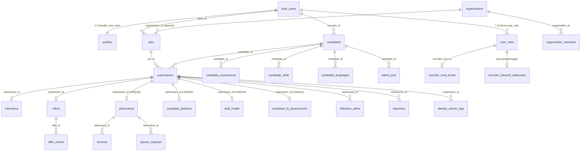

**Kern-Tabellen (markiert):** `candidates`, `jobs`, `submissions`, `candidate_fit_assessments`, `user_roles`, `notifications`. **Unterstützend:** alles andere (Analytics, SLA, Fraud, Outreach, Integrationen, Coaching, Referenzen, Tags, …).

---

## 02.3 Tabellen-Katalog (gruppiert)

### Identität & Autorisierung
| Tabelle | Schlüsselspalten | Beziehungen / Notizen | Migration |
|---------|------------------|-----------------------|-----------|
| `profiles` ★ | `id`, `user_id`→auth.users (UNIQUE), `email`, `bank_iban`, `bank_bic`, `tax_id`, `internal_notes` | 1:1 mit auth.users; auto-erstellt via `handle_new_user()` | `…171610` / Bankdaten `…173818` |
| `user_roles` ★ **Kern** | `user_id`, `role app_role`, `verified`, `UNIQUE(user_id,role)`; später `status`, `suspended_at`, `custom_fee_percentage` | Einzige Autorisierungs-Quelle; gelesen von `has_role()` | `…171610` |
| `company_profiles` | `user_id` (UNIQUE), `company_name`, `culture_values`, `benefits`, `opt_in_message`, `show_*_in_opt_in` | Erweiterte Firmendaten für Opt-In-Anzeige | `…182100`, erweitert `…230322` |
| `client_verifications` | `client_id` (UNIQUE), `terms_accepted`, `contract_signed`, `digital_signature`, `kyc_status` | KYC/KYB-Workflow; admin verifiziert | `…204702` |
| `recruiter_verifications` | recruiter-KYC (analog) | NDA/Vertrag/Profil-Onboarding | `…164340` |
| `organizations`, `organization_members`, `organization_invites`, `permission_definitions` | Team-Accounts mit eigener Rollen-Enum (`owner/admin/hiring_manager/viewer/finance`) | `jobs.organization_id` (optional FK) | `…231510` |

### Kern-Recruiting-Pipeline
| Tabelle | Schlüsselspalten | Notizen | Migration |
|---------|------------------|---------|-----------|
| `jobs` ★ **Kern** | `client_id`, `title`, `company_name`, `skills[]`, `must_haves[]`, `nice_to_haves[]`, `fee_percentage`, `recruiter_fee_percentage`, `status`, `screening_questions JSONB`, `company_size_band`, `funding_stage`, `tech_environment[]`, `hiring_urgency`, `organization_id` | Status-Lebenszyklus `draft → published → …` | `…171610`, Triple-Blind-Felder `…110726` |
| `candidates` ★ **Kern** | `recruiter_id`, `full_name`, `email`, `skills[]`, `cv_url`, `cv_raw_text`, `cv_ai_summary`, `cv_ai_bullets JSONB`, `target_roles/industries/locations JSONB`, `preferred_channel`, `whatsapp_opt_in` | Recruiter-eigene Stammdaten | `…171610`, CV-Felder `…233705` |
| `submissions` ★ **Kern / Hub** | `job_id`, `candidate_id`, `recruiter_id`, `status`, `stage`, `match_score`, **Triple-Blind:** `consent_confirmed`, `identity_unlocked`, `unlocked_at/by`, `company_revealed`, `company_revealed_at`, `full_access_granted`, `full_access_granted_at`, `opt_in_response`; `UNIQUE(job_id,candidate_id)` | **Realtime aktiviert**; zentraler FK-Hub | `…171610`; Blind-Felder `…191207`+`…110726` |
| `candidate_fit_assessments` ★ **Kern** | `submission_id` (UNIQUE), `candidate_id`, `job_id`, `overall_verdict` (strong/good/partial/weak/no_fit), `overall_score 0-100`, `executive_summary`, `requirement_assessments JSONB`, `gap_analysis JSONB`, `dimension_scores JSONB`, `model_used`, `prompt_version` | KI-Fit-Analyse; ersetzt Keyword-Matching; **auto-getriggert** bei Submission-Insert | `20260306000000_candidate_fit_assessments.sql` |
| `interviews` | `submission_id`, `scheduled_at`, `proposed_slots JSONB`, `selection_token` (UNIQUE), `response_token`, `meeting_format`, `client_confirmed`, `candidate_confirmed`, `no_show_reported` | **Realtime**; `candidate_confirmed=true` triggert Triple-Blind Stufe 2 | `…171610`, erweitert `…205344` |
| `offers` | `submission_id`, `job_id`, `candidate_id`, `client_id`, `recruiter_id`, `salary_offered`, `counter_offer_salary`, `negotiation_rounds`, `status`, `access_token` (UNIQUE), `candidate_signature`, `client_signature` | **Realtime**; Token-basierter Public-Zugriff | `…215330` |
| `offer_events` | `offer_id`, `event_type`, `actor_type` | **Realtime**; Audit-Trail | `…215330` |
| `placements` | `submission_id` (UNIQUE), `agreed_salary`, `total_fee`, `platform_fee`, `recruiter_payout`, `escrow_status` (pending/held/released/disputed/refunded) | Erfolgsfall; treibt Finanzen | `…171610`, Escrow `…195741` |
| `rejections` / `rejection_templates` | `submission_id`, `rejection_stage`, `ai_improvement_suggestions JSONB` | Absage-Flow mit KI-Vorschlägen | `…215330` |
| `candidate_conflicts` | `submission_a_id`, `submission_b_id`, `conflict_type`, `severity` | Mehrfachbewerbungs-Erkennung | `…215330` |

### Triple-Blind-Audit & Kommunikation
| Tabelle | Schlüsselspalten | Notizen | Migration |
|---------|------------------|---------|-----------|
| `identity_unlock_logs` | `submission_id`, `action`, `performed_by`, `details JSONB` | Audit-Trail aller Reveal-Aktionen | `…191207` |
| `notifications` ★ **Kern** | `user_id`, `type`, `title`, `related_id`, `related_type`, `is_read` | **Realtime**; `idx_notifications_user_unread` | `…182100` |
| `messages` | `conversation_id`, `sender_id`, `recipient_id`, `job_id`, `candidate_id`, `content`, `is_read` | **Realtime**; `idx_messages_conversation` | `…182100` |
| `communication_log` | `candidate_id`, `submission_id`, `channel`, `message_type`, `links_clicked JSONB` | Omnichannel-Historie (email/sms/whatsapp) | `…215330` |
| `message_templates` / `email_templates` / `email_events` | Vorlagen + Versand-Logging | seed: Opt-In/Interview/Offer-Mails | `…215330`, `…193757` |

### Influence-Engine & Coaching
| Tabelle | Schlüsselspalten | Notizen | Migration |
|---------|------------------|---------|-----------|
| `candidate_behavior` | `submission_id` (UNIQUE), `confidence_score`, `interview_readiness_score`, `closing_probability` (alle 0-100, CHECK), `engagement_level`, `hesitation_signals JSONB` | **Realtime**; KI-Engagement-Scoring | `…212224` |
| `influence_alerts` | `submission_id`, `recruiter_id`, `alert_type` (15-Wert-CHECK), `priority`, `recommended_action`, `playbook_id`, `snoozed_until`, `impact_score` | **Realtime**; **partieller UNIQUE-Index** verhindert Duplikate (`…task_inbox`) | `…212224` |
| `coaching_playbooks` | `trigger_type` (11-Wert-CHECK), `phone_script`, `email_template`, `whatsapp_template`, `talking_points JSONB`, `objection_handlers JSONB` | 11 vorseedete Sales-Playbooks (DE) | `…212224` |
| `recruiter_influence_scores` | `recruiter_id` (UNIQUE), `influence_score 0-100`, `opt_in_acceleration_rate`, `closing_speed_improvement` | Stündlich neu berechnet (cron) | `…212224` |
| `recruiter_tasks` | `recruiter_id`, `task_type`, `due_at`, `source` (manual/system/sequence/sla), `related_alert_id`, `playbook_id` | **Realtime**; Teil der `unified_task_inbox`-View | `…230322`, erweitert `…task_inbox` |

### Recruiter-Trust-System (Activation-Gate)
| Tabelle | Schlüsselspalten | Notizen | Migration |
|---------|------------------|---------|-----------|
| `recruiter_trust_levels` | `recruiter_id` (UNIQUE), `trust_level` (bronze/silver/gold/suspended), `activation_ratio`, `max_active_slots`, `placements_hired` | Bestimmt, wie viele Jobs ein Recruiter parallel aktivieren darf | `20260302160000_recruiter_trust_system.sql` |
| `recruiter_job_activations` | `recruiter_id`, `job_id`, `UNIQUE`, `has_submitted`, `first_submission_at` | Trigger erhöht Counter; Bulk-Detection (>5/h → fraud_signal) | dito |

### Finanzen
| Tabelle | Schlüsselspalten | Notizen | Migration |
|---------|------------------|---------|-----------|
| `invoices` | `placement_id`, `client_id`, `invoice_number` (UNIQUE), `stripe_invoice_id`, `total_amount`, `status` | Client-Rechnungen | `…182100`, Stripe `…195741` |
| `payout_requests` | `placement_id`, `recruiter_id`, `amount`, `status` (6-Wert-CHECK), `stripe_transfer_id`, `approved_by` | Recruiter-Auszahlung mit Admin-Approval | `…195741` |
| `stripe_accounts` | `user_id`, `stripe_account_id` (UNIQUE), `payouts_enabled`, `onboarding_complete` | Stripe Connect (Express) | `…195741` |
| `payment_events` | `stripe_event_id` (UNIQUE), `event_type`, `payload JSONB`, `processed` | Idempotenter Webhook-Store | `…195741` |

### Analytics, SLA, Risiko & Behavior
| Tabelle | Notiz | Migration |
|---------|-------|-----------|
| `funnel_metrics`, `recruiter_leaderboard`, `employer_scores`, `employer_feedback` | Aggregierte KPIs (täglich/periodisch via cron-Funktion) | `…230322` |
| `deal_health` | `submission_id` (UNIQUE), `health_score 0-100`, `risk_level`, `bottleneck`, `recommended_actions JSONB` | KI-Deal-Monitoring | `…204702` |
| `sla_rules` / `sla_deadlines` | 5 vorseedete Regeln; Deadline-Tracking + Eskalation | `…204702` |
| `user_behavior_scores` | `user_id` (UNIQUE), `ghost_rate`, `sla_compliance_rate`, `risk_score`; speist Trust-Level | `…204702` |
| `platform_events` | Event-Engine (`event_type`, `ip_address`, `user_agent` für Anti-Fraud) | `…204702` |
| `fraud_signals` | `signal_type`, `severity`, `confidence_score`, `status`; bewirkt Trust-Suspension | `…204702` |

### Matching-Infrastruktur & ML
| Tabelle | Notiz | Migration |
|---------|-------|-----------|
| `matching_config` | versionierte Gewichte/Gates als JSONB; `UNIQUE(active) WHERE active` (nur 1 aktiv) | `…030355` |
| `skill_taxonomy` | kanonische Skills + `aliases[]` (GIN-Index) + `transferability_from JSONB` | `…030355` |
| `skill_synonyms` | bidirektionale Synonyme (seed: js↔javascript …) | `…144038` |
| `tech_domains` | 14 Domänen mit `transferable_to[]` / `incompatible_with[]` (z.B. embedded ✗ frontend) | `…144038` |
| `match_outcomes` / `match_recommendations` | ML-Feedback-Loop: predicted vs. actual outcome | `…030355` |
| `embedding_queue`, `ml_training_events` | Vektor-/Trainings-Pipeline | diverse |

### Sub-Profile, Referenzen, Outreach, Integrationen
- **Kandidaten-Sub-Tabellen:** `candidate_experiences`, `candidate_educations`, `candidate_skills`, `candidate_languages`, `candidate_projects`, `candidate_documents`, `candidate_notes`, `candidate_comments`, `candidate_ai_assessment`, `candidate_client_summary`, `candidate_interview_notes`, `candidate_activity_log`, `candidate_risk_reports`, `candidate_tags`/`candidate_tag_assignments` — alle FK auf `candidates.id` (CASCADE).
- **Referenzen:** `reference_requests` (Token), `reference_responses` (1-5-Ratings + `ai_summary`, `ai_risk_flags JSONB`).
- **Talent-Pool:** `talent_pool` (`UNIQUE(candidate_id, recruiter_id)`), `talent_alerts`.
- **Outreach (~15 Tabellen):** `outreach_companies`, `outreach_leads`, `outreach_campaigns`, `outreach_sequences`, `outreach_emails`, `outreach_send_queue`, `outreach_suppression_list`, `outreach_rate_limits`, `outreach_reply_classifications`, `outreach_winning_patterns`, … (Admin-Outreach-Modul).
- **Integrationen:** `integrations` + `integration_mappings` + `integration_sync_log` (Org-ATS, Personio/Greenhouse/…), `recruiter_integrations` + `oauth_states` (per-Recruiter CRM-OAuth/PKCE), `user_integrations`.
- **Email-Ingestion:** `recruiter_inbound_addresses` (auto-seed `r_<8hex>@inbound.matchunt.ai`), `candidate_import_jobs` (State-Machine für CV-Mail-Import).

### GDPR & Compliance
`consents` (subject_type/id, granted, ip, user_agent), `data_export_requests`, `data_deletion_requests` (mit `confirmation_token`), `activity_logs`, `identity_unlock_logs`.

---

## 02.4 RLS-Muster (sicherheitsrelevant)

Es gibt **fünf wiederkehrende Policy-Archetypen**. 103 Policy-Klauseln nutzen `has_role(auth.uid(), 'admin')`.

### A) Owner-basiert (Selbst-Zugriff)
```sql
-- profiles, candidates, jobs, stripe_accounts, recruiter_integrations …
USING (auth.uid() = user_id)        -- bzw. = recruiter_id / = client_id
```
Beispiel `jobs`: `"Clients can manage their own jobs" … USING (auth.uid() = client_id)` (`…171610:191`).

### B) Beziehungs-basiert (Join über submissions → jobs)
Das **wichtigste Muster** für die Triple-Blind-Pipeline. Client sieht Submission-bezogene Daten nur, wenn er Owner des zugehörigen Jobs ist; Recruiter nur, wenn er Owner der Submission ist:
```sql
-- z.B. interviews, deal_health, candidate_comments, candidate_fit_assessments
USING (EXISTS (
  SELECT 1 FROM submissions s JOIN jobs j ON j.id = s.job_id
  WHERE s.id = <table>.submission_id
    AND (s.recruiter_id = auth.uid() OR j.client_id = auth.uid())
))
```
(`…171610:227` interviews, `…204702:33` deal_health, `20260306000000:66` fit_assessments.)

### C) Rollen-basiert (Persona-weit)
```sql
-- recruiter_leaderboard, employer_scores, skill_taxonomy …
USING (has_role(auth.uid(), 'recruiter'))   -- alle Recruiter sehen Leaderboard
USING (active = true)                        -- öffentliche Lookup-Tabellen
```

### D) System/Service-Role (permissiv)
```sql
-- candidate_behavior, deal_health, fraud_signals, platform_events, match_outcomes …
CREATE POLICY "System can insert …" FOR INSERT WITH CHECK (true);
CREATE POLICY "System can update …" FOR UPDATE USING (true);
```
68 solcher Klauseln. Notwendig, weil Edge Functions mit Service-Role schreiben — **aber** mehrere davon (`candidate_conflicts`, `integration_mappings`, `recruiter_trust_levels`, `recruiter_job_activations`) sind `FOR ALL USING (true)`, was theoretisch jedem authentifizierten Client Schreibzugriff gäbe, falls die Tabelle je direkt aus dem Frontend angesprochen würde.

### E) Token-basiert (Public/Anonym)
Für externe Magic-Links ohne Login:
```sql
-- offers: "Public can view offers by token" … USING (access_token IS NOT NULL)   (…215330:177)
-- reference_requests / organization_invites: USING (true)  → "Anyone can view by token"
```
**Sicherheitsrelevant:** Diese Policies erlauben jedem **jede Zeile** zu lesen (die Geheimhaltung liegt allein im nicht-erratbaren Token, das die App in der `.eq('access_token', …)`-Query mitgibt). Bei `offers` bedeutet `USING (access_token IS NOT NULL)`, dass ein anonymer Nutzer per `select` ohne Token-Filter **alle** Offers mit gesetztem Token enumerieren könnte → siehe Friction Points.

### Triple-Blind = RLS + Trigger-gesteuerte Spalten
Die eigentliche Anonymisierung ist **nicht** rein in RLS gelöst, sondern in der Frontend-Anonymisierungs-Schicht (`src/lib/anonymization.ts`) plus Statusflags auf `submissions`, die durch Trigger gesetzt werden (s. 02.5). RLS gewährt zwar Zeilenzugriff, aber das UI blendet PII bis `company_revealed` / `full_access_granted` aus. **Das ist ein Defense-in-Depth-Gap:** ein technisch versierter Client mit Direct-API-Zugriff sieht via RLS bereits Kandidaten-PII (`candidates`-Join über fit_assessments/experiences), bevor das Opt-In erfolgt ist (siehe Friction Points, High).

---

## 02.5 DB-Funktionen, Trigger & der Triple-Blind-Automat

### SECURITY-DEFINER-Kernfunktionen
| Funktion | Zweck | Aufgerufen von |
|----------|-------|----------------|
| `has_role(_user_id UUID, _role app_role)` | zentraler Autorisierungs-Check, `STABLE`, `SET search_path=public` | 103 RLS-Policies |
| `get_user_role(_user_id)` | erste Rolle eines Users | Frontend-Hooks |
| `handle_new_user()` | erstellt `profiles` + `user_roles` aus `raw_user_meta_data` | Trigger `on_auth_user_created` AFTER INSERT auf `auth.users` |
| `update_updated_at()` / `update_updated_at_column()` | Timestamp-Pflege (zwei Varianten existieren — s. Friction Points) | ~20 BEFORE-UPDATE-Trigger |
| `ensure_trust_level_exists` / `recalculate_trust_level` / `recalculate_all_trust_levels` | Trust-Gate-Logik | Trigger + cron |
| `auto_create_inbound_address()` | seedet Inbound-Mail pro neuem Recruiter | Trigger `on_recruiter_role_created` auf `user_roles` |
| `cleanup_expired_oauth_states()` | PKCE-State-GC | manuell/cron |

### Triple-Blind-Trigger-Kette (USP-kritisch)

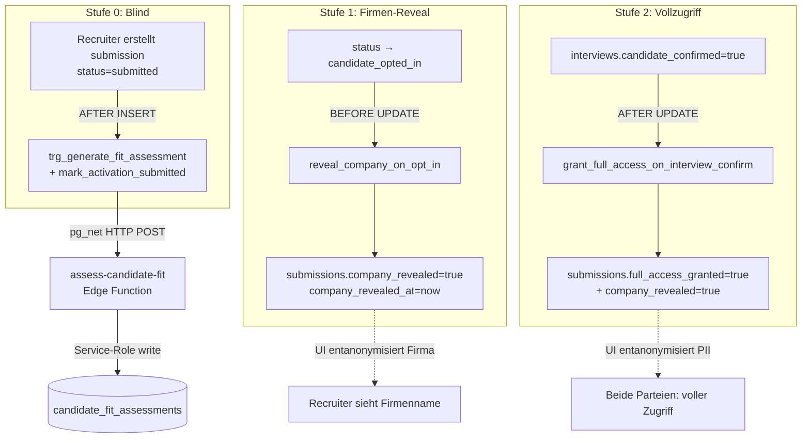

- **Stufe 1** (`reveal_company_on_opt_in`, `…110726:20`): `BEFORE UPDATE` auf `submissions`. Sobald `status='candidate_opted_in'`, wird `company_revealed=true` gesetzt → Recruiter darf den anonymisierten Firmennamen sehen.
- **Stufe 2** (`grant_full_access_on_interview_confirm`, `…110726:44`): `AFTER UPDATE` auf `interviews`. Wenn der Kandidat das Interview bestätigt (`candidate_confirmed`), wird per Cross-Table-`UPDATE` `full_access_granted=true` auf die zugehörige Submission gesetzt.
- **Auto-Fit-Assessment** (`trigger_generate_fit_assessment`, `20260307000000_*.sql`): `AFTER INSERT` auf `submissions`. Feuert **fire-and-forget** via `pg_net` (`net.http_post`) die Edge Function `assess-candidate-fit` mit `{submissionId}`. Nutzt `current_setting('app.settings.supabase_url'/'service_role_key')` (DB-GUCs). Damit ist das Assessment fertig, bevor der Client die Seite öffnet.
- **Trust/Fraud-Trigger** (`recruiter_trust_system`): `mark_activation_submitted` (Submission-Insert → Counter), `on_job_activation` + `check_bulk_activation` (Activation-Insert → bei >5/h `fraud_signals`-Insert).

### pg_cron-Jobs (`20260225200000_unified_task_inbox.sql:133 ff.`)
| Job | Cron | Ziel-Edge-Function |
|-----|------|--------------------|
| `influence-engine-run` | `*/15 * * * *` | `influence-engine` |
| `escalation-engine-run` | `*/5 * * * *` | `escalation-engine` |
| `influence-score-calc` | `0 * * * *` (stündlich) | `calculate-influence-score` |
| `cleanup-expired-alerts` | `0 3 * * *` (täglich) | reines SQL (dismisst abgelaufene `influence_alerts`) |

Alle HTTP-Jobs rufen via `net.http_post` mit Service-Role-Bearer ihre Edge Function auf — d.h. **DB-Cron → pg_net → Edge Function → DB-Write** ist das durchgängige Orchestrierungsmuster.

---

## 02.6 Vernetzung: Frontend → Edge Function → Tabellen

Die meisten Schreib-/Leseoperationen laufen **direkt** unter RLS (Top-Tabellen nach Direktzugriff: `submissions` 58×, `interviews` 32×, `jobs` 30×, `candidates` 19×, `influence_alerts` 17×). Edge Functions kapseln KI/3rd-Party/Privileged-Logik.

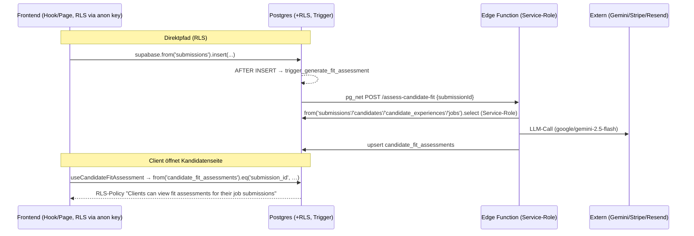

### Wichtigste Function ↔ Tabellen-Kopplungen
| Edge Function | Frontend-Aufrufer | Liest | Schreibt |
|---------------|-------------------|-------|----------|
| `assess-candidate-fit` | `useCandidateFitAssessment.ts:145` (+ DB-Trigger) | `submissions`, `candidates`, `candidate_experiences/languages/skills`, `candidate_interview_notes`, `candidate_ai_assessment`, `jobs` | `candidate_fit_assessments` |
| `calculate-match-v3-1` | `useMatchScoreV3*` | `jobs`, `candidates`, `tech_domains`, `skill_synonyms`, `matching_config` | `match_outcomes`, `submissions.match_score` |
| `schedule-interview` (7 Aufrufe!) | Interview-Dialoge | `submissions`, `interviews` | `interviews`, `notifications`, `communication_log` |
| `client-candidate-summary` | `useClientCandidateSummary.ts` | `candidates` + Sub-Tabellen | `candidate_client_summary` |
| `influence-engine` (cron) | — | `submissions`, `candidate_behavior`, `sla_deadlines` | `influence_alerts` |
| `escalation-engine` (cron) | — | `sla_deadlines`, `sla_rules` | `notifications`, `influence_alerts` |
| `process-payout` | RecruiterPayouts | `payout_requests`, `placements`, `stripe_accounts` | `payout_requests`, Stripe-Transfer |
| `stripe-webhooks` | — (Webhook) | `payment_events` | `invoices`, `placements`, `payment_events` |
| `gdpr-deletion` / `gdpr-export` | DataPrivacy-Hub | viele | `data_deletion_requests` / `data_export_requests` |
| `process-candidate-email` / `process-candidate-import` | Inbound-Mail-Webhook | `recruiter_inbound_addresses`, `candidate_import_jobs` | `candidates` + Sub-Tabellen, `candidate_notes` |

---

## 02.7 Indizes (Auswahl, performancerelevant)
- **Hot-Path-Filter:** `idx_submissions_company_revealed` / `idx_submissions_full_access` (partiell, `WHERE … = true`), `idx_notifications_user_unread`, `idx_messages_conversation`.
- **Dedup-Constraint:** `idx_influence_alerts_active_unique` — **partieller UNIQUE** `(submission_id, alert_type) WHERE action_taken IS NULL AND is_dismissed=false`: verhindert Alert-Spam.
- **Matching:** `idx_skill_taxonomy_aliases` (GIN auf `aliases[]`), `idx_matching_config_active` (partieller UNIQUE — nur 1 aktive Config).
- **Mail-Matching:** `idx_candidates_email_recruiter`, `idx_candidates_phone_recruiter` (partiell `WHERE phone IS NOT NULL`).
- **Finanz/Fraud:** `idx_payout_requests_status`, `idx_fraud_signals_status (status,severity)`, `idx_deal_health_risk (risk_level,health_score)`.

---

## 02.8 Reibungs- & Risikopunkte (im Code beobachtet)

1. **[HIGH] Triple-Blind ist UI-erzwungen, nicht RLS-erzwungen.** RLS für `candidates`-Joins (z.B. `candidate_fit_assessments`, `candidate_experiences` via `…fix_candidate_experiences_rls_and_seed.sql`) gibt Clients Zeilenzugriff auf Kandidatendaten, **sobald eine Submission existiert** — unabhängig von `company_revealed`/`full_access_granted`/`identity_unlocked`. Die Anonymisierung passiert in `src/lib/anonymization.ts` clientseitig. Ein Client, der die Supabase-API direkt anspricht, kann PII vor dem Opt-In abgreifen. → Stufen-Flags in die RLS-Policies aufnehmen oder PII-Felder erst per Edge Function nach Reveal ausliefern.

2. **[HIGH] `offers`-Token-Policy erlaubt Enumeration.** `"Public can view offers by token" USING (access_token IS NOT NULL)` (`…215330:177`) filtert nicht auf einen konkreten Token. Ein anonymer `select('*')` ohne `.eq('access_token', …)` liefert **alle** token-behafteten Offers inkl. Gehältern/Signaturen zurück. Gleiches Muster bei `reference_requests`/`organization_invites` (`USING (true)`). → Token-Vergleich in die Policy ziehen oder ausschließlich über eine SECURITY-DEFINER-RPC mit Token-Argument ausliefern.

3. **[HIGH] Vertauschte `has_role`-Argumente in OAuth-Policy.** In `20260224150000_oauth_integrations.sql:101` lautet die Admin-Policy `has_role('admin', auth.uid())` — Signatur ist aber `has_role(_user_id UUID, _role app_role)`. Es gibt **keine** überladene Variante (`grep` bestätigt nur eine Signatur). Effekt: `'admin'` wird als UUID gecastet (Laufzeitfehler oder immer-false), die Policy greift nie → Admins können `recruiter_integrations` über diese Policy nicht lesen. Funktional maskiert durch die zusätzliche `"Service role manages integrations" USING(true)`-Policy, die zugleich aber jedem Zugriff gewährt. → Argumente korrigieren **und** die `USING(true)`-Service-Policy entschärfen.

4. **[MEDIUM] Permissive `FOR ALL USING(true)`-Policies auf sensiblen Tabellen.** `recruiter_trust_levels`, `recruiter_job_activations`, `candidate_conflicts`, `integration_mappings` tragen `FOR ALL USING(true)` (für Trigger/Service-Role gedacht). Da RLS für `authenticated` gilt, könnte ein Client diese Tabellen direkt manipulieren (z.B. eigenen Trust-Level auf `gold` setzen, `max_active_slots` erhöhen). → Auf `service_role`-spezifische Policies umstellen bzw. Writes nur über SECURITY-DEFINER-Funktionen.

5. **[MEDIUM] `app.settings.*`-GUCs als implizite Abhängigkeit.** Drei Migrationen (`…task_inbox`, `…221420`, `…fit_assessment_auto_trigger`) und alle cron-Jobs lesen `current_setting('app.settings.supabase_url')` und `…service_role_key`. Diese GUCs müssen außerhalb der Migrationen (per `ALTER DATABASE … SET`) gesetzt sein. Fehlen sie, scheitern Trigger und Cron **still** (pg_net fire-and-forget wirft keinen sichtbaren Fehler) → Auto-Fit-Assessment und Influence-Engine laufen leer. Nicht im Repo dokumentiert. → Bootstrap-Migration + Runbook ergänzen.

6. **[MEDIUM] Zwei `updated_at`-Funktionen nebeneinander.** `update_updated_at()` (Basis, `…171610`) und `update_updated_at_column()` (`…203625` u.a.) existieren parallel; neuere Tabellen (`tech_domains`, `skill_synonyms`) hängen an `…_column`. Reine Redundanz/Verwechslungsgefahr, aber keine Funktionslücke (beide Migrationen sind nach der Definition datiert). → Auf eine Funktion konsolidieren.

7. **[MEDIUM] `submissions.status` / `stage` sind freie TEXT-Felder ohne CHECK.** Die Triple-Blind-Trigger hängen an Magic-Strings (`'candidate_opted_in'`, `'hired'`). Ein Tippfehler im Frontend oder einer Edge Function setzt den Status, ohne den Trigger auszulösen — der Reveal bleibt aus, ohne Fehler. `interviews.status`, `jobs.status`, `offers.status` ebenso ungetypt. → Enum oder CHECK-Constraints einführen, Status-Übergänge zentralisieren.

8. **[LOW] `candidate_fit_assessments` als KI-Single-Source vs. Legacy-Matching.** Es koexistieren `match_outcomes`/`match_recommendations` (v1–v3.1) **und** `candidate_fit_assessments` (neu). `submissions.match_score` (INTEGER) wird parallel gepflegt. Welche Quelle das UI primär nutzt, ist verteilt (mehrere `useMatchScore*`-Hooks + `useCandidateFitAssessment`). → Matching-Strategie konsolidieren, Legacy-Pfade deprecaten.

9. **[LOW] Seed-Testdaten mit festen UUIDs in Produktionsmigration.** `…fix_candidate_experiences_rls_and_seed.sql` löscht/inserted Demo-Kandidaten (`aaaa1111-…`) in derselben Migration wie eine RLS-Policy. Mischung aus Schema und Fixtures erschwert saubere Prod-Deploys. → Seeds in separate, nicht-prod-Migration/Seeder auslagern.

---

## 02.9 Offene Fragen
- Werden die `app.settings.supabase_url` / `app.settings.service_role_key` GUCs in der gemanagten Supabase-Instanz tatsächlich gesetzt? Falls nein, laufen Auto-Fit-Assessment + alle Cron-Engines ins Leere.
- Ist der Direkt-API-Zugriff für `client`/`recruiter` auf die Supabase-REST/GraphQL-Schicht in Produktion offen (anon key im Frontend)? Davon hängt die reale Schwere von Friction #1/#2/#4 ab.
- Gibt es eine bewusste Entscheidung, Triple-Blind clientseitig statt per RLS durchzusetzen (Performance? Recruiter-Workflows?), oder ist es technische Schuld?
- `submissions.match_score` vs. `candidate_fit_assessments.overall_score`: Welcher Wert ist für Ranking/Sortierung autoritativ?
- Wie werden verwaiste „System"-Inserts (z.B. `candidate_behavior` ohne gültige Submission durch `WITH CHECK(true)`) verhindert — gibt es Integritäts-Jobs?
- Existiert ein Backfill/Reconciliation für `recruiter_trust_levels`, wenn `recalculate_all_trust_levels` (cron-pfad) nicht verdrahtet ist? (kein cron-Eintrag dafür gefunden.)


---

## 03. Triple-Blind Anonymisierung

> Kern-USP der Plattform. Diese Sektion reverse-engineert den Triple-Blind-Mechanismus end-to-end aus dem Quellcode (Stand: Branch `main`, ~81 Edge Functions / 93 Migrationen). **Quellcode = Wahrheit**, nicht das Marketing.

### 0. Executive Summary (TL;DR)

Der "Triple-Blind" ist **konzeptionell drei-seitig**, aber **technisch nur kosmetisch** umgesetzt:

1. **Kandidat ↔ Client** (Identität des Kandidaten vor dem Unternehmen verborgen) — gesteuert über `submissions.identity_unlocked`.
2. **Client ↔ Recruiter** (Firmenname vor dem Recruiter verborgen) — gesteuert über `submissions.company_revealed` / `full_access_granted` (2-Stufen-Reveal).
3. **Recruiter ↔ Kandidat** — existiert NICHT als Blind: der Recruiter *besitzt* den Kandidaten (`candidates.recruiter_id = auth.uid()`) und sieht alle Klardaten. Der "dritte Blind" im Marketing ist faktisch der Client→Recruiter-Firmenblind.

**Die entscheidende Erkenntnis:** Die Anonymisierung passiert fast ausschließlich **client-seitig im Browser** (`src/lib/anonymization.ts`, `useClientCandidateView.ts`) bzw. **im AI-Prompt** (`client-candidate-summary`, `format-job-for-recruiters`). Die zugrundeliegende **RLS liefert die Klardaten (`full_name`, `email`, `phone`, `company_name`) ungefiltert an den Browser aus**. Jeder mit DevTools / Network-Tab sieht die "verborgenen" Daten sofort. Der Blind ist eine UI-Konvention, keine Sicherheitsgrenze.

---

### 1. Datenmodell & Reveal-Flags

Alle Reveal-Zustände hängen an der `submissions`-Tabelle. Es existieren **zwei parallele, teils redundante Flag-Familien** (historisch gewachsen):

| Spalte | Tabelle | Richtung | Gesetzt von | Bedeutung |
|---|---|---|---|---|
| `identity_unlocked` | `submissions` | Kandidat→Client | `useIdentityUnlock.respondToOptIn/adminOverride`, `process-interview-response` | Klar­name/Kontakt des Kandidaten für Client sichtbar |
| `identity_unlocked_at` | `submissions` | — | `process-interview-response:147` | Zeitstempel (Achtung: Migration nennt die Spalte `unlocked_at`) |
| `unlocked_at` / `unlocked_by` | `submissions` | — | `useIdentityUnlock.ts:83-84` | Audit: wann/von wem entsperrt |
| `identity_revealed` / `revealed_at` | `submissions` | Kandidat→Client (Legacy) | `process-talent-hub-action:136` (`confirm_opt_in`) | **Zweites, paralleles** Reveal-Flag (Migration `20260113233137`) |
| `opt_in_requested_at` | `submissions` | Client→Recruiter | `useIdentityUnlock.requestOptIn` | Client hat Opt-In angefragt |
| `opt_in_response` | `submissions` | — | `useIdentityUnlock` (`pending`/`approved`/`denied`/`admin_override`) | Antwortstatus |
| `consent_confirmed` / `consent_document_url` / `consent_confirmed_at` | `submissions` | DSGVO | **Niemand** (vestigial, Migration `20251204191207`) | Geplante Consent-Doku — wird im Code **nie geschrieben** |
| `company_revealed` / `company_revealed_at` | `submissions` | Client→Recruiter | Trigger `reveal_company_on_opt_in`, `process-interview-response`, `schedule-interview` | Firmenname für Recruiter sichtbar (Stufe 1) |
| `full_access_granted` / `full_access_granted_at` | `submissions` | Client→Recruiter | Trigger `grant_full_access_on_interview_confirm`, `process-interview-response` | Voller Firmenzugriff (Stufe 2) |
| `interviews.pending_opt_in` | `interviews` | — | `process-talent-hub-action`, `process-interview-response` | Interview wartet auf Kandidaten-Opt-In |
| `interviews.candidate_confirmed` | `interviews` | Trigger-Input | `schedule-interview`, `process-interview-response` | Triggert Stufe-2-Reveal |

Audit: Tabelle `identity_unlock_logs` (Migration `20251204191207`) protokolliert `opt_in_requested`, `opt_in_approved/denied`, `admin_override` via `useIdentityUnlock.logUnlockAction`.

Migrationen:
- `supabase/migrations/20251204191207_17d644bc...sql` — `consent_*`, `identity_unlocked`, `unlocked_*`, `opt_in_*`, `identity_unlock_logs`
- `supabase/migrations/20260113233137_c0347133...sql` — `identity_revealed`/`revealed_at`, `interviews.pending_opt_in`, RLS „Clients can view revealed submissions"
- `supabase/migrations/20260122110726_906435bc...sql` — 2-Stufen-Reveal (`company_revealed`, `full_access_granted`) + Trigger + `jobs.company_size_band/funding_stage/hiring_urgency/tech_environment`

---

### 2. Was ist für wen, in welcher Phase, maskiert?

#### 2a. Kandidaten-Daten vor dem CLIENT

Zentrale Anwendung der Regeln: `src/hooks/useClientCandidateView.ts` (laut Kommentar „die EINZIGE Quelle für Kandidatendaten in Client-Ansichten" — de facto aber nicht, s.u. Reibungspunkte).

| Feld | Vor Reveal (`identity_unlocked=false`) | Nach Reveal | Maskierung in |
|---|---|---|---|
| Name | `Kandidat #<8 Hex>` (`generateAnonymousId`) | `full_name` | `useClientCandidateView.ts:376` |
| E-Mail / Telefon | `null` | Klartext | `useClientCandidateView.ts:441-442` |
| CV-URL / LinkedIn | `null` | Klartext | `useClientCandidateView.ts:443-444` |
| Stadt → Region | `anonymizeRegionBroad(city)` z.B. „Süddeutschland" | `city` | `anonymization.ts:8`, `useClientCandidateView.ts:393` |
| Erfahrung (Jahre) | Range `anonymizeExperience` z.B. „6-10 Jahre" | exakte Jahre | `anonymization.ts:78` |
| Gehalt | 10k-Range `anonymizeSalary` z.B. „€60k - €70k" | (bleibt Range) | `anonymization.ts:87` |
| Skills | **immer sichtbar** | immer | — |
| Zertifikate/Sprachen/Branchen/Zielrollen | immer sichtbar | immer | `useClientCandidateView.ts:402-408` |
| Arbeitgeber-Historie (Firmennamen) | nur via AI-Summary anonymisiert (Branche statt Name) | echte `company_name` (RLS offen!) | `client-candidate-summary:306-313` |

**Achtung:** Skills, Zertifikate, Branchenerfahrung und Zielrollen werden **vor** dem Reveal vollständig gezeigt — bei seltenen Skill-Kombinationen (z.B. „COBOL + Rust + 15 Jahre, Region Ostdeutschland") ist Re-Identifikation trivial. Der Blind schützt den *Namen*, nicht zwingend die *Identität*.

#### 2b. Client-/Firmen-Daten vor dem RECRUITER (2-Stufen-Reveal)

| Phase | Trigger | `company_revealed` | `full_access_granted` | Recruiter sieht |
|---|---|---|---|---|
| Stufe 0 (default) | Job published | `false` | `false` | `formatAnonymousCompany(...)` z.B. `[FinTech \| 200–500 MA \| Series B \| React/Node \| Hybrid München]` |
| Stufe 1 | Status→`candidate_opted_in` (Trigger `reveal_company_on_opt_in`) | `true` | `false` | `company_name` (Klartext) + Pitch |
| Stufe 2 | Interview bestätigt (`interviews.candidate_confirmed=true`, Trigger `grant_full_access_on_interview_confirm`) | `true` | `true` | „Voller Zugriff" (`CompanyRevealBadge`) |

Maskierung: `src/lib/anonymousCompanyFormat.ts` (`formatAnonymousCompany`, `getDisplayCompanyName`), UI `src/components/recruiter/CompanyRevealBadge.tsx`, `AnonymousCompanyPitch.tsx`.
Anwendung in: `src/pages/recruiter/RecruiterJobs.tsx:551,778`, `src/pages/recruiter/JobDetail.tsx:346`, `src/pages/recruiter/SubmissionDetail.tsx:336`.

Die kontextreiche anonyme Firmenbeschreibung wird zusätzlich AI-generiert in `format-job-for-recruiters` (Feld `formatted_content.anonymous_company_pitch`) und in `jobs.formatted_content` persistiert.

#### 2c. Was sieht der ADMIN

Voller Zugriff über `has_role(auth.uid(),'admin')`-Policies auf allen Tabellen (`candidates`, `submissions`, Storage). `src/pages/admin/AdminCandidates.tsx` zeigt `full_name`, `email`, `phone`, Duplikat-Erkennung per E-Mail, und kann via `useIdentityUnlock.adminOverride` jede Identität manuell entsperren (Audit in `identity_unlock_logs`).

---

### 3. Die drei Schlüssel-Edge-Functions

| Function | Aufruf von | Liest | Schreibt | Anonymisierung |
|---|---|---|---|---|
| `client-candidate-summary` | `useClientCandidateSummary.generateSummary` (`:145`), `useExposeData` (`:168`) | `candidates`, `candidate_experiences`, `candidate_interview_notes`, `candidate_ai_assessment`, `candidate_behavior`, `submissions→jobs` (Service-Role!) | `candidate_client_summary` (upsert) | **Kern der Anonymisierung**: strenge System-Prompt-Regeln (`index.ts:213-267`) — kein Name, kein „er/sie", kein Arbeitgeber-Name, keine Stadt; Firmen→Branchen-Hint (`:306-313`); Region nur „angegeben/nicht angegeben" (`:291`). Smart-Caching via `generated_at` vs. `updated_at` (`:181-201`). |
| `candidate-retrieval` | (kein direkter Frontend-Invoke gefunden — Backend/Matching-intern) | `candidates` (volle PII inkl. `email`, `address_lat/lng`), `jobs.embedding`, RPC `search_candidates_hybrid` | — | **KEINE** — liefert `fullName`, `email`-Selektion roh zurück (`RetrievalResult.fullName`, `:267`). Reines internes Retrieval/Ranking; Output ist *nicht* für Clients gedacht, enthält aber Klardaten. |
| `candidate-summary` | **kein Caller im Frontend** (orphaned/legacy) | erhält `candidate`+`job` im Body | — | **KEINE Anonymisierung**: Prompt verwendet `candidate.full_name`, `candidate.email`, `current_salary` direkt (`index.ts:34-37`). Würde, falls jemals von Client-Pfad genutzt, PII an die AI leaken. |

> **Wichtig:** Trotz ähnlicher Namen ist **`candidate-summary` ≠ `client-candidate-summary`**. Ersteres ist ein anonymisierungs­freier Legacy-Wrapper (keine Referenzen im `src/`-Tree), letzteres die produktive, streng anonymisierte Client-Summary. Score-Generierung wurde bewusst entfernt (`model_version: "v4-no-score"`), V3.1-Match-Engine ist „single source of truth".

---

### 4. Datenfluss: Reveal-Sequenz (end-to-end)

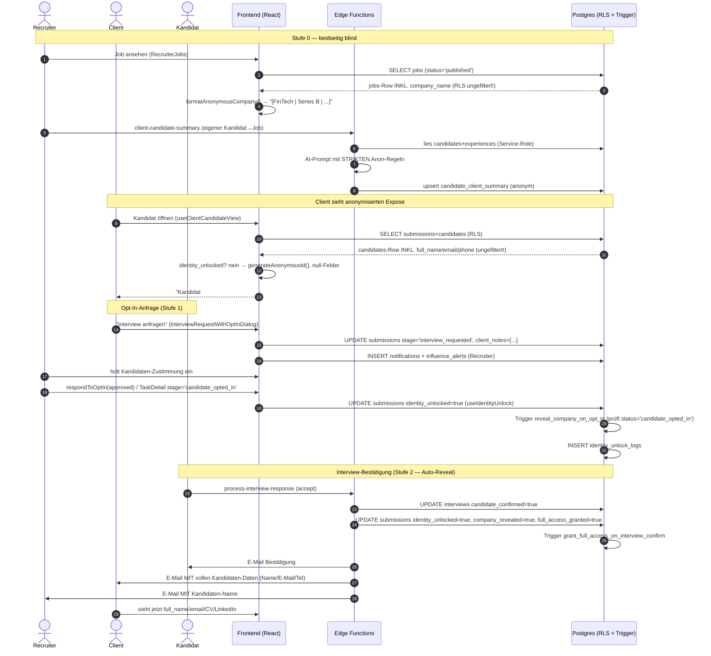

---

### 5. Wo bricht / leakt der Blind? (Datenfluss-Architektur)

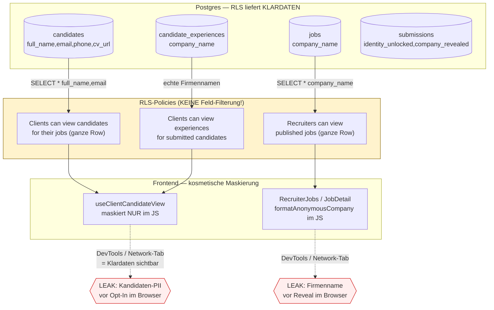

---

### 6. Reibungspunkte & Risiken (im Code verifiziert)

#### 6.1 KRITISCH — Client→Kandidat: RLS liefert volle PII, Blind nur im Browser
`supabase/migrations/20251212165255_...sql:2` (`"Clients can view candidates for their jobs"`) gewährt dem Client `SELECT` auf die **gesamte `candidates`-Row** (inkl. `full_name`, `email`, `phone`, `cv_url`, `linkedin_url`), **sobald eine Submission existiert** — **ohne** `identity_unlocked`-Bedingung. `useClientCandidateView.ts`, `useExposeData.ts:60` und `ClientCandidates.tsx:75-88` selektieren `full_name`, `email`, `phone` explizit und nullen sie nur im JS. Folge: Der Klarname ist vor jedem Opt-In im Network-Response/React-State vorhanden. Der Marketing-Claim „Unternehmen sehen keine Daten, bevor der Kandidat es erlaubt" (`FeaturesSection.tsx:19`) ist **technisch falsch**.

#### 6.2 KRITISCH — Recruiter→Client: `company_name` wird ungefiltert ausgeliefert
`supabase/migrations/20251204171610_...sql:194` (`"Recruiters can view published jobs" … USING (has_role('recruiter') AND status='published')`) liefert die **ganze `jobs`-Row inkl. `company_name`** an jeden Recruiter. `RecruiterJobs.tsx:66` und `JobDetail.tsx:60,346` laden `company_name` in den Client und maskieren nur via `formatAnonymousCompany`. Claim „Recruiter sehen keine Unternehmen" ist client-seitig erzwungen → per DevTools umgehbar.

#### 6.3 HOCH — `candidate_experiences` leakt echte Arbeitgebernamen an Client
`supabase/migrations/20260305002156_...sql` + `20260305100000_...sql` erlauben Clients `SELECT` auf `candidate_experiences` (enthält echte `company_name`, z.B. „Siemens", „TechCorp GmbH"). Während `client-candidate-summary` die Firmen sorgfältig zu Branchen-Hints anonymisiert (`:306-313`), umgeht jede Komponente, die `candidate_experiences` direkt liest (z.B. `CandidateExperienceTimeline`), diese Anonymisierung komplett. Arbeitgeber-Historie ist ein starker Re-Identifikations-Vektor.

#### 6.4 HOCH — Stufe-1-Trigger feuert vermutlich nie (Status- vs. Stage-Verwechslung)
Trigger `reveal_company_on_opt_in` (`20260122110726_...sql:24`) prüft `NEW.status = 'candidate_opted_in'`. **Alle** Frontend-Pfade setzen jedoch `stage = 'candidate_opted_in'` (`TaskDetailDialog.tsx:855`, `SubmissionDetailDialog.tsx:251`, `SubmissionDetail.tsx:270`, `CandidateTasksSection.tsx:378`) und lassen `status` unberührt. Damit wird `company_revealed` über den normalen Opt-In-Pfad **nicht** durch den Trigger gesetzt — die Firma wird de facto erst in Stufe 2 (Interview-Confirm) bzw. via direktem Write in `process-interview-response`/`schedule-interview` enthüllt. Das beworbene „Firma nach Opt-In" greift im Standardfluss nicht.

#### 6.5 HOCH — Zwei parallele, inkonsistente Reveal-Flag-Systeme
`identity_unlocked` (neu, `useIdentityUnlock`, `process-interview-response`, `useClientCandidateView`) vs. `identity_revealed` (alt, `process-talent-hub-action:136`, RLS `"Clients can view revealed submissions"` in `20260113233137`). `process-talent-hub-action` (`confirm_opt_in`) setzt **nur** `identity_revealed=true`, **nicht** `identity_unlocked`. Da `useClientCandidateView` ausschließlich `identity_unlocked` auswertet, kann ein über den Talent-Hub-Pfad „enthüllter" Kandidat im Client-Expose **trotzdem anonym** bleiben (oder umgekehrt via der `identity_revealed`-RLS sichtbar werden) → widersprüchlicher Zustand.

#### 6.6 MITTEL — Spaltennamen-Drift `identity_unlocked_at` vs. `unlocked_at`
`process-interview-response:147` schreibt `identity_unlocked_at`; die Migration `20251204191207` definiert aber `unlocked_at`. Sofern `identity_unlocked_at` nicht durch eine spätere Migration ergänzt wurde, schlägt dieser UPDATE-Teil fehl bzw. der Zeitstempel landet in einer anderen Spalte als `useIdentityUnlock.ts:83` (`unlocked_at`). Audit-Zeitpunkte sind dadurch unzuverlässig.

#### 6.7 MITTEL — DSGVO-Consent-Felder sind tot (Compliance-Lücke)
`consent_confirmed`, `consent_document_url`, `consent_confirmed_at` (`20251204191207`) werden **nirgends geschrieben**. Der UI-Flow (`InterviewRequestWithOptInDialog`) zeigt eine DSGVO-Checkbox („Kandidat muss aktiv zustimmen"), aber die Zustimmung des **Kandidaten** wird nicht als Dokument/Flag persistiert — `respondToOptIn` setzt `identity_unlocked=true`, getriggert vom **Recruiter** (`unlocked_by = recruiter`), nicht durch eine nachweisbare Kandidaten-Einwilligung. Für eine DSGVO-Argumentation (Art. 6/7) fehlt der Consent-Record.

#### 6.8 MITTEL — `candidate-retrieval` gibt Klar-Namen/PII zurück
`candidate-retrieval/index.ts` selektiert `full_name`, `email`, `address_lat/lng` (`:119-135`) und gibt `fullName` im Result zurück (`:267`). Solange das nur Matching-intern (Service-Role) genutzt wird, ist es ok; wird der Output aber je an eine Client-Oberfläche durchgereicht, ist es ein PII-Leak ohne jede Anonymisierungsschicht.

#### 6.9 NIEDRIG — Orphaned `candidate-summary` ohne Anonymisierung
`candidate-summary/index.ts` (kein Frontend-Caller) baut den Prompt mit `full_name`/`email`/`current_salary`. Totes Risiko heute, aber eine Fußangel: ein versehentlicher Aufruf aus Client-Kontext würde PII an die LLM-Gateway senden. Kandidat zum Löschen.

#### 6.10 NIEDRIG — CV-URL wird Client gezeigt, Download aber per Storage-RLS blockiert
`useClientCandidateView.ts:443` setzt `cvUrl` nach Reveal. Der `documents`-Bucket ist privat (`20251204193757:66`), SELECT nur für Eigentümer-Ordner (`auth.uid()`) oder Admin — Clients haben **keine** Storage-Policy für fremde CVs. Ein angezeigter CV-Link führt für den Client also zu 403, sofern nicht über signierte URLs ausgeliefert. UX-Inkonsistenz (Link sichtbar, nicht abrufbar).

---

### 7. Vernetzungen (wichtigste Kanten dieser Domäne)

| Von | Nach | Mechanismus | Bemerkung |
|---|---|---|---|
| `useClientCandidateView.ts` | `submissions`+`candidates`+`candidate_client_summary`+`deal_health` | Supabase SELECT (RLS) | Zentrale Client-Ansicht; maskiert client-seitig anhand `identity_unlocked` |
| `useClientCandidateSummary.ts:145` / `useExposeData.ts:168` | `client-candidate-summary` (EF) | `functions.invoke` | Generiert anonyme AI-Summary → `candidate_client_summary` |
| `client-candidate-summary` | `candidate_client_summary` | upsert (Service-Role) | Persistiert anonymisierte Insights; RLS `20260118223953` öffnet sie für Client |
| `InterviewRequestWithOptInDialog.tsx` | `submissions`+`notifications`+`influence_alerts` | UPDATE/INSERT | Startet Opt-In (Stufe 1), setzt `stage='interview_requested'` |
| `useIdentityUnlock.respondToOptIn` | `submissions.identity_unlocked`+`identity_unlock_logs` | UPDATE/INSERT | Manueller Reveal durch Recruiter |
| `process-interview-response` (EF) | `submissions`(alle Reveal-Flags)+`interviews`+`resend` | UPDATE + E-Mail | Auto-Reveal Stufe 2 bei Interview-Accept; Mailt volle PII an Client |
| `interviews.candidate_confirmed` | `submissions.full_access_granted` | DB-Trigger `grant_full_access_on_interview_confirm` | Stufe-2-Automatik |
| `submissions.status='candidate_opted_in'` | `submissions.company_revealed` | DB-Trigger `reveal_company_on_opt_in` | **greift praktisch nicht** (Code setzt `stage`, nicht `status`) |
| `format-job-for-recruiters` (EF) | `jobs.formatted_content` | AI + UPDATE | Erzeugt anonymen Company-Pitch für Recruiter |
| `RecruiterJobs.tsx`/`JobDetail.tsx` | `jobs.company_name` | SELECT (RLS offen) + `formatAnonymousCompany` | Firmenblind client-seitig |
| `process-talent-hub-action:136` | `submissions.identity_revealed` | UPDATE | Paralleler Legacy-Reveal-Pfad (inkonsistent zu `identity_unlocked`) |

---

### 8. Phasen-Matrix (verdichtet)

| Phase / `submissions`-Zustand | Recruiter sieht Client | Client sieht Kandidat | Auslöser |
|---|---|---|---|
| `submitted` (default) | anonym (`[Branche \| Größe \| Stack]`) | anonym (`Kandidat #XXXX`, Region, Skills) | — |
| `interview_requested` | anonym | anonym (+ "Anfrage gesendet") | Client klickt „Interview anfragen" |
| `candidate_opted_in` (stage) | *sollte* Firma sehen — Trigger greift aber nicht zuverlässig | anonym, bis `identity_unlocked` | Recruiter setzt Stage nach Kandidaten-OK |
| `identity_unlocked=true` | (unverändert) | **Klarname, E-Mail, Tel, LinkedIn** | `respondToOptIn(approved)` / `adminOverride` |
| Interview bestätigt (`full_access_granted=true`) | **Firmenname + voller Zugriff** | Klarname | `process-interview-response` / `schedule-interview` (Trigger) |
| `admin_override` | n/a | Klarname (forciert) | Admin via `AdminCandidates` |

---

### 9. Empfehlungen (Kurz)

1. **RLS-Härtung Kandidat:** Spaltenbasierte Absicherung über eine `SECURITY INVOKER`-View (analog `client_submissions_view`), die `full_name`/`email`/`phone`/`cv_url` per `CASE WHEN s.identity_unlocked THEN … ELSE NULL`-Logik liefert; Client-Code nur noch gegen diese View; direkten `SELECT` auf `candidates` für die Client-Rolle entziehen. Gleiches für `candidate_experiences.company_name`.
2. **RLS-Härtung Firma:** Eigene Recruiter-Job-View ohne `company_name` (bzw. `company_name` nur wenn eine `company_revealed`-Submission des Recruiters existiert).
3. **Reveal-Flags konsolidieren:** `identity_revealed` → auf `identity_unlocked` migrieren (oder umgekehrt) und einen einzigen Reveal-Pfad etablieren.
4. **Trigger-Bug fixen:** `reveal_company_on_opt_in` auf `NEW.stage` statt `NEW.status` umstellen (oder Schreibpfade auf `status` vereinheitlichen).
5. **Consent persistieren:** Kandidaten-Einwilligung als eigener Datensatz/Dokument (`consent_*`) schreiben, ausgelöst durch die *Kandidaten*-Aktion, nicht den Recruiter.
6. **Tote Function entfernen:** `candidate-summary` löschen.

---

*Schlüsseldateien:* `src/lib/anonymization.ts`, `src/lib/anonymousCompanyFormat.ts`, `src/hooks/useClientCandidateView.ts`, `src/hooks/useIdentityUnlock.ts`, `src/hooks/useClientCandidateSummary.ts`, `src/hooks/useExposeData.ts`, `src/components/candidates/AnonymizedCandidateCard.tsx`, `src/components/expose/CandidateExpose.tsx`, `src/components/recruiter/CompanyRevealBadge.tsx`, `src/components/dialogs/InterviewRequestWithOptInDialog.tsx`, `src/pages/recruiter/{RecruiterJobs,JobDetail,SubmissionDetail}.tsx`, `src/pages/dashboard/ClientCandidates.tsx`, `src/pages/admin/AdminCandidates.tsx`, `supabase/functions/{client-candidate-summary,candidate-summary,candidate-retrieval,format-job-for-recruiters,process-interview-response,process-talent-hub-action}/index.ts`, Migrationen `20251204171610`, `20251204191207`, `20251212165255`, `20260113233137`, `20260118223953`, `20260122110726`, `20260305002156`, `20260305100000`.


---

## 3b. Triple-Blind perfektionieren (Soll-Zustand & Plan)

> Aufbauend auf `03-triple-blind.md` (Ist-Zustand). Ziel: **null Reibung, beide Seiten (Kandidat & Client) zufrieden, Blind als echte Sicherheitsgrenze** — nicht nur als UI-Konvention. Quellcode = Wahrheit (Branch `main`, ~81 Edge Functions / 93+ Migrationen). Jede Aussage unten ist gegen den realen Code verifiziert.
>
> **Leitprinzip (eine Zeile):** *Der Blind muss in der Datenbank durchgesetzt werden (RLS/View/RPC), das Frontend darf nur noch anzeigen, was es ohnehin schon sehen darf.* Heute ist es umgekehrt — RLS liefert Klardaten, der Browser tut so, als wären sie verborgen.

---

### 0. Drei Wahrheiten, die der Soll-Zustand fixen muss

1. **Der Blind ist heute kosmetisch.** RLS liefert `full_name`, `email`, `phone`, `company_name`, Arbeitgeber-Historie ungefiltert in den Browser; maskiert wird nur im JS (`useClientCandidateView.ts`, `anonymousCompanyFormat.ts`). Per DevTools/Network-Tab sind alle "verborgenen" Daten vor jedem Opt-In sichtbar.
2. **Die Reveal-Leiter ist inkonsistent.** Zwei parallele Flag-Familien (`identity_unlocked` vs. `identity_revealed`), ein Stufe-1-Trigger der nie feuert (`status` vs. `stage`), ein Spaltenname-Drift (`identity_unlocked_at` vs. `unlocked_at`), und Auto-Reveal hängt an der Interview-Annahme statt am Kandidaten-Consent.
3. **DSGVO-Nachweis fehlt.** Die `consent_*`-Felder werden nirgends geschrieben; die "Zustimmung" wird vom **Recruiter** ausgelöst (`unlocked_by = recruiter`), nicht vom Kandidaten. Für Art. 6/7 DSGVO fehlt der Nachweis-Record.

Der gesamte Plan zielt darauf, diese drei Wahrheiten umzukehren.

---

### 1. SICHTBARKEITS-MATRIX (Soll-Zustand, feldgenau)

Legende: **✅ Klartext** · **🟡 anonymisiert/Range** · **⛔ NULL/verborgen** · **n/a nicht zutreffend**. "Soll" = Zielzustand nach Umsetzung; Abweichungen vom heutigen Ist sind in Klammern markiert (*heute geleakt* = wird aktuell ungefiltert ausgeliefert).

#### 1a. Kandidaten-Daten — wer sieht was?

| Feld | Phase | Kandidat (Self) | Recruiter (Owner) | Client | Admin |
|---|---|---|---|---|---|
| **Name** (`full_name`) | Lead/Talentpool | ✅ | ✅ | n/a (kein Client-Bezug) | ✅ |
| | Einreichung (`submitted`) | ✅ | ✅ | ⛔ `Kandidat #A1B2C3D4` *(heute geleakt)* | ✅ |
| | Interview angefragt | ✅ | ✅ | ⛔ | ✅ |
| | **Identity unlocked** (Consent) | ✅ | ✅ | ✅ | ✅ |
| | Angebot / Placement | ✅ | ✅ | ✅ | ✅ |
| **E-Mail / Telefon** | bis Reveal | ✅ | ✅ | ⛔ *(heute geleakt)* | ✅ |
| | nach Reveal | ✅ | ✅ | ✅ | ✅ |
| **CV-URL / LinkedIn** | bis Reveal | ✅ | ✅ | ⛔ *(heute geleakt)* | ✅ |
| | nach Reveal | ✅ | ✅ | ✅ (signierte URL, s. 3.10) | ✅ |
| **Aktueller Arbeitgeber** (`candidate_experiences.company_name`) | bis Reveal | ✅ | ✅ | 🟡 Branchen-Hint (`Finanzsektor`) *(heute geleakt: echte Namen wie „Siemens")* | ✅ |
| | nach Reveal | ✅ | ✅ | ✅ | ✅ |
| **Gehalt** (`expected_salary`) | bis Reveal | ✅ | ✅ | 🟡 10k-Range (`€60k–€70k`) | ✅ |
| | nach Reveal | ✅ | ✅ | 🟡 Range (bewusst grob) | ✅ |
| **Stadt / Region** | bis Reveal | ✅ | ✅ | 🟡 Region (`Süddeutschland`) | ✅ |
| | nach Reveal | ✅ | ✅ | ✅ Stadt | ✅ |
| **Erfahrung (Jahre)** | bis Reveal | ✅ | ✅ | 🟡 Range (`6–10 Jahre`) | ✅ |
| | nach Reveal | ✅ | ✅ | ✅ exakt | ✅ |
| **Skills / Zertifikate / Sprachen** | alle Phasen | ✅ | ✅ | ✅ *(bewusst sichtbar — Achtung Re-ID, s. 3.4)* | ✅ |

> **Re-Identifikations-Hinweis (3.4):** Skills+Zertifikate+Branche+Zielrolle sind vor Reveal voll sichtbar. Bei seltenen Kombinationen (`COBOL + Rust + 15 J + Ostdeutschland`) ist der Name irrelevant — die Person ist trivial identifizierbar. Soll: optionaler „Rare-Skill-Coarsening"-Modus (s. 3.4).

#### 1b. Firmen-Daten — wer sieht was? (Client→Recruiter-Blind)

| Feld | Phase / Reveal-Stufe | Recruiter | Kandidat | Client (Owner) | Admin |
|---|---|---|---|---|---|
| **Firmenname** (`jobs.company_name`) | Stufe 0 (published) | ⛔ `[FinTech \| 200–500 MA \| Series B \| React/Node \| Hybrid München]` *(heute geleakt)* | ⛔ (sieht nur anonymen Pitch im Outreach) | ✅ | ✅ |
| | Stufe 1 (Kandidat Opt-In) | ✅ Klartext + Pitch | ⛔ | ✅ | ✅ |
| | Stufe 2 (Interview bestätigt) | ✅ „voller Zugriff" | n/a | ✅ | ✅ |
| **Firmen-Logo** | Stufe 0 | ⛔ (Platzhalter/Branchen-Icon) *(prüfen: Logo-Feld?)* | ⛔ | ✅ | ✅ |
| | Stufe 1+ | ✅ | n/a | ✅ | ✅ |
| **Industrie / Größe / Funding / Tech-Stack** | alle | 🟡 immer (das ist der anonyme Pitch) | ⛔ | ✅ | ✅ |
| **Standort (Stadt)** | Stufe 0 | 🟡 Stadt ok (Teil des Pitch) | ⛔ | ✅ | ✅ |
| **Gehaltsband der Stelle** | alle | ✅ (Recruiter braucht es zum Sourcen) | ⛔ | ✅ | ✅ |
| **Klartext-Pitch / `formatted_content`** | alle | 🟡 anonym (LLM-generiert, muss firmennamen-frei sein, s. 3.11) | ⛔ | ✅ | ✅ |

#### 1c. Der „dritte Blind" — Klarstellung

Der Recruiter ist **nicht** gegenüber seinem eigenen Kandidaten geblindet (`candidates.recruiter_id = auth.uid()` → Owner sieht alles). Der dritte Blind im Marketing **ist faktisch der Client→Recruiter-Firmenblind**. Soll-Zustand dokumentiert das ehrlich; alternativ wäre ein echter dritter Blind „Recruiter A sieht Kandidaten von Recruiter B nicht" — das ist heute bereits über `recruiter_id`-RLS erfüllt und sollte so benannt werden.

---

### 2. REVEAL-LEITER (Soll-Unblind-Logik)

**Kernänderung gegenüber heute:** Der Reveal an den Client wird **an den nachweisbaren Consent des Kandidaten** gekoppelt (nicht an die Interview-Annahme, nicht an eine Recruiter-Aktion). Ein einziges Flag (`identity_unlocked`), ein einziger Codepfad, persistierter Consent-Record. Firmen-Reveal Stufe 1 wird durch das gleiche Consent-Event ausgelöst (`stage`-basiert).

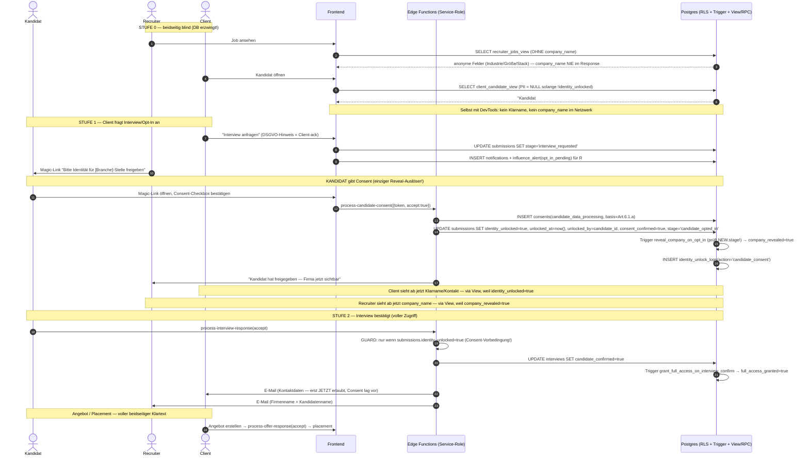

**Entscheidende Soll-Regeln der Leiter:**
- **R0 — Einziges Reveal-Flag:** `identity_unlocked`. `identity_revealed` wird per Migration auf `identity_unlocked` zusammengeführt und als deprecated markiert.
- **R1 — Consent ist der einzige Auslöser für Client-Reveal.** Weder Recruiter-Klick noch Interview-Annahme dürfen den Client-Reveal *ohne* persistierten Kandidaten-Consent auslösen.
- **R2 — Firmen-Reveal Stufe 1 = gleiches Consent-Event** (`stage='candidate_opted_in'`), Trigger wird auf `NEW.stage` umgestellt.
- **R3 — Stufe-2 (full access) ist gegated:** `process-interview-response` darf nur revealen, wenn `identity_unlocked` bereits true ist (Consent-Vorbedingung), sonst 409/Hinweis.
- **R4 — Admin-Override bleibt,** aber loggt `action='admin_override'` und schreibt einen Pseudo-Consent-Record mit `basis='admin_override'` für Audit.

---

### 3. REIBUNGS-REGISTER (jeder Bruch + konkrete Lösung)

Jeder Punkt: **Wo** (Datei:Zeile / Migration) · **Was bricht** · **Lösung** (DB/RLS / Edge / Frontend) · **Severity**.

#### 3.1 — KRITISCH · Client→Kandidat: RLS liefert volle PII
- **Wo:** `supabase/migrations/20251212165255_d8ec3a1f...sql:2` — Policy *"Clients can view candidates for their jobs"* gewährt `SELECT` auf die **ganze `candidates`-Row** sobald eine Submission existiert, **ohne** `identity_unlocked`-Bedingung. Geleakt nach `useClientCandidateView.ts:201-225` und `ClientCandidates.tsx`.
- **Lösung (DB):** `SECURITY INVOKER`-View `client_candidate_view` (Muster: bestehende `client_submissions_view`, `20260122221106`), die PII per `CASE WHEN s.identity_unlocked THEN c.full_name ELSE NULL END` liefert. Direkten `SELECT` auf `candidates` für die Client-Rolle entziehen — die heutige Policy ersetzen durch eine, die nur Nicht-PII-Spalten freigibt, *oder* (sauberer) Client-Zugriff komplett über die View routen und Policy droppen.
- **Lösung (Frontend):** `useClientCandidateView.ts` von `.from('submissions').select('candidates(...)')` auf `.from('client_candidate_view')` umstellen. Maskierungs-JS bleibt als Defense-in-Depth, ist aber nicht mehr die einzige Schicht.
- **Severity:** kritisch (USP-Bruch + DevTools-Leak).

#### 3.2 — KRITISCH · Recruiter→Client: `company_name` ungefiltert
- **Wo:** `20251204171610_...sql:194` — *"Recruiters can view published jobs"* `USING (has_role('recruiter') AND status='published')` liefert ganze `jobs`-Row inkl. `company_name`. Geleakt nach `RecruiterJobs.tsx:66`, `JobDetail.tsx:346`.
- **Lösung (DB):** `recruiter_jobs_view` (SECURITY INVOKER), die `company_name` nur ausgibt, wenn eine `company_revealed=true`-Submission **dieses** Recruiters für den Job existiert — sonst NULL. `company_logo` analog. Recruiter-`SELECT` auf `jobs.company_name` entziehen (Spalten-Whitelist-Policy oder View-only).
- **Lösung (Frontend):** `RecruiterJobs.tsx`, `JobDetail.tsx`, `SubmissionDetail.tsx` auf `recruiter_jobs_view` umstellen; `formatAnonymousCompany` bleibt für die anonymen Kontextfelder (Industrie/Größe), bekommt aber `company_name` schlicht nicht mehr geliefert solange nicht revealed.
- **Severity:** kritisch.

#### 3.3 — HOCH · `candidate_experiences` leakt echte Arbeitgebernamen
- **Wo:** `20260305100000_fix_candidate_experiences_rls_and_seed.sql:7-14` (+ `20260305002156`) — Clients dürfen `candidate_experiences` mit echten `company_name` lesen (Seed enthält „TechCorp GmbH", „FinTech Solutions Hamburg" …). Jede Komponente die direkt liest (`CandidateExperienceTimeline`) umgeht die Summary-Anonymisierung in `client-candidate-summary`.
- **Lösung (DB):** View `client_candidate_experiences_view` mit `CASE WHEN s.identity_unlocked THEN company_name ELSE industry_hint(company_name) END`. Eine deterministische `industry_hint()`-SQL-Funktion (Keyword-Map bank→Finanzsektor, auto→Automobil, …) statt LLM, damit es überall greift. Direkten Tabellenzugriff für Client-Rolle entziehen.
- **Severity:** hoch (starker Re-ID-Vektor).

#### 3.4 — HOCH · Re-Identifikation trotz Namens-Blind
- **Wo:** `useClientCandidateView.ts:399-408` — Skills, Zertifikate, Branchen, Zielrollen werden vor Reveal **vollständig** gezeigt.
- **Lösung (DB/Edge):** In `client_candidate_view` einen `k_anonymity`-Check: wenn die Skill-/Erfahrungs-Kombination unter einem Schwellwert eindeutig ist, gröbere Darstellung (Skill-Cluster statt Einzel-Skills, Erfahrungs-Range). Pragmatisch v1: Skills auf Top-N + Kategorie kürzen, seltene Zertifikate (z.B. namentliche) ausblenden bis Reveal.
- **Lösung (Frontend):** Hinweis-Badge „Profil bewusst gröber bis Freigabe".
- **Severity:** hoch (Blind-Versprechen vs. Realität).

#### 3.5 — HOCH · Stufe-1-Trigger feuert nie (status vs. stage)
- **Wo:** `20260122110726_...sql:24` — `reveal_company_on_opt_in()` prüft `NEW.status = 'candidate_opted_in'`. **Alle** Schreibpfade setzen aber `stage` (`InterviewRequestWithOptInDialog.tsx:161` setzt `stage`; `TaskDetailDialog.tsx:855`, `SubmissionDetailDialog.tsx:251`, `SubmissionDetail.tsx:270`, `CandidateTasksSection.tsx:378`). `company_revealed` wird im Normalfluss nie durch den Trigger gesetzt.
- **Lösung (DB):** Migration: Trigger-Funktion auf `NEW.stage = 'candidate_opted_in'` umstellen (Bedingung zusätzlich auf `OLD.stage IS DISTINCT FROM NEW.stage`). Mit pgTAP/Smoke-Test absichern.
- **Severity:** hoch (beworbenes „Firma nach Opt-In" wirkt nicht).

#### 3.6 — HOCH · Zwei parallele Reveal-Flags (`identity_unlocked` vs `identity_revealed`)
- **Wo:** `process-talent-hub-action/index.ts:136` setzt **nur** `identity_revealed=true`; `useClientCandidateView.ts:265` wertet **nur** `identity_unlocked` aus → über Talent-Hub „enthüllte" Kandidaten bleiben im Client-Expose anonym. RLS *"Clients can view revealed submissions"* (`20260113233137:16`) nutzt `identity_revealed`.
- **Lösung (DB + Edge):** Migration: `UPDATE submissions SET identity_unlocked = true WHERE identity_revealed = true` (Backfill), dann `process-talent-hub-action` auf `identity_unlocked` umstellen. `identity_revealed` als deprecated kommentieren, Generated-Column-Mirror oder in 2 Releases droppen. Alle Reveal-Schreibstellen in **einen** Helper `_shared/reveal.ts` ziehen.
- **Severity:** hoch (widersprüchlicher Zustand).

#### 3.7 — MITTEL · Spaltennamen-Drift `identity_unlocked_at` vs `unlocked_at`
- **Wo:** `process-interview-response/index.ts:147` schreibt `identity_unlocked_at`; Migration `20251204191207` definiert `unlocked_at`; `useIdentityUnlock.ts:83` nutzt `unlocked_at`.
- **Lösung (DB/Edge):** Auf **eine** Spalte vereinheitlichen (`unlocked_at`). `process-interview-response` korrigieren. Falls `identity_unlocked_at` durch keine Migration existiert, schlägt der Write heute teilweise fehl → in den `_shared/reveal.ts`-Helper konsolidieren.
- **Severity:** mittel (Audit-Zeitstempel unzuverlässig).

#### 3.8 — MITTEL · DSGVO-Consent wird nie geschrieben (Compliance-Lücke)
- **Wo:** `consent_confirmed`, `consent_document_url`, `consent_confirmed_at` (`20251204191207`) — **kein** Schreibzugriff im gesamten Code. Die DSGVO-Checkbox in `InterviewRequestWithOptInDialog.tsx:354` ist eine **Client**-Bestätigung („ich hole die Zustimmung ein"), nicht die Kandidaten-Einwilligung. `respondToOptIn` (`useIdentityUnlock.ts:82-84`) setzt `unlocked_by = user.id` (= Recruiter).
- **Lösung (Edge + DB):** Neue Function `process-candidate-consent` (Magic-Link-Token, `verify_jwt=false`): schreibt `consents`-Record (`consent_type='candidate_data_processing'`, `basis='Art.6.1.a'`), setzt `identity_unlocked`, `consent_confirmed`, `unlocked_by = candidate_id`, `stage='candidate_opted_in'` **atomar** in einer RPC. Kandidaten-Magic-Link aus `send-interview-invitation`/Opt-In-Flow generieren.
- **Lösung (Frontend):** Neue Kandidaten-Seite `CandidateConsentPage.tsx` (`/consent/:token`).
- **Severity:** mittel (rechtlicher Nachweis fehlt).

#### 3.9 — MITTEL · Reveal hängt an Interview-Annahme statt Consent
- **Wo:** `process-interview-response/index.ts:146-151` setzt bei `accept` **gleichzeitig** `identity_unlocked + company_revealed + full_access_granted` und mailt sofort Klarname/E-Mail/Telefon an den Client (`:235-237`). Der Consent-Schritt ist separat/optional.
- **Lösung (Edge):** GUARD einbauen — Stufe-2-Reveal nur wenn `identity_unlocked=true` (Consent lag vor). Sonst: Interview annehmen, aber Identität erst nach separatem Consent freigeben (Hinweis statt Klardaten-Mail).
- **Severity:** mittel (Blind kann ohne Kandidaten-Consent fallen).

#### 3.10 — NIEDRIG · CV-Link sichtbar, Download 403
- **Wo:** `useClientCandidateView.ts:443` setzt `cvUrl` nach Reveal; `documents`-Bucket privat (`20251204193757`), Client hat keine Storage-Policy.
- **Lösung (Edge):** Nach Reveal CV über kurzlebige signierte URL ausliefern (`createSignedUrl`, TTL 5 min) via kleine Function `get-candidate-cv-url` mit Reveal-Check, statt roher `cv_url`.
- **Severity:** niedrig (UX-Inkonsistenz).

#### 3.11 — MITTEL · Anonymisierung im AI-Output nur per Prompt erzwungen
- **Wo:** `client-candidate-summary/index.ts` (Anon-Regeln nur als System-Prompt, `industryHint` als JS-Keyword-Map `:99-101`) und `format-job-for-recruiters` (firmennamen-frei nur per Prompt). Ein LLM-Ausrutscher leakt den Namen.
- **Lösung (Edge):** Deterministischer **Post-Scrub** vor jedem Persist/Return: Regex über den Output, der `candidate.full_name` (alle Tokens) und `job.company_name` (inkl. Rechtsform-Varianten GmbH/AG/SE) entfernt/maskiert; bei Treffer regenerieren oder Feld blocken + Logging. In `_shared/scrub.ts` kapseln.
- **Severity:** mittel (Restrisiko am Kern-USP).

#### 3.12 — NIEDRIG · Orphan `candidate-summary` ohne Anonymisierung
- **Wo:** `candidate-summary/index.ts:34-37` baut Prompt mit `full_name`/`email`/`current_salary`; **kein** Frontend-Caller (grep bestätigt leer).
- **Lösung:** Function löschen + Eintrag aus `config.toml` entfernen. Eliminiert die Fußangel, dass ein versehentlicher Aufruf PII ans LLM-Gateway sendet.
- **Severity:** niedrig (totes Risiko).

#### 3.13 — NIEDRIG · `candidate-retrieval` gibt PII zurück
- **Wo:** `candidate-retrieval/index.ts:119-135,267` selektiert/returned `full_name`, `email`, `address_lat/lng`. Heute Matching-intern (Service-Role).
- **Lösung (Edge):** Output auf `candidateId` + Scores reduzieren; PII aus dem Rückgabeobjekt entfernen. Klar-Join erst nach Reveal serverseitig. Verhindert künftigen Leak, falls je an UI durchgereicht.
- **Severity:** niedrig (latent).

#### 3.14 — NIEDRIG · Direkter PII-Select in `ClientCandidates.tsx`
- **Wo:** `ClientCandidates.tsx` selektiert `full_name`/`email`/`cv_url` direkt (bestätigt per grep).
- **Lösung (Frontend):** Auf `client_candidate_view` (3.1) umstellen — keine direkte `candidates`-Query mehr aus Client-Code. Gilt als Teil des 3.1-Rollouts.
- **Severity:** niedrig (Teilmenge von 3.1).

---

### 4. UMSETZUNGSPLAN (priorisiert, mit Dateien/Funktionen)

> **Reihenfolge-Logik:** Erst die DB zur echten Sicherheitsgrenze machen (P0), dann die Reveal-Leiter konsistent und consent-getrieben (P1), dann Härtung/Compliance/UX (P2), dann Aufräumen (P3). **Achtung Deploy-Gap (siehe `01-architecture.md`):** Backend-Migrationen wirken sofort, das publizierte Frontend hängt hinterher — die Views müssen **abwärtskompatibel** sein (alte Frontend-Felder dürfen nicht hart brechen), und RLS-Verschärfung erst aktivieren, wenn der View-Lesepfad im Frontend live ist. Deshalb je Schritt „DB zuerst additiv, Policy-Entzug zuletzt".

#### P0 — Den Blind in die DB verlegen (Sicherheitsgrenze)

1. **Migration `…_client_candidate_view.sql`** — `SECURITY INVOKER`-View `client_candidate_view` (Vorbild `client_submissions_view`), PII via `CASE WHEN s.identity_unlocked`. `GRANT SELECT … TO authenticated`. *(behebt 3.1, 3.14)*
2. **Migration `…_client_candidate_experiences_view.sql`** + SQL-Funktion `industry_hint(text)`; View mit Branchen-Hint bis Reveal. *(behebt 3.3)*
3. **Migration `…_recruiter_jobs_view.sql`** — `company_name`/`company_logo` nur bei eigener `company_revealed`-Submission, sonst NULL. *(behebt 3.2)*
4. **Frontend-Umstellung (Lesepfad):** `src/hooks/useClientCandidateView.ts`, `src/pages/dashboard/ClientCandidates.tsx` → `client_candidate_view` + `client_candidate_experiences_view`; `src/pages/recruiter/{RecruiterJobs,JobDetail,SubmissionDetail}.tsx` → `recruiter_jobs_view`.
5. **Policy-Entzug (erst nach Frontend-Live):** Migration, die die Klardaten-Policies *"Clients can view candidates for their jobs"* und den `company_name`-Lesezugriff der Recruiter-Rolle ersetzt/entzieht. **Dieser Schritt ist der eigentliche Fix** — vorher ist es nur Defense-in-Depth.

#### P1 — Reveal-Leiter konsolidieren & consent-getrieben machen

6. **`_shared/reveal.ts`** (neuer Shared-Helper): kapselt **alle** Reveal-Writes (Flags + `unlocked_at` + Audit-Log) atomar. Konsumenten: `process-interview-response`, `process-talent-hub-action`, `schedule-interview`, `useIdentityUnlock` (via RPC). *(behebt 3.6, 3.7)*
7. **Migration Trigger-Fix:** `reveal_company_on_opt_in()` auf `NEW.stage = 'candidate_opted_in'` umstellen. *(behebt 3.5)*
8. **Migration Flag-Backfill:** `identity_unlocked := true WHERE identity_revealed`; `process-talent-hub-action/index.ts:136` auf `identity_unlocked` umstellen; `identity_revealed` deprecaten. *(behebt 3.6)*
9. **Edge `process-candidate-consent`** (neu, `verify_jwt=false`, Magic-Link-Token) + RPC `confirm_candidate_consent(token)`: schreibt `consents`-Record, setzt Flags, `unlocked_by=candidate_id`, `stage='candidate_opted_in'` atomar. **Frontend:** `src/pages/CandidateConsentPage.tsx` (`/consent/:token`), Magic-Link aus `send-interview-invitation`. *(behebt 3.8)*
10. **Guard in `process-interview-response/index.ts`:** Stufe-2-Reveal + Klardaten-Mail nur wenn `identity_unlocked=true`. *(behebt 3.9)*

#### P2 — Härtung, Compliance, UX

11. **`_shared/scrub.ts`** + Einbindung in `client-candidate-summary` und `format-job-for-recruiters`: deterministischer Regex-Scrub von `full_name`/`company_name` (inkl. Rechtsformen) vor Persist/Return; bei Treffer regenerieren/blocken + Log. *(behebt 3.11)*
12. **Edge `get-candidate-cv-url`** (Reveal-Check → `createSignedUrl`, TTL 5 min); `useClientCandidateView.ts:443` liefert signierte statt rohe URL. *(behebt 3.10)*
13. **k-Anonymity-Coarsening** in `client_candidate_view` / Hook: seltene Skill-/Zert-Kombis bis Reveal gröber. *(behebt 3.4)*

#### P3 — Aufräumen

14. **`candidate-summary` löschen** (Function + `config.toml`-Eintrag). *(behebt 3.12)*
15. **`candidate-retrieval/index.ts`** Output auf `candidateId`+Scores reduzieren. *(behebt 3.13)*
16. **Doku:** „dritter Blind" ehrlich benennen (Client→Recruiter-Firmenblind + Recruiter↔Recruiter-Isolation via `recruiter_id`); `FeaturesSection.tsx:19`-Claim erst nach P0 zutreffend.

#### Test-/Abnahme-Gate (gilt für P0+P1)

- **pgTAP/SQL-Test:** Als Client-Rolle `SELECT full_name FROM client_candidate_view` vor Reveal ⇒ NULL; nach `identity_unlocked` ⇒ Klartext. Als Recruiter `company_name` vor/nach `company_revealed`.
- **E2E:** DevTools/Network-Tab auf Client-Expose vor Opt-In ⇒ kein Klarname/`company_name` im Response (das ist das eigentliche Erfolgskriterium des „perfekten" Blind).
- **Consent-Audit:** Nach Kandidaten-Consent existiert ein `consents`-Record mit `unlocked_by=candidate_id`.

---

### 5. Soll-Phasen-Matrix (verdichtet, nach Umsetzung)

| `submissions`-Zustand | Recruiter sieht Firma | Client sieht Kandidat | Auslöser | DB-erzwungen? |
|---|---|---|---|---|
| `submitted` | anonym (`[Branche \| Größe \| Stack]`) | anonym (`Kandidat #XXXX`, Region, Ranges, Branchen-Hints) | — | ✅ View liefert NULL |
| `interview_requested` | anonym | anonym (+ „Anfrage gesendet") | Client klickt „Interview anfragen" | ✅ |
| `candidate_opted_in` (`stage`) | **Firmenname** (Stufe 1) | **Klarname, Kontakt** | **Kandidaten-Consent** (Magic-Link) → Trigger + Flag | ✅ Trigger auf `stage`, Consent-Record |
| Interview bestätigt (`full_access_granted`) | voller Zugriff (Stufe 2) | Klarname (unverändert) | `process-interview-response(accept)` **mit Consent-Guard** | ✅ Guard prüft `identity_unlocked` |
| `placed` | voll | voll | `process-offer-response(accept)` | ✅ |
| `admin_override` | n/a | Klarname (forciert) | Admin, Audit + Pseudo-Consent | ✅ geloggt |

---

*Schlüsseldateien für die Umsetzung:* `src/hooks/useClientCandidateView.ts`, `src/hooks/useIdentityUnlock.ts`, `src/lib/anonymization.ts`, `src/lib/anonymousCompanyFormat.ts`, `src/pages/dashboard/ClientCandidates.tsx`, `src/pages/recruiter/{RecruiterJobs,JobDetail,SubmissionDetail}.tsx`, `src/components/dialogs/InterviewRequestWithOptInDialog.tsx`, **neu:** `src/pages/CandidateConsentPage.tsx`; `supabase/functions/{process-interview-response,process-talent-hub-action,schedule-interview,client-candidate-summary,format-job-for-recruiters,candidate-retrieval}/index.ts`, **neu:** `supabase/functions/{process-candidate-consent,get-candidate-cv-url}/`, `supabase/functions/_shared/{reveal.ts,scrub.ts}`; Migrationen (neu): `client_candidate_view`, `client_candidate_experiences_view`, `recruiter_jobs_view`, Trigger-Fix `reveal_company_on_opt_in`, Flag-Backfill `identity_revealed→identity_unlocked`, Policy-Entzug Client/Recruiter. *Bestehende Referenz-Migrationen:* `20251204171610`, `20251204191207`, `20251212165255`, `20260113233137`, `20260118223953`, `20260122110726`, `20260122221106`, `20260305002156`, `20260305100000`.


---

## 04. Auth, Rollen & Zugriffskontrolle

> Domänen-Tiefenanalyse. Quelle der Wahrheit ist der Code (Stand: Branch `main`).
> Zentrale Dateien: `src/lib/auth.tsx`, `src/App.tsx` (`ProtectedRoute`), die Migration
> `supabase/migrations/20251204171610_*.sql` (Auth-Fundament) sowie die Edge Functions
> `organization-invite`, `accept-invite`, `integration-api-key`.

### 4.1 Überblick & mentales Modell

Matchunt kennt **zwei voneinander unabhängige Rollenebenen**, die im Code oft verwechselt werden können, aber technisch getrennt sind:

| Ebene | Wo gespeichert | Werte | Steuert | Enforcement |
|-------|----------------|-------|---------|-------------|
| **Globale App-Rolle** (`app_role`) | `public.user_roles.role` | `client`, `recruiter`, `admin` | Routing (`/dashboard`, `/recruiter`, `/admin`), RLS-Sichtbarkeit auf Kern-Tabellen | RLS via `has_role()` + Frontend `ProtectedRoute` |
| **Organisations-Rolle** | `public.organization_members.role` | `owner`, `admin`, `hiring_manager`, `viewer`, `finance` | Team-Features, Feingranulare Permissions, Integrationen, Billing | RLS auf Org-Tabellen + **rein clientseitige** `usePermissions`-Checks |

> ⚠️ **Wichtig:** Die Org-Rolle `admin` ist **nicht** die System-Rolle `admin`. Ein Org-`admin` ist nur Administrator innerhalb *seiner* Organisation und hat keinerlei Zugriff auf `/admin/*` oder System-RLS-Privilegien.

Die drei Kern-Personas (`client`/`recruiter`/`admin`) entsprechen ausschließlich der App-Rolle. Sie ist das Rückgrat des Routings und der globalen RLS.

### 4.2 Die drei Personas

| Persona | App-Rolle | Routen-Präfix | Landing nach Login | Kern-Tabellen-Ownership | USP-Bezug |
|---------|-----------|---------------|--------------------|--------------------------|-----------|
| **Client** (Unternehmen) | `client` | `/dashboard/*` | `/dashboard` (bzw. `/onboarding` direkt nach Signup) | `jobs.client_id = auth.uid()` | Sieht nur Submissions zu eigenen Jobs (Triple-Blind: keine Recruiter-Identität) |
| **Recruiter** | `recruiter` | `/recruiter/*` | `/recruiter` | `candidates.recruiter_id`, `submissions.recruiter_id`, `talent_pool.recruiter_id` | Reicht Kandidaten erfolgsbasiert ein; sieht nur `status='published'`-Jobs |
| **Admin** (Plattform) | `admin` | `/admin/*` | `/admin` | Voll: jede `has_role(auth.uid(),'admin')`-Policy | Backoffice, Fraud, Payouts, Matching-Config |

Persona-Auswahl bei Signup: `src/pages/Auth.tsx:125-138` bietet im UI **nur** `client` und `recruiter` an (`roleOptions`). `admin` ist im UI nicht wählbar — siehe aber Schwäche F-01 (Privilege Escalation über Metadaten).

Es existiert **keine** Bootstrap-Migration, die einen ersten Admin anlegt. Der erste Admin muss manuell per SQL/Supabase-Dashboard in `user_roles` gesetzt werden. Danach verwalten Admins andere Rollen über `src/pages/admin/AdminUsers.tsx`.

### 4.3 Wie die Rolle bestimmt wird (Signup → Trigger → Context)

#### Schritt 1: Signup schreibt Rolle in `auth.users.raw_user_meta_data`
`src/lib/auth.tsx:65-81` (`signUp`) ruft `supabase.auth.signUp` mit `options.data = { full_name, role: selectedRole }`. Die gewählte Rolle landet damit in den **vom Client kontrollierten** User-Metadaten.

#### Schritt 2: DB-Trigger materialisiert Profil & Rolle
Migration `supabase/migrations/20251204171610_*.sql:274-299` definiert `handle_new_user()` (SECURITY DEFINER), getriggert `AFTER INSERT ON auth.users`:
```sql
INSERT INTO public.user_roles (user_id, role)
VALUES (NEW.id, COALESCE((NEW.raw_user_meta_data ->> 'role')::app_role, 'client'));
```
Der Trigger übernimmt die Metadaten-Rolle **ungeprüft** (siehe F-01). Gleichzeitig wird ein `profiles`-Datensatz angelegt. `user_roles.role` hat `DEFAULT 'client'`, ein `UNIQUE(user_id, role)`-Constraint und seit `20251204184027_*.sql` zusätzlich `status`, `verified`, `suspended_at`, `custom_fee_percentage`.

#### Schritt 3: Frontend lädt die Rolle in den Auth-Context
`src/lib/auth.tsx:53-63` (`fetchUserRole`) liest `user_roles.role` per `.eq('user_id', userId).maybeSingle()` und ruft `setRole(...)`. Aufgerufen wird das:
- beim Initial-Load via `getSession().then(...)` (`auth.tsx:41-48`),
- bei jedem `onAuthStateChange` — dort jedoch in einem `setTimeout(() => fetchUserRole(...), 0)` (`auth.tsx:31-34`).

Damit ist `role` ein eigener, **asynchron nachgeladener** State, der zeitlich hinter `user`/`session` herläuft (siehe F-02 / F-03).

#### Datenfluss-Diagramm

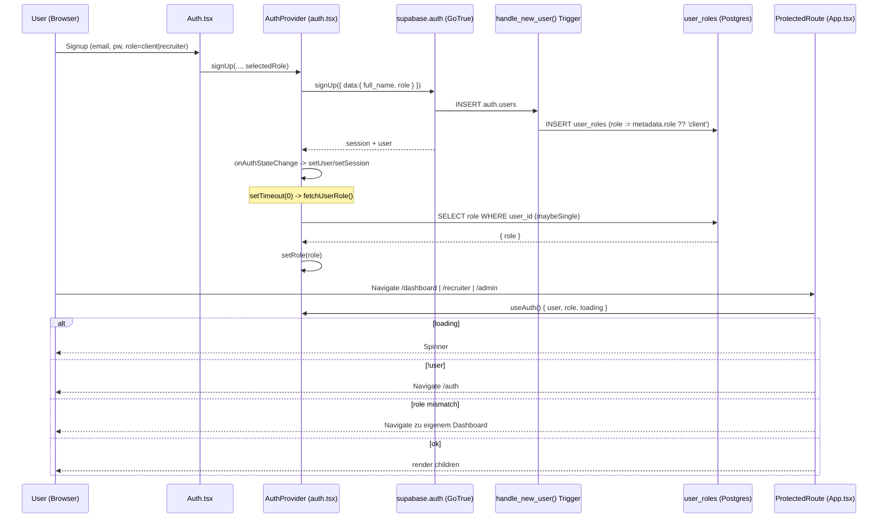

### 4.4 Routen-Schutz: `ProtectedRoute`

Definiert in `src/App.tsx:109-135`. Logik in Reihenfolge:

1. `loading` (`auth.tsx`) true → Spinner (`App.tsx:112-118`).
2. `!user` → `Navigate to="/auth"` (`App.tsx:120-122`).
3. `role === 'admin'` → **immer** Zugriff, unabhängig von `allowedRoles` (`App.tsx:125-127`). Admins sind globale Superuser im Routing.
4. `allowedRoles` gesetzt **und** `role` vorhanden **und** Rolle nicht erlaubt → Redirect auf das eigene Dashboard (`recruiter` → `/recruiter`, sonst `/dashboard`) (`App.tsx:129-132`).
5. sonst → Children rendern.

Jede geschützte Route deklariert `allowedRoles`, z. B. `App.tsx:144-148` (`/dashboard` → `['client']`), `App.tsx:236-240` (`/recruiter` → `['recruiter']`), `App.tsx:318-322` (`/admin` → `['admin']`).

**Öffentliche / Token-basierte Routen** (kein Login, eigener Token-Schutz über Edge Functions): `/auth`, `/`, `/invite/:token` (`App.tsx:450`), `/reference/:token` (`App.tsx:451`), `/interview/select/:token`, `/interview/respond/:token`, `/offer/view/:token`, alle `/about`,`/blog`,`/docs` etc.

Login-Redirect nach Rolle: `src/pages/Auth.tsx:39-49` — bei vorhandenem `user && role` wird auf `/admin` | `/recruiter` | `/dashboard` geleitet (Neu-Clients: `/onboarding`).

#### Bekannte Routing-Inkonsistenzen
- `ProtectedRoute` schützt nur die *Sichtbarkeit der Seite*. Die eigentliche Daten-Autorisierung passiert in **RLS** und in den Edge Functions. Ein manipuliertes Frontend kann den Router umgehen — relevant ist also die Server-Schicht.
- `AcceptInvite.tsx:62` leitet nach erfolgreichem Beitritt auf `/organization/team` weiter, **diese Route existiert nicht** in `App.tsx` — die einzige Team-Route ist `/dashboard/team` (`App.tsx:224-228`). Folge: 404 nach Invite-Annahme (F-05).
- `AcceptInvite.tsx:71` setzt `sessionStorage['redirectAfterLogin']`, aber **kein** Code liest diesen Key je aus (`grep` über `src/` liefert nur die Set-Stelle). Der Post-Login-Redirect zurück zur Einladung funktioniert nicht (F-05).

### 4.5 `user_roles`-Tabelle & RLS

Definition: `20251204171610_*.sql:17-25`. RLS-Policies (`:180-188`):

| Policy | Operation | Bedingung | Bewertung |
|--------|-----------|-----------|-----------|
| `Users can view their own role` | SELECT | `auth.uid() = user_id` | ok |
| `Users can insert their own role` | INSERT | `WITH CHECK (auth.uid() = user_id)` | ⚠️ **Privilege-Escalation-Vektor (F-01)** |
| `Admins can manage all roles` | ALL | `has_role(auth.uid(),'admin')` | ok |

Die Funktion `has_role(_user_id, _role)` (`:141-154`, `SECURITY DEFINER`, `STABLE`, `SET search_path=public`) ist das Standard-Pattern, um RLS-Rekursion zu vermeiden, und wird in **dutzenden** Policies plattformweit benutzt (`jobs`, `candidates`, `submissions`, `interviews`, `placements`, `organizations`, `integrations`, …). `get_user_role(_user_id)` (`:157-165`) liefert eine einzelne Rolle (`LIMIT 1`).

Ein `AFTER INSERT OR UPDATE`-Trigger `user_roles_activity_log` (`20251212185019_*.sql:99-104`) protokolliert Rollenänderungen in `activity_logs` — guter Audit-Trail.

**Admin-Verwaltung der Rollen** (`src/pages/admin/AdminUsers.tsx`):
- `handleChangeRole` (`:144-160`) schreibt direkt `user_roles.update({ role })` (autorisiert über die `Admins can manage all roles`-Policy).
- `handleToggleStatus` (`:106-125`) setzt `status` = `active`/`suspended` + `suspended_at`.
- `handleToggleVerified` (`:127-142`) toggelt `verified`.

> ⚠️ `status` und `verified` werden **nirgends** zur Zugriffssteuerung ausgewertet (siehe F-04).

### 4.6 Organisations- & Invite-Flow

#### Tabellen (`20251204231510_*.sql`)
- `organizations` (`:9-20`): `owner_id`, `type ∈ {client,agency}`.
- `organization_members` (`:23-35`): `role ∈ {owner,admin,hiring_manager,viewer,finance}`, `permissions JSONB`, `status`, `UNIQUE(organization_id,user_id)`.
- `organization_invites` (`:38-49`): `token UNIQUE`, `expires_at`, `accepted_at`, `role ∈ {admin,hiring_manager,viewer,finance}`.
- `permission_definitions` (`:52-70`): 10 Permission-IDs (`view_jobs`, `manage_jobs`, `approve_offers`, `manage_billing`, `manage_team`, …).

#### Edge Function `organization-invite` (`supabase/functions/organization-invite/index.ts`)
- Verwendet **Service-Role-Key** (`:19`) → umgeht RLS, prüft Autorisierung daher **selbst**.
- Authentifiziert den Aufrufer via `supabase.auth.getUser(Bearer)` (`:29-31`).
- Autorisierung: Aufrufer muss aktives `organization_members`-Mitglied mit Rolle `owner|admin` sein (`:50-63`) → 403 sonst.
- Generiert Token `crypto.randomUUID() + '-' + crypto.randomUUID()` (`:96`), 7 Tage gültig.
- Schreibt `organization_invites`, verschickt Resend-Mail mit Link `${origin}/invite/${token}` (`:124-157`). Mail-Fehler sind nicht-fatal.
- Aufrufer: `src/hooks/useOrganizationInvites.ts:38-61` (`sendInvite` → `supabase.functions.invoke('organization-invite')`), getriggert aus `TeamManagement.tsx`.

#### Edge Function `accept-invite` (`supabase/functions/accept-invite/index.ts`)
- Service-Role-Key (`:18`), `getUser(Bearer)` (`:28-31`).
- Lädt Invite per `token` mit `accepted_at IS NULL` (`:49-54`), prüft `expires_at` (`:64-69`).
- **E-Mail-Match-Check** (case-insensitive): `invite.email == user.email` → 403 sonst (`:71-77`). Verhindert, dass ein fremder Account ein Invite einlöst.
- Idempotenz: bereits Mitglied → markiert Invite trotzdem als accepted (`:79-101`).
- Sonst: `INSERT organization_members` mit Rolle/Permissions aus dem Invite + `joined_at` (`:104-115`), dann `UPDATE accepted_at` (`:126-129`).
- Aufrufer: `useOrganizationInvites.ts:82-101` (`acceptInvite`). **Wichtig:** `onSuccess` invalidiert nur `organizations` / `organization-memberships` (`:92-95`) — die globale `app_role` im Auth-Context bleibt unberührt. Org-Beitritt ändert die System-Rolle bewusst nicht.

> Anmerkung Triple-Blind/Org-Modell: Die App-Rolle (`client`) und die Org-Mitgliedschaft sind orthogonal. Ein eingeladener `viewer` einer Client-Org bleibt global ein `client` (oder hat gar keine App-Rolle, falls frisch registriert) — die Org-Rechte kommen ausschließlich aus `organization_members` + `usePermissions`.

#### Org-RLS-Auffälligkeiten (`20251204231510_*.sql`)
- `Members can view org members` (`:254-262`) und mehrere Org-Member-Policies referenzieren `organization_members` **innerhalb** der eigenen Policy → potenziell rekursiv/teuer; funktioniert nur, weil der Subquery via Index läuft. Kein `SECURITY DEFINER`-Helper wie bei `has_role` (F-06).
- `Anyone can view invite by token` (`:290-291`) → `USING (true)`: **jede** authentifizierte Person kann **alle** Invites lesen (inkl. fremder E-Mails/Tokens). Die Frontend-Abfrage `useInviteByToken` (`useOrganizationInvites.ts:112-128`) filtert zwar per Token, aber RLS gewährt vollen Read (F-07).
- `System can manage mappings`/`System can insert alerts` etc. nutzen `USING (true)` — bewusst offen, weil nur Service-Role schreibt, aber RLS-seitig nicht abgesichert.

### 4.7 Integrationen & API-Keys (Auth-relevant)

`integration-api-key` (`supabase/functions/integration-api-key/index.ts`) und die OAuth-Functions (`oauth-connect`, `oauth-callback`, `integration-disconnect`) regeln den Zugang zu externen ATS.

- `integration-api-key`: Service-Role + `getUser(Bearer)` (`:31-40`). Action `connect` verschlüsselt `apiKey` bzw. `clientId/clientSecret` per **AES-256-GCM** (`_shared/encryption.ts`) und upsertet in `recruiter_integrations` mit `onConflict: user_id,provider` (`:68-95`). Der Encryption-Key kommt aus dem Secret `ENCRYPTION_KEY` (64-hex/32-byte, `encryption.ts:56-62`).
- Aufrufer: `src/hooks/useRecruiterIntegrations.ts:142-210` (`connectApiKey`, `connectClientCredentials`), `:109` (`startOAuthConnect`), `:216` (`disconnectIntegration`).
- Action `test` ist ein **No-op** (`:107-114`, „not yet implemented") — Verbindungstest gibt immer Erfolg zurück (F-08).
- `recruiter_integrations` hat RLS (`20260224150000_oauth_integrations.sql:76`), Schreibzugriff läuft aber über Service-Role in der Function.

> Hinweis: Die **alte** `integrations`-Tabelle (org-basiert, `20251204231510_*.sql:79-97`) und die **neuere** `recruiter_integrations` (user-basiert, OAuth-Migration) existieren parallel und überschneiden sich konzeptionell. Für die Auth-Domäne relevant: zwei verschiedene Berechtigungsmodelle (Org-Admin vs. einzelner Recruiter) für „Integrationen".

### 4.8 Edge-Function-Auth-Muster (domänenweit)

Es gibt **keinen** geteilten Auth-Helper in `supabase/functions/_shared/` — jede Function implementiert das Muster inline:
```ts
const supabase = createClient(SUPABASE_URL, SERVICE_ROLE_KEY); // RLS-Bypass
const { data:{ user } } = await supabase.auth.getUser(authHeader.replace('Bearer ',''));
if (!user) return 401;
// danach manuelle Autorisierungs-Logik (z. B. org-membership-Check)
```
Konsequenz: Autorisierungslogik ist über ~81 Functions **dupliziert**; eine einheitliche Rollen-/Membership-Prüfung fehlt (F-09). Functions ohne expliziten Rollen-Check verlassen sich allein darauf, dass der User eingeloggt ist.

### 4.9 Verknüpfungen (Interconnections)

| Von | Nach | Mechanismus | Notiz |
|-----|------|-------------|-------|
| `src/pages/Auth.tsx` | `auth.tsx:signUp` → GoTrue | `supabase.auth.signUp({data:{role}})` | Rolle wird als User-Metadatum gesetzt |
| GoTrue `auth.users` INSERT | `user_roles` / `profiles` | Trigger `handle_new_user()` | materialisiert `role` aus Metadaten (ungeprüft) |
| `auth.tsx:AuthProvider` | `user_roles` | `SELECT role (maybeSingle)` in `fetchUserRole` | befüllt `role` im Context (async, setTimeout) |
| `App.tsx:ProtectedRoute` | `auth.tsx:useAuth` | Context-Read `{user,role,loading}` | Routing-Gate je `allowedRoles` |
| `TeamManagement` / `useOrganizationInvites` | `organization-invite` (EF) | `supabase.functions.invoke` | Org-Admin lädt Mitglied ein |
| `organization-invite` (EF) | `organization_invites` + Resend | Service-Role INSERT + E-Mail | Token-Link `/invite/:token` |
| `AcceptInvite` / `useOrganizationInvites` | `accept-invite` (EF) | `supabase.functions.invoke` | E-Mail-Match-Gate, INSERT `organization_members` |
| `useRecruiterIntegrations` | `integration-api-key` (EF) | `supabase.functions.invoke('connect')` | AES-GCM-Verschlüsselung → `recruiter_integrations` |
| `usePermissions` | `organization_members` | `SELECT role,permissions` | nur clientseitige Permission-Auflösung |
| Dutzende RLS-Policies | `user_roles` | `has_role(auth.uid(),'admin')` | zentrale Admin-Allmacht in DB |

### 4.10 Reibungs- & Risikopunkte

| ID | Bereich | Problem | Schwere | Empfehlung |
|----|---------|---------|---------|------------|
| **F-01** | Privilege Escalation | `handle_new_user()` übernimmt `raw_user_meta_data->>'role'` **ungeprüft** (`20251204171610_*.sql:287-291`). Ein direkter `supabase.auth.signUp({data:{role:'admin'}})`-Call (am UI vorbei) erzeugt einen System-Admin. Zusätzlich erlaubt die Policy `Users can insert their own role` jedem User, sich selbst eine beliebige Rolle in `user_roles` zu schreiben (`:184-185`). | **critical** | Trigger auf `'client'`/`'recruiter'` whitelisten und `admin` explizit verbieten; `Users can insert their own role`-Policy entfernen oder mit `WITH CHECK (role <> 'admin')` absichern. Admin-Vergabe nur über `Admins can manage all roles`. |
| **F-02** | Race Condition | `fetchUserRole` läuft in `setTimeout(0)` (`auth.tsx:31-34`) nach `onAuthStateChange`; `loading` wird unabhängig in `getSession().then()` (`:47`) auf `false` gesetzt. In der Praxis kann `loading=false` + `user` gesetzt, aber `role=null` sein → `ProtectedRoute` trifft Branch „role mismatch" und macht einen kurzen Fehl-Redirect aufs falsche Dashboard. | **high** | `loading` erst auf `false`, wenn `role` geladen ist; `fetchUserRole` direkt (ohne `setTimeout`) awaiten und einen kombinierten Lade-Zustand führen. |
| **F-03** | Instabiler Context | `AuthContext.Provider value={{...}}` (`auth.tsx:97`) ist ein **inline-Objektliteral** ohne `useMemo`. Jede State-Änderung erzeugt ein neues Value-Objekt → alle `useAuth()`-Consumer re-rendern, auch wenn sich nur `session` ändert. | **medium** | Value via `useMemo` memoisieren; `signUp/signIn/signOut` via `useCallback` stabilisieren. |
| **F-04** | Suspendierung wirkungslos | `user_roles.status='suspended'` und `verified` werden **nirgends** ausgewertet — weder in `auth.tsx`/`ProtectedRoute` noch in RLS. Ein über `AdminUsers` suspendierter User behält vollen Zugriff bis Session-Ablauf. | **high** | `status`/`verified` in `fetchUserRole` mitladen und in `ProtectedRoute` erzwingen; in `has_role` bzw. einer neuen `is_active()`-Funktion auf DB-Ebene berücksichtigen. |
| **F-05** | Invite-Redirect kaputt | `AcceptInvite.tsx:62` navigiert auf nicht existierendes `/organization/team` (404; korrekt wäre `/dashboard/team`). `sessionStorage['redirectAfterLogin']` (`:71`) wird gesetzt, aber nie gelesen → Post-Login-Rücksprung zur Einladung funktioniert nicht. | **medium** | Ziel auf `/dashboard/team` korrigieren; `redirectAfterLogin` in `Auth.tsx` nach erfolgreichem Login auswerten und konsumieren. |
| **F-06** | RLS-Rekursionsrisiko | Org-Member-Policies (`20251204231510_*.sql:254-273`) referenzieren `organization_members` in ihrer eigenen `USING`-Klausel ohne `SECURITY DEFINER`-Helper. Anfällig für Performance-/Rekursionsprobleme bei wachsenden Teams. | **medium** | Analog zu `has_role` eine `is_org_member(org, role[])`-`SECURITY DEFINER`-Funktion einführen und in den Policies nutzen. |
| **F-07** | Invite-Enumeration | `Anyone can view invite by token` → `USING (true)` (`:290-291`) erlaubt jeder authentifizierten Person, **alle** `organization_invites` zu lesen (E-Mails, Tokens, Org-IDs). | **medium** | Policy auf `email = auth.jwt()->>'email'` oder Token-Match einschränken; Token-Lookup über `SECURITY DEFINER`-RPC statt offenem SELECT. |
| **F-08** | Schein-Validierung | `integration-api-key` Action `test` ist ein No-op und gibt **immer** Erfolg zurück (`integration-api-key/index.ts:107-114`). Nutzer glauben, ihre Credentials seien gültig. | **low** | Provider-spezifischen Test implementieren oder den „Test"-Button bis dahin deaktivieren. |
| **F-09** | Auth-Duplizierung | Kein geteilter Auth/Authz-Helper in `_shared/`; jede der ~81 Functions kopiert das `getUser`-Muster, Rollen-Checks sind uneinheitlich. Risiko: einzelne Functions ohne ausreichende Autorisierung. | **medium** | `_shared/auth.ts` mit `requireUser()` / `requireRole()` / `requireOrgRole()` einführen und überall verwenden; Functions ohne Check auditieren. |

### 4.11 Offene Fragen

- Wird die `email_confirm`-Pflicht serverseitig erzwungen? In `supabase/config.toml` ist kein `enable_confirmations` gesetzt — `signUp` (`auth.tsx`) sendet eine Bestätigungsmail (`emailRedirectTo`), aber unklar ist, ob unbestätigte Accounts bereits eine Session und damit eine Rolle erhalten.
- Wie wird der **allererste** System-Admin produktiv angelegt (keine Bootstrap-Migration vorhanden)? Manueller SQL-Eingriff?
- Soll der Org-Beitritt (`accept-invite`) die **App-Rolle** beeinflussen (z. B. eingeladene Hiring-Manager ohne eigene `user_roles`-Zeile)? Aktuell entstehen Org-Mitglieder ohne garantierte `app_role`, was deren Routing (`ProtectedRoute`) undefiniert lassen kann.
- Verhältnis `integrations` (org-basiert) ↔ `recruiter_integrations` (user-basiert): Welches Modell ist kanonisch, und wer (Org-Admin vs. einzelner Recruiter) darf eine Integration verbinden?
- Greift bei Rollenwechsel über `AdminUsers` ein Realtime-Invalidierungsmechanismus, oder muss der betroffene User neu einloggen, damit sein `fetchUserRole`/Routing aktualisiert wird?


---

## 05. Kandidaten-Lifecycle & Intake

> Domäne: Wie ein Kandidat von der ersten Quelle (CV-PDF, weitergeleitete E-Mail, CRM-Kontakt, manuelles Formular) zu einem vollständig angereicherten, KI-bewerteten, semantisch durchsuchbaren Profil wird.
> Quellcode = Wahrheit. Diese Sektion basiert auf gelesenem Code, nicht auf `PROJECT_ANALYSIS.md`.

### 5.1 Überblick & Kernidee

Der gesamte Kandidaten-Intake gehört der Persona **recruiter** (`/recruiter/*`). Recruiter sind die einzigen, die Kandidaten in `candidates` anlegen (`candidates.recruiter_id`). Clients und Admins sehen Kandidaten nur indirekt über `submissions` und die Triple-Blind-Schicht (eigene Domäne).

Es gibt **vier Eingangskanäle**, die alle in derselben Datenstruktur landen:

| Kanal | Trigger (Frontend / Webhook) | Edge Function(s) | `candidates.import_source` |
|-------|------------------------------|------------------|----------------------------|
| **CV-Upload** (PDF oder Text) | `CvUploadDialog` → `useCvParsing` | `parse-pdf` → `parse-cv` | `cv_upload` |
| **E-Mail-Weiterleitung** | Mail-Provider-Webhook (Mailgun/Resend-Style) | `process-candidate-email` → `process-candidate-import` → `parse-pdf` → `parse-cv` | `email_import` |
| **CRM / HubSpot** | `HubSpotImportDialog` → `hubspot-sync` | `hubspot-sync` (+ `_shared/token-refresh.ts`) | (kein Wert gesetzt) |
| **Manuell** | `CandidateFormDialog` → `RecruiterCandidates.handleSaveCandidate` | keine (direkter `supabase.from('candidates').insert`) | (kein Wert gesetzt) |

Nach dem Anlegen/Update greifen **automatische Anreicherungs-Pfade** über DB-Trigger und Edge Functions: Embedding-Queue (semantische Suche), Fit-Assessment (bei Submission), Skill-Normalisierung (zur Match-Zeit) und Konflikterkennung.

Der zentrale USP-relevante Punkt: Beim Intake ist der Kandidat noch **nicht** anonymisiert — die Anonymisierung passiert erst, wenn aus einem Kandidaten eine `submission` auf einen Job wird (Triple-Blind, eigene Domäne).

---

### 5.2 Datenfluss (Mermaid)

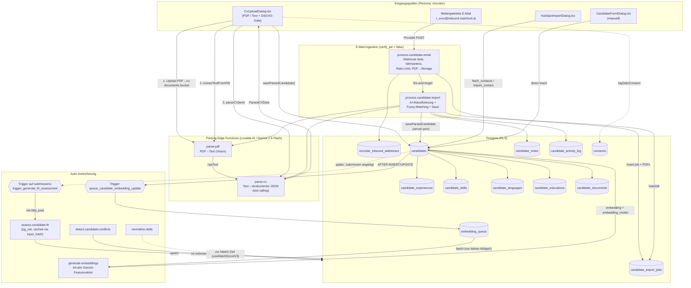

---

### 5.3 Kanal 1 — CV-Upload (PDF / Text)

**Frontend-Orchestrierung:** `src/components/candidates/CvUploadDialog.tsx`
Ein Wizard mit den Schritten `upload → gdpr → extracting → parsing → review → saving` (`CvUploadDialog.tsx:70`). Aufgerufen aus `src/pages/recruiter/RecruiterCandidates.tsx:399` via Dropdown.

Ablauf (PDF-Modus, `handlePdfUploadAndParse` `CvUploadDialog.tsx:141`):

1. **DSGVO-Gate** — Drei Checkboxen (Rechtsgrundlage, Kandidat informiert, nur bewerbungsrelevant) müssen bestätigt werden, bevor überhaupt hochgeladen wird (`CvUploadDialog.tsx:458-543`). Erst danach werden Daten an Dritte (Lovable AI) gesendet.
2. **Upload** in den Storage-Bucket `cv-documents` unter `${user.id}/${Date.now()}-${sanitizedName}` (`CvUploadDialog.tsx:151`). Dateinamen werden client-seitig sanitiert (Umlaute → ASCII, `sanitizeFileName` `CvUploadDialog.tsx:38`), weil Supabase-Storage nicht-ASCII-Keys ablehnt.
3. **Text-Extraktion:** `useCvParsing.extractTextFromPdf` → `supabase.functions.invoke('parse-pdf', { pdfPath })` (`useCvParsing.ts:149`).
4. **Strukturierung:** `useCvParsing.parseCV` → `invoke('parse-cv', { cvText })` (`useCvParsing.ts:179`).
5. **Review** — Recruiter kann alle Felder editieren (`editMode`).
6. **Persistenz:** `saveParsedCandidate` (`useCvParsing.ts:204`) schreibt `candidates` + Kind-Tabellen, dann `logGdprConsent` → `consents`.

**`parse-pdf`** (`supabase/functions/parse-pdf/index.ts`)
- Lädt das PDF mit Service-Role aus `cv-documents`, kodiert es base64 und schickt es als `image_url` mit `data:application/pdf;base64,...` an `google/gemini-2.5-flash` über `https://ai.gateway.lovable.dev` (`parse-pdf/index.ts:96`). Gemini wird hier als **PDF-Vision-Extraktor** missbraucht — es gibt keine echte PDF-Bibliothek.
- `max_tokens: 8000`, `temperature: 0.1`. Gibt reinen Text zurück.
- **Risiko:** base64-Konvertierung via `String.fromCharCode`-`reduce` (`parse-pdf/index.ts:56`) ist für 10-MB-PDFs speicher- und CPU-intensiv (kann an Edge-Limits scheitern).

**`parse-cv`** (`supabase/functions/parse-cv/index.ts`)
- Reiner **Stateless-Transformer**: Text rein, JSON raus. Schreibt **nichts** in die DB.
- Nutzt OpenAI-kompatibles **Tool-Calling** (`extract_cv_data`, `tool_choice` erzwungen, `parse-cv/index.ts:148`) gegen `google/gemini-2.5-flash`.
- Extrahiert: Stammdaten, `experiences[]`, `educations[]`, `skills[]` (mit Kategorie/Level), `languages[]`, plus KI-Felder `cv_ai_summary`, `cv_ai_bullets`, `expose_title`, `expose_summary`.
- Erweitert das Ergebnis um viele Default-Felder (`parse-cv/index.ts:183-215`).
- Behandelt `429` (Rate-Limit) und `402` (AI-Credits aufgebraucht) explizit — relevant, weil **alle** KI-Funktionen denselben Lovable-Gateway-Key teilen.
- Liefert `parser_version: "v3"`, aber `useCvParsing.saveParsedCandidate` schreibt hartkodiert `cv_parser_version: 'v2'` (`useCvParsing.ts:246`). **Versions-Inkonsistenz.**

**`saveParsedCandidate`** (`useCvParsing.ts:204`)
- Bei `existingCandidateId`: **delete-then-reinsert** aller Kind-Tabellen (`candidate_experiences`, `candidate_educations`, `candidate_languages`, `candidate_skills`) (`useCvParsing.ts:265`). Kein Diff/Merge — manuell editierte Kinddaten gehen bei Re-Import verloren.
- Datumsnormalisierung `normalizeDate` (`useCvParsing.ts:6`) wandelt `YYYY`, `YYYY-MM`, deutsche/englische Monatsnamen, `MM/YYYY` → `YYYY-MM-DD`. Nicht-parsebare Daten → `null` (Datenverlust, nur `console.warn`).
- Versionierte CV-Dokumente in `candidate_documents` (altes `is_current=false`, neue Version = max+1, `useCvParsing.ts:366`).
- **Fehler-Asymmetrie:** Der Haupt-Insert wirft (`throw`), aber Fehler bei Kind-Inserts werden nur geloggt (`console.error`), nicht propagiert (`useCvParsing.ts:309`). Ein Kandidat kann „erfolgreich" angelegt werden, obwohl Skills/Erfahrungen fehlschlugen.

**Wichtige Feld-Mappings** (Parser-Output → DB-Spalte), da Namen abweichen:

| ParsedCVData | `candidates`-Spalte |
|--------------|---------------------|
| `location` | `city` |
| `current_title` | `job_title` |
| `current_company` | `company` |
| `salary_expectation_max` | `expected_salary` (zusätzlich) |
| `availability_from` | `availability_date` |
| `relocation_ready` | `relocation_willing` |
| `skills[].name` | `skills` (Text-Array, nur Namen) |
| `cv_ai_summary` | `summary` **und** `cv_ai_summary` |

---

### 5.4 Kanal 2 — E-Mail-Weiterleitung (Forwarding-Inbox)

Der ausgereifteste Kanal. Jeder Recruiter erhält automatisch eine persönliche Inbound-Adresse `r_<first8ofUUID>@inbound.matchunt.ai` (Migration `20260224120000_email_ingestion_tables.sql:111` für Bestand, Trigger `auto_create_inbound_address` `...:120` für neue Recruiter via `AFTER INSERT ON user_roles`).

**Stufe A — `process-candidate-email`** (`supabase/functions/process-candidate-email/index.ts`, `verify_jwt = false` → öffentlicher Webhook):

1. Parst Provider-Payload generisch (Mailgun/Resend/SendGrid-Felder, `process-candidate-email/index.ts:52-58`).
2. **Recipient → Recruiter:** Lookup in `recruiter_inbound_addresses` über `email_address` (`...:81`). Unbekannte Adresse → `404`. Deaktiviert → `403`.
3. **Idempotenz:** `message_id` gegen `candidate_import_jobs.message_id` (`...:106`). Duplikat → früher `200`-Return.
4. **Rate-Limit:** max 20 Jobs/Stunde pro Recruiter (Zählung in `candidate_import_jobs`, `...:124`). (Der `100/day`-Kommentar ist nicht implementiert.)
5. **Attachment-Handling:** nur PDFs ≤ 10 MB, base64-Decode, Upload nach `cv-documents/email-imports/${recruiterId}/...` (`...:182`).
6. **Job-Anlage** in `candidate_import_jobs` mit `status: 'pending'` (`...:208`).
7. **Fire-and-forget** `fetch` auf `process-candidate-import` mit Service-Role-Bearer (`...:241`). Kein `await` → schnelle Webhook-Antwort, aber **kein Retry**, wenn der zweite Call scheitert (Job bliebe in `pending` hängen).

**Stufe B — `process-candidate-import`** (`supabase/functions/process-candidate-import/index.ts`):

1. **State Machine:** `pending → processing → classified → completed | needs_review | failed` (Spalten-Kommentar in Migration `...email_ingestion_tables.sql:63`).
2. **KI-Klassifizierung** (`classifyEmail` `process-candidate-import/index.ts:99`): Gemini-Tool-Call `classify_email` bestimmt eine von sechs Klassen (`new_candidate`, `candidate_update`, `candidate_notes`, `candidate_with_notes`, `multi_candidate`, `unprocessable`) und trennt **echte Recruiter-Notizen** von Weiterleitungs-Artefakten (Signaturen, „FYI", Forward-Header). Bei AI-Ausfall greift eine deterministische Fallback-Heuristik (`...:597`).
3. **Override-Regeln** korrigieren die KI anhand der PDF-Anzahl (`...:609-620`).
4. **Fuzzy-Matching** (`matchCandidate` `...:153`) gegen bestehende Kandidaten **desselben Recruiters**, gestaffelt nach Konfidenz: E-Mail `0.99` → Telefon `0.90` → exakter Name `0.80` → Fuzzy-Name `0.60/0.40`. Bei Treffer wird **aktualisiert** statt dupliziert.
5. **Persistenz:** server-seitiger Port von `saveParsedCandidate` (`...:267`, dupliziert die FE-Logik inkl. eigener `normalizeDate`-Kopie `...:234` — **doppelte Wahrheit**). Setzt hier korrekt `import_source: 'email_import'` und `cv_parser_version: 'v3'`.
6. **Notizen:** `candidate_notes` (`source: 'email_import'`, `import_job_id`) + `candidate_activity_log` (`createCandidateNote` `...:433`).
7. **Notes-only-Pfad** (`candidate_notes`-Klasse): hängt Notizen an einen per Name gematchten Kandidaten; ohne sicheren Match (`< 0.5`) → `needs_review`.
8. **Bestätigungs-E-Mail** direkt via Resend-API (`sendConfirmationEmail` `...:470`) — umgeht die zentrale `send-email`-Function.

**Beobachtung:** Stufe A und Stufe B teilen sich `parse-pdf`/`parse-cv` mit Kanal 1 (`processPdf` `...:648`). Pro PDF werden **zwei** sequentielle Gemini-Calls fällig → bei `multi_candidate` mit N CVs sind es 2N Calls plus 1 Klassifizierung, alle synchron in einer Edge-Function-Invocation.

---

### 5.5 Kanal 3 — HubSpot / CRM

**Frontend:** `HubSpotImportDialog.tsx` (`fetch → select → gdpr → importing → complete`).
**Edge Function:** `hubspot-sync` (`supabase/functions/hubspot-sync/index.ts`, `verify_jwt`-pflichtig, prüft User-Token selbst `...:44`).

- `action: 'fetch_contacts'` — holt OAuth-Token aus `recruiter_integrations` (provider `hubspot`, status `connected`) und refreshed ihn bei Bedarf via `_shared/token-refresh.ts` (`getValidToken` `hubspot-sync/index.ts:83`). **Ohne** verbundene Integration werden **Demo-Kontakte** zurückgegeben (`...:69`) — gut für Onboarding, aber leicht mit echten Daten zu verwechseln.
- Bei `401` von HubSpot wird die Integration auf `status: 'expired'` gesetzt (`...:102`).
- `action: 'import_contact'` — Dedupe über `(email, recruiter_id)` (`...:139`); existiert der Kandidat, `skipped`. Sonst minimaler Insert (`full_name`, `email`, `phone`, `jobtitle → skills[]`) plus `candidate_activity_log` (`activity_type: 'hubspot_import'`).
- **Schwäche:** Das Frontend ruft `import_contact` **pro Kontakt einzeln** in einer JS-`for`-Schleife auf (`HubSpotImportDialog.tsx:100`) → N Round-Trips, keine Server-seitige Batch-Verarbeitung. HubSpot-Notizen (`notes`) werden weder geholt noch gespeichert.

---

### 5.6 Kanal 4 — Manuelle Erfassung

**`CandidateFormDialog.tsx`** — umfangreiches 4-Tab-Formular (Stammdaten, Beruf & Skills, Verfügbarkeit, Exposé) mit `TagInput`-Komponenten und `CommutePreferencesCard` (Pendel-/Remote-Präferenzen für Geo-Matching). Erfasst deutlich mehr Felder als der CV-Parser liefert (z. B. `salary_fix`/`salary_bonus`, `visa_required`, `project_metrics`, `expose_*`).

- DSGVO-Gate nur für **neue** Kandidaten (`isNewCandidate`, `CandidateFormDialog.tsx:995`).
- Persistenz **nicht** über `useCvParsing`, sondern direkt in `RecruiterCandidates.handleSaveCandidate` (`RecruiterCandidates.tsx:150`): `update` bei Edit, sonst `insert` mit `recruiter_id` + Consent-Log (`...:162`). Schreibt **keine** Kind-Tabellen — alle Skills landen nur im `skills`-Text-Array.

---

### 5.7 Automatische Anreicherung (Trigger, Functions, Queue)

#### 5.7.1 Embeddings / semantische Suche

- **Trigger** `queue_candidate_embedding_update` (`AFTER INSERT OR UPDATE ON candidates`, Migration `20260122214438_...sql`) schreibt einen Eintrag in `embedding_queue`, aber **nur** wenn sich `skills`, `job_title`, `cv_ai_summary`, `seniority` oder `specializations` ändern. Priorität 2, falls noch kein Embedding existiert. `ON CONFLICT DO NOTHING` über `UNIQUE(entity_type, entity_id, status)`.
- **Drainage:** `generate-embeddings` mit `{ batch: true }` (`generate-embeddings/index.ts:253`) verarbeitet die Queue. Pro Kandidat wird ein **64-dimensionaler Gemini-„Featurevektor"** erzeugt (`buildCandidateProfileText` + `generateEmbedding` `...:146`) und als pgvector-String gespeichert, mit `embedding_model: 'gemini-2.5-flash-64d'`.
- **KRITISCH — Dimensions-Mismatch:** Die Migration definiert `candidates.embedding vector(1536)` (`text-embedding-3-small`, `20260122214438_...sql:6`) und baut darauf HNSW-Indizes sowie `find_similar_candidates(vector(1536))` / `search_candidates_hybrid(...)`. `generate-embeddings` schreibt aber nur **64** Werte. Eine `INSERT … vector(1536)` mit 64 Elementen wird von pgvector **abgelehnt** → Embeddings dürften beim Schreiben fehlschlagen (Queue-Items → `failed`), und die Vektor-Suchfunktionen liefern nichts Brauchbares. Es existiert **keine** spätere Migration, die die Spalte auf `vector(64)` ändert (geprüft über alle `vector(...)`-Vorkommen).
- **KEIN Cron-Drainer:** `embedding_queue` wird ausschließlich manuell über das Admin-`EmbeddingHealthWidget.tsx:68` (`batch: true, batchSize: 10`) abgearbeitet. Ohne Admin-Klick bleiben Items dauerhaft `pending`.

#### 5.7.2 Fit-Assessment (an Submission gekoppelt)

- `assess-candidate-fit` (`supabase/functions/assess-candidate-fit/index.ts`) erzeugt ein tiefes, evidenzbasiertes Fit-Gutachten (Tool-Call `submit_fit_assessment`: `requirement_assessments`, `gap_analysis`, `career_trajectory`, `dimension_scores`, …) und schreibt es nach `candidate_fit_assessments` (Upsert `onConflict: submission_id`).
- **Caching** über `input_data_hash` (SHA-256 über Kandidat+Job+Notizen, `...:106`): unveränderte Eingaben → kein erneuter AI-Call.
- **Auto-Trigger:** `trigger_generate_fit_assessment` (`AFTER INSERT ON submissions`, Migration `20260307000000_fit_assessment_auto_trigger.sql`) ruft die Function **fire-and-forget via `pg_net`** mit Service-Role-Key. Die Function erkennt den Service-Role-Call und setzt dann `generated_by = null` (`assess-candidate-fit/index.ts:355`).
- **Abhängigkeit von `app.settings.*`:** Der Trigger nutzt `current_setting('app.settings.supabase_url')` / `...service_role_key`. Fehlen diese GUC-Settings, wirft `net.http_post` und der `submissions`-Insert würde fehlschlagen → harte Kopplung Intake↔Submission.
- Liest u. a. `candidate_ai_assessment` als „bisherige Einschätzung" mit ein — verknüpft die ältere Assessment-Tabelle mit dem neuen System.

#### 5.7.3 Skill-Normalisierung

- `normalize-skills` (`supabase/functions/normalize-skills/index.ts`) mappt Roh-Skills 4-stufig auf `skill_taxonomy.canonical_name`: exakt (100) → Alias (95) → Fuzzy/Substring (75) → KI (Gemini, ≥60). Reiner Stateless-Service, schreibt nichts.
- **Hinweis:** Wird **nicht** beim Intake aufgerufen, sondern erst zur Match-Zeit aus `useMatchScoreV3.ts:79`. Die beim Parsing gespeicherten `candidate_skills` bleiben also **unnormalisiert** im Profil. Außerdem nutzt diese Function einen anderen Endpunkt (`https://api.lovable.dev/...`, `...:121`) als alle übrigen (`https://ai.gateway.lovable.dev/...`) — potenziell veraltet.

#### 5.7.4 Konflikterkennung

- `detect-candidate-conflicts` (`supabase/functions/detect-candidate-conflicts/index.ts`) prüft Mehrfachbewerbungen eines Kandidaten: `same_client` (high), `same_industry` (medium), `critical_stage` (interview/offer). Schreibt `candidate_conflicts` (dedupe gegen offene Konflikte) und erzeugt bei `high` eine `notifications`-Zeile an den Recruiter.
- Aufruf aus `useCandidateConflicts.ts:67` mit `{ candidate_id, submission_id }` — also ebenfalls submission-getrieben, nicht reiner Intake.

---

### 5.8 Tabellenlandschaft dieser Domäne

| Tabelle | Rolle im Lifecycle | Beschrieben von | Migration |
|---------|--------------------|------------------|-----------|
| `candidates` | Stammprofil (`recruiter_id`, KI-Felder, `embedding`, `import_source`) | alle vier Kanäle + `generate-embeddings` | `20251204171610_...` |
| `candidate_experiences` | Berufserfahrung (datumsnormalisiert) | `useCvParsing` / `process-candidate-import` | `20251211212741_...` |
| `candidate_skills` | strukturierte Skills (name/category/level) | dito | `20251211212741_...` |
| `candidate_languages` | Sprachen + Proficiency | dito | `20251211...` |
| `candidate_educations` | Ausbildung | dito | `20251211...` |
| `candidate_documents` | versionierte CV-Dateien (`is_current`) | `saveParsedCandidate` | `20251211233705_...` |
| `candidate_notes` | Recruiter-Notizen (`source`, `import_job_id`) | `process-candidate-import` | erweitert in `20260224120000_...` |
| `candidate_activity_log` | Audit-Timeline (import/hubspot/email) | E-Mail-Import, `hubspot-sync` | `20251212004329_...` |
| `candidate_ai_assessment` | ältere KI-Bewertung (Risiken/Chancen/Scores) | `process-interview-notes`, `client-candidate-summary` (gelesen von `assess-candidate-fit`) | `20251212004329_...` |
| `candidate_fit_assessments` | neues, submission-gebundenes Fit-Gutachten | `assess-candidate-fit` | `20260306000000_...` |
| `candidate_conflicts` | Mehrfachbewerbungs-Konflikte | `detect-candidate-conflicts` | — |
| `recruiter_inbound_addresses` | Mapping Inbound-E-Mail → Recruiter | Trigger + `process-candidate-email` | `20260224120000_...` |
| `candidate_import_jobs` | State Machine der E-Mail-Importe | `process-candidate-email` / `-import` | `20260224120000_...` |
| `embedding_queue` | Async-Queue für Vektor-Generierung | Trigger `queue_candidate_embedding_update` | `20260122214438_...` |
| `consents` | DSGVO-Einwilligungs-Audit (`candidate_data_processing`) | alle Dialoge | — |

---

### 5.9 Wichtigste Vernetzungen (Frontend → Function → Tabelle)

1. `CvUploadDialog` →(invoke)→ `parse-pdf` →(invoke)→ `parse-cv` →(`saveParsedCandidate`)→ `candidates` + 4 Kind-Tabellen + `candidate_documents` + `consents`.
2. Mail-Provider →(Webhook)→ `process-candidate-email` →(`fetch` fire-and-forget)→ `process-candidate-import` →(invoke ×2 pro PDF)→ `parse-pdf`/`parse-cv` → `candidates`/`candidate_notes`/`candidate_activity_log`; State in `candidate_import_jobs`.
3. `HubSpotImportDialog` →(invoke pro Kontakt)→ `hubspot-sync` →(OAuth via `_shared/token-refresh.ts` + `recruiter_integrations`)→ `candidates` + `candidate_activity_log`.
4. `candidates` INSERT/UPDATE →(DB-Trigger)→ `embedding_queue` →(Admin-Widget `batch`)→ `generate-embeddings` →(Update `embedding`)→ `candidates`.
5. `submissions` INSERT →(DB-Trigger `pg_net`)→ `assess-candidate-fit` →(liest `candidates`, Kind-Tabellen, `candidate_ai_assessment`)→ `candidate_fit_assessments`.

---

### 5.10 Reibungs- & Risikopunkte (im Code beobachtet)

- **Embedding-Dimensions-Mismatch (kritisch):** DB-Spalte `vector(1536)` vs. 64-dim Gemini-Output in `generate-embeddings`. Schreiben schlägt vermutlich fehl, semantische Suche (`find_similar_candidates`, `search_candidates_hybrid`) ist nicht funktionsfähig.
- **Embedding-Queue ohne Cron:** Drainage nur manuell über `EmbeddingHealthWidget`. Ohne Admin bleibt die Queue dauerhaft `pending`.
- **Öffentliche Ingestion-Webhooks:** `process-candidate-email`/`-import` laufen mit `verify_jwt = false`. Es gibt keine sichtbare Signatur-/Secret-Prüfung der Provider-Payload — jeder, der die URL kennt, könnte Importe + Resend-Bestätigungs-Mails auslösen (Recipient muss nur eine gültige Inbound-Adresse sein).
- **Fire-and-forget ohne Retry:** Schlägt der Trigger-Call `process-candidate-email → process-candidate-import` fehl, hängt der Job in `pending` (kein Worker holt ihn nach).
- **Duplizierte Speicher-Logik:** `saveParsedCandidate` + `normalizeDate` existieren zweimal (FE `useCvParsing.ts`, Edge `process-candidate-import/index.ts`) — zwei Wahrheiten, die auseinanderlaufen können (z. B. `cv_parser_version` `'v2'` vs `'v3'`).
- **Stille Teilfehler:** Kind-Insert-Fehler in `saveParsedCandidate` werden nur geloggt; Kandidat gilt als „erstellt" trotz fehlender Skills/Erfahrungen.
- **Re-Import = Datenverlust:** Delete-then-reinsert der Kind-Tabellen überschreibt manuell editierte Erfahrungen/Skills bei jedem CV-Update.
- **Skills bleiben unnormalisiert:** `normalize-skills` läuft erst zur Match-Zeit; gespeicherte `candidate_skills` sind nicht kanonisiert. Zudem nutzt die Function einen abweichenden API-Endpunkt.
- **Orphan-Function `candidate-summary`:** In `config.toml` registriert, aber **kein** Frontend-/Backend-Caller. Funktional ersetzt durch `client-candidate-summary` + `assess-candidate-fit`. Toter Code / Verwirrungsgefahr.
- **Zwei parallele Assessment-Systeme:** `candidate_ai_assessment` (älter, kandidatenweit) und `candidate_fit_assessments` (neu, submission-gebunden) koexistieren; `assess-candidate-fit` liest ersteres, schreibt letzteres — Datenmodell-Schuld.
- **Harte Intake↔Submission-Kopplung:** Der `submissions`-Insert-Trigger ruft synchron `net.http_post` und hängt von `app.settings.*`-GUCs ab; Fehlkonfiguration kann Submissions blockieren.
- **PDF-base64 im Speicher:** `parse-pdf` baut den base64-String per `reduce`/`String.fromCharCode` für bis zu 10 MB — Performance-/Memory-Risiko an Edge-Limits.
- **HubSpot N+1 + Demo-Daten:** Pro-Kontakt-Invoke statt Batch; ohne Integration stille Rückgabe von Demo-Kontakten (Verwechslungsgefahr), `notes` werden ignoriert.


---

## 06. Job-Lifecycle & Anreicherung

> Domäne: Entstehung einer Stelle von der Roh-Eingabe (PDF / URL / Text / manuell) über KI-Parsing, KI-Anreicherung, Intake-Briefing und Admin-Approval bis zum vermarktungsfertigen, anonymisierten Job-Datensatz, der Recruitern angezeigt wird.
>
> Quellcode = Wahrheit. Diese Sektion basiert auf direktem Lesen der Edge Functions und Frontend-Dateien (Stand: Branch `main`, Commit `9903dbd`). `PROJECT_ANALYSIS.md` war nur Orientierung.

### 06.1 Überblick & Kernaussagen

Der Job-Lifecycle zerfällt in **drei Phasen**, die jeweils einem Persona-Kontext zugeordnet sind:

| Phase | Persona / Route | Was passiert | Zentrale Edge Functions |
|-------|-----------------|--------------|-------------------------|
| **1. Erfassung & Anreicherung** | `client` – `/dashboard/jobs/new` (`CreateJob.tsx`) | Import via PDF/URL/Text/manuell → KI-Extraktion → Firmen-Anreicherung → Smart-Intake → `INSERT` in `jobs` (Status `draft` oder `pending_approval`) | `parse-job-url`, `parse-job-pdf`, `enrich-job-data`, `extract-intake-briefing` |
| **2. Approval & Vermarktung** | `admin` – `/admin/jobs` (`JobApprovalDialog.tsx`) | Admin setzt Fees/Urgency → AI formatiert **anonymisiert** → Status `published` | `format-job-for-recruiters` |
| **3. Konsum & Aufbereitung** | `recruiter` – `/recruiter/jobs/:id` (`JobDetail.tsx`) & `client` – `/dashboard/jobs/:id` (`ClientJobDetail.tsx`) | Recruiter sieht anonymisierte `formatted_content` (auto-generiert falls leer); Client sieht Executive Summary + Qualitäts-Score | `format-job-for-recruiters` (Auto-Trigger), `generate-job-summary`, `generate-job-expose` |

**Vier zentrale Erkenntnisse, die man verinnerlichen muss:**

1. **Die Parsing-/Anreicherungs-Functions sind zustandslos.** `parse-job-url`, `parse-job-pdf`, `enrich-job-data` und `extract-intake-briefing` schreiben **NICHTS** in die DB – sie geben nur JSON zurück. Das Persistieren übernimmt der Browser via `supabase.from('jobs').insert(...)` in `CreateJob.tsx:610`. Dadurch hängt die gesamte Datenintegrität der Stelle an der Client-seitigen Mapping-Logik (siehe Friction).
2. **`job_summary` und `formatted_content` sind zwei getrennte AI-Artefakte mit unterschiedlichem Zweck.** `job_summary` (JSONB) = strukturierte Executive Summary für den **Client** (nicht anonymisiert, `generate-job-summary`). `formatted_content` (JSONB) = anonymisiertes Recruiter-Marketing (Triple-Blind, `format-job-for-recruiters`). Beides wird server-seitig in `jobs` zurückgeschrieben.
3. **Triple-Blind wird per Prompt erzwungen, nicht per Code.** Die Anonymisierung in `generate-job-expose` und `format-job-for-recruiters` ist ausschließlich eine LLM-Anweisung ("Nenne NIEMALS den Firmennamen"). Es gibt keine deterministische Nachkontrolle (z.B. String-Replace des `company_name` im Output).
4. **Inkonsistente AI-Infrastruktur.** 7 von 8 Functions nutzen das Lovable-Gateway; `extract-intake-briefing` nutzt als einzige **OpenRouter**. Modellwahl divergiert: `gemini-2.5-flash` (Parsing/Summary) vs. `gemini-3-flash-preview` (Expose/Format).

### 06.2 Datenfluss-Diagramm

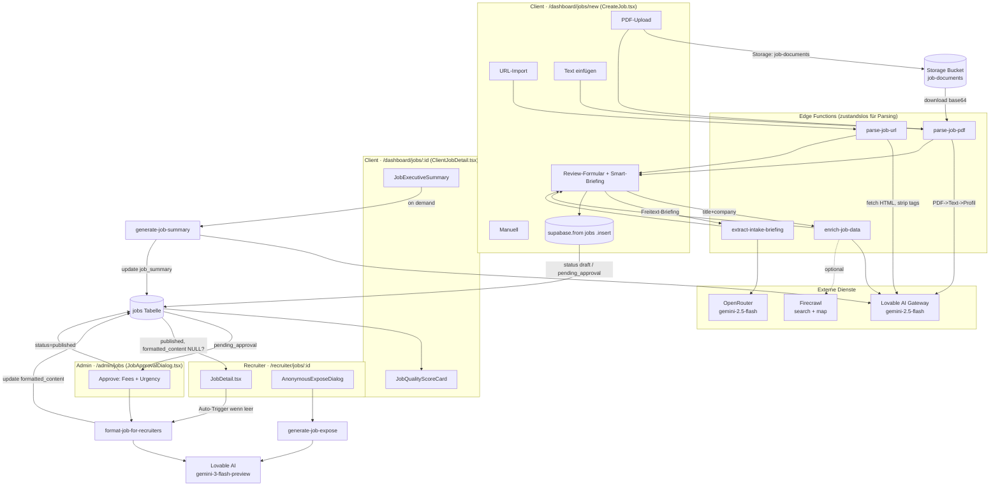

### 06.3 Phase 1 – Erfassung: Die drei Import-Pfade

Einstieg ist `CreateJob.tsx` (`src/pages/dashboard/CreateJob.tsx`, ~1680 Zeilen). Der Flow wird über `FlowState` (`'import-selection' | 'importing' | 'review' | 'submitting'`) gesteuert (`CreateJob.tsx:78`). Drei Import-Methoden + manuell:

#### a) URL-Import → `parse-job-url`

- Hook: `useJobParsing.parseJobUrl()` (`src/hooks/useJobParsing.ts:53`) ruft `supabase.functions.invoke('parse-job-url', { body: { jobUrl } })`.
- Function `parse-job-url/index.ts`:
  - Fetcht die Seite mit eigenem `User-Agent: Mozilla/5.0 (compatible; JobParser/1.0)` (`parse-job-url/index.ts:78-83`), **strippt HTML serverseitig per Regex** (`<script>`, `<style>`, alle Tags) und kürzt auf **15.000 Zeichen** (`:94`). Kein Headless-Browser → JS-gerenderte Seiten (LinkedIn, viele SPAs) liefern leeren/blockierten Content.
  - Schickt den Text an `https://ai.gateway.lovable.dev` (`gemini-2.5-flash`) mit einem **27-Felder-Tool-Schema** (`extract_job_data`, `tool_choice: forced`) – deutscher HR-System-Prompt mit Mapping-Regeln (Monatsgehalt × 12, Du/Sie → Kultur, Dringlichkeits-Heuristik).
  - Gibt `{ success, data: ParsedJobData }` zurück. **Kein DB-Write.**

#### b) PDF-Upload & Text → `parse-job-pdf`

- Hook: `useJobPdfParsing` (`src/hooks/useJobPdfParsing.ts`).
  - PDF: lädt die Datei zunächst in den Storage-Bucket **`job-documents`** unter `uploads/<ts>-<rand>.pdf` (`useJobPdfParsing.ts:43`), ruft dann `parse-job-pdf` mit `{ pdfPath }`.
  - Text: ruft `parse-job-pdf` mit `{ jobText }` (dieser Pfad wird in `CreateJob` für "Text einfügen" verwendet, `CreateJob.tsx:414`).
- Function `parse-job-pdf/index.ts`:
  - Lädt PDF mit Service-Role aus Storage, konvertiert zu **base64** (`:74`) und schickt es als `image_url`-Daten-URI (`data:application/pdf;base64,...`) an `gemini-2.5-flash` zur **Text-Extraktion** (`max_tokens: 8000`, `temperature: 0.1`). → Scans/Bild-PDFs sind erfahrungsgemäß fragil.
  - Zweiter AI-Call analysiert den Text mit Tool-Schema `create_job_profile` (anderes Schema als parse-job-url: `requirements` ist hier ein `string[]`, Felder `nice_to_have`, `technical_skills`, `soft_skills`, `ai_summary`, `seniority_level`).
  - **Kein DB-Write.**

> **Schema-Divergenz (wichtig!):** `parse-job-url` liefert `ParsedJobData` (flaches 27-Feld-Schema, `requirements: string`), `parse-job-pdf` liefert `ParsedJobProfile` (`requirements: string[]`, `company` statt `company_name`, `seniority_level` mit 6 statt 4 Enum-Werten). `CreateJob.tsx` muss daher **zwei getrennte Mapping-Funktionen** halten: `applyParsedData()` (`:232`) für URL und `applyParsedJobProfile()` (`:451`) für PDF/Text. Letztere baut das PDF-Profil künstlich in ein `ParsedJobData`-Objekt um und setzt dabei viele Felder hart auf `null` (`team_size`, `reports_to`, `core_hours`, `unique_selling_points` …). → PDF-/Text-Import erfasst strukturell **weniger** Felder als URL-Import.

#### c) Firmen-Anreicherung → `enrich-job-data`

- Wird **nur im URL-Pfad** automatisch nachgelagert getriggert (`applyParsedData` → `enrichJobData`, `CreateJob.tsx:292-315`), wenn `title` und `company_name` vorhanden sind. Im PDF-/Text-Pfad (`applyParsedJobProfile`) wird Enrichment **nicht** aufgerufen.
- Hook `useJobEnrichment` (`src/hooks/useJobEnrichment.ts`) leitet eine **geratene Domain** aus dem Firmennamen ab (`extractCompanyDomain`: strippt GmbH/AG/etc., hängt `.com` an, `:35`). → Häufig falsche Domain (z.B. deutsche Firmen mit `.de`).
- Function `enrich-job-data/index.ts`:
  1. **Skill-Normalisierung** über ein hartkodiertes `TECH_NORMALIZATIONS`-Mapping (`:26`, ~30 Stacks).
  2. **Industry-Klassifikation** über Keyword-Mapping `INDUSTRY_KEYWORDS` (`:10`).
  3. Optional **Firecrawl** (`api.firecrawl.dev/v1/search` + `/v1/map`), um Funding-Stage, Mitarbeiterzahl und Career-Page zu schätzen (nur falls `FIRECRAWL_API_KEY` gesetzt).
  4. **AI-Fallback** (`gemini-2.5-flash`, Tool `classify_company`) nur, wenn `industry` oder `company_size_band` noch fehlen.
  - Gibt `EnrichmentResult` zurück (industry, company_size_band, funding_stage, tech_environment, hiring_urgency, normalized_skills, company_insights). **Kein DB-Write** – das Ergebnis wird in `CreateJob` ins `formData` gemerged.

> **Urgency-Mapping-Bug:** `enrich-job-data` liefert `hiring_urgency` als `'ASAP' | 'urgent' | 'standard'` (`mapHiringUrgency`, `:110`), während das DB-/Form-Modell `'hot' | 'urgent' | 'standard'` erwartet (siehe `ParsedJobData.hiring_urgency`). Ein Wert `'ASAP'` passt in kein UI-Enum und landet ggf. unverarbeitet im Formular.

#### d) Smart-Intake-Briefing → `extract-intake-briefing`

- Komponente `IntakeBriefingSection.tsx` + Hook `useIntakeBriefing.ts`. Der Client tippt Freitext ("Erzählen Sie uns alles über die Stelle"), die KI extrahiert **26 strukturierte Intake-Felder** (`ExtractedIntakeData`).
- Function `extract-intake-briefing/index.ts`:
  - **Einzige Function dieser Domäne, die OpenRouter nutzt** (`https://openrouter.ai/api/v1/chat/completions`, `:73`) – mit `OPENROUTER_API_KEY`.
  - Setzt gleichzeitig `response_format: { type: 'json_object' }` **und** ein `tools`-Array mit `tool_choice: forced` (`:87-128`) → redundante/teils inkompatible Output-Konfiguration. Der Code parst defensiv beide Varianten (`tool_calls` ODER `content`, `:142-153`).
  - Berechnet `completeness` über 10 gewichtete Felder (`:156`).
  - **Kein DB-Write.** Ergebnis fließt via `onDataExtracted` ins `formData` und `intakeData` (`CreateJob.tsx:163`).

#### Persistierung (der eigentliche DB-Write)

Erst `handleSubmit()` (`CreateJob.tsx:569`) schreibt: `supabase.from('jobs').insert({...})` (`:610`). Wichtige Punkte:
- `status: publish ? 'pending_approval' : 'draft'` (`:627`).
- `client_id: user?.id` – RLS-Anker (jobs gehören dem Client).
- Publizieren erfordert Gehalts-Range + abgeschlossene Verifizierung (`useClientVerification.canPublishJobs`, `:587`); sonst Redirect nach `/onboarding`.
- Zahlreiche Intake-Felder (`company_culture`, `career_path`, `success_profile`, `must_have_criteria`, `reports_to`, `works_council`, `intake_completeness` …) werden aus `intakeData` übernommen.

### 06.4 Phase 2 – Admin-Approval & anonyme Vermarktung

- `admin` öffnet `JobApprovalDialog.tsx` (`/admin/jobs`). Beim Klick auf "Genehmigen & Veröffentlichen" (`handleApprove`, `:103`):
  1. Ruft **`format-job-for-recruiters`** (`JobApprovalDialog.tsx:89`).
  2. Schreibt `status='published'`, `fee_percentage`, `recruiter_fee_percentage`, `urgency`, `approved_at`, `approved_by` **und** das gerade erhaltene `formatted_content` zurück (`:112-123`).
- Function `format-job-for-recruiters/index.ts`:
  - Lädt den Job per Service-Role, baut einen Prompt mit **explizitem Triple-Blind-Block** ("⚠️ KRITISCH … Nenne NIEMALS den Firmennamen `${job.company_name}`", `:67`).
  - Modell: **`gemini-3-flash-preview`** über Lovable-Gateway. Tool `format_job` erzeugt `headline`, `highlights`, `role_summary`, `ideal_candidate`, `selling_points`, `anonymous_company_pitch`, `quick_facts`.
  - **Robuster Fallback:** Bei AI-Fehler wird ein deterministisches `FormattedContent` aus Job-Feldern gebaut (`:240-263`) – dieser Fallback ist allerdings nur *teilanonym* (nutzt z.B. `job.location`).
  - **Schreibt `formatted_content` selbst in `jobs`** (`:266-269`) – d.h. auch ohne den Admin-Update wäre es persistiert (doppelter Write: einmal Function, einmal `JobApprovalDialog`).
- Ablehnung (`handleReject`, `:138`): setzt Status zurück auf `draft` und legt den Grund als Präfix `[ABGELEHNT] …` in **`briefing_notes`** ab (kein dediziertes Feld).

### 06.5 Phase 3 – Konsum: Recruiter & Client

#### Recruiter-Sicht (`/recruiter/jobs/:id`, `JobDetail.tsx`)
- **Auto-Trigger:** Ein `useEffect` (`JobDetail.tsx:143-161`) ruft `format-job-for-recruiters` automatisch nach, sobald ein Job geladen wird, dessen `formatted_content` `null` ist. Das ist der Selbstheilungs-Pfad für Jobs, die nie durch den Admin-Approval-Dialog liefen (oder bei denen die Generierung fehlschlug).
- Triple-Blind-Kontext: Firmenname/`company_profiles` werden erst nach Submission/Reveal sichtbar (`RecruiterAccessStatus`, `:130`).
- **Anonymes Exposé:** `AnonymousExposeDialog.tsx` ruft beim Öffnen `generate-job-expose` (`:32`). Diese Function lädt den Job, generiert ein **1-seitiges Markdown-Exposé** (anonymisiert, `gemini-3-flash-preview`) und gibt es **flüchtig** zurück – `generate-job-expose` **persistiert nichts**. Dient der Copy-&-Paste-Kandidatenansprache.

#### Client-Sicht (`/dashboard/jobs/:id`, `ClientJobDetail.tsx`)
- **Executive Summary:** `JobExecutiveSummary` zeigt `job.job_summary`. Über `generateSummary()` (`ClientJobDetail.tsx:184`) ruft der Client `generate-job-summary`, die den Job lädt, eine strukturierte JSONB-Summary erzeugt (`key_facts`, `tasks_structured`, `requirements_structured`, `benefits_extracted`, `ai_insights`) **und sie in `jobs.job_summary` zurückschreibt** (`generate-job-summary/index.ts:320`). Eigener deterministischer Fallback (`generateFallbackSummary`, `:344`).
- **Phasenadaptive Darstellung:** Bei 0 Kandidaten zeigt die Seite Job-Qualität / Next Steps / Selling Points (`ClientJobDetail.tsx:472`); ab 1 Kandidat den Pipeline-/Top-Kandidaten-Block.
- **Job-Qualität (rein Client-seitig berechnet):** `JobQualityScoreCard.tsx` vergibt 0–100 Punkte über eine lokale Heuristik (`calculateQualityScore`, `:34`: Gehalt 20, Beschreibung 15, Skills 15, Benefits 10, Intake 10, …). **Kein AI-Call, keine Persistierung** – reine Anzeige + Verbesserungsvorschläge mit Deep-Link in die jeweiligen `JobEditDialog`-Tabs.
- **Selling Points:** `SellingPointsCard.tsx` leitet USPs deterministisch aus Job-Feldern ab (`:24`) – ebenfalls ohne Backend.

### 06.6 Angrenzend: Company-Crawl & Geocoding

Diese Functions stehen im Spec dieser Domäne, gehören datenseitig aber primär zur **Outreach-Domäne** (Tabellen `outreach_companies`, `outreach_leads`), nicht zur `jobs`-Tabelle:

| Function | Aufrufer (Frontend) | Schreibt nach | Datenquelle |
|----------|---------------------|---------------|-------------|
| `crawl-career-page` | `useCareerCrawl.useCrawlCareerPage` | `outreach_leads` (career_page_url, live_jobs, hiring_activity) | Firecrawl `/v1/map` |
| `crawl-career-pages-bulk` | `useCareerCrawl.useCrawlCareerPagesBulk` | `outreach_leads` (batch) | Firecrawl |
| `crawl-company-data` | `useCompanyEnrichment` (fire-and-forget), `useOutreachCompanies` | `outreach_companies` | Firecrawl multi-source |
| `enrich-company-from-domain` | `useCompanyEnrichment.useCreateCompanyFromDomain` | `outreach_companies` (insert) | Firecrawl scrape + AI |
| `generate-company-insights` | `useCompanyEnrichment.useGenerateCompanyInsights` | `outreach_companies` (intelligence) | AI |
| `geocode-address` | `candidates/CommutePreferencesCard.tsx` | (return-only) | OpenStreetMap **Nominatim** (kein API-Key) |

> **Zuordnungs-Hinweis:** `geocode-address` ist generisch (Nominatim, `geocode-address/index.ts:46`) und wird im aktuellen Code aus dem **Kandidaten-Commute-Kontext** aufgerufen, nicht aus dem Job-Erstellungsflow – obwohl `jobs.office_address` der natürliche Gegenpart für Pendel-Matching wäre. Der Job-seitige Geocode-Aufruf existiert (noch) nicht.

### 06.7 Tabellen & wichtige Spalten (`jobs`)

Basis-Definition: `supabase/migrations/20251204171610_*.sql`. Relevante (per Migration nachgezogene) Spalten dieser Domäne:

| Spalte | Typ | Befüllt durch | Zweck |
|--------|-----|---------------|-------|
| `status` | text (`draft`/`pending_approval`/`published`/`closed`) | `CreateJob`, `JobApprovalDialog`, `JobsList` | Lifecycle-State |
| `skills`, `must_haves`, `nice_to_haves` | text[] | `CreateJob.insert` (aus Parse/Enrich) | Matching-Input |
| `industry`, `company_size_band`, `funding_stage`, `tech_environment` | text / text[] | `enrich-job-data` → Client-Merge | Anreicherung |
| `hiring_urgency` / `urgency` | text | Client (`hiring_urgency`) bzw. Admin (`urgency`) | **Zwei getrennte Urgency-Felder!** |
| `intake_completeness` | int | `extract-intake-briefing` → Client | Intake-Score |
| `company_culture`, `career_path`, `success_profile`, `must_have_criteria`, `reports_to`, `works_council` … | text/jsonb | Intake | Tiefenprofil |
| `job_summary` | jsonb | `generate-job-summary` (Server-Write) | Client Executive Summary |
| `formatted_content` | jsonb | `format-job-for-recruiters` (Server-Write) | Recruiter-Marketing (anonym) |
| `fee_percentage`, `recruiter_fee_percentage`, `approved_at`, `approved_by` | decimal/ts/uuid | `JobApprovalDialog` | Erfolgsbasiertes Modell |
| `briefing_notes`, `paused_at` | text/ts | `JobsList`, `BriefingNotesDialog` | Operativ |

Migrations-Belege: `formatted_content` → `20260120202843_*.sql`; `job_summary` → `20260123172534_*.sql`; `benefits` (text) später ergänzt.

### 06.8 Vernetzung (wer ruft was, wer schreibt was)

| Von (Frontend) | Edge Function | AI/Extern | DB-Effekt |
|----------------|---------------|-----------|-----------|
| `useJobParsing` (CreateJob URL) | `parse-job-url` | Lovable `gemini-2.5-flash` + `fetch(url)` | — (return only) |
| `useJobPdfParsing` (CreateJob PDF/Text) | `parse-job-pdf` | Lovable `gemini-2.5-flash` + Storage `job-documents` | liest Storage; kein jobs-Write |
| `useJobEnrichment` (CreateJob, nur URL-Pfad) | `enrich-job-data` | Lovable + optional Firecrawl | — (return only) |
| `IntakeBriefingSection`/`useIntakeBriefing` | `extract-intake-briefing` | **OpenRouter** `gemini-2.5-flash` | — (return only) |
| `CreateJob.handleSubmit` | — | — | **`INSERT jobs`** (draft/pending_approval) |
| `JobApprovalDialog` (admin) | `format-job-for-recruiters` | Lovable `gemini-3-flash-preview` | **`UPDATE jobs.formatted_content`** (+ status/fees im Dialog) |
| `recruiter/JobDetail` (useEffect) | `format-job-for-recruiters` | Lovable `gemini-3-flash-preview` | **`UPDATE jobs.formatted_content`** (Auto-Heal) |
| `recruiter/AnonymousExposeDialog` | `generate-job-expose` | Lovable `gemini-3-flash-preview` | — (return only) |
| `ClientJobDetail.generateSummary` | `generate-job-summary` | Lovable `gemini-2.5-flash` | **`UPDATE jobs.job_summary`** |

### 06.9 Friction- & Risiko-Punkte (im Code beobachtet)

1. **Triple-Blind ohne deterministische Absicherung** (`generate-job-expose/index.ts:54`, `format-job-for-recruiters/index.ts:67`): Anonymisierung allein per Prompt. Kein Post-Processing prüft, ob `company_name` doch im Output steht. Ein einziger LLM-Fehler bricht den Kern-USP. *Empfehlung:* serverseitiger Regex-Scrub des Firmennamens + Validierung vor `UPDATE`.
2. **Persistenz nur im Browser** (`CreateJob.tsx:610`): Alle 4 Parse/Enrich-Functions sind return-only; nur der Client schreibt in `jobs`. Bricht der Tab vor `handleSubmit` ab, ist die teure KI-Arbeit verloren; zudem hängt das DB-Schema-Mapping vollständig an Client-Code. *Empfehlung:* Server-Write/Draft-Autosave in den Functions oder zumindest LocalStorage-Recovery.
3. **Zwei divergierende Parse-Schemata** (`ParsedJobData` vs. `ParsedJobProfile`): Doppelte Mapping-Pfade (`applyParsedData` vs. `applyParsedJobProfile`), wobei der PDF-/Text-Pfad viele Felder hart auf `null` setzt und **kein Enrichment** triggert. → PDF/Text-Jobs sind systematisch datenärmer als URL-Jobs. *Empfehlung:* beide Functions auf ein gemeinsames Schema vereinheitlichen.
4. **Inkonsistente AI-Provider/Modelle**: `extract-intake-briefing` nutzt OpenRouter (`OPENROUTER_API_KEY`), alle anderen Lovable (`LOVABLE_API_KEY`). Expose/Format nutzen `gemini-3-flash-preview` (Preview!), Rest `gemini-2.5-flash`. → Zwei Secrets, zwei Failure-Modes, "preview"-Modell in Prod-Pfad. *Empfehlung:* einheitlicher Gateway-Wrapper in `_shared`, Modell-Konstante zentralisieren.
5. **`extract-intake-briefing` doppelte Output-Spezifikation** (`:87` vs. `:88`): `response_format: json_object` **und** `tools`+`tool_choice` gleichzeitig – nicht alle Provider/Modelle akzeptieren das kombiniert; nur durch defensives Doppel-Parsing abgefangen. *Empfehlung:* auf einen Mechanismus (Tool-Call) reduzieren.
6. **Geratene Firmen-Domain** (`useJobEnrichment.ts:35`): `name → name.com` ist für DACH-Firmen (`.de`) oft falsch → Firecrawl-Map/Search läuft gegen die falsche Domain, Anreicherung degradiert still. *Empfehlung:* Domain aus Client-`company_profiles`/Job-URL ableiten statt raten.
7. **URL-Parsing ohne JS-Rendering** (`parse-job-url/index.ts:78`): naives `fetch` + Regex-Strip. LinkedIn/Stepstone/SPA-Jobboards liefern oft Login-Walls oder leeres HTML; das UI meldet dann generisch "Seite blockiert Auslesen" (`CreateJob.tsx:397`). *Empfehlung:* Firecrawl-Scrape (bereits als Dependency vorhanden) auch für den URL-Parse nutzen.
8. **Urgency-Enum-Mismatch** (`enrich-job-data/index.ts:110` liefert `'ASAP'`): kollidiert mit Form/DB-Enum `'hot'`. Wert kann ungültig ins Formular gelangen. *Empfehlung:* Mapping auf `hot|urgent|standard` normalisieren.
9. **Doppelter `formatted_content`-Write**: sowohl `format-job-for-recruiters` (`:266`) als auch `JobApprovalDialog` (`:121`) schreiben dasselbe Feld. Harmlos, aber redundant und race-anfällig, wenn der Auto-Trigger im Recruiter-View parallel läuft.
10. **N+1-Statistiken in `JobsList`** (`JobsList.tsx:111-146`): pro Job je 3 zusätzliche Queries (submissions count, interviews count, recruiter set) in `Promise.all`. Skaliert schlecht bei vielen Jobs. *Empfehlung:* aggregierende View/RPC.

### 06.10 Offene Fragen

- Wird `job_summary` jemals automatisch generiert oder nur on-demand per Client-Klick? (Im Code kein Auto-Trigger gefunden – im Gegensatz zu `formatted_content`.)
- Soll `geocode-address` in die Job-Erstellung integriert werden (Office-Adresse → lat/lng für Pendel-Matching)? Aktuell nur Kandidaten-seitig genutzt.
- Welche Cron/Realtime-Jobs (falls vorhanden) refreshen `formatted_content`/`job_summary` nach Job-Edits? `JobEditDialog`-Speichern triggert keine Re-Generierung – veraltet die Summary nach Bearbeitung?
- Ist das `gemini-3-flash-preview`-Modell in Expose/Format bewusst gewählt (Preview) oder versehentlich gegenüber `2.5-flash` divergiert?
- `enrich-job-data` schreibt `company_insights` (career_page_url etc.) nirgends in `jobs` – wird diese Info bewusst verworfen?


---

## 07. Matching-Engine & ML

> Domaenen-Tiefenanalyse fuer das Matchunt-CTO-Team. Quelle ist der Quellcode (Stand der Analyse), nicht `PROJECT_ANALYSIS.md`. Alle Referenzen als `pfad/datei.ts:zeile`.

Die Matching-Domaene ist das algorithmische Herz der Plattform: Sie entscheidet, welche Kandidaten welchen Jobs zugeordnet, wie stark sie bewertet und ob sie im (Triple-Blind-)Feed angezeigt werden. Sie ist in **vier Generationen** (v1 -> v3.1) gewachsen, von denen die aelteren Versionen weiterhin im Code und teils im UI aktiv sind. Daneben existiert eine zweite, **rein client-seitige** Matching-Implementierung sowie eine ML-Daten-Pipeline (Outcome-Tracking + Training-Events), deren Trainings-Rueckkopplung jedoch nicht geschlossen ist.

### 07.1 Komponenten-Landkarte

| Edge Function | Datei | Rolle | Schreibt in |
|---|---|---|---|
| `calculate-match` (v1) | `supabase/functions/calculate-match/index.ts` | AI-only Match (Gemini), feste Gewichte | `submissions.match_score` |
| `calculate-match-v2` | `supabase/functions/calculate-match-v2/index.ts` | 5-Faktoren-Score (Skills/Exp/Salary/Commute/Culture), Routing-Engine, Blocker/Warnings | `submissions.match_score` |
| `calculate-match-v3` | `supabase/functions/calculate-match-v3/index.ts` | Gates + Fit + Constraints, config-getrieben, Single-Pair | `submissions.match_score`, `submissions.match_score_v3`, `match_outcomes` |
| `calculate-match-v3-1` | `supabase/functions/calculate-match-v3-1/index.ts` (+ `skill-matcher.ts`) | **Produktiv**: Batch (1 Kandidat x N Jobs), Hard-Kills, Dealbreaker-Multiplikatoren, Tech-Domain-Inkompatibilitaet, Policy-Tiers | nur `match_outcomes` (kein `submissions`-Writeback) |
| `generate-match-recommendation` | `supabase/functions/generate-match-recommendation/index.ts` | KI-Textempfehlung auf Basis eines v3.1-Ergebnisses (Triple-Blind-anonymisiert) | `match_recommendations` (Cache) |
| `normalize-skills` | `supabase/functions/normalize-skills/index.ts` | Skill -> Canonical via `skill_taxonomy` + AI-Fallback | – (read-only) |
| `generate-embeddings` | `supabase/functions/generate-embeddings/index.ts` | 64-dim "Feature-Vektor" via Gemini Self-Rating, Queue-Verarbeitung | `candidates.embedding`, `jobs.embedding`, `embedding_queue` |
| `talent-pool-match` | `supabase/functions/talent-pool-match/index.ts` | Job -> Talent-Pool-Reverse-Match, erzeugt Alerts | `talent_alerts` |
| `track-match-outcome` | `supabase/functions/track-match-outcome/index.ts` | Outcome-Recording + Kalibrierungs-Statistik | `match_outcomes` |
| `seed-ml-training-data` | `supabase/functions/seed-ml-training-data/index.ts` | Synthetische Trainingsdaten (Random) | `ml_training_events`, `match_outcomes` |
| `refresh-analytics` | `supabase/functions/refresh-analytics/index.ts` | Funnel-Metriken + Deal-Health (nicht eng matching-spezifisch) | `funnel_metrics`, `deal_health` |
| `calculate-scores` | `supabase/functions/calculate-scores/index.ts` | Recruiter-/Candidate-**Behavior**-Scores (NICHT Match-Score) | `user_behavior_scores`, `candidate_behavior` |

Begleitende DB-Objekte: Tabellen `matching_config`, `match_outcomes`, `ml_training_events`, `skill_taxonomy`, `skill_synonyms`, `job_skill_requirements`, `embedding_queue`, `talent_pool`/`talent_alerts`, `routing_cache`, `commute_overrides`; pgvector-RPCs `find_similar_candidates`, `search_candidates_hybrid`, `find_similar_candidates_by_skills`.

### 07.2 Evolution v1 -> v3.1 (was sich aenderte)

| Aspekt | v1 | v2 | v3 | v3.1 |
|---|---|---|---|---|
| Aufruf-Signatur | `{candidateId, jobId}` | `{candidateId, jobId}` | `{candidateId, jobId, submissionId?}` | `{candidateId, jobIds[], mode, configProfile}` (**Batch**) |
| Skill-Logik | 1x Gemini-Call bewertet alles | Gemini-Skill-Call + Fallback-Substring | Taxonomie-Substring + Transferability | Mehrstufig: exact -> synonym (`skill_synonyms`) -> Taxonomie-Alias -> reverse-Taxonomie -> Keyword-Extraktion (Finance/IT). **Kein LLM** |
| Faktoren | Skills/Exp/Salary/Location | Skills/Exp/Salary/Commute/Culture | Fit{Skills,Exp,Industry} + Constraints{Salary,Commute,StartDate} + 4 Gates | Fit{Skills,Exp,Seniority,Industry} + Constraints{Salary,Commute,StartDate} |
| Gewichte | Hardcoded `DEFAULT_WEIGHTS` (`:21`) | Hardcoded (`:62`) | aus `matching_config` (Fallback hardcoded) | aus `matching_config` per `profile` (Fallback `buildConfig` `:718`) |
| K.O.-Kriterien | keine | `isBlocker`-Flags pro Faktor | Gate `fail` deckelt Score auf 35 | **Hard-Kills** (Visa/Sprache/Onsite/Zertifikat) + **Dealbreaker-Multiplikatoren** (multiplikativ) + **Tech-Domain-Inkompatibilitaet** (x0.1) |
| Routing/Pendeln | – | echtes Routing (Google/ORS/OSRM/Haversine) mit `routing_cache` (`:116`) | nur `max_commute_minutes`-Heuristik | nur `max_commute_minutes`-Heuristik (Routing **entfernt**) |
| Output | `overallScore` + Analyse | `MatchResult` mit blockers/warnings/recs | `dealProbability` + `explainability` | + `policy` (hot/standard/maybe/hidden), `gateMultiplier`, `mustHaveCoverage`, `enhancedReasons/Risks`, `recruiterAction` |
| Persistenz | `submissions.match_score` | `submissions.match_score` | `submissions.match_score(_v3)` + `match_outcomes` upsert | nur `match_outcomes` insert (ohne `submission_id`) |
| LLM-Abhaengigkeit | hoch (jeder Match) | mittel (Skills) | **keine** | **keine** (deterministisch) |

Kern-Architekturbruch: **v1/v2 sind LLM-getrieben**, **v3/v3.1 sind deterministische Regel-Engines**, die nur noch `matching_config` als Stellschraube nutzen. v3.1 ergaenzt v3 um drei Dinge: Batch-Verarbeitung (Performance bei N Jobs), eine **harte Tech-Domain-Trennung** (`TECH_DOMAINS`, `calculate-match-v3-1/index.ts:14`) und ein **Display-Policy-System**, das die Anzeige im Recruiter-Feed steuert.

### 07.3 v3.1 Scoring-Pipeline im Detail

`calculateMatch()` (`calculate-match-v3-1/index.ts:771`) durchlaeuft 5 Stufen:

1. **Profile-Completeness-Gate** (`:783`) – ohne Skills/Erfahrung -> `excluded`, Policy `hidden`.
2. **Stage A: Hard-Kills** (`evaluateHardKills`, `:914`) – Visum, Pflichtsprachen (mit CEFR-Level-Vergleich), Onsite-Pflicht vs. Remote-only, Pflichtzertifikate. Treffer => `createKilledResult` (`:1832`), Score 0.
3. **Stage A.2: Dealbreaker-Multiplikatoren** (`calculateDealbreakers`, `:973`) – Salary-Gap, Startdatum, Seniority-Gap, Work-Model und **Tech-Domain** werden zu einem **multiplikativen** `gateMultiplier` (min 0.05) verrechnet. Domain-Inkompatibilitaet (z.B. `embedded_hardware` vs. `backend_cloud`) => x0.1.
4. **Stage B: Fit-Score** (`calculateFitScore`, `:1092`) – gewichtete Summe aus `calculateSkillScore` (`:1158`), Experience, Seniority, Industry; mit NaN-Schutz und Gewichts-Normalisierung auf `totalWeight`.
5. **Stage C: Constraints** (`calculateConstraintsScore`, `:1443`) + **Stage D: Policy** (`determinePolicy`, `:1522`).

Endscore: `finalScore = round(round(fit*w_fit + constraints*w_constraints) * gateMultiplier)` (`:855`–`:861`). Danach Policy aus `finalScore` + `mustHaveCoverage` + `gateMultiplier`.

Die Skill-Coverage hat einen eigenen Gate: `mustHaveCoverage < 0.40` schliesst im `strict`-Modus aus (`:846`). Wichtig: Das Default-`fit_breakdown` in `buildConfig` (`:723`) summiert sich auf 0.70, nicht 1.0 – funktioniert nur, weil `calculateFitScore` durch `totalWeight` normalisiert.

#### Skill-Matcher-Module
Zwei verschiedene Skill-Matcher existieren parallel:
- `calculate-match-v3-1/skill-matcher.ts` – exportiert `matchSkill`/`matchAllSkills` mit **Levenshtein-Fuzzy** (`:143`), hardcodierten `SKILL_SYNONYMS` (`:40`), Transferability und Skill-Level-Matching (Years/Proficiency/Recency, `:469`).
- Die **tatsaechlich verwendete** Logik liegt aber inline in `index.ts:1259` (`getSkillCredit` -> `matchSingleSkill`) und nutzt **keinen** Levenshtein, sondern Substring + DB-Synonyme + Taxonomie. D.h. das ausgefeiltere `skill-matcher.ts` (inkl. Skill-Level) wird vom Haupt-Handler **nicht aufgerufen** (siehe Friction).

### 07.4 Embeddings & Vektorsuche (Bruchstelle)

`generate-embeddings/index.ts` erzeugt KEIN echtes Embedding. Es laesst Gemini (`google/gemini-2.5-flash`) ein **64-dimensionales Feature-Vektor** selbst "scoren" (`FEATURE_DIMENSIONS`, `:38`; `generateEmbedding`, `:146`) und schreibt es als `gemini-2.5-flash-64d` nach `candidates.embedding` / `jobs.embedding`.

Die Migration `20260122214438_...sql` definiert die Spalten jedoch als **`vector(1536)`** mit HNSW-`vector_cosine_ops`-Index und Default-Model `text-embedding-3-small` (`:6`, `:12`, `:38`). Die RPCs `find_similar_candidates` (`:100`) und `search_candidates_hybrid` (`:128`) erwarten ebenfalls `vector(1536)`.

=> **Dimensions-Konflikt**: 64-dim-Inserts passen nicht in eine `vector(1536)`-Spalte; pgvector lehnt das ab. Es gibt in `supabase/migrations/` keine Folge-Migration, die die Dimension auf 64 aendert. Konsequenz: Embeddings sind real wahrscheinlich nicht befuellbar, die Vektorsuche (`useSimilarCandidates.ts:32`, `useHybridCandidateSearch`) liefert leer, und **keine** `calculate-match`-Version nutzt die Embeddings ueberhaupt – das Matching ist vollstaendig regelbasiert. Das `EmbeddingHealthWidget` (`src/components/admin/EmbeddingHealthWidget.tsx`) und die Queue-Trigger (`queue_candidate_embedding_update`, Migration `:50`) bleiben damit weitgehend Fassade.

### 07.5 ML-Trainingsschleife (Outcome -> Training)

Die Daten-Foundation existiert (Migration `20260122214002_...sql`):
- **`match_outcomes`** – Predictions (von v3/v3.1) + tatsaechliches Ergebnis. v3.1 inserted hier ohne `submission_id` (`index.ts:681`), v3 upsertet mit `submission_id` (`calculate-match-v3/index.ts:172`).
- **`ml_training_events`** – Snapshot je Submission-Event (Skills/Requirements/Salary-Delta/Outcome).
- **Trigger** auf `submissions`: `sync_submission_outcome_to_match()` (`:57`) schreibt Outcomes automatisch zurueck; `log_ml_training_event()` (`:79`) protokolliert Insert/Status-Change.
- `track-match-outcome` bietet `record` / `calibrate` (Score-Bucket-Accuracy, Over-/Underconfidence) / `rejection-analysis`.
- `seed-ml-training-data` generiert 200 synthetische Outcomes per Zufall (`OUTCOME_SCENARIOS`, `:10`).

**Die Schleife ist offen**: Es gibt keine Function/Cron, die `match_outcomes`/`ml_training_events` konsumiert und daraus `matching_config` (Gewichte/Schwellen) neu kalibriert oder ein Modell trainiert. `calibrate` ist reines Reporting; `AdminMatchingConfig` schreibt Gewichte **manuell** (`src/pages/admin/AdminMatchingConfig.tsx:205`). "ML" ist heute Daten-Sammlung + Heuristik-Tuning von Hand, kein Lernen.

### 07.6 Frontend-Anzeige (KI-Matching V3.1) und Versions-Wildwuchs

Es existieren **vier** Kandidaten-Matching-UIs nebeneinander:

| Komponente | Engine | Hinweis |
|---|---|---|
| `CandidateJobMatching.tsx` | `useJobMatching` (**client-seitig**) | re-implementiert eigene Gewichte 0.35/0.25/0.25/0.15, kein Edge-Call |
| `CandidateJobMatchingV2.tsx` | `useMatchScoreV2` (+ `useJobMatching`) | mischt Edge-v2 mit Client-Liste |
| `CandidateJobMatchingV3.tsx` | `useMatchScoreV31` | **die "KI-Matching V3.1"-Ansicht** |
| `CandidateHeroMatching.tsx` | `useMatchScoreV31` | Hero-Variante |

Die produktive V3.1-Ansicht (`src/components/candidates/CandidateJobMatchingV3.tsx`) laedt bis zu 50 `published` Jobs **ohne** `company_name` (Triple-Blind, `:119`), ruft `calculateBatchMatch(candidate.id, jobIds, 'preview')` (`:148`) auf, sortiert via `sortByRelevance` und zeigt anonymisierte Firmen per `formatAnonymousCompany` (`:189`); erst nach `company_revealed`-Submission wird der echte Name eingeblendet (`revealedMap`, `:139`). Pro Job rendert `MatchScoreCardV31` Policy-Badge (hot/standard/maybe), Score, Coverage, Multiplikator und `explainability`.

Weitere Konsumenten von v3.1: `recruiter/CandidateSubmitForm.tsx:63` (Single-Match vor Einreichung), `talent/*`. KI-Textempfehlung via `AIRecommendationBadge.tsx` -> `useMatchRecommendation` -> `generate-match-recommendation`.

Admin-Steuerung: `AdminMatchingConfig` (Gewichte/Schwellen in `matching_config`), `AdminSkillSynonyms` (`skill_synonyms`), `AdminDomains` (Transferability), `MLHealthWidget` (Outcome-Statistik + Seed-Button), `EmbeddingHealthWidget` (Queue).

### 07.7 Datenfluss-Diagramm

```mermaid
flowchart TD
    subgraph FE[Frontend]
      CJM[CandidateJobMatchingV3.tsx<br/>KI-Matching V3.1]
      HOOK[useMatchScoreV31]
      SUBMIT[CandidateSubmitForm]
      AREC[AIRecommendationBadge]
      ADMIN[AdminMatchingConfig / MLHealthWidget]
    end

    subgraph EF[Edge Functions]
      V31[calculate-match-v3-1]
      REC[generate-match-recommendation]
      EMB[generate-embeddings]
      SEED[seed-ml-training-data]
      TRACK[track-match-outcome]
    end

    subgraph DB[(Postgres)]
      CFG[(matching_config)]
      CAND[(candidates)]
      JOBS[(jobs)]
      JSR[(job_skill_requirements)]
      TAX[(skill_taxonomy)]
      SYN[(skill_synonyms)]
      SUB[(submissions)]
      MO[(match_outcomes)]
      MLE[(ml_training_events)]
      EQ[(embedding_queue)]
    end

    CJM --> HOOK --> V31
    SUBMIT --> HOOK
    AREC --> REC
    V31 -->|read| CFG & CAND & JOBS & JSR & TAX & SYN
    V31 -->|insert prediction| MO
    REC -->|read result| V31
    REC -->|Gemini anonymisiert| LLM[(Lovable AI Gateway)]

    SUB -- trigger sync_submission_outcome_to_match --> MO
    SUB -- trigger log_ml_training_event --> MLE
    SUB -- trigger trg_generate_fit_assessment --> FIT[assess-candidate-fit]

    CAND -- trigger queue_candidate_embedding_update --> EQ
    JOBS -- trigger queue_job_embedding_update --> EQ
    ADMIN -->|process queue| EMB --> EQ
    EMB -->|64d vector ✗ vs vector(1536)| CAND & JOBS
    ADMIN -->|seed| SEED --> MLE & MO
    ADMIN -->|calibrate report only| TRACK --> MO
    ADMIN -->|manual weights| CFG

    classDef broken fill:#fdd,stroke:#c00;
    class EMB broken;
```

### 07.8 Interconnections (kritische Verknuepfungen)

- `CandidateJobMatchingV3.tsx` -> `useMatchScoreV31.calculateBatchMatch` -> `supabase.functions.invoke('calculate-match-v3-1')` -> liest `matching_config/candidates/jobs/job_skill_requirements/skill_taxonomy/skill_synonyms`, schreibt `match_outcomes`.
- `submissions` (INSERT/UPDATE) -> Trigger `sync_submission_outcome_to_match` + `log_ml_training_event` -> `match_outcomes` / `ml_training_events` (ML-Datenerfassung, vollautomatisch).
- `submissions` (INSERT) -> Trigger `trg_generate_fit_assessment` -> `pg_net` HTTP POST -> `assess-candidate-fit` (Matching grenzt hier an die Fit-Assessment-Domaene).
- `candidates`/`jobs` (UPDATE relevanter Felder) -> Trigger `queue_*_embedding_update` -> `embedding_queue`; `EmbeddingHealthWidget` -> `generate-embeddings` (batch) -> schreibt 64d-Vektor (Konflikt mit `vector(1536)`).
- `generate-match-recommendation` haengt am v3.1-Output (Client uebergibt `matchResult`) und ruft den LLM mit **anonymisiertem** Firmenprofil (`anonymizeCompanyForAI`, `:51`) – Triple-Blind-konform.
- `AdminMatchingConfig` ist die **einzige** Schreibquelle fuer `matching_config.weights/gate_thresholds`; v3 und v3.1 lesen denselben Datensatz (`active = true`), v3.1 zusaetzlich gefiltert nach `profile`.

### 07.9 Friction- und Risikopunkte

1. **Embedding-Dimensions-Konflikt (kritisch)**: `generate-embeddings` schreibt 64d, Schema ist `vector(1536)`. Vektorsuche faktisch tot, Inserts schlagen vermutlich fehl. Entweder echtes 1536d-Embedding-Modell anbinden oder Schema/RPCs/Index auf `vector(64)` umstellen – und dann tatsaechlich im Matching nutzen.
2. **Offene ML-Schleife**: Viel Infrastruktur (`match_outcomes`, `ml_training_events`, Trigger, `calibrate`), aber kein Training/Auto-Tuning. "ML" suggeriert Lernen, das nicht stattfindet. Empfehlung: Kalibrierungs-Cron, der Schwellen/Gewichte aus Outcomes ableitet, oder klare Umbenennung in "Analytics".
3. **Vier parallele Matching-Implementierungen** (v1, v2, v3, v3.1) + **zweite client-seitige** (`useJobMatching`) mit **unterschiedlichen Gewichten**. Nutzer sehen je nach Komponente abweichende Scores fuer dieselbe Paarung. Empfehlung: v3.1 als Single Source of Truth, Alt-Versionen + `useJobMatching`-Scoring deprecaten/entfernen.
4. **v3.1 schreibt `submissions.match_score` nicht zurueck**: Der angezeigte Score (Feed) und der in `submissions`/`match_outcomes` persistierte Score koennen divergieren (Letzterer stammt aus v1/v2/v3 oder fehlt). `match_outcomes`-Insert ohne `submission_id` (`:681`) erschwert die spaetere Outcome-Zuordnung; `sync_submission_outcome_to_match` matcht aber nur ueber `submission_id` -> viele v3.1-Predictions bekommen nie ihr Outcome.
5. **Toter, ausgefeilter Code**: `skill-matcher.ts` (Levenshtein-Fuzzy + Skill-Level Years/Proficiency/Recency) wird vom Haupt-Handler nicht aufgerufen; stattdessen laeuft die simplere Inline-`matchSingleSkill`. Wartungslast ohne Wirkung; potenziell schlechtere Match-Qualitaet als beabsichtigt.
6. **`config.profile`-Luecke**: v3.1 fragt `matching_config` nach `profile = configProfile` (z.B. `tech/finance/sales`, `index.ts:622`), gesetzt ist aber nur ein `default`-Datensatz (`profile`-Spalte erst nachtraeglich mit Default `'default'` ergaenzt). Fuer Nicht-`default`-Profile greift still der Hardcoded-Fallback – Admin-Konfig wird unbemerkt ignoriert.
7. **Inkonsistenter AI-Gateway-Endpoint**: `normalize-skills` ruft `https://api.lovable.dev/v1/chat/completions` (`:121`), alle anderen `https://ai.gateway.lovable.dev/...`. Sehr wahrscheinlich falscher Host -> AI-Fallback im Skill-Normalizer schlaegt fehl (faellt auf confidence-20 zurueck).
8. **Tech-Domain-Hardcoding**: `TECH_DOMAINS` (`index.ts:14`) ist eine grosse, manuell gepflegte Keyword/Inkompatibilitaets-Matrix. Neue Felder/Quereinsteiger werden hart mit x0.1 bestraft (`:1052`), ohne dass Admins das ueber `matching_config` steuern koennen – potenziell unfaire Ausschluesse, schwer auditierbar.
9. **`talent-pool-match` mit drittem Scoring-Schema**: Eigene Faktor-Mittelung (Average statt gewichtet, Schwelle 70), unabhaengig von `matching_config` – noch eine Scoring-Logik, die separat driftet.
10. **Synthetische Seed-Daten verfaelschen Kalibrierung**: `seed-ml-training-data` mischt zufaellige Outcomes in dieselben Tabellen wie echte. `track-match-outcome calibrate` kann reale und Fake-Daten nicht trennen -> Accuracy/Calibration-Reports irrefuehrend.

### 07.10 Offene Fragen

- Soll Vektorsuche/Embeddings echt produktiv werden (dann 1536d-Modell + Integration ins Matching), oder ersatzlos entfernt werden?
- Welche `calculate-match`-Version ist kanonisch? Koennen v1/v2/v3 und das client-seitige `useJobMatching`-Scoring abgeschaltet werden?
- Wie wird der v3.1-Feed-Score persistiert/auditierbar gemacht, damit `match_outcomes` ihn dem realen Outcome zuordnen kann (fehlende `submission_id`-Verknuepfung)?
- Ist eine echte Kalibrierungs-/Trainings-Pipeline geplant (Outcomes -> Gewichte/Schwellen), und falls ja: per Cron-Job oder Offline-Training?
- Welche `matching_config`-`profile`-Datensaetze (tech/finance/sales) muessen seedmaessig angelegt werden, damit `configProfile` ueberhaupt wirkt?


---

## 08. Fit-Assessment (KI-Eignung)

> **Status:** Juengstes Feature (Migrationen 2026-03-05 bis 2026-03-07). Backend ist **live**, im publizierten Frontend `matchunt.ai` ist die Client-Sicht (`CandidateFitAssessmentCard`) jedoch **nicht enthalten** — der Code existiert nur im Repository und ist (noch) nicht ausgerollt.

Das Fit-Assessment ist Matchunts evidenzbasierter Ersatz fuer das klassische Keyword-Matching: Statt Skills gegen Stellen-Tokens zu zaehlen, laesst es ein LLM (`google/gemini-2.5-flash` ueber das Lovable AI Gateway) die Passung zwischen **einem Kandidaten** und **einer konkreten Stelle** in einem strukturierten Verdikt bewerten — pro `submission` (= Kandidat-Job-Paar) genau ein Assessment. Das Ergebnis wird in der Client-Sicht (`/dashboard/candidates/:id`) als "Intelligente Fit-Analyse" gerendert.

### 8.1 Komponenten-Inventar

| Layer | Datei / Objekt | Rolle |
|-------|----------------|-------|
| Edge Function | `supabase/functions/assess-candidate-fit/index.ts` | Datensammlung, Caching, LLM-Call (Function-Calling), Persistenz |
| Tabelle | `public.candidate_fit_assessments` | 1 Zeile pro `submission_id` (UNIQUE), JSONB-Verdikt |
| Migration (Tabelle) | `supabase/migrations/20260306000000_candidate_fit_assessments.sql` | Schema, Indizes, RLS, `updated_at`-Trigger |
| Migration (Tabelle, Duplikat) | `supabase/migrations/20260305023057_a321331a-….sql` | **Identische** Tabellen-DDL — Reibungspunkt (siehe 8.8) |
| Migration (Auto-Trigger) | `supabase/migrations/20260307000000_fit_assessment_auto_trigger.sql` | `AFTER INSERT ON submissions` -> `pg_net`-Call |
| Migration (Trigger-Variante) | `supabase/migrations/20260306221420_f0ca94e8-….sql` | Robustere Trigger-Fn (`SET search_path`, NULL-Guard) |
| Normalizer | `src/lib/fitAssessmentNormalizer.ts` | Mappt Roh-DB-Zeile (Gemini-Schema) -> Frontend-Display-Typen |
| Hook | `src/hooks/useCandidateFitAssessment.ts` | Fetch + manuelle Generierung via `supabase.functions.invoke` |
| Card | `src/components/candidates/CandidateFitAssessmentCard.tsx` | Rendering: Verdikt-Header, Requirements, Gaps, Details |
| Render-Ort | `src/pages/dashboard/CandidateDetail.tsx:490` | Client-Sicht, bezieht `submissionId` aus `useClientCandidateView` |
| TS-Typen (DB) | `src/integrations/supabase/types.ts:973` | Generierte `candidate_fit_assessments`-Typen |
| Function-Config | `supabase/config.toml:233` | `[functions.assess-candidate-fit] verify_jwt = true` |

### 8.2 Input & Datensammlung

Der einzige funktionale Input ist `submissionId` (plus optional `force: boolean`). Aus der `submissions`-Zeile werden `candidate_id` und `job_id` aufgeloest (`index.ts:54-67`); danach werden **sieben** Datenquellen **parallel** geladen (`Promise.all`, `index.ts:72-88`):

| # | Tabelle | Query | Verwendung |
|---|---------|-------|------------|
| 1 | `candidates` | `.eq(id, candidate_id).single()` | Kerndaten (Skills, Seniority, Gehalt, `cv_ai_summary`, Zertifikate) |
| 2 | `candidate_experiences` | `.order(start_date desc)` | Berufserfahrung (Firma, Titel, Zeitraum, Beschreibung) |
| 3 | `candidate_languages` | alle | Sprachniveaus |
| 4 | `candidate_skills` | alle | Detail-Skills (Level, Jahre, Kategorie) |
| 5 | `candidate_interview_notes` | `.order(created_at desc).limit(1)` | Wechselmotivation, Gehalt, Karriereziel, Empfehlung |
| 6 | `candidate_ai_assessment` | `.maybeSingle()` | Bestehender Overall-Score / Risk / Recommendation |
| 7 | `jobs` | `.eq(id, job_id).single()` | Stelle (Beschreibung, `must_haves`, `nice_to_haves`, Gehalt, Remote) |

Fehlt **Kandidat oder Job**, bricht die Funktion mit `404` ab (`index.ts:98-103`). Fehlende Nebendaten (Experiences, Languages etc.) sind unkritisch — sie werden zu `[]`/`null` defaulted und im Prompt als "Keine Daten" markiert.

### 8.3 SHA-256-Caching

Aus einer kuratierten Teilmenge der gesammelten Daten wird ein deterministischer Cache-Key gebildet (`index.ts:106-115`):

1. Es wird ein `inputData`-JSON **nur aus den fuer die Bewertung relevanten Feldern** zusammengesetzt (z. B. `candidate.skills`, `experience_years`, `cv_ai_summary`; Experiences auf `company/title/start/end/desc` reduziert; Job auf `must_haves/nice_to_haves/…`). Volatile Felder wie `updated_at` sind bewusst **nicht** enthalten.
2. `inputHash = sha256(inputData)` (`index.ts:10-16`, WebCrypto, Hex-String).
3. Cache-Lookup (sofern `force` nicht gesetzt): `candidate_fit_assessments` mit `submission_id == submissionId` **und** `input_data_hash == inputHash` (`index.ts:118-131`). Bei Treffer -> sofortige Rueckgabe mit `{ cached: true }`, **kein** LLM-Call.

Konsequenz: Aendert sich ein bewertungsrelevantes Feld, aendert sich der Hash, der Cache greift nicht mehr und es wird neu generiert. `force: true` (Frontend-Button "Neu generieren") ueberspringt den Lookup komplett. Der Hash wird beim Upsert wieder mitgeschrieben (`index.ts:391`).

### 8.4 LLM-Call & Verdikt-Schema (Function-Calling)

Der Call geht an `https://ai.gateway.lovable.dev/v1/chat/completions` (`index.ts:197`) mit:

- **Model:** `google/gemini-2.5-flash`
- **System-Prompt** (`index.ts:134-141`): evidenzbasiert, nur vorliegende Daten, fehlende Daten = `insufficient_data` (kein Negativsignal), Antwort auf Deutsch.
- **User-Prompt** (`index.ts:143-194`): voll gerenderter Kandidat + Stelle als Markdown.
- **Function-Calling erzwungen:** `tool_choice: { type: "function", function: { name: "submit_fit_assessment" } }` (`index.ts:314`) — das LLM **muss** das strukturierte Tool aufrufen, Freitext ist ausgeschlossen.

Das `submit_fit_assessment`-Schema (`index.ts:209-313`) ist die kanonische Quelle des Verdikts:

| Feld | Typ | Werte / Constraints | Required |
|------|-----|---------------------|:--------:|
| `overall_verdict` | enum | `strong_fit` / `good_fit` / `partial_fit` / `weak_fit` / `no_fit` | ✅ |
| `overall_score` | int | 0–100 | ✅ |
| `executive_summary` | string | 2–4 Saetze DE | ✅ |
| `verdict_confidence` | enum | `high` / `medium` / `low` | ✅ |
| `requirement_assessments[]` | array | `{requirement, status(met/partially_met/not_met/insufficient_data), evidence, score}` | ✅ |
| `bonus_qualifications[]` | array | `{qualification, present:bool, evidence}` | ✅ |
| `gap_analysis[]` | array | `{gap, severity(critical/moderate/minor), mitigation}` | ✅ |
| `career_trajectory` | object | `{direction(upward/lateral/pivoting/unclear), consistency, explanation}` | ✅ |
| `implicit_competencies[]` | array | `{competency, evidence, confidence}` | ✅ |
| `motivation_fit` | object | `{score, assessment, key_drivers[], concerns[]}` | optional |
| `dimension_scores` | object | `technical_fit/experience_fit/seniority_fit` (req.), `location_fit/salary_fit/culture_fit` (opt.) | ✅ |
| `rejection_reasoning` | string | nur bei `weak_fit`/`no_fit` | optional |

**Fehlerbehandlung des Gateways** (`index.ts:318-350`): `429` -> "Rate limit erreicht", `402` -> "AI-Kredit-Limit erreicht", sonstige -> generischer `500`. Fehlt der Tool-Call in der Antwort -> `500` "AI returned no structured result".

### 8.5 Persistenz & Schema-Drift

Die geparsten Tool-Argumente werden per **Upsert** (`onConflict: "submission_id"`) in `candidate_fit_assessments` geschrieben (`index.ts:370-399`). Mit-persistiert werden Metadaten: `model_used`, `prompt_version: "v1"`, `input_data_hash`, `generation_time_ms`, `generated_at`, `generated_by`.

`generated_by` wird differenziert ermittelt (`index.ts:355-367`): Stammt der Bearer-Token aus dem `SERVICE_ROLE_KEY` (= Aufruf via `pg_net`-Trigger), bleibt es `null`; bei einem echten User-Token wird `auth.getUser()` aufgeloest.

**Wichtiger Schema-Drift:** Die Edge Function schreibt das **rohe Gemini-Schema** (`status`, `severity`, `direction`, `*_fit`), waehrend Frontend-Typen (`useCandidateFitAssessment.ts`) ein **anderes, "normalisiertes" Vokabular** erwarten (`verdict: fulfilled/partially_fulfilled/inferred_from_experience/trainable/gap`; `gap_severity: critical/significant/minor`; `trajectory_type`; `dimension_scores: technical/experience/leadership/cultural/growth_potential`). Diese Luecke schliesst **ausschliesslich** `fitAssessmentNormalizer.ts`.

### 8.6 Normalizer als Anti-Corruption-Layer

`normalizeAssessment(data)` (`fitAssessmentNormalizer.ts:308`) ist die einzige Uebersetzungsschicht DB->UI. Highlights der Mappings:

- `normalizeStatus`: `met` -> `fulfilled`, `partially_met` -> `partially_fulfilled`, `not_met`/`insufficient_data` -> `gap` (`:116-134`). Achtung: **`insufficient_data` kollabiert zu `gap`** — die im Prompt verlangte Unterscheidung "fehlende Daten != Negativsignal" geht in der UI verloren.
- `normalizeGapAnalysis`: `severity:critical` -> `gap_severity:critical` **und** `deal_breaker = true` (`:182-194`).
- `normalizeDimensionScores`: bildet die Gemini-Achsen auf UI-Achsen ab, u. a. **`seniority_fit -> leadership`** und **`location_fit -> growth_potential`** (`:290-302`) — semantisch fragwuerdiges Remapping (siehe 8.8).
- `evidence`: String -> Array `[evidence]`; `motivation_fit.score -> alignment_score`; Retention wird per Schwellwert abgeleitet (`>=70 high`, `>=40 medium`) (`:267-288`).

Der Normalizer akzeptiert bewusst **beide** Schema-Varianten (alt = Gemini-Raw, neu = bereits normalisiert) ueber `??`-Fallbacks, was eine spaetere Prompt/Schema-Migration ohne UI-Bruch erlaubt.

### 8.7 Vernetzung & Datenfluss

Es gibt **zwei** Eintrittspfade in die Edge Function:

1. **Auto-Trigger (Backend, fire-and-forget):** Jede neue `submissions`-Zeile feuert `AFTER INSERT` -> `trigger_generate_fit_assessment()` -> `pg_net`-`net.http_post` an `/functions/v1/assess-candidate-fit` mit `{ submissionId }` und Service-Role-Bearer (`20260307000000_*.sql:19-26`, robustere Variante `20260306221420_*.sql`). Ziel: Assessment ist **vorgeneriert**, bevor der Client die Seite oeffnet.
2. **Manueller Trigger (Frontend):** `useCandidateFitAssessment.generateAssessment()` ruft `supabase.functions.invoke('assess-candidate-fit', { body: { submissionId, force } })` (`useCandidateFitAssessment.ts:145`). Ausgeloest durch den "Analyse jetzt starten"- bzw. Refresh-Button der Card (`CandidateFitAssessmentCard.tsx:158, 207`).

**Lesepfad:** Hook -> direkter `SELECT` auf `candidate_fit_assessments` (`.eq(submission_id)`, `maybeSingle()`, `useCandidateFitAssessment.ts:119-123`) -> `normalizeAssessment` -> Card. Es gibt **keine** Realtime-Subscription; der Client sieht ein frisch auto-generiertes Assessment erst nach Mount/Refetch.

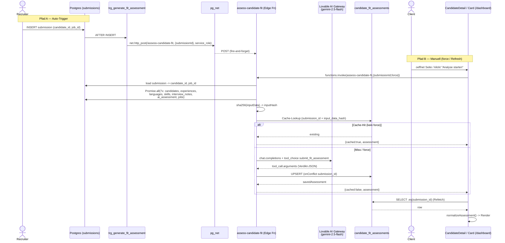

**RLS-Sichtbarkeit** (`20260306000000_*.sql:54-73`): Admins (`has_role admin`) -> alle; Recruiter -> Assessments **ihrer** Kandidaten (`candidates.recruiter_id = auth.uid()`); Clients -> **nur SELECT** fuer Submissions ihrer eigenen Jobs (`jobs.client_id = auth.uid()`). Trotz Recruiter-`FOR ALL`-Policy rendert **nur die Client-Sicht** die Card (`/dashboard`); in `src/pages/recruiter/*` und `src/pages/admin/*` gibt es **keine** Einbindung.

### 8.8 Reibungs- & Risikopunkte

| # | Bereich | Problem |
|---|---------|---------|
| F1 | **Auto-Trigger / Config** | `verify_jwt = true` (`config.toml:233`) steht im Konflikt mit dem `pg_net`-Aufruf, der einen Service-Role-**Bearer** (kein User-JWT) sendet. Je nach Gateway-Verhalten wird der Auto-Trigger-Call entweder abgewiesen oder umgeht JWT-Validierung — fragil und nicht offensichtlich. |
| F2 | **DB-Settings nie gesetzt** | Der Trigger liest `current_setting('app.settings.supabase_url'/'service_role_key')`. In **keiner** Migration werden diese GUCs per `ALTER DATABASE … SET` gesetzt. Die robuste Variante (`20260306221420`) loggt nur `RAISE WARNING` und gibt `RETURN NEW` zurueck — d. h. der Auto-Trigger **scheitert still** und es wird kein Assessment generiert, falls die Settings im Projekt fehlen. |
| F3 | **Doppelte Tabellen-Migration** | `20260305023057` und `20260306000000` legen `candidate_fit_assessments` **identisch** an (`CREATE TABLE` ohne `IF NOT EXISTS`). Bei sauberem Replay auf eine leere DB schlaegt die zweite Migration mit "relation already exists" fehl. |
| F4 | **Semantisches Achsen-Remapping** | `normalizeDimensionScores` mappt `seniority_fit -> leadership` und `location_fit -> growth_potential` (`fitAssessmentNormalizer.ts:296-301`). Die UI-Labels ("Senior.", "Potenzial") passen nicht zur Gemini-Semantik (Standort-Fit wird als "Wachstumspotenzial" angezeigt). |
| F5 | **`insufficient_data` -> `gap`** | `normalizeStatus` kollabiert `insufficient_data` und `not_met` beide auf `gap` (`:129-132`). Der System-Prompt verlangt explizit, fehlende Daten **nicht** als Negativsignal zu werten — in der UI erscheinen sie dennoch als rote "Luecke". |
| F6 | **Kein Realtime / Race** | Auto-Trigger ist async (fire-and-forget). Oeffnet der Client die Seite, bevor das LLM fertig ist, zeigt die Card "Analyse wird vorbereitet…" mit manuellem Fallback-Button; es gibt keine Subscription, die auf Fertigstellung reagiert. |
| F7 | **Trigger feuert auf ALLE Submissions** | Der `AFTER INSERT`-Trigger unterscheidet nicht nach Quelle/Status der Submission. Jede der ~15+ Edge Functions, die in `submissions` schreiben (z. B. `process-talent-hub-action`, `schedule-interview`), loest einen LLM-Call aus — potenziell Kosten/Rate-Limit-Druck ohne Throttling. |
| F8 | **`generated_by` vs. RLS** | Beim Service-Role-Upsert ist `generated_by = null`. Da die Edge Function mit Service-Role schreibt, greifen die RLS-Insert-Policies ohnehin nicht — die "Recruiters can manage"-Policy ist fuer den Schreibpfad praktisch wirkungslos (nur fuer direkte Client-Writes relevant, die es nicht gibt). |
| F9 | **Frontend nicht ausgerollt** | Card existiert nur im Repo, nicht in `matchunt.ai`. Auto-generierte Assessments sammeln sich potenziell in der DB an (Kosten), ohne dass ein Nutzer sie sieht. |

### 8.9 Offene Fragen

- Sind `app.settings.supabase_url` / `app.settings.service_role_key` im Produktiv-Supabase-Projekt manuell per `ALTER DATABASE` gesetzt? Falls nein, ist der Auto-Trigger faktisch inaktiv (F2).
- Wie verhaelt sich das Lovable Gateway konkret bei `verify_jwt=true` + Service-Role-Bearer aus `pg_net` (F1)? Wird der Call durchgelassen?
- Welche der beiden Tabellen-Migrationen (`20260305` vs. `20260306`) ist im Remote tatsaechlich angewandt — und ist die jeweils andere als "applied" markiert, sodass F3 beim Replay nicht auftritt?
- Soll `prompt_version` ("v1") jemals fuer A/B-Tests/Migration genutzt werden? Aktuell ist es konstant und steuert nichts.
- Ist das gleichzeitige Bestehen von `candidate_ai_assessment` (Input #6, alter Pfad) und `candidate_fit_assessments` (neu) gewollt, oder soll ersteres abgeloest werden?
- Soll das Feature throttled/entkoppelt werden (Queue statt Trigger-pro-Insert), bevor es im Frontend ausgerollt wird (F7/F9)?


---

## 09. Pipeline: Submission, Interview, Offer, Placement

# 09. Pipeline: Submission -> Interview -> Offer -> Placement

> Domäne: Kern-Recruiting-Pipeline der Matchunt-Plattform. Ein Kandidat wandert vom Recruiter-Submission über Interview-Terminierung und Angebot bis zum erfolgsbasierten Placement. Diese Sektion beschreibt die **State-Machine**, die **Edge-Function-Vernetzung**, die **DB-Trigger** und vor allem die **Benachrichtigungen/E-Mails** an jeder Stufe.
>
> Quelle = Code. Stand der Analyse: Branch `main`. Tabellen in `supabase/migrations/*.sql`, Functions in `supabase/functions/<name>/index.ts`, Frontend in `src/pages/{dashboard,recruiter}/` und `src/components/{interview,offers,placements,references,rejection}/`.

---

## 9.1 Überblick & beteiligte Akteure

Die Pipeline verbindet drei Personas plus zwei externe Token-Portale (öffentlich, ohne Login):

| Akteur | Einstieg | Rolle in der Pipeline |
|--------|----------|----------------------|
| **Recruiter** (`/recruiter/*`) | `RecruiterSubmissions.tsx`, `SubmissionDetail.tsx` | Reicht Kandidaten ein, holt Opt-In ein, fordert Referenzen an, sieht Status. |
| **Client** (`/dashboard/*`) | `CandidateDetail.tsx`, `ClientJobDetail.tsx`, `ClientInterviews.tsx`, `ClientOffers.tsx`, `ClientPlacements.tsx` | Lädt zum Interview ein, erstellt/sendet Angebote, „stellt ein". |
| **Admin** (`/admin/*`) | `AdminInterviews.tsx`, `AdminPlacements.tsx` | Read-only-Monitoring der Pipeline. |
| **Kandidat** (Token-Portal) | `/interview/respond/:token`, `/interview/select/:token`, `/offer/view/:token` | Antwortet auf Interview-Einladung, signiert Angebot. Kein Account nötig. |
| **Referenzgeber** (Token-Portal) | `/reference/:token` | Füllt Referenzformular aus. |

Routing der öffentlichen Token-Portale: `src/App.tsx:447-451`.

```
/interview/respond/:token  -> InterviewResponsePage  (App.tsx:448)
/interview/select/:token   -> SelectSlot             (App.tsx:447)
/offer/view/:token         -> ViewOffer              (App.tsx:449)
/reference/:token          -> ProvideReference       (App.tsx:451)
```

---

## 9.2 Die Tabellen der Domäne

| Tabelle | Definiert in | Zweck | Wichtigste Statusfelder |
|---------|--------------|-------|--------------------------|
| `submissions` | `20251204171610_*.sql:75` (Basis) + Erweiterungen | Zentrale Pipeline-Entität, Bindeglied job ↔ candidate ↔ recruiter | `status` (default `submitted`), `stage` |
| `interviews` | `20251204171610_*.sql:91` (Basis) + `20251204225412_*.sql` (Token/Slots) | Interview-Termin pro Submission | `status` (default `pending`), `proposed_slots` JSONB, `selection_token`, `response_token` |
| `offers` | `20251204215330_*.sql:13` | Jobangebot pro Submission | `status` (default `draft`), `access_token`, `negotiation_rounds` |
| `offer_events` | `20251204215330_*.sql:65` | Audit-Trail jeder Offer-Aktion | `event_type`, `actor_type` |
| `placements` | `20251204171610_*.sql:106` + `20251204225412_*.sql:49` (Escrow) | Erfolgreiche Vermittlung + Honorar-/Escrow-Buchung | `payment_status` (default `pending`), `escrow_status` |
| `rejections` + `rejection_templates` | `20251204215330_*.sql:125/139` | Absage-Records + Vorlagen | `rejection_stage`, `reason_category` |
| `reference_requests` | `20251204231510_*.sql:173` | Referenzanfrage mit Token | `status` (`pending`/`completed`/`declined`/`expired`) |
| `reference_responses` | `20251204231510_*.sql:194` | Referenzantwort + KI-Analyse | `ai_summary`, `ai_risk_flags` JSONB |
| `interview_intelligence` | (gen. types / `generate-interview-prep`) | KI-Interview-Vorbereitung pro Interview | `candidate_prep`, `interviewer_guide` (upsert on `interview_id`) |
| `communication_log` | `20251204215330_*.sql:76` | Versand-Log (Offer-E-Mails) | `channel`, `status` |
| `match_outcomes` / `ml_training_events` | `20260122214002_*.sql:7` | ML-Outcome-Tracking, gespeist per Trigger | `actual_outcome`, `final_outcome` |

Realtime ist aktiviert für: `submissions`, `interviews`, `offers`, `offer_events`, `notifications` (`ALTER PUBLICATION supabase_realtime ADD TABLE ...`). Placements **nicht**.

---

## 9.3 Die State-Machine (status + stage)

Achtung: Es gibt **zwei parallele Statusfelder** auf `submissions`:

- `submissions.status` — grobkörnig (`submitted` → `interview` → `offer_extended` → `placed` / `rejected` / `hired`).
- `submissions.stage` — feinkörnige UI-Pipeline (`new` → `submitted` → `screening` → `interview_requested` → `candidate_opted_in` → `interview_scheduled` → `offer_pending` → `placed`).

Beide werden an unterschiedlichen Stellen unabhängig gesetzt und **driften auseinander** (siehe Friction Points 9.8). Die UI-Pipeline-Reihenfolge ist hardcodiert in `src/pages/recruiter/SubmissionDetail.tsx:47-64` (`PIPELINE_STAGES` + `getStageIndex`).

### Statusfluss-Diagramm

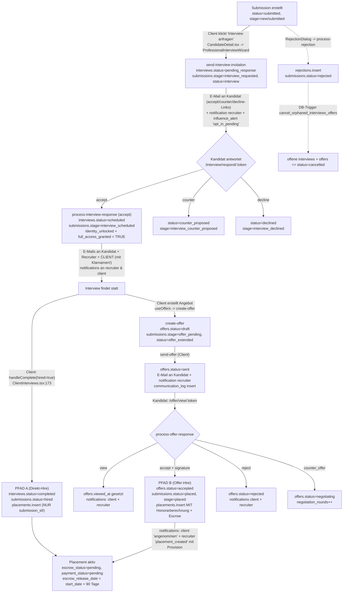

### Status-Wertebereiche (aus dem Code)

`interviews.status` (kein DB-CHECK, frei gesetzt durch Functions):
`pending` (DB-Default) · `pending_response` (send-interview-invitation) · `scheduled` · `counter_proposed` · `declined` · `completed` · `cancelled` · `no_show`.

`offers.status`: `draft` → `sent` → `viewed`-(nur `viewed_at`, Status bleibt `sent`) → `accepted` / `rejected` / `negotiating` / `cancelled` / `expired` / `withdrawn`.

`submissions.status` (relevante Werte): `submitted`, `interview`, `offer_extended`, `placed`, `hired`, `rejected`, `client_rejected`, `withdrawn`, `expired`.

---

## 9.4 Edge Functions im Detail

### Interview-Subdomäne

| Function | Aufgerufen von | Schreibt | E-Mail / Notification |
|----------|----------------|----------|------------------------|
| `send-interview-invitation` | `ProfessionalInterviewWizard.tsx:51` (Client) | `interviews` (insert, `status=pending_response`, `response_token`), `submissions` (`stage=interview_requested`, `status=interview`), `notifications`, `influence_alerts` | **Resend** direkt an Kandidat (HTML mit accept/counter/decline-Links). `from: noreply@matchunt.ai`. Anonymisiert (nur Vorname + „`<Branche>`-Unternehmen"). |
| `process-interview-response` | `InterviewResponsePage.tsx:163/190/215` (Kandidat, Token) | `interviews` (`status=scheduled/counter_proposed/declined`), `submissions` (`identity_unlocked`, `company_revealed`, `full_access_granted` = TRUE bei accept), `notifications` | **Resend** an Kandidat, Recruiter UND **Client mit Klarnamen + E-Mail + Telefon** (Identity-Reveal Stufe 2). iCal-Attachment. |
| `schedule-interview` | `useInterviewScheduling.ts` + `NoShowReportDialog.tsx:68` + `CancelInterviewDialog.tsx:76` + `SelectSlot.tsx:111` | `interviews` (slots/scheduled/no_show), `submissions` (`full_access_granted`), `notifications`, `client_notifications`, `platform_events` | `supabase.functions.invoke('send-email', ...)` (Template-basiert, **try/catch silently ignored**). Eigenes `selection_token`-System. |
| `generate-interview-prep` | `useInterviewIntelligence.ts:90` | `interview_intelligence` (upsert on `interview_id`), `notifications` | KI-Generierung via **Lovable AI Gateway** (`google/gemini-2.5-flash`). Notification `interview_prep_ready` an Recruiter. |
| `process-interview-notes` | `useAIAssessment.ts:71`, `QuickInterviewSummary.tsx:80` | `candidate_ai_assessment` (upsert on `candidate_id`) | KI via `api.lovable.dev` (`gpt-4o-mini`). Keine E-Mail. |

> **Zwei konkurrierende Interview-Scheduling-Mechanismen** existieren parallel:
> 1. **Wizard-Pfad** (`send-interview-invitation` + `process-interview-response`): nutzt `response_token`, generiert E-Mail per **Resend direkt**, Slots als `{datetime, status:'available'}`. Das ist der aktive Pfad aus `CandidateDetail.tsx`.
> 2. **Slot-Token-Pfad** (`schedule-interview` mit Aktionen `generate-slots`/`select-slot`/`confirm-attendance`/`send-reminders`/`report-no-show`): nutzt `selection_token`, E-Mails per `send-email`-Function, Slots als `{datetime, status:'pending'}`. Aktiv für No-Show/Cancel und die separate `SelectSlot`-Seite.
>
> Beide schreiben dieselbe `interviews`-Tabelle, aber mit **unterschiedlichen Statuswerten, Token-Spalten und Slot-Status-Strings** — ein erheblicher Konsistenzrisiko-Faktor.

### Offer-Subdomäne

| Function | Aufgerufen von | Schreibt | E-Mail / Notification |
|----------|----------------|----------|------------------------|
| `create-offer` | `useOffers.ts:138` (`useCreateOffer`) | `offers` (insert, `status=draft`, `access_token`, `expires_at`), `offer_events` (`created`), `submissions` (`stage=offer_pending`, `status=offer_extended`) | Keine E-Mail. Auth-Check: `submission.jobs.client_id === user.id`. |
| `send-offer` | `useOffers.ts:170` (`useSendOffer`) | `offers` (`status=sent`, `sent_at`), `offer_events` (`sent`), `communication_log`, `notifications` | **Resend via fetch** (Plaintext-E-Mail). `from: noreply@lovable.app`. Notification `offer_sent` an Recruiter. |
| `process-offer-response` | `useOffers.ts:208` (`useProcessOfferResponse`) — Kandidat via Token | `offers` (`accepted/rejected/negotiating`), `offer_events`, `submissions` (`status=placed, stage=placed` bei accept), **`placements` (insert mit Honorarberechnung)**, `notifications` | Keine E-Mail (nur In-App-Notifications an client + recruiter). |

**Honorarlogik** (`process-offer-response/index.ts:125-143`):
```
totalFee        = round(salary_offered * jobs.fee_percentage/100)           // Default 20%
recruiterPayout = round(totalFee * jobs.recruiter_fee_percentage / jobs.fee_percentage)  // 15/20
platformFee     = totalFee - recruiterPayout
escrowReleaseDate = (offer.start_date || now) + 90 Tage
```
Diese Berechnung existiert **nur** im Offer-Accept-Pfad. Der Direkt-Hire-Pfad (`ClientInterviews.handleComplete`) erzeugt ein Placement **ohne** Honorar (siehe 9.8).

### Placement-Subdomäne

Es gibt **keine** dedizierte `create-placement`-Edge-Function. Placements entstehen ausschließlich per direktem `supabase.from('placements').insert(...)` an **zwei** Stellen:
- `process-offer-response/index.ts:134` (vollständig, mit Fees/Escrow) — **kanonischer Pfad**.
- `src/pages/dashboard/ClientInterviews.tsx:190` (`handleComplete`, nur `submission_id` + `payment_status:'pending'`) — **Bypass**.

`ClientPlacements.tsx` ist read-only (`fetchPlacements`, `supabase.from('placements').select(...)`, `src/pages/dashboard/ClientPlacements.tsx:49`). Down­stream hängt die Auszahlung an `process-payout` / `stripe-connect` (eigene Finanzdomäne, hier nicht im Fokus).

### Rejection- & Reference-Subdomäne

| Function | Aufgerufen von | Schreibt | E-Mail |
|----------|----------------|----------|--------|
| `process-rejection` | `RejectionDialog.tsx:50` | `rejections`, `submissions` (`status=rejected`), `notifications`, `activity_logs` | `send-email`-Function (Template `rejection_notification`, try/catch ignored). |
| `request-reference` | `useReferenceChecks.ts:95` (`requestReference`) | `reference_requests` (insert, `access_token`, 14d Ablauf) | **Resend via fetch**, `from: RecruitFlow <noreply@recruitflow.app>`. Link `${origin}/reference/${token}`. |
| `analyze-reference` | `useReferenceChecks.ts:198` (nach Formular-Submit) | `reference_responses` (`ai_summary`, `ai_risk_flags`) | Keine. KI via **Lovable AI Gateway** (`gemini-2.5-flash`) mit deterministischem Fallback-Scoring. |

---

## 9.5 Sequenzdiagramm: Glücklicher Pfad (Interview → Offer → Placement)

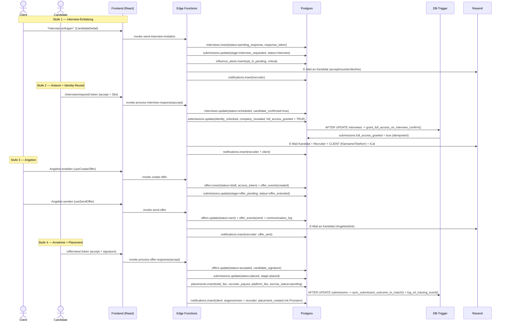

---

## 9.6 Datenbank-Trigger (das „unsichtbare" Verhalten)

Diese Trigger feuern automatisch bei Statuswechseln und sind essenziell für das Pipeline-Verhalten:

| Trigger | Tabelle/Event | Funktion | Effekt |
|---------|---------------|----------|--------|
| `on_submission_opt_in` | `submissions` BEFORE UPDATE | `reveal_company_on_opt_in()` (`20260122110726_*.sql:20`) | **Triple-Blind Stufe 1**: bei `status='candidate_opted_in'` → `company_revealed=true`. |
| `on_interview_confirmed` | `interviews` AFTER UPDATE | `grant_full_access_on_interview_confirm()` (`20260122110726_*.sql:44`) | **Triple-Blind Stufe 2**: bei `candidate_confirmed=true` → `submissions.full_access_granted=true` (idempotent, redundant zur Function-Logik). |
| `trigger_cancel_orphaned_interviews_offers` | `submissions` AFTER UPDATE | `cancel_orphaned_interviews_offers()` (`20260124170911_*.sql:48`) | Bei `status IN (rejected, withdrawn, hired, client_rejected)` → setzt offene `interviews` und `offers` automatisch auf `cancelled`. Verhindert verwaiste Records. |
| `trigger_sync_outcome` | `submissions` AFTER UPDATE | `sync_submission_outcome_to_match()` (`20260122214002_*.sql:57`) | Schreibt finalen Outcome in `match_outcomes` (ML-Feedback-Loop). |
| `trigger_log_ml_event_insert/update` | `submissions` INSERT/UPDATE | `log_ml_training_event()` (`20260122214002_*.sql:79`) | Snapshot in `ml_training_events` für ML-Training. |
| `trg_generate_fit_assessment` | `submissions` AFTER INSERT | `trigger_generate_fit_assessment()` (`20260307000000_*.sql:12`) | Fire-and-forget `net.http_post` → `assess-candidate-fit` Edge Function (Pre-Generierung der Fit-Bewertung). |
| `submissions_activity_log` / `placements_activity_log` / `interviews_activity_log` | jeweils INSERT/UPDATE | Activity-Logging | Audit-Trail. |
| `client_interviews_view` / `client_offers_view` | Views (security_invoker) | `20260124170911_*.sql:3/27` | Filtern bereits beendete/abgelehnte Submissions aus der Client-Sicht heraus. |

Wichtig: Die Triggerlogik in `grant_full_access_on_interview_confirm` **dupliziert** die Reveal-Logik, die `process-interview-response` und `schedule-interview` ohnehin schon manuell ausführen — defensive Redundanz, aber doppelte Wahrheit.

---

## 9.7 Benachrichtigungen & E-Mail — die Kanäle pro Stufe

Es existieren **drei** Benachrichtigungsmechanismen nebeneinander:

1. **`notifications`** (user-zentriert, `user_id`) — Recruiter & Client In-App, realtime-aktiviert.
2. **`client_notifications`** (`client_id`, `action_url`, `submission_id`) — nur von `schedule-interview` benutzt.
3. **E-Mail** — uneinheitlich: teils **Resend direkt** (`send-interview-invitation`, `process-interview-response`, `send-offer`, `request-reference`), teils über die **`send-email`-Function** (`schedule-interview`, `process-rejection`).

| Stufe | Auslöser | E-Mail an | Mechanismus | Absender |
|-------|----------|-----------|-------------|----------|
| Interview-Einladung | `send-interview-invitation` | Kandidat | Resend (HTML) | `noreply@matchunt.ai` |
| Interview bestätigt | `process-interview-response` (accept) | Kandidat + Recruiter + **Client (Klarname)** | Resend (HTML + iCal) | `noreply@matchunt.ai` |
| Slot-Vorschlag (Alt-Pfad) | `schedule-interview` (generate-slots) | Recruiter | `send-email`-Function (try/catch) | (Template) |
| Interview-Reminder | `schedule-interview` (send-reminders) | Client + Recruiter | nur `client_notifications` + `notifications` (kein echtes E-Mail-Send im Code!) | — |
| Angebot gesendet | `send-offer` | Kandidat | Resend (fetch, Plaintext) | `noreply@lovable.app` |
| Angebot angenommen | `process-offer-response` (accept) | — (nur In-App) | `notifications` | — |
| Absage | `process-rejection` | Kandidat | `send-email`-Function (try/catch) | (Template) |
| Referenzanfrage | `request-reference` | Referenzgeber | Resend (fetch, HTML) | `noreply@recruitflow.app` |

> **Drei verschiedene Absenderdomänen** (`matchunt.ai`, `lovable.app`, `recruitflow.app`) im selben Produkt — klares Branding-/Zustellbarkeitsproblem.

---

## 9.8 Friction Points & Risiken (im Code beobachtet)

1. **Dualer Placement-Pfad mit Honorar-Diskrepanz.** `ClientInterviews.handleComplete` (`src/pages/dashboard/ClientInterviews.tsx:173-201`) erstellt bei „eingestellt" ein Placement mit **nur** `submission_id` + `payment_status` und setzt `submissions.status='hired'`. Der kanonische Pfad `process-offer-response` (`supabase/functions/process-offer-response/index.ts:134`) berechnet hingegen `total_fee`/`recruiter_payout`/`platform_fee`/`escrow_release_date`. Ergebnis: Placements ohne Honorar und ohne Escrow, je nachdem, wie der Client den Kandidaten „einstellt". Da `placements.submission_id` UNIQUE ist, kollidiert der Direkt-Hire zudem mit einem evtl. später akzeptierten Offer (insert schlägt fehl).

2. **`status` vs. `stage` driften auseinander.** `send-interview-invitation` setzt `status='interview'` **und** `stage='interview_requested'`. `process-offer-response` setzt `status='placed', stage='placed'`, aber `ClientInterviews.handleComplete` setzt nur `status='hired'` (kein `stage`). `process-rejection` setzt nur `status='rejected'` (kein `stage`). Die UI-Pipeline (`SubmissionDetail.tsx:47`) liest `stage`, das Outcome-Tracking (`sync_submission_outcome_to_match`) liest `status`. Quellen der Wahrheit divergieren.

3. **Zwei konkurrierende Interview-Scheduling-Systeme** auf einer Tabelle. `send-interview-invitation`/`process-interview-response` (`response_token`, Slot-Status `available`) vs. `schedule-interview` (`selection_token`, Slot-Status `pending`/`accepted`). Unterschiedliche Statuswerte (`pending_response` vs. `pending`) und Slot-Schemata führen zu fragilen Filtern; `ClientInterviews` filtert z. B. hart auf `meeting_type` (`video/teams/meet`), während die Wizard-Function `meeting_format` UND `meeting_type` schreibt.

4. **Interview-Reminder versenden keine echte E-Mail.** `schedule-interview/sendReminderEmail` (`supabase/functions/schedule-interview/index.ts:530-572`) loggt nur per `console.log` und schreibt `client_notifications`/`notifications`, ruft aber **keinen** Resend-/`send-email`-Aufruf auf. Zudem existiert **kein Cron-Job**, der `send-reminders` triggert (die pg_cron-Jobs in `20260225200000_*.sql:133` rufen nur influence/escalation-Engines). Reminder werden also faktisch nie automatisch ausgelöst.

5. **Identity-Reveal teilweise vor Opt-In.** `process-interview-response` (accept) setzt `full_access_granted=true` und mailt dem Client **sofort Klarnamen, E-Mail, Telefon** des Kandidaten (`supabase/functions/process-interview-response/index.ts:215-260`). Das Opt-In des Kandidaten (`stage=candidate_opted_in`, vom Recruiter via `SubmissionDetail.handleConfirmOptIn:265`) ist ein **separater, manueller** Schritt, der hier nicht erzwungen wird. Die Triple-Blind-Garantie hängt damit allein an der Annahme-Aktion, nicht am dokumentierten Consent.

6. **Schwache Token-Generierung.** `send-interview-invitation`, `send-offer`, `create-offer` erzeugen Tokens via `Math.random()` über ein 62-Zeichen-Alphabet (`generateToken`/`generateAccessToken`, z. B. `supabase/functions/send-interview-invitation/index.ts:28`). Für öffentliche, unauthentifizierte Portale, die Klarnamen und Gehaltsangaben freischalten, ist `Math.random()` nicht kryptografisch sicher. `request-reference` und `schedule-interview` nutzen dagegen `crypto.randomUUID()` — uneinheitlich.

7. **Fehlende Idempotenz / E-Mail im Erfolgsfall.** `process-offer-response` (accept) versendet **keine** Bestätigungs-E-Mail an Kandidat/Client (nur In-App `notifications`), während Interview-Bestätigungen Mails senden — inkonsistente Candidate Experience. Außerdem fehlt im Accept-Pfad eine Prüfung, ob bereits ein Placement existiert (UNIQUE-Constraint-Crash möglich nach Direkt-Hire).

8. **`process-rejection` mailt an die falsche Adresse.** Template `rejection_notification` wird mit `to: submission.candidate.email` versendet, das `data`-Objekt setzt aber zusätzlich `recruiter_email: submission.candidate.email` (`supabase/functions/process-rejection/index.ts:108-121`) — der Kandidat erhält die Absage direkt, obwohl der Kommentar „Send … to recruiter" lautet. Im Triple-Blind-Kontext potenziell ungewollte Direktkommunikation.

9. **Stille Fehler.** Mehrere E-Mail-Aufrufe sind in `try/catch` gekapselt, die den Fehler nur `console.log`en (`schedule-interview:429`, `process-rejection:122`). Versandfehler bleiben für Nutzer unsichtbar; es gibt kein Retry/Dead-Letter (außer der separaten `resend-webhooks`-Function).

10. **Frontend-Direktschreibzugriff umgeht Business-Logik.** `ClientInterviews.handleComplete/handleNoShow` und `handleSave` schreiben `interviews`/`submissions`/`placements` **direkt** per `supabase.from(...).update()`, statt `schedule-interview`/`process-offer-response` zu nutzen. Dadurch werden Notifications, `offer_events`, Honorarberechnung und Activity-Logs übersprungen — die Edge-Function-Schicht wird teilweise entwertet.

---

## 9.9 Kern-Vernetzungen (Frontend → Function → Tabelle)

| Frontend-Trigger | Edge Function | Primär geschriebene Tabellen |
|------------------|---------------|------------------------------|
| `ProfessionalInterviewWizard.tsx:51` | `send-interview-invitation` | `interviews`, `submissions`, `notifications`, `influence_alerts` |
| `InterviewResponsePage.tsx:163/190/215` | `process-interview-response` | `interviews`, `submissions`, `notifications` |
| `useInterviewScheduling.ts` / `SelectSlot.tsx:111` / `NoShowReportDialog.tsx:68` / `CancelInterviewDialog.tsx:76` | `schedule-interview` | `interviews`, `submissions`, `notifications`, `client_notifications`, `platform_events` |
| `useInterviewIntelligence.ts:90` | `generate-interview-prep` | `interview_intelligence`, `notifications` |
| `useAIAssessment.ts:71` / `QuickInterviewSummary.tsx:80` | `process-interview-notes` | `candidate_ai_assessment` |
| `useOffers.ts:138` (`useCreateOffer`) | `create-offer` | `offers`, `offer_events`, `submissions` |
| `useOffers.ts:170` (`useSendOffer`) | `send-offer` | `offers`, `offer_events`, `communication_log`, `notifications` |
| `useOffers.ts:208` (`useProcessOfferResponse`) | `process-offer-response` | `offers`, `offer_events`, `submissions`, **`placements`**, `notifications` |
| `RejectionDialog.tsx:50` | `process-rejection` | `rejections`, `submissions`, `notifications`, `activity_logs` |
| `useReferenceChecks.ts:95` | `request-reference` | `reference_requests` |
| `useReferenceChecks.ts:198` (nach Formular) | `analyze-reference` | `reference_responses` |
| `ClientInterviews.tsx:173/190` (Direkt, ohne Function) | — | `interviews`, `submissions`, `placements` |

---

## 9.10 Offene Fragen

- Welcher der beiden Interview-Scheduling-Pfade ist der **strategisch gewollte**? `schedule-interview` (Slot-Token, `send-email`) wirkt wie der ältere; `send-interview-invitation` (Resend direkt) wie der neuere, aktiv aus `CandidateDetail`. Soll `schedule-interview` außer No-Show/Cancel deprecaten?
- Soll der **Direkt-Hire** in `ClientInterviews.handleComplete` ganz entfernt werden zugunsten des Offer-Flows, oder muss er ein vollständiges Placement (inkl. Fees) erzeugen?
- Wer/was triggert in Produktion die **Interview-Reminder** (`schedule-interview` action `send-reminders`)? Aktuell gibt es keinen Cron-Eintrag dafür.
- Ist die `placements.submission_id`-UNIQUE-Constraint mit Mehrfach-Angeboten pro Submission vereinbar (z. B. nach `negotiating` → neues Offer)?
- Wird `submissions.stage` als kanonische Pipeline-Wahrheit etabliert, und werden alle Schreiber (`process-rejection`, Direkt-Hire) entsprechend nachgezogen?
- Soll der Identity-Reveal an `submissions.consent_confirmed`/`opt_in_response` gekoppelt werden, statt allein an die Interview-Annahme?
- Konsolidierung auf **eine** Absenderdomäne und **einen** E-Mail-Mechanismus (Resend vs. `send-email`-Function) — gibt es dafür schon eine Roadmap?


---

## 10. Finanzen, Stripe & Auszahlungen

> Domänen-Analyse für das CTO-Team ("Matchunt"). Quelle der Wahrheit ist der Quellcode unter `supabase/functions/`, `supabase/migrations/` und `src/`. Stand: Branch `main`, ~81 Edge Functions / 93 Migrationen.

Diese Domäne implementiert das **erfolgsbasierte Honorar-Modell** der Plattform: Bei einer erfolgreichen Einstellung (Placement) entsteht ein Honorar (`total_fee`), das in einen Plattform-Anteil (`platform_fee`) und eine Recruiter-Provision (`recruiter_payout`) aufgeteilt wird. Die Recruiter-Provision durchläuft eine **90-Tage-Escrow-Periode**, wird vom Recruiter angefordert, vom Admin genehmigt und via **Stripe Connect (Express)** ausgezahlt. Parallel dazu existiert das **deal-health-Scoring**, das den Fortschritt eines Deals bewertet und Drop-Off-Risiken früh erkennt.

> **Wichtigster Befund vorab:** Die Finanz-Domäne ist nur in der *Auszahlungs-Hälfte* (Recruiter ← Stripe Connect) konsistent implementiert. Die *Einnahme-Hälfte* (Client → Plattform via Stripe Charge/Invoice) ist **nicht durchgängig verdrahtet**: Es existiert keine Edge Function, die `invoices` erzeugt oder einen `PaymentIntent` anlegt. Der Webhook `payment_intent.succeeded` matcht auf `stripe_payment_intent_id`, das aber an keiner Stelle gesetzt wird. Details in §10.7.

---

### 10.1 Datenmodell (Tabellen)

| Tabelle | Definiert in | Zweck | Schlüsselspalten |
|---|---|---|---|
| `placements` | `supabase/migrations/20251204171610_*.sql:106`, erweitert in `20251204195741_*.sql:49` | Erfolgreiche Einstellung; trägt die Honorar-Aufteilung | `submission_id` (UNIQUE), `agreed_salary`, `total_fee`, `platform_fee`, `recruiter_payout`, `payment_status`, `escrow_status`, `escrow_release_date`, `paid_at` |
| `invoices` | `supabase/migrations/20251204182100_*.sql:106`, erweitert in `20251204195741_*.sql:46` | Client-Rechnung pro Placement | `placement_id`, `client_id`, `invoice_number` (UNIQUE), `amount`, `tax_amount`, `total_amount`, `status`, `stripe_payment_intent_id`, `stripe_invoice_id`, `currency`, `pdf_url` |
| `stripe_accounts` | `supabase/migrations/20251204195741_*.sql:4` | Stripe-Connect-Konto je Recruiter | `user_id`, `stripe_account_id` (UNIQUE), `account_type`, `charges_enabled`, `payouts_enabled`, `details_submitted`, `onboarding_complete` |
| `payout_requests` | `supabase/migrations/20251204195741_*.sql:18` | Auszahlungsanfrage Recruiter → Admin → Stripe | `placement_id`, `recruiter_id`, `amount`, `currency`, `status` (`pending`→`approved`→`processing`→`completed`/`failed`/`cancelled`), `stripe_transfer_id`, `approved_by`, `failure_reason` |
| `payment_events` | `supabase/migrations/20251204195741_*.sql:34` | Idempotenz-/Audit-Log für Stripe-Webhooks | `stripe_event_id` (UNIQUE), `event_type`, `payload` (JSONB), `processed`, `error_message` |
| `deal_health` | `supabase/migrations/20251204205344_*.sql:2` | Scoring/Risiko je Submission | `submission_id` (UNIQUE), `health_score`, `risk_level`, `drop_off_probability`, `bottleneck`, `recommended_actions`, `risk_factors` |
| `offers` | `supabase/migrations/20251204215330_*.sql:13` | Angebot mit Gehalt; Vorstufe zum Placement | `salary_offered`, `bonus_amount`, `equity_percentage`, `status`, `access_token` |
| `jobs` (Honorar-Parameter) | `supabase/migrations/20251204171610_*.sql:28` | Trägt die Fee-Sätze pro Job | `fee_percentage` DEFAULT **20.00**, `recruiter_fee_percentage` DEFAULT **15.00** |
| `user_roles.custom_fee_percentage` | `supabase/migrations/20251204184027_*.sql:10` | Recruiter-individueller Fee-Satz (Admin pflegt ihn) | wird im Frontend gesetzt, aber **nie** in Honorar-Berechnung verwendet (§10.4) |
| `profiles.bank_iban` | `supabase/migrations/20251204173818_*.sql:84` | Manuelle IBAN — Parallel-Pfad zu Stripe (§10.8) | nur in `AdminPayments` gelesen |

**RLS-Kurzfassung:**
- `stripe_accounts`: User sieht/ändert nur eigenes Konto; Admin `ALL`.
- `payout_requests`: Recruiter darf eigene `SELECT` + `INSERT`; Admin `ALL`. → Der Recruiter erstellt die Anfrage clientseitig direkt per `insert` (kein Edge-Function-Gate).
- `payment_events`: `INSERT WITH CHECK (true)` (System), `ALL` nur Admin.
- `placements`: nur `SELECT` für beteiligten Recruiter/Client und `ALL` für Admin — **kein INSERT/UPDATE-Policy für client/recruiter** (relevant für den Bug in §10.6).
- `invoices`: Client `SELECT` eigene; Admin `ALL`.

---

### 10.2 Edge Functions im Überblick

| Function | `verify_jwt` (`config.toml`) | Auth-Modell | Schreibt in | Liest aus |
|---|---|---|---|---|
| `stripe-connect` | `true` | ANON-Client + `getUser()` (Recruiter-Kontext) | `stripe_accounts` | `profiles`, `stripe_accounts` |
| `process-payout` | `true` | ANON-Client + **Admin-Check** über `user_roles`; dann SERVICE-ROLE für Writes | `payout_requests`, `placements`, `notifications` | `payout_requests`, `stripe_accounts`, `placements` |
| `stripe-webhooks` | `false` | **Signatur-Verifikation** via `STRIPE_WEBHOOK_SECRET`; SERVICE-ROLE | `payment_events`, `invoices`, `placements`, `stripe_accounts`, `payout_requests` | – |
| `create-offer` | `true` | SERVICE-ROLE + manuelle `getUser()` + Ownership-Check | `offers`, `offer_events`, `submissions` | `submissions`, `jobs`, `candidates` |
| `process-offer-response` | `false` | **Token-basiert** (`access_token` des Angebots), SERVICE-ROLE | `offers`, `offer_events`, `submissions`, **`placements` (Honorar-Berechnung!)**, `notifications` | `offers` + Joins |
| `deal-health` | `true` | SERVICE-ROLE | `deal_health` (upsert) | `submissions`, `platform_events`, `sla_deadlines`, `user_behavior_scores` |

`STRIPE_SECRET_KEY` (Stripe API), `STRIPE_WEBHOOK_SECRET`, `SUPABASE_SERVICE_ROLE_KEY` sind die kritischen Secrets dieser Domäne.

---

### 10.3 Geldfluss end-to-end (Soll-Architektur)

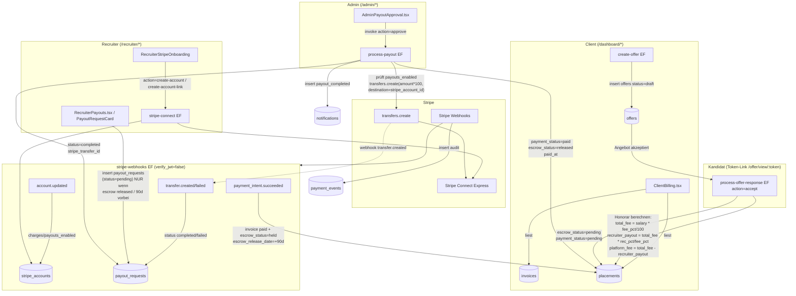

**Schritt-für-Schritt (Happy Path):**
1. **Angebot** – Client legt über `create-offer` (`supabase/functions/create-offer/index.ts`) ein `offers`-Record an (Status `draft`), generiert `access_token`, Kandidaten-Link `…/offer/view/<token>`.
2. **Annahme** – Kandidat akzeptiert über den Token-Link → `process-offer-response` (`action=accept`). Hier wird das Honorar berechnet und das `placements`-Record erzeugt (`supabase/functions/process-offer-response/index.ts:123-144`).
3. **Zahlung Client → Plattform** – *(Soll)* Client bezahlt die `invoice`; `payment_intent.succeeded` setzt Invoice `paid`, Placement `escrow_status=held`, `escrow_release_date = now + 90 Tage` (`supabase/functions/stripe-webhooks/index.ts:46-84`). **Ist-Lücke siehe §10.7.**
4. **Onboarding Recruiter** – `RecruiterStripeOnboarding` → `useStripeConnect` → `stripe-connect` (`create-account`, dann `create-account-link`). Express-Konto, Land `DE`, `business_type=individual` (`supabase/functions/stripe-connect/index.ts:84-95`).
5. **Auszahlungs-Anfrage** – Sobald Escrow abgelaufen (`escrow_status` in `held`/`released` und Release-Datum erreicht), erlaubt `PayoutRequestCard.canRequestPayout()` den `insert` in `payout_requests` (`src/components/payment/PayoutRequestCard.tsx:38-67`).
6. **Genehmigung** – Admin in `AdminPayoutApproval` → `process-payout` (`action=approve`). Prüft `payouts_enabled`, ruft `stripe.transfers.create({ amount: amount*100, destination: stripe_account_id })`, setzt `payout_requests.status=completed`, `placements.payment_status=paid / escrow_status=released / paid_at`, erstellt `notification` (`supabase/functions/process-payout/index.ts:115-160`).
7. **Webhook-Bestätigung** – Stripe sendet `transfer.created`; Webhook matcht auf `stripe_transfer_id` und setzt erneut `completed` (idempotent-ähnlich, §10.7).

---

### 10.4 Honorar-/Gebührenlogik (die eine echte Berechnung)

Die **einzige** belastbare Honorarberechnung liegt in `process-offer-response/index.ts:123-126`:

```ts
const totalFee        = Math.round(offer.salary_offered * (offer.jobs.fee_percentage || 20) / 100);
const recruiterPayout = Math.round(totalFee * (offer.jobs.recruiter_fee_percentage || 15) / (offer.jobs.fee_percentage || 20));
const platformFee     = totalFee - recruiterPayout;
```

Interpretation der Defaults (`fee_percentage=20`, `recruiter_fee_percentage=15`):
- **Gesamthonorar** = 20 % des Jahresgehalts (an die Plattform fakturierbar).
- **Recruiter-Anteil** = `totalFee * 15/20` = **75 % des Honorars** (≙ 15 % des Gehalts).
- **Plattform-Marge** = `totalFee - recruiterPayout` = **25 % des Honorars** (≙ 5 % des Gehalts).

Konsequenzen / Reibung:
- `recruiter_fee_percentage` ist hier **kein** eigenständiger Gehalts-Prozentsatz, sondern wird als Anteil *innerhalb* des `fee_percentage` interpretiert. Setzt ein Admin `recruiter_fee_percentage > fee_percentage`, würde `recruiter_payout > total_fee` und `platform_fee` **negativ**.
- `user_roles.custom_fee_percentage` (pro Recruiter, im `AdminRecruiters` gepflegt) fließt **nicht** in diese Formel ein — nur die Job-Spalten zählen. Der „individuelle Fee“ ist also reine Anzeige ohne finanzielle Wirkung.
- Es gibt **keine MwSt./Tax-Berechnung** im Honorar-Pfad. `invoices.tax_amount` existiert in der Tabelle, wird aber nirgends befüllt.

---

### 10.5 Escrow- & Auszahlungs-Zustandsmaschine

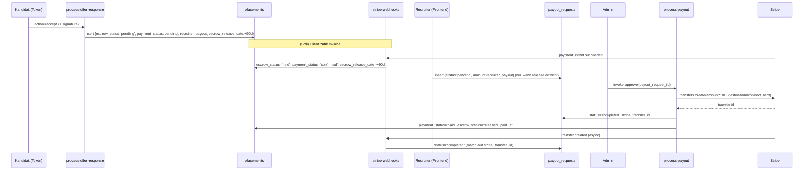

`escrow_status` Wertebereich (CHECK in `20251204195741_*.sql:49`): `pending | held | released | disputed | refunded`. Hinweis: `disputed`/`refunded` sind im Schema vorgesehen, werden aber von **keiner** Function/Frontend je gesetzt → toter Zustand.

Die `available`-Berechnung im Recruiter-Frontend (`src/pages/recruiter/RecruiterPayouts.tsx:99-108`) und die Freigabe-Gate-Logik (`PayoutRequestCard.tsx:38-46`) implementieren die 90-Tage-Regel **doppelt und identisch clientseitig** — es gibt keine serverseitige Durchsetzung (§10.6).

---

### 10.6 Vernetzung Frontend → Edge Function → Tabellen

| Frontend (Persona) | Aufruf | Edge Function / direkter Zugriff | Effekt |
|---|---|---|---|
| `RecruiterStripeOnboarding` (`src/components/payment/RecruiterStripeOnboarding.tsx`) via `useStripeConnect` | `supabase.functions.invoke('stripe-connect', { action })` | `stripe-connect` | Connect-Konto anlegen, Onboarding-Link, Status-Sync |
| `RecruiterPayouts` / `PayoutRequestCard` (Recruiter) | **direkter** `supabase.from('payout_requests').insert(...)` | – (RLS: Recruiter INSERT) | Auszahlungsanfrage `pending` |
| `AdminPayoutApproval` (Admin) | `invoke('process-payout', { action:'approve'/'reject' })` | `process-payout` | Stripe-Transfer + Status-Updates + Notification |
| `AdminDealHealth` (Admin) | `invoke('deal-health', { calculate_all:true })` | `deal-health` | Batch-Scoring aller aktiven Submissions |
| Komponenten via `useDealHealth` | `invoke('deal-health', { submission_id })` | `deal-health` | Einzel-Scoring + Upsert |
| `ClientBilling` (Client) | `from('invoices')` + `from('placements')` (read-only) | – | Rechnungs-/Fee-Übersicht |
| `RecruiterEarnings` (Recruiter) | `from('submissions').select(...placements...)` | – | Earnings-Aggregation (pending/confirmed/paid) |
| `AdminInvoices` (Admin) | `from('invoices')` + `update status` | – | Rechnungen manuell auf `paid`/`overdue` setzen |
| `AdminPayments` (Admin) | `from('placements').update(payment_status='paid')` | – | **Manueller** Bezahlt-Pfad parallel zu Stripe (§10.8) |

**Trigger / Realtime / Cron in dieser Domäne:**
- **Webhook** `stripe-webhooks` ist der einzige asynchrone Eingang von Stripe (öffentlich, `verify_jwt=false`, Signatur-geprüft).
- **Kein pg_cron** für `deal-health` oder `process-payout`. Die Cron-Jobs in `20260225200000_unified_task_inbox.sql` betreffen nur `influence-engine`, `escalation-engine`, `influence-score-calc`, `cleanup-expired-alerts`. Deal-Health läuft also **ausschließlich on-demand** (Admin-Button bzw. Detailansicht) — es gibt keine automatische Neuberechnung und keinen Cron, der Escrow-Fristen oder fällige Auszahlungen anstößt.
- `RecruiterEarnings` verspricht im UI „Auszahlungen erfolgen monatlich zum 15.“ (`src/pages/recruiter/RecruiterEarnings.tsx`) — dafür existiert **kein** Scheduler.

---

### 10.7 Kritische Lücke: Einnahme-Seite (Client → Plattform) nicht verdrahtet

Der gesamte Auszahlungs-Mechanismus hängt davon ab, dass `placements.escrow_status` auf `held` springt. Das passiert **nur** in `stripe-webhooks` bei `payment_intent.succeeded`, und zwar über:

```ts
.from('invoices').update({ status:'paid', stripe_payment_intent_id: paymentIntent.id })
  .eq('stripe_payment_intent_id', paymentIntent.id)   // matcht auf bereits gesetzten Wert
```

Problem-Kette (im Code verifiziert):
1. **Niemand legt `invoices` an.** Es gibt keinen `from('invoices').insert(...)` in `src/` oder `supabase/functions/` (nur Reads in `ClientBilling`, `AdminInvoices`, `AdminDashboard`, `gdpr-export` und das Webhook-`update`). Rechnungen entstehen also nie automatisch.
2. **Niemand erzeugt einen Stripe `PaymentIntent`** für den Client. `stripe-connect` macht nur Connect-Onboarding; es gibt keine `paymentIntents.create`/Checkout-Session im Repo.
3. Folglich ist `invoices.stripe_payment_intent_id` immer `NULL`, der Webhook-`.eq()`-Match greift nie, und `escrow_status` bleibt auf `pending`.
4. Daher kann `PayoutRequestCard.canRequestPayout()` (verlangt `held`/`released`) **nie** wahr werden → der reguläre Auszahlungsfluss ist ohne manuelle DB-Eingriffe blockiert.

Faktisch funktioniert der Geld-Eingang heute nur über **manuelle** Admin-Aktionen: `AdminPayments` setzt `placements.payment_status='paid'` direkt; `AdminInvoices` setzt `invoices.status='paid'` direkt — beide ohne Stripe und ohne `escrow_status` zu berühren.

Zusätzliche Webhook-Schwächen:
- **Idempotenz nur teilweise:** `payment_events` hat `stripe_event_id UNIQUE`, aber der Handler macht ein blindes `insert` ohne `onConflict` und ohne Vorabprüfung `processed=true`. Bei Stripe-Retries → Unique-Violation bzw. doppelte Verarbeitung (z. B. doppelte Escrow-Verlängerung).
- **`transfer.failed` ist kein offizielles Stripe-Event** (korrekt wäre `transfer.reversed` bzw. `payout.failed` auf dem verbundenen Konto). Der `transfer.failed`-Case dürfte nie feuern.
- `transfer.created` matcht auf `stripe_transfer_id`, das `process-payout` bereits selbst gesetzt hat → der Webhook ist redundant und reagiert nicht auf Transfers, die außerhalb von `process-payout` entstehen.

---

### 10.8 Doppelte / divergierende Placement-Erzeugung (Datenkonsistenz-Risiko)

`placements` wird an **drei** Stellen erzeugt — mit **unterschiedlichen** Feldern, und zwei davon sind fehlerhaft:

| Ort | Honorar berechnet? | Problem |
|---|---|---|
| `supabase/functions/process-offer-response/index.ts:134` | **Ja** (`total_fee`, `recruiter_payout`, `platform_fee`, Escrow) | Korrekt — der eigentliche Pfad |
| `src/pages/dashboard/ClientInterviews.tsx:190` | **Nein** — nur `submission_id` + `payment_status:'pending'` | (a) keine Fees → Recruiter-Provision = `NULL`; (b) Insert läuft als **Client mit ANON-Key**, aber `placements` hat **keine INSERT-RLS-Policy** für Clients → Insert schlägt unter RLS fehl |
| `supabase/functions/process-talent-hub-action/index.ts:245` | **Nein** | Insert verwendet Spalten `job_id, candidate_id, recruiter_id, client_id, status, placement_date`, die in `placements` **nicht existieren** (laut `src/integrations/supabase/types.ts` Row-Typ und Migrationen). Insert würde mit „column does not exist“ fehlschlagen |

Der `placements`-Row-Typ (generiert, `src/integrations/supabase/types.ts:6516`) enthält ausschließlich: `agreed_salary, created_at, escrow_release_date, escrow_status, id, paid_at, payment_status, platform_fee, recruiter_payout, start_date, submission_id, total_fee`. Es gibt **kein** `job_id`, `recruiter_id`, `client_id`, `status`, `placement_date`. Damit sind die beiden Nebenpfade entweder tote bzw. fehlschlagende Codepfade — und falls ein Placement doch ohne Fees entsteht, zeigen `RecruiterEarnings`/`AdminPayments` einen Provisions-Betrag von 0/„-“.

---

### 10.9 deal-health-Scoring (Risiko/Bottleneck)

`deal-health` (`supabase/functions/deal-health/index.ts`) ist **kein** Geldfluss, aber die wirtschaftliche Frühwarnung für gefährdete Deals (Pipeline-Wert-Schutz).

Gewichteter Health-Score (`calculateDealHealth`, Zeile ~120):
```
healthScore = phaseScore*0.25 + slaScore*0.25 + activityScore*0.20 + behaviorScore*0.15 + matchScore*0.15
```
- `phaseScore`: Ist-Alter vs. Soll-Tage je Stage (`submitted:2, in_review:5, shortlisted:7, interview:14, offer:7`).
- `slaScore`: Abzüge für `breached` (−30), `warning_sent` (−15), aktive Deadlines (−5).
- `activityScore`: Tage seit letztem `platform_events`-Eintrag (gestaffelt 100→10).
- `behaviorScore`: `100 - Ø(risk_score Recruiter, Client)` aus `user_behavior_scores`.
- `matchScore`: `submission.match_score` (Fallback 50).

Ergebnis-Mapping: `risk_level` (`low ≥80, medium ≥60, high ≥40, critical <40`), `drop_off_probability`, `bottleneck` (+ verantwortlicher `bottleneck_user_id`), deutschsprachige `recommended_actions` / `risk_factors` / `ai_assessment` (regelbasiert, **keine LLM-Nutzung**). Persistiert via `upsert` auf `deal_health` (`onConflict: submission_id`).

Lesepfade: `useDealHealth` (Einzel-Submission, `src/hooks/useDealHealth.ts`) und `useDealHealthList` (alle, sortiert nach Score) → `AdminDealHealth`. RLS erlaubt beteiligten Recruitern/Clients Lesezugriff, System `INSERT/UPDATE WITH CHECK (true)`.

---

### 10.10 Reibungs- & Risikopunkte (Zusammenfassung)

| # | Bereich | Schweregrad | Kurzbeschreibung |
|---|---|---|---|
| 1 | Einnahme-Pfad | **kritisch** | Kein `invoices.insert` und kein Stripe-`PaymentIntent`/Checkout → `escrow_status` erreicht nie `held` → regulärer Payout-Flow blockiert (§10.7). |
| 2 | Placement-Erzeugung | **hoch** | Drei divergierende Insert-Pfade; zwei referenzieren nicht-existente Spalten bzw. verletzen RLS und erzeugen Placements ohne Fees (§10.8). |
| 3 | Auszahlungs-Autorisierung | **hoch** | `payout_requests` werden clientseitig per `insert` erzeugt; Betrag (`amount`) kommt aus dem Frontend und wird in `process-payout` **nicht** gegen `placement.recruiter_payout` validiert → manipulierbarer Auszahlungsbetrag. |
| 4 | Webhook-Idempotenz | **hoch** | Blindes `payment_events.insert` ohne Conflict-Handling/Processed-Check + nicht-existentes `transfer.failed`-Event (§10.7). |
| 5 | Plattform-Marge | **mittel** | `recruiter_payout > total_fee` möglich → negative `platform_fee`; keine Validierung von `recruiter_fee_percentage ≤ fee_percentage` (§10.4). |
| 6 | Fee-Governance | **mittel** | `custom_fee_percentage` (Admin-Feld) hat keinerlei Wirkung auf die Berechnung; UI-Versprechen „Auszahlung monatlich zum 15.“ ohne Scheduler. |
| 7 | Parallel-Pfade | **mittel** | Manuelle Wege (`AdminPayments` → `payment_status=paid`, `AdminInvoices` → `status=paid`, `profiles.bank_iban`) laufen am Stripe/Escrow-Modell vorbei → inkonsistente Finanzstände. |
| 8 | Steuern/Währung | **niedrig** | `tax_amount` nie befüllt; `currency` überall hart `EUR` trotz vorhandener Spalte. |

---

### 10.11 Offene Fragen

- Ist der Client-Charge bewusst (noch) manuell, oder fehlt eine geplante `create-invoice` / Stripe-Checkout-Function? Wer soll `invoices` + `stripe_payment_intent_id` setzen?
- Soll `process-payout` den `amount` zwingend aus `placement.recruiter_payout` ableiten (statt aus dem Request-Body)?
- Welche der drei Placement-Erzeugungs-Pfade ist kanonisch? Sollen `ClientInterviews`/`process-talent-hub-action` entfernt bzw. auf `process-offer-response` umgeleitet werden?
- Soll `custom_fee_percentage` die Job-Fees überschreiben, und wenn ja, mit welcher Präzedenz?
- Wer setzt jemals `escrow_status = disputed/refunded` (Dispute-/Rückerstattungs-Prozess fehlt vollständig)?
- Gibt es einen vorgesehenen Cron für Escrow-Reife / monatlichen Auszahlungslauf, oder bleibt alles admin-getriggert?


---

## 11. Integrationen (HubSpot, OAuth, E-Mail, Crawling)

> Domäne: Externe Integrationen der Matchunt-Plattform. Universelles OAuth 2.0 für CRMs/ATS,
> E-Mail-Ingestion (`@inbound.matchunt.ai` → Kandidaten), Resend für ausgehende Mails + Webhooks,
> Outreach-Sequenzen mit Guardrails und Web-Crawling (Firecrawl) zur Lead-Anreicherung.
>
> Quelle der Wahrheit: Edge-Function- und SQL-Code. Diese Sektion verweist überall mit
> `pfad/datei.ts:zeile`. Wo der Code von `PROJECT_ANALYSIS.md` abweicht, gilt der Code.

### 11.1 Überblick & Teilsysteme

Die Domäne zerfällt in **fünf** weitgehend unabhängige Teilsysteme, die nur lose über gemeinsame
Tabellen und Resend verbunden sind:

| # | Teilsystem | Kern-Functions | Persona | Hauptzweck |
|---|------------|----------------|---------|------------|
| 1 | **Universelles CRM/ATS-OAuth** | `oauth-connect`, `oauth-callback`, `integration-api-key`, `integration-disconnect`, `hubspot-sync` | recruiter | Recruiter verbinden ihr CRM/ATS und importieren Kontakte als Kandidaten |
| 2 | **E-Mail-Ingestion (Candidate Import)** | `process-candidate-email` → `process-candidate-import` | recruiter | CV-Forwarding an `r_xxx@inbound.matchunt.ai` legt Kandidaten automatisch an |
| 3 | **Ausgehende Transaktions-Mails** | `send-email` (Resend) | system | Template-basierte Recruiting-Mails mit Open/Click-Tracking |
| 4 | **Outreach-Sequenzen (B2B)** | `import-outreach-leads`, `process-outreach-queue`, `track-outreach-engagement`, `process-inbound-email`, `process-inbound-reply`, `resend-webhooks` | admin | Kalt-Akquise von Hiring-Companies inkl. Reply-Klassifikation & Suppression |
| 5 | **Web-Crawling / Enrichment** | `crawl-career-page`, `crawl-career-pages-bulk`, `crawl-company-data`, `enrich-company-from-domain` | admin | Firmendaten + Live-Jobs (Firecrawl) zur Lead-Qualifizierung |

Wichtige Klarstellung gegenüber der Task-Annahme: Es gibt **zwei getrennte Inbound-Pfade**, die
oft verwechselt werden:

- **Candidate-Import** (`process-candidate-email`): Empfänger ist `…@inbound.matchunt.ai`, Sender
  ist der **Recruiter selbst**. Ziel-Tabelle: `candidates`.
- **Outreach-Reply** (`process-inbound-email` / `process-inbound-reply`): Sender ist ein
  **kontaktierter Lead**. Ziel-Tabelle: `outreach_leads` / `outreach_conversations`. Diese Functions
  legen **keine** Kandidaten an.

---

### 11.2 Universelles OAuth 2.0 für CRMs/ATS

#### 11.2.1 Provider-Registry

Die zentrale Konfiguration liegt in `supabase/functions/_shared/provider-config.ts`. Pro Provider
werden Auth-/Token-URL, Scopes, Client-ID/-Secret-Env-Var, PKCE-Support und Default-Token-Lifetime
definiert (`provider-config.ts:15`).

| Provider | Auth-Typ | PKCE | Token-Lifetime (default) | Scope | Status |
|----------|----------|------|--------------------------|-------|--------|
| **HubSpot** | OAuth | nein | 1800 s (30 min) | `crm.objects.contacts.read` | aktiv, voll implementiert |
| **Salesforce** | OAuth | **ja** | (nutzt `expires_in`) | `api refresh_token` | OAuth-Flow generisch, Sync fehlt |
| **Lever** | OAuth | nein | – | `offline_access contacts:read:admin` | OAuth-Flow generisch, Sync fehlt |
| **Bullhorn** | OAuth | nein | 600 s (10 min) | `""` | OAuth-Flow generisch, Sync fehlt |
| Greenhouse | API-Key | – | – | – | nur `connect`, kein `test`/Sync |
| Personio | Client-Credentials | – | – | – | nur `connect`, kein Sync |
| Jobvite / iCIMS / Workday | – | – | – | – | `comingSoon` (nur UI) |

Die Frontend-Registry (`src/types/integrations.ts:44`, `PROVIDERS[]`) spiegelt dieselben Provider
und steuert Logo, Beschreibung und `comingSoon`-Flag. Nur HubSpot besitzt eine produktive
Daten-Sync-Implementierung (`hubspot-sync`).

#### 11.2.2 OAuth-Flow (PKCE + State)

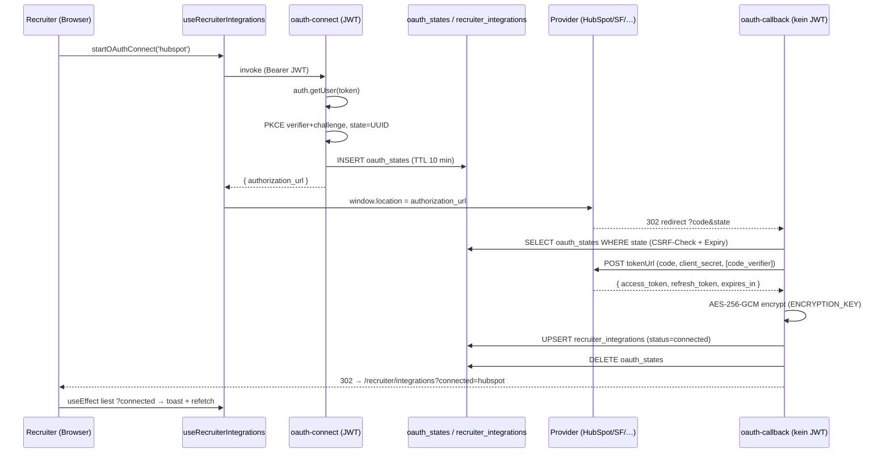

Schritt-für-Schritt-Referenzen:

1. **Initiierung** (`oauth-connect/index.ts`): JWT wird über `auth.getUser(token)` validiert
   (`oauth-connect/index.ts:54`). PKCE-Verifier/-Challenge werden via Web-Crypto erzeugt
   (`:12`, `:18`), ein CSRF-`state` als UUID. Beides wird mit **10-Minuten-TTL** in `oauth_states`
   persistiert (`:94`–`:106`). Die Authorization-URL wird inkl. Scopes und – falls
   `supportsPKCE` – `code_challenge`/`code_challenge_method=S256` gebaut (`:117`–`:135`). Opportunistisch
   wird `cleanup_expired_oauth_states()` per RPC aufgerufen (`:141`).
2. **Callback** (`oauth-callback/index.ts`): Läuft **ohne JWT** (`config.toml`: `oauth-callback
   verify_jwt = false`), da es ein reiner Browser-Redirect ist; Sicherheit kommt allein aus dem
   `state`-Lookup (`:44`–`:61`). Code→Token-Tausch gegen `config.tokenUrl` (`:93`), PKCE-Verifier wird
   nur bei `supportsPKCE` mitgeschickt (`:87`). Tokens werden **anwendungsseitig verschlüsselt**
   (`encryptToken`, `:117`/`:121`) und per `upsert(onConflict: "user_id,provider")` in
   `recruiter_integrations` geschrieben (`:139`–`:155`). Provider-Metadaten wie Salesforce
   `instance_url` landen in `provider_metadata` (`:129`–`:135`). Alle Fehlerpfade redirecten auf
   `/recruiter/integrations?error=…` (`:16`).

#### 11.2.3 Token-Verschlüsselung & On-Demand-Refresh

- **Krypto** (`_shared/encryption.ts`): AES-256-GCM über Web-Crypto. `ENCRYPTION_KEY` muss ein
  64-Zeichen-Hex-String (32 Byte) sein (`encryption.ts:57`). Format des Ciphertext-Strings:
  `base64(iv[12] ‖ ciphertext)` (`:30`–`:33`). Es wird **kein** separater Auth-Tag-Handling-Code
  benötigt, da GCM ihn in den Ciphertext integriert.
- **Refresh** (`_shared/token-refresh.ts`): `getValidToken()` ist der zentrale Token-Accessor für
  alle datenkonsumierenden Functions. Logik:
  - `auth_type === 'api_key'` → einfach entschlüsseln und zurückgeben (`token-refresh.ts:33`).
  - OAuth-Token gültig (> 5 min Restlaufzeit) → entschlüsseln und zurückgeben (`:48`).
  - sonst Refresh gegen `tokenUrl` mit `grant_type=refresh_token` (`:82`), neue Tokens
    verschlüsseln/speichern, ggf. rotierten Refresh-Token übernehmen (`:136`). Bei fehlendem
    Refresh-Token wird die Integration auf `status=expired` gesetzt (`:60`), bei fehlgeschlagenem
    Refresh auf `status=error` (`:101`).

#### 11.2.4 HubSpot-Sync (die einzige produktive Daten-Integration)

`hubspot-sync/index.ts` ist JWT-geschützt und kennt zwei Actions:

- `fetch_contacts` (`:56`): Lädt die Recruiter-Integration (`provider='hubspot'`, `status='connected'`).
  **Ohne** Integration werden **Demo-Kontakte** zurückgegeben (`:69`, `demo:true`) – für Onboarding/
  Sales-Demos. Mit Integration: `getValidToken()` → `GET /crm/v3/objects/contacts` (`:86`). Bei `401`
  wird die Integration auf `status=expired` gesetzt (`:101`). `last_synced_at` wird aktualisiert (`:124`).
- `import_contact` (`:137`): Dedup über `candidates(email, recruiter_id)` (`:139`), sonst INSERT in
  `candidates` (`:155`) plus Eintrag in `candidate_activity_log` (`activity_type='hubspot_import'`, `:174`).

Frontend: `src/components/candidates/HubSpotImportDialog.tsx` orchestriert einen 5-Schritt-Wizard
(`fetch → select → gdpr → importing → complete`). Der Import läuft **client-seitig sequenziell** –
pro Kontakt ein eigener `invoke('hubspot-sync', {action:'import_contact'})`-Call in einer
`for`-Schleife (`HubSpotImportDialog.tsx:100`). Nach erfolgreichem Batch wird ein
**DSGVO-Consent** in `consents` geschrieben (`subject_type='recruiter'`,
`consent_type='candidate_data_processing'`, `:131`). Der GDPR-Gate (`step==='gdpr'`) erzwingt drei
Checkboxen (Rechtsgrundlage, Kandidat informiert, Daten relevant) bevor `handleImport` aktiv wird (`:355`).

#### 11.2.5 API-Key / Client-Credentials & Disconnect

- `integration-api-key/index.ts` (`action:'connect'`): Verschlüsselt entweder `apiKey` (→
  `auth_type='api_key'`) oder `clientId`+`clientSecret` (→ `auth_type='client_credentials'`) und
  upsertet in `recruiter_integrations` (`integration-api-key/index.ts:57`–`:95`). `action:'test'` ist
  **ein Stub** und gibt immer `success:true` mit „not yet implemented" zurück (`:107`).
- `integration-disconnect/index.ts`: Scoped auf `(id, user_id)` (`:50`). Bei OAuth + vorhandener
  `revokeUrl` (nur Salesforce in der Registry) wird der Token **best-effort** revoked (`:74`), dann
  die Zeile gelöscht (`:88`). Token-Revocation-Fehler sind nicht-kritisch (`:81`).

Frontend-Hook `src/hooks/useRecruiterIntegrations.ts` kapselt alle vier Functions
(`startOAuthConnect`, `connectApiKey`, `connectClientCredentials`, `disconnectIntegration`) und
behandelt explizit den „Edge Function nicht deployed"-Fall (`isEdgeFunctionNotDeployed`,
`useRecruiterIntegrations.ts:9`) sowie das `?connected=`/`?error=`-Callback-Parsing beim Mount (`:86`).

---

### 11.3 E-Mail-Ingestion: `@inbound.matchunt.ai` → Kandidaten

Jeder Recruiter erhält automatisch eine eindeutige Inbound-Adresse
`r_<first8(user_id)>@inbound.matchunt.ai`. Vergabe per Trigger
`on_recruiter_role_created` → `auto_create_inbound_address()` auf `user_roles`
(`20260224120000_email_ingestion_tables.sql:120`/`:135`) plus Backfill für Bestands-Recruiter (`:111`).

Zwei-stufige Verarbeitung (beide `verify_jwt = false`, da Webhook-Empfänger eines Mail-Providers):

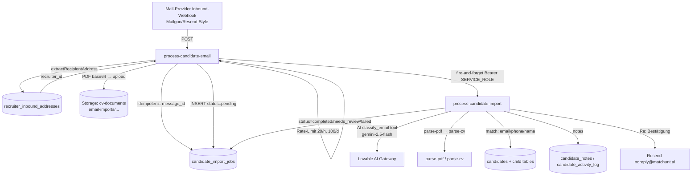

**Stufe 1 – `process-candidate-email/index.ts`** (synchron, schnell):

1. Sender/Empfänger/Body/Attachments aus dem Provider-Payload extrahieren – tolerant gegenüber
   Mailgun/Resend-Feldnamen (`:52`–`:58`). `extractRecipientAddress` parst `Name <email>` (`:18`).
2. Empfänger → Recruiter via `recruiter_inbound_addresses` (`:81`); `is_active`-Check (`:95`).
3. **Idempotenz** über `message_id` gegen `candidate_import_jobs` (`:106`).
4. **Rate-Limit**: max. 20 Imports/Stunde pro Recruiter (`:124`–`:137`). (Der 100/Tag-Limit aus dem
   Kommentar ist **nicht** implementiert – siehe Frictions.)
5. Nur **PDF**-Attachments ≤ 10 MB; base64-Decode → Upload nach Storage-Bucket `cv-documents` unter
   `email-imports/<recruiterId>/<ts>-<name>` (`:151`–`:204`).
6. INSERT `candidate_import_jobs` (`status='pending'`, `:208`).
7. **Fire-and-forget**-Aufruf von `process-candidate-import` mit `Bearer SERVICE_ROLE_KEY` (`:241`).

**Stufe 2 – `process-candidate-import/index.ts`** (asynchron, KI-lastig):

- State-Machine: `pending → processing → classified → completed | needs_review | failed`
  (`:564`, `:629`, `:841`).
- **AI-Klassifikation** via Lovable-Gateway (`google/gemini-2.5-flash`) mit Function-Calling-Tool
  `classify_email` (`:99`/`:582`). Klassen: `new_candidate | candidate_update | candidate_notes |
  candidate_with_notes | multi_candidate | unprocessable`. Heuristische Overrides danach (mehrere
  PDFs ⇒ `multi_candidate`; keine PDFs ⇒ Downgrade) (`:610`–`:620`). Fallback bei AI-Fehler (`:597`).
- **PDF-Pipeline**: pro Anhang `parse-pdf` (Text) → `parse-cv` (strukturierte Daten), beide intern per
  Service-Role-`fetch` (`:651`/`:671`).
- **Kandidaten-Matching** (`matchCandidate`, `:153`): E-Mail (0.99) → Phone (0.90) → Name exakt (0.80)
  → Name fuzzy (0.60/0.40), immer **innerhalb `recruiter_id`** und an die Confidence-Schwellen
  gebunden.
- `saveParsedCandidate` (`:267`) ist ein **Server-Port von `useCvParsing.saveParsedCandidate`** und
  schreibt `candidates` + Kindtabellen (`candidate_experiences`, `_educations`, `_languages`,
  `_skills`) sowie ein versioniertes `candidate_documents` (`:415`). `import_source='email_import'`.
- Notizen → `candidate_notes` (`source='email_import'`, `import_job_id`) + `candidate_activity_log`
  (`createCandidateNote`, `:433`).
- **Bestätigungs-Mail** „Re: …" via **Resend direkt** (`from: Matchunt <noreply@matchunt.ai>`, `:506`).

`candidate_notes` wurde dafür um `source` und `import_job_id` erweitert
(`20260224120000_email_ingestion_tables.sql:94`).

---

### 11.4 Ausgehende Transaktions-Mails (`send-email`)

`send-email/index.ts` ist der zentrale **Template-Mailer** (`verify_jwt = true`) und wird von vielen
Domänen aufgerufen (Interview, Opt-In, Submission, Rejection, Talent-Hub). Ablauf:

- Template-Registry inline (`templates`, `send-email/index.ts:42`) mit ~11 deutschsprachigen
  HTML-Templates und `{platzhalter}`-Subject-Interpolation (`:291`).
- **Tracking**: Vor dem Versand wird ein `email_events`-Datensatz erzeugt (`status='pending'`, `:304`),
  dessen ID für (a) einen 1×1-Tracking-Pixel (`getTrackingPixelUrl`, `:21`) und (b) das Umschreiben
  aller `href`-Links auf `track-candidate-engagement?type=link_click&redirect=…` (`wrapLinksForTracking`,
  `:27`) genutzt wird – allerdings **nur**, wenn `submissionId`/`candidateId` mitgegeben wurde (`:323`).
- Versand über `resend.emails.send` (`:333`). Danach `email_events.status='sent'` inkl. `resend_id`
  (`:343`) und Inkrement von `candidate_behavior.emails_sent` (`:354`).
- Fehler werden als `email_events.status='failed'` geloggt (`:388`).

> ⚠️ Der Absender ist hier `Recruiting Platform <onboarding@resend.dev>` (`:334`) – die
> **Resend-Sandbox-Domain**, nicht `matchunt.ai`. Alle anderen Mailer (`process-candidate-import`,
> Interview-Functions) nutzen `noreply@matchunt.ai`. Siehe Frictions.

`track-candidate-engagement` (separate Function, `verify_jwt = false`) ist das Pendant zu
`track-outreach-engagement` für den Transaktions-Mail-Pfad und bedient die Pixel-/Click-Redirects.

---

### 11.5 Outreach-Sequenzen (B2B-Akquise)

Ein vollständiges Cold-Outreach-System für **Hiring-Companies** (Admin-Persona, `/admin/outreach`).
Die Kandidaten-Domäne ist davon getrennt – Zielobjekt ist `outreach_leads`.

#### 11.5.1 Lead-Import

`import-outreach-leads/index.ts` (`verify_jwt = true`): Verarbeitet einen Batch (à 50) von Rohzeilen
mit optionalem `column_mapping`. Mappt ~80 mögliche Spalten (Person, Company, HQ-Adresse,
Hiring-Signals 1–5, Job-Change-/Location-Move-Signale) auf das DB-Schema (`:333`). Guardrails beim
Import: E-Mail-Format-Validierung (`:285`), **Suppression-Liste** (`:296`) und **Dedup** gegen
bestehende `outreach_leads` (`:308`). Fortschritt/Statistik in `outreach_import_jobs` (`:455`).

#### 11.5.2 Send-Queue mit Guardrails

`process-outreach-queue/index.ts` (`verify_jwt = false`) ist der Worker, der `outreach_send_queue`
abarbeitet (`status='pending' AND scheduled_at <= now()`, Batch 50, nach `priority`/`scheduled_at`
sortiert, `:145`). Vor jedem Versand greifen **vier Guardrails** (`:192`–`:262`):

1. **Test-Mode** – nur an `campaign.test_recipients` (`:193`).
2. **Suppression** – `outreach_suppression_list`-Lookup; Lead wird ggf. `is_suppressed` (`:207`).
3. **Rate-Limit** – pro Sender (Default 200/Tag) und pro Ziel-Domain (Default 10/Tag) via
   `outreach_rate_limits`; bei Überschreitung **Reschedule auf morgen 09:00** (`:227`, `:237`).
4. **Reply-Check** – `lead.has_replied` ⇒ skip (`:254`).

Versand über Resend mit **Sender-Identität aus der Kampagne** (`campaign.sender_email`/`_name`, `:306`),
eingebettetem Tracking-Pixel (`track-outreach-engagement?type=open&eid=…`, `:276`) und Opt-Out-Hinweis
(„kurze Antwort mit ‚Stop'", `:297`). Erfolg/Retry: bei Fehler `attempts++`, ab `max_attempts` →
`failed` (`:362`). Stats werden in `outreach_campaigns.stats` (JSONB) fortgeschrieben (`:346`).

> ⚠️ **Kein pg_cron**: `process-outreach-queue` wird ausschließlich **manuell** aus dem Frontend
> getriggert (`src/components/outreach/QueueStatusCard.tsx:53`, `src/hooks/useOutreach.ts:509`). Die
> einzigen pg_cron-Jobs des Projekts betreffen `influence-engine`, `escalation-engine`,
> `calculate-influence-score` und Alert-Cleanup (`20260225200000_unified_task_inbox.sql:133`). Siehe Frictions.

#### 11.5.3 Engagement-Tracking

`track-outreach-engagement/index.ts` liefert bei `type=open` einen 1×1-GIF zurück und inkrementiert
`outreach_emails.open_count`/`opened_at` (`:32`), bei `type=click` wird `clicked_links` ergänzt und auf
die Ziel-URL **302-redirected** (`:86`). Erstöffnung/-klick erhöhen `outreach_campaigns.stats`
(`opened`/`clicked`) (`:57`/`:118`).

#### 11.5.4 Inbound-Replies (zwei parallele Implementierungen)

Hier existieren **zwei** Functions mit überlappender Verantwortung – beide finden den Lead per
`contact_email` und reagieren auf Antworten:

| Aspekt | `process-inbound-email` | `process-inbound-reply` |
|--------|-------------------------|--------------------------|
| Klassifikation | **AI** (Lovable `gemini-2.5-flash`, JSON) (`:132`) | **Keyword-Heuristik** (DE) (`:19`) |
| Intents | interested / not_interested / question / meeting_request / unsubscribe / out_of_office / bounce / other | positive / not_interested / wrong_person / unsub / objection / neutral |
| Conversation-Modell | `outreach_conversations` + `outreach_messages` (relational) (`:178`) | `outreach_conversations.messages` (JSONB-Array) (`:211`) |
| Reply-Log | – | `outreach_reply_classifications` (`:118`) |
| Lead-Status | qualified / closed / replied (`:209`) | `has_replied`, `reply_sentiment` (`:127`) |
| Sequenz-Stop | `status='replied'` (`:227`) | `status='paused'` (`:169`) |
| Queue-Cancel | nein | ja (`outreach_send_queue → cancelled`) (`:176`) |
| Suppression bei Opt-Out | nein | ja (`outreach_suppression_list`) (`:187`) |

Beide sind `verify_jwt = false` (Webhook). Welche tatsächlich am Inbound-Webhook hängt, ist im Repo
nicht eindeutig konfiguriert – ein klarer Konsolidierungs-/Klarheits-Bedarf (siehe Frictions & Open Questions).

#### 11.5.5 Resend-Webhooks (Delivery-Lifecycle)

`resend-webhooks/index.ts` (`verify_jwt = false`) verarbeitet Resend-Events und matcht über
`outreach_emails.resend_id` (`:34`). Behandelte Typen (`:44`):

- `delivered` / `opened` / `clicked` → Zeitstempel/Counter auf `outreach_emails`.
- `bounced` → Lead auf `is_suppressed`, Eintrag in `outreach_suppression_list`, pending Mails
  `cancelled`, aktive Sequenzen `paused` (`:82`).
- `complained` (Spam) → wie bounce **plus**: bei **≥ 3 Beschwerden / 24 h** in derselben Kampagne wird
  die **Kampagne automatisch pausiert** (`outreach_campaigns.status='paused'`) (`:182`–`:207`).

> ⚠️ Der Webhook ist **nicht signaturgeprüft** (kein Svix-/HMAC-Check). Jeder POST kann Leads
> suppressen oder Kampagnen pausieren. Siehe Frictions.

---

### 11.6 Web-Crawling / Enrichment (Firecrawl)

`crawl-career-page/index.ts` nutzt die **Firecrawl-API** (`FIRECRAWL_API_KEY`). Ablauf: `POST /v1/map`
zum Auffinden der Karriereseite über Pattern-Scoring (`CAREER_URL_PATTERNS`, `:9`/`findBestCareerUrl`
`:41`), dann `POST /v1/scrape` mit JSON-Extraction-Prompt für Job-Listings (`:246`). Ergebnis
(`live_jobs`, `live_jobs_count`, `hiring_activity` ∈ hot/active/low/none) wird direkt in den
referenzierten `outreach_leads`-Datensatz zurückgeschrieben (`:353`) und dient damit der
Lead-Priorisierung. `crawl-career-pages-bulk`, `crawl-company-data` und `enrich-company-from-domain`
ergänzen Batch-Crawling bzw. Firmen-Anreicherung (gleiche Firecrawl-Mechanik, Lead-/Company-Tabellen).

---

### 11.7 Tabellen dieser Domäne

| Tabelle | Zweck | Schreibende Functions | RLS-Kurzform |
|---------|-------|------------------------|--------------|
| `oauth_states` | Ephemere CSRF/PKCE-States (TTL 10 min) | oauth-connect (INSERT), oauth-callback (DELETE) | nur Service-Role (`USING(false)`) |
| `recruiter_integrations` | Pro-Recruiter CRM/ATS-Verbindung, **verschlüsselte** Tokens/Keys | oauth-callback, integration-api-key, integration-disconnect, hubspot-sync, token-refresh | Owner-CRUD + Admin-SELECT + Service-Role-ALL |
| `recruiter_inbound_addresses` | `r_xxx@inbound.matchunt.ai` je Recruiter | Trigger `auto_create_inbound_address` | Owner-/Admin-SELECT |
| `candidate_import_jobs` | State-Machine des E-Mail-Imports | process-candidate-email, process-candidate-import | Owner-/Admin-SELECT + Service-Role-ALL |
| `email_events` | Tracking ausgehender Transaktions-Mails | send-email | (system) |
| `outreach_leads` | B2B-Leads (Hiring-Companies) | import-outreach-leads, crawl-*, inbound-Functions, queue | (admin/system) |
| `outreach_campaigns` | Kampagnen + `stats` JSONB | queue, tracking, webhooks, inbound | (admin) |
| `outreach_send_queue` | Versand-Queue mit Guardrails | queue, inbound-reply (cancel), webhooks | (system) |
| `outreach_emails` | Einzel-Mails inkl. `resend_id`, Open/Click | queue, tracking, webhooks, inbound | (system) |
| `outreach_sequences` | Mehrstufige Follow-ups | inbound-Functions (pause), webhooks | (system) |
| `outreach_conversations` / `outreach_messages` | Reply-Threads (relational **und** JSONB – zwei Modelle) | inbound-Functions | (system) |
| `outreach_suppression_list` | Globale DNC-Liste (bounce/complaint/unsub) | webhooks, inbound-reply, queue | (system) |
| `outreach_rate_limits` | Pro-Sender/Domain-Tageslimits | queue | (system) |
| `outreach_import_jobs` | Status des Lead-CSV-Imports | import-outreach-leads | (admin) |
| `outreach_reply_classifications` | Heuristik-Klassifikationen der Replies | process-inbound-reply | (system) |
| `candidates` (+ `candidate_*`) | Ziel des HubSpot-/E-Mail-Imports | hubspot-sync, process-candidate-import | (Owner/Recruiter) |
| `consents` | DSGVO-Nachweis HubSpot-Import | HubSpotImportDialog (FE) | (Owner) |

---

### 11.8 Wichtigste Vernetzungen (Domänen-intern & -extern)

- **`oauth-connect` ⇄ `oauth-callback`** über `oauth_states` (State-Token + PKCE-Verifier) – der
  einzige zustandsbehaftete Handshake der Domäne.
- **`oauth-callback`/`integration-api-key` → `recruiter_integrations`** (verschlüsselte Credentials);
  **`hubspot-sync` + `token-refresh` ← `recruiter_integrations`** (Lesen + Auto-Refresh).
- **`process-candidate-email` → `process-candidate-import`** via interner Service-Role-`fetch`
  (Fire-and-Forget, entkoppelt schnellen Webhook von langsamer KI-Pipeline).
- **`process-candidate-import` → `parse-pdf` → `parse-cv`** (interne Function-Verkettung) und →
  **Lovable AI Gateway** (Klassifikation) → schreibt **`candidates`** (Domänen-Übergang Integrationen → Kandidaten).
- **`send-email` → `track-candidate-engagement`** (Pixel/Click) und → **`email_events` +
  `candidate_behavior`** (Engagement-Domäne).
- **`process-outreach-queue` → Resend → `resend-webhooks`** (Delivery-Lifecycle-Rückkanal) und →
  **`track-outreach-engagement`** (Open/Click).
- **`crawl-career-page` → `outreach_leads`** (Hiring-Activity füttert Lead-Priorisierung) – Crawling
  ist reiner Enrichment-Zulieferer für Outreach.
- **Frontend**: `useRecruiterIntegrations` (OAuth/API-Key/Disconnect), `HubSpotImportDialog`
  (Sync+Import+Consent), `QueueStatusCard`/`useOutreach` (manueller Queue-Trigger).

---

### 11.9 Reibungs- & Risikopunkte (im Code gesehen)

1. **(HIGH) Doppelte, divergierende Migrationen für `oauth_states`/`recruiter_integrations`.**
   `20260224032338_…sql` und `20260224150000_oauth_integrations.sql` erstellen dieselben Tabellen
   und gleichnamige Policies. `150000` nutzt `CREATE TABLE IF NOT EXISTS`, aber `CREATE POLICY`
   ohne `IF NOT EXISTS` → bei bereits aus `032338` vorhandener Policy „Admins can view all
   integrations" **bricht die Migration**. Reihenfolge-/Idempotenz-Hazard.
2. **(HIGH) Falsche Argument-Reihenfolge in der Admin-RLS-Policy (OAuth).**
   `has_role` ist als `has_role(_user_id UUID, _role app_role)` definiert, doch
   `20260224150000_oauth_integrations.sql:101` ruft `public.has_role('admin', auth.uid())` auf
   (Args vertauscht). Damit ist die „Admins can view all integrations"-Policy effektiv kaputt; die
   ältere Migration (`032338:62`) macht es korrekt. Nur weil zusätzlich eine permissive
   `Service role manages integrations USING(true)`-Policy existiert, fällt es im Betrieb nicht auf.
3. **(HIGH) Resend-Webhook ohne Signaturprüfung.** `resend-webhooks` (`verify_jwt=false`) verarbeitet
   ungeprüfte POSTs und kann Leads suppressen sowie **Kampagnen pausieren** (`:182`). Ohne Svix-/
   HMAC-Verifikation ist das ein Spoofing-/DoS-Vektor. Gleiches gilt für die Inbound-Webhooks.
4. **(HIGH) Inkonsistente/Sandbox-Absenderdomain.** `send-email` versendet als
   `onboarding@resend.dev` (`send-email/index.ts:334`) – Resend-Testdomain – während alle anderen
   Mailer `noreply@matchunt.ai` nutzen. Folge: schlechte Zustellbarkeit/SPF-DKIM-Fehlausrichtung für
   die zentralen Transaktions-Mails.
5. **(MEDIUM) Zwei konkurrierende Inbound-Reply-Implementierungen.**
   `process-inbound-email` (AI, relationale Messages) vs. `process-inbound-reply` (Keywords, JSONB,
   Suppression+Queue-Cancel) schreiben teils dieselben, teils andere Tabellen. Unklar, welche
   produktiv am Webhook hängt → Drift-/Datenkonsistenzrisiko.
6. **(MEDIUM) `process-outreach-queue` hat keinen Scheduler.** Versand passiert nur bei manuellem
   Frontend-Klick (`QueueStatusCard.tsx:53`). `scheduled_at`-Reschedules (Rate-Limit → „morgen 09:00")
   werden nie automatisch abgearbeitet → Sequenzen bleiben liegen. pg_cron existiert im Projekt,
   wird hier aber nicht genutzt.
7. **(MEDIUM) Klartext-Token im Speicher/Response bei Refresh.** `getValidToken` gibt nach einem
   Refresh `tokens.access_token` **im Klartext** zurück (`token-refresh.ts:152`), während der normale
   Pfad entschlüsselt zurückgibt – funktional ok, aber der frische Token wird nicht
   re-validiert/normalisiert; zudem landen Tokens als plaintext in Function-Logs-Risiko, falls
   versehentlich geloggt.
8. **(MEDIUM) Client-seitiger HubSpot-Import = N Function-Calls.** Der Import iteriert pro Kontakt
   einzeln über `invoke('hubspot-sync')` (`HubSpotImportDialog.tsx:100`). Bei größeren Listen viele
   Round-Trips, keine Transaktionsklammer, kein Backoff. Besser: serverseitiger Batch-Import.
9. **(LOW) Rate-Limit-Kommentar ≠ Implementierung.** `process-candidate-email` kommentiert
   „20/hour, 100/day", implementiert aber **nur** das Stunden-Limit (`:122`).
10. **(LOW) `integration-api-key` `action:'test'` ist ein Stub** (`:107`) – die UI suggeriert einen
    Verbindungstest, der real nie stattfindet.
11. **(LOW) Tracking-Link-Rewrite nur mit Submission/Candidate-Kontext.** In `send-email` wird
    Pixel/Link-Tracking nur gesetzt, wenn `submissionId`/`candidateId` vorliegt (`:323`); Mails ohne
    diesen Kontext sind ungetrackt – inkonsistente Analytics.
12. **(LOW) CORS `Access-Control-Allow-Origin: *`** durchgängig in allen Functions – inkl. solcher,
    die JWT erwarten. Für reine API-Functions akzeptabel, aber keine Origin-Härtung.

---

### 11.10 Offene Fragen

- Welcher Mail-Provider sitzt real auf `@inbound.matchunt.ai` (Mailgun, Resend Inbound, SendGrid)?
  Der Payload-Parser ist multi-format, aber die produktive Webhook-Quelle/Route ist im Repo nicht festgelegt.
- Welche der beiden Inbound-Reply-Functions ist die kanonische? Soll `process-inbound-email` (AI) die
  Keyword-Variante ablösen – und werden `outreach_conversations` relational **oder** als JSONB geführt?
- Wird `process-outreach-queue` (und ein evtl. `process-sequences`) künftig per pg_cron getaktet?
  Ohne Scheduler ist die Sequenz-Automatik unvollständig.
- Sind die Migrationen `…032338` und `…150000` beide eingespielt, oder wurde eine verworfen? Davon
  hängt ab, ob der `has_role`-Arg-Bug produktiv aktiv ist.
- Existiert ein Secret-Rotations-/Re-Encryption-Pfad für `ENCRYPTION_KEY`? Ein Key-Wechsel würde
  aktuell alle gespeicherten Tokens unbrauchbar machen.
- Salesforce/Lever/Bullhorn besitzen OAuth-Configs, aber keinen Sync analog `hubspot-sync` – ist die
  Daten-Sync-Schicht (Kontakte/Jobs) für diese Provider geplant oder bewusst zurückgestellt?
- Für `comingSoon`-Provider (Workday/Jobvite/iCIMS) fehlen Env-Vars/Configs komplett – nur UI-Stubs.
</content>
</invoke>


---

## 12. Automatisierung, Engines, Notifications & Analytics

> Domänen-Analyse für das CTO-Team ("Godmode"-Serie). Quelle der Wahrheit ist der Code; `PROJECT_ANALYSIS.md` ist nur Orientierung. Alle Datei-Referenzen als `pfad/datei.ts:zeile`.

Diese Domäne ist das "Nervensystem" der Plattform: Hintergrund-Engines berechnen Scores und Alerts, ein Event-/SLA-System misst Verhalten, Realtime-Channels pushen Benachrichtigungen ins Frontend, Tracking füttert Analytics-Tabellen, Fraud-Detection schützt das Triple-Blind-Modell, und DSGVO-Funktionen erfüllen Compliance. Charakteristisch: **Fast die gesamte Logik läuft serverseitig in Edge Functions**, die per **pg_cron + pg_net** (HTTP-POST aus Postgres heraus) oder per **Database Webhook** angestoßen werden — nicht aus dem Frontend.

### 12.1 Überblick: Wie die Teile zusammenhängen

| Schicht | Komponenten | Auslöser |
|---|---|---|
| **Engines (Cron)** | `influence-engine`, `escalation-engine`, `calculate-influence-score` | pg_cron alle 5/15/60 min (`20260225200000_unified_task_inbox.sql:133-195`) |
| **Engine (Webhook)** | `automation-hub` | Supabase **Database Webhook** auf `submissions/placements/interviews/offers/payout_requests` (im Dashboard konfiguriert, nicht in Migrationen) |
| **Trigger-getrieben** | `assess-candidate-fit` (via `trigger_generate_fit_assessment`), DB-Trigger `mark_activation_submitted`, `check_bulk_activation` | `AFTER INSERT`-Trigger + pg_net |
| **On-Demand (Frontend)** | `track-event`, `track-candidate-engagement`, `calculate-analytics`, `fraud-detection`, `process-talent-hub-action`, `gdpr-export`, `gdpr-deletion` | `supabase.functions.invoke(...)` aus Hooks/Components |
| **Realtime** | `notifications`, `influence_alerts`, `messages`, `recruiter_tasks` | Postgres-Changes über Publication `supabase_realtime` |

Wichtige Beobachtung: Die "schweren" Engines (`influence-engine`, `escalation-engine`, `calculate-influence-score`) sind in `supabase/config.toml` auf `verify_jwt = false` gesetzt (`config.toml:67,79,85`) und werden **ausschließlich** von pg_cron mit dem Service-Role-Key aufgerufen. Im gesamten `src/` gibt es keinen `invoke('influence-engine')` o.ä. — das ist Absicht.

### 12.2 Engines im Detail

#### automation-hub — der Event-Router
`supabase/functions/automation-hub/index.ts` ist als Database-Webhook-Empfänger gebaut: Es erwartet ein Payload `{ type, table, record, old_record }` (`automation-hub/index.ts:9-14`) und routet nach `event.table` (`:120-138`). Zwei Hauptaufgaben:

1. **Notification-Fan-out**: Bei `submissions INSERT` → Notification an `jobs.client_id` ("Neuer Kandidat eingereicht", `:158-174`); bei Statuswechsel → Notification an `submissions.recruiter_id` (`:182-202`); bei `placements/interviews/offers/payout_requests` analog (`:206-343`). Geschrieben wird immer in `notifications` via `createNotification()` (`:346-359`).
2. **Auto-Pipeline (`syncCandidateStatus`, `:26-105`)**: Aggregiert alle `submissions` eines Kandidaten, mappt Submission-Status → Kandidaten-Stage über `STAGE_PRIORITY` (`new<contacted<interview<offer<placed`, `:17-23`) und hebt `candidates.candidate_status` nur an, nie ab ("monotone Pipeline"). Fallen alle Submissions in terminale Zustände, wird der Kandidat auf `rejected` gesetzt (`:47-53`).

> Risiko: `automation-hub` ist die zentrale Notification-Quelle, aber seine Verdrahtung (Webhook) ist **nicht im Repo versioniert** — sie lebt nur in der Supabase-Projekt-Config. Geht das Projekt verloren oder wird neu aufgesetzt, fehlen ohne Doku alle Benachrichtigungen lautlos.

#### escalation-engine — SLA-Wächter (Cron alle 5 min)
`supabase/functions/escalation-engine/index.ts` ist die Verbindung zwischen **Zeit** und **Verhalten**:
- Holt fällige Warnungen aus `sla_deadlines` (Join `sla_rules`) und schreibt `sla_warning`-Notifications (`:27-64`).
- Bei Breach: je nach `rule.deadline_action` entweder `remind` (Notification + `reminders_sent++`) oder `escalate` (Status `escalated` + Notification an alle Admins, `:106-136`).
- **Schreibt zurück in `user_behavior_scores`** via `updateBehaviorScore()` (`:182-301`): berechnet `avg_response_time_hours` aus `platform_events.response_time_seconds`, `sla_compliance_rate`, `ghost_rate`, klassifiziert `behavior_class` (`fast_responder`/`ghoster`/`at_risk`/…) und einen `risk_score` (0–100). Dieser `risk_score` fließt später ins Trust-System.

#### influence-engine — Deal-Coaching (Cron alle 15 min)
`supabase/functions/influence-engine/index.ts` ist die anspruchsvollste Engine. Pro aktiver Submission (`:88-91`) lädt sie parallel Candidate/Job/Interview/Behavior/DealHealth (`:120-126`) und berechnet drei Scores (`calculateScores`, `:206-373`): `confidence`, `interview_readiness`, `closing_probability` (jeweils 0–100, aus Opt-In-Reaktionszeit, Interview-Bestätigung, Gehalts-Match, Match-Score, Deal-Health, E-Mail-Open-Rate, Tagen-seit-Engagement, Stage). Ergebnis:
- **Upsert in `candidate_behavior`** (`:141-158`) inkl. `hesitation_signals`/`motivation_indicators`-Arrays.
- **Alert-Generierung (`generateAlerts`, `:398-547`)**: 7 Alert-Typen (`opt_in_pending_24h/48h`, `interview_prep_missing`, `interview_reminder`, `salary_mismatch`, `ghosting_risk`, `engagement_drop`, `closing_opportunity`) mit Priorität, `recommended_action` und `playbook_id` (gemappt aus `coaching_playbooks`, `:110-115`). Jeder Alert bekommt einen `impact_score` (`calculateImpactScore`, `:375-396`: gewichtete Formel aus Deal-Health, Closing-Prob, SLA-Urgency, Prio).
- **Idempotenter Upsert in `influence_alerts`** über `onConflict: 'submission_id,alert_type'` (`:164-173`) — abgesichert durch den partiellen UNIQUE-Index `idx_influence_alerts_active_unique` (`20260225200000_unified_task_inbox.sql:39-41`).
- Abschließend `calculateRecruiterInfluenceScores()` (`:549-629`) → Upsert in `recruiter_influence_scores`.

#### calculate-influence-score — Recruiter-Scoring (Cron stündlich)
`supabase/functions/calculate-influence-score/index.ts` ist eine **redundante, aber genauere** Variante des Recruiter-Score-Teils der influence-engine: gewichtet Alert-Response (30%), Opt-In-Speed (25%), Interview-Show-Rate (25%), Placements (20%) (`:126-138`) und schreibt dasselbe Ziel `recruiter_influence_scores` (`:153-155`). Achtung: Es enthält hartcodierte Plattform-Durchschnitte (`platformAvgOptIn = 36`, `platformShowRate = 85`, `:100,123`) — explizit als "mock" markiert.

#### process-sequences — Outreach-Automation (Cron-Kandidat)
`supabase/functions/process-sequences/index.ts` arbeitet `outreach_sequences` mit fälligem `next_email_at` ab (`:23-33`), ruft intern `generate-outreach-email` per `fetch` auf (`:93-104`), legt das Ergebnis in `outreach_send_queue` mit zufälligem 0–60s-Delay (`:118-124`) und schiebt die Sequenz zum nächsten Schritt — oder pausiert auf `replied`, wenn der Lead geantwortet hat (`:78-85`). (Hinweis: In `20260225200000` ist hierfür **kein** Cron-Job definiert — die Verdrahtung erfolgt vermutlich über einen separaten Cron im Outreach-Modul.)

#### process-talent-hub-action — die Client-Aktions-Zentrale
`supabase/functions/process-talent-hub-action/index.ts` ist die EINE Function, die das Frontend für Client-Aktionen aufruft (über `useTalentHubActions`, `src/hooks/useTalentHubActions.ts:46`). Sie kapselt fünf Aktionen (`:66-386`):
- `request_interview` → Interview mit `status='pending_opt_in'`, Notification + E-Mail an Recruiter (`:67-129`).
- `confirm_opt_in` → **hebt Triple-Blind auf**: `submissions.identity_revealed=true`, Interview auf `pending_slot_selection`, E-Mail mit echten Kandidatendaten an Client (`:131-181`).
- `move_candidate` → Stage-Wechsel; bei `offer`/`hired` werden automatisch Datensätze in `offers`/`placements` angelegt (`:234-254`).
- `reject_candidate`, `give_feedback` (positiv → Auto-Move, `:339-347`).
Jede Aktion schreibt `notifications`, `activity_logs` und sendet E-Mail via `send-email` (`:406-444`).

### 12.3 Realtime-Notifications & der NotificationBell-Render-Loop

#### Datenfluss
Die Tabellen `notifications`, `messages`, `submissions`, `interviews`, `influence_alerts`, `candidate_behavior`, `recruiter_tasks` sind Teil der Realtime-Publication (`20251204201843_…sql:68-71`, `20251204213449_…sql:16-17`, `20260225200000_…sql:131`). Edge Functions schreiben Zeilen, Postgres streamt die Änderung, das Frontend hört zu:
- `src/hooks/useRealtimeNotifications.ts` abonniert Channel `notifications-realtime`, gefiltert auf `user_id=eq.${user.id}` (`:82-118`), und zeigt bei INSERT zusätzlich einen Sonner-Toast (`:98-101`).
- `src/components/layout/NotificationBell.tsx` konsumiert den Hook (`:17`) und rendert das Glocken-Dropdown. Der Bell sitzt in **`DashboardLayout.tsx:153`** UND in **`Navbar.tsx:229`** — er ist also quasi auf jeder eingeloggten Seite gemountet.
- Parallel: `src/hooks/useInfluenceAlerts.ts:62-87` (Channel `influence-alerts-changes`) und `src/hooks/useRealtimeMessages.ts:101-156`.

#### Ursache des "Maximum update depth exceeded"-Loops (verifiziert)
Der Loop entsteht aus dem Zusammenspiel von `useAuth` und den Realtime-Hooks. Kette:

1. **`useAuth` liefert eine instabile `user`-Referenz.** In `src/lib/auth.tsx:25-51` registriert der `AuthProvider` `supabase.auth.onAuthStateChange`. Bei jedem Auth-Event — insbesondere dem periodischen `TOKEN_REFRESHED` (Default ~alle 50–60 min, aber auch bei Tab-Fokus/`getSession`) — ruft er `setUser(session?.user ?? null)` (`:29`). Das `session.user` ist bei jedem Event ein **frisch deserialisiertes Objekt** (neue Referenz, gleicher Inhalt). Der Context-Value wird zudem als **neues Literal-Objekt** `{ user, session, role, … }` bei jedem Provider-Render erzeugt (`:97`), ohne `useMemo`.

2. **`fetchNotifications` hängt an `user` als Dep.** In `useRealtimeNotifications.ts:24-42` ist `fetchNotifications` ein `useCallback` mit `[user]`. Neue `user`-Referenz ⇒ neue `fetchNotifications`-Referenz.

3. **Der Effekt hängt an `fetchNotifications` UND `user`.** `useRealtimeNotifications.ts:73-123` listet `[user, fetchNotifications]` als Deps. Bei neuer Referenz läuft der Cleanup (`supabase.removeChannel`) und der Effekt **neu**: er ruft `fetchNotifications()` (setzt State) und baut `supabase.channel("notifications-realtime")` neu auf.

4. **Verstärker — kollidierender Channel-Name.** Der Channel heißt statisch `"notifications-realtime"` (`:83`). Wenn der Bell an zwei Stellen gleichzeitig gemountet ist (Navbar + DashboardLayout) bzw. Cleanup/Subscribe sich überlappen, konkurrieren zwei Subscriptions um denselben Channel-Namen. In Kombination mit der `getSession().then(setUser)`-Initialisierung (`auth.tsx:41-48`), die kurz nach dem ersten `onAuthStateChange` ein zweites `setUser` mit erneut neuer Referenz feuert, entsteht ein schnelles Re-Subscribe→setState→Re-Render→neue Referenz→Re-Subscribe — React bricht mit *Maximum update depth exceeded* ab.

`useInfluenceAlerts.ts:62-87` hat exakt dasselbe Muster (`[user, fetchAlerts]`, `fetchAlerts` mit `[user]`) und ist ein zweiter, paralleler Loop-Kandidat.

#### Empfohlene Fixes (geringster Eingriff zuerst)
- **A — Stabilisieren in `useAuth`:** Effekt-Deps nicht an das ganze `user`-Objekt, sondern an `user?.id` hängen. Context-Value mit `useMemo` memoisieren (`auth.tsx:97`). Das ist die Wurzel und behebt mehrere Hooks auf einmal.
- **B — In den Hooks:** `useCallback`-Deps von `[user]` auf `[user?.id]` umstellen (`useRealtimeNotifications.ts:42`, `:71`, `useInfluenceAlerts.ts:60`) und im Effekt `[user?.id]` statt `[user, fetchNotifications]` verwenden; `fetchNotifications` per `useRef` halten oder im Effekt inline aufrufen.
- **C — Channel-Eindeutigkeit:** Channel-Namen pro User/Mount eindeutig machen, z.B. `notifications-${user.id}` (vermeidet Kollision wenn der Bell mehrfach gemountet ist).

### 12.4 Tracking & Analytics

#### Event-Tracking (`track-event`)
`supabase/functions/track-event/index.ts` verifiziert das User-JWT (`:37-47`), schreibt nach `platform_events` (Schema: `20251204204702_…sql:59-80` — inkl. `ip_address`, `user_agent`, `response_time_seconds`, `session_id`). Zwei clevere Seiteneffekte:
- **Response-Time-Berechnung** (`:71-89`): Bei Events mit `response/review/accept/reject` im Namen wird die Differenz zum letzten Event derselben Entity als `response_time_seconds` gespeichert — das ist die Datenbasis für `escalation-engine`'s Behavior-Scores.
- **SLA-Lifecycle (`handleSlaDeadlines`, `:142-226`)**: Bestimmte Events legen `sla_deadlines` an (z.B. `submission_created` → Phase `submitted`, Verantwortlicher = `jobs.client_id`, `:182-192`) oder schließen sie ab (`completed`). Damit ist `track-event` die **Brücke zwischen User-Aktion und SLA-Engine**.

Frontend: `src/hooks/useEventTracking.ts` kapselt `invoke('track-event')` (`:33`) plus Helfer `trackPageView/trackEntityView/trackAction` und die Auto-Hooks `usePageViewTracking`/`useEntityViewTracking` (`:89-112`). Session-ID liegt in `sessionStorage` (`:13-20`).

#### Candidate-Engagement-Tracking (`track-candidate-engagement`)
`supabase/functions/track-candidate-engagement/index.ts` ist die **anonyme** Tracking-Variante (`verify_jwt = false`, `config.toml:82-83`). Sie unterstützt GET (Tracking-Pixel → 1×1-GIF bei `email_open`, `:45-60`; 302-Redirect bei `link_click`, `:61-64`) und POST. Sie aktualisiert `candidate_behavior` (Counter `emails_opened`/`links_clicked`/`prep_materials_viewed`, abgeleiteter `engagement_level`, `:103-139`) und loggt nach `platform_events` (`:169-175`). Caller im Frontend: `src/components/influence/CandidateSupportViewer.tsx:128`.

#### Analytics-Aggregation (`calculate-analytics` & `refresh-analytics`)
Zwei überlappende Funktionen schreiben beide nach `funnel_metrics`:
- `supabase/functions/calculate-analytics/index.ts`: Actions `calculate_funnel` (pro job/client/recruiter/platform, `:69-239`), `calculate_leaderboard` (→ `recruiter_leaderboard`, `:241-339`), `calculate_all` (`:341-382`). Mehrere `avg_time_to_*`-Felder sind noch `0`/`TODO` (`:197-201`).
- `supabase/functions/refresh-analytics/index.ts`: Actions `calculate_funnel_metrics`, `calculate_deal_health` (→ `deal_health`, `:122-209`), `calculate_all`. **Unterschiedliche `onConflict`-Keys** (`entity_type,period_days` hier vs. `entity_type,entity_id,period_start,period_end` in calculate-analytics) → die beiden konkurrieren um dieselbe Tabelle mit inkompatiblen Unique-Annahmen.

Frontend liest direkt aus den Tabellen (kein Live-Aufruf der Engine zum Anzeigen): `src/hooks/useFunnelAnalytics.ts` (`useFunnelMetrics`/`useRecruiterLeaderboard`/`useConversionTrends`) liest `funnel_metrics`/`recruiter_leaderboard` (`:58-167`); nur `useCalculateAnalytics` (`:115-137`) triggert `calculate-analytics` aktiv. Seiten: `AdminAnalytics.tsx`, `ClientAnalytics.tsx`, `InterviewAnalytics.tsx`.

### 12.5 Fraud-Detection

`supabase/functions/fraud-detection/index.ts` ist regelbasiert (keine ML) und hat vier Trigger (`:37-52`): `candidate_submission`, `profile_change`, `suspicious_login`, `batch_scan`. Der Haupt-Check `checkCandidateSubmission` (`:66-145`) läuft sechs Heuristiken:
1. **Duplicate** (gleiche E-Mail/Telefon; severity `high` wenn anderer Recruiter — Triple-Blind-Schutz, `:147-197`).
2. **Velocity** (>10/h oder >50/Tag, `:199-241`).
3. **Data-Inconsistency** (LinkedIn-URL ohne Namen, Wegwerf-Domain, Kontaktdaten im Freitext, `:243-295`).
4. **Circumvention** (Telefon/E-Mail/Messenger-Referenz in `summary`/`recruiter_notes` — Regex, `:297-330`) — der eigentliche Triple-Blind-Wächter.
5. **IP-Pattern** (gleiche IP wie ein Client → `critical`, "Selbst-Einreichung", `:332-365`) — nutzt `platform_events.ip_address`.
6. **CV-Similarity** (Jaccard >0.7 gegen 50 fremde Kandidaten, `:367-412`).

`calculateOverallRisk` (`:491-508`) und `determineAutoAction` (`:510-515`) entscheiden über `executeAutoAction` (`:517-555`): `critical → submissions.status='blocked'` + Admin-Notifications; `high → 'flagged'`. Signale landen in `fraud_signals` (`:125-137`). **Verknüpfung zum Trust-System:** `recalculate_trust_level` zählt bestätigte kritische Fraud-Signale und suspendiert Recruiter (`20260302160000_…sql:196-205`); zusätzlich erzeugt der DB-Trigger `check_bulk_activation` selbst `bulk_activation`-Signale (`:304-343`). Frontend: `src/hooks/useFraudSignals.ts` (`runFraudCheck` → `invoke('fraud-detection')`, `:91-109`), Seite `AdminFraud.tsx`.

### 12.6 DSGVO / Compliance

- **Export (`gdpr-export/index.ts`)**: User-JWT → sammelt aus ~15 Tabellen (profiles, candidates, submissions, jobs, messages, notifications, consents, activity_logs, stripe_accounts, payout_requests, invoices …, `:62-161`), lädt JSON in Storage `documents/gdpr-exports/…`, erzeugt 7-Tage-Signed-URL (`:179-182`), trackt in `data_export_requests` und mailt via `send-email` (`:196-209`). Gibt die Daten **zusätzlich inline** zurück (`:216`).
- **Deletion (`gdpr-deletion/index.ts`)**: Drei-Phasen `request → confirm → cancel` mit `confirmation_token` (`:46-147`). `confirm` ruft `anonymizeUserData` (`:157-175`: pseudonymisiert profiles/candidates/messages, löscht stripe_accounts) und dann `supabase.auth.admin.deleteUser` (`:121`). Frontend: `src/components/gdpr/DataDeletionRequest.tsx`, `DataExportRequest.tsx`. Tabellen: `data_export_requests`, `data_deletion_requests` (`20251204201843_…sql:4-56`).

> Compliance-Lücke: `gdpr-deletion` anonymisiert nur eine **Teilmenge** der Tabellen, die `gdpr-export` als personenbezogen ausweist (z.B. `notifications`, `activity_logs`, `platform_events` mit IP/UA, `submissions.recruiter_notes`, payout/invoice-Daten bleiben unberührt). Für eine echte Art-17-Löschung ist das unvollständig.

### 12.7 Datenfluss-Diagramm

```mermaid
flowchart TD
    subgraph Cron["pg_cron + pg_net (Postgres → HTTP)"]
        C5["*/5 min"] --> ESC[escalation-engine]
        C15["*/15 min"] --> INF[influence-engine]
        C60["*/60 min"] --> CIS[calculate-influence-score]
    end

    subgraph DBTrig["DB-Trigger / Webhook"]
        SUBW["submissions / placements /<br/>interviews / offers (Webhook)"] --> AH[automation-hub]
        SUBT["AFTER INSERT submissions"] --> FIT[assess-candidate-fit]
    end

    subgraph FE["Frontend (React Hooks)"]
        UET[useEventTracking] -->|invoke| TE[track-event]
        UTH[useTalentHubActions] -->|invoke| THA[process-talent-hub-action]
        UFS[useFraudSignals] -->|invoke| FR[fraud-detection]
        UFA[useFunnelAnalytics] -->|invoke| CA[calculate-analytics]
        CSV[CandidateSupportViewer] -->|pixel/POST| TCE[track-candidate-engagement]
        GDPR[gdpr components] -->|invoke| GE[gdpr-export / gdpr-deletion]
    end

    TE --> PE[(platform_events)]
    TE --> SLA[(sla_deadlines)]
    TCE --> CB[(candidate_behavior)]
    ESC --> SLA
    ESC --> UBS[(user_behavior_scores)]
    ESC --> NOTIF[(notifications)]
    INF --> CB
    INF --> IA[(influence_alerts)]
    INF --> RIS[(recruiter_influence_scores)]
    CIS --> RIS
    AH --> NOTIF
    AH --> CAND[(candidates.status)]
    THA --> NOTIF
    THA --> SUBS[(submissions / offers / placements)]
    FR --> FS[(fraud_signals)]
    FR --> NOTIF
    CA --> FM[(funnel_metrics / recruiter_leaderboard)]

    FS -. confirmed critical .-> TRUST[(recruiter_trust_levels)]
    UBS -. risk_score .-> TRUST
    RIS -. influence_score .-> TRUST

    NOTIF -- "Realtime (postgres_changes)" --> URN[useRealtimeNotifications]
    IA -- "Realtime" --> UIA[useInfluenceAlerts]
    URN --> BELL[NotificationBell]

    classDef loop fill:#ffe0e0,stroke:#c00;
    class URN,BELL,UIA loop;
```

### 12.8 Tabellen dieser Domäne (Auswahl)

| Tabelle | Beschrieben von | Gelesen von |
|---|---|---|
| `notifications` | automation-hub, escalation-engine, fraud-detection, process-talent-hub-action | useRealtimeNotifications, NotificationBell |
| `platform_events` | track-event, track-candidate-engagement | escalation-engine, fraud-detection |
| `sla_deadlines` / `sla_rules` | track-event (create/complete), escalation-engine | escalation-engine |
| `user_behavior_scores` | escalation-engine | recalculate_trust_level |
| `candidate_behavior` | influence-engine, track-candidate-engagement | influence-engine, Behavior-UI |
| `influence_alerts` | influence-engine | useInfluenceAlerts, unified_task_inbox VIEW |
| `recruiter_influence_scores` | influence-engine, calculate-influence-score | recalculate_trust_level, useRecruiterInfluenceScore |
| `fraud_signals` | fraud-detection, check_bulk_activation (Trigger) | useFraudSignals, recalculate_trust_level |
| `funnel_metrics` / `recruiter_leaderboard` | calculate-analytics, refresh-analytics | useFunnelAnalytics |
| `deal_health` | refresh-analytics | influence-engine |
| `data_export_requests` / `data_deletion_requests` | gdpr-export, gdpr-deletion | GDPR-Components |

### 12.9 Reibungs- & Risikopunkte (Kurzfassung)

1. **Render-Loop** (`useRealtimeNotifications`/`useInfluenceAlerts` × instabile `user`-Ref aus `useAuth`) — Production-Bug, siehe 12.3.
2. **Doppelte Recruiter-Score-Logik** — `influence-engine` und `calculate-influence-score` schreiben beide `recruiter_influence_scores` mit unterschiedlichen Formeln/Werten → Race & Inkonsistenz je nach Cron-Reihenfolge.
3. **Doppelte Analytics-Writer** — `calculate-analytics` vs. `refresh-analytics` mit kollidierenden `onConflict`-Keys auf `funnel_metrics`.
4. **automation-hub-Webhook nicht im Repo** — zentrale Notification-Quelle nur in Dashboard-Config; fragil & undokumentiert.
5. **Unvollständige DSGVO-Löschung** — `anonymizeUserData` deckt nicht alle personenbezogenen Tabellen ab, die der Export listet.
6. **Hartcodierte Plattform-Benchmarks** in `calculate-influence-score` (`platformAvgOptIn=36`, `platformShowRate=85`).


---

## 13. Frontend-Architektur & Design-System

> Domäne: Frontend-Shell (Routing, Layout, Auth-Gate), das Design-System (Tailwind-Theme + shadcn/ui), die drei Persona-Dashboards (client / recruiter / admin) sowie die Datenfetching-Muster (TanStack Query vs. direkte Supabase-Calls vs. Edge Functions).
>
> Quellcode-Stand der Analyse: `main` @ `9903dbd`. Verifizierte Zahlen (auf Disk): **80 Pages** (`src/pages/**/*.tsx`), **380 Komponenten** (`src/components/**/*.tsx`), **89 Hooks** (`src/hooks/`), **44 shadcn-UI-Primitives** (`src/components/ui/`), **79 Edge Functions** (`supabase/functions/`), **93 Migrationen** (`supabase/migrations/`). Das Frontend ruft **~60 distinkte Edge Functions** über `supabase.functions.invoke()` an (57 Call-Sites).

---

### 13.1 Überblick & Schichtenmodell

Das Frontend ist eine **Single-Page-Application** (Vite 5 + React 18 + TypeScript + SWC). Es gibt **kein SSR**, **kein Code-Splitting** und **kein Lazy-Loading** — `src/App.tsx` importiert alle 80 Pages statisch (Top-of-File `import`), wodurch ein einziger, großer JS-Bundle entsteht (siehe Friction-Point F7).

```
main.tsx  ──► App.tsx ──► Provider-Stack ──► AppRoutes (React Router) ──► Pages ──► DashboardLayout ──► shadcn/ui
   │                          │                                                          │
   │                          ├─ QueryClientProvider (TanStack Query)                    └─ Tailwind-Theme (CSS-Variablen + .light Klasse)
   │                          ├─ TooltipProvider
   │                          ├─ Toaster (Radix)  +  Sonner (next-themes!)
   │                          ├─ BrowserRouter
   │                          └─ AuthProvider (Supabase Auth → user_roles)
   │
   └─ Pre-Render Theme-Bootstrap: liest localStorage['matchunt-theme'] und setzt .light vor dem ersten Paint
```

**Provider-Stack** (`src/App.tsx:466-479`), von außen nach innen:

| Reihenfolge | Provider | Quelle | Zweck |
|---|---|---|---|
| 1 | `QueryClientProvider` | `@tanstack/react-query` | Server-State-Cache (eine globale `new QueryClient()` ohne Default-Options, `App.tsx:107`) |
| 2 | `TooltipProvider` | `@/components/ui/tooltip` (Radix) | App-weite Tooltips |
| 3 | `Toaster` | `@/components/ui/toaster` (Radix Toast) | Imperative Toasts via `use-toast` |
| 4 | `Sonner` | `@/components/ui/sonner` | Zweites Toast-System (via `sonner`) — **liest `next-themes`** |
| 5 | `BrowserRouter` | `react-router-dom` 6 | Client-Routing |
| 6 | `AuthProvider` | `@/lib/auth` | Session + Rolle, Context für `useAuth()` |
| 7 | `CookieConsentBanner` | `@/components/gdpr` | DSGVO-Cookie-Banner (Geschwister von `AppRoutes`) |

> **Doppeltes Toast-System.** Es laufen zwei parallele Toast-Implementierungen: Radix `Toaster` (`use-toast`) **und** `Sonner`. Komponenten importieren mal `toast` aus `sonner` (z.B. `AIRecommendationBadge.tsx:9`), mal `useToast` aus `@/hooks/use-toast` (z.B. `JobsList.tsx`, `useCandidateFitAssessment.ts:3`). Das ist eine inkonsistente, redundante Abhängigkeit (Friction-Point F4).

---

### 13.2 Routing & ProtectedRoute

Das gesamte Routing liegt zentral in `src/App.tsx` (`AppRoutes`, `App.tsx:137-464`). Es gibt **keine** verschachtelten Layout-Routes (React-Router `<Route element={<Layout/>}>`-Pattern wird nicht genutzt) — stattdessen rendert **jede Page selbst** `<DashboardLayout>` (60 Pages tun das, verifiziert). Das ist Wiederholung statt Komposition (Friction-Point F5).

**`ProtectedRoute`** (`src/App.tsx:109-135`) ist der einzige Auth-Gate:

```
1. loading  → Spinner (animate-spin)
2. !user    → <Navigate to="/auth">
3. role === 'admin' → immer durchlassen (Admin-Superuser, App.tsx:125)
4. allowedRoles gesetzt & role nicht enthalten → Redirect auf Persona-Home
5. sonst → children
```

Bemerkenswert: **Admins haben Zugriff auf ALLE Routen** (`App.tsx:125-127`), nicht nur auf `/admin/*`. Es gibt keine clientseitige Verifikations-Gate-Logik in `ProtectedRoute` (KYC-Status wird erst innerhalb der Pages über `VerificationStatusBanner` / `useClientVerification` behandelt, nicht beim Routing).

#### Routen-Map nach Persona

| Persona | Prefix | Anzahl Routen | Home | Beispiele |
|---|---|---|---|---|
| **client** | `/dashboard/*` | ~22 | `/dashboard` | `jobs`, `jobs/new`, `jobs/:id`, `command/:jobId`, `interviews`, `candidates`, `offers`, `placements`, `analytics`, `messages`, `settings`, `billing`, `privacy`, `team`, `integrations` |
| **recruiter** | `/recruiter/*` | ~16 | `/recruiter` | `jobs`, `jobs/:id`, `candidates`, `candidates/:id`, `submissions`, `submissions/:id`, `earnings`, `payouts`, `notifications`, `messages`, `profile`, `influence`, `talent-pool`, `integrations`, `privacy` |
| **admin** | `/admin/*` | ~21 | `/admin` | `clients`, `recruiters`, `jobs`, `candidates`, `interviews`, `placements`, `deal-health`, `payments`, `payouts`, `invoices`, `fraud`, `analytics`, `activity`, `users`, `settings`, `matching-config`, `domains`, `skill-synonyms`, `outreach`, `outreach/company/:id` |
| **public** | `/`, `/auth`, … | ~17 | `/` | Landing (`Index`), `Auth`, Marketing (`about/contact/blog/guides/docs/help/careers/press/impressum`), Token-Flows (`interview/select/:token`, `interview/respond/:token`, `offer/view/:token`, `offer/accepted`, `invite/:token`, `reference/:token`) |

**Stale-Route-Redirects** (Hinweis auf abgelöste IA): `/dashboard/talent`, `/dashboard/pipeline`, `/dashboard/pipeline/:jobId`, `/dashboard/command-center` → alle `<Navigate to="/dashboard">` (`App.tsx:175-183`). Mehrere importierte Pages sind **nicht** geroutet (toter Code, Friction-Point F6): `ClientCandidatesOverview` (`App.tsx:18`), `TalentHub` (`:20`), `ClientBewerberPage` wird statt `ClientCandidatesOverview` auf `/dashboard/candidates` gemountet (`:178-182`).

---

### 13.3 DashboardLayout — die geteilte Shell

`src/components/layout/DashboardLayout.tsx` ist die **eine** App-Shell für alle drei Personas. Es ist **persona-bewusst, nicht persona-getrennt**: Die Navigations-Items werden zur Laufzeit aus der Rolle abgeleitet.

```text
DashboardLayout(children)
 ├─ useAuth() → { user, role, signOut }
 ├─ Header (sticky, bg-card)
 │   ├─ <MatchuntWordmark size="md">  → Link auf getDashboardHome(role)
 │   ├─ <GlobalSearch>
 │   ├─ <NotificationBell>            → useRealtimeNotifications
 │   └─ User-DropdownMenu (Email, Rolle, Einstellungen, Abmelden)
 ├─ Sidebar (fixed, w-64, md:block — auf Mobile ausgeblendet!)
 │   ├─ navItems = role==='admin' ? adminNavItems : role==='recruiter' ? recruiterNavItems : clientNavItems
 │   ├─ Aktiv-Logik: location.pathname === href || startsWith(href)   (DashboardLayout.tsx:190-191)
 │   └─ Footer: Einstellungen-Link + <ThemeToggle/> + "Theme"-Label
 └─ <main className="md:ml-64">  →  container py-6  →  children
 └─ <KeyboardShortcutsHelp>  (geöffnet via useDashboardKeyboardShortcuts)
```

- **NavItem-Listen** sind hartcodiert im Layout: `clientNavItems` (8 Items, `DashboardLayout.tsx:84-93`), `recruiterNavItems` (12 Items, `:95-108`), `adminNavItems` (19 Items, `:110-130`).
- **Routing-Bug verborgen im Layout:** `settingsHref` für Recruiter zeigt auf `/recruiter/settings` (`DashboardLayout.tsx:138`), aber **diese Route existiert nicht** in `App.tsx` → fällt auf `NotFound`. Client (`/dashboard/settings`) und Admin (`/admin/settings`) sind korrekt. (Friction-Point F8.)
- **Mobile:** Die Sidebar ist `hidden … md:block` (`:186`) — auf Mobilgeräten gibt es **keine Navigation** (kein Hamburger/Sheet-Drawer). `use-mobile.tsx` existiert, wird hier aber nicht genutzt.

**Geteilt vs. persona-spezifisch (Zusammenfassung):**

| Ebene | Geteilt | Persona-spezifisch |
|---|---|---|
| Shell | `DashboardLayout` (Header, Sidebar-Gerüst, User-Menü) | NavItem-Arrays je Rolle (in derselben Datei) |
| Auth | `ProtectedRoute`, `AuthProvider`, `useAuth` | `allowedRoles`-Prop pro Route |
| UI-Kit | `src/components/ui/*` (44 shadcn-Primitives), `MatchuntLogo/Wordmark`, `ThemeToggle` | — |
| Dashboards | — | `ClientDashboard`, `RecruiterDashboard`, `AdminDashboard` (komplett getrennte Page-Komponenten) |
| Hooks | `useEventTracking`, `useRealtime*`, `usePermissions` | `useClientDashboard`, `useRecruiterStats`/`useRecruiterTasks`, Admin nutzt direkte `supabase.from()`-Queries |
| Cross-cutting | `usePageViewTracking` (alle Dashboards rufen `track-event`) | — |

---

### 13.4 Die drei Persona-Dashboards im Vergleich

Die drei Einstiegs-Dashboards offenbaren **drei unterschiedliche Datenfetching-Philosophien** — ein zentrales Architektur-Symptom der Domäne:

| Aspekt | `ClientDashboard` | `RecruiterDashboard` | `AdminDashboard` |
|---|---|---|---|
| Datei | `src/pages/dashboard/ClientDashboard.tsx` | `src/pages/recruiter/RecruiterDashboard.tsx` | `src/pages/admin/AdminDashboard.tsx` |
| Fetch-Muster | **TanStack Query** via `useClientDashboard()` | **Imperativ**: `useEffect` + `useState` + direkte `supabase`-Calls | **Imperativ + Hooks**: `useEffect` + `useFraudSignals` + `useDealHealthList` |
| Backend | 1 Aufruf: Edge Function `client-dashboard-data` (Server-Aggregation) | viele direkte `supabase.from()`-Queries im Client | direkte `supabase.from()`-Queries + 2 Query-Hooks |
| Caching | `staleTime 30s`, `refetchInterval 60s`, `refetchOnWindowFocus` (`useClientDashboard.ts:92-94`) | keines (manueller Fetch beim Mount, `[user]`-dep) | gemischt |
| Loading/Error | `isLoading`/`error`/`refetch` aus Query | lokale `useState`-Flags | lokale `useState`-Flags |

Das **`client-dashboard-data`-Pattern ist der Goldstandard** der Codebasis: Eine einzige Edge Function aggregiert Stats, Actions, Live-Jobs, Activity und Health-Score serverseitig (`useClientDashboard.ts:68-95`). Die Recruiter/Admin-Dashboards holen die Daten dagegen client-seitig zusammen (N+1-anfällig, kein Cache). Diese **Inkonsistenz** ist Friction-Point F1.

---

### 13.5 Datenfetching-Muster (drei Wege zur DB)

Es existieren parallel **drei** Zugriffsmuster auf das Supabase-Backend:

```mermaid
flowchart TD
    subgraph FE["React Frontend (SPA)"]
      P1["Page / Dashboard\n(z.B. ClientDashboard)"]
      P2["Page / Dashboard\n(z.B. RecruiterDashboard, AdminJobs)"]
      H1["Query-Hook\nuseClientDashboard, useOffers,\nuseTalentPool, useFunnelAnalytics …"]
      H2["AI/Action-Hook\nuseCandidateFitAssessment,\nuseMatchRecommendation, useJobParsing …"]
      RT["Realtime-Hook\nuseRealtimeNotifications/Messages/Submissions"]
      EV["useEventTracking\n(usePageViewTracking)"]
    end

    subgraph SB["Supabase"]
      EF["Edge Functions (~60 aufgerufen)\nclient-dashboard-data, assess-candidate-fit,\ncalculate-match-v3-1, send-offer, track-event …"]
      DB[("Postgres + RLS\njobs, submissions, candidates,\ninterviews, offers, notifications …")]
      RTE["Realtime\n(postgres_changes)"]
    end

    P1 -->|"useQuery → functions.invoke"| H1
    H1 -->|"client-dashboard-data"| EF
    H2 -->|"functions.invoke"| EF
    EF -->|"service-role read/write"| DB
    P2 -->|"supabase.from().select() im useEffect\n(direkt, RLS-gated)"| DB
    H1 -.->|"manche Hooks: from() direkt"| DB
    RT -->|".channel().on(postgres_changes)"| RTE
    RTE -->|"INSERT/UPDATE Events"| RT
    DB --> RTE
    EV -->|"track-event"| EF

    DB -. "DB-Trigger\n(z.B. auto-trigger\nfit assessment)" .-> EF
```

**Muster 1 — TanStack Query (~21 Hooks).** `useQuery`/`useMutation` in: `useClientDashboard`, `useOffers`, `useTalentPool`, `useFunnelAnalytics`, `useInterviewAnalytics`, `useInterviewFeedback`, `useScorecards`, `useReferenceChecks`, `useSimilarCandidates`, `useOrganization(+Invites)`, `usePermissions`, `useBewerber`, `useCandidateConflicts`, `useCompanyEnrichment/Import`, `useCompanyOutreach`, `useOutreach(+Companies)`, `useFilteredLeads`, `useCareerCrawl`. Diese liefern Cache, Stale-Time, Refetch.

**Muster 2 — Imperative `supabase.from()` im `useEffect`** (die Mehrheit der Pages). Manuelles `useState`/`setLoading`, kein Cache, oft N+1-Queries. Beispiele: `RecruiterDashboard`, `AdminDashboard`, `JobsList`, `RecruiterJobs`, `RecruiterCandidates`. RLS schützt diese Calls serverseitig.

**Muster 3 — Edge-Function-Invokes für AI/Aktionen.** ~60 distinkte Functions. AI/Aktions-Hooks wie `useCandidateFitAssessment` (→ `assess-candidate-fit`, `useCandidateFitAssessment.ts:145`), `useMatchScoreV31` (→ `calculate-match-v3-1`), `useJobParsing` (→ `parse-job-pdf`/`parse-job-url`), `useOffers`/`create-offer`, `send-offer`, `process-payout`.

**Muster 4 (Querschnitt) — Realtime.** `useRealtimeNotifications` (`channel('notifications-realtime')`, Tabelle `notifications`), `useRealtimeMessages` (Tabelle `messages`), `useRealtimeSubmissions` (Tabelle `submissions`). Per `supabase.channel().on('postgres_changes', …)`.

---

### 13.6 Design-System & Theming

#### 13.6.1 Token-Architektur

Das Theme ist **dark-first** und basiert auf HSL-CSS-Variablen, die in `src/index.css` definiert und in `tailwind.config.ts` als `hsl(var(--token))` gemappt werden.

- **`:root` = Dark Mode** (Default). Monochromer Graustufen-Look: `--background: 0 0% 4%`, `--foreground: 0 0% 98%`, `--card: 0 0% 8%` (`index.css` `@layer base`).
- **`.light` = Light-Override.** Eine Klasse `.light` auf `<html>` invertiert die Tokens (`--background: 0 0% 98%`, etc.).
- **Pre-Paint-Bootstrap** in `main.tsx:5-9`: liest `localStorage['matchunt-theme']`; bei `'light'` wird `document.documentElement.classList.add('light')` **vor** dem Render gesetzt → kein Theme-Flash.
- shadcn-Komponenten konsumieren ausschließlich semantische Tokens (`bg-background`, `text-muted-foreground`, `border-border`, `bg-card`), gemappt in `tailwind.config.ts:51+`.

#### 13.6.2 Der eigene Theme-Hook (NICHT next-themes)

Die App nutzt einen **selbstgebauten** `useTheme` (`src/hooks/useTheme.ts`), nicht `next-themes`:

```ts
// src/hooks/useTheme.ts  (STORAGE_KEY = 'matchunt-theme')
theme = localStorage['matchunt-theme'] ?? 'dark'
useEffect → theme==='light' ? html.classList.add('light') : remove('light')
toggleTheme → dark ⇄ light
```

`ThemeToggle` (`src/components/ui/ThemeToggle.tsx:3`) konsumiert diesen Hook und wird im Sidebar-Footer von `DashboardLayout` gerendert. `next-themes` ist zwar in `package.json`, aber es gibt **keinen** `ThemeProvider` und **keine** `next-themes`-Nutzung — **außer einer**: `src/components/ui/sonner.tsx:1` importiert `useTheme` aus `next-themes`.

#### 13.6.3 Markenidentität (Matchunt)

- `MatchuntLogo` (`src/components/ui/MatchuntLogo.tsx`): Inline-SVG (zwei `<path>`-Glyphen, `fill="currentColor"`) → erbt automatisch die Theme-Foreground-Farbe.
- `MatchuntWordmark` (`src/components/ui/MatchuntWordmark.tsx`): Logo + Text „Matchunt.ai", drei Größen (`sm/md/lg`). Im Header von `DashboardLayout` als `size="md"`.
- Schrift: `Inter` (Google Fonts Import in `index.css`), als `--font-sans` gesetzt.

#### 13.6.4 Theme-Inkonsistenzen (verifiziert)

> Dies ist das problematischste Cluster der Domäne. Drei voneinander unabhängige Befunde:

**(A) Invertierte `darkMode`-Konfiguration.** `tailwind.config.ts:4` setzt:
```ts
darkMode: ["class", ".light"]
```
Das weist Tailwind an, **`dark:`-Varianten zu aktivieren, wenn die Klasse `.light` am Element hängt** — also genau im **Light-Modus**. Die App ist aber dark-first (`:root` = dunkel) und setzt `.light` nur im hellen Modus. Effekt: Die **314 `dark:`-Utility-Verwendungen in 52 Dateien** (verifiziert per Grep, z.B. `MatchScoreCardV2.tsx`, `CandidateFitAssessmentCard.tsx`, `ClientCandidateCard.tsx`) greifen **im falschen Modus** bzw. heben sich gegen die CSS-Variablen-Inversion auf. Das ist die strukturelle Wurzel der „Theme-Inkonsistenz". → Friction-Point **F2 (critical)**.

**(B) Sonner liest das falsche Theme-System.** `src/components/ui/sonner.tsx:7`:
```ts
const { theme = "system" } = useTheme(); // aus next-themes — KEIN Provider vorhanden
```
Ohne `next-themes`-`ThemeProvider` fällt `theme` auf `"system"` zurück und folgt **nie** dem App-Theme (`matchunt-theme`). Toasts können daher im hellen App-Modus dunkel (oder umgekehrt) erscheinen. → Friction-Point **F3 (medium)**.

**(C) Hardcodierte Farben umgehen die Tokens.** Beispiele:
- `button.tsx:18` — `hero`-Variante: `bg-gradient-to-r from-[hsl(222,47%,20%)] to-[hsl(222,55%,12%)]` (Navy-Blau), obwohl das CSS-Gradient-Token `--gradient-navy` monochrom-grau definiert ist. Die `hero`-Variante wird u.a. in `JobsList.tsx:329` genutzt.
- Akzentfarben wie `text-amber-600`, `text-green-600`, `bg-green-500/10` (`JobsList.tsx:252,423,445`) und `text-emerald-600` (`CandidateFitAssessmentCard.tsx:414`) sind feste Tailwind-Paletten, nicht Theme-Tokens → im Light-Modus teils schwacher Kontrast.
- Öffentliche/Token-Seiten mit festem Hell-/Dunkel-Look: 24 Dateien mit `text-white`, mehrere mit `bg-white` (`ViewOffer.tsx`, `SelectSlot.tsx`, `InterviewResponsePage.tsx`, diverse `public/*`).

**(D) „Festverdrahtetes Dunkel" auf Altseiten / Live-Lag.** `src/pages/dashboard/JobsList.tsx` wurde zuletzt **2026-02-09** geändert (verifiziert via `git log`). Im aktuellen Code nutzt JobsList bereits Theme-Tokens (`bg-card`, `text-muted-foreground`) — d.h. der **Code** folgt dem Theme. Der gemeldete „helles Theme greift nicht / fest dunkel"-Effekt entsteht durch (i) das invertierte `darkMode` (B oben), (ii) hardcodierte Akzent-/Navy-Farben und (iii) **den Live-Lag**: Das deployte Frontend hängt hinter `main` zurück, sodass ältere, dunkel-verdrahtete Stände live noch sichtbar sind. → siehe Open Questions.

---

### 13.7 Render-Loop „Maximum update depth exceeded" (verifiziert)

Das Symptom ist bestätigt, die genaue Quelle ist im Code **nicht eindeutig statisch lokalisierbar** (typisch für intermittierende Effekt-Loops). Die Architektur weist mehrere **risikoreiche Muster** auf, die dieses Symptom erzeugen können:

1. **`useEffect` mit Funktions-Dependency aus Hook.** Mehrere Effekte hängen von Callbacks ab, die in Hooks zurückgegeben werden, z.B. `AIRecommendationBadge.tsx:34-44` (`}, [candidateId, jobId, autoLoad, hasLoaded, getCachedRecommendation, generateRecommendation, matchResult]`). Solange die Hook-Callbacks **mit `useCallback` memoisiert** sind (hier: `useMatchRecommendation` nutzt `useCallback`, verifiziert) und ein `hasLoaded`-Guard existiert, ist es stabil — bricht aber sofort, wenn ein Consumer eine **nicht-memoisierte** Inline-Funktion oder ein **neu erzeugtes Objekt** (`matchResult`, Options-Objekt) als Prop durchreicht.
2. **`fetchData`/`refresh`-Callbacks als Effekt-Dep.** `useJobCommandData.ts:211-213` (`}, [fetchData]`) und `useCalendarAvailability.ts:219-221` (`}, [refreshAvailability]`) sind nur deshalb sicher, weil die Callbacks mit `useCallback` auf stabile Deps (`[user]` bzw. `[checkCalendarConnection, fetchBusySlots, daysAhead]`) memoisiert sind. Jede künftige Änderung, die eine instabile Dep einführt, erzeugt eine Endlosschleife.
3. **`useEffect`, der State setzt, der in der eigenen Dep-Liste steht.** Gefunden (alle aktuell durch Guards geschützt, aber fragil): `TeamManagement.tsx:35` (`setSelectedOrgId`, dep `[organizations, selectedOrgId]`), `CandidateInterviewsCard.tsx:116`, `ScorecardEvaluationForm.tsx:58`, `useInterviewSession.ts:70`. Diese „set-state-in-own-deps"-Muster sind die klassischen Auslöser von „Maximum update depth exceeded", sobald der Guard (`if (!x) setX(...)`) wegfällt oder die Bedingung instabil wird.
4. **`AuthProvider`-Pattern.** `auth.tsx:31-38` setzt im `onAuthStateChange`-Callback via `setTimeout(…, 0)` den Rollen-Fetch ab. Das ist bewusst entkoppelt (Supabase-Empfehlung gegen Deadlocks), aber das doppelte Setzen von `session`/`user` (einmal in `onAuthStateChange`, einmal in `getSession().then`) kann bei Consumer-Effekten, die auf `user`/`role` reagieren und ihrerseits State setzen, Kaskaden auslösen.

> **Empfehlung:** Den konkreten Loop über React-DevTools-Profiler / „why-did-you-render" auf der live betroffenen Route einkreisen. Architektonisch: alle Hook-Rückgabe-Callbacks konsequent `useCallback`-memoisieren, Options-/Result-Objekte vor Übergabe an Effekt-konsumierende Komponenten stabilisieren, und „set-state-in-own-deps"-Effekte in `useMemo`/abgeleiteten State oder Reducer überführen.

---

### 13.8 Wichtigste Frontend → Backend-Vernetzungen (Beispiele)

| Frontend (Page/Hook) | Mechanismus | Edge Function | Schreibt/Liest Tabellen | Trigger/Realtime/Folge |
|---|---|---|---|---|
| `ClientDashboard` / `useClientDashboard` | `useQuery` → `functions.invoke` | `client-dashboard-data` | liest `jobs`, `submissions`, `candidates`, `interviews`, `offers`, `activity_logs` | Polling 60s |
| `CandidateFitAssessmentCard` / `useCandidateFitAssessment` | `functions.invoke` | `assess-candidate-fit` | schreibt `candidate_fit_assessments`, liest `submissions`/`candidates`/`jobs` | DB-Trigger `auto-trigger` (jüngst, Commits `9903dbd`/`7b19928`) startet die Function serverseitig |
| `JobDetail` (recruiter) / Match-Hooks | `functions.invoke` | `calculate-match-v3-1` (+ v2/v3) | liest `jobs`/`candidates`, schreibt Score-Felder/`submissions.match_score` | nährt Ranking-UI |
| `CreateJob` / `useJobParsing`, `useJobPdfParsing` | `functions.invoke` | `parse-job-pdf`, `parse-job-url`, `enrich-job-data`, `format-job-for-recruiters` | schreibt `jobs` | Folge: Job-Aktivierung |
| `RecruiterCandidates` / Import | `functions.invoke` | `parse-cv`, `parse-pdf`, `hubspot-sync` | schreibt `candidates` | — |
| Offer-Flows / `useOffers` | `functions.invoke` | `create-offer`, `send-offer`, `process-offer-response` | schreibt `offers`, `offer_events` | `offers` Realtime |
| `NotificationBell` / `useRealtimeNotifications` | `channel().on(postgres_changes)` | — | liest/abonniert `notifications` | Realtime INSERT/UPDATE |
| Messaging / `useRealtimeMessages` | `channel().on(postgres_changes)` | — | abonniert `messages` | Realtime |
| Pipeline-UIs / `useRealtimeSubmissions` | `channel().on(postgres_changes)` | — | abonniert `submissions` | Realtime (Triple-Blind-Trigger feuern serverseitig) |
| Alle Dashboards / `usePageViewTracking` (`useEventTracking`) | `functions.invoke` | `track-event` | schreibt `platform_events` | analytics-Pipeline |
| Payouts / `usePayouts`, `useStripeConnect` | `functions.invoke` | `process-payout`, `stripe-connect` | schreibt `payout_requests`, `stripe_accounts` | Stripe-Webhooks |
| DSGVO-Hub / `useConsent` etc. | `functions.invoke` | `gdpr-export`, `gdpr-deletion` | `data_export_requests`, `data_deletion_requests` | — |

---

### 13.9 Build- & Tooling-Kontext

- **Vite** mit `@vitejs/plugin-react-swc` (`vite.config.ts:2`), Alias `@ → ./src` (`:15`).
- **`lovable-tagger`** als Dev-only-Plugin (`vite.config.ts:4,12`) — die App wird (auch) über Lovable entwickelt; das erklärt teils generierten/uneinheitlichen Code (zwei Toast-Systeme, gemischte Fetch-Muster).
- **shadcn/ui** (44 Primitives in `src/components/ui/`), konfiguriert über `components.json`.
- **Kein** Test-Framework, **kein** Storybook, **kein** Code-Splitting im Router.

---

### 13.10 Friction-Points (Kurzreferenz)

| # | Bereich | Problem | Schwere |
|---|---|---|---|
| F1 | Datenfetching | Drei divergierende Muster; nur ClientDashboard nutzt server-aggregierte Edge Function + Query-Cache, Recruiter/Admin holen client-seitig (N+1, kein Cache) | high |
| F2 | Theme | `darkMode: ["class", ".light"]` invertiert die `dark:`-Varianten (314 Verwendungen / 52 Dateien greifen im falschen Modus) | critical |
| F3 | Theme | `sonner.tsx` liest `useTheme` aus `next-themes` ohne Provider → folgt nie `matchunt-theme` | medium |
| F4 | UI-Kit | Doppeltes Toast-System (Radix `use-toast` + Sonner) parallel im Einsatz | low |
| F5 | Layout | Jede der 60 Pages rendert `<DashboardLayout>` selbst statt Layout-Route | medium |
| F6 | Routing | Importierte, ungeroutete Pages (`ClientCandidatesOverview`, `TalentHub`) = toter Code | low |
| F7 | Performance | Kein Code-Splitting/Lazy-Loading; alle 80 Pages eager importiert → großer Single-Bundle | medium |
| F8 | Routing | `DashboardLayout` verlinkt `/recruiter/settings`, das nicht existiert → NotFound | medium |
| F9 | Stabilität | „Maximum update depth exceeded": fragile Effekt-Dependency-Muster (set-state-in-own-deps, Callback-Deps) | high |
| F10 | Mobile | Keine Mobile-Navigation (Sidebar `hidden md:block`, kein Drawer) | medium |
| F11 | Deploy | Live-Frontend hängt hinter `main` (alte, dunkel wirkende Stände sichtbar) | medium |

---

*Ende Sektion 13.*


---

## 99. Roadmap zum Erfolg

> CTO-Sicht auf **Matchunt** (matchunt.ai). Aggregiert ALLE Reibungspunkte der Domaenen-Analysen 01-13 zu einem priorisierten Plan.
> Backend = Supabase `dngycrrhbnwdohbftpzq`, Frontend = Lovable (`7a26b296-…`), kanonisches Repo = `hire-speedy-ai`. Stand: 2026-06-08.
> Lesart: **P0 = jetzt** (Sicherheit, USP-Bruch, Production-Bug, Geldfluss tot). **P1 = Stabilitaet/Skalierung**. **P2 = Wachstum/Differenzierung**.

---

### 99.1 Management-Summary (der ehrliche Status)

Matchunt hat ein **vollstaendigeres Backend als Frontend** und ein **hoehes Marketing-Versprechen als Codebasis**. Drei Befunde dominieren alles andere:

1. **Der USP ist technisch nicht durchgesetzt.** "Triple-Blind" wird fast ausschliesslich **clientseitig** (Browser-JS, AI-Prompts) erzwungen, waehrend RLS Klardaten (Name, E-Mail, Telefon, Firmenname, Arbeitgeber-Historie) ungefiltert ausliefert. Jeder mit DevTools sieht PII vor dem Opt-In und Recruiter sehen Firmennamen vor dem Reveal. Das widerlegt die zentrale Verkaufsaussage und ist zugleich ein DSGVO-Risiko.
2. **Der Geldfluss ist halb gebaut.** Die Auszahlungsseite (Recruiter-Payout) ist konsistent, aber die **Einnahmeseite (Client → Plattform) existiert nicht im Code**: keine Invoice-/PaymentIntent-Erzeugung, daher springt `escrow_status` nie auf `held`, daher ist der regulaere Payout-Flow ohne manuelle DB-Eingriffe blockiert.
3. **Live haengt hinter Code haengt hinter Realitaet.** Der Lovable-Publish-Gap fuehrt dazu, dass Backend-Trigger und Cron-Jobs Features (Fit-Assessment, Task-Inbox, Trust-Gate) bereits **produktiv feuern und Kosten verursachen**, deren UI im publizierten matchunt.ai gar nicht existiert. Dazu ein verifizierter **React-Render-Loop** (`Maximum update depth exceeded`) im NotificationBell.

Dazu kommen mehrere **Privilege-Escalation-Pfade** (Signup als `admin`, Self-Insert in `user_roles`), **kaputte semantische Suche** (64-dim Vektoren in `vector(1536)`-Spalte) und **vier parallele Matching-Generationen** mit divergierenden Scores.

Die gute Nachricht: Nahezu jeder Befund ist **lokalisiert und mit klarem Fix** versehen. Die Architektur (Supabase + Edge Functions + RLS) ist tragfaehig; die Schulden sind Durchsetzungs- und Konsolidierungsschulden, keine Neubau-Schulden.

---

### 99.2 Konsolidiertes Reibungs- & Risiko-Register

Aggregiert aus 13 Domaenen, sortiert nach Severity, dann nach Blast-Radius. Severity-Legende: **C** = critical, **H** = high, **M** = medium, **L** = low. Spalte "Horizont" verweist auf den Roadmap-Block in 99.3.

#### CRITICAL

| # | Bereich | Problem (Kurz) | Empfehlung (Kurz) | Domaene | Horizont |
|---|---|---|---|---|---|
| C1 | RLS / Client-PII | `Clients can view candidates` gewaehrt SELECT auf ganze `candidates`-Row (Name/E-Mail/Telefon/CV) sobald eine Submission existiert — ohne `identity_unlocked`-Bedingung. PII per DevTools vor Opt-In sichtbar. | SECURITY-INVOKER-View liefert PII nur `WHEN identity_unlocked`; direkten `candidates`-SELECT der Client-Rolle entziehen. | triple-blind, data-model | **P0** |
| C2 | RLS / Recruiter-Firmenname | `Recruiters can view published jobs` liefert ganze `jobs`-Row inkl. `company_name`; nur Browser-Maskierung. Firmenblind per DevTools umgehbar. | Recruiter-Job-View ohne `company_name` (bzw. nur bei eigener `company_revealed`-Submission); direkten `jobs`-SELECT einschraenken. | triple-blind, data-model | **P0** |
| C3 | Privilege Escalation | `handle_new_user()` uebernimmt `raw_user_meta_data->>'role'` ungeprueft; Policy `Users can insert their own role` erlaubt Self-Insert `admin`. `signUp({role:'admin'})` ⇒ System-Admin. | Trigger auf `client`/`recruiter` whitelisten, `admin` ablehnen; Self-Insert-Policy entfernen bzw. `WITH CHECK (role <> 'admin')`. | auth-access | **P0** |
| C4 | Einnahmeseite / Stripe | Kein Code erzeugt `invoices`/PaymentIntent für Clients; `stripe_payment_intent_id` nie gesetzt ⇒ `escrow_status` nie `held` ⇒ Payout-Flow blockiert. | `create-invoice`/`stripe-checkout` EF, die bei Placement Invoice + PaymentIntent anlegt und `stripe_payment_intent_id` persistiert. | financials | **P0** |
| C5 | Embeddings / Vektorsuche | `generate-embeddings` schreibt 64-dim Gemini-Vektoren in `vector(1536)`-Spalte; HNSW-Index/RPCs erwarten 1536. Inserts schlagen fehl, semantische Suche tot. | Entscheiden: echtes 1536d-Modell ODER Schema/Index/RPCs auf `vector(64)`. Sonst Embedding-Fassade entfernen. | candidate-intake, matching-engine | **P0** |
| C6 | Triple-Blind / AI-Output | Anonymisierung in `generate-job-expose`/`format-job-for-recruiters` ist nur LLM-Prompt; keine deterministische Nachkontrolle, ob `company_name` doch im Output steht. Ein LLM-Fehler bricht den USP. | Serverseitiger Regex-Scrub von `company_name` (inkl. Rechtsformen/Varianten) über AI-Output vor `UPDATE jobs`; bei Treffer regenerieren/blocken. | job-lifecycle | **P0** |
| C7 | React / Render-Loop | Verifizierter `Maximum update depth exceeded`: instabile `user`-Ref aus `useAuth` × `useRealtimeNotifications`/`useInfluenceAlerts` + kollidierender Channel-Name + Bell doppelt gemountet. | Effekt-Deps auf `user?.id`; Context-Value `useMemo`; Channel-Name `notifications-${user.id}`. | frontend, automation-engines | **P0** |
| C8 | Theming / Tailwind | `darkMode: ['class', '.light']` invertiert alle 314 `dark:`-Varianten (52 Dateien) — sie greifen im FALSCHEN Modus. Strukturelle Wurzel der Theme-Inkonsistenz. | `darkMode: 'class'` + `.dark`-Klasse ODER alle `dark:`-Varianten raus, nur semantische Tokens. Beide Modi visuell testen. | frontend | **P0** |
| C9 | Automation / Render-Loop-Quelle | (= C7 aus Engine-Sicht) `useAuth` liefert instabile `user`-Ref; `NotificationBell` in Navbar UND DashboardLayout gemountet; Re-Subscribe→setState→Re-Render-Kaskade. | Wurzel-Fix in `useAuth` (memoisieren), siehe C7. Bell nur einmal mounten. | automation-engines | **P0** |

#### HIGH

| # | Bereich | Problem (Kurz) | Empfehlung (Kurz) | Domaene | Horizont |
|---|---|---|---|---|---|
| H1 | Deployment / Publish-Gap | Git-Push & Backend-Migration aktualisieren Live nicht; "Publish" ist manueller Klick. Backend feuert Features, deren UI fehlt. | Publish als festen Schritt (Checkliste/CI-Reminder); Versions-Badge im UI; Feature-Flags für noch-nicht-publizierte UI. | architecture, frontend | **P0** |
| H2 | Git / Backend-Ownership | Zwei Repos (`hire-speedy-ai` aktiv, `matchunt-platform` eingefroren) teilen DASSELBE Supabase-Projekt; kein Schutz gegen Migration aus eingefrorener Linie. | Kanonisches Repo dokumentieren; `matchunt-platform` entkoppeln/archivieren, Credentials entfernen; Migrationsstand angleichen. | architecture | **P0** |
| H3 | Secrets | `.env` ist im Git getrackt (enthaelt `VITE_SUPABASE_URL` + anon key). Schlechter Default; verschiebt Sicherheitsgewicht implizit auf RLS. | `.env` in `.gitignore`, aus Historie entfernen (filter-repo), Key rotieren, `.env.example` committen. | architecture | **P0** |
| H4 | RLS / Token-Policies | `offers`-Policy `Public can view offers by token` USING `(access_token IS NOT NULL)` filtert nicht auf konkreten Token ⇒ anonymer `select('*')` liefert ALLE Offers (Gehaelter/Signaturen). Gleiches bei `reference_requests`, `organization_invites`. | Auslieferung nur über SECURITY-DEFINER-RPC mit Token-Argument; public-select-Policies entfernen. | data-model, auth-access | **P0** |
| H5 | RLS / Funktionssignatur | `oauth_integrations.sql:101` ruft `has_role('admin', auth.uid())` mit vertauschten Argumenten ⇒ Policy greift nie; maskiert durch permissive `USING(true)`-Service-Policy (gewaehrt jedem Zugriff). | Argumente korrigieren `has_role(auth.uid(),'admin')` UND `USING(true)`-Policy auf `service_role` einschraenken. | data-model, auth-access, integrations | **P0** |
| H6 | Token-Sicherheit | `send-interview-invitation`/`send-offer`/`create-offer` erzeugen public Tokens via `Math.random()` (nicht kryptografisch). Portale zeigen Klarnamen/Gehalt ohne Login. | Durchgaengig `crypto.randomUUID()`/`getRandomValues()`; Tokens mit Ablauf + Single-Use-Invalidierung. | pipeline | **P0** |
| H7 | Triple-Blind / Reveal-Consent | `process-interview-response` (accept) setzt `full_access_granted` und mailt sofort Klarnamen/Telefon; Kandidaten-Opt-In/Consent ist separater manueller Schritt, hier nicht erzwungen. | Reveal an `consent_confirmed`/`opt_in_response` koppeln; Consent als harte Vorbedingung vor Client-Mailing. | pipeline, triple-blind | **P0** |
| H8 | Placement / Dualer Pfad | Placements an 3 Stellen: `process-offer-response` (korrekt+Fees), `ClientInterviews.tsx` (ohne Fees, RLS-Verletzung), `process-talent-hub-action` (nicht-existente Spalten). Kollidiert mit `UNIQUE(submission_id)`. | Auf einen kanonischen Pfad konsolidieren; fehlerhafte Inserts entfernen; vor Insert auf bestehendes Placement pruefen. | pipeline, financials | **P0** |
| H9 | Auszahlungs-Autorisierung | `payout_requests` clientseitig erzeugt; `process-payout` uebernimmt `amount` ungeprueft ⇒ Recruiter kann beliebigen Betrag anfordern. | Transfer-Betrag serverseitig aus `placement.recruiter_payout` ableiten; Escrow-Reife serverseitig verifizieren. | financials | **P0** |
| H10 | RLS / candidate_experiences | Clients duerfen `candidate_experiences` mit echten `company_name` lesen (z.B. "Siemens"); `CandidateExperienceTimeline` umgeht die AI-Anonymisierung ⇒ Re-Identifikation. | `company_name` in Client-View bis `identity_unlocked` auf NULL/Branche maskieren; Direktzugriff über View ersetzen. | triple-blind | **P0** |
| H11 | Trigger / Stufe-1-Reveal feuert nie | `reveal_company_on_opt_in` prueft `NEW.status`, alle Frontend-Pfade setzen aber `stage='candidate_opted_in'` ⇒ `company_revealed` wird im Normalfluss nie gesetzt. | Trigger auf `NEW.stage` umstellen ODER alle Schreibpfade auf `status` vereinheitlichen; mit Test absichern. | triple-blind | **P0** |
| H12 | Reveal-Flags / zwei Systeme | `identity_unlocked` (neu) vs. `identity_revealed` (alt, `process-talent-hub-action`). Talent-Hub-Pfad setzt nur `identity_revealed`, das die Client-View ignoriert ⇒ inkonsistenter Zustand. | Auf ein Flag (`identity_unlocked`) konsolidieren, Legacy migrieren, einheitlicher Reveal-Codepfad. | triple-blind | **P1** |
| H13 | Auth / Race Condition | `fetchUserRole` in `setTimeout(0)` nach `onAuthStateChange`, `loading` unabhaengig auf false ⇒ `role=null` bei gesetztem user ⇒ Fehl-Redirect aufs falsche Dashboard. | `loading` erst false wenn `role` geladen; `fetchUserRole` direkt awaiten, kombinierter Lade-Zustand. | auth-access, frontend | **P0** |
| H14 | Auth / Suspend wirkungslos | `user_roles.status='suspended'`/`verified` werden nirgends ausgewertet (weder ProtectedRoute noch RLS). Suspendierter User behaelt Vollzugriff. | `status`/`verified` in `fetchUserRole` mitladen + in ProtectedRoute erzwingen; `is_active()`-SECURITY-DEFINER in RLS. | auth-access | **P0** |
| H15 | Webhook-Sicherheit (Resend/Inbound) | `resend-webhooks` + beide Inbound-Functions: `verify_jwt=false`, keine Signaturpruefung. Gefaelschter POST kann Leads suppressen, Kampagnen pausieren. | Svix/HMAC-Signatur für `resend-webhooks`; Shared-Secret/Signatur für Inbound-Provider, vor jeder Mutation. | integrations | **P0** |
| H16 | E-Mail-Ingestion-Sicherheit | `process-candidate-email`/`-import` `verify_jwt=false`, keine Provider-Signatur. Wer URL + Inbound-Adresse kennt, kann Importe/Mails ausloesen. | Provider-HMAC oder geheimes Pfad-/Header-Token verifizieren, bevor Import-Job/Mail erzeugt wird. | candidate-intake, integrations | **P0** |
| H17 | E-Mail-Zustellbarkeit | `send-email` versendet als `onboarding@resend.dev` (Sandbox), andere Mailer nutzen `matchunt.ai`. Zentrale Transaktionsmails von nicht-verifizierter Domain. | Absender auf verifizierte `matchunt.ai`-Domain (SPF/DKIM/DMARC); From-Adresse projektweit zentralisieren. | integrations, pipeline | **P0** |
| H18 | ML-Trainingsschleife | `match_outcomes`/`ml_training_events`/Auto-Trigger existieren, aber keine Function/Cron konsumiert sie zur Neukalibrierung. "ML" = Datensammlung + manuelles Tuning. | Kalibrierungs-Cron (Schwellen/Gewichte aus Outcomes) ODER Domaene ehrlich als "Match-Analytics" benennen. | matching-engine | **P1** |
| H19 | Versions-Wildwuchs Matching | v1/v2/v3/v3.1 Edge + zweite clientseitige Logik (`useJobMatching`) gleichzeitig aktiv, divergierende Gewichte ⇒ gleiche Paarung, andere Scores je Komponente. | v3.1 als Single Source of Truth; v1/v2/v3 + clientseitiges Scoring deprecaten/entfernen. | matching-engine | **P1** |
| H20 | Score-Persistenz v3.1 | `calculate-match-v3-1` schreibt `match_score` NICHT zurück und inserted `match_outcomes` ohne `submission_id` ⇒ Feed-Score divergiert, Outcome nie zugeordnet. | v3.1 mit `submissionId` aufrufen, Prediction inkl. `submission_id` speichern; optional `match_score_v3` zurückschreiben. | matching-engine | **P1** |
| H21 | DB-GUCs nie gesetzt | Auto-Fit-Trigger + alle HTTP-Cron-Jobs lesen `app.settings.supabase_url`/`service_role_key`; in keiner Migration gesetzt ⇒ pg_net-Calls scheitern STILL (fire-and-forget). | Bootstrap-Migration `ALTER DATABASE SET` ODER Runbook; pg_net-Calls mit Fehler-Logging in Tabelle absichern; Smoke-Test. | data-model, fit-assessment, architecture, automation-engines | **P0** |
| H22 | Fit-Trigger / JWT-Konflikt | `config.toml` setzt `verify_jwt=true` für `assess-candidate-fit`, Auto-Trigger sendet Service-Role-Bearer (kein User-JWT) ⇒ fragil. | `verify_jwt=false` + Auth in der Function pruefen, ODER dedizierter interner Pfad/Secret. | fit-assessment | **P0** |
| H23 | Embedding-Queue Verarbeitung | `embedding_queue` nur manuell über Admin-Widget gedraint; kein Cron/Worker ⇒ ohne Admin bleibt alles `pending`. | pg_cron-Job (analog `unified_task_inbox`), ruft `generate-embeddings` im Batch mit Backoff. | candidate-intake | **P1** |
| H24 | DB-Migrationen / OAuth-Schema | Zwei Migrationen erstellen `oauth_states`/`recruiter_integrations` + gleichnamige Policies; `CREATE POLICY` ohne `IF NOT EXISTS` ⇒ Bruch bei Replay. | Eine Migration entfernen ODER `DROP POLICY IF EXISTS` + `CREATE`; gegen frische DB in CI testen. | integrations | **P1** |
| H25 | Parse-Schema-Divergenz | `parse-job-url` (27 flache Felder) vs. `parse-job-pdf` (anderes Schema, viele Felder hart `null`, kein Enrichment) ⇒ PDF/Text-Jobs systematisch datenaermer. | Beide Functions auf gemeinsames Ausgabe-Schema vereinheitlichen; Enrichment auch im PDF/Text-Pfad. | job-lifecycle | **P1** |
| H26 | Interview-Scheduling / 2 Systeme | `response_token` (`send-interview-invitation`) vs. `selection_token` (`schedule-interview`) schreiben dieselbe `interviews`-Tabelle mit divergenten Statuswerten/Slot-Schemata. | Auf einen Pfad konsolidieren; den anderen auf No-Show/Cancel reduzieren; Status-Strings vereinheitlichen. | pipeline | **P1** |
| H27 | State-Machine status vs. stage | `submissions` hat zwei unabhaengige Statusfelder; Schreiber setzen mal nur `status`, mal nur `stage`; UI liest `stage`, Outcome-Tracking liest `status` ⇒ Wahrheitsquellen driften. | `stage` als kanonische Wahrheit; alle Schreiber konsistent; `status` per Trigger aus `stage` ableiten. | pipeline | **P1** |
| H28 | Stripe-Webhook Idempotenz | `payment_events.insert` blind ohne `onConflict`/Processed-Check trotz UNIQUE ⇒ Retries = Unique-Violation/Doppelverarbeitung. `transfer.failed` ist kein gültiger Event-Typ ⇒ feuert nie. | Vorab `processed`-Check (Early-Return); `onConflict(stripe_event_id)`; `transfer.failed` → `transfer.reversed`/`payout.failed`. | financials | **P1** |
| H29 | Stripe-Webhook Forgery | `stripe-webhooks` verifiziert Signatur nur wenn `STRIPE_WEBHOOK_SECRET` gesetzt; sonst Fallback `JSON.parse` ohne Pruefung ⇒ Payment-Events faelschbar (service_role, verify_jwt=false). | Fallback entfernen: ohne Secret mit 500 abbrechen; Secret in Prod sicherstellen. | architecture, financials | **P0** |

#### MEDIUM

| # | Bereich | Problem (Kurz) | Empfehlung (Kurz) | Domaene | Horizont |
|---|---|---|---|---|---|
| M1 | RLS / permissive Policies | `recruiter_trust_levels`, `recruiter_job_activations`, `candidate_conflicts`, `integration_mappings` tragen `FOR ALL USING(true)` ⇒ Client koennte eigenen `trust_level=gold`/`max_active_slots` setzen. | Auf `service_role`-Policies umstellen ODER Writes nur über SECURITY-DEFINER; `authenticated` nur SELECT eigener Zeilen. | data-model | **P0** |
| M2 | DSGVO / Consent nie geschrieben | `consent_confirmed`/`consent_document_url` werden nirgends gesetzt; UI zeigt DSGVO-Checkbox, aber Kandidaten-Einwilligung wird nicht persistiert (Recruiter setzt `unlocked_by`). Kein Art-6/7-Nachweis. | Kandidaten-Einwilligung als eigenen Record/Dokument schreiben, ausgeloest durch Kandidaten-Aktion (Magic-Link). | triple-blind | **P0** |
| M3 | DSGVO / Loeschung unvollstaendig | `gdpr-deletion.anonymizeUserData` deckt nur Teilmenge der als personenbezogen gelisteten Tabellen ab (notifications, activity_logs, platform_events mit IP/UA, recruiter_notes, payout/invoice bleiben). | Loeschumfang an Export-Umfang angleichen; alle PII-Tabellen anonymisieren/loeschen (Art. 17). | automation-engines | **P1** |
| M4 | Edge-Function-Drift | Frontend ruft `analyze-interview`, `google-auth`, `microsoft-auth` — keine gleichnamigen Ordner ⇒ tote Calls, evtl. gebrochener OAuth-Login. `extract-intake-briefing` fehlt in `config.toml`. | Verifizieren ob nur in Lovable deployt/fehlend; nachziehen oder Calls entfernen; `extract-intake-briefing` explizit in `config.toml`. | architecture, frontend | **P0** |
| M5 | Typsicherheit | `strict:false`, `noImplicitAny:false`, `strictNullChecks:false` — waehrend CLAUDE.md "strict, keine any" verlangt. Realer Schutz schwaecher als dokumentiert. | `strict` schrittweise aktivieren (zuerst `strictNullChecks`); Doku/Config-Diskrepanz aufloesen. | architecture | **P1** |
| M6 | Datenintegritaet / Status-Felder | `submissions.status`/`.stage` (und `jobs`/`interviews`/`offers.status`) sind freie TEXT ohne CHECK; Triple-Blind-Trigger haengen an Magic-Strings ⇒ Tippfehler verhindert Reveal still. | Enum/CHECK für alle Status-/Stage-Felder; Uebergaenge in zentraler Funktion kapseln. | data-model | **P1** |
| M7 | Trigger / Auto-Fit-Kosten | AFTER-INSERT-Trigger feuert auf JEDEN Submission-Insert ohne Throttle; 15+ Functions schreiben `submissions` ⇒ kostenpflichtiger LLM-Call ungedrosselt. | Trigger auf relevante Status/Quellen (`WHEN`-Klausel) ODER Queue/Debounce. | fit-assessment | **P0** |
| M8 | Cron / Outreach-Scheduling | `process-outreach-queue` nur manuell aus Frontend getriggert; rescheduelte Mails ("morgen 09:00") werden nie automatisch verschickt. | pg_cron-Job (analog `unified_task_inbox`), triggert Queue alle 5-15 min via `net.http_post`. | integrations | **P1** |
| M9 | Inbound-Reply-Duplizierung | `process-inbound-email` (AI, relational) vs. `process-inbound-reply` (Keyword, JSONB, Suppression) ueberschneiden sich; unklar welche am Webhook haengt. | Auf eine kanonische Implementierung konsolidieren; Conversation-Datenmodell vereinheitlichen; ungenutzte entfernen. | integrations | **P1** |
| M10 | Invite-Enumeration | `Anyone can view invite by token` USING `(true)` ⇒ jeder Authentifizierte liest alle `organization_invites` (fremde E-Mails/Tokens/Org-IDs). | Auf `email = auth.jwt()->>'email'` bzw. Token-Match einschraenken; Lookup über SECURITY-DEFINER-RPC. | auth-access | **P0** |
| M11 | Invite-Redirect kaputt | `AcceptInvite.tsx:62` navigiert auf nicht-existentes `/organization/team` (404); `redirectAfterLogin` wird gesetzt aber nie gelesen. | Ziel `/dashboard/team`; `redirectAfterLogin` in `Auth.tsx` nach Login auswerten. | auth-access | **P1** |
| M12 | Edge-Function-Auth dupliziert | Kein geteilter Auth/Authz-Helper; ~81 Functions kopieren `getUser(Bearer)`-Muster, Checks uneinheitlich ⇒ Risiko einzelner ungesicherter Functions. | `_shared/auth.ts` mit `requireUser()/requireRole()/requireOrgRole()`; Functions ohne Check auditieren. | auth-access | **P1** |
| M13 | Reveal / Schema-Drift Zeitstempel | `process-interview-response:147` schreibt `identity_unlocked_at`, Migration definiert `unlocked_at`, `useIdentityUnlock` nutzt `unlocked_at` ⇒ UPDATE schlaegt fehl oder Zeitstempel uneinheitlich. | Spaltennamen vereinheitlichen (eine Quelle), Migration ergaenzen, alle Schreibstellen anpassen. | triple-blind | **P1** |
| M14 | PII / candidate-retrieval | `candidate-retrieval` selektiert `full_name`/`email`/`lat`/`lng` und gibt `fullName` zurück ohne Anonymisierung. Heute nur Service-Role-intern, aber Durchreichung = Leak. | Output auf `candidateId`+Scores reduzieren; Klar-Join erst nach Reveal serverseitig. | triple-blind | **P1** |
| M15 | Normalizer / Achsen-Remapping | `seniority_fit→leadership`, `location_fit→growth_potential` ⇒ UI zeigt Standort-Fit faelschlich als Wachstumspotenzial. | Dimension_scores-Schema angleichen (gleiche Achsen-Keys) ODER Remapping korrigieren. | fit-assessment | **P1** |
| M16 | Normalizer / insufficient_data | `not_met` und `insufficient_data` werden beide auf `gap` gemappt ⇒ fehlende Daten erscheinen als rote "Luecke" entgegen dem Prompt. | Eigenen UI-Zustand für `insufficient_data` (neutrales "Keine Daten"-Badge). | fit-assessment | **P1** |
| M17 | Datenfetching-Architektur | Drei divergierende Muster: TanStack Query (~21 Hooks), imperative `from()` im useEffect (Mehrheit, kein Cache, N+1), ~60 Invokes. Nur ClientDashboard server-aggregiert. | Auf TanStack Query vereinheitlichen; Recruiter/Admin-Dashboards auf `*-dashboard-data` EFs umstellen. | frontend | **P1** |
| M18 | Layout / Komposition | Keine Layout-Routes; jede der 60 Pages rendert `DashboardLayout` selbst. `settingsHref` → `/recruiter/settings` (existiert nicht, NotFound). | Layout-Route mit `<Outlet/>`; Pages auf Inhalt reduzieren; Route ergaenzen/Link korrigieren. | frontend | **P1** |
| M19 | Performance / Bundling | Kein Code-Splitting; `App.tsx` importiert alle ~80 Pages statisch ⇒ ein grosser Bundle, schlechte Initial-Ladezeit. | `React.lazy`+`Suspense` (mind. pro Persona-Bereich); route-basiertes Chunking. | frontend | **P1** |
| M20 | Mobile / Responsiveness | Sidebar `hidden md:block`, kein Hamburger/Drawer ⇒ auf Mobil keine Navigation. `use-mobile` existiert, ungenutzt. | shadcn Sheet/Sidebar + Hamburger; `use-mobile` zum Umschalten. | frontend | **P1** |
| M21 | Domain-Heuristik | `extractCompanyDomain` raet Domain als `name.com` (strippt GmbH/AG); für DACH `.de` oft falsch ⇒ Firecrawl gegen nicht-existente Domain, Anreicherung degradiert still. | Domain aus `company_profiles`/Job-URL ableiten; `.de`/weitere TLDs probieren; Domain als Eingabefeld. | job-lifecycle | **P1** |
| M22 | URL-Parsing ohne JS | `parse-job-url` nutzt naives fetch+Regex; LinkedIn/Stepstone/SPA liefern Login-Walls/leer; UI meldet nur generisch. Firecrawl ist bereits Dependency. | Firecrawl-Scrape (JS-Rendering) statt fetch; spezifischere Fehlermeldungen je HTTP-Status. | job-lifecycle | **P1** |
| M23 | Theming / Toast | `sonner.tsx` importiert `useTheme` aus `next-themes` ohne Provider ⇒ faellt auf `system`, folgt nie App-Theme. | Auf eigenen `@/hooks/useTheme` umstellen; `next-themes` entfernen. | frontend | **P1** |
| M24 | format-content / Race + Stale | `format-job-for-recruiters` schreibt `formatted_content` selbst, `JobApprovalDialog` zusaetzlich, Auto-Trigger parallel ⇒ doppelte/race-anfaellige Writes. JobEdit triggert keine Re-Generierung ⇒ Stale. | Single-Writer (nur Function schreibt); Invalidierung/Re-Gen bei Job-Edit. | job-lifecycle | **P1** |
| M25 | Honorar-/Margen-Logik | Keine Validierung `recruiter_fee_percentage <= fee_percentage` ⇒ `recruiter_payout > total_fee`, `platform_fee` negativ. `custom_fee_percentage` ungenutzt, Tax/Currency hart EUR. | Guard `rec% <= fee%`; `custom_fee_percentage` einbeziehen; Tax/Currency implementieren oder dokumentieren. | financials | **P1** |
| M26 | Parallele manuelle Zahlpfade | `AdminPayments` setzt `payment_status='paid'`, `AdminInvoices` `status='paid'` direkt; `bank_iban` deutet IBAN-Weg an — alle umgehen Stripe/Escrow ⇒ widerspruechliche Finanzstaende. | Manuelle Wechsel entfernen ODER expliziten `manual/offline`-Pfad modellieren; ein Source-of-Truth pro Geldzustand. | financials | **P1** |
| M27 | Frontend-Direktschreibzugriff | `ClientInterviews.handleComplete/NoShow/Save` schreiben `interviews`/`submissions`/`placements` direkt ⇒ ueberspringt Notifications, `offer_events`, Honorar, Audit. | Aktionen über bestehende Edge Functions routen, damit Seiteneffekte konsistent feuern. | pipeline | **P1** |
| M28 | process-rejection Empfaenger | Template `to: candidate.email`, `data.recruiter_email` ebenfalls `candidate.email`; trotz Kommentar "send to recruiter" erhaelt Kandidat Absage direkt (Triple-Blind-Bruch). | Empfaenger eindeutig festlegen; `recruiter_email` mit Recruiter-Adresse fuellen; Absage-Policy klaeren. | pipeline | **P1** |
| M29 | Token-Handling Refresh | `getValidToken` gibt nach Refresh `access_token` im Klartext zurück (nicht re-entschluesselt); Tokens in Naehe von `console.log` ⇒ Leak-Risiko in Function-Logs. | Einheitlich entschluesselten DB-Wert zurückgeben; Tokens nie loggen; Log-Statements auditieren. | integrations | **P1** |
| M30 | Config-Profile Matching | v3.1 fragt `matching_config` nach `profile=tech/finance/sales`, nur `default` geseedet ⇒ für Nicht-default greift still Hardcoded-Fallback, Admin-Config ignoriert. | Profil-Datensaetze seeden ODER UI auf vorhandene Profile beschraenken; bei fehlendem Profil sichtbar warnen. | matching-engine | **P1** |
| M31 | AI-Gateway-Endpoint | `normalize-skills` ruft `api.lovable.dev` statt `ai.gateway.lovable.dev` ⇒ AI-Fallback schlaegt fehl, Skills fallen auf confidence 20. | Endpoint angleichen; Fehlerlogging pruefen. | matching-engine, candidate-intake | **P0** |
| M32 | Tech-Domain-Hardcoding | `TECH_DOMAINS` manuell gepflegte Matrix; inkompatible Domains hart `×0.1` ohne Admin-Steuerung ⇒ Quereinsteiger unfair ausgeschlossen, schwer auditierbar. | Matrix+Penalty in `matching_config` auslagern; im Admin-UI sichtbar/auditierbar. | matching-engine | **P2** |
| M33 | Skill-Normalisierung Timing | `normalize-skills` laeuft erst zur Match-Zeit, nicht beim Intake ⇒ `candidate_skills` unkanonisiert; abweichender Endpunkt. | Normalisierung in Save-Pfad integrieren (kanonische Skills persistieren); Endpunkt vereinheitlichen. | candidate-intake | **P1** |
| M34 | Duplizierte Persistenz-Logik | `saveParsedCandidate`/`normalizeDate` doppelt (`useCvParsing` v2 vs. `process-candidate-import` v3), bereits divergent. | In geteiltes `_shared/`-Modul extrahieren; Frontend nur über invoke. | candidate-intake | **P1** |
| M35 | Re-Import / Datenverlust | CV-Update ersetzt Kind-Tabellen per delete-then-reinsert ⇒ manuell editierte Erfahrungen/Skills gehen verloren (kein Merge). | Re-Import als Merge (Upsert über stabile Keys) ODER Bestaetigung vor Ueberschreiben. | candidate-intake | **P1** |
| M36 | Fehlerbehandlung Speichern | In `saveParsedCandidate` wirft nur `candidates`-Insert; Kind-Insert-Fehler nur `console.error` ⇒ Kandidat "erfolgreich" trotz fehlender Kinddaten. | Kind-Inserts in transaktionale RPC buendeln ODER Fehler aggregieren + Toast. | candidate-intake | **P1** |
| M37 | Duplizierte Recruiter-Score-Logik | `influence-engine` und `calculate-influence-score` schreiben beide `recruiter_influence_scores` mit unterschiedlichen Formeln ⇒ Race/Inkonsistenz je Cron-Reihenfolge. | Eine Score-Quelle festlegen; die andere auf Teilaspekt reduzieren ODER zusammenfuehren. | automation-engines | **P1** |
| M38 | Duplizierte Analytics-Writer | `calculate-analytics` vs. `refresh-analytics` mit kollidierenden `onConflict`-Keys auf `funnel_metrics`. | Auf einen Writer konsolidieren; `onConflict`-Key vereinheitlichen. | automation-engines | **P1** |
| M39 | automation-hub nicht im Repo | Zentrale Notification-Quelle (Webhook) nur in Dashboard-Config, nicht versioniert ⇒ fragil/undokumentiert. | In Repo aufnehmen/dokumentieren; Webhook-Konfiguration versionieren. | automation-engines | **P1** |
| M40 | Duplizierte Tabellen-Migration | `20260305023057` + `20260306000000` legen `candidate_fit_assessments` identisch ohne `IF NOT EXISTS` an ⇒ Replay-Bruch. | Eine Migration entfernen ODER `IF NOT EXISTS`; Verlauf konsolidieren. | fit-assessment | **P1** |
| M41 | extract-intake-briefing Output-Spec | Setzt gleichzeitig `response_format:json_object` UND `tools` mit `tool_choice:forced`; nicht von allen Modellen akzeptiert, nur durch Doppel-Parsing abgefangen. | Auf einen Mechanismus reduzieren (reiner Tool-Call, konsistent zu anderen). | job-lifecycle | **P1** |

#### LOW

| # | Bereich | Problem (Kurz) | Empfehlung (Kurz) | Domaene | Horizont |
|---|---|---|---|---|---|
| L1 | Wartbarkeit / updated_at | Zwei Triggerfunktionen `update_updated_at()` vs. `update_updated_at_column()` parallel ⇒ Verwechslung, Doppelpflege. | Auf eine Funktion konsolidieren. | data-model | **P2** |
| L2 | Matching-Strategie unklar | `candidate_fit_assessments` koexistiert mit `match_outcomes`/`match_recommendations`/`match_score`; autoritative Quelle ueber mehrere Hooks unklar. | Auf eine Quelle konsolidieren, Legacy deprecaten, autoritatives Feld dokumentieren. | data-model | **P1** |
| L3 | Integration-Test Schein | `integration-api-key` action `test` ist No-op, gibt immer Erfolg ⇒ Nutzer glauben ATS-Creds gueltig. | Provider-spezifischen Test implementieren ODER Button deaktivieren. | auth-access, integrations | **P2** |
| L4 | Instabiles Context-Value | `AuthContext.Provider value={{...}}` Inline-Literal ohne `useMemo`; `signUp/signIn/signOut` ohne `useCallback` ⇒ alle Consumer re-rendern. | `value` via `useMemo`, Funktionen via `useCallback` (deckt auch C7/C9 mit ab). | auth-access | **P0** |
| L5 | Toter Code / candidate-summary | `candidate-summary` ohne Caller, baut Prompt mit `full_name`/`email` ⇒ versehentlicher Aufruf = PII ans LLM. | Orphaned Function loeschen (oder durch `client-candidate-summary` ersetzen). | candidate-intake, triple-blind | **P1** |
| L6 | Toter Code / skill-matcher | Ausgefeiltes `skill-matcher.ts` (Levenshtein, Skill-Level) wird von v3.1 nicht aufgerufen; stattdessen simple `matchSingleSkill`. | Verdrahten (inkl. Skill-Level) ODER Modul entfernen. | matching-engine | **P2** |
| L7 | Synthetische Seed-Daten | `seed-ml-training-data` mischt 200 Zufalls-Outcomes in echte Tabellen; Calibrate kann nicht trennen ⇒ Reports verfaelscht. | `is_synthetic`-Flag, aus Kalibrierung ausschliessen; Seed nur Non-Prod. | matching-engine | **P1** |
| L8 | Frontend nicht ausgerollt (Fit) | `CandidateFitAssessmentCard` nur im Repo, nicht live; Auto-Assessments sammeln sich + LLM-Kosten ohne Nutzer. | Auto-Trigger erst aktivieren wenn Card live, ODER Feature-Flag. | fit-assessment | **P0** |
| L9 | CV-Link 403 | `cvUrl` nach Reveal gesetzt, aber `documents`-Bucket hat keine Client-Storage-Policy ⇒ Link fuehrt zu 403. | CV nach Reveal über kurzlebige `createSignedUrl` ODER Storage-RLS für Clients mit `identity_unlocked`. | triple-blind | **P1** |
| L10 | E-Mail-Import Rate-Limit | Kommentar "20/h, 100/day", implementiert nur Stundenlimit; Tageslimit fehlt. | Tageszaehlung ergaenzen ODER Kommentar korrigieren. | integrations | **P2** |
| L11 | Stille E-Mail-Fehler | Mehrere Mail-Calls in try/catch nur `console.log`; kein Retry/Dead-Letter ⇒ Versandfehler unsichtbar. | Fehler persistieren (`communication_log.status=failed`); Retry-Queue; bei kritischen Mails warnen. | pipeline | **P1** |
| L12 | Benachrichtigungs-Fragmentierung | Drei Kanaele (`notifications`, `client_notifications`, E-Mail) + drei Absenderdomaenen (matchunt.ai/lovable.app/recruitflow.app). Offer-Accept sendet keine Bestaetigung. | Auf eine Absenderdomain + ein Mail-Mechanismus; `client_notifications` mergen; Offer-Accept-Mail ergaenzen. | pipeline | **P1** |
| L13 | Interview-Reminder versendet nie | `sendReminderEmail` nur `console.log`, kein Resend-Call; kein Cron triggert `send-reminders` ⇒ Reminder faktisch nie. | Echten Versand implementieren + pg_cron (stuendlich) für `action=send-reminders`. | pipeline | **P1** |
| L14 | Toter/verwaister Code (Intake) | `candidate-summary` in `config.toml` ohne Caller; `candidate_ai_assessment` (alt) vs. `candidate_fit_assessments` (neu) koexistieren. | `candidate-summary` deprecaten; Verhaeltnis der Assessment-Tabellen dokumentieren/konsolidieren. | candidate-intake | **P1** |
| L15 | Urgency-Enum-Mismatch | `mapHiringUrgency` liefert `ASAP`, Form/DB erwartet `hot`/`urgent`/`standard` ⇒ unverarbeitet ins Formular. | Mapping auf kanonisches Enum normalisieren. | job-lifecycle | **P1** |
| L16 | Performance JobsList N+1 | `fetchJobs` feuert pro Job 3 Queries (submissions/interviews count, recruiter set) ⇒ lineare Verschlechterung. | Aggregierende View/RPC für Stats pro Client-Job in einer Query. | job-lifecycle | **P1** |
| L17 | UI-Kit / Toast-Redundanz | Zwei Toast-Systeme (Radix `use-toast` + Sonner); uneinheitliche Imports. | Auf ein System (Sonner) standardisieren; das andere + Provider entfernen. | frontend | **P2** |
| L18 | Routing / Toter Code | `ClientCandidatesOverview`/`TalentHub` importiert aber nicht geroutet; mehrere `/dashboard/*`-Altrouten nur Redirects. | Ungenutzte Imports/Pages entfernen ODER bewusst routen; Redirects bereinigen. | frontend | **P2** |
| L19 | Hardcodierte Benchmarks | `calculate-influence-score` mit `platformAvgOptIn=36`, `platformShowRate=85` hart. | Aus echten Daten berechnen ODER als konfigurierbare Konstante. | automation-engines | **P2** |

> **Aggregat:** 9 Critical, 29 High, 41 Medium, 19 Low = **98 katalogisierte Reibungspunkte**. Beachte: mehrere Punkte sind **dieselbe Wurzel aus verschiedenen Domaenen-Linsen** (z.B. C7/C9/L4 = `useAuth`-Instabilitaet; C5 = Embeddings doppelt in zwei Domaenen; H21 = GUCs vierfach genannt). Die Roadmap unten gruppiert nach Wurzelursache, nicht nach Zeilenanzahl.

---

### 99.3 Roadmap in drei Horizonten

Jedes Item: **Ziel · Schritte · Dateien/Funktionen · Aufwand** (S = <1 Tag, M = 1-3 Tage, L = 1-2 Wochen, XL = >2 Wochen). Items sind nach Reihenfolge der Bearbeitung gelistet; Register-IDs in Klammern.

#### P0 — SOFORT (Sicherheit, USP-Bruch, Production-Bug, Geldfluss tot)

> Leitsatz: **Nichts Neues bauen, bis Live ehrlich, sicher und konsistent ist.** Reihenfolge bewusst: erst der Loop (App benutzbar), dann Publish (Sichtbarkeit), dann Sicherheit (kein Schaden), dann USP (kein Vertragsbruch), dann Geld (kein Stillstand).

**P0-1 · Render-Loop fixen (App wird benutzbar)** — *(C7, C9, L4)*
- **Ziel:** `Maximum update depth exceeded` eliminieren; stabile Auth-Referenzen.
- **Schritte:** (1) `useAuth` Context-Value mit `useMemo` memoisieren, `signUp/signIn/signOut` mit `useCallback`. (2) Effekt-Deps von `[user]`/`[user, fetchX]` auf `[user?.id]` umstellen. (3) Realtime-Channel-Namen eindeutig machen (`notifications-${user.id}`). (4) `NotificationBell` nur EINMAL mounten (Navbar ODER DashboardLayout, nicht beide).
- **Dateien:** `src/lib/auth.tsx:25-51,97`, `src/hooks/useRealtimeNotifications.ts:24-42,73-123`, `src/hooks/useInfluenceAlerts.ts:60-87`, `src/components/layout/NotificationBell.tsx`, `Navbar.tsx:229`, `DashboardLayout.tsx:153`.
- **Aufwand:** S-M. *Verifikation per React-DevTools-Profiler auf betroffener Live-Route.*

**P0-2 · Publish-Gap schliessen & Drift stoppen** — *(H1, H2, H3, M4)*
- **Ziel:** Live = `main`; Backend hat keine zweite Schreib-Linie; Secrets sauber.
- **Schritte:** (1) Publish-Runbook + CI-Reminder nach jedem Merge; Versions-/Commit-Hash-Badge ins UI. (2) Klaeren ob Lovable-Publish den Git-Head oder einen Snapshot baut. (3) `matchunt-platform` vom Supabase-Projekt entkoppeln (Credentials entfernen, archivieren), kanonisches Repo dokumentieren. (4) `.env` in `.gitignore`, aus Historie entfernen (`git filter-repo`), anon key rotieren, `.env.example` committen. (5) Edge-Function-Drift aufloesen: `analyze-interview`/`google-auth`/`microsoft-auth` verifizieren (deployt? fehlt?), `extract-intake-briefing` in `config.toml` mit explizitem `verify_jwt`.
- **Dateien:** Lovable-Projekt-Settings, `.gitignore`, `.env`/`.env.example`, `supabase/config.toml`, beide `supabase/config.toml` (Drift), CI-Konfig.
- **Aufwand:** M. *Org-/Prozess-lastig, aber blockierend für alles Sichtbare.*

**P0-3 · Privilege-Escalation & Auth-Gating schliessen** — *(C3, H13, H14, M1, M10, L4)*
- **Ziel:** Niemand kann sich `admin` verschaffen; Suspend/verified wirken; keine Race-Redirects.
- **Schritte:** (1) `handle_new_user()` auf `client`/`recruiter` whitelisten, `admin` ablehnen. (2) Policy `Users can insert their own role` entfernen bzw. `WITH CHECK (role <> 'admin')`. (3) `status`/`verified` in `fetchUserRole` mitladen, in ProtectedRoute erzwingen; `is_active()`-SECURITY-DEFINER in relevante RLS. (4) `loading` erst false wenn `role` geladen (kein `setTimeout`). (5) Permissive `FOR ALL USING(true)` auf `recruiter_trust_levels`/`recruiter_job_activations`/`candidate_conflicts`/`integration_mappings` auf `service_role` einschraenken. (6) Invite-Enumeration-Policy einschraenken.
- **Dateien:** Migration `20251204171610` (`handle_new_user`), `src/lib/auth.tsx:25-63`, `src/App.tsx:109-127`, RLS-Migrationen der genannten Tabellen, `20251204231510:290`.
- **Aufwand:** M.

**P0-4 · Triple-Blind in RLS verankern (USP technisch durchsetzen)** — *(C1, C2, C6, H7, H10, H11, M2)*
- **Ziel:** PII/Firmenname sind NICHT mehr per DevTools vor Reveal abgreifbar; Reveal an Consent gekoppelt.
- **Schritte:** (1) SECURITY-INVOKER-Views für Client-Kandidatensicht (`candidates`, `candidate_experiences`): PII/`company_name` nur `WHEN s.identity_unlocked`, sonst NULL/Branche; direkten Tabellen-SELECT der Client-Rolle entziehen. (2) Recruiter-Job-View ohne `company_name` (nur bei eigener `company_revealed`-Submission). (3) Serverseitiger Regex-Scrub von `company_name` (inkl. Rechtsformen) über AI-Output in `format-job-for-recruiters`/`generate-job-expose` vor `UPDATE jobs`; bei Treffer regenerieren. (4) `process-interview-response` (accept) an `consent_confirmed`/`opt_in_response` koppeln, Consent als harte Vorbedingung vor Client-Mailing. (5) Stufe-1-Trigger `reveal_company_on_opt_in` auf `NEW.stage` umstellen + Test. (6) Kandidaten-Einwilligung als eigenen Record schreiben (Magic-Link-Aktion des Kandidaten, nicht Recruiter).
- **Dateien:** RLS-Migrationen `20251212165255`/`20260305002156`/`20260305100000`/`20251204171610:194`, neue View-Migration, `useClientCandidateView.ts`, `RecruiterJobs.tsx:66`, `JobDetail.tsx:346`, `format-job-for-recruiters/index.ts:266`, `generate-job-expose`, `process-interview-response/index.ts:147,215-260`, Trigger-Migration `20260122110726`, Consent-Flow.
- **Aufwand:** L. *Wichtigstes inhaltliches P0 — der USP ist hier.*

**P0-5 · Token-Sicherheit der oeffentlichen Portale** — *(H6, H4)*
- **Ziel:** Keine Enumeration/Forgery von Offer-/Interview-/Reference-Tokens.
- **Schritte:** (1) Alle public Tokens auf `crypto.randomUUID()`/`getRandomValues()`; Ablauf + Single-Use. (2) `offers`/`reference_requests`/`organization_invites` public-select-Policies entfernen; Auslieferung über SECURITY-DEFINER-RPC mit Token-Argument.
- **Dateien:** `send-interview-invitation`, `send-offer`, `create-offer` (generateToken/generateAccessToken), RLS-Migration `20251204215330:177` u.a.
- **Aufwand:** M.

**P0-6 · Stripe-Forgery & DB-GUCs absichern** — *(H29, H21, H22, M7)*
- **Ziel:** Keine faelschbaren Payment-Events; Trigger/Cron scheitern nicht mehr STILL; Fit-Trigger korrekt autorisiert.
- **Schritte:** (1) `stripe-webhooks` Fallback entfernen: ohne `STRIPE_WEBHOOK_SECRET` mit 500 abbrechen. (2) Bootstrap-Migration `ALTER DATABASE … SET app.settings.supabase_url/service_role_key`; pg_net-Calls mit Fehler-Logging in Tabelle; Smoke-Test. (3) `assess-candidate-fit` `verify_jwt=false` + Auth in Function (Service-Role-Pfad). (4) Auto-Fit-Trigger throtteln (`WHEN`-Klausel auf relevante Status/Quellen) ODER hinter Feature-Flag, bis Card live.
- **Dateien:** `stripe-webhooks/index.ts:26-30`, neue Bootstrap-Migration, `supabase/config.toml:233`, Trigger-Migration `20260307000000`/`20260306221420`.
- **Aufwand:** M.

**P0-7 · Einnahmeseite (Geldfluss reaktivieren)** — *(C4, H8, H9)*
- **Ziel:** `escrow_status` erreicht `held`; regulaerer Payout-Flow funktioniert ohne manuelle DB-Eingriffe.
- **Schritte:** (1) `create-invoice`/`stripe-checkout` EF: bei Placement Invoice + PaymentIntent/Checkout anlegen, `stripe_payment_intent_id` persistieren (triggert bestehenden Webhook → `held`). (2) Placement-Erzeugung auf EINEN kanonischen Pfad (`process-offer-response`/zentrale RPC) konsolidieren; fehlerhafte Inserts in `ClientInterviews.tsx:190` + `process-talent-hub-action:245` entfernen; Pre-Insert-Check auf bestehendes Placement. (3) `process-payout`: Betrag serverseitig aus `placement.recruiter_payout`, Escrow-Reife serverseitig verifizieren.
- **Dateien:** neue `create-invoice`/`stripe-checkout` EF, `process-offer-response/index.ts:134`, `ClientInterviews.tsx:190`, `process-talent-hub-action/index.ts:245`, `process-payout/index.ts`, `stripe-webhooks` (held-Match).
- **Aufwand:** L. *Ohne dies gibt es kein Umsatzmodell im Betrieb.*

**P0-8 · Webhook- & Mail-Sicherheit/Zustellbarkeit** — *(H15, H16, H17)*
- **Ziel:** Keine gefaelschten Inbound/Resend-Webhooks; Transaktionsmails von verifizierter Domain.
- **Schritte:** (1) Svix/HMAC-Signaturpruefung in `resend-webhooks`; Shared-Secret/Signatur in `process-inbound-email`/`-reply` und `process-candidate-email`/`-import` vor jeder Mutation. (2) `send-email` Absender auf verifizierte `matchunt.ai`-Domain (SPF/DKIM/DMARC), From-Adresse projektweit zentralisieren.
- **Dateien:** `resend-webhooks`, `process-inbound-email`, `process-inbound-reply`, `process-candidate-email`, `process-candidate-import`, `send-email`.
- **Aufwand:** M.

**P0-9 · Embeddings-Entscheidung & AI-Endpoint** — *(C5, M31)*
- **Ziel:** Semantische Suche entweder ehrlich funktionsfaehig oder ehrlich entfernt; AI-Fallback der Skills funktioniert.
- **Schritte:** (1) Entscheidung treffen: echtes 1536d-Embedding-Modell anbinden UND ins Matching integrieren, ODER Schema/Index/RPCs auf `vector(64)` migrieren, ODER Embedding-Fassade (Widget/Queue/RPCs) entfernen. (2) `normalize-skills`-Endpoint von `api.lovable.dev` auf `ai.gateway.lovable.dev` korrigieren.
- **Dateien:** `generate-embeddings`, Embedding-Migration (Spalte/Index), `find_similar_candidates`/`search_candidates_hybrid` RPCs, `EmbeddingHealthWidget`, `normalize-skills`.
- **Aufwand:** M (Endpoint S; Embedding-Pfad M-L je nach Entscheidung).

**P0-10 · Theming-Inversion fixen** — *(C8, M23)*
- **Ziel:** Hell/Dunkel korrekt; Live wirkt nicht faelschlich "fest dunkel".
- **Schritte:** (1) `darkMode: 'class'` + konsequente `.dark`-Klasse ODER alle `dark:`-Varianten entfernen und nur semantische Tokens. (2) `sonner.tsx` auf eigenen `@/hooks/useTheme`, `next-themes` entfernen. (3) Beide Modi visuell regressionstesten.
- **Dateien:** `tailwind.config.ts:4`, `index.css` (Tokens), 52 Dateien mit `dark:`-Varianten, `src/components/ui/sonner.tsx:7`.
- **Aufwand:** M. *Hoher sichtbarer Effekt, geringes Risiko.*

> **P0-Definition of Done:** Live == main, kein Render-Loop, kein PII/Firmen-Leak per DevTools, kein Self-Admin, Reveal an Consent, Payout-Flow durchlaufbar (Invoice→held→Transfer), signierte Webhooks, korrekte Themes. *Erst danach P1.*

#### P1 — STABILITAET & SKALIERUNG

> Leitsatz: **Eine Wahrheit pro Konzept.** Doppelte Pfade konsolidieren, Daten-Hygiene, Performance, Automatisierung der bereits gebauten Engines.

**P1-1 · Matching auf v3.1 als Single Source of Truth** — *(H19, H20, H18, M30, L2, L6, L7)*
- **Ziel:** Eine konsistente Score-Quelle; Outcomes zuordenbar; Konfiguration wirkt.
- **Schritte:** v1/v2/v3 + clientseitiges `useJobMatching` deprecaten; v3.1 mit `submissionId` aufrufen und Prediction inkl. `submission_id` speichern; optional `match_score_v3` zurückschreiben; Profil-Datensaetze seeden oder UI beschraenken; `skill-matcher.ts` verdrahten oder entfernen; Seed-Daten `is_synthetic` flaggen; Kalibrierungs-Cron ODER ehrliche Umbenennung zu "Match-Analytics".
- **Dateien:** `calculate-match*`, `useJobMatching`/`useMatchScoreV2/V3/V31`, `matching_config`-Seeds, `skill-matcher.ts`, `seed-ml-training-data`, `track-match-outcome`.
- **Aufwand:** L.

**P1-2 · Submission-State-Machine & Pipeline-Konsolidierung** — *(H26, H27, M27, M28, L11, L12, L13, M6)*
- **Ziel:** Eine kanonische Pipeline-Wahrheit; ein Scheduling-Pfad; konsistente Seiteneffekte.
- **Schritte:** `stage` als kanonisch definieren, `status` per Trigger ableiten; CHECK/Enum für alle Status-Felder; Interview-Scheduling auf einen Pfad (`send-interview-invitation`), anderen auf No-Show/Cancel reduzieren; `ClientInterviews`-Direktschreibzugriffe über Edge Functions routen; Empfaenger in `process-rejection` korrigieren; Reminder-Versand + Cron implementieren; stille Mail-Fehler persistieren; `client_notifications` mit `notifications` mergen, Absenderdomain vereinheitlichen.
- **Dateien:** `submissions`-Trigger/Migration, `schedule-interview`, `send-interview-invitation`, `process-interview-response`, `ClientInterviews.tsx`, `process-rejection`, pg_cron-Migration, `communication_log`.
- **Aufwand:** L-XL.

**P1-3 · Cron-Automatisierung der gebauten Engines** — *(H23, M8, L13)*
- **Ziel:** Embedding-Queue, Outreach-Queue, Interview-Reminder laufen ohne manuellen Klick.
- **Schritte:** pg_cron-Jobs (analog `20260225200000_unified_task_inbox.sql`) für `generate-embeddings` (Batch+Backoff), `process-outreach-queue` (alle 5-15 min), `schedule-interview action=send-reminders` (stuendlich).
- **Dateien:** neue pg_cron-Migration(en), `generate-embeddings`, `process-outreach-queue`, `schedule-interview:530-572`.
- **Aufwand:** M.

**P1-4 · Datenfetching & Frontend-Struktur** — *(M17, M18, M19, M20, L17, L18)*
- **Ziel:** Caching, weniger N+1, kleinerer Bundle, Mobile-Nav.
- **Schritte:** Datenzugriff auf TanStack Query vereinheitlichen; `recruiter-dashboard-data`/`admin-dashboard-data` EFs (analog `client-dashboard-data`); Layout-Route mit `<Outlet/>`, fehlende `/recruiter/settings`; `React.lazy`+`Suspense` pro Persona-Bereich; Mobile Sheet/Sidebar; ein Toast-System; toten Routing-Code entfernen.
- **Dateien:** Dashboard-Hooks/-Pages, neue EFs, `src/App.tsx`, `DashboardLayout.tsx:138,186`, `src/components/ui/*`.
- **Aufwand:** L.

**P1-5 · Finanz-Konsolidierung** — *(H28, M25, M26)*
- **Ziel:** Idempotente Webhooks; korrekte Margen; ein Source-of-Truth pro Geldzustand.
- **Schritte:** Webhook-Idempotenz (`processed`-Check, `onConflict(stripe_event_id)`), `transfer.failed`→`transfer.reversed`/`payout.failed`; Guard `recruiter_fee% <= fee%`, `custom_fee_percentage` einbeziehen; manuelle Zahlpfade entfernen oder als `manual/offline` modellieren.
- **Dateien:** `stripe-webhooks/index.ts`, `process-offer-response` (Fee-Logik), `AdminPayments`, `AdminInvoices`.
- **Aufwand:** M.

**P1-6 · Intake-Konsolidierung & Datenintegritaet** — *(M33, M34, M35, M36, L5, L14, L9)*
- **Ziel:** Eine Persistenz-Logik, kein Datenverlust, Skill-Normalisierung beim Intake.
- **Schritte:** `saveParsedCandidate`/`normalizeDate` in `_shared/`-Modul; transaktionale RPC für Kind-Inserts mit Fehler-Aggregation; Re-Import als Merge; Skill-Normalisierung in Save-Pfad; `candidate-summary` deprecaten; `candidate_ai_assessment` vs. `candidate_fit_assessments` dokumentieren/konsolidieren; CV nach Reveal über `createSignedUrl`.
- **Dateien:** `useCvParsing.ts`, `process-candidate-import`, neues `_shared/save-candidate.ts`, `normalize-skills`, `candidate-summary`.
- **Aufwand:** L.

**P1-7 · Job-Lifecycle-Robustheit** — *(H25, M21, M22, M24, M41, L15, L16)*
- **Ziel:** PDF/Text-Jobs gleichwertig; zuverlaessiges Crawling; Single-Writer für formatted_content.
- **Schritte:** Parse-Schemata vereinheitlichen + Enrichment im PDF/Text-Pfad; Domain aus `company_profiles`/Job-URL statt raten (.de/TLDs); `parse-job-url` auf Firecrawl-Scrape; Single-Writer für `formatted_content`, Re-Gen bei Job-Edit; `extract-intake-briefing` Output-Mechanismus reduzieren; Urgency-Enum normalisieren; JobsList-N+1 über View/RPC.
- **Dateien:** `parse-job-url`, `parse-job-pdf`, `enrich-job-data`, `useJobEnrichment.ts:35`, `format-job-for-recruiters`, `JobApprovalDialog.tsx`, `extract-intake-briefing`, `JobsList.tsx:111-146`.
- **Aufwand:** L.

**P1-8 · Auth-/Integrations-Hygiene** — *(H12, H24, M3, M9, M11, M12, M13, M14, M29, L3, L10)*
- **Ziel:** Ein Reveal-Flag, idempotente Migrationen, vollstaendige DSGVO-Loeschung, geteilter Auth-Helper.
- **Schritte:** Reveal-Flags auf `identity_unlocked` konsolidieren (Legacy migrieren); doppelte OAuth-Migration bereinigen (`DROP POLICY IF EXISTS`); `gdpr-deletion` auf vollen Export-Umfang erweitern; Inbound-Reply-Handler konsolidieren; Invite-Redirect/`redirectAfterLogin` fixen; `_shared/auth.ts` (`requireUser/requireRole/requireOrgRole`); Reveal-Zeitstempel-Spalten vereinheitlichen; `candidate-retrieval`-Output reduzieren; Token nie loggen; Integration-Test echt oder deaktivieren; E-Mail-Tageslimit.
- **Dateien:** `process-talent-hub-action:136`, OAuth-Migrationen, `gdpr-deletion/index.ts:157-175`, `process-inbound-*`, `AcceptInvite.tsx`/`Auth.tsx`, neues `_shared/auth.ts`, `process-interview-response:147`/`useIdentityUnlock.ts:83`, `candidate-retrieval`, `token-refresh.ts:152`.
- **Aufwand:** L.

**P1-9 · Engine-Deduplizierung & Typsicherheit** — *(M5, M37, M38, M39, M40, M15, M16)*
- **Ziel:** Keine konkurrierenden Writer; Compiler-Schutz an Doku angeglichen.
- **Schritte:** `strict` schrittweise aktivieren (zuerst `strictNullChecks`); Recruiter-Score-Logik auf eine Quelle; Analytics-Writer konsolidieren (`onConflict` vereinheitlichen); `automation-hub`-Webhook versionieren/dokumentieren; doppelte Fit-Migration `IF NOT EXISTS`; Normalizer-Achsen + `insufficient_data`-Badge korrigieren.
- **Dateien:** `tsconfig*.json`, `influence-engine`/`calculate-influence-score`, `calculate-analytics`/`refresh-analytics`, automation-hub-Doku, `20260305023057`/`20260306000000`, `fitAssessmentNormalizer.ts:129-132,296-301`.
- **Aufwand:** M-L (strict kann iterativ XL sein).

#### P2 — WACHSTUM & DIFFERENZIERUNG

> Leitsatz: **Jetzt darf neu gebaut werden** — auf einem Fundament, das hält.

**P2-1 · Echte ML-Kalibrierungsschleife** — *(baut auf H18, M32)*
- **Ziel:** Aus Match-Outcomes lernen statt manuell tunen; Tech-Domain-Matrix konfigurierbar.
- **Schritte:** Offline-Training/Kalibrierungs-Cron, der Gewichte/Schwellen in `matching_config` aus realen Outcomes ableitet; `TECH_DOMAINS`-Matrix + Penalty in `matching_config` auslagern, im Admin-UI auditierbar; A/B-Infrastruktur für Matching-Profile.
- **Aufwand:** XL.

**P2-2 · Embedding-gestuetztes semantisches Matching** — *(baut auf C5)*
- **Ziel:** Vektorsuche aktiv im Ranking (nachdem Dimension/Modell entschieden ist).
- **Schritte:** Embeddings in v3.1-Scoring integrieren (Hybrid: deterministisch + semantisch); `find_similar_candidates` produktiv für Talent-Pool/Sourcing.
- **Aufwand:** L-XL.

**P2-3 · Integrations-Tiefe (ATS/CRM)** — *(baut auf P0-8, L3)*
- **Ziel:** Über HubSpot hinaus produktive ATS-Sync (Greenhouse/Personio); echte Verbindungstests; serverseitiger Batch-Import.
- **Schritte:** Provider-spezifische Tests, Bulk-Import in `hubspot-sync`, weitere OAuth-Provider produktiv schalten.
- **Aufwand:** L.

**P2-4 · Wartbarkeit & Bundle-Feinschliff** — *(L1, L6, L8, L18, L19, M5-Folge)*
- **Ziel:** Letzte Redundanzen entfernen, Performance-Budget etablieren.
- **Schritte:** `update_updated_at`-Konsolidierung; toten Code endgueltig entfernen; hardcodierte Benchmarks dynamisieren; Bundle-Budget + Lighthouse-Gate in CI.
- **Aufwand:** M.

---

### 99.4 Definition of Success (Plattform)

Matchunt ist erfolgreich, wenn ALLE folgenden Aussagen gleichzeitig wahr und verifizierbar sind:

**A. Vertrauen / USP technisch erfüllt**
- Kein Client kann Kandidaten-PII (Name/E-Mail/Telefon/CV/echte Arbeitgebernamen) vor `identity_unlocked` abrufen — auch nicht per Direct-API/DevTools (RLS-verankert, per Test belegt).
- Kein Recruiter kann `company_name` vor `company_revealed` abrufen — RLS-verankert.
- Jeder Reveal ist an einen **persistierten Kandidaten-Consent-Record** gekoppelt (Art. 6/7 nachweisbar); `gdpr-deletion` loescht/anonymisiert ALLE personenbezogenen Tabellen.

**B. Betrieb / Konsistenz**
- Live (matchunt.ai) == `main`; Commit-Hash im UI sichtbar; ein kanonisches Repo, eine Schreib-Linie aufs Backend.
- Kein Render-Loop, kein PII-Leak, kein Self-Admin-Pfad; alle public Tokens kryptografisch + ablaufend + single-use.
- Alle Webhooks signaturverifiziert; Transaktionsmails von verifizierter `matchunt.ai`-Domain; DB-GUCs gesetzt + Smoke-Test gruen.

**C. Geldfluss durchgaengig**
- Eine Angebotsannahme erzeugt: Placement (mit Fees) → Invoice + PaymentIntent → `escrow_status=held` → nach 90d freigebbar → Stripe-Transfer — **ohne manuelle DB-Eingriffe**. Webhooks idempotent. Auszahlungsbetrag serverseitig aus `recruiter_payout` abgeleitet (nicht manipulierbar).

**D. Daten / Matching glaubwuerdig**
- Eine Kandidat-Job-Paarung hat EINEN Score (v3.1) in Feed und DB. Outcomes sind jeder Prediction zugeordnet. "ML" lernt entweder aus Outcomes (Kalibrierungs-Cron) oder ist ehrlich als "Match-Analytics" deklariert. Semantische Suche ist entweder funktionsfaehig oder entfernt.

**E. Engineering-Hygiene**
- Status-Felder sind getypt (Enum/CHECK); keine konkurrierenden Writer auf `recruiter_influence_scores`/`funnel_metrics`/`formatted_content`/`placements`. `tsconfig` `strict`/`strictNullChecks` aktiv und gruen. Die gebauten Engines (Embedding-/Outreach-Queue, Reminder) laufen per Cron, nicht per Klick.

**F. Erlebnis**
- Hell/Dunkel korrekt; Mobile-Navigation vorhanden; Dashboards server-aggregiert + gecacht (kein N+1); Initial-Bundle code-split.

> **Nordstern-Metrik:** *Time-to-Trust* — die Zeitspanne von Submission bis zum sicheren, consent-gedeckten Identity-Reveal mit funktionierender Bezahlung — ist kurz, fehlerfrei und vollstaendig auditierbar. Erst wenn diese Kette technisch garantiert ist, ist das Triple-Blind-Versprechen mehr als Marketing.


---

