## 0b. Systemarchitektur & Vernetzungs-Landkarte

> **Lead-Architekt / CTO-Team ("Godmode").** Diese Datei ist die **System-Landkarte**, die alle 13 Domaenen-Analysen (`01-` bis `13-*.md`) zu einem Gesamtbild verknuepft. Sie ersetzt keine Detail-Sektion, sondern zeigt die **Topologie**: Wie haengen Personas, Edge Functions, Tabellen, Trigger/Cron und externe Dienste zusammen? Quelle der Wahrheit bleibt der Code; Referenzen als `pfad/datei.ts:zeile`.
>
> **Eine-Satz-Zusammenfassung des Systems:** Matchunt ist eine **React-18-SPA ohne SSR** (Lovable-Deploy) auf **einem** Supabase-Projekt (`dngycrrhbnwdohbftpzq`, Postgres 15 + RLS, ~79 Edge Functions, 93 Migrationen). Das Frontend spricht das Backend ausschliesslich ueber (a) **RLS-Direktqueries** (`supabase.from`) und (b) **`functions.invoke()`** an; das eigentliche "Nervensystem" laeuft serverseitig ueber **DB-Trigger + pg_cron + pg_net + Database-Webhooks**, die Edge Functions feuern, die wiederum mit Service-Role (RLS-Bypass) schreiben und externe Dienste (Lovable AI Gateway, Stripe, Resend, HubSpot, Firecrawl) ansprechen.

---

### 0b.1 Master-Diagramm: Gesamtarchitektur

Gruppiert in fuenf Ebenen: **(1) Personas/Frontend** → **(2) Edge Functions** (nach Funktionsbereich geclustert) → **(3) Kern-Tabellen** → **(4) Backend-Orchestrierung** (Trigger/Cron/Webhook) → **(5) Externe Dienste**. Kanten zeigen den dominanten Datenfluss; gestrichelte Kanten sind asynchron/fire-and-forget.

```mermaid
flowchart TB
    %% ============ EXTERNE DIENSTE ============
    subgraph EXT["Externe Dienste"]
        AIGW["Lovable AI Gateway<br/>gemini-2.5-flash (21 Fn)"]
        STRIPE["Stripe Connect<br/>Express + Webhooks"]
        RESEND["Resend<br/>E-Mail + Webhooks"]
        HUBSPOT["HubSpot<br/>OAuth + CRM-Sync"]
        FIRE["Firecrawl<br/>Career-Page-Crawl"]
        OPENR["OpenRouter<br/>(nur intake-briefing)"]
    end

    %% ============ PERSONAS / FRONTEND ============
    subgraph FE["Frontend - React 18 SPA (Lovable Publish, manuell)"]
        CLIENT["CLIENT<br/>/dashboard/* (21 Seiten)"]
        RECRUITER["RECRUITER<br/>/recruiter/* (16 Seiten)"]
        ADMIN["ADMIN<br/>/admin/* (22 Seiten)"]
        TOKEN["TOKEN-PUBLIC<br/>/interview /offer<br/>/invite /reference"]
        GATE{{"ProtectedRoute + useAuth<br/>role aus user_roles<br/>(UX-Gate, admin = all)"}}
        RT["Realtime-Hooks (7x)<br/>postgres_changes"]
        CLIENT --- GATE
        RECRUITER --- GATE
        ADMIN --- GATE
    end

    %% ============ EDGE FUNCTIONS (geclustert) ============
    subgraph EF["~79 Edge Functions (Deno, 75x Service-Role / RLS-Bypass)"]
        direction LR
        subgraph EF_AI["KI: Parse / Match / Fit / Summary"]
            PARSE["parse-cv / parse-pdf<br/>parse-job-url / parse-job-pdf"]
            ENRICH["enrich-job-data<br/>extract-intake-briefing"]
            MATCH["calculate-match-v3-1<br/>generate-match-recommendation"]
            FIT["assess-candidate-fit"]
            SUMM["client-candidate-summary<br/>format-job-for-recruiters<br/>generate-job-summary/-expose"]
            EMB["generate-embeddings<br/>normalize-skills"]
        end
        subgraph EF_PIPE["Pipeline / Aktionen"]
            INTV["send-interview-invitation<br/>process-interview-response<br/>schedule-interview"]
            OFFER["create-offer / send-offer<br/>process-offer-response"]
            REJ["process-rejection<br/>request-reference / analyze-reference"]
            THA["process-talent-hub-action"]
        end
        subgraph EF_ENG["Engines (Cron / Webhook)"]
            INFENG["influence-engine"]
            ESCENG["escalation-engine"]
            CISENG["calculate-influence-score"]
            AHUB["automation-hub<br/>(DB-Webhook-Router)"]
            ANALYT["calculate-analytics<br/>refresh-analytics"]
            FRAUD["fraud-detection"]
        end
        subgraph EF_FIN["Finanzen"]
            SCONN["stripe-connect"]
            SWH["stripe-webhooks"]
            PAYOUT["process-payout"]
            DEAL["deal-health"]
        end
        subgraph EF_INT["Integrationen / E-Mail / Outreach"]
            OAUTH["oauth-connect / -callback<br/>integration-api-key"]
            HSYNC["hubspot-sync"]
            MAIL["send-email"]
            INGEST["process-candidate-email<br/>process-candidate-import"]
            OUTQ["process-outreach-queue<br/>process-sequences"]
            RWH["resend-webhooks<br/>process-inbound-email"]
            CRAWL["crawl-career-page<br/>crawl-company-data"]
        end
        subgraph EF_GDPR["DSGVO / Tracking / Dashboard"]
            GDPR["gdpr-export / gdpr-deletion"]
            TRACK["track-event<br/>track-candidate-engagement"]
            CDASH["client-dashboard-data"]
        end
    end

    %% ============ KERN-TABELLEN ============
    subgraph DB["Postgres 15 - Kern-Tabellen (RLS aktiv, ~115 Tabellen)"]
        direction LR
        T_AUTH[("user_roles<br/>profiles")]
        T_SUB[("submissions HUB<br/>UNIQUE job+candidate")]
        T_JOB[("jobs")]
        T_CAND[("candidates<br/>+ experiences/skills")]
        T_FIT[("candidate_fit_assessments")]
        T_INTV[("interviews")]
        T_OFF[("offers / offer_events")]
        T_PLACE[("placements")]
        T_FIN[("invoices / payout_requests<br/>stripe_accounts / payment_events")]
        T_NOTIF[("notifications<br/>messages")]
        T_INFL[("influence_alerts<br/>recruiter_influence_scores")]
        T_BEH[("candidate_behavior<br/>user_behavior_scores")]
        T_EVT[("platform_events<br/>sla_deadlines")]
        T_FRAUD[("fraud_signals<br/>recruiter_trust_levels")]
        T_OUT[("outreach_leads / -emails<br/>-send_queue")]
        T_INTG[("recruiter_integrations<br/>oauth_states")]
        T_FUNNEL[("funnel_metrics<br/>deal_health")]
    end

    %% ============ BACKEND-ORCHESTRIERUNG ============
    subgraph ORCH["Backend-Verdrahtung (Postgres -> HTTP)"]
        CRON["pg_cron + pg_net<br/>5 / 15 / 60 min + taeglich"]
        TRIG["DB-Trigger (AFTER INSERT/UPDATE)<br/>trg_generate_fit_assessment<br/>reveal_company_on_opt_in<br/>grant_full_access_on_interview_confirm<br/>handle_new_user / activity_log"]
        WHOOK["Supabase DB-Webhook<br/>(NICHT im Repo versioniert)"]
    end

    %% ---- Frontend -> Backend ----
    GATE -->|"functions.invoke()"| EF
    GATE -->|"supabase.from() RLS"| DB
    CLIENT -.->|invoke| CDASH
    TOKEN -->|"token-auth (verify_jwt=false)"| INTV
    TOKEN --> OFFER
    DB -. "Realtime postgres_changes" .-> RT
    RT --> FE

    %% ---- Edge Functions -> Tabellen (Service-Role) ----
    PARSE --> T_CAND
    PARSE --> T_JOB
    ENRICH --> T_JOB
    MATCH --> T_SUB
    FIT --> T_FIT
    SUMM --> T_JOB
    INTV --> T_INTV
    INTV --> T_SUB
    OFFER --> T_OFF
    OFFER --> T_PLACE
    OFFER --> T_SUB
    REJ --> T_SUB
    THA --> T_SUB
    INFENG --> T_INFL
    INFENG --> T_BEH
    ESCENG --> T_BEH
    ESCENG --> T_EVT
    CISENG --> T_INFL
    AHUB --> T_NOTIF
    AHUB --> T_CAND
    ANALYT --> T_FUNNEL
    FRAUD --> T_FRAUD
    SWH --> T_FIN
    SWH --> T_PLACE
    PAYOUT --> T_FIN
    PAYOUT --> STRIPE
    SCONN --> STRIPE
    SCONN --> T_FIN
    DEAL --> T_FUNNEL
    HSYNC --> T_CAND
    INGEST --> T_CAND
    OAUTH --> T_INTG
    OUTQ --> T_OUT
    MAIL --> T_NOTIF
    TRACK --> T_EVT
    GDPR --> T_AUTH

    %% ---- Edge Functions -> Externe Dienste ----
    PARSE --> AIGW
    MATCH --> AIGW
    FIT --> AIGW
    SUMM --> AIGW
    EMB --> AIGW
    INFENG --> AIGW
    ENRICH --> OPENR
    MAIL --> RESEND
    INTV --> RESEND
    OFFER --> RESEND
    OUTQ --> RESEND
    RWH --- RESEND
    HSYNC --> HUBSPOT
    OAUTH --> HUBSPOT
    CRAWL --> FIRE
    ENRICH --> FIRE
    SWH --- STRIPE

    %% ---- Orchestrierung ----
    CRON -->|net.http_post| INFENG
    CRON -->|net.http_post| ESCENG
    CRON -->|net.http_post| CISENG
    CRON -. "(geplant, fehlt)" .-> OUTQ
    T_SUB ==> TRIG
    TRIG -. "pg_net fire-and-forget" .-> FIT
    TRIG -->|UPDATE| T_SUB
    T_AUTH -. handle_new_user .- TRIG
    WHOOK -->|"{type,table,record}"| AHUB
    T_SUB -. "DB-Webhook" .-> WHOOK
    T_PLACE -. "DB-Webhook" .-> WHOOK
    T_INTV -. "DB-Webhook" .-> WHOOK
    T_OFF -. "DB-Webhook" .-> WHOOK

    classDef ext fill:#e8f0ff,stroke:#3b6fd4;
    classDef hub fill:#fff0d9,stroke:#e0a800,stroke-width:2px;
    classDef risk fill:#ffe0e0,stroke:#c00;
    class AIGW,STRIPE,RESEND,HUBSPOT,FIRE,OPENR ext;
    class T_SUB hub;
    class WHOOK,RT risk;
```

**Drei Leitmotive aus der Topologie:**
1. **`submissions` ist der Gravitationspunkt.** Pipeline-, Fit-, Influence-, Deal-Health-, Payment- und ML-Tabellen haengen alle daran; der INSERT in `submissions` ist gleichzeitig Trigger fuer Fit-Assessment, ML-Logging, Trust-Aktivierung und (per Webhook) Notification-Fan-out.
2. **Drei Ausloeser-Klassen** fuer Edge Functions: **Frontend-invoke** (Aktionen/KI on-demand), **pg_cron** (Engines), **DB-Trigger/Webhook** (reaktiv). Nur die invoke-Klasse ist im Frontend sichtbar — der Rest laeuft unsichtbar serverseitig.
3. **Lovable AI Gateway ist Single Point of Dependency** fuer 21 Functions; **Stripe + Resend** sind die einzigen geldwert-/zustellungskritischen externen Abhaengigkeiten.

---

### 0b.2 Konsolidierte Vernetzungs-Tabelle (dedupliziert)

Aus allen `interconnections`-Eintraegen der 13 Domaenen zusammengefuehrt und entdoppelt (z.B. der Fit-Trigger taucht in 6 Sektionen auf → **eine** Zeile). Sortiert nach Schicht.

#### A) Frontend → Backend (Eintrittspunkte)

| Von | Nach | Mechanismus | Zweck |
|---|---|---|---|
| `App.tsx` / `auth.tsx` ProtectedRoute | `user_roles` | `supabase.from('user_roles').select('role')` (`auth.tsx:53`) | Persona-Gating (UX); Rolle aus DB-Tabelle, nicht aus JWT |
| `useClientDashboard` | `client-dashboard-data` (EF) | `useQuery → functions.invoke` (staleTime 30s) | Server-aggregierte Client-Dashboard-Stats in **einem** Call (Goldstandard) |
| ~60 Feature-Hooks | diverse Edge Functions | `supabase.functions.invoke(name,{body})` | KI/Aktionen/3rd-Party |
| Mehrheit der Pages | Tabellen direkt | `supabase.from(...).select/insert/update` unter RLS | CRUD/Reads (Top: submissions 92x, jobs 45x, interviews 44x) |
| 7 Realtime-Hooks | Postgres Realtime | `supabase.channel().on('postgres_changes')` | Live-Updates: notifications, messages, submissions, tasks, influence_alerts |
| Token-Portale (public) | `process-interview-response` / `process-offer-response` | `invoke` ohne Login (`verify_jwt=false`) | Kandidat antwortet auf Interview/Offer ohne Account |

#### B) Persona-Aktionen → Edge Functions → Tabellen

| Von | Nach | Mechanismus | Zweck |
|---|---|---|---|
| Client: CreateJob | `parse-job-url/-pdf`, `enrich-job-data`, `extract-intake-briefing` | `invoke` (return-only) | KI-Extraktion/Anreicherung; **Browser** schreibt `jobs` (`CreateJob.tsx:610`) |
| Client: JobApprovalDialog (Admin) | `format-job-for-recruiters` → `jobs` | `invoke`, dann UPDATE status=published | Triple-Blind-anonymisiertes `formatted_content` erzeugen |
| Client: ClientJobDetail | `generate-job-summary` → `jobs.job_summary` | `invoke` (on-demand) | Executive Summary fuer Client-Sicht |
| Recruiter: CvUpload/Email/HubSpot/Form | `parse-pdf`→`parse-cv` / `process-candidate-import` / `hubspot-sync` → `candidates` (+Kind-Tabellen) | `invoke` bzw. Webhook-Pipeline | Vier Intake-Kanaele → ein Kandidatenmodell |
| Recruiter: Submission-Insert | `candidates`/`jobs` → `submissions` | `supabase.from('submissions').insert` (RLS Owner) | Kandidat auf Job einreichen (loest Trigger-Kaskade aus) |
| Recruiter: CandidateJobMatchingV3 | `calculate-match-v3-1` | `invoke` via `useMatchScoreV31` (mode preview) | Batch-Match 1 Kandidat × N Jobs (Triple-Blind, ohne company_name) |
| Client: InterviewWizard | `send-interview-invitation` → `interviews` (response_token) + `submissions.stage` | `invoke` (`ProfessionalInterviewWizard.tsx:51`) | Interview anfragen; Opt-In-Flow starten + Mail an Kandidat |
| Client: useOffers | `create-offer` → `send-offer` | Zwei-Schritt-`invoke` | Angebot anlegen (draft) → versenden (sent) |
| Client: useTalentHubActions | `process-talent-hub-action` | `invoke` (`useTalentHubActions.ts:46`) | EINE Function fuer 5 Client-Aktionen (request_interview, confirm_opt_in, move, reject, feedback) |
| Recruiter: useReferenceChecks | `analyze-reference` → `reference_responses.ai_*` | `invoke` nach Antwort-Insert | KI-Referenzanalyse (Gemini + deterministischer Fallback) |
| Recruiter: StripeOnboarding | `stripe-connect` → `stripe_accounts` | `invoke({action})` | Express-Konto anlegen + charges/payouts-Status syncen |
| Admin: PayoutApproval | `process-payout` → Stripe `transfers.create` | `invoke({action:approve})` | Auszahlung freigeben nach Escrow-Reife |
| Admin: useFraudSignals | `fraud-detection` → `fraud_signals` | `invoke` (regelbasiert, 6 Heuristiken) | Triple-Blind-/Self-Submission-Schutz |
| Admin: useFunnelAnalytics | `calculate-analytics` → `funnel_metrics` | `invoke` (sonst read-only) | Funnel/Leaderboard-Aggregation |

#### C) Edge Functions ↔ Externe Dienste

| Von | Nach | Mechanismus | Zweck |
|---|---|---|---|
| 21 Edge Functions | **Lovable AI Gateway** | `POST ai.gateway.lovable.dev/v1/chat/completions` mit `LOVABLE_API_KEY`, `google/gemini-2.5-flash`, Function-Calling | Zentrale KI (Parse, Match, Fit, Summary, Influence). `assess-candidate-fit` cached per SHA-256-Input-Hash |
| `extract-intake-briefing` | **OpenRouter** | `OPENROUTER_API_KEY` | **Ausreisser**: einzige Function ausserhalb des Lovable-Gateways |
| `stripe-connect` / `process-payout` | **Stripe** | `stripe.accounts/transfers.create` (`esm.sh/stripe@14.21.0`) | Recruiter-Onboarding + Auszahlung |
| **Stripe** (extern) | `stripe-webhooks` | `POST` mit `stripe-signature` vs. `STRIPE_WEBHOOK_SECRET` | Payment-/Transfer-Events → `escrow_status=held`/payout-Bestaetigung. **Fallback ohne Signaturpruefung** bei fehlendem Secret |
| 8 Edge Functions (`send-email`, Interview/Offer/Outreach) | **Resend** | REST mit `RESEND_API_KEY` | Transaktions-/Outreach-Mails (drei divergierende Absenderdomaenen!) |
| **Resend** (extern) | `resend-webhooks` / `process-inbound-email` | `POST` (`verify_jwt=false`, **ohne** Signaturpruefung) | Delivery-Lifecycle + Inbound-Reply-Verarbeitung |
| `hubspot-sync` / `oauth-callback` | **HubSpot** | OAuth 2.0 (PKCE/State), Token AES-256-GCM in `recruiter_integrations` | CRM-Kontakt-Import; Token-Refresh bei <5min Restlaufzeit |
| `crawl-career-page` / `enrich-job-data` | **Firecrawl** | `/v1/map` + `/v1/scrape` mit `FIRECRAWL_API_KEY` | Career-Page-Crawl fuer Lead-Priorisierung / Company-Enrichment |

#### D) Backend-Orchestrierung (Postgres → HTTP, das Nervensystem)

| Von | Nach | Mechanismus | Zweck |
|---|---|---|---|
| `submissions` AFTER INSERT | `assess-candidate-fit` | Trigger `trg_generate_fit_assessment` → `net.http_post` (Service-Role-Bearer) | Fit-Gutachten vorab erzeugen, bevor Client die Seite oeffnet (fire-and-forget) |
| `submissions` INSERT/UPDATE | `match_outcomes` / `ml_training_events` | Trigger `sync_submission_outcome_to_match` / `log_ml_training_event` | ML-Datenerfassung (Prediction↔Outcome, Snapshot) |
| `submissions` INSERT | `recruiter_trust_levels` / `recruiter_job_activations` / `fraud_signals` | Trigger `mark_activation_submitted` / `check_bulk_activation` | Aktivierungsquote + Bulk-Fraud-Flag (>5/h) |
| `submissions.status='candidate_opted_in'` | `submissions.company_revealed` | BEFORE-UPDATE-Trigger `reveal_company_on_opt_in` | Triple-Blind Stufe 1. **BUG**: prueft `status`, Frontend setzt `stage` → feuert nie |
| `interviews.candidate_confirmed=true` | `submissions.full_access_granted` | AFTER-UPDATE-Trigger `grant_full_access_on_interview_confirm` | Triple-Blind Stufe 2 (Cross-Table-Reveal) |
| `submissions.status IN (rejected,withdrawn,hired,…)` | offene `interviews`/`offers` → cancelled | Trigger `cancel_orphaned_interviews_offers` | Verwaiste Pipeline-Objekte automatisch schliessen |
| `auth.users` INSERT | `profiles` + `user_roles` | Trigger `handle_new_user()` (liest `raw_user_meta_data.role` **ungeprueft**) | Identitaet + Rolle materialisieren (**Privilege-Escalation-Risiko**) |
| `candidates`/`jobs` UPDATE | `embedding_queue` → `generate-embeddings` | Trigger `queue_*_embedding_update` | Embedding-Generierung (defekt: 64-dim in vector(1536)-Spalte; kein Cron-Drainer) |
| **pg_cron** `*/5` | `escalation-engine` | `cron.schedule` + `net.http_post` (Service-Role) | SLA-Breach → Eskalation, schreibt `user_behavior_scores` |
| **pg_cron** `*/15` | `influence-engine` | `net.http_post` | Deal-Coaching: `candidate_behavior` + 7 Alert-Typen in `influence_alerts` + `recruiter_influence_scores` |
| **pg_cron** `0 * * * *` | `calculate-influence-score` | `net.http_post` | Recruiter-Score (redundant zur influence-engine, andere Formel) |
| **pg_cron** `0 3 * * *` | `influence_alerts` | reines SQL-UPDATE | Cleanup abgelaufener Alerts |
| **Supabase DB-Webhook** auf submissions/placements/interviews/offers/payout_requests | `automation-hub` | `{type,table,record,old_record}` → Router | **Zentraler Notification-Fan-out** + monotone Kandidaten-Stage-Pipeline. **Verdrahtung nur im Dashboard, NICHT im Repo** |
| `notifications` / `influence_alerts` | `useRealtimeNotifications` / `useInfluenceAlerts` → `NotificationBell` | Realtime `postgres_changes` | Push ins Frontend (**Quelle des "Maximum update depth"-Loops**) |

#### E) Querschnitt: Edge-Function → Edge-Function (interne Verkettung)

| Von | Nach | Mechanismus | Zweck |
|---|---|---|---|
| `process-candidate-email` | `process-candidate-import` | interner `fetch` fire-and-forget (Service-Role-Bearer) | Schnellen Webhook-Ack von langsamer KI-Pipeline entkoppeln |
| `process-candidate-import` | `parse-pdf` → `parse-cv` | interne Function-Calls | CV-Text extrahieren → strukturieren → `candidates` |
| `process-sequences` | `generate-outreach-email` | interner `fetch`, Ergebnis in `outreach_send_queue` | Outreach-Sequenz-Schritt generieren |
| `process-outreach-queue` | `resend-webhooks` | Resend-Versand setzt `resend_id`, Webhook matcht zurueck | Delivery-Lifecycle (≥3 Complaints/24h pausieren Kampagne) |
| `create-offer` | `send-offer` | Zwei-Schritt (draft→sent), nur `send-offer` mailt+benachrichtigt | Offer-Versand entkoppeln |
| `send-email` | `track-candidate-engagement` | Tracking-Pixel-URL + href-Rewrite | Open/Click-Tracking → `candidate_behavior` |

---

### 0b.3 Die wichtigsten End-to-End-Fluesse

Vier kanonische Durchstiche, die zeigen, wie Personas, Functions, Tabellen, Trigger und externe Dienste **zusammen** wirken. Bekannte Bruchstellen sind je Fluss markiert.

#### Fluss 1 — Job anlegen (Client → Admin → Recruiter)
1. **Client** erfasst Stelle (`/dashboard/jobs/new`) via PDF/URL/Text/manuell. `parse-job-url` / `parse-job-pdf` / `enrich-job-data` / `extract-intake-briefing` extrahieren/anreichern per **KI (return-only)** — kein DB-Write.
2. Der **Browser** schreibt `jobs` (`CreateJob.tsx:610`, status `draft` oder `pending_approval`). `client_id` ist RLS-Anker.
3. **Admin** genehmigt im `JobApprovalDialog`, setzt Fees/Urgency; `format-job-for-recruiters` erzeugt **Triple-Blind-anonymisiertes** `formatted_content` und setzt status=`published`.
4. **Recruiter** sieht die anonymisierte `formatted_content` (Self-Healing: wird per `useEffect` nachgeneriert, falls null). **Client** sieht die per `generate-job-summary` erzeugte Executive Summary.
> ⚠ **Bruchstellen:** KI-Arbeit lebt nur im Tab bis `handleSubmit` (kein Draft-Autosave); PDF/Text-Pfad ist datenaermer (zweites Schema, kein Enrichment); Anonymisierung haengt allein am LLM-Prompt (kein Regex-Scrub von `company_name`).

#### Fluss 2 — Kandidat einreichen + Fit-Assessment (Recruiter, automatisch)
1. **Recruiter** legt Kandidat ueber einen der 4 Kanaele an (CV-Upload / weitergeleitete E-Mail / HubSpot / Formular) → `candidates` + Kind-Tabellen.
2. **Recruiter** reicht ein: `supabase.from('submissions').insert` (RLS Owner) → `submissions` (UNIQUE job+candidate).
3. Der INSERT loest **parallel** aus: (a) Trigger `trg_generate_fit_assessment` → `net.http_post` → **`assess-candidate-fit`** (sammelt 7 Datenquellen, SHA-256-Cache, **Lovable AI Gateway**, upsert `candidate_fit_assessments`); (b) ML-Trigger (`match_outcomes`/`ml_training_events`); (c) Trust-/Fraud-Trigger; (d) **DB-Webhook → `automation-hub`** → Notification an `jobs.client_id` + monotone Kandidaten-Stage.
4. **Client** sieht die neue Submission live (Realtime `useRealtimeSubmissions`) und liest das Fit-Gutachten (RLS: nur eigener Job).
> ⚠ **Bruchstellen:** Fit-Trigger braucht `app.settings.*`-GUCs (sonst stilles Fehlschlagen); `verify_jwt=true` vs. Service-Role-Bearer ist fragil; **im publizierten matchunt.ai fehlt die Fit-Card** (Publish-Gap) → Assessments sammeln sich unsichtbar an und kosten LLM-Budget.

#### Fluss 3 — Match (Recruiter-Sicht)
1. **Recruiter** oeffnet `CandidateJobMatchingV3` → `useMatchScoreV31` ruft **`calculate-match-v3-1`** (Batch 1 Kandidat × bis 50 published Jobs, **ohne company_name** = Triple-Blind).
2. Die Function liest Gewichte/Schwellen aus `matching_config`, wendet Hard-Kills, multiplikative Dealbreaker, Tech-Domain-Trennung und Policy-Tiers (hot/standard/maybe/hidden) an.
3. `generate-match-recommendation` erzeugt optional eine KI-Begruendung (anonymisiertes Firmenprofil).
> ⚠ **Bruchstellen:** Vier Match-Generationen (v1–v3.1) **plus** eine zweite client-seitige Logik (`useJobMatching`) liefern divergierende Scores; v3.1 schreibt `match_score` **nicht** nach `submissions` zurueck und inserted `match_outcomes` **ohne** submission_id → Feed≠DB, ML-Outcome-Zuordnung scheitert; Embeddings/Vektorsuche faktisch defekt (Dimensionskonflikt), kein Matcher nutzt sie.

#### Fluss 4 — Interview → Offer → Placement → Payout (die Geld-Strecke)
1. **Interview:** Client laedt via `send-interview-invitation` ein → `interviews(status=pending_response, response_token)`, `submissions.stage=interview_requested`. Kandidat antwortet im **Token-Portal** → `process-interview-response`.
2. **Triple-Blind-Reveal (Stufe 2):** Bei `accept` setzt die Function `identity_unlocked / company_revealed / full_access_granted = true` und mailt dem **Client Klarnamen + Telefon** (zusaetzlich feuert der DB-Trigger `grant_full_access_on_interview_confirm`).
3. **Offer:** Client erstellt/sendet via `create-offer` → `send-offer`. Kandidat nimmt signiert an → **`process-offer-response`**: `offers.status=accepted`, `submissions.status=placed`, **INSERT `placements`** mit `total_fee` (Default 20% Gehalt), `recruiter_payout` (75% davon), `platform_fee`, `escrow_status=pending`, `escrow_release_date=+90d`. Trigger schreibt zugleich `match_outcomes` (ML-Feedback).
4. **Payment-Einzug (Plattform← Client):** ⛔ **fehlt komplett** — kein Code erzeugt `invoices`/Stripe-PaymentIntent, daher springt `escrow_status` nie auf `held`.
5. **Payout (Plattform→Recruiter):** Recruiter onboarded via `stripe-connect` (Express), fordert in `payout_requests` an; **Admin** approved via `process-payout` → `stripe.transfers.create`; `stripe-webhooks` bestaetigt → `payment_status=paid`, `escrow_status=released`.
> ⚠ **Bruchstellen:** **Einnahme-Seite nicht funktionsfaehig** (kritisch — Escrow nie `held`, regulaerer Payout blockiert); **zweiter Placement-Pfad** (`ClientInterviews.handleComplete`) erzeugt Placements ohne Fees und kollidiert mit `UNIQUE(submission_id)`; Auszahlungsbetrag client-seitig manipulierbar (nicht gegen `recruiter_payout` validiert); oeffentliche Tokens via `Math.random()` (nicht kryptografisch); Reveal an Annahme statt an Consent gekoppelt (DSGVO-Consent-Felder werden nie geschrieben).

---

### 0b.4 Systemweite Quer-Risiken (domaenenuebergreifend verdichtet)

Diese Punkte tauchen in **mehreren** Sektionen auf und sind daher Architektur-Risiken, keine lokalen Bugs:

| # | Risiko | Schwere | Betroffene Domaenen |
|---|---|---|---|
| 1 | **Triple-Blind ist kosmetisch** — RLS liefert PII (full_name/email/phone/company_name/Arbeitgeber) ungefiltert in den Browser; Anonymisierung nur client-/prompt-seitig → per DevTools umgehbar | **kritisch** | data-model, triple-blind, job-lifecycle, matching, pipeline |
| 2 | **Publish-Gap** — Live-Frontend (matchunt.ai) haengt hinter Backend; Trigger/Cron feuern Features (Fit, Task-Inbox), deren UI nicht publiziert ist | **hoch** | architecture, fit-assessment, frontend |
| 3 | **Einnahme-Seite (Client→Plattform) fehlt** — kein Invoice/PaymentIntent, Escrow nie `held`, Payout-Flow blockiert | **kritisch** | financials, pipeline |
| 4 | **Privilege Escalation** — `handle_new_user` uebernimmt `role` aus Signup-Metadaten ungeprueft + offene Policy "Users can insert their own role" | **kritisch** | auth-access, data-model |
| 5 | **Embeddings/Vektorsuche defekt** — 64-dim Gemini-Vektor in vector(1536)-Spalte, kein Cron-Drainer, kein Matcher nutzt sie | **kritisch** | candidate-intake, matching-engine |
| 6 | **DB-GUCs (`app.settings.*`) nie in Migration gesetzt** — Cron + Fit-Trigger schlagen **still** fehl, wenn nicht extern konfiguriert | **hoch** | architecture, data-model, fit-assessment |
| 7 | **Render-Loop** (`Maximum update depth`) — instabile `user`-Ref aus `useAuth` × Realtime-Hooks + nicht-memoisierter Context | **hoch** | automation-engines, frontend, auth-access |
| 8 | **Webhook-Sicherheit** — Stripe-Fallback ohne Signatur; Resend/Inbound ganz ohne Signaturpruefung | **hoch/mittel** | architecture, financials, integrations |
| 9 | **Doppelte/divergierende Logik** — Recruiter-Score (2 Engines), Analytics-Writer (kollidierende onConflict), Placement (3 Pfade), Reveal-Flags (`identity_unlocked` vs `identity_revealed`), updated_at-Trigger (2x), Match (4 Versionen) | **hoch–mittel** | quer durch alle |
| 10 | **`automation-hub`-Webhook nicht im Repo** — zentrale Notification-Quelle nur in Dashboard-Config; bei Projekt-Neuaufbau lautlos weg | **hoch** | automation-engines |
| 11 | **Zwei Git-Linien auf einem Backend** — `hire-speedy-ai` (aktiv) und `matchunt-platform` (eingefroren) teilen `dngycrrhbnwdohbftpzq` ohne Drift-Schutz; `.env` eingecheckt | **hoch** | architecture |
| 12 | **Status/Stage-Drift** — `submissions.status` vs `.stage` als freie TEXT-Felder ohne Constraint; verschiedene Schreiber setzen verschiedene Felder → Trigger feuern nicht, Quellen der Wahrheit divergieren | **hoch** | data-model, pipeline, triple-blind |
