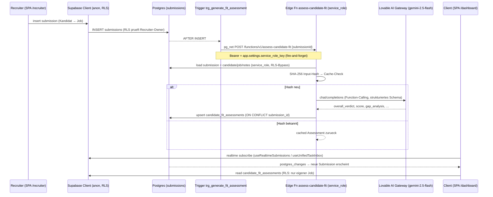

## 01. Architektur, Stack & Deployment

> Domaenen-Analyse fuer die Recruiting-Plattform **Matchunt** (matchunt.ai).
> Quelle = Quellcode dieses Repos (intern "matchunt", GitHub `RecruitigEntrepreneur/hire-speedy-ai`), Stand der Analyse: 2026-06-08.
> Verifizierter Deployment-Kontext: Frontend ueber **Lovable** (Projekt `7a26b296-848c-4f57-af34-75297cbf024b`), Backend = **Supabase**-Projekt `dngycrrhbnwdohbftpzq`.

---

### 1.1 Kurzfassung (TL;DR)

Matchunt ist eine **reine Single-Page-Application (SPA)** ohne SSR: React 18 + Vite 5 + TypeScript + Tailwind/shadcn im Frontend, das gesamte Backend liegt in **einem** Supabase-Projekt (Postgres 15, Row Level Security, ~79 Edge Functions in Deno, 93 Migrationen). Es gibt **kein eigenes API-Backend** und keinen Node-Server — das Frontend spricht ausschliesslich (a) direkt mit Postgres ueber den Supabase-Client (RLS-geschuetzt) und (b) ueber `supabase.functions.invoke()` mit Edge Functions. KI laeuft fast durchgaengig ueber das **Lovable AI Gateway** (`ai.gateway.lovable.dev`, Modell `google/gemini-2.5-flash`), nicht ueber direkte OpenAI-Keys.

Die zentrale Reibung dieser Domaene ist **organisatorisch, nicht technisch**: Lovable koppelt Git-Push und Live-Deploy *nicht* automatisch — "Publish" ist ein manueller Klick. Dadurch ist die Live-Seite matchunt.ai ein **aelterer Build** (ohne Fit-Analyse, Trust-Gate, Task-Inbox), waehrend das Supabase-Backend bereits die neuen Tabellen/Functions/Trigger besitzt. Der lokale Code ist dem publizierten Frontend voraus. Zusaetzlich existieren **zwei parallele Git-Linien auf demselben Supabase-Projekt** (`hire-speedy-ai` = aktiv, `matchunt-platform` = eingefroren Feb 2026), was ein latentes Risiko fuer Backend-Drift darstellt.

---

### 1.2 Tech-Stack (verifiziert aus `package.json`)

| Schicht | Technologie | Version | Beleg |
|---|---|---|---|
| Build-Tool | Vite | `^5.4.19` | `package.json:82` |
| React-Plugin | `@vitejs/plugin-react-swc` (SWC, nicht Babel) | `^3.11.0` | `package.json:71`, `vite.config.ts:2` |
| UI-Runtime | React / React DOM | `^18.3.1` | `package.json:52-54` |
| Sprache | TypeScript | `^5.8.3` (strict **aus**, s.u.) | `package.json:80` |
| Routing | `react-router-dom` | `^6.30.1` | `package.json:57`, `src/App.tsx:5` |
| Server-State | `@tanstack/react-query` v5 | `^5.83.0` | `package.json:43`, `src/App.tsx:107` |
| Styling | Tailwind CSS + `tailwindcss-animate` + `@tailwindcss/typography` | `3.4.17` | `package.json:79`, `tailwind.config.ts` |
| Komponenten | shadcn/ui auf Radix-Primitives (~30 `@radix-ui/*` Pakete) | — | `package.json:15-41`, `components.json` |
| Forms / Validierung | `react-hook-form` + `zod` + `@hookform/resolvers` | `7.61 / 3.25 / 3.10` | `package.json:14,55,63` |
| Charts | `recharts` | `^2.15.4` | `package.json:58` |
| Toasts | `sonner` + shadcn `toaster` (beide aktiv) | `^1.7.4` | `src/App.tsx:1-2,469-470` |
| Datum | `date-fns` | `^3.6.0` | `package.json:47` |
| Backend-Client | `@supabase/supabase-js` | `^2.86.2` | `package.json:42` |
| Lovable-Spezifik | `lovable-tagger` (dev-only Component-Tagging) | `^1.1.11` | `package.json:77`, `vite.config.ts:4,12` |

Backend-Laufzeit (aus Edge-Function-Quellen): **Deno** mit `serve()` aus `deno.land/std`, Supabase-JS via `esm.sh`. Stripe via `esm.sh/stripe@14.21.0` (`supabase/functions/stripe-webhooks/index.ts:2`).

**Beobachtung zur Typsicherheit:** Trotz CLAUDE.md-Regel "TypeScript strict, keine `any`" ist `strict: false`, `noImplicitAny: false`, `strictNullChecks: false` gesetzt (`tsconfig.json:4-13`, `tsconfig.app.json:16-25`). Die dokumentierte Regel und die reale Compiler-Konfiguration widersprechen sich.

---

### 1.3 Repo-Struktur

```
hire-speedy-ai/
├── src/                              # SPA-Frontend (568 .ts/.tsx Dateien)
│   ├── main.tsx                      # Entry; createRoot, Theme-Init aus localStorage
│   ├── App.tsx                       # Routing-Skelett + Provider-Stack
│   ├── index.css / App.css           # Tailwind-Layer + globale Styles
│   ├── pages/                        # Seiten je Persona
│   │   ├── dashboard/   (21 Dateien) # client  → /dashboard/*
│   │   ├── recruiter/   (16 Dateien) # recruiter → /recruiter/*
│   │   ├── admin/       (22 Dateien) # admin    → /admin/*
│   │   ├── onboarding/ interview/ offer/ reference/ organization/ public/
│   │   └── Index.tsx Auth.tsx NotFound.tsx
│   ├── components/                   # 37 Feature-Ordner + ui/ (shadcn)
│   ├── hooks/           (89 Dateien) # ein Hook ~ eine Edge Function / Tabelle
│   ├── lib/                          # auth.tsx + Anonymisierung/Normalisierung
│   ├── integrations/supabase/        # client.ts (handgepflegt) + types.ts (GENERIERT, 8.684 Z.)
│   ├── types/  assets/
│   └── vite-env.d.ts
├── supabase/
│   ├── config.toml                   # project_id + verify_jwt je Function
│   ├── functions/   (~79 + _shared)  # Edge Functions (Deno)
│   │   └── _shared/                  # encryption.ts, provider-config.ts, token-refresh.ts
│   └── migrations/  (93 *.sql)       # Schema, RLS, Trigger, Cron, Storage-Buckets
├── .lovable/plan.md                  # zuletzt von Lovable generierter Implementierungsplan
├── .env                              # ⚠ committed (VITE_SUPABASE_* — siehe Friction)
├── vite.config.ts  tailwind.config.ts  components.json  eslint.config.js
└── tsconfig*.json  package.json  package-lock.json
```

Auffaellig: `src/integrations/supabase/client.ts` und `types.ts` tragen den Kommentar *"automatically generated. Do not edit"* — sie werden von Lovable/Supabase regeneriert. Die `types.ts` (8.684 Zeilen) ist die maschinengenerierte Single-Source-of-Truth des DB-Schemas im Frontend.

---

### 1.4 Build & lokale Entwicklung

| Befehl | Wirkung | Beleg |
|---|---|---|
| `npm run dev` | Vite Dev-Server auf `host "::"`, Port **8080** | `package.json:7`, `vite.config.ts:8-11` |
| `npm run build` | Produktions-Build (statische Assets) | `package.json:8` |
| `npm run build:dev` | Build im `development`-Mode (aktiviert `componentTagger`) | `package.json:9`, `vite.config.ts:12` |
| `npm run preview` | lokale Vorschau des Build-Outputs | `package.json:11` |
| `npm run lint` | ESLint (flat config) | `package.json:10`, `eslint.config.js` |

Vite-Konfig ist minimal (`vite.config.ts`): SWC-React-Plugin, `componentTagger()` **nur** im `development`-Mode, Alias `@` → `./src`. Kein manuelles Code-Splitting, keine PWA-, Proxy- oder Env-Spezialisierung. Die Backend-URL wird zur Build-Zeit aus `import.meta.env.VITE_SUPABASE_URL` / `VITE_SUPABASE_PUBLISHABLE_KEY` injiziert (`src/integrations/supabase/client.ts:5-6`).

---

### 1.5 Deployment-Modell: Lovable (Frontend) + Supabase (Backend)

```mermaid
flowchart TB
    Dev["Lokaler Code\n(IDE / Claude / Cursor)"] -->|git push origin| GH["GitHub\nhire-speedy-ai"]
    LovUI["Lovable Editor\n(Prompting)"] -->|Auto-Commit| GH
    GH <-->|Bi-direktionale Sync| Lov["Lovable\nProjekt 7a26b296"]

    subgraph Frontend-Deploy["FRONTEND-DEPLOY (manuell!)"]
        Lov -. "Share → Publish\n(manueller Klick)" .-> Live["matchunt.ai\n(statische SPA, CDN)"]
    end

    subgraph Backend["BACKEND (Supabase dngycrrhbnwdohbftpzq)"]
        PG[("Postgres 15\n+ RLS")]
        EF["~79 Edge Functions\n(Deno)"]
        ST["Storage\ncv-documents / job-documents"]
        AUTH["Supabase Auth\nEmail + OAuth"]
        CRON["pg_cron + pg_net"]
    end

    Live -->|"supabase-js (anon key)\nRLS-Queries"| PG
    Live -->|"functions.invoke()"| EF
    Live --> AUTH
    Live --> ST
    EF -->|service_role (RLS-Bypass)| PG
    EF -->|service_role| ST
    EF -->|"LOVABLE_API_KEY"| AIGW["Lovable AI Gateway\ngoogle/gemini-2.5-flash"]
    CRON -->|net.http_post| EF
    PG -. "Trigger (pg_net)" .-> EF

    style Frontend-Deploy fill:#fff3cd,stroke:#e0a800
    style Live fill:#f8d7da,stroke:#dc3545
```

**Kernpunkt:** Git-Push und Backend-Migration aktualisieren *nicht* automatisch die Live-Seite. Der gestrichelte Pfad `Lov -. Publish .-> Live` ist die einzige Bruchstelle, die ein Mensch ausloesen muss. Backend-Aenderungen (Migrationen, Edge Functions) werden ueber den Lovable/Supabase-Sync hingegen *unmittelbar* wirksam — daher der Versatz.

#### Der Build-/Publish-Gap (verifizierter Kernbefund)

| Ebene | Stand `hire-speedy-ai` (lokal/Git) | Stand Supabase-Backend (live) | Stand Frontend matchunt.ai (live) |
|---|---|---|---|
| Fit-Analyse (`assess-candidate-fit`, Tabelle `candidate_fit_assessments`) | vorhanden | **deployed** (Trigger feuert) | **fehlt** |
| Trust-Gate / Verifizierungs-Hooks | vorhanden | deployed | fehlt |
| Unified Task Inbox (`useUnifiedTaskInbox`, Cron) | vorhanden | deployed (Cron laeuft) | fehlt |
| Letzte Commits (`9903dbd` …) | gepusht | wirksam | **nicht publiziert** |

Konsequenz: Das Backend feuert bereits Trigger und Cron-Jobs (z.B. `trg_generate_fit_assessment`, `influence-engine-run`) gegen Tabellen, deren UI auf der Live-Seite noch nicht existiert. Die neuen Edge Functions sind erreichbar, werden aber vom alten Frontend nicht aufgerufen — die Funktionalitaet ist "im Backend live, im Frontend unsichtbar".

#### Zwei parallele Git-Linien auf demselben Backend

Beide Repos zeigen auf **dasselbe** Supabase-Projekt `dngycrrhbnwdohbftpzq` (verifiziert via beider `supabase/config.toml`):

| Merkmal | `hire-speedy-ai` (dieses Repo, "matchunt") | `~/matchunt-platform` (eingefroren) |
|---|---|---|
| `package.json` name | `matchunt` | `vite_react_shadcn_ts` |
| Git-Remote | `origin` → hire-speedy-ai | `matchunt` → matchunt-platform |
| Letzter Commit | `9903dbd` (Fit-Auto-Trigger, aktuell) | `9f2f062` "Add project docs", letzte Aenderung **Feb 2026** |
| Edge Functions (Ordner) | **79** | 59 |
| Migrationen | **93** | 86 |
| Supabase project_id | `dngycrrhbnwdohbftpzq` | `dngycrrhbnwdohbftpzq` (**identisch!**) |
| Doku | `.lovable/plan.md`, `PROJECT_ANALYSIS.md` | `CLAUDE.md`, `docs/EDGE_FUNCTION_MAP.{md,json}` |

`matchunt-platform` enthaelt die wertvollere konzeptionelle Doku (CLAUDE.md, Edge-Function-Map) und definiert die Triple-Blind- und Datenmodell-Regeln, ist aber im Code eingefroren. **Risiko:** Wuerde jemand aus `matchunt-platform` heraus eine Migration oder Function gegen dasselbe Projekt deployen, kollidiert das mit dem aktiven `hire-speedy-ai`-Stand — es gibt keinen technischen Schutz gegen Backend-Drift zwischen den beiden Linien.

---

### 1.6 Routing-Skelett & die drei Personas

Das gesamte Routing liegt zentral in `src/App.tsx` (`AppRoutes`, `src/App.tsx:137-464`). Provider-Stack (`src/App.tsx:466-479`): `QueryClientProvider` → `TooltipProvider` → `BrowserRouter` → `AuthProvider` → `AppRoutes` + `CookieConsentBanner`.

**Auth-Gate:** `ProtectedRoute` (`src/App.tsx:109-135`) liest `useAuth()`. Logik:
1. `loading` → Spinner;
2. kein `user` → Redirect `/auth`;
3. `role === 'admin'` → **immer** Zugriff (Admin sieht alles, `src/App.tsx:125-127`);
4. sonst Rollen-Check gegen `allowedRoles`, bei Mismatch Redirect auf `/recruiter` bzw. `/dashboard`.

Die Rolle stammt aus der Tabelle `user_roles` (`src/lib/auth.tsx:53-63`, `fetchUserRole` → `select('role').eq('user_id', …).maybeSingle()`), nicht aus dem JWT-Claim. **Das ist eine reine UX-Schicht** — die eigentliche Sicherheit liegt in RLS (CLAUDE.md: "Frontend-Checks sind UX, NICHT Security").

| Persona | Pfad-Praefix | Seiten | Kernfunktion |
|---|---|---|---|
| **client** (Unternehmen) | `/dashboard/*` | 21 | Jobs anlegen/aktivieren, Command Center (`/dashboard/command/:jobId`), Bewerber/Kandidaten ansehen (anonymisiert bis Reveal), Interviews, Offers, Placements, Billing, Analytics, Team, Integrationen, DSGVO |
| **recruiter** (Headhunter) | `/recruiter/*` | 16 | Jobs ansehen (Firmenname verdeckt bis Reveal), Kandidaten einreichen, Submissions verfolgen, Earnings/Payouts (Stripe Connect), Influence/Trust-Level, Talent-Pool, Integrationen |
| **admin** | `/admin/*` | 22 | Clients/Recruiter/Jobs/Candidates/Interviews/Placements verwalten, Payments & Payout-Approval, Fraud, Deal-Health, Analytics, Matching-Config, Domains, Skill-Synonyms, Outreach |

**Oeffentliche, token-basierte Routen** (ohne Login, fuer Triple-Blind- und externe Flows, `src/App.tsx:437-452`): `/interview/select/:token`, `/interview/respond/:token`, `/offer/view/:token`, `/invite/:token`, `/reference/:token`, plus Marketing-Seiten (`/about`, `/blog`, `/impressum`, …). Diese Tokens sind der Mechanismus, ueber den Kandidaten/Externe ohne Account agieren (Slot waehlen, Offer ansehen, Referenz geben).

Die Landing-Page (`/`, `src/pages/Index.tsx`) ist aus ~15 `landing/*`-Sektionen komponiert (`HeroSection`, `EngineSection`, `PricingSection`, `TrustSecuritySection`, …).

---

### 1.7 Frontend ↔ Backend: Verbindungsmuster

Es gibt **genau zwei** Wege vom Frontend ins Backend:

**(A) Direkte RLS-Queries** via `supabase.from('<table>')`. Top-beruehrte Tabellen aus dem Frontend (Zaehlung `.from()`-Aufrufe in `src/`):

| Tabelle | `.from()`-Treffer | Rolle in der Domaene |
|---|---|---|
| `submissions` | 92 | Herzstueck: Kandidaten-Vorschlag + Triple-Blind-Flags |
| `jobs` | 45 | Stellen |
| `interviews` | 44 | Terminplanung |
| `outreach_leads` | 29 | Admin-Outreach |
| `candidates` | 29 | Bewerberprofile |
| `influence_alerts` | 25 | Recruiter-Influence (Cron-gefuettert) |
| `profiles` / `user_roles` | 17 / 13 | Identitaet + Rolle |
| `recruiter_tasks` / `notifications` / `messages` | 11 / 9 / 11 | Realtime-Feeds |

**(B) Edge-Function-Aufrufe** via `supabase.functions.invoke('<name>', { body: {...} })`. Konvention (CLAUDE.md): Body traegt oft `{ action, ...params }`, Function macht `serve() → req.json() → switch(action) → Response` mit CORS-Header und JSON-Antwort. Die meistgerufenen Functions aus dem Frontend:

| Edge Function | Invoke-Treffer | Aufgerufen aus (typisch) |
|---|---|---|
| `schedule-interview` | 7 | Interview-Scheduling-Hooks/Komponenten |
| `generate-outreach-email` | 4 | Admin-Outreach |
| `stripe-connect` | 3 | Recruiter-Payouts/Onboarding |
| `send-email` | 3 | diverse |
| `process-interview-response` | 3 | Interview-Antwort (auch public) |
| `gdpr-deletion` | 3 | DSGVO |
| `deal-health` | 3 | Admin Deal-Health |
| `crawl-company-data` | 3 | Job/Company-Enrichment |

Hooks kapseln dieses Muster konsequent: ein Hook pro Feature, der entweder React-Query um eine `.from()`-Query oder um einen `functions.invoke()`-Call legt (89 Hooks, z.B. `useCandidateFitAssessment.ts`, `useStripeConnect.ts`, `useJobMatching.ts`, `useUnifiedTaskInbox.ts`).

**Realtime:** Postgres-Changes werden in 7 Stellen abonniert (`.channel()` / `postgres_changes`): `useRealtimeMessages.ts`, `useRealtimeNotifications.ts`, `useRealtimeSubmissions.ts`, `useRecruiterTasks.ts`, `useUnifiedTaskInbox.ts`, `useInfluenceAlerts.ts`, `ClientNotificationCenter.tsx`. Damit aktualisieren sich Nachrichten, Benachrichtigungen, neue Submissions und Tasks live.

---

### 1.8 Backend-Architektur: Edge Functions, KI, Trigger, Cron, Webhooks

**Service-Role-Pattern:** 75 von 79 Functions lesen `SUPABASE_SERVICE_ROLE_KEY` (Zaehlung `Deno.env.get`), d.h. sie umgehen RLS und arbeiten mit Vollzugriff. Beleg-Muster z.B. `supabase/functions/assess-candidate-fit/index.ts:33-44` (CORS-Header, Service-Role-Client, Pruefung `LOVABLE_API_KEY`). Sicherheit haengt damit an `verify_jwt` (`supabase/config.toml`) plus eigener Autorisierungslogik in der Function.

**`verify_jwt`-Verteilung (`supabase/config.toml`):** Webhooks/Cron-/oeffentliche Endpunkte sind bewusst offen (`verify_jwt = false`): u.a. `stripe-webhooks`, `resend-webhooks`, `process-offer-response`, `process-interview-response`, `accept-invite`, `analyze-reference`, `talent-pool-match`, `influence-engine`, `escalation-engine`, `calculate-influence-score`, `refresh-analytics`, `process-*` (Queues/Inbound), `seed-ml-training-data`. Diese Functions muessen ihre Autorisierung selbst sicherstellen (Signatur-Pruefung bzw. Service-Token im Body).

**KI-Schicht:** 21 Functions rufen das **Lovable AI Gateway** (`ai.gateway.lovable.dev/v1/chat/completions`) mit `LOVABLE_API_KEY` auf; dominantes Modell `google/gemini-2.5-flash` (24 Referenzen), vereinzelt `google/gemini-3-flash-preview` (3) und `gpt-4o-mini` (3, via Gateway). **Kein** direkter `api.openai.com`-Aufruf im Code. Function-Calling/Tool-Choice wird fuer strukturierte Ausgaben genutzt (z.B. Fit-Assessment mit SHA-256-Input-Hash-Caching, `supabase/functions/assess-candidate-fit/index.ts`).

**Externe Provider (Secrets in Functions):** `RESEND_API_KEY` (E-Mail, 8×), `FIRECRAWL_API_KEY` (Web-Crawl, 4×), `STRIPE_SECRET_KEY` + `STRIPE_WEBHOOK_SECRET` (Payments), `GOOGLE_MAPS_API_KEY` / `OPENROUTE_API_KEY` (Geocoding), `ENCRYPTION_KEY` (OAuth-Token-Verschluesselung). OAuth-Token-Handling liegt geteilt in `supabase/functions/_shared/encryption.ts`, `provider-config.ts`, `token-refresh.ts`.

**DB-Trigger als Backend-Verdrahtung** (Auswahl aus 93 Migrationen):

| Trigger | Tabelle/Event | Wirkung |
|---|---|---|
| `on_auth_user_created` | `auth.users` INSERT | legt Profil/Rolle an |
| `trg_generate_fit_assessment` | `submissions` AFTER INSERT | `pg_net` → `POST /functions/v1/assess-candidate-fit` (fire-and-forget), Body `{submissionId}` — `supabase/migrations/20260307000000_fit_assessment_auto_trigger.sql:19-26` |
| `trigger_queue_candidate_embedding` / `trigger_queue_job_embedding` | candidates/jobs | stellt Embedding-Generierung in Queue |
| `invalidate_recommendations_on_candidate_update` | candidates | invalidiert Match-Empfehlungen |
| `on_interview_confirmed`, `on_submission_opt_in` | interviews/submissions | Folge-Workflows der Triple-Blind-Logik |
| `*_activity_log` (jobs/interviews/submissions/placements) | diverse | Audit-Log |

**Cron (pg_cron + pg_net), definiert in `supabase/migrations/20260225200000_unified_task_inbox.sql`:**

| Job | Zeitplan | Ziel |
|---|---|---|
| `escalation-engine-run` | `*/5 * * * *` | `POST /functions/v1/escalation-engine` |
| `influence-engine-run` | `*/15 * * * *` | `POST /functions/v1/influence-engine` |
| `influence-score-calc` | `0 * * * *` | `POST /functions/v1/calculate-influence-score` |
| `cleanup-expired-alerts` | `0 3 * * *` | reines SQL-UPDATE auf `influence_alerts` |

Cron und der Fit-Trigger nutzen `current_setting('app.settings.supabase_url')` + `current_setting('app.settings.service_role_key')` als DB-Settings — diese **muessen pro Projekt gesetzt sein**, sonst schlagen die HTTP-Calls still fehl (relevanter Drift-Punkt zwischen den beiden Git-Linien).

**Webhooks (eingehend):**
- `stripe-webhooks` (`verify_jwt=false`): verifiziert `stripe-signature` gegen `STRIPE_WEBHOOK_SECRET`, loggt nach `payment_events`, aktualisiert `invoices`, `placements`, `stripe_accounts`, `payout_requests` (`supabase/functions/stripe-webhooks/index.ts:41-135`). **Achtung:** Faellt auf `JSON.parse(body)` ohne Signaturpruefung zurueck, wenn `STRIPE_WEBHOOK_SECRET` fehlt (`index.ts:26-30`) — Forgery-Risiko bei Fehlkonfiguration.
- `resend-webhooks` (`verify_jwt=false`): E-Mail-Events (Resend).
- `process-inbound-email` / `process-inbound-reply` (`verify_jwt=false`): eingehende Outreach-Antworten.

**Storage-Buckets** (aus Migrationen): `cv-documents` und `job-documents`, beide **private** (`public=false`). Zugriff ueber signierte URLs / Service-Role aus Edge Functions.

---

### 1.9 End-to-End-Datenfluss: neue Submission (repraesentativer Pfad)



Dieser eine Pfad illustriert alle Domaenen-Bausteine zusammen: RLS-Query (Insert), DB-Trigger via `pg_net`, Service-Role-Edge-Function, Lovable-AI-Gateway, Caching, Upsert und Realtime-Rueckkanal ins Client-Frontend. **Genau hier wird der Publish-Gap sichtbar:** Backend erzeugt das `candidate_fit_assessments`-Ergebnis bereits, das *publizierte* Live-Frontend hat aber keine UI, um es darzustellen.

---

### 1.10 Bekannte Reibungs- & Risikopunkte (Architektur-Ebene)

1. **Publish-Gap (organisatorisch, hoch):** Git-Push/Backend-Migration ≠ Live. "Publish" ist manuell; Live-Frontend laeuft hinter Backend her. Symptom: neue Trigger/Functions feuern produktiv, aber ohne sichtbare UI.
2. **Zwei Git-Linien, ein Backend (hoch):** `hire-speedy-ai` (aktiv) und `matchunt-platform` (eingefroren) teilen `dngycrrhbnwdohbftpzq`. Kein technischer Schutz gegen widerspruechliche Migrationen/Deploys.
3. **`.env` ist eingecheckt (hoch):** `git ls-files .env` → tracked. Enthaelt `VITE_SUPABASE_*` (anon key + URL). Anon-Key ist zwar fuer den Client gedacht (RLS schuetzt), aber das Committen ist ein schlechter Default und maskiert, dass die *echte* Sicherheit komplett auf RLS + `verify_jwt` ruht.
4. **strict-Mode aus, Doku sagt strict (mittel):** `tsconfig*` mit `strict:false`/`noImplicitAny:false`; CLAUDE.md verlangt "keine `any`". Realer Typ-Schutz schwaecher als dokumentiert → latente Laufzeitfehler.
5. **Stripe-Webhook-Fallback ohne Signaturpruefung (mittel):** `supabase/functions/stripe-webhooks/index.ts:26-30` akzeptiert unsignierte Bodies, wenn `STRIPE_WEBHOOK_SECRET` nicht gesetzt ist — bei Fehlkonfiguration faelschbar.
6. **Cron/Trigger abhaengig von DB-Settings (mittel):** `app.settings.supabase_url` / `app.settings.service_role_key` muessen gesetzt sein; fehlen sie nach einem Projekt-/Linien-Wechsel, schlagen Cron- und Fit-Trigger-HTTP-Calls **still** fehl.
7. **Invoke-/Config-Drift (niedrig–mittel):** Frontend ruft `analyze-interview`, `google-auth`, `microsoft-auth` via `functions.invoke()`, doch es gibt **keine** gleichnamigen Function-Ordner → tote/fehlschlagende Calls oder OAuth-Bruch. Umgekehrt fehlt `extract-intake-briefing` als Eintrag in `config.toml` (nutzt damit den `verify_jwt`-Default).
8. **Monolithisches Routing & generierte Riesendatei (niedrig):** `App.tsx` mit ~80 Imports/Routen ohne Lazy-Loading (alles im initialen Bundle); `types.ts` mit 8.684 generierten Zeilen darf nicht von Hand angefasst werden (Regenerations-Konflikte).

---

### 1.11 Offene Fragen

- Loest "Publish" in Lovable einen Voll-Build des aktuellen Git-Heads aus, oder eines internen Lovable-Snapshots? D.h. genuegt ein Klick, um den Gap zu schliessen, oder braucht es vorher einen Sync?
- Existieren `analyze-interview`, `google-auth`, `microsoft-auth` als **deployte** Functions im Supabase-Projekt, obwohl die Quell-Ordner im Repo fehlen (z.B. nur in Lovable angelegt)? Falls nein: Welche Frontend-Flows (OAuth-Login Microsoft/Google, Interview-Analyse) sind aktuell gebrochen?
- Sind die DB-Settings `app.settings.supabase_url` / `app.settings.service_role_key` im aktiven Projekt korrekt gesetzt — laufen Cron-Jobs und der Fit-Trigger real?
- Welches der beiden Repos ist die *kanonische* Quelle fuer Backend-Migrationen? Gibt es einen Prozess, der verhindert, dass `matchunt-platform` versehentlich deployt?
- Ist der Stripe-Webhook in Produktion mit gesetztem `STRIPE_WEBHOOK_SECRET` konfiguriert (sonst greift der unsichere Fallback)?
