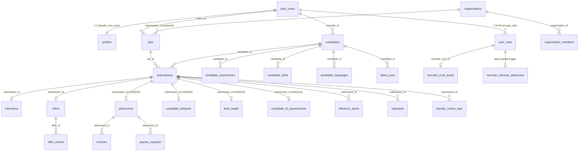
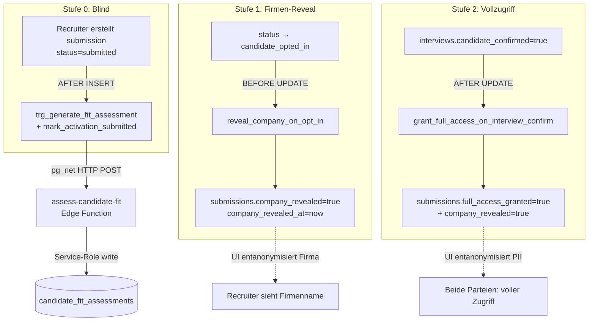
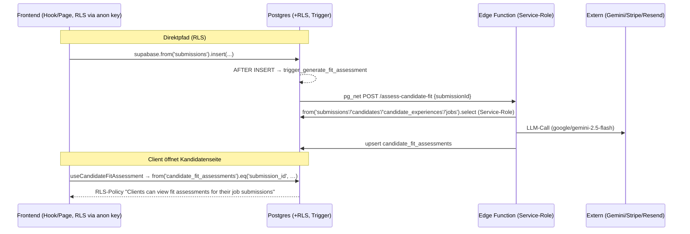

## 02. Datenmodell, RLS & DB-Logik

# 02. Datenmodell, RLS & DB-Logik

> Domänen-Tiefenanalyse für das Matchunt-CTO-Team. Quelle der Wahrheit: `supabase/migrations/*.sql` (93 Dateien), gegengeprüft mit Edge Functions (`supabase/functions/<name>/index.ts`) und Frontend-Zugriffsmustern (`src/hooks/*`, `src/pages/*`). Die ältere `PROJECT_ANALYSIS.md` diente nur als Orientierung.

Das Schema umfasst **~115 Tabellen** plus 2 Views (`candidate_job_overview`, `unified_task_inbox`), ein zentrales Enum (`app_role`), ~25 SECURITY-DEFINER-Funktionen/Trigger-Handler und **4 pg_cron-Jobs**. RLS ist auf praktisch jeder Tabelle aktiviert. Die Architektur folgt einer phasenweisen Migrationsstrategie ("Phase 1 Foundation" → "Phase 4 Enterprise" → Outreach/Trust/Fit-Assessment).

---

## 02.1 Architektur-Grundprinzipien des Datenmodells

Vier Muster ziehen sich durch das gesamte Schema:

1. **`auth.users` als Wurzel-Identität, `user_roles` als Autorisierungs-Quelle.** Personas werden **nicht** über ein Feld in `profiles`, sondern über die separate Tabelle `user_roles` (Enum `app_role`) modelliert — bewusst getrennt aus Sicherheitsgründen (Privilege-Escalation-Schutz). Geprüft wird ausschließlich über die SECURITY-DEFINER-Funktion `has_role(_user_id, _role)` (`20251204171610_*.sql:141`).
2. **`submissions` ist der zentrale Hub.** Fast jede operative Tabelle (interviews, offers, placements, candidate_behavior, deal_health, candidate_fit_assessments, influence_alerts, rejections, match_outcomes …) hängt per FK an `submissions.id`. Eine Submission = genau ein `(job_id, candidate_id)`-Paar (`UNIQUE(job_id, candidate_id)`).
3. **Direkter Tabellenzugriff (RLS-gated) für CRUD + Reads, Edge Functions (Service-Role) für KI/Orchestrierung/3rd-Party.** Das Frontend liest/schreibt die meisten Tabellen direkt via `supabase.from(...)` unter RLS; rechenintensive oder vertrauenswürdige Operationen laufen über ~81 Edge Functions mit `SUPABASE_SERVICE_ROLE_KEY` (umgeht RLS).
4. **„System"-Policies (`WITH CHECK (true)` / `USING (true)`).** 68 Policy-Klauseln erlauben uneingeschränktes Insert/Update — gedacht für Service-Role-Writes (Events, Scores, Fraud, Behavior). Das ist funktional notwendig, aber ein **Härtungsrisiko** (siehe Friction Points).

### Persona → Routing → Datenzugriff

| Persona | Routen-Präfix (`src/App.tsx`) | Guard | Primäre eigene Tabellen (RLS-Owner) |
|---------|------------------------------|-------|-------------------------------------|
| `client` | `/dashboard/*` | `ProtectedRoute allowedRoles={['client']}` (`src/App.tsx:144 ff.`) | `jobs` (client_id), `company_profiles`, `client_verifications`, `offers`, `invoices`, `organizations` |
| `recruiter` | `/recruiter/*` | `allowedRoles={['recruiter']}` (`src/App.tsx:236 ff.`) | `candidates`, `submissions`, `talent_pool`, `recruiter_*`, `payout_requests`, `stripe_accounts`, `recruiter_integrations` |
| `admin` | `/admin/*` | `allowedRoles={['admin']}` | Vollzugriff via `has_role(...,'admin')` auf nahezu alle Tabellen |

---

## 02.2 ER-Überblick der Kern-Entitäten



**Kern-Tabellen (markiert):** `candidates`, `jobs`, `submissions`, `candidate_fit_assessments`, `user_roles`, `notifications`. **Unterstützend:** alles andere (Analytics, SLA, Fraud, Outreach, Integrationen, Coaching, Referenzen, Tags, …).

---

## 02.3 Tabellen-Katalog (gruppiert)

### Identität & Autorisierung
| Tabelle | Schlüsselspalten | Beziehungen / Notizen | Migration |
|---------|------------------|-----------------------|-----------|
| `profiles` ★ | `id`, `user_id`→auth.users (UNIQUE), `email`, `bank_iban`, `bank_bic`, `tax_id`, `internal_notes` | 1:1 mit auth.users; auto-erstellt via `handle_new_user()` | `…171610` / Bankdaten `…173818` |
| `user_roles` ★ **Kern** | `user_id`, `role app_role`, `verified`, `UNIQUE(user_id,role)`; später `status`, `suspended_at`, `custom_fee_percentage` | Einzige Autorisierungs-Quelle; gelesen von `has_role()` | `…171610` |
| `company_profiles` | `user_id` (UNIQUE), `company_name`, `culture_values`, `benefits`, `opt_in_message`, `show_*_in_opt_in` | Erweiterte Firmendaten für Opt-In-Anzeige | `…182100`, erweitert `…230322` |
| `client_verifications` | `client_id` (UNIQUE), `terms_accepted`, `contract_signed`, `digital_signature`, `kyc_status` | KYC/KYB-Workflow; admin verifiziert | `…204702` |
| `recruiter_verifications` | recruiter-KYC (analog) | NDA/Vertrag/Profil-Onboarding | `…164340` |
| `organizations`, `organization_members`, `organization_invites`, `permission_definitions` | Team-Accounts mit eigener Rollen-Enum (`owner/admin/hiring_manager/viewer/finance`) | `jobs.organization_id` (optional FK) | `…231510` |

### Kern-Recruiting-Pipeline
| Tabelle | Schlüsselspalten | Notizen | Migration |
|---------|------------------|---------|-----------|
| `jobs` ★ **Kern** | `client_id`, `title`, `company_name`, `skills[]`, `must_haves[]`, `nice_to_haves[]`, `fee_percentage`, `recruiter_fee_percentage`, `status`, `screening_questions JSONB`, `company_size_band`, `funding_stage`, `tech_environment[]`, `hiring_urgency`, `organization_id` | Status-Lebenszyklus `draft → published → …` | `…171610`, Triple-Blind-Felder `…110726` |
| `candidates` ★ **Kern** | `recruiter_id`, `full_name`, `email`, `skills[]`, `cv_url`, `cv_raw_text`, `cv_ai_summary`, `cv_ai_bullets JSONB`, `target_roles/industries/locations JSONB`, `preferred_channel`, `whatsapp_opt_in` | Recruiter-eigene Stammdaten | `…171610`, CV-Felder `…233705` |
| `submissions` ★ **Kern / Hub** | `job_id`, `candidate_id`, `recruiter_id`, `status`, `stage`, `match_score`, **Triple-Blind:** `consent_confirmed`, `identity_unlocked`, `unlocked_at/by`, `company_revealed`, `company_revealed_at`, `full_access_granted`, `full_access_granted_at`, `opt_in_response`; `UNIQUE(job_id,candidate_id)` | **Realtime aktiviert**; zentraler FK-Hub | `…171610`; Blind-Felder `…191207`+`…110726` |
| `candidate_fit_assessments` ★ **Kern** | `submission_id` (UNIQUE), `candidate_id`, `job_id`, `overall_verdict` (strong/good/partial/weak/no_fit), `overall_score 0-100`, `executive_summary`, `requirement_assessments JSONB`, `gap_analysis JSONB`, `dimension_scores JSONB`, `model_used`, `prompt_version` | KI-Fit-Analyse; ersetzt Keyword-Matching; **auto-getriggert** bei Submission-Insert | `20260306000000_candidate_fit_assessments.sql` |
| `interviews` | `submission_id`, `scheduled_at`, `proposed_slots JSONB`, `selection_token` (UNIQUE), `response_token`, `meeting_format`, `client_confirmed`, `candidate_confirmed`, `no_show_reported` | **Realtime**; `candidate_confirmed=true` triggert Triple-Blind Stufe 2 | `…171610`, erweitert `…205344` |
| `offers` | `submission_id`, `job_id`, `candidate_id`, `client_id`, `recruiter_id`, `salary_offered`, `counter_offer_salary`, `negotiation_rounds`, `status`, `access_token` (UNIQUE), `candidate_signature`, `client_signature` | **Realtime**; Token-basierter Public-Zugriff | `…215330` |
| `offer_events` | `offer_id`, `event_type`, `actor_type` | **Realtime**; Audit-Trail | `…215330` |
| `placements` | `submission_id` (UNIQUE), `agreed_salary`, `total_fee`, `platform_fee`, `recruiter_payout`, `escrow_status` (pending/held/released/disputed/refunded) | Erfolgsfall; treibt Finanzen | `…171610`, Escrow `…195741` |
| `rejections` / `rejection_templates` | `submission_id`, `rejection_stage`, `ai_improvement_suggestions JSONB` | Absage-Flow mit KI-Vorschlägen | `…215330` |
| `candidate_conflicts` | `submission_a_id`, `submission_b_id`, `conflict_type`, `severity` | Mehrfachbewerbungs-Erkennung | `…215330` |

### Triple-Blind-Audit & Kommunikation
| Tabelle | Schlüsselspalten | Notizen | Migration |
|---------|------------------|---------|-----------|
| `identity_unlock_logs` | `submission_id`, `action`, `performed_by`, `details JSONB` | Audit-Trail aller Reveal-Aktionen | `…191207` |
| `notifications` ★ **Kern** | `user_id`, `type`, `title`, `related_id`, `related_type`, `is_read` | **Realtime**; `idx_notifications_user_unread` | `…182100` |
| `messages` | `conversation_id`, `sender_id`, `recipient_id`, `job_id`, `candidate_id`, `content`, `is_read` | **Realtime**; `idx_messages_conversation` | `…182100` |
| `communication_log` | `candidate_id`, `submission_id`, `channel`, `message_type`, `links_clicked JSONB` | Omnichannel-Historie (email/sms/whatsapp) | `…215330` |
| `message_templates` / `email_templates` / `email_events` | Vorlagen + Versand-Logging | seed: Opt-In/Interview/Offer-Mails | `…215330`, `…193757` |

### Influence-Engine & Coaching
| Tabelle | Schlüsselspalten | Notizen | Migration |
|---------|------------------|---------|-----------|
| `candidate_behavior` | `submission_id` (UNIQUE), `confidence_score`, `interview_readiness_score`, `closing_probability` (alle 0-100, CHECK), `engagement_level`, `hesitation_signals JSONB` | **Realtime**; KI-Engagement-Scoring | `…212224` |
| `influence_alerts` | `submission_id`, `recruiter_id`, `alert_type` (15-Wert-CHECK), `priority`, `recommended_action`, `playbook_id`, `snoozed_until`, `impact_score` | **Realtime**; **partieller UNIQUE-Index** verhindert Duplikate (`…task_inbox`) | `…212224` |
| `coaching_playbooks` | `trigger_type` (11-Wert-CHECK), `phone_script`, `email_template`, `whatsapp_template`, `talking_points JSONB`, `objection_handlers JSONB` | 11 vorseedete Sales-Playbooks (DE) | `…212224` |
| `recruiter_influence_scores` | `recruiter_id` (UNIQUE), `influence_score 0-100`, `opt_in_acceleration_rate`, `closing_speed_improvement` | Stündlich neu berechnet (cron) | `…212224` |
| `recruiter_tasks` | `recruiter_id`, `task_type`, `due_at`, `source` (manual/system/sequence/sla), `related_alert_id`, `playbook_id` | **Realtime**; Teil der `unified_task_inbox`-View | `…230322`, erweitert `…task_inbox` |

### Recruiter-Trust-System (Activation-Gate)
| Tabelle | Schlüsselspalten | Notizen | Migration |
|---------|------------------|---------|-----------|
| `recruiter_trust_levels` | `recruiter_id` (UNIQUE), `trust_level` (bronze/silver/gold/suspended), `activation_ratio`, `max_active_slots`, `placements_hired` | Bestimmt, wie viele Jobs ein Recruiter parallel aktivieren darf | `20260302160000_recruiter_trust_system.sql` |
| `recruiter_job_activations` | `recruiter_id`, `job_id`, `UNIQUE`, `has_submitted`, `first_submission_at` | Trigger erhöht Counter; Bulk-Detection (>5/h → fraud_signal) | dito |

### Finanzen
| Tabelle | Schlüsselspalten | Notizen | Migration |
|---------|------------------|---------|-----------|
| `invoices` | `placement_id`, `client_id`, `invoice_number` (UNIQUE), `stripe_invoice_id`, `total_amount`, `status` | Client-Rechnungen | `…182100`, Stripe `…195741` |
| `payout_requests` | `placement_id`, `recruiter_id`, `amount`, `status` (6-Wert-CHECK), `stripe_transfer_id`, `approved_by` | Recruiter-Auszahlung mit Admin-Approval | `…195741` |
| `stripe_accounts` | `user_id`, `stripe_account_id` (UNIQUE), `payouts_enabled`, `onboarding_complete` | Stripe Connect (Express) | `…195741` |
| `payment_events` | `stripe_event_id` (UNIQUE), `event_type`, `payload JSONB`, `processed` | Idempotenter Webhook-Store | `…195741` |

### Analytics, SLA, Risiko & Behavior
| Tabelle | Notiz | Migration |
|---------|-------|-----------|
| `funnel_metrics`, `recruiter_leaderboard`, `employer_scores`, `employer_feedback` | Aggregierte KPIs (täglich/periodisch via cron-Funktion) | `…230322` |
| `deal_health` | `submission_id` (UNIQUE), `health_score 0-100`, `risk_level`, `bottleneck`, `recommended_actions JSONB` | KI-Deal-Monitoring | `…204702` |
| `sla_rules` / `sla_deadlines` | 5 vorseedete Regeln; Deadline-Tracking + Eskalation | `…204702` |
| `user_behavior_scores` | `user_id` (UNIQUE), `ghost_rate`, `sla_compliance_rate`, `risk_score`; speist Trust-Level | `…204702` |
| `platform_events` | Event-Engine (`event_type`, `ip_address`, `user_agent` für Anti-Fraud) | `…204702` |
| `fraud_signals` | `signal_type`, `severity`, `confidence_score`, `status`; bewirkt Trust-Suspension | `…204702` |

### Matching-Infrastruktur & ML
| Tabelle | Notiz | Migration |
|---------|-------|-----------|
| `matching_config` | versionierte Gewichte/Gates als JSONB; `UNIQUE(active) WHERE active` (nur 1 aktiv) | `…030355` |
| `skill_taxonomy` | kanonische Skills + `aliases[]` (GIN-Index) + `transferability_from JSONB` | `…030355` |
| `skill_synonyms` | bidirektionale Synonyme (seed: js↔javascript …) | `…144038` |
| `tech_domains` | 14 Domänen mit `transferable_to[]` / `incompatible_with[]` (z.B. embedded ✗ frontend) | `…144038` |
| `match_outcomes` / `match_recommendations` | ML-Feedback-Loop: predicted vs. actual outcome | `…030355` |
| `embedding_queue`, `ml_training_events` | Vektor-/Trainings-Pipeline | diverse |

### Sub-Profile, Referenzen, Outreach, Integrationen
- **Kandidaten-Sub-Tabellen:** `candidate_experiences`, `candidate_educations`, `candidate_skills`, `candidate_languages`, `candidate_projects`, `candidate_documents`, `candidate_notes`, `candidate_comments`, `candidate_ai_assessment`, `candidate_client_summary`, `candidate_interview_notes`, `candidate_activity_log`, `candidate_risk_reports`, `candidate_tags`/`candidate_tag_assignments` — alle FK auf `candidates.id` (CASCADE).
- **Referenzen:** `reference_requests` (Token), `reference_responses` (1-5-Ratings + `ai_summary`, `ai_risk_flags JSONB`).
- **Talent-Pool:** `talent_pool` (`UNIQUE(candidate_id, recruiter_id)`), `talent_alerts`.
- **Outreach (~15 Tabellen):** `outreach_companies`, `outreach_leads`, `outreach_campaigns`, `outreach_sequences`, `outreach_emails`, `outreach_send_queue`, `outreach_suppression_list`, `outreach_rate_limits`, `outreach_reply_classifications`, `outreach_winning_patterns`, … (Admin-Outreach-Modul).
- **Integrationen:** `integrations` + `integration_mappings` + `integration_sync_log` (Org-ATS, Personio/Greenhouse/…), `recruiter_integrations` + `oauth_states` (per-Recruiter CRM-OAuth/PKCE), `user_integrations`.
- **Email-Ingestion:** `recruiter_inbound_addresses` (auto-seed `r_<8hex>@inbound.matchunt.ai`), `candidate_import_jobs` (State-Machine für CV-Mail-Import).

### GDPR & Compliance
`consents` (subject_type/id, granted, ip, user_agent), `data_export_requests`, `data_deletion_requests` (mit `confirmation_token`), `activity_logs`, `identity_unlock_logs`.

---

## 02.4 RLS-Muster (sicherheitsrelevant)

Es gibt **fünf wiederkehrende Policy-Archetypen**. 103 Policy-Klauseln nutzen `has_role(auth.uid(), 'admin')`.

### A) Owner-basiert (Selbst-Zugriff)
```sql
-- profiles, candidates, jobs, stripe_accounts, recruiter_integrations …
USING (auth.uid() = user_id)        -- bzw. = recruiter_id / = client_id
```
Beispiel `jobs`: `"Clients can manage their own jobs" … USING (auth.uid() = client_id)` (`…171610:191`).

### B) Beziehungs-basiert (Join über submissions → jobs)
Das **wichtigste Muster** für die Triple-Blind-Pipeline. Client sieht Submission-bezogene Daten nur, wenn er Owner des zugehörigen Jobs ist; Recruiter nur, wenn er Owner der Submission ist:
```sql
-- z.B. interviews, deal_health, candidate_comments, candidate_fit_assessments
USING (EXISTS (
  SELECT 1 FROM submissions s JOIN jobs j ON j.id = s.job_id
  WHERE s.id = <table>.submission_id
    AND (s.recruiter_id = auth.uid() OR j.client_id = auth.uid())
))
```
(`…171610:227` interviews, `…204702:33` deal_health, `20260306000000:66` fit_assessments.)

### C) Rollen-basiert (Persona-weit)
```sql
-- recruiter_leaderboard, employer_scores, skill_taxonomy …
USING (has_role(auth.uid(), 'recruiter'))   -- alle Recruiter sehen Leaderboard
USING (active = true)                        -- öffentliche Lookup-Tabellen
```

### D) System/Service-Role (permissiv)
```sql
-- candidate_behavior, deal_health, fraud_signals, platform_events, match_outcomes …
CREATE POLICY "System can insert …" FOR INSERT WITH CHECK (true);
CREATE POLICY "System can update …" FOR UPDATE USING (true);
```
68 solcher Klauseln. Notwendig, weil Edge Functions mit Service-Role schreiben — **aber** mehrere davon (`candidate_conflicts`, `integration_mappings`, `recruiter_trust_levels`, `recruiter_job_activations`) sind `FOR ALL USING (true)`, was theoretisch jedem authentifizierten Client Schreibzugriff gäbe, falls die Tabelle je direkt aus dem Frontend angesprochen würde.

### E) Token-basiert (Public/Anonym)
Für externe Magic-Links ohne Login:
```sql
-- offers: "Public can view offers by token" … USING (access_token IS NOT NULL)   (…215330:177)
-- reference_requests / organization_invites: USING (true)  → "Anyone can view by token"
```
**Sicherheitsrelevant:** Diese Policies erlauben jedem **jede Zeile** zu lesen (die Geheimhaltung liegt allein im nicht-erratbaren Token, das die App in der `.eq('access_token', …)`-Query mitgibt). Bei `offers` bedeutet `USING (access_token IS NOT NULL)`, dass ein anonymer Nutzer per `select` ohne Token-Filter **alle** Offers mit gesetztem Token enumerieren könnte → siehe Friction Points.

### Triple-Blind = RLS + Trigger-gesteuerte Spalten
Die eigentliche Anonymisierung ist **nicht** rein in RLS gelöst, sondern in der Frontend-Anonymisierungs-Schicht (`src/lib/anonymization.ts`) plus Statusflags auf `submissions`, die durch Trigger gesetzt werden (s. 02.5). RLS gewährt zwar Zeilenzugriff, aber das UI blendet PII bis `company_revealed` / `full_access_granted` aus. **Das ist ein Defense-in-Depth-Gap:** ein technisch versierter Client mit Direct-API-Zugriff sieht via RLS bereits Kandidaten-PII (`candidates`-Join über fit_assessments/experiences), bevor das Opt-In erfolgt ist (siehe Friction Points, High).

---

## 02.5 DB-Funktionen, Trigger & der Triple-Blind-Automat

### SECURITY-DEFINER-Kernfunktionen
| Funktion | Zweck | Aufgerufen von |
|----------|-------|----------------|
| `has_role(_user_id UUID, _role app_role)` | zentraler Autorisierungs-Check, `STABLE`, `SET search_path=public` | 103 RLS-Policies |
| `get_user_role(_user_id)` | erste Rolle eines Users | Frontend-Hooks |
| `handle_new_user()` | erstellt `profiles` + `user_roles` aus `raw_user_meta_data` | Trigger `on_auth_user_created` AFTER INSERT auf `auth.users` |
| `update_updated_at()` / `update_updated_at_column()` | Timestamp-Pflege (zwei Varianten existieren — s. Friction Points) | ~20 BEFORE-UPDATE-Trigger |
| `ensure_trust_level_exists` / `recalculate_trust_level` / `recalculate_all_trust_levels` | Trust-Gate-Logik | Trigger + cron |
| `auto_create_inbound_address()` | seedet Inbound-Mail pro neuem Recruiter | Trigger `on_recruiter_role_created` auf `user_roles` |
| `cleanup_expired_oauth_states()` | PKCE-State-GC | manuell/cron |

### Triple-Blind-Trigger-Kette (USP-kritisch)



- **Stufe 1** (`reveal_company_on_opt_in`, `…110726:20`): `BEFORE UPDATE` auf `submissions`. Sobald `status='candidate_opted_in'`, wird `company_revealed=true` gesetzt → Recruiter darf den anonymisierten Firmennamen sehen.
- **Stufe 2** (`grant_full_access_on_interview_confirm`, `…110726:44`): `AFTER UPDATE` auf `interviews`. Wenn der Kandidat das Interview bestätigt (`candidate_confirmed`), wird per Cross-Table-`UPDATE` `full_access_granted=true` auf die zugehörige Submission gesetzt.
- **Auto-Fit-Assessment** (`trigger_generate_fit_assessment`, `20260307000000_*.sql`): `AFTER INSERT` auf `submissions`. Feuert **fire-and-forget** via `pg_net` (`net.http_post`) die Edge Function `assess-candidate-fit` mit `{submissionId}`. Nutzt `current_setting('app.settings.supabase_url'/'service_role_key')` (DB-GUCs). Damit ist das Assessment fertig, bevor der Client die Seite öffnet.
- **Trust/Fraud-Trigger** (`recruiter_trust_system`): `mark_activation_submitted` (Submission-Insert → Counter), `on_job_activation` + `check_bulk_activation` (Activation-Insert → bei >5/h `fraud_signals`-Insert).

### pg_cron-Jobs (`20260225200000_unified_task_inbox.sql:133 ff.`)
| Job | Cron | Ziel-Edge-Function |
|-----|------|--------------------|
| `influence-engine-run` | `*/15 * * * *` | `influence-engine` |
| `escalation-engine-run` | `*/5 * * * *` | `escalation-engine` |
| `influence-score-calc` | `0 * * * *` (stündlich) | `calculate-influence-score` |
| `cleanup-expired-alerts` | `0 3 * * *` (täglich) | reines SQL (dismisst abgelaufene `influence_alerts`) |

Alle HTTP-Jobs rufen via `net.http_post` mit Service-Role-Bearer ihre Edge Function auf — d.h. **DB-Cron → pg_net → Edge Function → DB-Write** ist das durchgängige Orchestrierungsmuster.

---

## 02.6 Vernetzung: Frontend → Edge Function → Tabellen

Die meisten Schreib-/Leseoperationen laufen **direkt** unter RLS (Top-Tabellen nach Direktzugriff: `submissions` 58×, `interviews` 32×, `jobs` 30×, `candidates` 19×, `influence_alerts` 17×). Edge Functions kapseln KI/3rd-Party/Privileged-Logik.



### Wichtigste Function ↔ Tabellen-Kopplungen
| Edge Function | Frontend-Aufrufer | Liest | Schreibt |
|---------------|-------------------|-------|----------|
| `assess-candidate-fit` | `useCandidateFitAssessment.ts:145` (+ DB-Trigger) | `submissions`, `candidates`, `candidate_experiences/languages/skills`, `candidate_interview_notes`, `candidate_ai_assessment`, `jobs` | `candidate_fit_assessments` |
| `calculate-match-v3-1` | `useMatchScoreV3*` | `jobs`, `candidates`, `tech_domains`, `skill_synonyms`, `matching_config` | `match_outcomes`, `submissions.match_score` |
| `schedule-interview` (7 Aufrufe!) | Interview-Dialoge | `submissions`, `interviews` | `interviews`, `notifications`, `communication_log` |
| `client-candidate-summary` | `useClientCandidateSummary.ts` | `candidates` + Sub-Tabellen | `candidate_client_summary` |
| `influence-engine` (cron) | — | `submissions`, `candidate_behavior`, `sla_deadlines` | `influence_alerts` |
| `escalation-engine` (cron) | — | `sla_deadlines`, `sla_rules` | `notifications`, `influence_alerts` |
| `process-payout` | RecruiterPayouts | `payout_requests`, `placements`, `stripe_accounts` | `payout_requests`, Stripe-Transfer |
| `stripe-webhooks` | — (Webhook) | `payment_events` | `invoices`, `placements`, `payment_events` |
| `gdpr-deletion` / `gdpr-export` | DataPrivacy-Hub | viele | `data_deletion_requests` / `data_export_requests` |
| `process-candidate-email` / `process-candidate-import` | Inbound-Mail-Webhook | `recruiter_inbound_addresses`, `candidate_import_jobs` | `candidates` + Sub-Tabellen, `candidate_notes` |

---

## 02.7 Indizes (Auswahl, performancerelevant)
- **Hot-Path-Filter:** `idx_submissions_company_revealed` / `idx_submissions_full_access` (partiell, `WHERE … = true`), `idx_notifications_user_unread`, `idx_messages_conversation`.
- **Dedup-Constraint:** `idx_influence_alerts_active_unique` — **partieller UNIQUE** `(submission_id, alert_type) WHERE action_taken IS NULL AND is_dismissed=false`: verhindert Alert-Spam.
- **Matching:** `idx_skill_taxonomy_aliases` (GIN auf `aliases[]`), `idx_matching_config_active` (partieller UNIQUE — nur 1 aktive Config).
- **Mail-Matching:** `idx_candidates_email_recruiter`, `idx_candidates_phone_recruiter` (partiell `WHERE phone IS NOT NULL`).
- **Finanz/Fraud:** `idx_payout_requests_status`, `idx_fraud_signals_status (status,severity)`, `idx_deal_health_risk (risk_level,health_score)`.

---

## 02.8 Reibungs- & Risikopunkte (im Code beobachtet)

1. **[HIGH] Triple-Blind ist UI-erzwungen, nicht RLS-erzwungen.** RLS für `candidates`-Joins (z.B. `candidate_fit_assessments`, `candidate_experiences` via `…fix_candidate_experiences_rls_and_seed.sql`) gibt Clients Zeilenzugriff auf Kandidatendaten, **sobald eine Submission existiert** — unabhängig von `company_revealed`/`full_access_granted`/`identity_unlocked`. Die Anonymisierung passiert in `src/lib/anonymization.ts` clientseitig. Ein Client, der die Supabase-API direkt anspricht, kann PII vor dem Opt-In abgreifen. → Stufen-Flags in die RLS-Policies aufnehmen oder PII-Felder erst per Edge Function nach Reveal ausliefern.

2. **[HIGH] `offers`-Token-Policy erlaubt Enumeration.** `"Public can view offers by token" USING (access_token IS NOT NULL)` (`…215330:177`) filtert nicht auf einen konkreten Token. Ein anonymer `select('*')` ohne `.eq('access_token', …)` liefert **alle** token-behafteten Offers inkl. Gehältern/Signaturen zurück. Gleiches Muster bei `reference_requests`/`organization_invites` (`USING (true)`). → Token-Vergleich in die Policy ziehen oder ausschließlich über eine SECURITY-DEFINER-RPC mit Token-Argument ausliefern.

3. **[HIGH] Vertauschte `has_role`-Argumente in OAuth-Policy.** In `20260224150000_oauth_integrations.sql:101` lautet die Admin-Policy `has_role('admin', auth.uid())` — Signatur ist aber `has_role(_user_id UUID, _role app_role)`. Es gibt **keine** überladene Variante (`grep` bestätigt nur eine Signatur). Effekt: `'admin'` wird als UUID gecastet (Laufzeitfehler oder immer-false), die Policy greift nie → Admins können `recruiter_integrations` über diese Policy nicht lesen. Funktional maskiert durch die zusätzliche `"Service role manages integrations" USING(true)`-Policy, die zugleich aber jedem Zugriff gewährt. → Argumente korrigieren **und** die `USING(true)`-Service-Policy entschärfen.

4. **[MEDIUM] Permissive `FOR ALL USING(true)`-Policies auf sensiblen Tabellen.** `recruiter_trust_levels`, `recruiter_job_activations`, `candidate_conflicts`, `integration_mappings` tragen `FOR ALL USING(true)` (für Trigger/Service-Role gedacht). Da RLS für `authenticated` gilt, könnte ein Client diese Tabellen direkt manipulieren (z.B. eigenen Trust-Level auf `gold` setzen, `max_active_slots` erhöhen). → Auf `service_role`-spezifische Policies umstellen bzw. Writes nur über SECURITY-DEFINER-Funktionen.

5. **[MEDIUM] `app.settings.*`-GUCs als implizite Abhängigkeit.** Drei Migrationen (`…task_inbox`, `…221420`, `…fit_assessment_auto_trigger`) und alle cron-Jobs lesen `current_setting('app.settings.supabase_url')` und `…service_role_key`. Diese GUCs müssen außerhalb der Migrationen (per `ALTER DATABASE … SET`) gesetzt sein. Fehlen sie, scheitern Trigger und Cron **still** (pg_net fire-and-forget wirft keinen sichtbaren Fehler) → Auto-Fit-Assessment und Influence-Engine laufen leer. Nicht im Repo dokumentiert. → Bootstrap-Migration + Runbook ergänzen.

6. **[MEDIUM] Zwei `updated_at`-Funktionen nebeneinander.** `update_updated_at()` (Basis, `…171610`) und `update_updated_at_column()` (`…203625` u.a.) existieren parallel; neuere Tabellen (`tech_domains`, `skill_synonyms`) hängen an `…_column`. Reine Redundanz/Verwechslungsgefahr, aber keine Funktionslücke (beide Migrationen sind nach der Definition datiert). → Auf eine Funktion konsolidieren.

7. **[MEDIUM] `submissions.status` / `stage` sind freie TEXT-Felder ohne CHECK.** Die Triple-Blind-Trigger hängen an Magic-Strings (`'candidate_opted_in'`, `'hired'`). Ein Tippfehler im Frontend oder einer Edge Function setzt den Status, ohne den Trigger auszulösen — der Reveal bleibt aus, ohne Fehler. `interviews.status`, `jobs.status`, `offers.status` ebenso ungetypt. → Enum oder CHECK-Constraints einführen, Status-Übergänge zentralisieren.

8. **[LOW] `candidate_fit_assessments` als KI-Single-Source vs. Legacy-Matching.** Es koexistieren `match_outcomes`/`match_recommendations` (v1–v3.1) **und** `candidate_fit_assessments` (neu). `submissions.match_score` (INTEGER) wird parallel gepflegt. Welche Quelle das UI primär nutzt, ist verteilt (mehrere `useMatchScore*`-Hooks + `useCandidateFitAssessment`). → Matching-Strategie konsolidieren, Legacy-Pfade deprecaten.

9. **[LOW] Seed-Testdaten mit festen UUIDs in Produktionsmigration.** `…fix_candidate_experiences_rls_and_seed.sql` löscht/inserted Demo-Kandidaten (`aaaa1111-…`) in derselben Migration wie eine RLS-Policy. Mischung aus Schema und Fixtures erschwert saubere Prod-Deploys. → Seeds in separate, nicht-prod-Migration/Seeder auslagern.

---

## 02.9 Offene Fragen
- Werden die `app.settings.supabase_url` / `app.settings.service_role_key` GUCs in der gemanagten Supabase-Instanz tatsächlich gesetzt? Falls nein, laufen Auto-Fit-Assessment + alle Cron-Engines ins Leere.
- Ist der Direkt-API-Zugriff für `client`/`recruiter` auf die Supabase-REST/GraphQL-Schicht in Produktion offen (anon key im Frontend)? Davon hängt die reale Schwere von Friction #1/#2/#4 ab.
- Gibt es eine bewusste Entscheidung, Triple-Blind clientseitig statt per RLS durchzusetzen (Performance? Recruiter-Workflows?), oder ist es technische Schuld?
- `submissions.match_score` vs. `candidate_fit_assessments.overall_score`: Welcher Wert ist für Ranking/Sortierung autoritativ?
- Wie werden verwaiste „System"-Inserts (z.B. `candidate_behavior` ohne gültige Submission durch `WITH CHECK(true)`) verhindert — gibt es Integritäts-Jobs?
- Existiert ein Backfill/Reconciliation für `recruiter_trust_levels`, wenn `recalculate_all_trust_levels` (cron-pfad) nicht verdrahtet ist? (kein cron-Eintrag dafür gefunden.)
