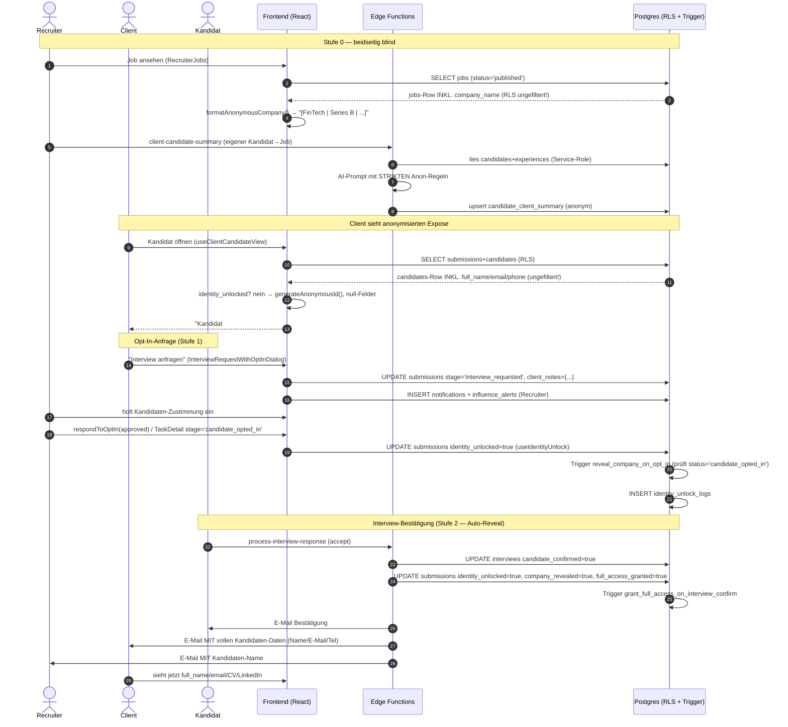
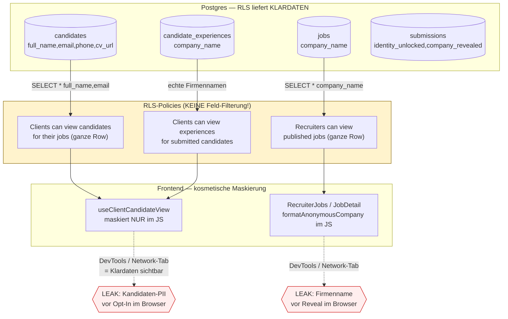

## 03. Triple-Blind Anonymisierung

> Kern-USP der Plattform. Diese Sektion reverse-engineert den Triple-Blind-Mechanismus end-to-end aus dem Quellcode (Stand: Branch `main`, ~81 Edge Functions / 93 Migrationen). **Quellcode = Wahrheit**, nicht das Marketing.

### 0. Executive Summary (TL;DR)

Der "Triple-Blind" ist **konzeptionell drei-seitig**, aber **technisch nur kosmetisch** umgesetzt:

1. **Kandidat ↔ Client** (Identität des Kandidaten vor dem Unternehmen verborgen) — gesteuert über `submissions.identity_unlocked`.
2. **Client ↔ Recruiter** (Firmenname vor dem Recruiter verborgen) — gesteuert über `submissions.company_revealed` / `full_access_granted` (2-Stufen-Reveal).
3. **Recruiter ↔ Kandidat** — existiert NICHT als Blind: der Recruiter *besitzt* den Kandidaten (`candidates.recruiter_id = auth.uid()`) und sieht alle Klardaten. Der "dritte Blind" im Marketing ist faktisch der Client→Recruiter-Firmenblind.

**Die entscheidende Erkenntnis:** Die Anonymisierung passiert fast ausschließlich **client-seitig im Browser** (`src/lib/anonymization.ts`, `useClientCandidateView.ts`) bzw. **im AI-Prompt** (`client-candidate-summary`, `format-job-for-recruiters`). Die zugrundeliegende **RLS liefert die Klardaten (`full_name`, `email`, `phone`, `company_name`) ungefiltert an den Browser aus**. Jeder mit DevTools / Network-Tab sieht die "verborgenen" Daten sofort. Der Blind ist eine UI-Konvention, keine Sicherheitsgrenze.

---

### 1. Datenmodell & Reveal-Flags

Alle Reveal-Zustände hängen an der `submissions`-Tabelle. Es existieren **zwei parallele, teils redundante Flag-Familien** (historisch gewachsen):

| Spalte | Tabelle | Richtung | Gesetzt von | Bedeutung |
|---|---|---|---|---|
| `identity_unlocked` | `submissions` | Kandidat→Client | `useIdentityUnlock.respondToOptIn/adminOverride`, `process-interview-response` | Klar­name/Kontakt des Kandidaten für Client sichtbar |
| `identity_unlocked_at` | `submissions` | — | `process-interview-response:147` | Zeitstempel (Achtung: Migration nennt die Spalte `unlocked_at`) |
| `unlocked_at` / `unlocked_by` | `submissions` | — | `useIdentityUnlock.ts:83-84` | Audit: wann/von wem entsperrt |
| `identity_revealed` / `revealed_at` | `submissions` | Kandidat→Client (Legacy) | `process-talent-hub-action:136` (`confirm_opt_in`) | **Zweites, paralleles** Reveal-Flag (Migration `20260113233137`) |
| `opt_in_requested_at` | `submissions` | Client→Recruiter | `useIdentityUnlock.requestOptIn` | Client hat Opt-In angefragt |
| `opt_in_response` | `submissions` | — | `useIdentityUnlock` (`pending`/`approved`/`denied`/`admin_override`) | Antwortstatus |
| `consent_confirmed` / `consent_document_url` / `consent_confirmed_at` | `submissions` | DSGVO | **Niemand** (vestigial, Migration `20251204191207`) | Geplante Consent-Doku — wird im Code **nie geschrieben** |
| `company_revealed` / `company_revealed_at` | `submissions` | Client→Recruiter | Trigger `reveal_company_on_opt_in`, `process-interview-response`, `schedule-interview` | Firmenname für Recruiter sichtbar (Stufe 1) |
| `full_access_granted` / `full_access_granted_at` | `submissions` | Client→Recruiter | Trigger `grant_full_access_on_interview_confirm`, `process-interview-response` | Voller Firmenzugriff (Stufe 2) |
| `interviews.pending_opt_in` | `interviews` | — | `process-talent-hub-action`, `process-interview-response` | Interview wartet auf Kandidaten-Opt-In |
| `interviews.candidate_confirmed` | `interviews` | Trigger-Input | `schedule-interview`, `process-interview-response` | Triggert Stufe-2-Reveal |

Audit: Tabelle `identity_unlock_logs` (Migration `20251204191207`) protokolliert `opt_in_requested`, `opt_in_approved/denied`, `admin_override` via `useIdentityUnlock.logUnlockAction`.

Migrationen:
- `supabase/migrations/20251204191207_17d644bc...sql` — `consent_*`, `identity_unlocked`, `unlocked_*`, `opt_in_*`, `identity_unlock_logs`
- `supabase/migrations/20260113233137_c0347133...sql` — `identity_revealed`/`revealed_at`, `interviews.pending_opt_in`, RLS „Clients can view revealed submissions"
- `supabase/migrations/20260122110726_906435bc...sql` — 2-Stufen-Reveal (`company_revealed`, `full_access_granted`) + Trigger + `jobs.company_size_band/funding_stage/hiring_urgency/tech_environment`

---

### 2. Was ist für wen, in welcher Phase, maskiert?

#### 2a. Kandidaten-Daten vor dem CLIENT

Zentrale Anwendung der Regeln: `src/hooks/useClientCandidateView.ts` (laut Kommentar „die EINZIGE Quelle für Kandidatendaten in Client-Ansichten" — de facto aber nicht, s.u. Reibungspunkte).

| Feld | Vor Reveal (`identity_unlocked=false`) | Nach Reveal | Maskierung in |
|---|---|---|---|
| Name | `Kandidat #<8 Hex>` (`generateAnonymousId`) | `full_name` | `useClientCandidateView.ts:376` |
| E-Mail / Telefon | `null` | Klartext | `useClientCandidateView.ts:441-442` |
| CV-URL / LinkedIn | `null` | Klartext | `useClientCandidateView.ts:443-444` |
| Stadt → Region | `anonymizeRegionBroad(city)` z.B. „Süddeutschland" | `city` | `anonymization.ts:8`, `useClientCandidateView.ts:393` |
| Erfahrung (Jahre) | Range `anonymizeExperience` z.B. „6-10 Jahre" | exakte Jahre | `anonymization.ts:78` |
| Gehalt | 10k-Range `anonymizeSalary` z.B. „€60k - €70k" | (bleibt Range) | `anonymization.ts:87` |
| Skills | **immer sichtbar** | immer | — |
| Zertifikate/Sprachen/Branchen/Zielrollen | immer sichtbar | immer | `useClientCandidateView.ts:402-408` |
| Arbeitgeber-Historie (Firmennamen) | nur via AI-Summary anonymisiert (Branche statt Name) | echte `company_name` (RLS offen!) | `client-candidate-summary:306-313` |

**Achtung:** Skills, Zertifikate, Branchenerfahrung und Zielrollen werden **vor** dem Reveal vollständig gezeigt — bei seltenen Skill-Kombinationen (z.B. „COBOL + Rust + 15 Jahre, Region Ostdeutschland") ist Re-Identifikation trivial. Der Blind schützt den *Namen*, nicht zwingend die *Identität*.

#### 2b. Client-/Firmen-Daten vor dem RECRUITER (2-Stufen-Reveal)

| Phase | Trigger | `company_revealed` | `full_access_granted` | Recruiter sieht |
|---|---|---|---|---|
| Stufe 0 (default) | Job published | `false` | `false` | `formatAnonymousCompany(...)` z.B. `[FinTech \| 200–500 MA \| Series B \| React/Node \| Hybrid München]` |
| Stufe 1 | Status→`candidate_opted_in` (Trigger `reveal_company_on_opt_in`) | `true` | `false` | `company_name` (Klartext) + Pitch |
| Stufe 2 | Interview bestätigt (`interviews.candidate_confirmed=true`, Trigger `grant_full_access_on_interview_confirm`) | `true` | `true` | „Voller Zugriff" (`CompanyRevealBadge`) |

Maskierung: `src/lib/anonymousCompanyFormat.ts` (`formatAnonymousCompany`, `getDisplayCompanyName`), UI `src/components/recruiter/CompanyRevealBadge.tsx`, `AnonymousCompanyPitch.tsx`.
Anwendung in: `src/pages/recruiter/RecruiterJobs.tsx:551,778`, `src/pages/recruiter/JobDetail.tsx:346`, `src/pages/recruiter/SubmissionDetail.tsx:336`.

Die kontextreiche anonyme Firmenbeschreibung wird zusätzlich AI-generiert in `format-job-for-recruiters` (Feld `formatted_content.anonymous_company_pitch`) und in `jobs.formatted_content` persistiert.

#### 2c. Was sieht der ADMIN

Voller Zugriff über `has_role(auth.uid(),'admin')`-Policies auf allen Tabellen (`candidates`, `submissions`, Storage). `src/pages/admin/AdminCandidates.tsx` zeigt `full_name`, `email`, `phone`, Duplikat-Erkennung per E-Mail, und kann via `useIdentityUnlock.adminOverride` jede Identität manuell entsperren (Audit in `identity_unlock_logs`).

---

### 3. Die drei Schlüssel-Edge-Functions

| Function | Aufruf von | Liest | Schreibt | Anonymisierung |
|---|---|---|---|---|
| `client-candidate-summary` | `useClientCandidateSummary.generateSummary` (`:145`), `useExposeData` (`:168`) | `candidates`, `candidate_experiences`, `candidate_interview_notes`, `candidate_ai_assessment`, `candidate_behavior`, `submissions→jobs` (Service-Role!) | `candidate_client_summary` (upsert) | **Kern der Anonymisierung**: strenge System-Prompt-Regeln (`index.ts:213-267`) — kein Name, kein „er/sie", kein Arbeitgeber-Name, keine Stadt; Firmen→Branchen-Hint (`:306-313`); Region nur „angegeben/nicht angegeben" (`:291`). Smart-Caching via `generated_at` vs. `updated_at` (`:181-201`). |
| `candidate-retrieval` | (kein direkter Frontend-Invoke gefunden — Backend/Matching-intern) | `candidates` (volle PII inkl. `email`, `address_lat/lng`), `jobs.embedding`, RPC `search_candidates_hybrid` | — | **KEINE** — liefert `fullName`, `email`-Selektion roh zurück (`RetrievalResult.fullName`, `:267`). Reines internes Retrieval/Ranking; Output ist *nicht* für Clients gedacht, enthält aber Klardaten. |
| `candidate-summary` | **kein Caller im Frontend** (orphaned/legacy) | erhält `candidate`+`job` im Body | — | **KEINE Anonymisierung**: Prompt verwendet `candidate.full_name`, `candidate.email`, `current_salary` direkt (`index.ts:34-37`). Würde, falls jemals von Client-Pfad genutzt, PII an die AI leaken. |

> **Wichtig:** Trotz ähnlicher Namen ist **`candidate-summary` ≠ `client-candidate-summary`**. Ersteres ist ein anonymisierungs­freier Legacy-Wrapper (keine Referenzen im `src/`-Tree), letzteres die produktive, streng anonymisierte Client-Summary. Score-Generierung wurde bewusst entfernt (`model_version: "v4-no-score"`), V3.1-Match-Engine ist „single source of truth".

---

### 4. Datenfluss: Reveal-Sequenz (end-to-end)

---

### 5. Wo bricht / leakt der Blind? (Datenfluss-Architektur)

---

### 6. Reibungspunkte & Risiken (im Code verifiziert)

#### 6.1 KRITISCH — Client→Kandidat: RLS liefert volle PII, Blind nur im Browser
`supabase/migrations/20251212165255_...sql:2` (`"Clients can view candidates for their jobs"`) gewährt dem Client `SELECT` auf die **gesamte `candidates`-Row** (inkl. `full_name`, `email`, `phone`, `cv_url`, `linkedin_url`), **sobald eine Submission existiert** — **ohne** `identity_unlocked`-Bedingung. `useClientCandidateView.ts`, `useExposeData.ts:60` und `ClientCandidates.tsx:75-88` selektieren `full_name`, `email`, `phone` explizit und nullen sie nur im JS. Folge: Der Klarname ist vor jedem Opt-In im Network-Response/React-State vorhanden. Der Marketing-Claim „Unternehmen sehen keine Daten, bevor der Kandidat es erlaubt" (`FeaturesSection.tsx:19`) ist **technisch falsch**.

#### 6.2 KRITISCH — Recruiter→Client: `company_name` wird ungefiltert ausgeliefert
`supabase/migrations/20251204171610_...sql:194` (`"Recruiters can view published jobs" … USING (has_role('recruiter') AND status='published')`) liefert die **ganze `jobs`-Row inkl. `company_name`** an jeden Recruiter. `RecruiterJobs.tsx:66` und `JobDetail.tsx:60,346` laden `company_name` in den Client und maskieren nur via `formatAnonymousCompany`. Claim „Recruiter sehen keine Unternehmen" ist client-seitig erzwungen → per DevTools umgehbar.

#### 6.3 HOCH — `candidate_experiences` leakt echte Arbeitgebernamen an Client
`supabase/migrations/20260305002156_...sql` + `20260305100000_...sql` erlauben Clients `SELECT` auf `candidate_experiences` (enthält echte `company_name`, z.B. „Siemens", „TechCorp GmbH"). Während `client-candidate-summary` die Firmen sorgfältig zu Branchen-Hints anonymisiert (`:306-313`), umgeht jede Komponente, die `candidate_experiences` direkt liest (z.B. `CandidateExperienceTimeline`), diese Anonymisierung komplett. Arbeitgeber-Historie ist ein starker Re-Identifikations-Vektor.

#### 6.4 HOCH — Stufe-1-Trigger feuert vermutlich nie (Status- vs. Stage-Verwechslung)
Trigger `reveal_company_on_opt_in` (`20260122110726_...sql:24`) prüft `NEW.status = 'candidate_opted_in'`. **Alle** Frontend-Pfade setzen jedoch `stage = 'candidate_opted_in'` (`TaskDetailDialog.tsx:855`, `SubmissionDetailDialog.tsx:251`, `SubmissionDetail.tsx:270`, `CandidateTasksSection.tsx:378`) und lassen `status` unberührt. Damit wird `company_revealed` über den normalen Opt-In-Pfad **nicht** durch den Trigger gesetzt — die Firma wird de facto erst in Stufe 2 (Interview-Confirm) bzw. via direktem Write in `process-interview-response`/`schedule-interview` enthüllt. Das beworbene „Firma nach Opt-In" greift im Standardfluss nicht.

#### 6.5 HOCH — Zwei parallele, inkonsistente Reveal-Flag-Systeme
`identity_unlocked` (neu, `useIdentityUnlock`, `process-interview-response`, `useClientCandidateView`) vs. `identity_revealed` (alt, `process-talent-hub-action:136`, RLS `"Clients can view revealed submissions"` in `20260113233137`). `process-talent-hub-action` (`confirm_opt_in`) setzt **nur** `identity_revealed=true`, **nicht** `identity_unlocked`. Da `useClientCandidateView` ausschließlich `identity_unlocked` auswertet, kann ein über den Talent-Hub-Pfad „enthüllter" Kandidat im Client-Expose **trotzdem anonym** bleiben (oder umgekehrt via der `identity_revealed`-RLS sichtbar werden) → widersprüchlicher Zustand.

#### 6.6 MITTEL — Spaltennamen-Drift `identity_unlocked_at` vs. `unlocked_at`
`process-interview-response:147` schreibt `identity_unlocked_at`; die Migration `20251204191207` definiert aber `unlocked_at`. Sofern `identity_unlocked_at` nicht durch eine spätere Migration ergänzt wurde, schlägt dieser UPDATE-Teil fehl bzw. der Zeitstempel landet in einer anderen Spalte als `useIdentityUnlock.ts:83` (`unlocked_at`). Audit-Zeitpunkte sind dadurch unzuverlässig.

#### 6.7 MITTEL — DSGVO-Consent-Felder sind tot (Compliance-Lücke)
`consent_confirmed`, `consent_document_url`, `consent_confirmed_at` (`20251204191207`) werden **nirgends geschrieben**. Der UI-Flow (`InterviewRequestWithOptInDialog`) zeigt eine DSGVO-Checkbox („Kandidat muss aktiv zustimmen"), aber die Zustimmung des **Kandidaten** wird nicht als Dokument/Flag persistiert — `respondToOptIn` setzt `identity_unlocked=true`, getriggert vom **Recruiter** (`unlocked_by = recruiter`), nicht durch eine nachweisbare Kandidaten-Einwilligung. Für eine DSGVO-Argumentation (Art. 6/7) fehlt der Consent-Record.

#### 6.8 MITTEL — `candidate-retrieval` gibt Klar-Namen/PII zurück
`candidate-retrieval/index.ts` selektiert `full_name`, `email`, `address_lat/lng` (`:119-135`) und gibt `fullName` im Result zurück (`:267`). Solange das nur Matching-intern (Service-Role) genutzt wird, ist es ok; wird der Output aber je an eine Client-Oberfläche durchgereicht, ist es ein PII-Leak ohne jede Anonymisierungsschicht.

#### 6.9 NIEDRIG — Orphaned `candidate-summary` ohne Anonymisierung
`candidate-summary/index.ts` (kein Frontend-Caller) baut den Prompt mit `full_name`/`email`/`current_salary`. Totes Risiko heute, aber eine Fußangel: ein versehentlicher Aufruf aus Client-Kontext würde PII an die LLM-Gateway senden. Kandidat zum Löschen.

#### 6.10 NIEDRIG — CV-URL wird Client gezeigt, Download aber per Storage-RLS blockiert
`useClientCandidateView.ts:443` setzt `cvUrl` nach Reveal. Der `documents`-Bucket ist privat (`20251204193757:66`), SELECT nur für Eigentümer-Ordner (`auth.uid()`) oder Admin — Clients haben **keine** Storage-Policy für fremde CVs. Ein angezeigter CV-Link führt für den Client also zu 403, sofern nicht über signierte URLs ausgeliefert. UX-Inkonsistenz (Link sichtbar, nicht abrufbar).

---

### 7. Vernetzungen (wichtigste Kanten dieser Domäne)

| Von | Nach | Mechanismus | Bemerkung |
|---|---|---|---|
| `useClientCandidateView.ts` | `submissions`+`candidates`+`candidate_client_summary`+`deal_health` | Supabase SELECT (RLS) | Zentrale Client-Ansicht; maskiert client-seitig anhand `identity_unlocked` |
| `useClientCandidateSummary.ts:145` / `useExposeData.ts:168` | `client-candidate-summary` (EF) | `functions.invoke` | Generiert anonyme AI-Summary → `candidate_client_summary` |
| `client-candidate-summary` | `candidate_client_summary` | upsert (Service-Role) | Persistiert anonymisierte Insights; RLS `20260118223953` öffnet sie für Client |
| `InterviewRequestWithOptInDialog.tsx` | `submissions`+`notifications`+`influence_alerts` | UPDATE/INSERT | Startet Opt-In (Stufe 1), setzt `stage='interview_requested'` |
| `useIdentityUnlock.respondToOptIn` | `submissions.identity_unlocked`+`identity_unlock_logs` | UPDATE/INSERT | Manueller Reveal durch Recruiter |
| `process-interview-response` (EF) | `submissions`(alle Reveal-Flags)+`interviews`+`resend` | UPDATE + E-Mail | Auto-Reveal Stufe 2 bei Interview-Accept; Mailt volle PII an Client |
| `interviews.candidate_confirmed` | `submissions.full_access_granted` | DB-Trigger `grant_full_access_on_interview_confirm` | Stufe-2-Automatik |
| `submissions.status='candidate_opted_in'` | `submissions.company_revealed` | DB-Trigger `reveal_company_on_opt_in` | **greift praktisch nicht** (Code setzt `stage`, nicht `status`) |
| `format-job-for-recruiters` (EF) | `jobs.formatted_content` | AI + UPDATE | Erzeugt anonymen Company-Pitch für Recruiter |
| `RecruiterJobs.tsx`/`JobDetail.tsx` | `jobs.company_name` | SELECT (RLS offen) + `formatAnonymousCompany` | Firmenblind client-seitig |
| `process-talent-hub-action:136` | `submissions.identity_revealed` | UPDATE | Paralleler Legacy-Reveal-Pfad (inkonsistent zu `identity_unlocked`) |

---

### 8. Phasen-Matrix (verdichtet)

| Phase / `submissions`-Zustand | Recruiter sieht Client | Client sieht Kandidat | Auslöser |
|---|---|---|---|
| `submitted` (default) | anonym (`[Branche \| Größe \| Stack]`) | anonym (`Kandidat #XXXX`, Region, Skills) | — |
| `interview_requested` | anonym | anonym (+ "Anfrage gesendet") | Client klickt „Interview anfragen" |
| `candidate_opted_in` (stage) | *sollte* Firma sehen — Trigger greift aber nicht zuverlässig | anonym, bis `identity_unlocked` | Recruiter setzt Stage nach Kandidaten-OK |
| `identity_unlocked=true` | (unverändert) | **Klarname, E-Mail, Tel, LinkedIn** | `respondToOptIn(approved)` / `adminOverride` |
| Interview bestätigt (`full_access_granted=true`) | **Firmenname + voller Zugriff** | Klarname | `process-interview-response` / `schedule-interview` (Trigger) |
| `admin_override` | n/a | Klarname (forciert) | Admin via `AdminCandidates` |

---

### 9. Empfehlungen (Kurz)

1. **RLS-Härtung Kandidat:** Spaltenbasierte Absicherung über eine `SECURITY INVOKER`-View (analog `client_submissions_view`), die `full_name`/`email`/`phone`/`cv_url` per `CASE WHEN s.identity_unlocked THEN … ELSE NULL`-Logik liefert; Client-Code nur noch gegen diese View; direkten `SELECT` auf `candidates` für die Client-Rolle entziehen. Gleiches für `candidate_experiences.company_name`.
2. **RLS-Härtung Firma:** Eigene Recruiter-Job-View ohne `company_name` (bzw. `company_name` nur wenn eine `company_revealed`-Submission des Recruiters existiert).
3. **Reveal-Flags konsolidieren:** `identity_revealed` → auf `identity_unlocked` migrieren (oder umgekehrt) und einen einzigen Reveal-Pfad etablieren.
4. **Trigger-Bug fixen:** `reveal_company_on_opt_in` auf `NEW.stage` statt `NEW.status` umstellen (oder Schreibpfade auf `status` vereinheitlichen).
5. **Consent persistieren:** Kandidaten-Einwilligung als eigener Datensatz/Dokument (`consent_*`) schreiben, ausgelöst durch die *Kandidaten*-Aktion, nicht den Recruiter.
6. **Tote Function entfernen:** `candidate-summary` löschen.

---

*Schlüsseldateien:* `src/lib/anonymization.ts`, `src/lib/anonymousCompanyFormat.ts`, `src/hooks/useClientCandidateView.ts`, `src/hooks/useIdentityUnlock.ts`, `src/hooks/useClientCandidateSummary.ts`, `src/hooks/useExposeData.ts`, `src/components/candidates/AnonymizedCandidateCard.tsx`, `src/components/expose/CandidateExpose.tsx`, `src/components/recruiter/CompanyRevealBadge.tsx`, `src/components/dialogs/InterviewRequestWithOptInDialog.tsx`, `src/pages/recruiter/{RecruiterJobs,JobDetail,SubmissionDetail}.tsx`, `src/pages/dashboard/ClientCandidates.tsx`, `src/pages/admin/AdminCandidates.tsx`, `supabase/functions/{client-candidate-summary,candidate-summary,candidate-retrieval,format-job-for-recruiters,process-interview-response,process-talent-hub-action}/index.ts`, Migrationen `20251204171610`, `20251204191207`, `20251212165255`, `20260113233137`, `20260118223953`, `20260122110726`, `20260305002156`, `20260305100000`.
