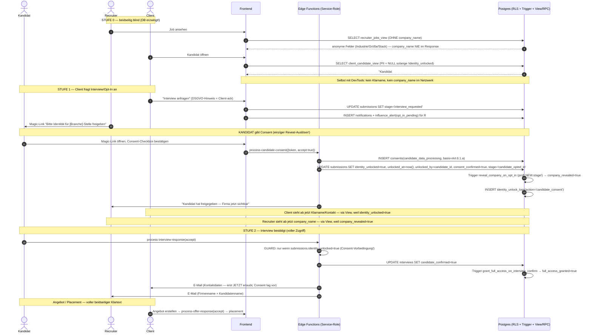

## 3b. Triple-Blind perfektionieren (Soll-Zustand & Plan)

> Aufbauend auf `03-triple-blind.md` (Ist-Zustand). Ziel: **null Reibung, beide Seiten (Kandidat & Client) zufrieden, Blind als echte Sicherheitsgrenze** — nicht nur als UI-Konvention. Quellcode = Wahrheit (Branch `main`, ~81 Edge Functions / 93+ Migrationen). Jede Aussage unten ist gegen den realen Code verifiziert.
>
> **Leitprinzip (eine Zeile):** *Der Blind muss in der Datenbank durchgesetzt werden (RLS/View/RPC), das Frontend darf nur noch anzeigen, was es ohnehin schon sehen darf.* Heute ist es umgekehrt — RLS liefert Klardaten, der Browser tut so, als wären sie verborgen.

---

### 0. Drei Wahrheiten, die der Soll-Zustand fixen muss

1. **Der Blind ist heute kosmetisch.** RLS liefert `full_name`, `email`, `phone`, `company_name`, Arbeitgeber-Historie ungefiltert in den Browser; maskiert wird nur im JS (`useClientCandidateView.ts`, `anonymousCompanyFormat.ts`). Per DevTools/Network-Tab sind alle "verborgenen" Daten vor jedem Opt-In sichtbar.
2. **Die Reveal-Leiter ist inkonsistent.** Zwei parallele Flag-Familien (`identity_unlocked` vs. `identity_revealed`), ein Stufe-1-Trigger der nie feuert (`status` vs. `stage`), ein Spaltenname-Drift (`identity_unlocked_at` vs. `unlocked_at`), und Auto-Reveal hängt an der Interview-Annahme statt am Kandidaten-Consent.
3. **DSGVO-Nachweis fehlt.** Die `consent_*`-Felder werden nirgends geschrieben; die "Zustimmung" wird vom **Recruiter** ausgelöst (`unlocked_by = recruiter`), nicht vom Kandidaten. Für Art. 6/7 DSGVO fehlt der Nachweis-Record.

Der gesamte Plan zielt darauf, diese drei Wahrheiten umzukehren.

---

### 1. SICHTBARKEITS-MATRIX (Soll-Zustand, feldgenau)

Legende: **✅ Klartext** · **🟡 anonymisiert/Range** · **⛔ NULL/verborgen** · **n/a nicht zutreffend**. "Soll" = Zielzustand nach Umsetzung; Abweichungen vom heutigen Ist sind in Klammern markiert (*heute geleakt* = wird aktuell ungefiltert ausgeliefert).

#### 1a. Kandidaten-Daten — wer sieht was?

| Feld | Phase | Kandidat (Self) | Recruiter (Owner) | Client | Admin |
|---|---|---|---|---|---|
| **Name** (`full_name`) | Lead/Talentpool | ✅ | ✅ | n/a (kein Client-Bezug) | ✅ |
| | Einreichung (`submitted`) | ✅ | ✅ | ⛔ `Kandidat #A1B2C3D4` *(heute geleakt)* | ✅ |
| | Interview angefragt | ✅ | ✅ | ⛔ | ✅ |
| | **Identity unlocked** (Consent) | ✅ | ✅ | ✅ | ✅ |
| | Angebot / Placement | ✅ | ✅ | ✅ | ✅ |
| **E-Mail / Telefon** | bis Reveal | ✅ | ✅ | ⛔ *(heute geleakt)* | ✅ |
| | nach Reveal | ✅ | ✅ | ✅ | ✅ |
| **CV-URL / LinkedIn** | bis Reveal | ✅ | ✅ | ⛔ *(heute geleakt)* | ✅ |
| | nach Reveal | ✅ | ✅ | ✅ (signierte URL, s. 3.10) | ✅ |
| **Aktueller Arbeitgeber** (`candidate_experiences.company_name`) | bis Reveal | ✅ | ✅ | 🟡 Branchen-Hint (`Finanzsektor`) *(heute geleakt: echte Namen wie „Siemens")* | ✅ |
| | nach Reveal | ✅ | ✅ | ✅ | ✅ |
| **Gehalt** (`expected_salary`) | bis Reveal | ✅ | ✅ | 🟡 10k-Range (`€60k–€70k`) | ✅ |
| | nach Reveal | ✅ | ✅ | 🟡 Range (bewusst grob) | ✅ |
| **Stadt / Region** | bis Reveal | ✅ | ✅ | 🟡 Region (`Süddeutschland`) | ✅ |
| | nach Reveal | ✅ | ✅ | ✅ Stadt | ✅ |
| **Erfahrung (Jahre)** | bis Reveal | ✅ | ✅ | 🟡 Range (`6–10 Jahre`) | ✅ |
| | nach Reveal | ✅ | ✅ | ✅ exakt | ✅ |
| **Skills / Zertifikate / Sprachen** | alle Phasen | ✅ | ✅ | ✅ *(bewusst sichtbar — Achtung Re-ID, s. 3.4)* | ✅ |

> **Re-Identifikations-Hinweis (3.4):** Skills+Zertifikate+Branche+Zielrolle sind vor Reveal voll sichtbar. Bei seltenen Kombinationen (`COBOL + Rust + 15 J + Ostdeutschland`) ist der Name irrelevant — die Person ist trivial identifizierbar. Soll: optionaler „Rare-Skill-Coarsening"-Modus (s. 3.4).

#### 1b. Firmen-Daten — wer sieht was? (Client→Recruiter-Blind)

| Feld | Phase / Reveal-Stufe | Recruiter | Kandidat | Client (Owner) | Admin |
|---|---|---|---|---|---|
| **Firmenname** (`jobs.company_name`) | Stufe 0 (published) | ⛔ `[FinTech \| 200–500 MA \| Series B \| React/Node \| Hybrid München]` *(heute geleakt)* | ⛔ (sieht nur anonymen Pitch im Outreach) | ✅ | ✅ |
| | Stufe 1 (Kandidat Opt-In) | ✅ Klartext + Pitch | ⛔ | ✅ | ✅ |
| | Stufe 2 (Interview bestätigt) | ✅ „voller Zugriff" | n/a | ✅ | ✅ |
| **Firmen-Logo** | Stufe 0 | ⛔ (Platzhalter/Branchen-Icon) *(prüfen: Logo-Feld?)* | ⛔ | ✅ | ✅ |
| | Stufe 1+ | ✅ | n/a | ✅ | ✅ |
| **Industrie / Größe / Funding / Tech-Stack** | alle | 🟡 immer (das ist der anonyme Pitch) | ⛔ | ✅ | ✅ |
| **Standort (Stadt)** | Stufe 0 | 🟡 Stadt ok (Teil des Pitch) | ⛔ | ✅ | ✅ |
| **Gehaltsband der Stelle** | alle | ✅ (Recruiter braucht es zum Sourcen) | ⛔ | ✅ | ✅ |
| **Klartext-Pitch / `formatted_content`** | alle | 🟡 anonym (LLM-generiert, muss firmennamen-frei sein, s. 3.11) | ⛔ | ✅ | ✅ |

#### 1c. Der „dritte Blind" — Klarstellung

Der Recruiter ist **nicht** gegenüber seinem eigenen Kandidaten geblindet (`candidates.recruiter_id = auth.uid()` → Owner sieht alles). Der dritte Blind im Marketing **ist faktisch der Client→Recruiter-Firmenblind**. Soll-Zustand dokumentiert das ehrlich; alternativ wäre ein echter dritter Blind „Recruiter A sieht Kandidaten von Recruiter B nicht" — das ist heute bereits über `recruiter_id`-RLS erfüllt und sollte so benannt werden.

---

### 2. REVEAL-LEITER (Soll-Unblind-Logik)

**Kernänderung gegenüber heute:** Der Reveal an den Client wird **an den nachweisbaren Consent des Kandidaten** gekoppelt (nicht an die Interview-Annahme, nicht an eine Recruiter-Aktion). Ein einziges Flag (`identity_unlocked`), ein einziger Codepfad, persistierter Consent-Record. Firmen-Reveal Stufe 1 wird durch das gleiche Consent-Event ausgelöst (`stage`-basiert).

**Entscheidende Soll-Regeln der Leiter:**
- **R0 — Einziges Reveal-Flag:** `identity_unlocked`. `identity_revealed` wird per Migration auf `identity_unlocked` zusammengeführt und als deprecated markiert.
- **R1 — Consent ist der einzige Auslöser für Client-Reveal.** Weder Recruiter-Klick noch Interview-Annahme dürfen den Client-Reveal *ohne* persistierten Kandidaten-Consent auslösen.
- **R2 — Firmen-Reveal Stufe 1 = gleiches Consent-Event** (`stage='candidate_opted_in'`), Trigger wird auf `NEW.stage` umgestellt.
- **R3 — Stufe-2 (full access) ist gegated:** `process-interview-response` darf nur revealen, wenn `identity_unlocked` bereits true ist (Consent-Vorbedingung), sonst 409/Hinweis.
- **R4 — Admin-Override bleibt,** aber loggt `action='admin_override'` und schreibt einen Pseudo-Consent-Record mit `basis='admin_override'` für Audit.

---

### 3. REIBUNGS-REGISTER (jeder Bruch + konkrete Lösung)

Jeder Punkt: **Wo** (Datei:Zeile / Migration) · **Was bricht** · **Lösung** (DB/RLS / Edge / Frontend) · **Severity**.

#### 3.1 — KRITISCH · Client→Kandidat: RLS liefert volle PII
- **Wo:** `supabase/migrations/20251212165255_d8ec3a1f...sql:2` — Policy *"Clients can view candidates for their jobs"* gewährt `SELECT` auf die **ganze `candidates`-Row** sobald eine Submission existiert, **ohne** `identity_unlocked`-Bedingung. Geleakt nach `useClientCandidateView.ts:201-225` und `ClientCandidates.tsx`.
- **Lösung (DB):** `SECURITY INVOKER`-View `client_candidate_view` (Muster: bestehende `client_submissions_view`, `20260122221106`), die PII per `CASE WHEN s.identity_unlocked THEN c.full_name ELSE NULL END` liefert. Direkten `SELECT` auf `candidates` für die Client-Rolle entziehen — die heutige Policy ersetzen durch eine, die nur Nicht-PII-Spalten freigibt, *oder* (sauberer) Client-Zugriff komplett über die View routen und Policy droppen.
- **Lösung (Frontend):** `useClientCandidateView.ts` von `.from('submissions').select('candidates(...)')` auf `.from('client_candidate_view')` umstellen. Maskierungs-JS bleibt als Defense-in-Depth, ist aber nicht mehr die einzige Schicht.
- **Severity:** kritisch (USP-Bruch + DevTools-Leak).

#### 3.2 — KRITISCH · Recruiter→Client: `company_name` ungefiltert
- **Wo:** `20251204171610_...sql:194` — *"Recruiters can view published jobs"* `USING (has_role('recruiter') AND status='published')` liefert ganze `jobs`-Row inkl. `company_name`. Geleakt nach `RecruiterJobs.tsx:66`, `JobDetail.tsx:346`.
- **Lösung (DB):** `recruiter_jobs_view` (SECURITY INVOKER), die `company_name` nur ausgibt, wenn eine `company_revealed=true`-Submission **dieses** Recruiters für den Job existiert — sonst NULL. `company_logo` analog. Recruiter-`SELECT` auf `jobs.company_name` entziehen (Spalten-Whitelist-Policy oder View-only).
- **Lösung (Frontend):** `RecruiterJobs.tsx`, `JobDetail.tsx`, `SubmissionDetail.tsx` auf `recruiter_jobs_view` umstellen; `formatAnonymousCompany` bleibt für die anonymen Kontextfelder (Industrie/Größe), bekommt aber `company_name` schlicht nicht mehr geliefert solange nicht revealed.
- **Severity:** kritisch.

#### 3.3 — HOCH · `candidate_experiences` leakt echte Arbeitgebernamen
- **Wo:** `20260305100000_fix_candidate_experiences_rls_and_seed.sql:7-14` (+ `20260305002156`) — Clients dürfen `candidate_experiences` mit echten `company_name` lesen (Seed enthält „TechCorp GmbH", „FinTech Solutions Hamburg" …). Jede Komponente die direkt liest (`CandidateExperienceTimeline`) umgeht die Summary-Anonymisierung in `client-candidate-summary`.
- **Lösung (DB):** View `client_candidate_experiences_view` mit `CASE WHEN s.identity_unlocked THEN company_name ELSE industry_hint(company_name) END`. Eine deterministische `industry_hint()`-SQL-Funktion (Keyword-Map bank→Finanzsektor, auto→Automobil, …) statt LLM, damit es überall greift. Direkten Tabellenzugriff für Client-Rolle entziehen.
- **Severity:** hoch (starker Re-ID-Vektor).

#### 3.4 — HOCH · Re-Identifikation trotz Namens-Blind
- **Wo:** `useClientCandidateView.ts:399-408` — Skills, Zertifikate, Branchen, Zielrollen werden vor Reveal **vollständig** gezeigt.
- **Lösung (DB/Edge):** In `client_candidate_view` einen `k_anonymity`-Check: wenn die Skill-/Erfahrungs-Kombination unter einem Schwellwert eindeutig ist, gröbere Darstellung (Skill-Cluster statt Einzel-Skills, Erfahrungs-Range). Pragmatisch v1: Skills auf Top-N + Kategorie kürzen, seltene Zertifikate (z.B. namentliche) ausblenden bis Reveal.
- **Lösung (Frontend):** Hinweis-Badge „Profil bewusst gröber bis Freigabe".
- **Severity:** hoch (Blind-Versprechen vs. Realität).

#### 3.5 — HOCH · Stufe-1-Trigger feuert nie (status vs. stage)
- **Wo:** `20260122110726_...sql:24` — `reveal_company_on_opt_in()` prüft `NEW.status = 'candidate_opted_in'`. **Alle** Schreibpfade setzen aber `stage` (`InterviewRequestWithOptInDialog.tsx:161` setzt `stage`; `TaskDetailDialog.tsx:855`, `SubmissionDetailDialog.tsx:251`, `SubmissionDetail.tsx:270`, `CandidateTasksSection.tsx:378`). `company_revealed` wird im Normalfluss nie durch den Trigger gesetzt.
- **Lösung (DB):** Migration: Trigger-Funktion auf `NEW.stage = 'candidate_opted_in'` umstellen (Bedingung zusätzlich auf `OLD.stage IS DISTINCT FROM NEW.stage`). Mit pgTAP/Smoke-Test absichern.
- **Severity:** hoch (beworbenes „Firma nach Opt-In" wirkt nicht).

#### 3.6 — HOCH · Zwei parallele Reveal-Flags (`identity_unlocked` vs `identity_revealed`)
- **Wo:** `process-talent-hub-action/index.ts:136` setzt **nur** `identity_revealed=true`; `useClientCandidateView.ts:265` wertet **nur** `identity_unlocked` aus → über Talent-Hub „enthüllte" Kandidaten bleiben im Client-Expose anonym. RLS *"Clients can view revealed submissions"* (`20260113233137:16`) nutzt `identity_revealed`.
- **Lösung (DB + Edge):** Migration: `UPDATE submissions SET identity_unlocked = true WHERE identity_revealed = true` (Backfill), dann `process-talent-hub-action` auf `identity_unlocked` umstellen. `identity_revealed` als deprecated kommentieren, Generated-Column-Mirror oder in 2 Releases droppen. Alle Reveal-Schreibstellen in **einen** Helper `_shared/reveal.ts` ziehen.
- **Severity:** hoch (widersprüchlicher Zustand).

#### 3.7 — MITTEL · Spaltennamen-Drift `identity_unlocked_at` vs `unlocked_at`
- **Wo:** `process-interview-response/index.ts:147` schreibt `identity_unlocked_at`; Migration `20251204191207` definiert `unlocked_at`; `useIdentityUnlock.ts:83` nutzt `unlocked_at`.
- **Lösung (DB/Edge):** Auf **eine** Spalte vereinheitlichen (`unlocked_at`). `process-interview-response` korrigieren. Falls `identity_unlocked_at` durch keine Migration existiert, schlägt der Write heute teilweise fehl → in den `_shared/reveal.ts`-Helper konsolidieren.
- **Severity:** mittel (Audit-Zeitstempel unzuverlässig).

#### 3.8 — MITTEL · DSGVO-Consent wird nie geschrieben (Compliance-Lücke)
- **Wo:** `consent_confirmed`, `consent_document_url`, `consent_confirmed_at` (`20251204191207`) — **kein** Schreibzugriff im gesamten Code. Die DSGVO-Checkbox in `InterviewRequestWithOptInDialog.tsx:354` ist eine **Client**-Bestätigung („ich hole die Zustimmung ein"), nicht die Kandidaten-Einwilligung. `respondToOptIn` (`useIdentityUnlock.ts:82-84`) setzt `unlocked_by = user.id` (= Recruiter).
- **Lösung (Edge + DB):** Neue Function `process-candidate-consent` (Magic-Link-Token, `verify_jwt=false`): schreibt `consents`-Record (`consent_type='candidate_data_processing'`, `basis='Art.6.1.a'`), setzt `identity_unlocked`, `consent_confirmed`, `unlocked_by = candidate_id`, `stage='candidate_opted_in'` **atomar** in einer RPC. Kandidaten-Magic-Link aus `send-interview-invitation`/Opt-In-Flow generieren.
- **Lösung (Frontend):** Neue Kandidaten-Seite `CandidateConsentPage.tsx` (`/consent/:token`).
- **Severity:** mittel (rechtlicher Nachweis fehlt).

#### 3.9 — MITTEL · Reveal hängt an Interview-Annahme statt Consent
- **Wo:** `process-interview-response/index.ts:146-151` setzt bei `accept` **gleichzeitig** `identity_unlocked + company_revealed + full_access_granted` und mailt sofort Klarname/E-Mail/Telefon an den Client (`:235-237`). Der Consent-Schritt ist separat/optional.
- **Lösung (Edge):** GUARD einbauen — Stufe-2-Reveal nur wenn `identity_unlocked=true` (Consent lag vor). Sonst: Interview annehmen, aber Identität erst nach separatem Consent freigeben (Hinweis statt Klardaten-Mail).
- **Severity:** mittel (Blind kann ohne Kandidaten-Consent fallen).

#### 3.10 — NIEDRIG · CV-Link sichtbar, Download 403
- **Wo:** `useClientCandidateView.ts:443` setzt `cvUrl` nach Reveal; `documents`-Bucket privat (`20251204193757`), Client hat keine Storage-Policy.
- **Lösung (Edge):** Nach Reveal CV über kurzlebige signierte URL ausliefern (`createSignedUrl`, TTL 5 min) via kleine Function `get-candidate-cv-url` mit Reveal-Check, statt roher `cv_url`.
- **Severity:** niedrig (UX-Inkonsistenz).

#### 3.11 — MITTEL · Anonymisierung im AI-Output nur per Prompt erzwungen
- **Wo:** `client-candidate-summary/index.ts` (Anon-Regeln nur als System-Prompt, `industryHint` als JS-Keyword-Map `:99-101`) und `format-job-for-recruiters` (firmennamen-frei nur per Prompt). Ein LLM-Ausrutscher leakt den Namen.
- **Lösung (Edge):** Deterministischer **Post-Scrub** vor jedem Persist/Return: Regex über den Output, der `candidate.full_name` (alle Tokens) und `job.company_name` (inkl. Rechtsform-Varianten GmbH/AG/SE) entfernt/maskiert; bei Treffer regenerieren oder Feld blocken + Logging. In `_shared/scrub.ts` kapseln.
- **Severity:** mittel (Restrisiko am Kern-USP).

#### 3.12 — NIEDRIG · Orphan `candidate-summary` ohne Anonymisierung
- **Wo:** `candidate-summary/index.ts:34-37` baut Prompt mit `full_name`/`email`/`current_salary`; **kein** Frontend-Caller (grep bestätigt leer).
- **Lösung:** Function löschen + Eintrag aus `config.toml` entfernen. Eliminiert die Fußangel, dass ein versehentlicher Aufruf PII ans LLM-Gateway sendet.
- **Severity:** niedrig (totes Risiko).

#### 3.13 — NIEDRIG · `candidate-retrieval` gibt PII zurück
- **Wo:** `candidate-retrieval/index.ts:119-135,267` selektiert/returned `full_name`, `email`, `address_lat/lng`. Heute Matching-intern (Service-Role).
- **Lösung (Edge):** Output auf `candidateId` + Scores reduzieren; PII aus dem Rückgabeobjekt entfernen. Klar-Join erst nach Reveal serverseitig. Verhindert künftigen Leak, falls je an UI durchgereicht.
- **Severity:** niedrig (latent).

#### 3.14 — NIEDRIG · Direkter PII-Select in `ClientCandidates.tsx`
- **Wo:** `ClientCandidates.tsx` selektiert `full_name`/`email`/`cv_url` direkt (bestätigt per grep).
- **Lösung (Frontend):** Auf `client_candidate_view` (3.1) umstellen — keine direkte `candidates`-Query mehr aus Client-Code. Gilt als Teil des 3.1-Rollouts.
- **Severity:** niedrig (Teilmenge von 3.1).

---

### 4. UMSETZUNGSPLAN (priorisiert, mit Dateien/Funktionen)

> **Reihenfolge-Logik:** Erst die DB zur echten Sicherheitsgrenze machen (P0), dann die Reveal-Leiter konsistent und consent-getrieben (P1), dann Härtung/Compliance/UX (P2), dann Aufräumen (P3). **Achtung Deploy-Gap (siehe `01-architecture.md`):** Backend-Migrationen wirken sofort, das publizierte Frontend hängt hinterher — die Views müssen **abwärtskompatibel** sein (alte Frontend-Felder dürfen nicht hart brechen), und RLS-Verschärfung erst aktivieren, wenn der View-Lesepfad im Frontend live ist. Deshalb je Schritt „DB zuerst additiv, Policy-Entzug zuletzt".

#### P0 — Den Blind in die DB verlegen (Sicherheitsgrenze)

1. **Migration `…_client_candidate_view.sql`** — `SECURITY INVOKER`-View `client_candidate_view` (Vorbild `client_submissions_view`), PII via `CASE WHEN s.identity_unlocked`. `GRANT SELECT … TO authenticated`. *(behebt 3.1, 3.14)*
2. **Migration `…_client_candidate_experiences_view.sql`** + SQL-Funktion `industry_hint(text)`; View mit Branchen-Hint bis Reveal. *(behebt 3.3)*
3. **Migration `…_recruiter_jobs_view.sql`** — `company_name`/`company_logo` nur bei eigener `company_revealed`-Submission, sonst NULL. *(behebt 3.2)*
4. **Frontend-Umstellung (Lesepfad):** `src/hooks/useClientCandidateView.ts`, `src/pages/dashboard/ClientCandidates.tsx` → `client_candidate_view` + `client_candidate_experiences_view`; `src/pages/recruiter/{RecruiterJobs,JobDetail,SubmissionDetail}.tsx` → `recruiter_jobs_view`.
5. **Policy-Entzug (erst nach Frontend-Live):** Migration, die die Klardaten-Policies *"Clients can view candidates for their jobs"* und den `company_name`-Lesezugriff der Recruiter-Rolle ersetzt/entzieht. **Dieser Schritt ist der eigentliche Fix** — vorher ist es nur Defense-in-Depth.

#### P1 — Reveal-Leiter konsolidieren & consent-getrieben machen

6. **`_shared/reveal.ts`** (neuer Shared-Helper): kapselt **alle** Reveal-Writes (Flags + `unlocked_at` + Audit-Log) atomar. Konsumenten: `process-interview-response`, `process-talent-hub-action`, `schedule-interview`, `useIdentityUnlock` (via RPC). *(behebt 3.6, 3.7)*
7. **Migration Trigger-Fix:** `reveal_company_on_opt_in()` auf `NEW.stage = 'candidate_opted_in'` umstellen. *(behebt 3.5)*
8. **Migration Flag-Backfill:** `identity_unlocked := true WHERE identity_revealed`; `process-talent-hub-action/index.ts:136` auf `identity_unlocked` umstellen; `identity_revealed` deprecaten. *(behebt 3.6)*
9. **Edge `process-candidate-consent`** (neu, `verify_jwt=false`, Magic-Link-Token) + RPC `confirm_candidate_consent(token)`: schreibt `consents`-Record, setzt Flags, `unlocked_by=candidate_id`, `stage='candidate_opted_in'` atomar. **Frontend:** `src/pages/CandidateConsentPage.tsx` (`/consent/:token`), Magic-Link aus `send-interview-invitation`. *(behebt 3.8)*
10. **Guard in `process-interview-response/index.ts`:** Stufe-2-Reveal + Klardaten-Mail nur wenn `identity_unlocked=true`. *(behebt 3.9)*

#### P2 — Härtung, Compliance, UX

11. **`_shared/scrub.ts`** + Einbindung in `client-candidate-summary` und `format-job-for-recruiters`: deterministischer Regex-Scrub von `full_name`/`company_name` (inkl. Rechtsformen) vor Persist/Return; bei Treffer regenerieren/blocken + Log. *(behebt 3.11)*
12. **Edge `get-candidate-cv-url`** (Reveal-Check → `createSignedUrl`, TTL 5 min); `useClientCandidateView.ts:443` liefert signierte statt rohe URL. *(behebt 3.10)*
13. **k-Anonymity-Coarsening** in `client_candidate_view` / Hook: seltene Skill-/Zert-Kombis bis Reveal gröber. *(behebt 3.4)*

#### P3 — Aufräumen

14. **`candidate-summary` löschen** (Function + `config.toml`-Eintrag). *(behebt 3.12)*
15. **`candidate-retrieval/index.ts`** Output auf `candidateId`+Scores reduzieren. *(behebt 3.13)*
16. **Doku:** „dritter Blind" ehrlich benennen (Client→Recruiter-Firmenblind + Recruiter↔Recruiter-Isolation via `recruiter_id`); `FeaturesSection.tsx:19`-Claim erst nach P0 zutreffend.

#### Test-/Abnahme-Gate (gilt für P0+P1)

- **pgTAP/SQL-Test:** Als Client-Rolle `SELECT full_name FROM client_candidate_view` vor Reveal ⇒ NULL; nach `identity_unlocked` ⇒ Klartext. Als Recruiter `company_name` vor/nach `company_revealed`.
- **E2E:** DevTools/Network-Tab auf Client-Expose vor Opt-In ⇒ kein Klarname/`company_name` im Response (das ist das eigentliche Erfolgskriterium des „perfekten" Blind).
- **Consent-Audit:** Nach Kandidaten-Consent existiert ein `consents`-Record mit `unlocked_by=candidate_id`.

---

### 5. Soll-Phasen-Matrix (verdichtet, nach Umsetzung)

| `submissions`-Zustand | Recruiter sieht Firma | Client sieht Kandidat | Auslöser | DB-erzwungen? |
|---|---|---|---|---|
| `submitted` | anonym (`[Branche \| Größe \| Stack]`) | anonym (`Kandidat #XXXX`, Region, Ranges, Branchen-Hints) | — | ✅ View liefert NULL |
| `interview_requested` | anonym | anonym (+ „Anfrage gesendet") | Client klickt „Interview anfragen" | ✅ |
| `candidate_opted_in` (`stage`) | **Firmenname** (Stufe 1) | **Klarname, Kontakt** | **Kandidaten-Consent** (Magic-Link) → Trigger + Flag | ✅ Trigger auf `stage`, Consent-Record |
| Interview bestätigt (`full_access_granted`) | voller Zugriff (Stufe 2) | Klarname (unverändert) | `process-interview-response(accept)` **mit Consent-Guard** | ✅ Guard prüft `identity_unlocked` |
| `placed` | voll | voll | `process-offer-response(accept)` | ✅ |
| `admin_override` | n/a | Klarname (forciert) | Admin, Audit + Pseudo-Consent | ✅ geloggt |

---

*Schlüsseldateien für die Umsetzung:* `src/hooks/useClientCandidateView.ts`, `src/hooks/useIdentityUnlock.ts`, `src/lib/anonymization.ts`, `src/lib/anonymousCompanyFormat.ts`, `src/pages/dashboard/ClientCandidates.tsx`, `src/pages/recruiter/{RecruiterJobs,JobDetail,SubmissionDetail}.tsx`, `src/components/dialogs/InterviewRequestWithOptInDialog.tsx`, **neu:** `src/pages/CandidateConsentPage.tsx`; `supabase/functions/{process-interview-response,process-talent-hub-action,schedule-interview,client-candidate-summary,format-job-for-recruiters,candidate-retrieval}/index.ts`, **neu:** `supabase/functions/{process-candidate-consent,get-candidate-cv-url}/`, `supabase/functions/_shared/{reveal.ts,scrub.ts}`; Migrationen (neu): `client_candidate_view`, `client_candidate_experiences_view`, `recruiter_jobs_view`, Trigger-Fix `reveal_company_on_opt_in`, Flag-Backfill `identity_revealed→identity_unlocked`, Policy-Entzug Client/Recruiter. *Bestehende Referenz-Migrationen:* `20251204171610`, `20251204191207`, `20251212165255`, `20260113233137`, `20260118223953`, `20260122110726`, `20260122221106`, `20260305002156`, `20260305100000`.
