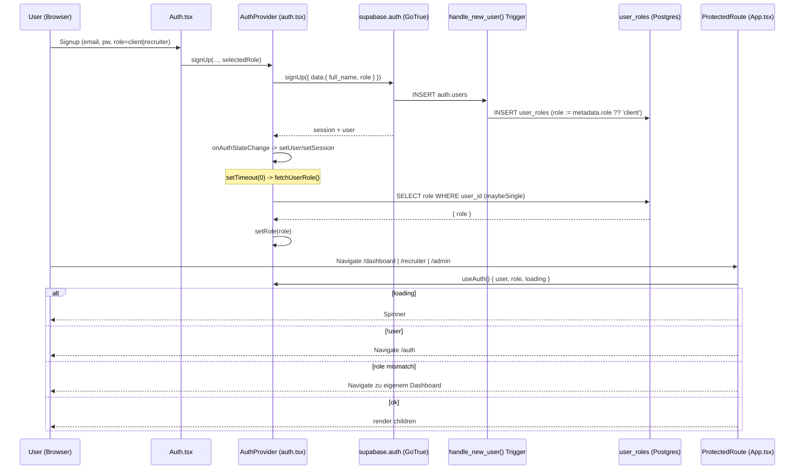

## 04. Auth, Rollen & Zugriffskontrolle

> Domänen-Tiefenanalyse. Quelle der Wahrheit ist der Code (Stand: Branch `main`).
> Zentrale Dateien: `src/lib/auth.tsx`, `src/App.tsx` (`ProtectedRoute`), die Migration
> `supabase/migrations/20251204171610_*.sql` (Auth-Fundament) sowie die Edge Functions
> `organization-invite`, `accept-invite`, `integration-api-key`.

### 4.1 Überblick & mentales Modell

Matchunt kennt **zwei voneinander unabhängige Rollenebenen**, die im Code oft verwechselt werden können, aber technisch getrennt sind:

| Ebene | Wo gespeichert | Werte | Steuert | Enforcement |
|-------|----------------|-------|---------|-------------|
| **Globale App-Rolle** (`app_role`) | `public.user_roles.role` | `client`, `recruiter`, `admin` | Routing (`/dashboard`, `/recruiter`, `/admin`), RLS-Sichtbarkeit auf Kern-Tabellen | RLS via `has_role()` + Frontend `ProtectedRoute` |
| **Organisations-Rolle** | `public.organization_members.role` | `owner`, `admin`, `hiring_manager`, `viewer`, `finance` | Team-Features, Feingranulare Permissions, Integrationen, Billing | RLS auf Org-Tabellen + **rein clientseitige** `usePermissions`-Checks |

> ⚠️ **Wichtig:** Die Org-Rolle `admin` ist **nicht** die System-Rolle `admin`. Ein Org-`admin` ist nur Administrator innerhalb *seiner* Organisation und hat keinerlei Zugriff auf `/admin/*` oder System-RLS-Privilegien.

Die drei Kern-Personas (`client`/`recruiter`/`admin`) entsprechen ausschließlich der App-Rolle. Sie ist das Rückgrat des Routings und der globalen RLS.

### 4.2 Die drei Personas

| Persona | App-Rolle | Routen-Präfix | Landing nach Login | Kern-Tabellen-Ownership | USP-Bezug |
|---------|-----------|---------------|--------------------|--------------------------|-----------|
| **Client** (Unternehmen) | `client` | `/dashboard/*` | `/dashboard` (bzw. `/onboarding` direkt nach Signup) | `jobs.client_id = auth.uid()` | Sieht nur Submissions zu eigenen Jobs (Triple-Blind: keine Recruiter-Identität) |
| **Recruiter** | `recruiter` | `/recruiter/*` | `/recruiter` | `candidates.recruiter_id`, `submissions.recruiter_id`, `talent_pool.recruiter_id` | Reicht Kandidaten erfolgsbasiert ein; sieht nur `status='published'`-Jobs |
| **Admin** (Plattform) | `admin` | `/admin/*` | `/admin` | Voll: jede `has_role(auth.uid(),'admin')`-Policy | Backoffice, Fraud, Payouts, Matching-Config |

Persona-Auswahl bei Signup: `src/pages/Auth.tsx:125-138` bietet im UI **nur** `client` und `recruiter` an (`roleOptions`). `admin` ist im UI nicht wählbar — siehe aber Schwäche F-01 (Privilege Escalation über Metadaten).

Es existiert **keine** Bootstrap-Migration, die einen ersten Admin anlegt. Der erste Admin muss manuell per SQL/Supabase-Dashboard in `user_roles` gesetzt werden. Danach verwalten Admins andere Rollen über `src/pages/admin/AdminUsers.tsx`.

### 4.3 Wie die Rolle bestimmt wird (Signup → Trigger → Context)

#### Schritt 1: Signup schreibt Rolle in `auth.users.raw_user_meta_data`
`src/lib/auth.tsx:65-81` (`signUp`) ruft `supabase.auth.signUp` mit `options.data = { full_name, role: selectedRole }`. Die gewählte Rolle landet damit in den **vom Client kontrollierten** User-Metadaten.

#### Schritt 2: DB-Trigger materialisiert Profil & Rolle
Migration `supabase/migrations/20251204171610_*.sql:274-299` definiert `handle_new_user()` (SECURITY DEFINER), getriggert `AFTER INSERT ON auth.users`:
```sql
INSERT INTO public.user_roles (user_id, role)
VALUES (NEW.id, COALESCE((NEW.raw_user_meta_data ->> 'role')::app_role, 'client'));
```
Der Trigger übernimmt die Metadaten-Rolle **ungeprüft** (siehe F-01). Gleichzeitig wird ein `profiles`-Datensatz angelegt. `user_roles.role` hat `DEFAULT 'client'`, ein `UNIQUE(user_id, role)`-Constraint und seit `20251204184027_*.sql` zusätzlich `status`, `verified`, `suspended_at`, `custom_fee_percentage`.

#### Schritt 3: Frontend lädt die Rolle in den Auth-Context
`src/lib/auth.tsx:53-63` (`fetchUserRole`) liest `user_roles.role` per `.eq('user_id', userId).maybeSingle()` und ruft `setRole(...)`. Aufgerufen wird das:
- beim Initial-Load via `getSession().then(...)` (`auth.tsx:41-48`),
- bei jedem `onAuthStateChange` — dort jedoch in einem `setTimeout(() => fetchUserRole(...), 0)` (`auth.tsx:31-34`).

Damit ist `role` ein eigener, **asynchron nachgeladener** State, der zeitlich hinter `user`/`session` herläuft (siehe F-02 / F-03).

#### Datenfluss-Diagramm



### 4.4 Routen-Schutz: `ProtectedRoute`

Definiert in `src/App.tsx:109-135`. Logik in Reihenfolge:

1. `loading` (`auth.tsx`) true → Spinner (`App.tsx:112-118`).
2. `!user` → `Navigate to="/auth"` (`App.tsx:120-122`).
3. `role === 'admin'` → **immer** Zugriff, unabhängig von `allowedRoles` (`App.tsx:125-127`). Admins sind globale Superuser im Routing.
4. `allowedRoles` gesetzt **und** `role` vorhanden **und** Rolle nicht erlaubt → Redirect auf das eigene Dashboard (`recruiter` → `/recruiter`, sonst `/dashboard`) (`App.tsx:129-132`).
5. sonst → Children rendern.

Jede geschützte Route deklariert `allowedRoles`, z. B. `App.tsx:144-148` (`/dashboard` → `['client']`), `App.tsx:236-240` (`/recruiter` → `['recruiter']`), `App.tsx:318-322` (`/admin` → `['admin']`).

**Öffentliche / Token-basierte Routen** (kein Login, eigener Token-Schutz über Edge Functions): `/auth`, `/`, `/invite/:token` (`App.tsx:450`), `/reference/:token` (`App.tsx:451`), `/interview/select/:token`, `/interview/respond/:token`, `/offer/view/:token`, alle `/about`,`/blog`,`/docs` etc.

Login-Redirect nach Rolle: `src/pages/Auth.tsx:39-49` — bei vorhandenem `user && role` wird auf `/admin` | `/recruiter` | `/dashboard` geleitet (Neu-Clients: `/onboarding`).

#### Bekannte Routing-Inkonsistenzen
- `ProtectedRoute` schützt nur die *Sichtbarkeit der Seite*. Die eigentliche Daten-Autorisierung passiert in **RLS** und in den Edge Functions. Ein manipuliertes Frontend kann den Router umgehen — relevant ist also die Server-Schicht.
- `AcceptInvite.tsx:62` leitet nach erfolgreichem Beitritt auf `/organization/team` weiter, **diese Route existiert nicht** in `App.tsx` — die einzige Team-Route ist `/dashboard/team` (`App.tsx:224-228`). Folge: 404 nach Invite-Annahme (F-05).
- `AcceptInvite.tsx:71` setzt `sessionStorage['redirectAfterLogin']`, aber **kein** Code liest diesen Key je aus (`grep` über `src/` liefert nur die Set-Stelle). Der Post-Login-Redirect zurück zur Einladung funktioniert nicht (F-05).

### 4.5 `user_roles`-Tabelle & RLS

Definition: `20251204171610_*.sql:17-25`. RLS-Policies (`:180-188`):

| Policy | Operation | Bedingung | Bewertung |
|--------|-----------|-----------|-----------|
| `Users can view their own role` | SELECT | `auth.uid() = user_id` | ok |
| `Users can insert their own role` | INSERT | `WITH CHECK (auth.uid() = user_id)` | ⚠️ **Privilege-Escalation-Vektor (F-01)** |
| `Admins can manage all roles` | ALL | `has_role(auth.uid(),'admin')` | ok |

Die Funktion `has_role(_user_id, _role)` (`:141-154`, `SECURITY DEFINER`, `STABLE`, `SET search_path=public`) ist das Standard-Pattern, um RLS-Rekursion zu vermeiden, und wird in **dutzenden** Policies plattformweit benutzt (`jobs`, `candidates`, `submissions`, `interviews`, `placements`, `organizations`, `integrations`, …). `get_user_role(_user_id)` (`:157-165`) liefert eine einzelne Rolle (`LIMIT 1`).

Ein `AFTER INSERT OR UPDATE`-Trigger `user_roles_activity_log` (`20251212185019_*.sql:99-104`) protokolliert Rollenänderungen in `activity_logs` — guter Audit-Trail.

**Admin-Verwaltung der Rollen** (`src/pages/admin/AdminUsers.tsx`):
- `handleChangeRole` (`:144-160`) schreibt direkt `user_roles.update({ role })` (autorisiert über die `Admins can manage all roles`-Policy).
- `handleToggleStatus` (`:106-125`) setzt `status` = `active`/`suspended` + `suspended_at`.
- `handleToggleVerified` (`:127-142`) toggelt `verified`.

> ⚠️ `status` und `verified` werden **nirgends** zur Zugriffssteuerung ausgewertet (siehe F-04).

### 4.6 Organisations- & Invite-Flow

#### Tabellen (`20251204231510_*.sql`)
- `organizations` (`:9-20`): `owner_id`, `type ∈ {client,agency}`.
- `organization_members` (`:23-35`): `role ∈ {owner,admin,hiring_manager,viewer,finance}`, `permissions JSONB`, `status`, `UNIQUE(organization_id,user_id)`.
- `organization_invites` (`:38-49`): `token UNIQUE`, `expires_at`, `accepted_at`, `role ∈ {admin,hiring_manager,viewer,finance}`.
- `permission_definitions` (`:52-70`): 10 Permission-IDs (`view_jobs`, `manage_jobs`, `approve_offers`, `manage_billing`, `manage_team`, …).

#### Edge Function `organization-invite` (`supabase/functions/organization-invite/index.ts`)
- Verwendet **Service-Role-Key** (`:19`) → umgeht RLS, prüft Autorisierung daher **selbst**.
- Authentifiziert den Aufrufer via `supabase.auth.getUser(Bearer)` (`:29-31`).
- Autorisierung: Aufrufer muss aktives `organization_members`-Mitglied mit Rolle `owner|admin` sein (`:50-63`) → 403 sonst.
- Generiert Token `crypto.randomUUID() + '-' + crypto.randomUUID()` (`:96`), 7 Tage gültig.
- Schreibt `organization_invites`, verschickt Resend-Mail mit Link `${origin}/invite/${token}` (`:124-157`). Mail-Fehler sind nicht-fatal.
- Aufrufer: `src/hooks/useOrganizationInvites.ts:38-61` (`sendInvite` → `supabase.functions.invoke('organization-invite')`), getriggert aus `TeamManagement.tsx`.

#### Edge Function `accept-invite` (`supabase/functions/accept-invite/index.ts`)
- Service-Role-Key (`:18`), `getUser(Bearer)` (`:28-31`).
- Lädt Invite per `token` mit `accepted_at IS NULL` (`:49-54`), prüft `expires_at` (`:64-69`).
- **E-Mail-Match-Check** (case-insensitive): `invite.email == user.email` → 403 sonst (`:71-77`). Verhindert, dass ein fremder Account ein Invite einlöst.
- Idempotenz: bereits Mitglied → markiert Invite trotzdem als accepted (`:79-101`).
- Sonst: `INSERT organization_members` mit Rolle/Permissions aus dem Invite + `joined_at` (`:104-115`), dann `UPDATE accepted_at` (`:126-129`).
- Aufrufer: `useOrganizationInvites.ts:82-101` (`acceptInvite`). **Wichtig:** `onSuccess` invalidiert nur `organizations` / `organization-memberships` (`:92-95`) — die globale `app_role` im Auth-Context bleibt unberührt. Org-Beitritt ändert die System-Rolle bewusst nicht.

> Anmerkung Triple-Blind/Org-Modell: Die App-Rolle (`client`) und die Org-Mitgliedschaft sind orthogonal. Ein eingeladener `viewer` einer Client-Org bleibt global ein `client` (oder hat gar keine App-Rolle, falls frisch registriert) — die Org-Rechte kommen ausschließlich aus `organization_members` + `usePermissions`.

#### Org-RLS-Auffälligkeiten (`20251204231510_*.sql`)
- `Members can view org members` (`:254-262`) und mehrere Org-Member-Policies referenzieren `organization_members` **innerhalb** der eigenen Policy → potenziell rekursiv/teuer; funktioniert nur, weil der Subquery via Index läuft. Kein `SECURITY DEFINER`-Helper wie bei `has_role` (F-06).
- `Anyone can view invite by token` (`:290-291`) → `USING (true)`: **jede** authentifizierte Person kann **alle** Invites lesen (inkl. fremder E-Mails/Tokens). Die Frontend-Abfrage `useInviteByToken` (`useOrganizationInvites.ts:112-128`) filtert zwar per Token, aber RLS gewährt vollen Read (F-07).
- `System can manage mappings`/`System can insert alerts` etc. nutzen `USING (true)` — bewusst offen, weil nur Service-Role schreibt, aber RLS-seitig nicht abgesichert.

### 4.7 Integrationen & API-Keys (Auth-relevant)

`integration-api-key` (`supabase/functions/integration-api-key/index.ts`) und die OAuth-Functions (`oauth-connect`, `oauth-callback`, `integration-disconnect`) regeln den Zugang zu externen ATS.

- `integration-api-key`: Service-Role + `getUser(Bearer)` (`:31-40`). Action `connect` verschlüsselt `apiKey` bzw. `clientId/clientSecret` per **AES-256-GCM** (`_shared/encryption.ts`) und upsertet in `recruiter_integrations` mit `onConflict: user_id,provider` (`:68-95`). Der Encryption-Key kommt aus dem Secret `ENCRYPTION_KEY` (64-hex/32-byte, `encryption.ts:56-62`).
- Aufrufer: `src/hooks/useRecruiterIntegrations.ts:142-210` (`connectApiKey`, `connectClientCredentials`), `:109` (`startOAuthConnect`), `:216` (`disconnectIntegration`).
- Action `test` ist ein **No-op** (`:107-114`, „not yet implemented") — Verbindungstest gibt immer Erfolg zurück (F-08).
- `recruiter_integrations` hat RLS (`20260224150000_oauth_integrations.sql:76`), Schreibzugriff läuft aber über Service-Role in der Function.

> Hinweis: Die **alte** `integrations`-Tabelle (org-basiert, `20251204231510_*.sql:79-97`) und die **neuere** `recruiter_integrations` (user-basiert, OAuth-Migration) existieren parallel und überschneiden sich konzeptionell. Für die Auth-Domäne relevant: zwei verschiedene Berechtigungsmodelle (Org-Admin vs. einzelner Recruiter) für „Integrationen".

### 4.8 Edge-Function-Auth-Muster (domänenweit)

Es gibt **keinen** geteilten Auth-Helper in `supabase/functions/_shared/` — jede Function implementiert das Muster inline:
```ts
const supabase = createClient(SUPABASE_URL, SERVICE_ROLE_KEY); // RLS-Bypass
const { data:{ user } } = await supabase.auth.getUser(authHeader.replace('Bearer ',''));
if (!user) return 401;
// danach manuelle Autorisierungs-Logik (z. B. org-membership-Check)
```
Konsequenz: Autorisierungslogik ist über ~81 Functions **dupliziert**; eine einheitliche Rollen-/Membership-Prüfung fehlt (F-09). Functions ohne expliziten Rollen-Check verlassen sich allein darauf, dass der User eingeloggt ist.

### 4.9 Verknüpfungen (Interconnections)

| Von | Nach | Mechanismus | Notiz |
|-----|------|-------------|-------|
| `src/pages/Auth.tsx` | `auth.tsx:signUp` → GoTrue | `supabase.auth.signUp({data:{role}})` | Rolle wird als User-Metadatum gesetzt |
| GoTrue `auth.users` INSERT | `user_roles` / `profiles` | Trigger `handle_new_user()` | materialisiert `role` aus Metadaten (ungeprüft) |
| `auth.tsx:AuthProvider` | `user_roles` | `SELECT role (maybeSingle)` in `fetchUserRole` | befüllt `role` im Context (async, setTimeout) |
| `App.tsx:ProtectedRoute` | `auth.tsx:useAuth` | Context-Read `{user,role,loading}` | Routing-Gate je `allowedRoles` |
| `TeamManagement` / `useOrganizationInvites` | `organization-invite` (EF) | `supabase.functions.invoke` | Org-Admin lädt Mitglied ein |
| `organization-invite` (EF) | `organization_invites` + Resend | Service-Role INSERT + E-Mail | Token-Link `/invite/:token` |
| `AcceptInvite` / `useOrganizationInvites` | `accept-invite` (EF) | `supabase.functions.invoke` | E-Mail-Match-Gate, INSERT `organization_members` |
| `useRecruiterIntegrations` | `integration-api-key` (EF) | `supabase.functions.invoke('connect')` | AES-GCM-Verschlüsselung → `recruiter_integrations` |
| `usePermissions` | `organization_members` | `SELECT role,permissions` | nur clientseitige Permission-Auflösung |
| Dutzende RLS-Policies | `user_roles` | `has_role(auth.uid(),'admin')` | zentrale Admin-Allmacht in DB |

### 4.10 Reibungs- & Risikopunkte

| ID | Bereich | Problem | Schwere | Empfehlung |
|----|---------|---------|---------|------------|
| **F-01** | Privilege Escalation | `handle_new_user()` übernimmt `raw_user_meta_data->>'role'` **ungeprüft** (`20251204171610_*.sql:287-291`). Ein direkter `supabase.auth.signUp({data:{role:'admin'}})`-Call (am UI vorbei) erzeugt einen System-Admin. Zusätzlich erlaubt die Policy `Users can insert their own role` jedem User, sich selbst eine beliebige Rolle in `user_roles` zu schreiben (`:184-185`). | **critical** | Trigger auf `'client'`/`'recruiter'` whitelisten und `admin` explizit verbieten; `Users can insert their own role`-Policy entfernen oder mit `WITH CHECK (role <> 'admin')` absichern. Admin-Vergabe nur über `Admins can manage all roles`. |
| **F-02** | Race Condition | `fetchUserRole` läuft in `setTimeout(0)` (`auth.tsx:31-34`) nach `onAuthStateChange`; `loading` wird unabhängig in `getSession().then()` (`:47`) auf `false` gesetzt. In der Praxis kann `loading=false` + `user` gesetzt, aber `role=null` sein → `ProtectedRoute` trifft Branch „role mismatch" und macht einen kurzen Fehl-Redirect aufs falsche Dashboard. | **high** | `loading` erst auf `false`, wenn `role` geladen ist; `fetchUserRole` direkt (ohne `setTimeout`) awaiten und einen kombinierten Lade-Zustand führen. |
| **F-03** | Instabiler Context | `AuthContext.Provider value={{...}}` (`auth.tsx:97`) ist ein **inline-Objektliteral** ohne `useMemo`. Jede State-Änderung erzeugt ein neues Value-Objekt → alle `useAuth()`-Consumer re-rendern, auch wenn sich nur `session` ändert. | **medium** | Value via `useMemo` memoisieren; `signUp/signIn/signOut` via `useCallback` stabilisieren. |
| **F-04** | Suspendierung wirkungslos | `user_roles.status='suspended'` und `verified` werden **nirgends** ausgewertet — weder in `auth.tsx`/`ProtectedRoute` noch in RLS. Ein über `AdminUsers` suspendierter User behält vollen Zugriff bis Session-Ablauf. | **high** | `status`/`verified` in `fetchUserRole` mitladen und in `ProtectedRoute` erzwingen; in `has_role` bzw. einer neuen `is_active()`-Funktion auf DB-Ebene berücksichtigen. |
| **F-05** | Invite-Redirect kaputt | `AcceptInvite.tsx:62` navigiert auf nicht existierendes `/organization/team` (404; korrekt wäre `/dashboard/team`). `sessionStorage['redirectAfterLogin']` (`:71`) wird gesetzt, aber nie gelesen → Post-Login-Rücksprung zur Einladung funktioniert nicht. | **medium** | Ziel auf `/dashboard/team` korrigieren; `redirectAfterLogin` in `Auth.tsx` nach erfolgreichem Login auswerten und konsumieren. |
| **F-06** | RLS-Rekursionsrisiko | Org-Member-Policies (`20251204231510_*.sql:254-273`) referenzieren `organization_members` in ihrer eigenen `USING`-Klausel ohne `SECURITY DEFINER`-Helper. Anfällig für Performance-/Rekursionsprobleme bei wachsenden Teams. | **medium** | Analog zu `has_role` eine `is_org_member(org, role[])`-`SECURITY DEFINER`-Funktion einführen und in den Policies nutzen. |
| **F-07** | Invite-Enumeration | `Anyone can view invite by token` → `USING (true)` (`:290-291`) erlaubt jeder authentifizierten Person, **alle** `organization_invites` zu lesen (E-Mails, Tokens, Org-IDs). | **medium** | Policy auf `email = auth.jwt()->>'email'` oder Token-Match einschränken; Token-Lookup über `SECURITY DEFINER`-RPC statt offenem SELECT. |
| **F-08** | Schein-Validierung | `integration-api-key` Action `test` ist ein No-op und gibt **immer** Erfolg zurück (`integration-api-key/index.ts:107-114`). Nutzer glauben, ihre Credentials seien gültig. | **low** | Provider-spezifischen Test implementieren oder den „Test"-Button bis dahin deaktivieren. |
| **F-09** | Auth-Duplizierung | Kein geteilter Auth/Authz-Helper in `_shared/`; jede der ~81 Functions kopiert das `getUser`-Muster, Rollen-Checks sind uneinheitlich. Risiko: einzelne Functions ohne ausreichende Autorisierung. | **medium** | `_shared/auth.ts` mit `requireUser()` / `requireRole()` / `requireOrgRole()` einführen und überall verwenden; Functions ohne Check auditieren. |

### 4.11 Offene Fragen

- Wird die `email_confirm`-Pflicht serverseitig erzwungen? In `supabase/config.toml` ist kein `enable_confirmations` gesetzt — `signUp` (`auth.tsx`) sendet eine Bestätigungsmail (`emailRedirectTo`), aber unklar ist, ob unbestätigte Accounts bereits eine Session und damit eine Rolle erhalten.
- Wie wird der **allererste** System-Admin produktiv angelegt (keine Bootstrap-Migration vorhanden)? Manueller SQL-Eingriff?
- Soll der Org-Beitritt (`accept-invite`) die **App-Rolle** beeinflussen (z. B. eingeladene Hiring-Manager ohne eigene `user_roles`-Zeile)? Aktuell entstehen Org-Mitglieder ohne garantierte `app_role`, was deren Routing (`ProtectedRoute`) undefiniert lassen kann.
- Verhältnis `integrations` (org-basiert) ↔ `recruiter_integrations` (user-basiert): Welches Modell ist kanonisch, und wer (Org-Admin vs. einzelner Recruiter) darf eine Integration verbinden?
- Greift bei Rollenwechsel über `AdminUsers` ein Realtime-Invalidierungsmechanismus, oder muss der betroffene User neu einloggen, damit sein `fetchUserRole`/Routing aktualisiert wird?
