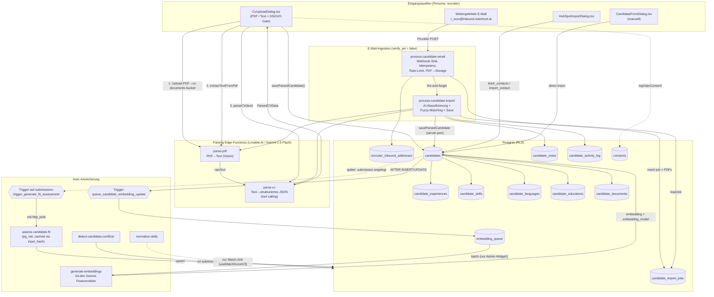

## 05. Kandidaten-Lifecycle & Intake

> Domäne: Wie ein Kandidat von der ersten Quelle (CV-PDF, weitergeleitete E-Mail, CRM-Kontakt, manuelles Formular) zu einem vollständig angereicherten, KI-bewerteten, semantisch durchsuchbaren Profil wird.
> Quellcode = Wahrheit. Diese Sektion basiert auf gelesenem Code, nicht auf `PROJECT_ANALYSIS.md`.

### 5.1 Überblick & Kernidee

Der gesamte Kandidaten-Intake gehört der Persona **recruiter** (`/recruiter/*`). Recruiter sind die einzigen, die Kandidaten in `candidates` anlegen (`candidates.recruiter_id`). Clients und Admins sehen Kandidaten nur indirekt über `submissions` und die Triple-Blind-Schicht (eigene Domäne).

Es gibt **vier Eingangskanäle**, die alle in derselben Datenstruktur landen:

| Kanal | Trigger (Frontend / Webhook) | Edge Function(s) | `candidates.import_source` |
|-------|------------------------------|------------------|----------------------------|
| **CV-Upload** (PDF oder Text) | `CvUploadDialog` → `useCvParsing` | `parse-pdf` → `parse-cv` | `cv_upload` |
| **E-Mail-Weiterleitung** | Mail-Provider-Webhook (Mailgun/Resend-Style) | `process-candidate-email` → `process-candidate-import` → `parse-pdf` → `parse-cv` | `email_import` |
| **CRM / HubSpot** | `HubSpotImportDialog` → `hubspot-sync` | `hubspot-sync` (+ `_shared/token-refresh.ts`) | (kein Wert gesetzt) |
| **Manuell** | `CandidateFormDialog` → `RecruiterCandidates.handleSaveCandidate` | keine (direkter `supabase.from('candidates').insert`) | (kein Wert gesetzt) |

Nach dem Anlegen/Update greifen **automatische Anreicherungs-Pfade** über DB-Trigger und Edge Functions: Embedding-Queue (semantische Suche), Fit-Assessment (bei Submission), Skill-Normalisierung (zur Match-Zeit) und Konflikterkennung.

Der zentrale USP-relevante Punkt: Beim Intake ist der Kandidat noch **nicht** anonymisiert — die Anonymisierung passiert erst, wenn aus einem Kandidaten eine `submission` auf einen Job wird (Triple-Blind, eigene Domäne).

---

### 5.2 Datenfluss (Mermaid)

---

### 5.3 Kanal 1 — CV-Upload (PDF / Text)

**Frontend-Orchestrierung:** `src/components/candidates/CvUploadDialog.tsx`
Ein Wizard mit den Schritten `upload → gdpr → extracting → parsing → review → saving` (`CvUploadDialog.tsx:70`). Aufgerufen aus `src/pages/recruiter/RecruiterCandidates.tsx:399` via Dropdown.

Ablauf (PDF-Modus, `handlePdfUploadAndParse` `CvUploadDialog.tsx:141`):

1. **DSGVO-Gate** — Drei Checkboxen (Rechtsgrundlage, Kandidat informiert, nur bewerbungsrelevant) müssen bestätigt werden, bevor überhaupt hochgeladen wird (`CvUploadDialog.tsx:458-543`). Erst danach werden Daten an Dritte (Lovable AI) gesendet.
2. **Upload** in den Storage-Bucket `cv-documents` unter `${user.id}/${Date.now()}-${sanitizedName}` (`CvUploadDialog.tsx:151`). Dateinamen werden client-seitig sanitiert (Umlaute → ASCII, `sanitizeFileName` `CvUploadDialog.tsx:38`), weil Supabase-Storage nicht-ASCII-Keys ablehnt.
3. **Text-Extraktion:** `useCvParsing.extractTextFromPdf` → `supabase.functions.invoke('parse-pdf', { pdfPath })` (`useCvParsing.ts:149`).
4. **Strukturierung:** `useCvParsing.parseCV` → `invoke('parse-cv', { cvText })` (`useCvParsing.ts:179`).
5. **Review** — Recruiter kann alle Felder editieren (`editMode`).
6. **Persistenz:** `saveParsedCandidate` (`useCvParsing.ts:204`) schreibt `candidates` + Kind-Tabellen, dann `logGdprConsent` → `consents`.

**`parse-pdf`** (`supabase/functions/parse-pdf/index.ts`)
- Lädt das PDF mit Service-Role aus `cv-documents`, kodiert es base64 und schickt es als `image_url` mit `data:application/pdf;base64,...` an `google/gemini-2.5-flash` über `https://ai.gateway.lovable.dev` (`parse-pdf/index.ts:96`). Gemini wird hier als **PDF-Vision-Extraktor** missbraucht — es gibt keine echte PDF-Bibliothek.
- `max_tokens: 8000`, `temperature: 0.1`. Gibt reinen Text zurück.
- **Risiko:** base64-Konvertierung via `String.fromCharCode`-`reduce` (`parse-pdf/index.ts:56`) ist für 10-MB-PDFs speicher- und CPU-intensiv (kann an Edge-Limits scheitern).

**`parse-cv`** (`supabase/functions/parse-cv/index.ts`)
- Reiner **Stateless-Transformer**: Text rein, JSON raus. Schreibt **nichts** in die DB.
- Nutzt OpenAI-kompatibles **Tool-Calling** (`extract_cv_data`, `tool_choice` erzwungen, `parse-cv/index.ts:148`) gegen `google/gemini-2.5-flash`.
- Extrahiert: Stammdaten, `experiences[]`, `educations[]`, `skills[]` (mit Kategorie/Level), `languages[]`, plus KI-Felder `cv_ai_summary`, `cv_ai_bullets`, `expose_title`, `expose_summary`.
- Erweitert das Ergebnis um viele Default-Felder (`parse-cv/index.ts:183-215`).
- Behandelt `429` (Rate-Limit) und `402` (AI-Credits aufgebraucht) explizit — relevant, weil **alle** KI-Funktionen denselben Lovable-Gateway-Key teilen.
- Liefert `parser_version: "v3"`, aber `useCvParsing.saveParsedCandidate` schreibt hartkodiert `cv_parser_version: 'v2'` (`useCvParsing.ts:246`). **Versions-Inkonsistenz.**

**`saveParsedCandidate`** (`useCvParsing.ts:204`)
- Bei `existingCandidateId`: **delete-then-reinsert** aller Kind-Tabellen (`candidate_experiences`, `candidate_educations`, `candidate_languages`, `candidate_skills`) (`useCvParsing.ts:265`). Kein Diff/Merge — manuell editierte Kinddaten gehen bei Re-Import verloren.
- Datumsnormalisierung `normalizeDate` (`useCvParsing.ts:6`) wandelt `YYYY`, `YYYY-MM`, deutsche/englische Monatsnamen, `MM/YYYY` → `YYYY-MM-DD`. Nicht-parsebare Daten → `null` (Datenverlust, nur `console.warn`).
- Versionierte CV-Dokumente in `candidate_documents` (altes `is_current=false`, neue Version = max+1, `useCvParsing.ts:366`).
- **Fehler-Asymmetrie:** Der Haupt-Insert wirft (`throw`), aber Fehler bei Kind-Inserts werden nur geloggt (`console.error`), nicht propagiert (`useCvParsing.ts:309`). Ein Kandidat kann „erfolgreich" angelegt werden, obwohl Skills/Erfahrungen fehlschlugen.

**Wichtige Feld-Mappings** (Parser-Output → DB-Spalte), da Namen abweichen:

| ParsedCVData | `candidates`-Spalte |
|--------------|---------------------|
| `location` | `city` |
| `current_title` | `job_title` |
| `current_company` | `company` |
| `salary_expectation_max` | `expected_salary` (zusätzlich) |
| `availability_from` | `availability_date` |
| `relocation_ready` | `relocation_willing` |
| `skills[].name` | `skills` (Text-Array, nur Namen) |
| `cv_ai_summary` | `summary` **und** `cv_ai_summary` |

---

### 5.4 Kanal 2 — E-Mail-Weiterleitung (Forwarding-Inbox)

Der ausgereifteste Kanal. Jeder Recruiter erhält automatisch eine persönliche Inbound-Adresse `r_<first8ofUUID>@inbound.matchunt.ai` (Migration `20260224120000_email_ingestion_tables.sql:111` für Bestand, Trigger `auto_create_inbound_address` `...:120` für neue Recruiter via `AFTER INSERT ON user_roles`).

**Stufe A — `process-candidate-email`** (`supabase/functions/process-candidate-email/index.ts`, `verify_jwt = false` → öffentlicher Webhook):

1. Parst Provider-Payload generisch (Mailgun/Resend/SendGrid-Felder, `process-candidate-email/index.ts:52-58`).
2. **Recipient → Recruiter:** Lookup in `recruiter_inbound_addresses` über `email_address` (`...:81`). Unbekannte Adresse → `404`. Deaktiviert → `403`.
3. **Idempotenz:** `message_id` gegen `candidate_import_jobs.message_id` (`...:106`). Duplikat → früher `200`-Return.
4. **Rate-Limit:** max 20 Jobs/Stunde pro Recruiter (Zählung in `candidate_import_jobs`, `...:124`). (Der `100/day`-Kommentar ist nicht implementiert.)
5. **Attachment-Handling:** nur PDFs ≤ 10 MB, base64-Decode, Upload nach `cv-documents/email-imports/${recruiterId}/...` (`...:182`).
6. **Job-Anlage** in `candidate_import_jobs` mit `status: 'pending'` (`...:208`).
7. **Fire-and-forget** `fetch` auf `process-candidate-import` mit Service-Role-Bearer (`...:241`). Kein `await` → schnelle Webhook-Antwort, aber **kein Retry**, wenn der zweite Call scheitert (Job bliebe in `pending` hängen).

**Stufe B — `process-candidate-import`** (`supabase/functions/process-candidate-import/index.ts`):

1. **State Machine:** `pending → processing → classified → completed | needs_review | failed` (Spalten-Kommentar in Migration `...email_ingestion_tables.sql:63`).
2. **KI-Klassifizierung** (`classifyEmail` `process-candidate-import/index.ts:99`): Gemini-Tool-Call `classify_email` bestimmt eine von sechs Klassen (`new_candidate`, `candidate_update`, `candidate_notes`, `candidate_with_notes`, `multi_candidate`, `unprocessable`) und trennt **echte Recruiter-Notizen** von Weiterleitungs-Artefakten (Signaturen, „FYI", Forward-Header). Bei AI-Ausfall greift eine deterministische Fallback-Heuristik (`...:597`).
3. **Override-Regeln** korrigieren die KI anhand der PDF-Anzahl (`...:609-620`).
4. **Fuzzy-Matching** (`matchCandidate` `...:153`) gegen bestehende Kandidaten **desselben Recruiters**, gestaffelt nach Konfidenz: E-Mail `0.99` → Telefon `0.90` → exakter Name `0.80` → Fuzzy-Name `0.60/0.40`. Bei Treffer wird **aktualisiert** statt dupliziert.
5. **Persistenz:** server-seitiger Port von `saveParsedCandidate` (`...:267`, dupliziert die FE-Logik inkl. eigener `normalizeDate`-Kopie `...:234` — **doppelte Wahrheit**). Setzt hier korrekt `import_source: 'email_import'` und `cv_parser_version: 'v3'`.
6. **Notizen:** `candidate_notes` (`source: 'email_import'`, `import_job_id`) + `candidate_activity_log` (`createCandidateNote` `...:433`).
7. **Notes-only-Pfad** (`candidate_notes`-Klasse): hängt Notizen an einen per Name gematchten Kandidaten; ohne sicheren Match (`< 0.5`) → `needs_review`.
8. **Bestätigungs-E-Mail** direkt via Resend-API (`sendConfirmationEmail` `...:470`) — umgeht die zentrale `send-email`-Function.

**Beobachtung:** Stufe A und Stufe B teilen sich `parse-pdf`/`parse-cv` mit Kanal 1 (`processPdf` `...:648`). Pro PDF werden **zwei** sequentielle Gemini-Calls fällig → bei `multi_candidate` mit N CVs sind es 2N Calls plus 1 Klassifizierung, alle synchron in einer Edge-Function-Invocation.

---

### 5.5 Kanal 3 — HubSpot / CRM

**Frontend:** `HubSpotImportDialog.tsx` (`fetch → select → gdpr → importing → complete`).
**Edge Function:** `hubspot-sync` (`supabase/functions/hubspot-sync/index.ts`, `verify_jwt`-pflichtig, prüft User-Token selbst `...:44`).

- `action: 'fetch_contacts'` — holt OAuth-Token aus `recruiter_integrations` (provider `hubspot`, status `connected`) und refreshed ihn bei Bedarf via `_shared/token-refresh.ts` (`getValidToken` `hubspot-sync/index.ts:83`). **Ohne** verbundene Integration werden **Demo-Kontakte** zurückgegeben (`...:69`) — gut für Onboarding, aber leicht mit echten Daten zu verwechseln.
- Bei `401` von HubSpot wird die Integration auf `status: 'expired'` gesetzt (`...:102`).
- `action: 'import_contact'` — Dedupe über `(email, recruiter_id)` (`...:139`); existiert der Kandidat, `skipped`. Sonst minimaler Insert (`full_name`, `email`, `phone`, `jobtitle → skills[]`) plus `candidate_activity_log` (`activity_type: 'hubspot_import'`).
- **Schwäche:** Das Frontend ruft `import_contact` **pro Kontakt einzeln** in einer JS-`for`-Schleife auf (`HubSpotImportDialog.tsx:100`) → N Round-Trips, keine Server-seitige Batch-Verarbeitung. HubSpot-Notizen (`notes`) werden weder geholt noch gespeichert.

---

### 5.6 Kanal 4 — Manuelle Erfassung

**`CandidateFormDialog.tsx`** — umfangreiches 4-Tab-Formular (Stammdaten, Beruf & Skills, Verfügbarkeit, Exposé) mit `TagInput`-Komponenten und `CommutePreferencesCard` (Pendel-/Remote-Präferenzen für Geo-Matching). Erfasst deutlich mehr Felder als der CV-Parser liefert (z. B. `salary_fix`/`salary_bonus`, `visa_required`, `project_metrics`, `expose_*`).

- DSGVO-Gate nur für **neue** Kandidaten (`isNewCandidate`, `CandidateFormDialog.tsx:995`).
- Persistenz **nicht** über `useCvParsing`, sondern direkt in `RecruiterCandidates.handleSaveCandidate` (`RecruiterCandidates.tsx:150`): `update` bei Edit, sonst `insert` mit `recruiter_id` + Consent-Log (`...:162`). Schreibt **keine** Kind-Tabellen — alle Skills landen nur im `skills`-Text-Array.

---

### 5.7 Automatische Anreicherung (Trigger, Functions, Queue)

#### 5.7.1 Embeddings / semantische Suche

- **Trigger** `queue_candidate_embedding_update` (`AFTER INSERT OR UPDATE ON candidates`, Migration `20260122214438_...sql`) schreibt einen Eintrag in `embedding_queue`, aber **nur** wenn sich `skills`, `job_title`, `cv_ai_summary`, `seniority` oder `specializations` ändern. Priorität 2, falls noch kein Embedding existiert. `ON CONFLICT DO NOTHING` über `UNIQUE(entity_type, entity_id, status)`.
- **Drainage:** `generate-embeddings` mit `{ batch: true }` (`generate-embeddings/index.ts:253`) verarbeitet die Queue. Pro Kandidat wird ein **64-dimensionaler Gemini-„Featurevektor"** erzeugt (`buildCandidateProfileText` + `generateEmbedding` `...:146`) und als pgvector-String gespeichert, mit `embedding_model: 'gemini-2.5-flash-64d'`.
- **KRITISCH — Dimensions-Mismatch:** Die Migration definiert `candidates.embedding vector(1536)` (`text-embedding-3-small`, `20260122214438_...sql:6`) und baut darauf HNSW-Indizes sowie `find_similar_candidates(vector(1536))` / `search_candidates_hybrid(...)`. `generate-embeddings` schreibt aber nur **64** Werte. Eine `INSERT … vector(1536)` mit 64 Elementen wird von pgvector **abgelehnt** → Embeddings dürften beim Schreiben fehlschlagen (Queue-Items → `failed`), und die Vektor-Suchfunktionen liefern nichts Brauchbares. Es existiert **keine** spätere Migration, die die Spalte auf `vector(64)` ändert (geprüft über alle `vector(...)`-Vorkommen).
- **KEIN Cron-Drainer:** `embedding_queue` wird ausschließlich manuell über das Admin-`EmbeddingHealthWidget.tsx:68` (`batch: true, batchSize: 10`) abgearbeitet. Ohne Admin-Klick bleiben Items dauerhaft `pending`.

#### 5.7.2 Fit-Assessment (an Submission gekoppelt)

- `assess-candidate-fit` (`supabase/functions/assess-candidate-fit/index.ts`) erzeugt ein tiefes, evidenzbasiertes Fit-Gutachten (Tool-Call `submit_fit_assessment`: `requirement_assessments`, `gap_analysis`, `career_trajectory`, `dimension_scores`, …) und schreibt es nach `candidate_fit_assessments` (Upsert `onConflict: submission_id`).
- **Caching** über `input_data_hash` (SHA-256 über Kandidat+Job+Notizen, `...:106`): unveränderte Eingaben → kein erneuter AI-Call.
- **Auto-Trigger:** `trigger_generate_fit_assessment` (`AFTER INSERT ON submissions`, Migration `20260307000000_fit_assessment_auto_trigger.sql`) ruft die Function **fire-and-forget via `pg_net`** mit Service-Role-Key. Die Function erkennt den Service-Role-Call und setzt dann `generated_by = null` (`assess-candidate-fit/index.ts:355`).
- **Abhängigkeit von `app.settings.*`:** Der Trigger nutzt `current_setting('app.settings.supabase_url')` / `...service_role_key`. Fehlen diese GUC-Settings, wirft `net.http_post` und der `submissions`-Insert würde fehlschlagen → harte Kopplung Intake↔Submission.
- Liest u. a. `candidate_ai_assessment` als „bisherige Einschätzung" mit ein — verknüpft die ältere Assessment-Tabelle mit dem neuen System.

#### 5.7.3 Skill-Normalisierung

- `normalize-skills` (`supabase/functions/normalize-skills/index.ts`) mappt Roh-Skills 4-stufig auf `skill_taxonomy.canonical_name`: exakt (100) → Alias (95) → Fuzzy/Substring (75) → KI (Gemini, ≥60). Reiner Stateless-Service, schreibt nichts.
- **Hinweis:** Wird **nicht** beim Intake aufgerufen, sondern erst zur Match-Zeit aus `useMatchScoreV3.ts:79`. Die beim Parsing gespeicherten `candidate_skills` bleiben also **unnormalisiert** im Profil. Außerdem nutzt diese Function einen anderen Endpunkt (`https://api.lovable.dev/...`, `...:121`) als alle übrigen (`https://ai.gateway.lovable.dev/...`) — potenziell veraltet.

#### 5.7.4 Konflikterkennung

- `detect-candidate-conflicts` (`supabase/functions/detect-candidate-conflicts/index.ts`) prüft Mehrfachbewerbungen eines Kandidaten: `same_client` (high), `same_industry` (medium), `critical_stage` (interview/offer). Schreibt `candidate_conflicts` (dedupe gegen offene Konflikte) und erzeugt bei `high` eine `notifications`-Zeile an den Recruiter.
- Aufruf aus `useCandidateConflicts.ts:67` mit `{ candidate_id, submission_id }` — also ebenfalls submission-getrieben, nicht reiner Intake.

---

### 5.8 Tabellenlandschaft dieser Domäne

| Tabelle | Rolle im Lifecycle | Beschrieben von | Migration |
|---------|--------------------|------------------|-----------|
| `candidates` | Stammprofil (`recruiter_id`, KI-Felder, `embedding`, `import_source`) | alle vier Kanäle + `generate-embeddings` | `20251204171610_...` |
| `candidate_experiences` | Berufserfahrung (datumsnormalisiert) | `useCvParsing` / `process-candidate-import` | `20251211212741_...` |
| `candidate_skills` | strukturierte Skills (name/category/level) | dito | `20251211212741_...` |
| `candidate_languages` | Sprachen + Proficiency | dito | `20251211...` |
| `candidate_educations` | Ausbildung | dito | `20251211...` |
| `candidate_documents` | versionierte CV-Dateien (`is_current`) | `saveParsedCandidate` | `20251211233705_...` |
| `candidate_notes` | Recruiter-Notizen (`source`, `import_job_id`) | `process-candidate-import` | erweitert in `20260224120000_...` |
| `candidate_activity_log` | Audit-Timeline (import/hubspot/email) | E-Mail-Import, `hubspot-sync` | `20251212004329_...` |
| `candidate_ai_assessment` | ältere KI-Bewertung (Risiken/Chancen/Scores) | `process-interview-notes`, `client-candidate-summary` (gelesen von `assess-candidate-fit`) | `20251212004329_...` |
| `candidate_fit_assessments` | neues, submission-gebundenes Fit-Gutachten | `assess-candidate-fit` | `20260306000000_...` |
| `candidate_conflicts` | Mehrfachbewerbungs-Konflikte | `detect-candidate-conflicts` | — |
| `recruiter_inbound_addresses` | Mapping Inbound-E-Mail → Recruiter | Trigger + `process-candidate-email` | `20260224120000_...` |
| `candidate_import_jobs` | State Machine der E-Mail-Importe | `process-candidate-email` / `-import` | `20260224120000_...` |
| `embedding_queue` | Async-Queue für Vektor-Generierung | Trigger `queue_candidate_embedding_update` | `20260122214438_...` |
| `consents` | DSGVO-Einwilligungs-Audit (`candidate_data_processing`) | alle Dialoge | — |

---

### 5.9 Wichtigste Vernetzungen (Frontend → Function → Tabelle)

1. `CvUploadDialog` →(invoke)→ `parse-pdf` →(invoke)→ `parse-cv` →(`saveParsedCandidate`)→ `candidates` + 4 Kind-Tabellen + `candidate_documents` + `consents`.
2. Mail-Provider →(Webhook)→ `process-candidate-email` →(`fetch` fire-and-forget)→ `process-candidate-import` →(invoke ×2 pro PDF)→ `parse-pdf`/`parse-cv` → `candidates`/`candidate_notes`/`candidate_activity_log`; State in `candidate_import_jobs`.
3. `HubSpotImportDialog` →(invoke pro Kontakt)→ `hubspot-sync` →(OAuth via `_shared/token-refresh.ts` + `recruiter_integrations`)→ `candidates` + `candidate_activity_log`.
4. `candidates` INSERT/UPDATE →(DB-Trigger)→ `embedding_queue` →(Admin-Widget `batch`)→ `generate-embeddings` →(Update `embedding`)→ `candidates`.
5. `submissions` INSERT →(DB-Trigger `pg_net`)→ `assess-candidate-fit` →(liest `candidates`, Kind-Tabellen, `candidate_ai_assessment`)→ `candidate_fit_assessments`.

---

### 5.10 Reibungs- & Risikopunkte (im Code beobachtet)

- **Embedding-Dimensions-Mismatch (kritisch):** DB-Spalte `vector(1536)` vs. 64-dim Gemini-Output in `generate-embeddings`. Schreiben schlägt vermutlich fehl, semantische Suche (`find_similar_candidates`, `search_candidates_hybrid`) ist nicht funktionsfähig.
- **Embedding-Queue ohne Cron:** Drainage nur manuell über `EmbeddingHealthWidget`. Ohne Admin bleibt die Queue dauerhaft `pending`.
- **Öffentliche Ingestion-Webhooks:** `process-candidate-email`/`-import` laufen mit `verify_jwt = false`. Es gibt keine sichtbare Signatur-/Secret-Prüfung der Provider-Payload — jeder, der die URL kennt, könnte Importe + Resend-Bestätigungs-Mails auslösen (Recipient muss nur eine gültige Inbound-Adresse sein).
- **Fire-and-forget ohne Retry:** Schlägt der Trigger-Call `process-candidate-email → process-candidate-import` fehl, hängt der Job in `pending` (kein Worker holt ihn nach).
- **Duplizierte Speicher-Logik:** `saveParsedCandidate` + `normalizeDate` existieren zweimal (FE `useCvParsing.ts`, Edge `process-candidate-import/index.ts`) — zwei Wahrheiten, die auseinanderlaufen können (z. B. `cv_parser_version` `'v2'` vs `'v3'`).
- **Stille Teilfehler:** Kind-Insert-Fehler in `saveParsedCandidate` werden nur geloggt; Kandidat gilt als „erstellt" trotz fehlender Skills/Erfahrungen.
- **Re-Import = Datenverlust:** Delete-then-reinsert der Kind-Tabellen überschreibt manuell editierte Erfahrungen/Skills bei jedem CV-Update.
- **Skills bleiben unnormalisiert:** `normalize-skills` läuft erst zur Match-Zeit; gespeicherte `candidate_skills` sind nicht kanonisiert. Zudem nutzt die Function einen abweichenden API-Endpunkt.
- **Orphan-Function `candidate-summary`:** In `config.toml` registriert, aber **kein** Frontend-/Backend-Caller. Funktional ersetzt durch `client-candidate-summary` + `assess-candidate-fit`. Toter Code / Verwirrungsgefahr.
- **Zwei parallele Assessment-Systeme:** `candidate_ai_assessment` (älter, kandidatenweit) und `candidate_fit_assessments` (neu, submission-gebunden) koexistieren; `assess-candidate-fit` liest ersteres, schreibt letzteres — Datenmodell-Schuld.
- **Harte Intake↔Submission-Kopplung:** Der `submissions`-Insert-Trigger ruft synchron `net.http_post` und hängt von `app.settings.*`-GUCs ab; Fehlkonfiguration kann Submissions blockieren.
- **PDF-base64 im Speicher:** `parse-pdf` baut den base64-String per `reduce`/`String.fromCharCode` für bis zu 10 MB — Performance-/Memory-Risiko an Edge-Limits.
- **HubSpot N+1 + Demo-Daten:** Pro-Kontakt-Invoke statt Batch; ohne Integration stille Rückgabe von Demo-Kontakten (Verwechslungsgefahr), `notes` werden ignoriert.
