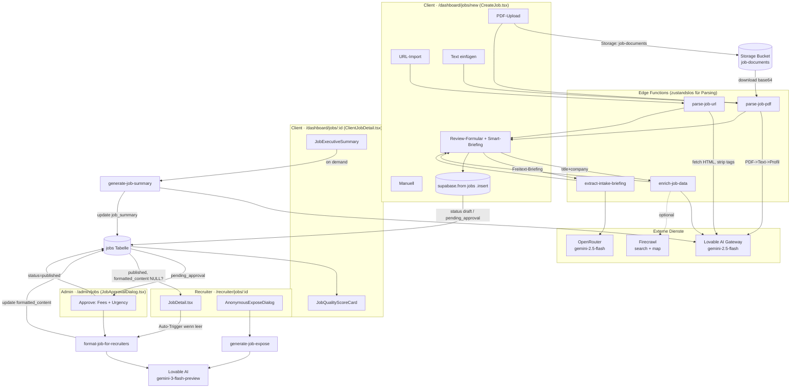

## 06. Job-Lifecycle & Anreicherung

> Domäne: Entstehung einer Stelle von der Roh-Eingabe (PDF / URL / Text / manuell) über KI-Parsing, KI-Anreicherung, Intake-Briefing und Admin-Approval bis zum vermarktungsfertigen, anonymisierten Job-Datensatz, der Recruitern angezeigt wird.
>
> Quellcode = Wahrheit. Diese Sektion basiert auf direktem Lesen der Edge Functions und Frontend-Dateien (Stand: Branch `main`, Commit `9903dbd`). `PROJECT_ANALYSIS.md` war nur Orientierung.

### 06.1 Überblick & Kernaussagen

Der Job-Lifecycle zerfällt in **drei Phasen**, die jeweils einem Persona-Kontext zugeordnet sind:

| Phase | Persona / Route | Was passiert | Zentrale Edge Functions |
|-------|-----------------|--------------|-------------------------|
| **1. Erfassung & Anreicherung** | `client` – `/dashboard/jobs/new` (`CreateJob.tsx`) | Import via PDF/URL/Text/manuell → KI-Extraktion → Firmen-Anreicherung → Smart-Intake → `INSERT` in `jobs` (Status `draft` oder `pending_approval`) | `parse-job-url`, `parse-job-pdf`, `enrich-job-data`, `extract-intake-briefing` |
| **2. Approval & Vermarktung** | `admin` – `/admin/jobs` (`JobApprovalDialog.tsx`) | Admin setzt Fees/Urgency → AI formatiert **anonymisiert** → Status `published` | `format-job-for-recruiters` |
| **3. Konsum & Aufbereitung** | `recruiter` – `/recruiter/jobs/:id` (`JobDetail.tsx`) & `client` – `/dashboard/jobs/:id` (`ClientJobDetail.tsx`) | Recruiter sieht anonymisierte `formatted_content` (auto-generiert falls leer); Client sieht Executive Summary + Qualitäts-Score | `format-job-for-recruiters` (Auto-Trigger), `generate-job-summary`, `generate-job-expose` |

**Vier zentrale Erkenntnisse, die man verinnerlichen muss:**

1. **Die Parsing-/Anreicherungs-Functions sind zustandslos.** `parse-job-url`, `parse-job-pdf`, `enrich-job-data` und `extract-intake-briefing` schreiben **NICHTS** in die DB – sie geben nur JSON zurück. Das Persistieren übernimmt der Browser via `supabase.from('jobs').insert(...)` in `CreateJob.tsx:610`. Dadurch hängt die gesamte Datenintegrität der Stelle an der Client-seitigen Mapping-Logik (siehe Friction).
2. **`job_summary` und `formatted_content` sind zwei getrennte AI-Artefakte mit unterschiedlichem Zweck.** `job_summary` (JSONB) = strukturierte Executive Summary für den **Client** (nicht anonymisiert, `generate-job-summary`). `formatted_content` (JSONB) = anonymisiertes Recruiter-Marketing (Triple-Blind, `format-job-for-recruiters`). Beides wird server-seitig in `jobs` zurückgeschrieben.
3. **Triple-Blind wird per Prompt erzwungen, nicht per Code.** Die Anonymisierung in `generate-job-expose` und `format-job-for-recruiters` ist ausschließlich eine LLM-Anweisung ("Nenne NIEMALS den Firmennamen"). Es gibt keine deterministische Nachkontrolle (z.B. String-Replace des `company_name` im Output).
4. **Inkonsistente AI-Infrastruktur.** 7 von 8 Functions nutzen das Lovable-Gateway; `extract-intake-briefing` nutzt als einzige **OpenRouter**. Modellwahl divergiert: `gemini-2.5-flash` (Parsing/Summary) vs. `gemini-3-flash-preview` (Expose/Format).

### 06.2 Datenfluss-Diagramm

### 06.3 Phase 1 – Erfassung: Die drei Import-Pfade

Einstieg ist `CreateJob.tsx` (`src/pages/dashboard/CreateJob.tsx`, ~1680 Zeilen). Der Flow wird über `FlowState` (`'import-selection' | 'importing' | 'review' | 'submitting'`) gesteuert (`CreateJob.tsx:78`). Drei Import-Methoden + manuell:

#### a) URL-Import → `parse-job-url`

- Hook: `useJobParsing.parseJobUrl()` (`src/hooks/useJobParsing.ts:53`) ruft `supabase.functions.invoke('parse-job-url', { body: { jobUrl } })`.
- Function `parse-job-url/index.ts`:
  - Fetcht die Seite mit eigenem `User-Agent: Mozilla/5.0 (compatible; JobParser/1.0)` (`parse-job-url/index.ts:78-83`), **strippt HTML serverseitig per Regex** (`<script>`, `<style>`, alle Tags) und kürzt auf **15.000 Zeichen** (`:94`). Kein Headless-Browser → JS-gerenderte Seiten (LinkedIn, viele SPAs) liefern leeren/blockierten Content.
  - Schickt den Text an `https://ai.gateway.lovable.dev` (`gemini-2.5-flash`) mit einem **27-Felder-Tool-Schema** (`extract_job_data`, `tool_choice: forced`) – deutscher HR-System-Prompt mit Mapping-Regeln (Monatsgehalt × 12, Du/Sie → Kultur, Dringlichkeits-Heuristik).
  - Gibt `{ success, data: ParsedJobData }` zurück. **Kein DB-Write.**

#### b) PDF-Upload & Text → `parse-job-pdf`

- Hook: `useJobPdfParsing` (`src/hooks/useJobPdfParsing.ts`).
  - PDF: lädt die Datei zunächst in den Storage-Bucket **`job-documents`** unter `uploads/<ts>-<rand>.pdf` (`useJobPdfParsing.ts:43`), ruft dann `parse-job-pdf` mit `{ pdfPath }`.
  - Text: ruft `parse-job-pdf` mit `{ jobText }` (dieser Pfad wird in `CreateJob` für "Text einfügen" verwendet, `CreateJob.tsx:414`).
- Function `parse-job-pdf/index.ts`:
  - Lädt PDF mit Service-Role aus Storage, konvertiert zu **base64** (`:74`) und schickt es als `image_url`-Daten-URI (`data:application/pdf;base64,...`) an `gemini-2.5-flash` zur **Text-Extraktion** (`max_tokens: 8000`, `temperature: 0.1`). → Scans/Bild-PDFs sind erfahrungsgemäß fragil.
  - Zweiter AI-Call analysiert den Text mit Tool-Schema `create_job_profile` (anderes Schema als parse-job-url: `requirements` ist hier ein `string[]`, Felder `nice_to_have`, `technical_skills`, `soft_skills`, `ai_summary`, `seniority_level`).
  - **Kein DB-Write.**

> **Schema-Divergenz (wichtig!):** `parse-job-url` liefert `ParsedJobData` (flaches 27-Feld-Schema, `requirements: string`), `parse-job-pdf` liefert `ParsedJobProfile` (`requirements: string[]`, `company` statt `company_name`, `seniority_level` mit 6 statt 4 Enum-Werten). `CreateJob.tsx` muss daher **zwei getrennte Mapping-Funktionen** halten: `applyParsedData()` (`:232`) für URL und `applyParsedJobProfile()` (`:451`) für PDF/Text. Letztere baut das PDF-Profil künstlich in ein `ParsedJobData`-Objekt um und setzt dabei viele Felder hart auf `null` (`team_size`, `reports_to`, `core_hours`, `unique_selling_points` …). → PDF-/Text-Import erfasst strukturell **weniger** Felder als URL-Import.

#### c) Firmen-Anreicherung → `enrich-job-data`

- Wird **nur im URL-Pfad** automatisch nachgelagert getriggert (`applyParsedData` → `enrichJobData`, `CreateJob.tsx:292-315`), wenn `title` und `company_name` vorhanden sind. Im PDF-/Text-Pfad (`applyParsedJobProfile`) wird Enrichment **nicht** aufgerufen.
- Hook `useJobEnrichment` (`src/hooks/useJobEnrichment.ts`) leitet eine **geratene Domain** aus dem Firmennamen ab (`extractCompanyDomain`: strippt GmbH/AG/etc., hängt `.com` an, `:35`). → Häufig falsche Domain (z.B. deutsche Firmen mit `.de`).
- Function `enrich-job-data/index.ts`:
  1. **Skill-Normalisierung** über ein hartkodiertes `TECH_NORMALIZATIONS`-Mapping (`:26`, ~30 Stacks).
  2. **Industry-Klassifikation** über Keyword-Mapping `INDUSTRY_KEYWORDS` (`:10`).
  3. Optional **Firecrawl** (`api.firecrawl.dev/v1/search` + `/v1/map`), um Funding-Stage, Mitarbeiterzahl und Career-Page zu schätzen (nur falls `FIRECRAWL_API_KEY` gesetzt).
  4. **AI-Fallback** (`gemini-2.5-flash`, Tool `classify_company`) nur, wenn `industry` oder `company_size_band` noch fehlen.
  - Gibt `EnrichmentResult` zurück (industry, company_size_band, funding_stage, tech_environment, hiring_urgency, normalized_skills, company_insights). **Kein DB-Write** – das Ergebnis wird in `CreateJob` ins `formData` gemerged.

> **Urgency-Mapping-Bug:** `enrich-job-data` liefert `hiring_urgency` als `'ASAP' | 'urgent' | 'standard'` (`mapHiringUrgency`, `:110`), während das DB-/Form-Modell `'hot' | 'urgent' | 'standard'` erwartet (siehe `ParsedJobData.hiring_urgency`). Ein Wert `'ASAP'` passt in kein UI-Enum und landet ggf. unverarbeitet im Formular.

#### d) Smart-Intake-Briefing → `extract-intake-briefing`

- Komponente `IntakeBriefingSection.tsx` + Hook `useIntakeBriefing.ts`. Der Client tippt Freitext ("Erzählen Sie uns alles über die Stelle"), die KI extrahiert **26 strukturierte Intake-Felder** (`ExtractedIntakeData`).
- Function `extract-intake-briefing/index.ts`:
  - **Einzige Function dieser Domäne, die OpenRouter nutzt** (`https://openrouter.ai/api/v1/chat/completions`, `:73`) – mit `OPENROUTER_API_KEY`.
  - Setzt gleichzeitig `response_format: { type: 'json_object' }` **und** ein `tools`-Array mit `tool_choice: forced` (`:87-128`) → redundante/teils inkompatible Output-Konfiguration. Der Code parst defensiv beide Varianten (`tool_calls` ODER `content`, `:142-153`).
  - Berechnet `completeness` über 10 gewichtete Felder (`:156`).
  - **Kein DB-Write.** Ergebnis fließt via `onDataExtracted` ins `formData` und `intakeData` (`CreateJob.tsx:163`).

#### Persistierung (der eigentliche DB-Write)

Erst `handleSubmit()` (`CreateJob.tsx:569`) schreibt: `supabase.from('jobs').insert({...})` (`:610`). Wichtige Punkte:
- `status: publish ? 'pending_approval' : 'draft'` (`:627`).
- `client_id: user?.id` – RLS-Anker (jobs gehören dem Client).
- Publizieren erfordert Gehalts-Range + abgeschlossene Verifizierung (`useClientVerification.canPublishJobs`, `:587`); sonst Redirect nach `/onboarding`.
- Zahlreiche Intake-Felder (`company_culture`, `career_path`, `success_profile`, `must_have_criteria`, `reports_to`, `works_council`, `intake_completeness` …) werden aus `intakeData` übernommen.

### 06.4 Phase 2 – Admin-Approval & anonyme Vermarktung

- `admin` öffnet `JobApprovalDialog.tsx` (`/admin/jobs`). Beim Klick auf "Genehmigen & Veröffentlichen" (`handleApprove`, `:103`):
  1. Ruft **`format-job-for-recruiters`** (`JobApprovalDialog.tsx:89`).
  2. Schreibt `status='published'`, `fee_percentage`, `recruiter_fee_percentage`, `urgency`, `approved_at`, `approved_by` **und** das gerade erhaltene `formatted_content` zurück (`:112-123`).
- Function `format-job-for-recruiters/index.ts`:
  - Lädt den Job per Service-Role, baut einen Prompt mit **explizitem Triple-Blind-Block** ("⚠️ KRITISCH … Nenne NIEMALS den Firmennamen `${job.company_name}`", `:67`).
  - Modell: **`gemini-3-flash-preview`** über Lovable-Gateway. Tool `format_job` erzeugt `headline`, `highlights`, `role_summary`, `ideal_candidate`, `selling_points`, `anonymous_company_pitch`, `quick_facts`.
  - **Robuster Fallback:** Bei AI-Fehler wird ein deterministisches `FormattedContent` aus Job-Feldern gebaut (`:240-263`) – dieser Fallback ist allerdings nur *teilanonym* (nutzt z.B. `job.location`).
  - **Schreibt `formatted_content` selbst in `jobs`** (`:266-269`) – d.h. auch ohne den Admin-Update wäre es persistiert (doppelter Write: einmal Function, einmal `JobApprovalDialog`).
- Ablehnung (`handleReject`, `:138`): setzt Status zurück auf `draft` und legt den Grund als Präfix `[ABGELEHNT] …` in **`briefing_notes`** ab (kein dediziertes Feld).

### 06.5 Phase 3 – Konsum: Recruiter & Client

#### Recruiter-Sicht (`/recruiter/jobs/:id`, `JobDetail.tsx`)
- **Auto-Trigger:** Ein `useEffect` (`JobDetail.tsx:143-161`) ruft `format-job-for-recruiters` automatisch nach, sobald ein Job geladen wird, dessen `formatted_content` `null` ist. Das ist der Selbstheilungs-Pfad für Jobs, die nie durch den Admin-Approval-Dialog liefen (oder bei denen die Generierung fehlschlug).
- Triple-Blind-Kontext: Firmenname/`company_profiles` werden erst nach Submission/Reveal sichtbar (`RecruiterAccessStatus`, `:130`).
- **Anonymes Exposé:** `AnonymousExposeDialog.tsx` ruft beim Öffnen `generate-job-expose` (`:32`). Diese Function lädt den Job, generiert ein **1-seitiges Markdown-Exposé** (anonymisiert, `gemini-3-flash-preview`) und gibt es **flüchtig** zurück – `generate-job-expose` **persistiert nichts**. Dient der Copy-&-Paste-Kandidatenansprache.

#### Client-Sicht (`/dashboard/jobs/:id`, `ClientJobDetail.tsx`)
- **Executive Summary:** `JobExecutiveSummary` zeigt `job.job_summary`. Über `generateSummary()` (`ClientJobDetail.tsx:184`) ruft der Client `generate-job-summary`, die den Job lädt, eine strukturierte JSONB-Summary erzeugt (`key_facts`, `tasks_structured`, `requirements_structured`, `benefits_extracted`, `ai_insights`) **und sie in `jobs.job_summary` zurückschreibt** (`generate-job-summary/index.ts:320`). Eigener deterministischer Fallback (`generateFallbackSummary`, `:344`).
- **Phasenadaptive Darstellung:** Bei 0 Kandidaten zeigt die Seite Job-Qualität / Next Steps / Selling Points (`ClientJobDetail.tsx:472`); ab 1 Kandidat den Pipeline-/Top-Kandidaten-Block.
- **Job-Qualität (rein Client-seitig berechnet):** `JobQualityScoreCard.tsx` vergibt 0–100 Punkte über eine lokale Heuristik (`calculateQualityScore`, `:34`: Gehalt 20, Beschreibung 15, Skills 15, Benefits 10, Intake 10, …). **Kein AI-Call, keine Persistierung** – reine Anzeige + Verbesserungsvorschläge mit Deep-Link in die jeweiligen `JobEditDialog`-Tabs.
- **Selling Points:** `SellingPointsCard.tsx` leitet USPs deterministisch aus Job-Feldern ab (`:24`) – ebenfalls ohne Backend.

### 06.6 Angrenzend: Company-Crawl & Geocoding

Diese Functions stehen im Spec dieser Domäne, gehören datenseitig aber primär zur **Outreach-Domäne** (Tabellen `outreach_companies`, `outreach_leads`), nicht zur `jobs`-Tabelle:

| Function | Aufrufer (Frontend) | Schreibt nach | Datenquelle |
|----------|---------------------|---------------|-------------|
| `crawl-career-page` | `useCareerCrawl.useCrawlCareerPage` | `outreach_leads` (career_page_url, live_jobs, hiring_activity) | Firecrawl `/v1/map` |
| `crawl-career-pages-bulk` | `useCareerCrawl.useCrawlCareerPagesBulk` | `outreach_leads` (batch) | Firecrawl |
| `crawl-company-data` | `useCompanyEnrichment` (fire-and-forget), `useOutreachCompanies` | `outreach_companies` | Firecrawl multi-source |
| `enrich-company-from-domain` | `useCompanyEnrichment.useCreateCompanyFromDomain` | `outreach_companies` (insert) | Firecrawl scrape + AI |
| `generate-company-insights` | `useCompanyEnrichment.useGenerateCompanyInsights` | `outreach_companies` (intelligence) | AI |
| `geocode-address` | `candidates/CommutePreferencesCard.tsx` | (return-only) | OpenStreetMap **Nominatim** (kein API-Key) |

> **Zuordnungs-Hinweis:** `geocode-address` ist generisch (Nominatim, `geocode-address/index.ts:46`) und wird im aktuellen Code aus dem **Kandidaten-Commute-Kontext** aufgerufen, nicht aus dem Job-Erstellungsflow – obwohl `jobs.office_address` der natürliche Gegenpart für Pendel-Matching wäre. Der Job-seitige Geocode-Aufruf existiert (noch) nicht.

### 06.7 Tabellen & wichtige Spalten (`jobs`)

Basis-Definition: `supabase/migrations/20251204171610_*.sql`. Relevante (per Migration nachgezogene) Spalten dieser Domäne:

| Spalte | Typ | Befüllt durch | Zweck |
|--------|-----|---------------|-------|
| `status` | text (`draft`/`pending_approval`/`published`/`closed`) | `CreateJob`, `JobApprovalDialog`, `JobsList` | Lifecycle-State |
| `skills`, `must_haves`, `nice_to_haves` | text[] | `CreateJob.insert` (aus Parse/Enrich) | Matching-Input |
| `industry`, `company_size_band`, `funding_stage`, `tech_environment` | text / text[] | `enrich-job-data` → Client-Merge | Anreicherung |
| `hiring_urgency` / `urgency` | text | Client (`hiring_urgency`) bzw. Admin (`urgency`) | **Zwei getrennte Urgency-Felder!** |
| `intake_completeness` | int | `extract-intake-briefing` → Client | Intake-Score |
| `company_culture`, `career_path`, `success_profile`, `must_have_criteria`, `reports_to`, `works_council` … | text/jsonb | Intake | Tiefenprofil |
| `job_summary` | jsonb | `generate-job-summary` (Server-Write) | Client Executive Summary |
| `formatted_content` | jsonb | `format-job-for-recruiters` (Server-Write) | Recruiter-Marketing (anonym) |
| `fee_percentage`, `recruiter_fee_percentage`, `approved_at`, `approved_by` | decimal/ts/uuid | `JobApprovalDialog` | Erfolgsbasiertes Modell |
| `briefing_notes`, `paused_at` | text/ts | `JobsList`, `BriefingNotesDialog` | Operativ |

Migrations-Belege: `formatted_content` → `20260120202843_*.sql`; `job_summary` → `20260123172534_*.sql`; `benefits` (text) später ergänzt.

### 06.8 Vernetzung (wer ruft was, wer schreibt was)

| Von (Frontend) | Edge Function | AI/Extern | DB-Effekt |
|----------------|---------------|-----------|-----------|
| `useJobParsing` (CreateJob URL) | `parse-job-url` | Lovable `gemini-2.5-flash` + `fetch(url)` | — (return only) |
| `useJobPdfParsing` (CreateJob PDF/Text) | `parse-job-pdf` | Lovable `gemini-2.5-flash` + Storage `job-documents` | liest Storage; kein jobs-Write |
| `useJobEnrichment` (CreateJob, nur URL-Pfad) | `enrich-job-data` | Lovable + optional Firecrawl | — (return only) |
| `IntakeBriefingSection`/`useIntakeBriefing` | `extract-intake-briefing` | **OpenRouter** `gemini-2.5-flash` | — (return only) |
| `CreateJob.handleSubmit` | — | — | **`INSERT jobs`** (draft/pending_approval) |
| `JobApprovalDialog` (admin) | `format-job-for-recruiters` | Lovable `gemini-3-flash-preview` | **`UPDATE jobs.formatted_content`** (+ status/fees im Dialog) |
| `recruiter/JobDetail` (useEffect) | `format-job-for-recruiters` | Lovable `gemini-3-flash-preview` | **`UPDATE jobs.formatted_content`** (Auto-Heal) |
| `recruiter/AnonymousExposeDialog` | `generate-job-expose` | Lovable `gemini-3-flash-preview` | — (return only) |
| `ClientJobDetail.generateSummary` | `generate-job-summary` | Lovable `gemini-2.5-flash` | **`UPDATE jobs.job_summary`** |

### 06.9 Friction- & Risiko-Punkte (im Code beobachtet)

1. **Triple-Blind ohne deterministische Absicherung** (`generate-job-expose/index.ts:54`, `format-job-for-recruiters/index.ts:67`): Anonymisierung allein per Prompt. Kein Post-Processing prüft, ob `company_name` doch im Output steht. Ein einziger LLM-Fehler bricht den Kern-USP. *Empfehlung:* serverseitiger Regex-Scrub des Firmennamens + Validierung vor `UPDATE`.
2. **Persistenz nur im Browser** (`CreateJob.tsx:610`): Alle 4 Parse/Enrich-Functions sind return-only; nur der Client schreibt in `jobs`. Bricht der Tab vor `handleSubmit` ab, ist die teure KI-Arbeit verloren; zudem hängt das DB-Schema-Mapping vollständig an Client-Code. *Empfehlung:* Server-Write/Draft-Autosave in den Functions oder zumindest LocalStorage-Recovery.
3. **Zwei divergierende Parse-Schemata** (`ParsedJobData` vs. `ParsedJobProfile`): Doppelte Mapping-Pfade (`applyParsedData` vs. `applyParsedJobProfile`), wobei der PDF-/Text-Pfad viele Felder hart auf `null` setzt und **kein Enrichment** triggert. → PDF/Text-Jobs sind systematisch datenärmer als URL-Jobs. *Empfehlung:* beide Functions auf ein gemeinsames Schema vereinheitlichen.
4. **Inkonsistente AI-Provider/Modelle**: `extract-intake-briefing` nutzt OpenRouter (`OPENROUTER_API_KEY`), alle anderen Lovable (`LOVABLE_API_KEY`). Expose/Format nutzen `gemini-3-flash-preview` (Preview!), Rest `gemini-2.5-flash`. → Zwei Secrets, zwei Failure-Modes, "preview"-Modell in Prod-Pfad. *Empfehlung:* einheitlicher Gateway-Wrapper in `_shared`, Modell-Konstante zentralisieren.
5. **`extract-intake-briefing` doppelte Output-Spezifikation** (`:87` vs. `:88`): `response_format: json_object` **und** `tools`+`tool_choice` gleichzeitig – nicht alle Provider/Modelle akzeptieren das kombiniert; nur durch defensives Doppel-Parsing abgefangen. *Empfehlung:* auf einen Mechanismus (Tool-Call) reduzieren.
6. **Geratene Firmen-Domain** (`useJobEnrichment.ts:35`): `name → name.com` ist für DACH-Firmen (`.de`) oft falsch → Firecrawl-Map/Search läuft gegen die falsche Domain, Anreicherung degradiert still. *Empfehlung:* Domain aus Client-`company_profiles`/Job-URL ableiten statt raten.
7. **URL-Parsing ohne JS-Rendering** (`parse-job-url/index.ts:78`): naives `fetch` + Regex-Strip. LinkedIn/Stepstone/SPA-Jobboards liefern oft Login-Walls oder leeres HTML; das UI meldet dann generisch "Seite blockiert Auslesen" (`CreateJob.tsx:397`). *Empfehlung:* Firecrawl-Scrape (bereits als Dependency vorhanden) auch für den URL-Parse nutzen.
8. **Urgency-Enum-Mismatch** (`enrich-job-data/index.ts:110` liefert `'ASAP'`): kollidiert mit Form/DB-Enum `'hot'`. Wert kann ungültig ins Formular gelangen. *Empfehlung:* Mapping auf `hot|urgent|standard` normalisieren.
9. **Doppelter `formatted_content`-Write**: sowohl `format-job-for-recruiters` (`:266`) als auch `JobApprovalDialog` (`:121`) schreiben dasselbe Feld. Harmlos, aber redundant und race-anfällig, wenn der Auto-Trigger im Recruiter-View parallel läuft.
10. **N+1-Statistiken in `JobsList`** (`JobsList.tsx:111-146`): pro Job je 3 zusätzliche Queries (submissions count, interviews count, recruiter set) in `Promise.all`. Skaliert schlecht bei vielen Jobs. *Empfehlung:* aggregierende View/RPC.

### 06.10 Offene Fragen

- Wird `job_summary` jemals automatisch generiert oder nur on-demand per Client-Klick? (Im Code kein Auto-Trigger gefunden – im Gegensatz zu `formatted_content`.)
- Soll `geocode-address` in die Job-Erstellung integriert werden (Office-Adresse → lat/lng für Pendel-Matching)? Aktuell nur Kandidaten-seitig genutzt.
- Welche Cron/Realtime-Jobs (falls vorhanden) refreshen `formatted_content`/`job_summary` nach Job-Edits? `JobEditDialog`-Speichern triggert keine Re-Generierung – veraltet die Summary nach Bearbeitung?
- Ist das `gemini-3-flash-preview`-Modell in Expose/Format bewusst gewählt (Preview) oder versehentlich gegenüber `2.5-flash` divergiert?
- `enrich-job-data` schreibt `company_insights` (career_page_url etc.) nirgends in `jobs` – wird diese Info bewusst verworfen?
