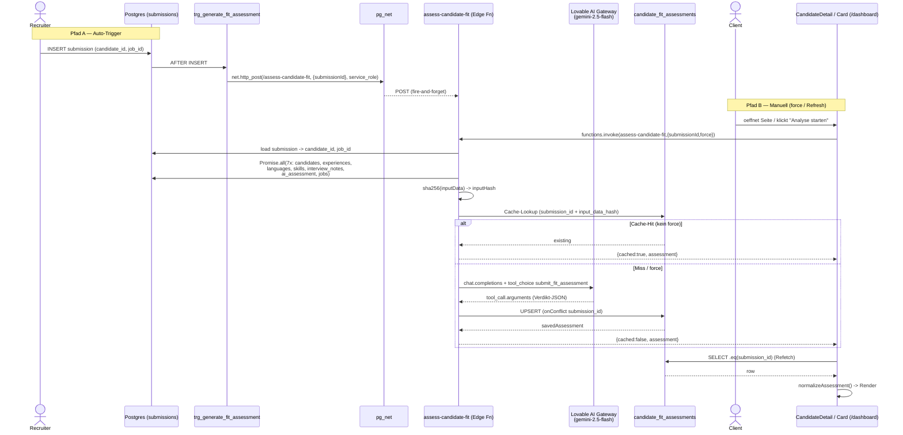

## 08. Fit-Assessment (KI-Eignung)

> **Status:** Juengstes Feature (Migrationen 2026-03-05 bis 2026-03-07). Backend ist **live**, im publizierten Frontend `matchunt.ai` ist die Client-Sicht (`CandidateFitAssessmentCard`) jedoch **nicht enthalten** — der Code existiert nur im Repository und ist (noch) nicht ausgerollt.

Das Fit-Assessment ist Matchunts evidenzbasierter Ersatz fuer das klassische Keyword-Matching: Statt Skills gegen Stellen-Tokens zu zaehlen, laesst es ein LLM (`google/gemini-2.5-flash` ueber das Lovable AI Gateway) die Passung zwischen **einem Kandidaten** und **einer konkreten Stelle** in einem strukturierten Verdikt bewerten — pro `submission` (= Kandidat-Job-Paar) genau ein Assessment. Das Ergebnis wird in der Client-Sicht (`/dashboard/candidates/:id`) als "Intelligente Fit-Analyse" gerendert.

### 8.1 Komponenten-Inventar

| Layer | Datei / Objekt | Rolle |
|-------|----------------|-------|
| Edge Function | `supabase/functions/assess-candidate-fit/index.ts` | Datensammlung, Caching, LLM-Call (Function-Calling), Persistenz |
| Tabelle | `public.candidate_fit_assessments` | 1 Zeile pro `submission_id` (UNIQUE), JSONB-Verdikt |
| Migration (Tabelle) | `supabase/migrations/20260306000000_candidate_fit_assessments.sql` | Schema, Indizes, RLS, `updated_at`-Trigger |
| Migration (Tabelle, Duplikat) | `supabase/migrations/20260305023057_a321331a-….sql` | **Identische** Tabellen-DDL — Reibungspunkt (siehe 8.8) |
| Migration (Auto-Trigger) | `supabase/migrations/20260307000000_fit_assessment_auto_trigger.sql` | `AFTER INSERT ON submissions` -> `pg_net`-Call |
| Migration (Trigger-Variante) | `supabase/migrations/20260306221420_f0ca94e8-….sql` | Robustere Trigger-Fn (`SET search_path`, NULL-Guard) |
| Normalizer | `src/lib/fitAssessmentNormalizer.ts` | Mappt Roh-DB-Zeile (Gemini-Schema) -> Frontend-Display-Typen |
| Hook | `src/hooks/useCandidateFitAssessment.ts` | Fetch + manuelle Generierung via `supabase.functions.invoke` |
| Card | `src/components/candidates/CandidateFitAssessmentCard.tsx` | Rendering: Verdikt-Header, Requirements, Gaps, Details |
| Render-Ort | `src/pages/dashboard/CandidateDetail.tsx:490` | Client-Sicht, bezieht `submissionId` aus `useClientCandidateView` |
| TS-Typen (DB) | `src/integrations/supabase/types.ts:973` | Generierte `candidate_fit_assessments`-Typen |
| Function-Config | `supabase/config.toml:233` | `[functions.assess-candidate-fit] verify_jwt = true` |

### 8.2 Input & Datensammlung

Der einzige funktionale Input ist `submissionId` (plus optional `force: boolean`). Aus der `submissions`-Zeile werden `candidate_id` und `job_id` aufgeloest (`index.ts:54-67`); danach werden **sieben** Datenquellen **parallel** geladen (`Promise.all`, `index.ts:72-88`):

| # | Tabelle | Query | Verwendung |
|---|---------|-------|------------|
| 1 | `candidates` | `.eq(id, candidate_id).single()` | Kerndaten (Skills, Seniority, Gehalt, `cv_ai_summary`, Zertifikate) |
| 2 | `candidate_experiences` | `.order(start_date desc)` | Berufserfahrung (Firma, Titel, Zeitraum, Beschreibung) |
| 3 | `candidate_languages` | alle | Sprachniveaus |
| 4 | `candidate_skills` | alle | Detail-Skills (Level, Jahre, Kategorie) |
| 5 | `candidate_interview_notes` | `.order(created_at desc).limit(1)` | Wechselmotivation, Gehalt, Karriereziel, Empfehlung |
| 6 | `candidate_ai_assessment` | `.maybeSingle()` | Bestehender Overall-Score / Risk / Recommendation |
| 7 | `jobs` | `.eq(id, job_id).single()` | Stelle (Beschreibung, `must_haves`, `nice_to_haves`, Gehalt, Remote) |

Fehlt **Kandidat oder Job**, bricht die Funktion mit `404` ab (`index.ts:98-103`). Fehlende Nebendaten (Experiences, Languages etc.) sind unkritisch — sie werden zu `[]`/`null` defaulted und im Prompt als "Keine Daten" markiert.

### 8.3 SHA-256-Caching

Aus einer kuratierten Teilmenge der gesammelten Daten wird ein deterministischer Cache-Key gebildet (`index.ts:106-115`):

1. Es wird ein `inputData`-JSON **nur aus den fuer die Bewertung relevanten Feldern** zusammengesetzt (z. B. `candidate.skills`, `experience_years`, `cv_ai_summary`; Experiences auf `company/title/start/end/desc` reduziert; Job auf `must_haves/nice_to_haves/…`). Volatile Felder wie `updated_at` sind bewusst **nicht** enthalten.
2. `inputHash = sha256(inputData)` (`index.ts:10-16`, WebCrypto, Hex-String).
3. Cache-Lookup (sofern `force` nicht gesetzt): `candidate_fit_assessments` mit `submission_id == submissionId` **und** `input_data_hash == inputHash` (`index.ts:118-131`). Bei Treffer -> sofortige Rueckgabe mit `{ cached: true }`, **kein** LLM-Call.

Konsequenz: Aendert sich ein bewertungsrelevantes Feld, aendert sich der Hash, der Cache greift nicht mehr und es wird neu generiert. `force: true` (Frontend-Button "Neu generieren") ueberspringt den Lookup komplett. Der Hash wird beim Upsert wieder mitgeschrieben (`index.ts:391`).

### 8.4 LLM-Call & Verdikt-Schema (Function-Calling)

Der Call geht an `https://ai.gateway.lovable.dev/v1/chat/completions` (`index.ts:197`) mit:

- **Model:** `google/gemini-2.5-flash`
- **System-Prompt** (`index.ts:134-141`): evidenzbasiert, nur vorliegende Daten, fehlende Daten = `insufficient_data` (kein Negativsignal), Antwort auf Deutsch.
- **User-Prompt** (`index.ts:143-194`): voll gerenderter Kandidat + Stelle als Markdown.
- **Function-Calling erzwungen:** `tool_choice: { type: "function", function: { name: "submit_fit_assessment" } }` (`index.ts:314`) — das LLM **muss** das strukturierte Tool aufrufen, Freitext ist ausgeschlossen.

Das `submit_fit_assessment`-Schema (`index.ts:209-313`) ist die kanonische Quelle des Verdikts:

| Feld | Typ | Werte / Constraints | Required |
|------|-----|---------------------|:--------:|
| `overall_verdict` | enum | `strong_fit` / `good_fit` / `partial_fit` / `weak_fit` / `no_fit` | ✅ |
| `overall_score` | int | 0–100 | ✅ |
| `executive_summary` | string | 2–4 Saetze DE | ✅ |
| `verdict_confidence` | enum | `high` / `medium` / `low` | ✅ |
| `requirement_assessments[]` | array | `{requirement, status(met/partially_met/not_met/insufficient_data), evidence, score}` | ✅ |
| `bonus_qualifications[]` | array | `{qualification, present:bool, evidence}` | ✅ |
| `gap_analysis[]` | array | `{gap, severity(critical/moderate/minor), mitigation}` | ✅ |
| `career_trajectory` | object | `{direction(upward/lateral/pivoting/unclear), consistency, explanation}` | ✅ |
| `implicit_competencies[]` | array | `{competency, evidence, confidence}` | ✅ |
| `motivation_fit` | object | `{score, assessment, key_drivers[], concerns[]}` | optional |
| `dimension_scores` | object | `technical_fit/experience_fit/seniority_fit` (req.), `location_fit/salary_fit/culture_fit` (opt.) | ✅ |
| `rejection_reasoning` | string | nur bei `weak_fit`/`no_fit` | optional |

**Fehlerbehandlung des Gateways** (`index.ts:318-350`): `429` -> "Rate limit erreicht", `402` -> "AI-Kredit-Limit erreicht", sonstige -> generischer `500`. Fehlt der Tool-Call in der Antwort -> `500` "AI returned no structured result".

### 8.5 Persistenz & Schema-Drift

Die geparsten Tool-Argumente werden per **Upsert** (`onConflict: "submission_id"`) in `candidate_fit_assessments` geschrieben (`index.ts:370-399`). Mit-persistiert werden Metadaten: `model_used`, `prompt_version: "v1"`, `input_data_hash`, `generation_time_ms`, `generated_at`, `generated_by`.

`generated_by` wird differenziert ermittelt (`index.ts:355-367`): Stammt der Bearer-Token aus dem `SERVICE_ROLE_KEY` (= Aufruf via `pg_net`-Trigger), bleibt es `null`; bei einem echten User-Token wird `auth.getUser()` aufgeloest.

**Wichtiger Schema-Drift:** Die Edge Function schreibt das **rohe Gemini-Schema** (`status`, `severity`, `direction`, `*_fit`), waehrend Frontend-Typen (`useCandidateFitAssessment.ts`) ein **anderes, "normalisiertes" Vokabular** erwarten (`verdict: fulfilled/partially_fulfilled/inferred_from_experience/trainable/gap`; `gap_severity: critical/significant/minor`; `trajectory_type`; `dimension_scores: technical/experience/leadership/cultural/growth_potential`). Diese Luecke schliesst **ausschliesslich** `fitAssessmentNormalizer.ts`.

### 8.6 Normalizer als Anti-Corruption-Layer

`normalizeAssessment(data)` (`fitAssessmentNormalizer.ts:308`) ist die einzige Uebersetzungsschicht DB->UI. Highlights der Mappings:

- `normalizeStatus`: `met` -> `fulfilled`, `partially_met` -> `partially_fulfilled`, `not_met`/`insufficient_data` -> `gap` (`:116-134`). Achtung: **`insufficient_data` kollabiert zu `gap`** — die im Prompt verlangte Unterscheidung "fehlende Daten != Negativsignal" geht in der UI verloren.
- `normalizeGapAnalysis`: `severity:critical` -> `gap_severity:critical` **und** `deal_breaker = true` (`:182-194`).
- `normalizeDimensionScores`: bildet die Gemini-Achsen auf UI-Achsen ab, u. a. **`seniority_fit -> leadership`** und **`location_fit -> growth_potential`** (`:290-302`) — semantisch fragwuerdiges Remapping (siehe 8.8).
- `evidence`: String -> Array `[evidence]`; `motivation_fit.score -> alignment_score`; Retention wird per Schwellwert abgeleitet (`>=70 high`, `>=40 medium`) (`:267-288`).

Der Normalizer akzeptiert bewusst **beide** Schema-Varianten (alt = Gemini-Raw, neu = bereits normalisiert) ueber `??`-Fallbacks, was eine spaetere Prompt/Schema-Migration ohne UI-Bruch erlaubt.

### 8.7 Vernetzung & Datenfluss

Es gibt **zwei** Eintrittspfade in die Edge Function:

1. **Auto-Trigger (Backend, fire-and-forget):** Jede neue `submissions`-Zeile feuert `AFTER INSERT` -> `trigger_generate_fit_assessment()` -> `pg_net`-`net.http_post` an `/functions/v1/assess-candidate-fit` mit `{ submissionId }` und Service-Role-Bearer (`20260307000000_*.sql:19-26`, robustere Variante `20260306221420_*.sql`). Ziel: Assessment ist **vorgeneriert**, bevor der Client die Seite oeffnet.
2. **Manueller Trigger (Frontend):** `useCandidateFitAssessment.generateAssessment()` ruft `supabase.functions.invoke('assess-candidate-fit', { body: { submissionId, force } })` (`useCandidateFitAssessment.ts:145`). Ausgeloest durch den "Analyse jetzt starten"- bzw. Refresh-Button der Card (`CandidateFitAssessmentCard.tsx:158, 207`).

**Lesepfad:** Hook -> direkter `SELECT` auf `candidate_fit_assessments` (`.eq(submission_id)`, `maybeSingle()`, `useCandidateFitAssessment.ts:119-123`) -> `normalizeAssessment` -> Card. Es gibt **keine** Realtime-Subscription; der Client sieht ein frisch auto-generiertes Assessment erst nach Mount/Refetch.

**RLS-Sichtbarkeit** (`20260306000000_*.sql:54-73`): Admins (`has_role admin`) -> alle; Recruiter -> Assessments **ihrer** Kandidaten (`candidates.recruiter_id = auth.uid()`); Clients -> **nur SELECT** fuer Submissions ihrer eigenen Jobs (`jobs.client_id = auth.uid()`). Trotz Recruiter-`FOR ALL`-Policy rendert **nur die Client-Sicht** die Card (`/dashboard`); in `src/pages/recruiter/*` und `src/pages/admin/*` gibt es **keine** Einbindung.

### 8.8 Reibungs- & Risikopunkte

| # | Bereich | Problem |
|---|---------|---------|
| F1 | **Auto-Trigger / Config** | `verify_jwt = true` (`config.toml:233`) steht im Konflikt mit dem `pg_net`-Aufruf, der einen Service-Role-**Bearer** (kein User-JWT) sendet. Je nach Gateway-Verhalten wird der Auto-Trigger-Call entweder abgewiesen oder umgeht JWT-Validierung — fragil und nicht offensichtlich. |
| F2 | **DB-Settings nie gesetzt** | Der Trigger liest `current_setting('app.settings.supabase_url'/'service_role_key')`. In **keiner** Migration werden diese GUCs per `ALTER DATABASE … SET` gesetzt. Die robuste Variante (`20260306221420`) loggt nur `RAISE WARNING` und gibt `RETURN NEW` zurueck — d. h. der Auto-Trigger **scheitert still** und es wird kein Assessment generiert, falls die Settings im Projekt fehlen. |
| F3 | **Doppelte Tabellen-Migration** | `20260305023057` und `20260306000000` legen `candidate_fit_assessments` **identisch** an (`CREATE TABLE` ohne `IF NOT EXISTS`). Bei sauberem Replay auf eine leere DB schlaegt die zweite Migration mit "relation already exists" fehl. |
| F4 | **Semantisches Achsen-Remapping** | `normalizeDimensionScores` mappt `seniority_fit -> leadership` und `location_fit -> growth_potential` (`fitAssessmentNormalizer.ts:296-301`). Die UI-Labels ("Senior.", "Potenzial") passen nicht zur Gemini-Semantik (Standort-Fit wird als "Wachstumspotenzial" angezeigt). |
| F5 | **`insufficient_data` -> `gap`** | `normalizeStatus` kollabiert `insufficient_data` und `not_met` beide auf `gap` (`:129-132`). Der System-Prompt verlangt explizit, fehlende Daten **nicht** als Negativsignal zu werten — in der UI erscheinen sie dennoch als rote "Luecke". |
| F6 | **Kein Realtime / Race** | Auto-Trigger ist async (fire-and-forget). Oeffnet der Client die Seite, bevor das LLM fertig ist, zeigt die Card "Analyse wird vorbereitet…" mit manuellem Fallback-Button; es gibt keine Subscription, die auf Fertigstellung reagiert. |
| F7 | **Trigger feuert auf ALLE Submissions** | Der `AFTER INSERT`-Trigger unterscheidet nicht nach Quelle/Status der Submission. Jede der ~15+ Edge Functions, die in `submissions` schreiben (z. B. `process-talent-hub-action`, `schedule-interview`), loest einen LLM-Call aus — potenziell Kosten/Rate-Limit-Druck ohne Throttling. |
| F8 | **`generated_by` vs. RLS** | Beim Service-Role-Upsert ist `generated_by = null`. Da die Edge Function mit Service-Role schreibt, greifen die RLS-Insert-Policies ohnehin nicht — die "Recruiters can manage"-Policy ist fuer den Schreibpfad praktisch wirkungslos (nur fuer direkte Client-Writes relevant, die es nicht gibt). |
| F9 | **Frontend nicht ausgerollt** | Card existiert nur im Repo, nicht in `matchunt.ai`. Auto-generierte Assessments sammeln sich potenziell in der DB an (Kosten), ohne dass ein Nutzer sie sieht. |

### 8.9 Offene Fragen

- Sind `app.settings.supabase_url` / `app.settings.service_role_key` im Produktiv-Supabase-Projekt manuell per `ALTER DATABASE` gesetzt? Falls nein, ist der Auto-Trigger faktisch inaktiv (F2).
- Wie verhaelt sich das Lovable Gateway konkret bei `verify_jwt=true` + Service-Role-Bearer aus `pg_net` (F1)? Wird der Call durchgelassen?
- Welche der beiden Tabellen-Migrationen (`20260305` vs. `20260306`) ist im Remote tatsaechlich angewandt — und ist die jeweils andere als "applied" markiert, sodass F3 beim Replay nicht auftritt?
- Soll `prompt_version` ("v1") jemals fuer A/B-Tests/Migration genutzt werden? Aktuell ist es konstant und steuert nichts.
- Ist das gleichzeitige Bestehen von `candidate_ai_assessment` (Input #6, alter Pfad) und `candidate_fit_assessments` (neu) gewollt, oder soll ersteres abgeloest werden?
- Soll das Feature throttled/entkoppelt werden (Queue statt Trigger-pro-Insert), bevor es im Frontend ausgerollt wird (F7/F9)?
