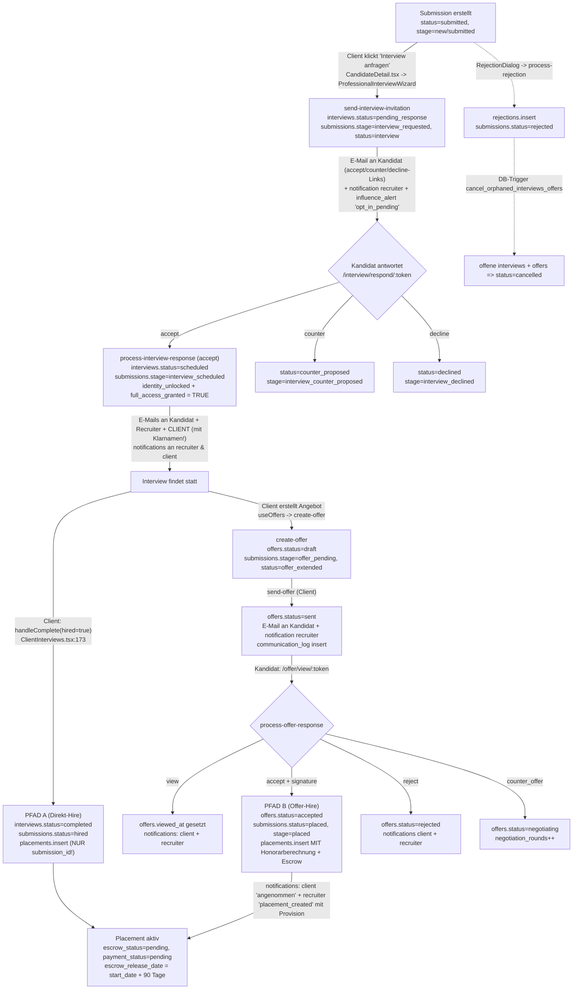
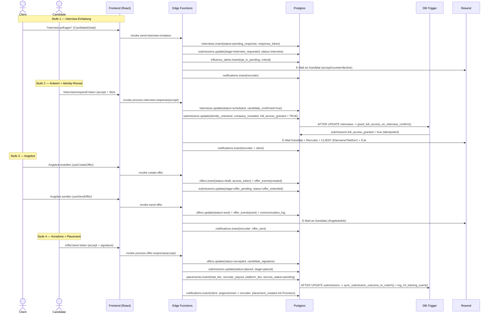

## 09. Pipeline: Submission, Interview, Offer, Placement

# 09. Pipeline: Submission -> Interview -> Offer -> Placement

> Domäne: Kern-Recruiting-Pipeline der Matchunt-Plattform. Ein Kandidat wandert vom Recruiter-Submission über Interview-Terminierung und Angebot bis zum erfolgsbasierten Placement. Diese Sektion beschreibt die **State-Machine**, die **Edge-Function-Vernetzung**, die **DB-Trigger** und vor allem die **Benachrichtigungen/E-Mails** an jeder Stufe.
>
> Quelle = Code. Stand der Analyse: Branch `main`. Tabellen in `supabase/migrations/*.sql`, Functions in `supabase/functions/<name>/index.ts`, Frontend in `src/pages/{dashboard,recruiter}/` und `src/components/{interview,offers,placements,references,rejection}/`.

---

## 9.1 Überblick & beteiligte Akteure

Die Pipeline verbindet drei Personas plus zwei externe Token-Portale (öffentlich, ohne Login):

| Akteur | Einstieg | Rolle in der Pipeline |
|--------|----------|----------------------|
| **Recruiter** (`/recruiter/*`) | `RecruiterSubmissions.tsx`, `SubmissionDetail.tsx` | Reicht Kandidaten ein, holt Opt-In ein, fordert Referenzen an, sieht Status. |
| **Client** (`/dashboard/*`) | `CandidateDetail.tsx`, `ClientJobDetail.tsx`, `ClientInterviews.tsx`, `ClientOffers.tsx`, `ClientPlacements.tsx` | Lädt zum Interview ein, erstellt/sendet Angebote, „stellt ein". |
| **Admin** (`/admin/*`) | `AdminInterviews.tsx`, `AdminPlacements.tsx` | Read-only-Monitoring der Pipeline. |
| **Kandidat** (Token-Portal) | `/interview/respond/:token`, `/interview/select/:token`, `/offer/view/:token` | Antwortet auf Interview-Einladung, signiert Angebot. Kein Account nötig. |
| **Referenzgeber** (Token-Portal) | `/reference/:token` | Füllt Referenzformular aus. |

Routing der öffentlichen Token-Portale: `src/App.tsx:447-451`.

```
/interview/respond/:token  -> InterviewResponsePage  (App.tsx:448)
/interview/select/:token   -> SelectSlot             (App.tsx:447)
/offer/view/:token         -> ViewOffer              (App.tsx:449)
/reference/:token          -> ProvideReference       (App.tsx:451)
```

---

## 9.2 Die Tabellen der Domäne

| Tabelle | Definiert in | Zweck | Wichtigste Statusfelder |
|---------|--------------|-------|--------------------------|
| `submissions` | `20251204171610_*.sql:75` (Basis) + Erweiterungen | Zentrale Pipeline-Entität, Bindeglied job ↔ candidate ↔ recruiter | `status` (default `submitted`), `stage` |
| `interviews` | `20251204171610_*.sql:91` (Basis) + `20251204225412_*.sql` (Token/Slots) | Interview-Termin pro Submission | `status` (default `pending`), `proposed_slots` JSONB, `selection_token`, `response_token` |
| `offers` | `20251204215330_*.sql:13` | Jobangebot pro Submission | `status` (default `draft`), `access_token`, `negotiation_rounds` |
| `offer_events` | `20251204215330_*.sql:65` | Audit-Trail jeder Offer-Aktion | `event_type`, `actor_type` |
| `placements` | `20251204171610_*.sql:106` + `20251204225412_*.sql:49` (Escrow) | Erfolgreiche Vermittlung + Honorar-/Escrow-Buchung | `payment_status` (default `pending`), `escrow_status` |
| `rejections` + `rejection_templates` | `20251204215330_*.sql:125/139` | Absage-Records + Vorlagen | `rejection_stage`, `reason_category` |
| `reference_requests` | `20251204231510_*.sql:173` | Referenzanfrage mit Token | `status` (`pending`/`completed`/`declined`/`expired`) |
| `reference_responses` | `20251204231510_*.sql:194` | Referenzantwort + KI-Analyse | `ai_summary`, `ai_risk_flags` JSONB |
| `interview_intelligence` | (gen. types / `generate-interview-prep`) | KI-Interview-Vorbereitung pro Interview | `candidate_prep`, `interviewer_guide` (upsert on `interview_id`) |
| `communication_log` | `20251204215330_*.sql:76` | Versand-Log (Offer-E-Mails) | `channel`, `status` |
| `match_outcomes` / `ml_training_events` | `20260122214002_*.sql:7` | ML-Outcome-Tracking, gespeist per Trigger | `actual_outcome`, `final_outcome` |

Realtime ist aktiviert für: `submissions`, `interviews`, `offers`, `offer_events`, `notifications` (`ALTER PUBLICATION supabase_realtime ADD TABLE ...`). Placements **nicht**.

---

## 9.3 Die State-Machine (status + stage)

Achtung: Es gibt **zwei parallele Statusfelder** auf `submissions`:

- `submissions.status` — grobkörnig (`submitted` → `interview` → `offer_extended` → `placed` / `rejected` / `hired`).
- `submissions.stage` — feinkörnige UI-Pipeline (`new` → `submitted` → `screening` → `interview_requested` → `candidate_opted_in` → `interview_scheduled` → `offer_pending` → `placed`).

Beide werden an unterschiedlichen Stellen unabhängig gesetzt und **driften auseinander** (siehe Friction Points 9.8). Die UI-Pipeline-Reihenfolge ist hardcodiert in `src/pages/recruiter/SubmissionDetail.tsx:47-64` (`PIPELINE_STAGES` + `getStageIndex`).

### Statusfluss-Diagramm



### Status-Wertebereiche (aus dem Code)

`interviews.status` (kein DB-CHECK, frei gesetzt durch Functions):
`pending` (DB-Default) · `pending_response` (send-interview-invitation) · `scheduled` · `counter_proposed` · `declined` · `completed` · `cancelled` · `no_show`.

`offers.status`: `draft` → `sent` → `viewed`-(nur `viewed_at`, Status bleibt `sent`) → `accepted` / `rejected` / `negotiating` / `cancelled` / `expired` / `withdrawn`.

`submissions.status` (relevante Werte): `submitted`, `interview`, `offer_extended`, `placed`, `hired`, `rejected`, `client_rejected`, `withdrawn`, `expired`.

---

## 9.4 Edge Functions im Detail

### Interview-Subdomäne

| Function | Aufgerufen von | Schreibt | E-Mail / Notification |
|----------|----------------|----------|------------------------|
| `send-interview-invitation` | `ProfessionalInterviewWizard.tsx:51` (Client) | `interviews` (insert, `status=pending_response`, `response_token`), `submissions` (`stage=interview_requested`, `status=interview`), `notifications`, `influence_alerts` | **Resend** direkt an Kandidat (HTML mit accept/counter/decline-Links). `from: noreply@matchunt.ai`. Anonymisiert (nur Vorname + „`<Branche>`-Unternehmen"). |
| `process-interview-response` | `InterviewResponsePage.tsx:163/190/215` (Kandidat, Token) | `interviews` (`status=scheduled/counter_proposed/declined`), `submissions` (`identity_unlocked`, `company_revealed`, `full_access_granted` = TRUE bei accept), `notifications` | **Resend** an Kandidat, Recruiter UND **Client mit Klarnamen + E-Mail + Telefon** (Identity-Reveal Stufe 2). iCal-Attachment. |
| `schedule-interview` | `useInterviewScheduling.ts` + `NoShowReportDialog.tsx:68` + `CancelInterviewDialog.tsx:76` + `SelectSlot.tsx:111` | `interviews` (slots/scheduled/no_show), `submissions` (`full_access_granted`), `notifications`, `client_notifications`, `platform_events` | `supabase.functions.invoke('send-email', ...)` (Template-basiert, **try/catch silently ignored**). Eigenes `selection_token`-System. |
| `generate-interview-prep` | `useInterviewIntelligence.ts:90` | `interview_intelligence` (upsert on `interview_id`), `notifications` | KI-Generierung via **Lovable AI Gateway** (`google/gemini-2.5-flash`). Notification `interview_prep_ready` an Recruiter. |
| `process-interview-notes` | `useAIAssessment.ts:71`, `QuickInterviewSummary.tsx:80` | `candidate_ai_assessment` (upsert on `candidate_id`) | KI via `api.lovable.dev` (`gpt-4o-mini`). Keine E-Mail. |

> **Zwei konkurrierende Interview-Scheduling-Mechanismen** existieren parallel:
> 1. **Wizard-Pfad** (`send-interview-invitation` + `process-interview-response`): nutzt `response_token`, generiert E-Mail per **Resend direkt**, Slots als `{datetime, status:'available'}`. Das ist der aktive Pfad aus `CandidateDetail.tsx`.
> 2. **Slot-Token-Pfad** (`schedule-interview` mit Aktionen `generate-slots`/`select-slot`/`confirm-attendance`/`send-reminders`/`report-no-show`): nutzt `selection_token`, E-Mails per `send-email`-Function, Slots als `{datetime, status:'pending'}`. Aktiv für No-Show/Cancel und die separate `SelectSlot`-Seite.
>
> Beide schreiben dieselbe `interviews`-Tabelle, aber mit **unterschiedlichen Statuswerten, Token-Spalten und Slot-Status-Strings** — ein erheblicher Konsistenzrisiko-Faktor.

### Offer-Subdomäne

| Function | Aufgerufen von | Schreibt | E-Mail / Notification |
|----------|----------------|----------|------------------------|
| `create-offer` | `useOffers.ts:138` (`useCreateOffer`) | `offers` (insert, `status=draft`, `access_token`, `expires_at`), `offer_events` (`created`), `submissions` (`stage=offer_pending`, `status=offer_extended`) | Keine E-Mail. Auth-Check: `submission.jobs.client_id === user.id`. |
| `send-offer` | `useOffers.ts:170` (`useSendOffer`) | `offers` (`status=sent`, `sent_at`), `offer_events` (`sent`), `communication_log`, `notifications` | **Resend via fetch** (Plaintext-E-Mail). `from: noreply@lovable.app`. Notification `offer_sent` an Recruiter. |
| `process-offer-response` | `useOffers.ts:208` (`useProcessOfferResponse`) — Kandidat via Token | `offers` (`accepted/rejected/negotiating`), `offer_events`, `submissions` (`status=placed, stage=placed` bei accept), **`placements` (insert mit Honorarberechnung)**, `notifications` | Keine E-Mail (nur In-App-Notifications an client + recruiter). |

**Honorarlogik** (`process-offer-response/index.ts:125-143`):
```
totalFee        = round(salary_offered * jobs.fee_percentage/100)           // Default 20%
recruiterPayout = round(totalFee * jobs.recruiter_fee_percentage / jobs.fee_percentage)  // 15/20
platformFee     = totalFee - recruiterPayout
escrowReleaseDate = (offer.start_date || now) + 90 Tage
```
Diese Berechnung existiert **nur** im Offer-Accept-Pfad. Der Direkt-Hire-Pfad (`ClientInterviews.handleComplete`) erzeugt ein Placement **ohne** Honorar (siehe 9.8).

### Placement-Subdomäne

Es gibt **keine** dedizierte `create-placement`-Edge-Function. Placements entstehen ausschließlich per direktem `supabase.from('placements').insert(...)` an **zwei** Stellen:
- `process-offer-response/index.ts:134` (vollständig, mit Fees/Escrow) — **kanonischer Pfad**.
- `src/pages/dashboard/ClientInterviews.tsx:190` (`handleComplete`, nur `submission_id` + `payment_status:'pending'`) — **Bypass**.

`ClientPlacements.tsx` ist read-only (`fetchPlacements`, `supabase.from('placements').select(...)`, `src/pages/dashboard/ClientPlacements.tsx:49`). Down­stream hängt die Auszahlung an `process-payout` / `stripe-connect` (eigene Finanzdomäne, hier nicht im Fokus).

### Rejection- & Reference-Subdomäne

| Function | Aufgerufen von | Schreibt | E-Mail |
|----------|----------------|----------|--------|
| `process-rejection` | `RejectionDialog.tsx:50` | `rejections`, `submissions` (`status=rejected`), `notifications`, `activity_logs` | `send-email`-Function (Template `rejection_notification`, try/catch ignored). |
| `request-reference` | `useReferenceChecks.ts:95` (`requestReference`) | `reference_requests` (insert, `access_token`, 14d Ablauf) | **Resend via fetch**, `from: RecruitFlow <noreply@recruitflow.app>`. Link `${origin}/reference/${token}`. |
| `analyze-reference` | `useReferenceChecks.ts:198` (nach Formular-Submit) | `reference_responses` (`ai_summary`, `ai_risk_flags`) | Keine. KI via **Lovable AI Gateway** (`gemini-2.5-flash`) mit deterministischem Fallback-Scoring. |

---

## 9.5 Sequenzdiagramm: Glücklicher Pfad (Interview → Offer → Placement)



---

## 9.6 Datenbank-Trigger (das „unsichtbare" Verhalten)

Diese Trigger feuern automatisch bei Statuswechseln und sind essenziell für das Pipeline-Verhalten:

| Trigger | Tabelle/Event | Funktion | Effekt |
|---------|---------------|----------|--------|
| `on_submission_opt_in` | `submissions` BEFORE UPDATE | `reveal_company_on_opt_in()` (`20260122110726_*.sql:20`) | **Triple-Blind Stufe 1**: bei `status='candidate_opted_in'` → `company_revealed=true`. |
| `on_interview_confirmed` | `interviews` AFTER UPDATE | `grant_full_access_on_interview_confirm()` (`20260122110726_*.sql:44`) | **Triple-Blind Stufe 2**: bei `candidate_confirmed=true` → `submissions.full_access_granted=true` (idempotent, redundant zur Function-Logik). |
| `trigger_cancel_orphaned_interviews_offers` | `submissions` AFTER UPDATE | `cancel_orphaned_interviews_offers()` (`20260124170911_*.sql:48`) | Bei `status IN (rejected, withdrawn, hired, client_rejected)` → setzt offene `interviews` und `offers` automatisch auf `cancelled`. Verhindert verwaiste Records. |
| `trigger_sync_outcome` | `submissions` AFTER UPDATE | `sync_submission_outcome_to_match()` (`20260122214002_*.sql:57`) | Schreibt finalen Outcome in `match_outcomes` (ML-Feedback-Loop). |
| `trigger_log_ml_event_insert/update` | `submissions` INSERT/UPDATE | `log_ml_training_event()` (`20260122214002_*.sql:79`) | Snapshot in `ml_training_events` für ML-Training. |
| `trg_generate_fit_assessment` | `submissions` AFTER INSERT | `trigger_generate_fit_assessment()` (`20260307000000_*.sql:12`) | Fire-and-forget `net.http_post` → `assess-candidate-fit` Edge Function (Pre-Generierung der Fit-Bewertung). |
| `submissions_activity_log` / `placements_activity_log` / `interviews_activity_log` | jeweils INSERT/UPDATE | Activity-Logging | Audit-Trail. |
| `client_interviews_view` / `client_offers_view` | Views (security_invoker) | `20260124170911_*.sql:3/27` | Filtern bereits beendete/abgelehnte Submissions aus der Client-Sicht heraus. |

Wichtig: Die Triggerlogik in `grant_full_access_on_interview_confirm` **dupliziert** die Reveal-Logik, die `process-interview-response` und `schedule-interview` ohnehin schon manuell ausführen — defensive Redundanz, aber doppelte Wahrheit.

---

## 9.7 Benachrichtigungen & E-Mail — die Kanäle pro Stufe

Es existieren **drei** Benachrichtigungsmechanismen nebeneinander:

1. **`notifications`** (user-zentriert, `user_id`) — Recruiter & Client In-App, realtime-aktiviert.
2. **`client_notifications`** (`client_id`, `action_url`, `submission_id`) — nur von `schedule-interview` benutzt.
3. **E-Mail** — uneinheitlich: teils **Resend direkt** (`send-interview-invitation`, `process-interview-response`, `send-offer`, `request-reference`), teils über die **`send-email`-Function** (`schedule-interview`, `process-rejection`).

| Stufe | Auslöser | E-Mail an | Mechanismus | Absender |
|-------|----------|-----------|-------------|----------|
| Interview-Einladung | `send-interview-invitation` | Kandidat | Resend (HTML) | `noreply@matchunt.ai` |
| Interview bestätigt | `process-interview-response` (accept) | Kandidat + Recruiter + **Client (Klarname)** | Resend (HTML + iCal) | `noreply@matchunt.ai` |
| Slot-Vorschlag (Alt-Pfad) | `schedule-interview` (generate-slots) | Recruiter | `send-email`-Function (try/catch) | (Template) |
| Interview-Reminder | `schedule-interview` (send-reminders) | Client + Recruiter | nur `client_notifications` + `notifications` (kein echtes E-Mail-Send im Code!) | — |
| Angebot gesendet | `send-offer` | Kandidat | Resend (fetch, Plaintext) | `noreply@lovable.app` |
| Angebot angenommen | `process-offer-response` (accept) | — (nur In-App) | `notifications` | — |
| Absage | `process-rejection` | Kandidat | `send-email`-Function (try/catch) | (Template) |
| Referenzanfrage | `request-reference` | Referenzgeber | Resend (fetch, HTML) | `noreply@recruitflow.app` |

> **Drei verschiedene Absenderdomänen** (`matchunt.ai`, `lovable.app`, `recruitflow.app`) im selben Produkt — klares Branding-/Zustellbarkeitsproblem.

---

## 9.8 Friction Points & Risiken (im Code beobachtet)

1. **Dualer Placement-Pfad mit Honorar-Diskrepanz.** `ClientInterviews.handleComplete` (`src/pages/dashboard/ClientInterviews.tsx:173-201`) erstellt bei „eingestellt" ein Placement mit **nur** `submission_id` + `payment_status` und setzt `submissions.status='hired'`. Der kanonische Pfad `process-offer-response` (`supabase/functions/process-offer-response/index.ts:134`) berechnet hingegen `total_fee`/`recruiter_payout`/`platform_fee`/`escrow_release_date`. Ergebnis: Placements ohne Honorar und ohne Escrow, je nachdem, wie der Client den Kandidaten „einstellt". Da `placements.submission_id` UNIQUE ist, kollidiert der Direkt-Hire zudem mit einem evtl. später akzeptierten Offer (insert schlägt fehl).

2. **`status` vs. `stage` driften auseinander.** `send-interview-invitation` setzt `status='interview'` **und** `stage='interview_requested'`. `process-offer-response` setzt `status='placed', stage='placed'`, aber `ClientInterviews.handleComplete` setzt nur `status='hired'` (kein `stage`). `process-rejection` setzt nur `status='rejected'` (kein `stage`). Die UI-Pipeline (`SubmissionDetail.tsx:47`) liest `stage`, das Outcome-Tracking (`sync_submission_outcome_to_match`) liest `status`. Quellen der Wahrheit divergieren.

3. **Zwei konkurrierende Interview-Scheduling-Systeme** auf einer Tabelle. `send-interview-invitation`/`process-interview-response` (`response_token`, Slot-Status `available`) vs. `schedule-interview` (`selection_token`, Slot-Status `pending`/`accepted`). Unterschiedliche Statuswerte (`pending_response` vs. `pending`) und Slot-Schemata führen zu fragilen Filtern; `ClientInterviews` filtert z. B. hart auf `meeting_type` (`video/teams/meet`), während die Wizard-Function `meeting_format` UND `meeting_type` schreibt.

4. **Interview-Reminder versenden keine echte E-Mail.** `schedule-interview/sendReminderEmail` (`supabase/functions/schedule-interview/index.ts:530-572`) loggt nur per `console.log` und schreibt `client_notifications`/`notifications`, ruft aber **keinen** Resend-/`send-email`-Aufruf auf. Zudem existiert **kein Cron-Job**, der `send-reminders` triggert (die pg_cron-Jobs in `20260225200000_*.sql:133` rufen nur influence/escalation-Engines). Reminder werden also faktisch nie automatisch ausgelöst.

5. **Identity-Reveal teilweise vor Opt-In.** `process-interview-response` (accept) setzt `full_access_granted=true` und mailt dem Client **sofort Klarnamen, E-Mail, Telefon** des Kandidaten (`supabase/functions/process-interview-response/index.ts:215-260`). Das Opt-In des Kandidaten (`stage=candidate_opted_in`, vom Recruiter via `SubmissionDetail.handleConfirmOptIn:265`) ist ein **separater, manueller** Schritt, der hier nicht erzwungen wird. Die Triple-Blind-Garantie hängt damit allein an der Annahme-Aktion, nicht am dokumentierten Consent.

6. **Schwache Token-Generierung.** `send-interview-invitation`, `send-offer`, `create-offer` erzeugen Tokens via `Math.random()` über ein 62-Zeichen-Alphabet (`generateToken`/`generateAccessToken`, z. B. `supabase/functions/send-interview-invitation/index.ts:28`). Für öffentliche, unauthentifizierte Portale, die Klarnamen und Gehaltsangaben freischalten, ist `Math.random()` nicht kryptografisch sicher. `request-reference` und `schedule-interview` nutzen dagegen `crypto.randomUUID()` — uneinheitlich.

7. **Fehlende Idempotenz / E-Mail im Erfolgsfall.** `process-offer-response` (accept) versendet **keine** Bestätigungs-E-Mail an Kandidat/Client (nur In-App `notifications`), während Interview-Bestätigungen Mails senden — inkonsistente Candidate Experience. Außerdem fehlt im Accept-Pfad eine Prüfung, ob bereits ein Placement existiert (UNIQUE-Constraint-Crash möglich nach Direkt-Hire).

8. **`process-rejection` mailt an die falsche Adresse.** Template `rejection_notification` wird mit `to: submission.candidate.email` versendet, das `data`-Objekt setzt aber zusätzlich `recruiter_email: submission.candidate.email` (`supabase/functions/process-rejection/index.ts:108-121`) — der Kandidat erhält die Absage direkt, obwohl der Kommentar „Send … to recruiter" lautet. Im Triple-Blind-Kontext potenziell ungewollte Direktkommunikation.

9. **Stille Fehler.** Mehrere E-Mail-Aufrufe sind in `try/catch` gekapselt, die den Fehler nur `console.log`en (`schedule-interview:429`, `process-rejection:122`). Versandfehler bleiben für Nutzer unsichtbar; es gibt kein Retry/Dead-Letter (außer der separaten `resend-webhooks`-Function).

10. **Frontend-Direktschreibzugriff umgeht Business-Logik.** `ClientInterviews.handleComplete/handleNoShow` und `handleSave` schreiben `interviews`/`submissions`/`placements` **direkt** per `supabase.from(...).update()`, statt `schedule-interview`/`process-offer-response` zu nutzen. Dadurch werden Notifications, `offer_events`, Honorarberechnung und Activity-Logs übersprungen — die Edge-Function-Schicht wird teilweise entwertet.

---

## 9.9 Kern-Vernetzungen (Frontend → Function → Tabelle)

| Frontend-Trigger | Edge Function | Primär geschriebene Tabellen |
|------------------|---------------|------------------------------|
| `ProfessionalInterviewWizard.tsx:51` | `send-interview-invitation` | `interviews`, `submissions`, `notifications`, `influence_alerts` |
| `InterviewResponsePage.tsx:163/190/215` | `process-interview-response` | `interviews`, `submissions`, `notifications` |
| `useInterviewScheduling.ts` / `SelectSlot.tsx:111` / `NoShowReportDialog.tsx:68` / `CancelInterviewDialog.tsx:76` | `schedule-interview` | `interviews`, `submissions`, `notifications`, `client_notifications`, `platform_events` |
| `useInterviewIntelligence.ts:90` | `generate-interview-prep` | `interview_intelligence`, `notifications` |
| `useAIAssessment.ts:71` / `QuickInterviewSummary.tsx:80` | `process-interview-notes` | `candidate_ai_assessment` |
| `useOffers.ts:138` (`useCreateOffer`) | `create-offer` | `offers`, `offer_events`, `submissions` |
| `useOffers.ts:170` (`useSendOffer`) | `send-offer` | `offers`, `offer_events`, `communication_log`, `notifications` |
| `useOffers.ts:208` (`useProcessOfferResponse`) | `process-offer-response` | `offers`, `offer_events`, `submissions`, **`placements`**, `notifications` |
| `RejectionDialog.tsx:50` | `process-rejection` | `rejections`, `submissions`, `notifications`, `activity_logs` |
| `useReferenceChecks.ts:95` | `request-reference` | `reference_requests` |
| `useReferenceChecks.ts:198` (nach Formular) | `analyze-reference` | `reference_responses` |
| `ClientInterviews.tsx:173/190` (Direkt, ohne Function) | — | `interviews`, `submissions`, `placements` |

---

## 9.10 Offene Fragen

- Welcher der beiden Interview-Scheduling-Pfade ist der **strategisch gewollte**? `schedule-interview` (Slot-Token, `send-email`) wirkt wie der ältere; `send-interview-invitation` (Resend direkt) wie der neuere, aktiv aus `CandidateDetail`. Soll `schedule-interview` außer No-Show/Cancel deprecaten?
- Soll der **Direkt-Hire** in `ClientInterviews.handleComplete` ganz entfernt werden zugunsten des Offer-Flows, oder muss er ein vollständiges Placement (inkl. Fees) erzeugen?
- Wer/was triggert in Produktion die **Interview-Reminder** (`schedule-interview` action `send-reminders`)? Aktuell gibt es keinen Cron-Eintrag dafür.
- Ist die `placements.submission_id`-UNIQUE-Constraint mit Mehrfach-Angeboten pro Submission vereinbar (z. B. nach `negotiating` → neues Offer)?
- Wird `submissions.stage` als kanonische Pipeline-Wahrheit etabliert, und werden alle Schreiber (`process-rejection`, Direkt-Hire) entsprechend nachgezogen?
- Soll der Identity-Reveal an `submissions.consent_confirmed`/`opt_in_response` gekoppelt werden, statt allein an die Interview-Annahme?
- Konsolidierung auf **eine** Absenderdomäne und **einen** E-Mail-Mechanismus (Resend vs. `send-email`-Function) — gibt es dafür schon eine Roadmap?
