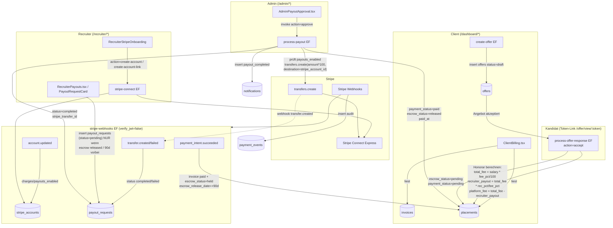
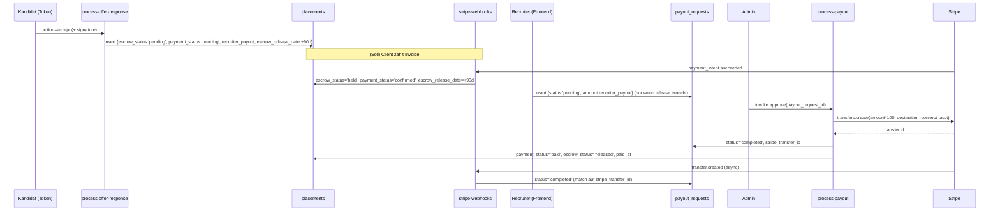

## 10. Finanzen, Stripe & Auszahlungen

> Domänen-Analyse für das CTO-Team ("Matchunt"). Quelle der Wahrheit ist der Quellcode unter `supabase/functions/`, `supabase/migrations/` und `src/`. Stand: Branch `main`, ~81 Edge Functions / 93 Migrationen.

Diese Domäne implementiert das **erfolgsbasierte Honorar-Modell** der Plattform: Bei einer erfolgreichen Einstellung (Placement) entsteht ein Honorar (`total_fee`), das in einen Plattform-Anteil (`platform_fee`) und eine Recruiter-Provision (`recruiter_payout`) aufgeteilt wird. Die Recruiter-Provision durchläuft eine **90-Tage-Escrow-Periode**, wird vom Recruiter angefordert, vom Admin genehmigt und via **Stripe Connect (Express)** ausgezahlt. Parallel dazu existiert das **deal-health-Scoring**, das den Fortschritt eines Deals bewertet und Drop-Off-Risiken früh erkennt.

> **Wichtigster Befund vorab:** Die Finanz-Domäne ist nur in der *Auszahlungs-Hälfte* (Recruiter ← Stripe Connect) konsistent implementiert. Die *Einnahme-Hälfte* (Client → Plattform via Stripe Charge/Invoice) ist **nicht durchgängig verdrahtet**: Es existiert keine Edge Function, die `invoices` erzeugt oder einen `PaymentIntent` anlegt. Der Webhook `payment_intent.succeeded` matcht auf `stripe_payment_intent_id`, das aber an keiner Stelle gesetzt wird. Details in §10.7.

---

### 10.1 Datenmodell (Tabellen)

| Tabelle | Definiert in | Zweck | Schlüsselspalten |
|---|---|---|---|
| `placements` | `supabase/migrations/20251204171610_*.sql:106`, erweitert in `20251204195741_*.sql:49` | Erfolgreiche Einstellung; trägt die Honorar-Aufteilung | `submission_id` (UNIQUE), `agreed_salary`, `total_fee`, `platform_fee`, `recruiter_payout`, `payment_status`, `escrow_status`, `escrow_release_date`, `paid_at` |
| `invoices` | `supabase/migrations/20251204182100_*.sql:106`, erweitert in `20251204195741_*.sql:46` | Client-Rechnung pro Placement | `placement_id`, `client_id`, `invoice_number` (UNIQUE), `amount`, `tax_amount`, `total_amount`, `status`, `stripe_payment_intent_id`, `stripe_invoice_id`, `currency`, `pdf_url` |
| `stripe_accounts` | `supabase/migrations/20251204195741_*.sql:4` | Stripe-Connect-Konto je Recruiter | `user_id`, `stripe_account_id` (UNIQUE), `account_type`, `charges_enabled`, `payouts_enabled`, `details_submitted`, `onboarding_complete` |
| `payout_requests` | `supabase/migrations/20251204195741_*.sql:18` | Auszahlungsanfrage Recruiter → Admin → Stripe | `placement_id`, `recruiter_id`, `amount`, `currency`, `status` (`pending`→`approved`→`processing`→`completed`/`failed`/`cancelled`), `stripe_transfer_id`, `approved_by`, `failure_reason` |
| `payment_events` | `supabase/migrations/20251204195741_*.sql:34` | Idempotenz-/Audit-Log für Stripe-Webhooks | `stripe_event_id` (UNIQUE), `event_type`, `payload` (JSONB), `processed`, `error_message` |
| `deal_health` | `supabase/migrations/20251204205344_*.sql:2` | Scoring/Risiko je Submission | `submission_id` (UNIQUE), `health_score`, `risk_level`, `drop_off_probability`, `bottleneck`, `recommended_actions`, `risk_factors` |
| `offers` | `supabase/migrations/20251204215330_*.sql:13` | Angebot mit Gehalt; Vorstufe zum Placement | `salary_offered`, `bonus_amount`, `equity_percentage`, `status`, `access_token` |
| `jobs` (Honorar-Parameter) | `supabase/migrations/20251204171610_*.sql:28` | Trägt die Fee-Sätze pro Job | `fee_percentage` DEFAULT **20.00**, `recruiter_fee_percentage` DEFAULT **15.00** |
| `user_roles.custom_fee_percentage` | `supabase/migrations/20251204184027_*.sql:10` | Recruiter-individueller Fee-Satz (Admin pflegt ihn) | wird im Frontend gesetzt, aber **nie** in Honorar-Berechnung verwendet (§10.4) |
| `profiles.bank_iban` | `supabase/migrations/20251204173818_*.sql:84` | Manuelle IBAN — Parallel-Pfad zu Stripe (§10.8) | nur in `AdminPayments` gelesen |

**RLS-Kurzfassung:**
- `stripe_accounts`: User sieht/ändert nur eigenes Konto; Admin `ALL`.
- `payout_requests`: Recruiter darf eigene `SELECT` + `INSERT`; Admin `ALL`. → Der Recruiter erstellt die Anfrage clientseitig direkt per `insert` (kein Edge-Function-Gate).
- `payment_events`: `INSERT WITH CHECK (true)` (System), `ALL` nur Admin.
- `placements`: nur `SELECT` für beteiligten Recruiter/Client und `ALL` für Admin — **kein INSERT/UPDATE-Policy für client/recruiter** (relevant für den Bug in §10.6).
- `invoices`: Client `SELECT` eigene; Admin `ALL`.

---

### 10.2 Edge Functions im Überblick

| Function | `verify_jwt` (`config.toml`) | Auth-Modell | Schreibt in | Liest aus |
|---|---|---|---|---|
| `stripe-connect` | `true` | ANON-Client + `getUser()` (Recruiter-Kontext) | `stripe_accounts` | `profiles`, `stripe_accounts` |
| `process-payout` | `true` | ANON-Client + **Admin-Check** über `user_roles`; dann SERVICE-ROLE für Writes | `payout_requests`, `placements`, `notifications` | `payout_requests`, `stripe_accounts`, `placements` |
| `stripe-webhooks` | `false` | **Signatur-Verifikation** via `STRIPE_WEBHOOK_SECRET`; SERVICE-ROLE | `payment_events`, `invoices`, `placements`, `stripe_accounts`, `payout_requests` | – |
| `create-offer` | `true` | SERVICE-ROLE + manuelle `getUser()` + Ownership-Check | `offers`, `offer_events`, `submissions` | `submissions`, `jobs`, `candidates` |
| `process-offer-response` | `false` | **Token-basiert** (`access_token` des Angebots), SERVICE-ROLE | `offers`, `offer_events`, `submissions`, **`placements` (Honorar-Berechnung!)**, `notifications` | `offers` + Joins |
| `deal-health` | `true` | SERVICE-ROLE | `deal_health` (upsert) | `submissions`, `platform_events`, `sla_deadlines`, `user_behavior_scores` |

`STRIPE_SECRET_KEY` (Stripe API), `STRIPE_WEBHOOK_SECRET`, `SUPABASE_SERVICE_ROLE_KEY` sind die kritischen Secrets dieser Domäne.

---

### 10.3 Geldfluss end-to-end (Soll-Architektur)



**Schritt-für-Schritt (Happy Path):**
1. **Angebot** – Client legt über `create-offer` (`supabase/functions/create-offer/index.ts`) ein `offers`-Record an (Status `draft`), generiert `access_token`, Kandidaten-Link `…/offer/view/<token>`.
2. **Annahme** – Kandidat akzeptiert über den Token-Link → `process-offer-response` (`action=accept`). Hier wird das Honorar berechnet und das `placements`-Record erzeugt (`supabase/functions/process-offer-response/index.ts:123-144`).
3. **Zahlung Client → Plattform** – *(Soll)* Client bezahlt die `invoice`; `payment_intent.succeeded` setzt Invoice `paid`, Placement `escrow_status=held`, `escrow_release_date = now + 90 Tage` (`supabase/functions/stripe-webhooks/index.ts:46-84`). **Ist-Lücke siehe §10.7.**
4. **Onboarding Recruiter** – `RecruiterStripeOnboarding` → `useStripeConnect` → `stripe-connect` (`create-account`, dann `create-account-link`). Express-Konto, Land `DE`, `business_type=individual` (`supabase/functions/stripe-connect/index.ts:84-95`).
5. **Auszahlungs-Anfrage** – Sobald Escrow abgelaufen (`escrow_status` in `held`/`released` und Release-Datum erreicht), erlaubt `PayoutRequestCard.canRequestPayout()` den `insert` in `payout_requests` (`src/components/payment/PayoutRequestCard.tsx:38-67`).
6. **Genehmigung** – Admin in `AdminPayoutApproval` → `process-payout` (`action=approve`). Prüft `payouts_enabled`, ruft `stripe.transfers.create({ amount: amount*100, destination: stripe_account_id })`, setzt `payout_requests.status=completed`, `placements.payment_status=paid / escrow_status=released / paid_at`, erstellt `notification` (`supabase/functions/process-payout/index.ts:115-160`).
7. **Webhook-Bestätigung** – Stripe sendet `transfer.created`; Webhook matcht auf `stripe_transfer_id` und setzt erneut `completed` (idempotent-ähnlich, §10.7).

---

### 10.4 Honorar-/Gebührenlogik (die eine echte Berechnung)

Die **einzige** belastbare Honorarberechnung liegt in `process-offer-response/index.ts:123-126`:

```ts
const totalFee        = Math.round(offer.salary_offered * (offer.jobs.fee_percentage || 20) / 100);
const recruiterPayout = Math.round(totalFee * (offer.jobs.recruiter_fee_percentage || 15) / (offer.jobs.fee_percentage || 20));
const platformFee     = totalFee - recruiterPayout;
```

Interpretation der Defaults (`fee_percentage=20`, `recruiter_fee_percentage=15`):
- **Gesamthonorar** = 20 % des Jahresgehalts (an die Plattform fakturierbar).
- **Recruiter-Anteil** = `totalFee * 15/20` = **75 % des Honorars** (≙ 15 % des Gehalts).
- **Plattform-Marge** = `totalFee - recruiterPayout` = **25 % des Honorars** (≙ 5 % des Gehalts).

Konsequenzen / Reibung:
- `recruiter_fee_percentage` ist hier **kein** eigenständiger Gehalts-Prozentsatz, sondern wird als Anteil *innerhalb* des `fee_percentage` interpretiert. Setzt ein Admin `recruiter_fee_percentage > fee_percentage`, würde `recruiter_payout > total_fee` und `platform_fee` **negativ**.
- `user_roles.custom_fee_percentage` (pro Recruiter, im `AdminRecruiters` gepflegt) fließt **nicht** in diese Formel ein — nur die Job-Spalten zählen. Der „individuelle Fee“ ist also reine Anzeige ohne finanzielle Wirkung.
- Es gibt **keine MwSt./Tax-Berechnung** im Honorar-Pfad. `invoices.tax_amount` existiert in der Tabelle, wird aber nirgends befüllt.

---

### 10.5 Escrow- & Auszahlungs-Zustandsmaschine



`escrow_status` Wertebereich (CHECK in `20251204195741_*.sql:49`): `pending | held | released | disputed | refunded`. Hinweis: `disputed`/`refunded` sind im Schema vorgesehen, werden aber von **keiner** Function/Frontend je gesetzt → toter Zustand.

Die `available`-Berechnung im Recruiter-Frontend (`src/pages/recruiter/RecruiterPayouts.tsx:99-108`) und die Freigabe-Gate-Logik (`PayoutRequestCard.tsx:38-46`) implementieren die 90-Tage-Regel **doppelt und identisch clientseitig** — es gibt keine serverseitige Durchsetzung (§10.6).

---

### 10.6 Vernetzung Frontend → Edge Function → Tabellen

| Frontend (Persona) | Aufruf | Edge Function / direkter Zugriff | Effekt |
|---|---|---|---|
| `RecruiterStripeOnboarding` (`src/components/payment/RecruiterStripeOnboarding.tsx`) via `useStripeConnect` | `supabase.functions.invoke('stripe-connect', { action })` | `stripe-connect` | Connect-Konto anlegen, Onboarding-Link, Status-Sync |
| `RecruiterPayouts` / `PayoutRequestCard` (Recruiter) | **direkter** `supabase.from('payout_requests').insert(...)` | – (RLS: Recruiter INSERT) | Auszahlungsanfrage `pending` |
| `AdminPayoutApproval` (Admin) | `invoke('process-payout', { action:'approve'/'reject' })` | `process-payout` | Stripe-Transfer + Status-Updates + Notification |
| `AdminDealHealth` (Admin) | `invoke('deal-health', { calculate_all:true })` | `deal-health` | Batch-Scoring aller aktiven Submissions |
| Komponenten via `useDealHealth` | `invoke('deal-health', { submission_id })` | `deal-health` | Einzel-Scoring + Upsert |
| `ClientBilling` (Client) | `from('invoices')` + `from('placements')` (read-only) | – | Rechnungs-/Fee-Übersicht |
| `RecruiterEarnings` (Recruiter) | `from('submissions').select(...placements...)` | – | Earnings-Aggregation (pending/confirmed/paid) |
| `AdminInvoices` (Admin) | `from('invoices')` + `update status` | – | Rechnungen manuell auf `paid`/`overdue` setzen |
| `AdminPayments` (Admin) | `from('placements').update(payment_status='paid')` | – | **Manueller** Bezahlt-Pfad parallel zu Stripe (§10.8) |

**Trigger / Realtime / Cron in dieser Domäne:**
- **Webhook** `stripe-webhooks` ist der einzige asynchrone Eingang von Stripe (öffentlich, `verify_jwt=false`, Signatur-geprüft).
- **Kein pg_cron** für `deal-health` oder `process-payout`. Die Cron-Jobs in `20260225200000_unified_task_inbox.sql` betreffen nur `influence-engine`, `escalation-engine`, `influence-score-calc`, `cleanup-expired-alerts`. Deal-Health läuft also **ausschließlich on-demand** (Admin-Button bzw. Detailansicht) — es gibt keine automatische Neuberechnung und keinen Cron, der Escrow-Fristen oder fällige Auszahlungen anstößt.
- `RecruiterEarnings` verspricht im UI „Auszahlungen erfolgen monatlich zum 15.“ (`src/pages/recruiter/RecruiterEarnings.tsx`) — dafür existiert **kein** Scheduler.

---

### 10.7 Kritische Lücke: Einnahme-Seite (Client → Plattform) nicht verdrahtet

Der gesamte Auszahlungs-Mechanismus hängt davon ab, dass `placements.escrow_status` auf `held` springt. Das passiert **nur** in `stripe-webhooks` bei `payment_intent.succeeded`, und zwar über:

```ts
.from('invoices').update({ status:'paid', stripe_payment_intent_id: paymentIntent.id })
  .eq('stripe_payment_intent_id', paymentIntent.id)   // matcht auf bereits gesetzten Wert
```

Problem-Kette (im Code verifiziert):
1. **Niemand legt `invoices` an.** Es gibt keinen `from('invoices').insert(...)` in `src/` oder `supabase/functions/` (nur Reads in `ClientBilling`, `AdminInvoices`, `AdminDashboard`, `gdpr-export` und das Webhook-`update`). Rechnungen entstehen also nie automatisch.
2. **Niemand erzeugt einen Stripe `PaymentIntent`** für den Client. `stripe-connect` macht nur Connect-Onboarding; es gibt keine `paymentIntents.create`/Checkout-Session im Repo.
3. Folglich ist `invoices.stripe_payment_intent_id` immer `NULL`, der Webhook-`.eq()`-Match greift nie, und `escrow_status` bleibt auf `pending`.
4. Daher kann `PayoutRequestCard.canRequestPayout()` (verlangt `held`/`released`) **nie** wahr werden → der reguläre Auszahlungsfluss ist ohne manuelle DB-Eingriffe blockiert.

Faktisch funktioniert der Geld-Eingang heute nur über **manuelle** Admin-Aktionen: `AdminPayments` setzt `placements.payment_status='paid'` direkt; `AdminInvoices` setzt `invoices.status='paid'` direkt — beide ohne Stripe und ohne `escrow_status` zu berühren.

Zusätzliche Webhook-Schwächen:
- **Idempotenz nur teilweise:** `payment_events` hat `stripe_event_id UNIQUE`, aber der Handler macht ein blindes `insert` ohne `onConflict` und ohne Vorabprüfung `processed=true`. Bei Stripe-Retries → Unique-Violation bzw. doppelte Verarbeitung (z. B. doppelte Escrow-Verlängerung).
- **`transfer.failed` ist kein offizielles Stripe-Event** (korrekt wäre `transfer.reversed` bzw. `payout.failed` auf dem verbundenen Konto). Der `transfer.failed`-Case dürfte nie feuern.
- `transfer.created` matcht auf `stripe_transfer_id`, das `process-payout` bereits selbst gesetzt hat → der Webhook ist redundant und reagiert nicht auf Transfers, die außerhalb von `process-payout` entstehen.

---

### 10.8 Doppelte / divergierende Placement-Erzeugung (Datenkonsistenz-Risiko)

`placements` wird an **drei** Stellen erzeugt — mit **unterschiedlichen** Feldern, und zwei davon sind fehlerhaft:

| Ort | Honorar berechnet? | Problem |
|---|---|---|
| `supabase/functions/process-offer-response/index.ts:134` | **Ja** (`total_fee`, `recruiter_payout`, `platform_fee`, Escrow) | Korrekt — der eigentliche Pfad |
| `src/pages/dashboard/ClientInterviews.tsx:190` | **Nein** — nur `submission_id` + `payment_status:'pending'` | (a) keine Fees → Recruiter-Provision = `NULL`; (b) Insert läuft als **Client mit ANON-Key**, aber `placements` hat **keine INSERT-RLS-Policy** für Clients → Insert schlägt unter RLS fehl |
| `supabase/functions/process-talent-hub-action/index.ts:245` | **Nein** | Insert verwendet Spalten `job_id, candidate_id, recruiter_id, client_id, status, placement_date`, die in `placements` **nicht existieren** (laut `src/integrations/supabase/types.ts` Row-Typ und Migrationen). Insert würde mit „column does not exist“ fehlschlagen |

Der `placements`-Row-Typ (generiert, `src/integrations/supabase/types.ts:6516`) enthält ausschließlich: `agreed_salary, created_at, escrow_release_date, escrow_status, id, paid_at, payment_status, platform_fee, recruiter_payout, start_date, submission_id, total_fee`. Es gibt **kein** `job_id`, `recruiter_id`, `client_id`, `status`, `placement_date`. Damit sind die beiden Nebenpfade entweder tote bzw. fehlschlagende Codepfade — und falls ein Placement doch ohne Fees entsteht, zeigen `RecruiterEarnings`/`AdminPayments` einen Provisions-Betrag von 0/„-“.

---

### 10.9 deal-health-Scoring (Risiko/Bottleneck)

`deal-health` (`supabase/functions/deal-health/index.ts`) ist **kein** Geldfluss, aber die wirtschaftliche Frühwarnung für gefährdete Deals (Pipeline-Wert-Schutz).

Gewichteter Health-Score (`calculateDealHealth`, Zeile ~120):
```
healthScore = phaseScore*0.25 + slaScore*0.25 + activityScore*0.20 + behaviorScore*0.15 + matchScore*0.15
```
- `phaseScore`: Ist-Alter vs. Soll-Tage je Stage (`submitted:2, in_review:5, shortlisted:7, interview:14, offer:7`).
- `slaScore`: Abzüge für `breached` (−30), `warning_sent` (−15), aktive Deadlines (−5).
- `activityScore`: Tage seit letztem `platform_events`-Eintrag (gestaffelt 100→10).
- `behaviorScore`: `100 - Ø(risk_score Recruiter, Client)` aus `user_behavior_scores`.
- `matchScore`: `submission.match_score` (Fallback 50).

Ergebnis-Mapping: `risk_level` (`low ≥80, medium ≥60, high ≥40, critical <40`), `drop_off_probability`, `bottleneck` (+ verantwortlicher `bottleneck_user_id`), deutschsprachige `recommended_actions` / `risk_factors` / `ai_assessment` (regelbasiert, **keine LLM-Nutzung**). Persistiert via `upsert` auf `deal_health` (`onConflict: submission_id`).

Lesepfade: `useDealHealth` (Einzel-Submission, `src/hooks/useDealHealth.ts`) und `useDealHealthList` (alle, sortiert nach Score) → `AdminDealHealth`. RLS erlaubt beteiligten Recruitern/Clients Lesezugriff, System `INSERT/UPDATE WITH CHECK (true)`.

---

### 10.10 Reibungs- & Risikopunkte (Zusammenfassung)

| # | Bereich | Schweregrad | Kurzbeschreibung |
|---|---|---|---|
| 1 | Einnahme-Pfad | **kritisch** | Kein `invoices.insert` und kein Stripe-`PaymentIntent`/Checkout → `escrow_status` erreicht nie `held` → regulärer Payout-Flow blockiert (§10.7). |
| 2 | Placement-Erzeugung | **hoch** | Drei divergierende Insert-Pfade; zwei referenzieren nicht-existente Spalten bzw. verletzen RLS und erzeugen Placements ohne Fees (§10.8). |
| 3 | Auszahlungs-Autorisierung | **hoch** | `payout_requests` werden clientseitig per `insert` erzeugt; Betrag (`amount`) kommt aus dem Frontend und wird in `process-payout` **nicht** gegen `placement.recruiter_payout` validiert → manipulierbarer Auszahlungsbetrag. |
| 4 | Webhook-Idempotenz | **hoch** | Blindes `payment_events.insert` ohne Conflict-Handling/Processed-Check + nicht-existentes `transfer.failed`-Event (§10.7). |
| 5 | Plattform-Marge | **mittel** | `recruiter_payout > total_fee` möglich → negative `platform_fee`; keine Validierung von `recruiter_fee_percentage ≤ fee_percentage` (§10.4). |
| 6 | Fee-Governance | **mittel** | `custom_fee_percentage` (Admin-Feld) hat keinerlei Wirkung auf die Berechnung; UI-Versprechen „Auszahlung monatlich zum 15.“ ohne Scheduler. |
| 7 | Parallel-Pfade | **mittel** | Manuelle Wege (`AdminPayments` → `payment_status=paid`, `AdminInvoices` → `status=paid`, `profiles.bank_iban`) laufen am Stripe/Escrow-Modell vorbei → inkonsistente Finanzstände. |
| 8 | Steuern/Währung | **niedrig** | `tax_amount` nie befüllt; `currency` überall hart `EUR` trotz vorhandener Spalte. |

---

### 10.11 Offene Fragen

- Ist der Client-Charge bewusst (noch) manuell, oder fehlt eine geplante `create-invoice` / Stripe-Checkout-Function? Wer soll `invoices` + `stripe_payment_intent_id` setzen?
- Soll `process-payout` den `amount` zwingend aus `placement.recruiter_payout` ableiten (statt aus dem Request-Body)?
- Welche der drei Placement-Erzeugungs-Pfade ist kanonisch? Sollen `ClientInterviews`/`process-talent-hub-action` entfernt bzw. auf `process-offer-response` umgeleitet werden?
- Soll `custom_fee_percentage` die Job-Fees überschreiben, und wenn ja, mit welcher Präzedenz?
- Wer setzt jemals `escrow_status = disputed/refunded` (Dispute-/Rückerstattungs-Prozess fehlt vollständig)?
- Gibt es einen vorgesehenen Cron für Escrow-Reife / monatlichen Auszahlungslauf, oder bleibt alles admin-getriggert?
