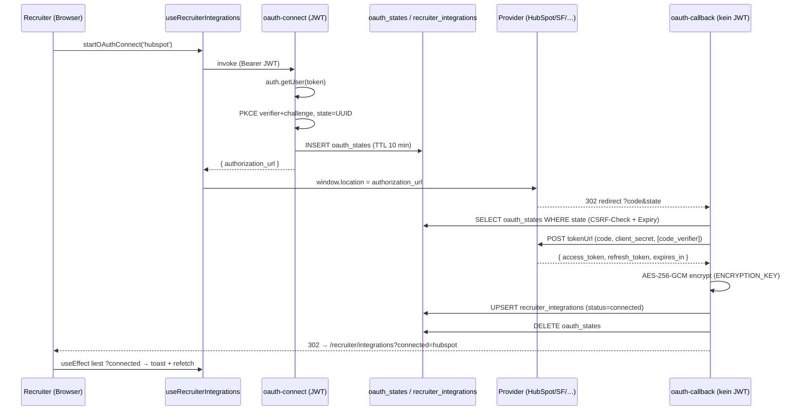
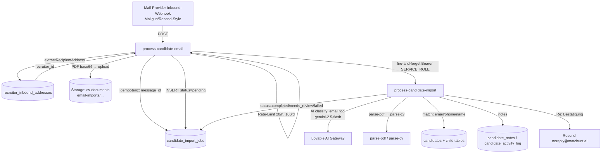

## 11. Integrationen (HubSpot, OAuth, E-Mail, Crawling)

> Domäne: Externe Integrationen der Matchunt-Plattform. Universelles OAuth 2.0 für CRMs/ATS,
> E-Mail-Ingestion (`@inbound.matchunt.ai` → Kandidaten), Resend für ausgehende Mails + Webhooks,
> Outreach-Sequenzen mit Guardrails und Web-Crawling (Firecrawl) zur Lead-Anreicherung.
>
> Quelle der Wahrheit: Edge-Function- und SQL-Code. Diese Sektion verweist überall mit
> `pfad/datei.ts:zeile`. Wo der Code von `PROJECT_ANALYSIS.md` abweicht, gilt der Code.

### 11.1 Überblick & Teilsysteme

Die Domäne zerfällt in **fünf** weitgehend unabhängige Teilsysteme, die nur lose über gemeinsame
Tabellen und Resend verbunden sind:

| # | Teilsystem | Kern-Functions | Persona | Hauptzweck |
|---|------------|----------------|---------|------------|
| 1 | **Universelles CRM/ATS-OAuth** | `oauth-connect`, `oauth-callback`, `integration-api-key`, `integration-disconnect`, `hubspot-sync` | recruiter | Recruiter verbinden ihr CRM/ATS und importieren Kontakte als Kandidaten |
| 2 | **E-Mail-Ingestion (Candidate Import)** | `process-candidate-email` → `process-candidate-import` | recruiter | CV-Forwarding an `r_xxx@inbound.matchunt.ai` legt Kandidaten automatisch an |
| 3 | **Ausgehende Transaktions-Mails** | `send-email` (Resend) | system | Template-basierte Recruiting-Mails mit Open/Click-Tracking |
| 4 | **Outreach-Sequenzen (B2B)** | `import-outreach-leads`, `process-outreach-queue`, `track-outreach-engagement`, `process-inbound-email`, `process-inbound-reply`, `resend-webhooks` | admin | Kalt-Akquise von Hiring-Companies inkl. Reply-Klassifikation & Suppression |
| 5 | **Web-Crawling / Enrichment** | `crawl-career-page`, `crawl-career-pages-bulk`, `crawl-company-data`, `enrich-company-from-domain` | admin | Firmendaten + Live-Jobs (Firecrawl) zur Lead-Qualifizierung |

Wichtige Klarstellung gegenüber der Task-Annahme: Es gibt **zwei getrennte Inbound-Pfade**, die
oft verwechselt werden:

- **Candidate-Import** (`process-candidate-email`): Empfänger ist `…@inbound.matchunt.ai`, Sender
  ist der **Recruiter selbst**. Ziel-Tabelle: `candidates`.
- **Outreach-Reply** (`process-inbound-email` / `process-inbound-reply`): Sender ist ein
  **kontaktierter Lead**. Ziel-Tabelle: `outreach_leads` / `outreach_conversations`. Diese Functions
  legen **keine** Kandidaten an.

---

### 11.2 Universelles OAuth 2.0 für CRMs/ATS

#### 11.2.1 Provider-Registry

Die zentrale Konfiguration liegt in `supabase/functions/_shared/provider-config.ts`. Pro Provider
werden Auth-/Token-URL, Scopes, Client-ID/-Secret-Env-Var, PKCE-Support und Default-Token-Lifetime
definiert (`provider-config.ts:15`).

| Provider | Auth-Typ | PKCE | Token-Lifetime (default) | Scope | Status |
|----------|----------|------|--------------------------|-------|--------|
| **HubSpot** | OAuth | nein | 1800 s (30 min) | `crm.objects.contacts.read` | aktiv, voll implementiert |
| **Salesforce** | OAuth | **ja** | (nutzt `expires_in`) | `api refresh_token` | OAuth-Flow generisch, Sync fehlt |
| **Lever** | OAuth | nein | – | `offline_access contacts:read:admin` | OAuth-Flow generisch, Sync fehlt |
| **Bullhorn** | OAuth | nein | 600 s (10 min) | `""` | OAuth-Flow generisch, Sync fehlt |
| Greenhouse | API-Key | – | – | – | nur `connect`, kein `test`/Sync |
| Personio | Client-Credentials | – | – | – | nur `connect`, kein Sync |
| Jobvite / iCIMS / Workday | – | – | – | – | `comingSoon` (nur UI) |

Die Frontend-Registry (`src/types/integrations.ts:44`, `PROVIDERS[]`) spiegelt dieselben Provider
und steuert Logo, Beschreibung und `comingSoon`-Flag. Nur HubSpot besitzt eine produktive
Daten-Sync-Implementierung (`hubspot-sync`).

#### 11.2.2 OAuth-Flow (PKCE + State)

Schritt-für-Schritt-Referenzen:

1. **Initiierung** (`oauth-connect/index.ts`): JWT wird über `auth.getUser(token)` validiert
   (`oauth-connect/index.ts:54`). PKCE-Verifier/-Challenge werden via Web-Crypto erzeugt
   (`:12`, `:18`), ein CSRF-`state` als UUID. Beides wird mit **10-Minuten-TTL** in `oauth_states`
   persistiert (`:94`–`:106`). Die Authorization-URL wird inkl. Scopes und – falls
   `supportsPKCE` – `code_challenge`/`code_challenge_method=S256` gebaut (`:117`–`:135`). Opportunistisch
   wird `cleanup_expired_oauth_states()` per RPC aufgerufen (`:141`).
2. **Callback** (`oauth-callback/index.ts`): Läuft **ohne JWT** (`config.toml`: `oauth-callback
   verify_jwt = false`), da es ein reiner Browser-Redirect ist; Sicherheit kommt allein aus dem
   `state`-Lookup (`:44`–`:61`). Code→Token-Tausch gegen `config.tokenUrl` (`:93`), PKCE-Verifier wird
   nur bei `supportsPKCE` mitgeschickt (`:87`). Tokens werden **anwendungsseitig verschlüsselt**
   (`encryptToken`, `:117`/`:121`) und per `upsert(onConflict: "user_id,provider")` in
   `recruiter_integrations` geschrieben (`:139`–`:155`). Provider-Metadaten wie Salesforce
   `instance_url` landen in `provider_metadata` (`:129`–`:135`). Alle Fehlerpfade redirecten auf
   `/recruiter/integrations?error=…` (`:16`).

#### 11.2.3 Token-Verschlüsselung & On-Demand-Refresh

- **Krypto** (`_shared/encryption.ts`): AES-256-GCM über Web-Crypto. `ENCRYPTION_KEY` muss ein
  64-Zeichen-Hex-String (32 Byte) sein (`encryption.ts:57`). Format des Ciphertext-Strings:
  `base64(iv[12] ‖ ciphertext)` (`:30`–`:33`). Es wird **kein** separater Auth-Tag-Handling-Code
  benötigt, da GCM ihn in den Ciphertext integriert.
- **Refresh** (`_shared/token-refresh.ts`): `getValidToken()` ist der zentrale Token-Accessor für
  alle datenkonsumierenden Functions. Logik:
  - `auth_type === 'api_key'` → einfach entschlüsseln und zurückgeben (`token-refresh.ts:33`).
  - OAuth-Token gültig (> 5 min Restlaufzeit) → entschlüsseln und zurückgeben (`:48`).
  - sonst Refresh gegen `tokenUrl` mit `grant_type=refresh_token` (`:82`), neue Tokens
    verschlüsseln/speichern, ggf. rotierten Refresh-Token übernehmen (`:136`). Bei fehlendem
    Refresh-Token wird die Integration auf `status=expired` gesetzt (`:60`), bei fehlgeschlagenem
    Refresh auf `status=error` (`:101`).

#### 11.2.4 HubSpot-Sync (die einzige produktive Daten-Integration)

`hubspot-sync/index.ts` ist JWT-geschützt und kennt zwei Actions:

- `fetch_contacts` (`:56`): Lädt die Recruiter-Integration (`provider='hubspot'`, `status='connected'`).
  **Ohne** Integration werden **Demo-Kontakte** zurückgegeben (`:69`, `demo:true`) – für Onboarding/
  Sales-Demos. Mit Integration: `getValidToken()` → `GET /crm/v3/objects/contacts` (`:86`). Bei `401`
  wird die Integration auf `status=expired` gesetzt (`:101`). `last_synced_at` wird aktualisiert (`:124`).
- `import_contact` (`:137`): Dedup über `candidates(email, recruiter_id)` (`:139`), sonst INSERT in
  `candidates` (`:155`) plus Eintrag in `candidate_activity_log` (`activity_type='hubspot_import'`, `:174`).

Frontend: `src/components/candidates/HubSpotImportDialog.tsx` orchestriert einen 5-Schritt-Wizard
(`fetch → select → gdpr → importing → complete`). Der Import läuft **client-seitig sequenziell** –
pro Kontakt ein eigener `invoke('hubspot-sync', {action:'import_contact'})`-Call in einer
`for`-Schleife (`HubSpotImportDialog.tsx:100`). Nach erfolgreichem Batch wird ein
**DSGVO-Consent** in `consents` geschrieben (`subject_type='recruiter'`,
`consent_type='candidate_data_processing'`, `:131`). Der GDPR-Gate (`step==='gdpr'`) erzwingt drei
Checkboxen (Rechtsgrundlage, Kandidat informiert, Daten relevant) bevor `handleImport` aktiv wird (`:355`).

#### 11.2.5 API-Key / Client-Credentials & Disconnect

- `integration-api-key/index.ts` (`action:'connect'`): Verschlüsselt entweder `apiKey` (→
  `auth_type='api_key'`) oder `clientId`+`clientSecret` (→ `auth_type='client_credentials'`) und
  upsertet in `recruiter_integrations` (`integration-api-key/index.ts:57`–`:95`). `action:'test'` ist
  **ein Stub** und gibt immer `success:true` mit „not yet implemented" zurück (`:107`).
- `integration-disconnect/index.ts`: Scoped auf `(id, user_id)` (`:50`). Bei OAuth + vorhandener
  `revokeUrl` (nur Salesforce in der Registry) wird der Token **best-effort** revoked (`:74`), dann
  die Zeile gelöscht (`:88`). Token-Revocation-Fehler sind nicht-kritisch (`:81`).

Frontend-Hook `src/hooks/useRecruiterIntegrations.ts` kapselt alle vier Functions
(`startOAuthConnect`, `connectApiKey`, `connectClientCredentials`, `disconnectIntegration`) und
behandelt explizit den „Edge Function nicht deployed"-Fall (`isEdgeFunctionNotDeployed`,
`useRecruiterIntegrations.ts:9`) sowie das `?connected=`/`?error=`-Callback-Parsing beim Mount (`:86`).

---

### 11.3 E-Mail-Ingestion: `@inbound.matchunt.ai` → Kandidaten

Jeder Recruiter erhält automatisch eine eindeutige Inbound-Adresse
`r_<first8(user_id)>@inbound.matchunt.ai`. Vergabe per Trigger
`on_recruiter_role_created` → `auto_create_inbound_address()` auf `user_roles`
(`20260224120000_email_ingestion_tables.sql:120`/`:135`) plus Backfill für Bestands-Recruiter (`:111`).

Zwei-stufige Verarbeitung (beide `verify_jwt = false`, da Webhook-Empfänger eines Mail-Providers):

**Stufe 1 – `process-candidate-email/index.ts`** (synchron, schnell):

1. Sender/Empfänger/Body/Attachments aus dem Provider-Payload extrahieren – tolerant gegenüber
   Mailgun/Resend-Feldnamen (`:52`–`:58`). `extractRecipientAddress` parst `Name <email>` (`:18`).
2. Empfänger → Recruiter via `recruiter_inbound_addresses` (`:81`); `is_active`-Check (`:95`).
3. **Idempotenz** über `message_id` gegen `candidate_import_jobs` (`:106`).
4. **Rate-Limit**: max. 20 Imports/Stunde pro Recruiter (`:124`–`:137`). (Der 100/Tag-Limit aus dem
   Kommentar ist **nicht** implementiert – siehe Frictions.)
5. Nur **PDF**-Attachments ≤ 10 MB; base64-Decode → Upload nach Storage-Bucket `cv-documents` unter
   `email-imports/<recruiterId>/<ts>-<name>` (`:151`–`:204`).
6. INSERT `candidate_import_jobs` (`status='pending'`, `:208`).
7. **Fire-and-forget**-Aufruf von `process-candidate-import` mit `Bearer SERVICE_ROLE_KEY` (`:241`).

**Stufe 2 – `process-candidate-import/index.ts`** (asynchron, KI-lastig):

- State-Machine: `pending → processing → classified → completed | needs_review | failed`
  (`:564`, `:629`, `:841`).
- **AI-Klassifikation** via Lovable-Gateway (`google/gemini-2.5-flash`) mit Function-Calling-Tool
  `classify_email` (`:99`/`:582`). Klassen: `new_candidate | candidate_update | candidate_notes |
  candidate_with_notes | multi_candidate | unprocessable`. Heuristische Overrides danach (mehrere
  PDFs ⇒ `multi_candidate`; keine PDFs ⇒ Downgrade) (`:610`–`:620`). Fallback bei AI-Fehler (`:597`).
- **PDF-Pipeline**: pro Anhang `parse-pdf` (Text) → `parse-cv` (strukturierte Daten), beide intern per
  Service-Role-`fetch` (`:651`/`:671`).
- **Kandidaten-Matching** (`matchCandidate`, `:153`): E-Mail (0.99) → Phone (0.90) → Name exakt (0.80)
  → Name fuzzy (0.60/0.40), immer **innerhalb `recruiter_id`** und an die Confidence-Schwellen
  gebunden.
- `saveParsedCandidate` (`:267`) ist ein **Server-Port von `useCvParsing.saveParsedCandidate`** und
  schreibt `candidates` + Kindtabellen (`candidate_experiences`, `_educations`, `_languages`,
  `_skills`) sowie ein versioniertes `candidate_documents` (`:415`). `import_source='email_import'`.
- Notizen → `candidate_notes` (`source='email_import'`, `import_job_id`) + `candidate_activity_log`
  (`createCandidateNote`, `:433`).
- **Bestätigungs-Mail** „Re: …" via **Resend direkt** (`from: Matchunt <noreply@matchunt.ai>`, `:506`).

`candidate_notes` wurde dafür um `source` und `import_job_id` erweitert
(`20260224120000_email_ingestion_tables.sql:94`).

---

### 11.4 Ausgehende Transaktions-Mails (`send-email`)

`send-email/index.ts` ist der zentrale **Template-Mailer** (`verify_jwt = true`) und wird von vielen
Domänen aufgerufen (Interview, Opt-In, Submission, Rejection, Talent-Hub). Ablauf:

- Template-Registry inline (`templates`, `send-email/index.ts:42`) mit ~11 deutschsprachigen
  HTML-Templates und `{platzhalter}`-Subject-Interpolation (`:291`).
- **Tracking**: Vor dem Versand wird ein `email_events`-Datensatz erzeugt (`status='pending'`, `:304`),
  dessen ID für (a) einen 1×1-Tracking-Pixel (`getTrackingPixelUrl`, `:21`) und (b) das Umschreiben
  aller `href`-Links auf `track-candidate-engagement?type=link_click&redirect=…` (`wrapLinksForTracking`,
  `:27`) genutzt wird – allerdings **nur**, wenn `submissionId`/`candidateId` mitgegeben wurde (`:323`).
- Versand über `resend.emails.send` (`:333`). Danach `email_events.status='sent'` inkl. `resend_id`
  (`:343`) und Inkrement von `candidate_behavior.emails_sent` (`:354`).
- Fehler werden als `email_events.status='failed'` geloggt (`:388`).

> ⚠️ Der Absender ist hier `Recruiting Platform <onboarding@resend.dev>` (`:334`) – die
> **Resend-Sandbox-Domain**, nicht `matchunt.ai`. Alle anderen Mailer (`process-candidate-import`,
> Interview-Functions) nutzen `noreply@matchunt.ai`. Siehe Frictions.

`track-candidate-engagement` (separate Function, `verify_jwt = false`) ist das Pendant zu
`track-outreach-engagement` für den Transaktions-Mail-Pfad und bedient die Pixel-/Click-Redirects.

---

### 11.5 Outreach-Sequenzen (B2B-Akquise)

Ein vollständiges Cold-Outreach-System für **Hiring-Companies** (Admin-Persona, `/admin/outreach`).
Die Kandidaten-Domäne ist davon getrennt – Zielobjekt ist `outreach_leads`.

#### 11.5.1 Lead-Import

`import-outreach-leads/index.ts` (`verify_jwt = true`): Verarbeitet einen Batch (à 50) von Rohzeilen
mit optionalem `column_mapping`. Mappt ~80 mögliche Spalten (Person, Company, HQ-Adresse,
Hiring-Signals 1–5, Job-Change-/Location-Move-Signale) auf das DB-Schema (`:333`). Guardrails beim
Import: E-Mail-Format-Validierung (`:285`), **Suppression-Liste** (`:296`) und **Dedup** gegen
bestehende `outreach_leads` (`:308`). Fortschritt/Statistik in `outreach_import_jobs` (`:455`).

#### 11.5.2 Send-Queue mit Guardrails

`process-outreach-queue/index.ts` (`verify_jwt = false`) ist der Worker, der `outreach_send_queue`
abarbeitet (`status='pending' AND scheduled_at <= now()`, Batch 50, nach `priority`/`scheduled_at`
sortiert, `:145`). Vor jedem Versand greifen **vier Guardrails** (`:192`–`:262`):

1. **Test-Mode** – nur an `campaign.test_recipients` (`:193`).
2. **Suppression** – `outreach_suppression_list`-Lookup; Lead wird ggf. `is_suppressed` (`:207`).
3. **Rate-Limit** – pro Sender (Default 200/Tag) und pro Ziel-Domain (Default 10/Tag) via
   `outreach_rate_limits`; bei Überschreitung **Reschedule auf morgen 09:00** (`:227`, `:237`).
4. **Reply-Check** – `lead.has_replied` ⇒ skip (`:254`).

Versand über Resend mit **Sender-Identität aus der Kampagne** (`campaign.sender_email`/`_name`, `:306`),
eingebettetem Tracking-Pixel (`track-outreach-engagement?type=open&eid=…`, `:276`) und Opt-Out-Hinweis
(„kurze Antwort mit ‚Stop'", `:297`). Erfolg/Retry: bei Fehler `attempts++`, ab `max_attempts` →
`failed` (`:362`). Stats werden in `outreach_campaigns.stats` (JSONB) fortgeschrieben (`:346`).

> ⚠️ **Kein pg_cron**: `process-outreach-queue` wird ausschließlich **manuell** aus dem Frontend
> getriggert (`src/components/outreach/QueueStatusCard.tsx:53`, `src/hooks/useOutreach.ts:509`). Die
> einzigen pg_cron-Jobs des Projekts betreffen `influence-engine`, `escalation-engine`,
> `calculate-influence-score` und Alert-Cleanup (`20260225200000_unified_task_inbox.sql:133`). Siehe Frictions.

#### 11.5.3 Engagement-Tracking

`track-outreach-engagement/index.ts` liefert bei `type=open` einen 1×1-GIF zurück und inkrementiert
`outreach_emails.open_count`/`opened_at` (`:32`), bei `type=click` wird `clicked_links` ergänzt und auf
die Ziel-URL **302-redirected** (`:86`). Erstöffnung/-klick erhöhen `outreach_campaigns.stats`
(`opened`/`clicked`) (`:57`/`:118`).

#### 11.5.4 Inbound-Replies (zwei parallele Implementierungen)

Hier existieren **zwei** Functions mit überlappender Verantwortung – beide finden den Lead per
`contact_email` und reagieren auf Antworten:

| Aspekt | `process-inbound-email` | `process-inbound-reply` |
|--------|-------------------------|--------------------------|
| Klassifikation | **AI** (Lovable `gemini-2.5-flash`, JSON) (`:132`) | **Keyword-Heuristik** (DE) (`:19`) |
| Intents | interested / not_interested / question / meeting_request / unsubscribe / out_of_office / bounce / other | positive / not_interested / wrong_person / unsub / objection / neutral |
| Conversation-Modell | `outreach_conversations` + `outreach_messages` (relational) (`:178`) | `outreach_conversations.messages` (JSONB-Array) (`:211`) |
| Reply-Log | – | `outreach_reply_classifications` (`:118`) |
| Lead-Status | qualified / closed / replied (`:209`) | `has_replied`, `reply_sentiment` (`:127`) |
| Sequenz-Stop | `status='replied'` (`:227`) | `status='paused'` (`:169`) |
| Queue-Cancel | nein | ja (`outreach_send_queue → cancelled`) (`:176`) |
| Suppression bei Opt-Out | nein | ja (`outreach_suppression_list`) (`:187`) |

Beide sind `verify_jwt = false` (Webhook). Welche tatsächlich am Inbound-Webhook hängt, ist im Repo
nicht eindeutig konfiguriert – ein klarer Konsolidierungs-/Klarheits-Bedarf (siehe Frictions & Open Questions).

#### 11.5.5 Resend-Webhooks (Delivery-Lifecycle)

`resend-webhooks/index.ts` (`verify_jwt = false`) verarbeitet Resend-Events und matcht über
`outreach_emails.resend_id` (`:34`). Behandelte Typen (`:44`):

- `delivered` / `opened` / `clicked` → Zeitstempel/Counter auf `outreach_emails`.
- `bounced` → Lead auf `is_suppressed`, Eintrag in `outreach_suppression_list`, pending Mails
  `cancelled`, aktive Sequenzen `paused` (`:82`).
- `complained` (Spam) → wie bounce **plus**: bei **≥ 3 Beschwerden / 24 h** in derselben Kampagne wird
  die **Kampagne automatisch pausiert** (`outreach_campaigns.status='paused'`) (`:182`–`:207`).

> ⚠️ Der Webhook ist **nicht signaturgeprüft** (kein Svix-/HMAC-Check). Jeder POST kann Leads
> suppressen oder Kampagnen pausieren. Siehe Frictions.

---

### 11.6 Web-Crawling / Enrichment (Firecrawl)

`crawl-career-page/index.ts` nutzt die **Firecrawl-API** (`FIRECRAWL_API_KEY`). Ablauf: `POST /v1/map`
zum Auffinden der Karriereseite über Pattern-Scoring (`CAREER_URL_PATTERNS`, `:9`/`findBestCareerUrl`
`:41`), dann `POST /v1/scrape` mit JSON-Extraction-Prompt für Job-Listings (`:246`). Ergebnis
(`live_jobs`, `live_jobs_count`, `hiring_activity` ∈ hot/active/low/none) wird direkt in den
referenzierten `outreach_leads`-Datensatz zurückgeschrieben (`:353`) und dient damit der
Lead-Priorisierung. `crawl-career-pages-bulk`, `crawl-company-data` und `enrich-company-from-domain`
ergänzen Batch-Crawling bzw. Firmen-Anreicherung (gleiche Firecrawl-Mechanik, Lead-/Company-Tabellen).

---

### 11.7 Tabellen dieser Domäne

| Tabelle | Zweck | Schreibende Functions | RLS-Kurzform |
|---------|-------|------------------------|--------------|
| `oauth_states` | Ephemere CSRF/PKCE-States (TTL 10 min) | oauth-connect (INSERT), oauth-callback (DELETE) | nur Service-Role (`USING(false)`) |
| `recruiter_integrations` | Pro-Recruiter CRM/ATS-Verbindung, **verschlüsselte** Tokens/Keys | oauth-callback, integration-api-key, integration-disconnect, hubspot-sync, token-refresh | Owner-CRUD + Admin-SELECT + Service-Role-ALL |
| `recruiter_inbound_addresses` | `r_xxx@inbound.matchunt.ai` je Recruiter | Trigger `auto_create_inbound_address` | Owner-/Admin-SELECT |
| `candidate_import_jobs` | State-Machine des E-Mail-Imports | process-candidate-email, process-candidate-import | Owner-/Admin-SELECT + Service-Role-ALL |
| `email_events` | Tracking ausgehender Transaktions-Mails | send-email | (system) |
| `outreach_leads` | B2B-Leads (Hiring-Companies) | import-outreach-leads, crawl-*, inbound-Functions, queue | (admin/system) |
| `outreach_campaigns` | Kampagnen + `stats` JSONB | queue, tracking, webhooks, inbound | (admin) |
| `outreach_send_queue` | Versand-Queue mit Guardrails | queue, inbound-reply (cancel), webhooks | (system) |
| `outreach_emails` | Einzel-Mails inkl. `resend_id`, Open/Click | queue, tracking, webhooks, inbound | (system) |
| `outreach_sequences` | Mehrstufige Follow-ups | inbound-Functions (pause), webhooks | (system) |
| `outreach_conversations` / `outreach_messages` | Reply-Threads (relational **und** JSONB – zwei Modelle) | inbound-Functions | (system) |
| `outreach_suppression_list` | Globale DNC-Liste (bounce/complaint/unsub) | webhooks, inbound-reply, queue | (system) |
| `outreach_rate_limits` | Pro-Sender/Domain-Tageslimits | queue | (system) |
| `outreach_import_jobs` | Status des Lead-CSV-Imports | import-outreach-leads | (admin) |
| `outreach_reply_classifications` | Heuristik-Klassifikationen der Replies | process-inbound-reply | (system) |
| `candidates` (+ `candidate_*`) | Ziel des HubSpot-/E-Mail-Imports | hubspot-sync, process-candidate-import | (Owner/Recruiter) |
| `consents` | DSGVO-Nachweis HubSpot-Import | HubSpotImportDialog (FE) | (Owner) |

---

### 11.8 Wichtigste Vernetzungen (Domänen-intern & -extern)

- **`oauth-connect` ⇄ `oauth-callback`** über `oauth_states` (State-Token + PKCE-Verifier) – der
  einzige zustandsbehaftete Handshake der Domäne.
- **`oauth-callback`/`integration-api-key` → `recruiter_integrations`** (verschlüsselte Credentials);
  **`hubspot-sync` + `token-refresh` ← `recruiter_integrations`** (Lesen + Auto-Refresh).
- **`process-candidate-email` → `process-candidate-import`** via interner Service-Role-`fetch`
  (Fire-and-Forget, entkoppelt schnellen Webhook von langsamer KI-Pipeline).
- **`process-candidate-import` → `parse-pdf` → `parse-cv`** (interne Function-Verkettung) und →
  **Lovable AI Gateway** (Klassifikation) → schreibt **`candidates`** (Domänen-Übergang Integrationen → Kandidaten).
- **`send-email` → `track-candidate-engagement`** (Pixel/Click) und → **`email_events` +
  `candidate_behavior`** (Engagement-Domäne).
- **`process-outreach-queue` → Resend → `resend-webhooks`** (Delivery-Lifecycle-Rückkanal) und →
  **`track-outreach-engagement`** (Open/Click).
- **`crawl-career-page` → `outreach_leads`** (Hiring-Activity füttert Lead-Priorisierung) – Crawling
  ist reiner Enrichment-Zulieferer für Outreach.
- **Frontend**: `useRecruiterIntegrations` (OAuth/API-Key/Disconnect), `HubSpotImportDialog`
  (Sync+Import+Consent), `QueueStatusCard`/`useOutreach` (manueller Queue-Trigger).

---

### 11.9 Reibungs- & Risikopunkte (im Code gesehen)

1. **(HIGH) Doppelte, divergierende Migrationen für `oauth_states`/`recruiter_integrations`.**
   `20260224032338_…sql` und `20260224150000_oauth_integrations.sql` erstellen dieselben Tabellen
   und gleichnamige Policies. `150000` nutzt `CREATE TABLE IF NOT EXISTS`, aber `CREATE POLICY`
   ohne `IF NOT EXISTS` → bei bereits aus `032338` vorhandener Policy „Admins can view all
   integrations" **bricht die Migration**. Reihenfolge-/Idempotenz-Hazard.
2. **(HIGH) Falsche Argument-Reihenfolge in der Admin-RLS-Policy (OAuth).**
   `has_role` ist als `has_role(_user_id UUID, _role app_role)` definiert, doch
   `20260224150000_oauth_integrations.sql:101` ruft `public.has_role('admin', auth.uid())` auf
   (Args vertauscht). Damit ist die „Admins can view all integrations"-Policy effektiv kaputt; die
   ältere Migration (`032338:62`) macht es korrekt. Nur weil zusätzlich eine permissive
   `Service role manages integrations USING(true)`-Policy existiert, fällt es im Betrieb nicht auf.
3. **(HIGH) Resend-Webhook ohne Signaturprüfung.** `resend-webhooks` (`verify_jwt=false`) verarbeitet
   ungeprüfte POSTs und kann Leads suppressen sowie **Kampagnen pausieren** (`:182`). Ohne Svix-/
   HMAC-Verifikation ist das ein Spoofing-/DoS-Vektor. Gleiches gilt für die Inbound-Webhooks.
4. **(HIGH) Inkonsistente/Sandbox-Absenderdomain.** `send-email` versendet als
   `onboarding@resend.dev` (`send-email/index.ts:334`) – Resend-Testdomain – während alle anderen
   Mailer `noreply@matchunt.ai` nutzen. Folge: schlechte Zustellbarkeit/SPF-DKIM-Fehlausrichtung für
   die zentralen Transaktions-Mails.
5. **(MEDIUM) Zwei konkurrierende Inbound-Reply-Implementierungen.**
   `process-inbound-email` (AI, relationale Messages) vs. `process-inbound-reply` (Keywords, JSONB,
   Suppression+Queue-Cancel) schreiben teils dieselben, teils andere Tabellen. Unklar, welche
   produktiv am Webhook hängt → Drift-/Datenkonsistenzrisiko.
6. **(MEDIUM) `process-outreach-queue` hat keinen Scheduler.** Versand passiert nur bei manuellem
   Frontend-Klick (`QueueStatusCard.tsx:53`). `scheduled_at`-Reschedules (Rate-Limit → „morgen 09:00")
   werden nie automatisch abgearbeitet → Sequenzen bleiben liegen. pg_cron existiert im Projekt,
   wird hier aber nicht genutzt.
7. **(MEDIUM) Klartext-Token im Speicher/Response bei Refresh.** `getValidToken` gibt nach einem
   Refresh `tokens.access_token` **im Klartext** zurück (`token-refresh.ts:152`), während der normale
   Pfad entschlüsselt zurückgibt – funktional ok, aber der frische Token wird nicht
   re-validiert/normalisiert; zudem landen Tokens als plaintext in Function-Logs-Risiko, falls
   versehentlich geloggt.
8. **(MEDIUM) Client-seitiger HubSpot-Import = N Function-Calls.** Der Import iteriert pro Kontakt
   einzeln über `invoke('hubspot-sync')` (`HubSpotImportDialog.tsx:100`). Bei größeren Listen viele
   Round-Trips, keine Transaktionsklammer, kein Backoff. Besser: serverseitiger Batch-Import.
9. **(LOW) Rate-Limit-Kommentar ≠ Implementierung.** `process-candidate-email` kommentiert
   „20/hour, 100/day", implementiert aber **nur** das Stunden-Limit (`:122`).
10. **(LOW) `integration-api-key` `action:'test'` ist ein Stub** (`:107`) – die UI suggeriert einen
    Verbindungstest, der real nie stattfindet.
11. **(LOW) Tracking-Link-Rewrite nur mit Submission/Candidate-Kontext.** In `send-email` wird
    Pixel/Link-Tracking nur gesetzt, wenn `submissionId`/`candidateId` vorliegt (`:323`); Mails ohne
    diesen Kontext sind ungetrackt – inkonsistente Analytics.
12. **(LOW) CORS `Access-Control-Allow-Origin: *`** durchgängig in allen Functions – inkl. solcher,
    die JWT erwarten. Für reine API-Functions akzeptabel, aber keine Origin-Härtung.

---

### 11.10 Offene Fragen

- Welcher Mail-Provider sitzt real auf `@inbound.matchunt.ai` (Mailgun, Resend Inbound, SendGrid)?
  Der Payload-Parser ist multi-format, aber die produktive Webhook-Quelle/Route ist im Repo nicht festgelegt.
- Welche der beiden Inbound-Reply-Functions ist die kanonische? Soll `process-inbound-email` (AI) die
  Keyword-Variante ablösen – und werden `outreach_conversations` relational **oder** als JSONB geführt?
- Wird `process-outreach-queue` (und ein evtl. `process-sequences`) künftig per pg_cron getaktet?
  Ohne Scheduler ist die Sequenz-Automatik unvollständig.
- Sind die Migrationen `…032338` und `…150000` beide eingespielt, oder wurde eine verworfen? Davon
  hängt ab, ob der `has_role`-Arg-Bug produktiv aktiv ist.
- Existiert ein Secret-Rotations-/Re-Encryption-Pfad für `ENCRYPTION_KEY`? Ein Key-Wechsel würde
  aktuell alle gespeicherten Tokens unbrauchbar machen.
- Salesforce/Lever/Bullhorn besitzen OAuth-Configs, aber keinen Sync analog `hubspot-sync` – ist die
  Daten-Sync-Schicht (Kontakte/Jobs) für diese Provider geplant oder bewusst zurückgestellt?
- Für `comingSoon`-Provider (Workday/Jobvite/iCIMS) fehlen Env-Vars/Configs komplett – nur UI-Stubs.
</content>
</invoke>
