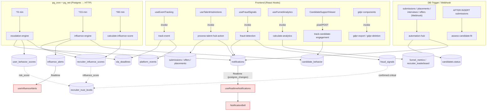

## 12. Automatisierung, Engines, Notifications & Analytics

> Domänen-Analyse für das CTO-Team ("Godmode"-Serie). Quelle der Wahrheit ist der Code; `PROJECT_ANALYSIS.md` ist nur Orientierung. Alle Datei-Referenzen als `pfad/datei.ts:zeile`.

Diese Domäne ist das "Nervensystem" der Plattform: Hintergrund-Engines berechnen Scores und Alerts, ein Event-/SLA-System misst Verhalten, Realtime-Channels pushen Benachrichtigungen ins Frontend, Tracking füttert Analytics-Tabellen, Fraud-Detection schützt das Triple-Blind-Modell, und DSGVO-Funktionen erfüllen Compliance. Charakteristisch: **Fast die gesamte Logik läuft serverseitig in Edge Functions**, die per **pg_cron + pg_net** (HTTP-POST aus Postgres heraus) oder per **Database Webhook** angestoßen werden — nicht aus dem Frontend.

### 12.1 Überblick: Wie die Teile zusammenhängen

| Schicht | Komponenten | Auslöser |
|---|---|---|
| **Engines (Cron)** | `influence-engine`, `escalation-engine`, `calculate-influence-score` | pg_cron alle 5/15/60 min (`20260225200000_unified_task_inbox.sql:133-195`) |
| **Engine (Webhook)** | `automation-hub` | Supabase **Database Webhook** auf `submissions/placements/interviews/offers/payout_requests` (im Dashboard konfiguriert, nicht in Migrationen) |
| **Trigger-getrieben** | `assess-candidate-fit` (via `trigger_generate_fit_assessment`), DB-Trigger `mark_activation_submitted`, `check_bulk_activation` | `AFTER INSERT`-Trigger + pg_net |
| **On-Demand (Frontend)** | `track-event`, `track-candidate-engagement`, `calculate-analytics`, `fraud-detection`, `process-talent-hub-action`, `gdpr-export`, `gdpr-deletion` | `supabase.functions.invoke(...)` aus Hooks/Components |
| **Realtime** | `notifications`, `influence_alerts`, `messages`, `recruiter_tasks` | Postgres-Changes über Publication `supabase_realtime` |

Wichtige Beobachtung: Die "schweren" Engines (`influence-engine`, `escalation-engine`, `calculate-influence-score`) sind in `supabase/config.toml` auf `verify_jwt = false` gesetzt (`config.toml:67,79,85`) und werden **ausschließlich** von pg_cron mit dem Service-Role-Key aufgerufen. Im gesamten `src/` gibt es keinen `invoke('influence-engine')` o.ä. — das ist Absicht.

### 12.2 Engines im Detail

#### automation-hub — der Event-Router
`supabase/functions/automation-hub/index.ts` ist als Database-Webhook-Empfänger gebaut: Es erwartet ein Payload `{ type, table, record, old_record }` (`automation-hub/index.ts:9-14`) und routet nach `event.table` (`:120-138`). Zwei Hauptaufgaben:

1. **Notification-Fan-out**: Bei `submissions INSERT` → Notification an `jobs.client_id` ("Neuer Kandidat eingereicht", `:158-174`); bei Statuswechsel → Notification an `submissions.recruiter_id` (`:182-202`); bei `placements/interviews/offers/payout_requests` analog (`:206-343`). Geschrieben wird immer in `notifications` via `createNotification()` (`:346-359`).
2. **Auto-Pipeline (`syncCandidateStatus`, `:26-105`)**: Aggregiert alle `submissions` eines Kandidaten, mappt Submission-Status → Kandidaten-Stage über `STAGE_PRIORITY` (`new<contacted<interview<offer<placed`, `:17-23`) und hebt `candidates.candidate_status` nur an, nie ab ("monotone Pipeline"). Fallen alle Submissions in terminale Zustände, wird der Kandidat auf `rejected` gesetzt (`:47-53`).

> Risiko: `automation-hub` ist die zentrale Notification-Quelle, aber seine Verdrahtung (Webhook) ist **nicht im Repo versioniert** — sie lebt nur in der Supabase-Projekt-Config. Geht das Projekt verloren oder wird neu aufgesetzt, fehlen ohne Doku alle Benachrichtigungen lautlos.

#### escalation-engine — SLA-Wächter (Cron alle 5 min)
`supabase/functions/escalation-engine/index.ts` ist die Verbindung zwischen **Zeit** und **Verhalten**:
- Holt fällige Warnungen aus `sla_deadlines` (Join `sla_rules`) und schreibt `sla_warning`-Notifications (`:27-64`).
- Bei Breach: je nach `rule.deadline_action` entweder `remind` (Notification + `reminders_sent++`) oder `escalate` (Status `escalated` + Notification an alle Admins, `:106-136`).
- **Schreibt zurück in `user_behavior_scores`** via `updateBehaviorScore()` (`:182-301`): berechnet `avg_response_time_hours` aus `platform_events.response_time_seconds`, `sla_compliance_rate`, `ghost_rate`, klassifiziert `behavior_class` (`fast_responder`/`ghoster`/`at_risk`/…) und einen `risk_score` (0–100). Dieser `risk_score` fließt später ins Trust-System.

#### influence-engine — Deal-Coaching (Cron alle 15 min)
`supabase/functions/influence-engine/index.ts` ist die anspruchsvollste Engine. Pro aktiver Submission (`:88-91`) lädt sie parallel Candidate/Job/Interview/Behavior/DealHealth (`:120-126`) und berechnet drei Scores (`calculateScores`, `:206-373`): `confidence`, `interview_readiness`, `closing_probability` (jeweils 0–100, aus Opt-In-Reaktionszeit, Interview-Bestätigung, Gehalts-Match, Match-Score, Deal-Health, E-Mail-Open-Rate, Tagen-seit-Engagement, Stage). Ergebnis:
- **Upsert in `candidate_behavior`** (`:141-158`) inkl. `hesitation_signals`/`motivation_indicators`-Arrays.
- **Alert-Generierung (`generateAlerts`, `:398-547`)**: 7 Alert-Typen (`opt_in_pending_24h/48h`, `interview_prep_missing`, `interview_reminder`, `salary_mismatch`, `ghosting_risk`, `engagement_drop`, `closing_opportunity`) mit Priorität, `recommended_action` und `playbook_id` (gemappt aus `coaching_playbooks`, `:110-115`). Jeder Alert bekommt einen `impact_score` (`calculateImpactScore`, `:375-396`: gewichtete Formel aus Deal-Health, Closing-Prob, SLA-Urgency, Prio).
- **Idempotenter Upsert in `influence_alerts`** über `onConflict: 'submission_id,alert_type'` (`:164-173`) — abgesichert durch den partiellen UNIQUE-Index `idx_influence_alerts_active_unique` (`20260225200000_unified_task_inbox.sql:39-41`).
- Abschließend `calculateRecruiterInfluenceScores()` (`:549-629`) → Upsert in `recruiter_influence_scores`.

#### calculate-influence-score — Recruiter-Scoring (Cron stündlich)
`supabase/functions/calculate-influence-score/index.ts` ist eine **redundante, aber genauere** Variante des Recruiter-Score-Teils der influence-engine: gewichtet Alert-Response (30%), Opt-In-Speed (25%), Interview-Show-Rate (25%), Placements (20%) (`:126-138`) und schreibt dasselbe Ziel `recruiter_influence_scores` (`:153-155`). Achtung: Es enthält hartcodierte Plattform-Durchschnitte (`platformAvgOptIn = 36`, `platformShowRate = 85`, `:100,123`) — explizit als "mock" markiert.

#### process-sequences — Outreach-Automation (Cron-Kandidat)
`supabase/functions/process-sequences/index.ts` arbeitet `outreach_sequences` mit fälligem `next_email_at` ab (`:23-33`), ruft intern `generate-outreach-email` per `fetch` auf (`:93-104`), legt das Ergebnis in `outreach_send_queue` mit zufälligem 0–60s-Delay (`:118-124`) und schiebt die Sequenz zum nächsten Schritt — oder pausiert auf `replied`, wenn der Lead geantwortet hat (`:78-85`). (Hinweis: In `20260225200000` ist hierfür **kein** Cron-Job definiert — die Verdrahtung erfolgt vermutlich über einen separaten Cron im Outreach-Modul.)

#### process-talent-hub-action — die Client-Aktions-Zentrale
`supabase/functions/process-talent-hub-action/index.ts` ist die EINE Function, die das Frontend für Client-Aktionen aufruft (über `useTalentHubActions`, `src/hooks/useTalentHubActions.ts:46`). Sie kapselt fünf Aktionen (`:66-386`):
- `request_interview` → Interview mit `status='pending_opt_in'`, Notification + E-Mail an Recruiter (`:67-129`).
- `confirm_opt_in` → **hebt Triple-Blind auf**: `submissions.identity_revealed=true`, Interview auf `pending_slot_selection`, E-Mail mit echten Kandidatendaten an Client (`:131-181`).
- `move_candidate` → Stage-Wechsel; bei `offer`/`hired` werden automatisch Datensätze in `offers`/`placements` angelegt (`:234-254`).
- `reject_candidate`, `give_feedback` (positiv → Auto-Move, `:339-347`).
Jede Aktion schreibt `notifications`, `activity_logs` und sendet E-Mail via `send-email` (`:406-444`).

### 12.3 Realtime-Notifications & der NotificationBell-Render-Loop

#### Datenfluss
Die Tabellen `notifications`, `messages`, `submissions`, `interviews`, `influence_alerts`, `candidate_behavior`, `recruiter_tasks` sind Teil der Realtime-Publication (`20251204201843_…sql:68-71`, `20251204213449_…sql:16-17`, `20260225200000_…sql:131`). Edge Functions schreiben Zeilen, Postgres streamt die Änderung, das Frontend hört zu:
- `src/hooks/useRealtimeNotifications.ts` abonniert Channel `notifications-realtime`, gefiltert auf `user_id=eq.${user.id}` (`:82-118`), und zeigt bei INSERT zusätzlich einen Sonner-Toast (`:98-101`).
- `src/components/layout/NotificationBell.tsx` konsumiert den Hook (`:17`) und rendert das Glocken-Dropdown. Der Bell sitzt in **`DashboardLayout.tsx:153`** UND in **`Navbar.tsx:229`** — er ist also quasi auf jeder eingeloggten Seite gemountet.
- Parallel: `src/hooks/useInfluenceAlerts.ts:62-87` (Channel `influence-alerts-changes`) und `src/hooks/useRealtimeMessages.ts:101-156`.

#### Ursache des "Maximum update depth exceeded"-Loops (verifiziert)
Der Loop entsteht aus dem Zusammenspiel von `useAuth` und den Realtime-Hooks. Kette:

1. **`useAuth` liefert eine instabile `user`-Referenz.** In `src/lib/auth.tsx:25-51` registriert der `AuthProvider` `supabase.auth.onAuthStateChange`. Bei jedem Auth-Event — insbesondere dem periodischen `TOKEN_REFRESHED` (Default ~alle 50–60 min, aber auch bei Tab-Fokus/`getSession`) — ruft er `setUser(session?.user ?? null)` (`:29`). Das `session.user` ist bei jedem Event ein **frisch deserialisiertes Objekt** (neue Referenz, gleicher Inhalt). Der Context-Value wird zudem als **neues Literal-Objekt** `{ user, session, role, … }` bei jedem Provider-Render erzeugt (`:97`), ohne `useMemo`.

2. **`fetchNotifications` hängt an `user` als Dep.** In `useRealtimeNotifications.ts:24-42` ist `fetchNotifications` ein `useCallback` mit `[user]`. Neue `user`-Referenz ⇒ neue `fetchNotifications`-Referenz.

3. **Der Effekt hängt an `fetchNotifications` UND `user`.** `useRealtimeNotifications.ts:73-123` listet `[user, fetchNotifications]` als Deps. Bei neuer Referenz läuft der Cleanup (`supabase.removeChannel`) und der Effekt **neu**: er ruft `fetchNotifications()` (setzt State) und baut `supabase.channel("notifications-realtime")` neu auf.

4. **Verstärker — kollidierender Channel-Name.** Der Channel heißt statisch `"notifications-realtime"` (`:83`). Wenn der Bell an zwei Stellen gleichzeitig gemountet ist (Navbar + DashboardLayout) bzw. Cleanup/Subscribe sich überlappen, konkurrieren zwei Subscriptions um denselben Channel-Namen. In Kombination mit der `getSession().then(setUser)`-Initialisierung (`auth.tsx:41-48`), die kurz nach dem ersten `onAuthStateChange` ein zweites `setUser` mit erneut neuer Referenz feuert, entsteht ein schnelles Re-Subscribe→setState→Re-Render→neue Referenz→Re-Subscribe — React bricht mit *Maximum update depth exceeded* ab.

`useInfluenceAlerts.ts:62-87` hat exakt dasselbe Muster (`[user, fetchAlerts]`, `fetchAlerts` mit `[user]`) und ist ein zweiter, paralleler Loop-Kandidat.

#### Empfohlene Fixes (geringster Eingriff zuerst)
- **A — Stabilisieren in `useAuth`:** Effekt-Deps nicht an das ganze `user`-Objekt, sondern an `user?.id` hängen. Context-Value mit `useMemo` memoisieren (`auth.tsx:97`). Das ist die Wurzel und behebt mehrere Hooks auf einmal.
- **B — In den Hooks:** `useCallback`-Deps von `[user]` auf `[user?.id]` umstellen (`useRealtimeNotifications.ts:42`, `:71`, `useInfluenceAlerts.ts:60`) und im Effekt `[user?.id]` statt `[user, fetchNotifications]` verwenden; `fetchNotifications` per `useRef` halten oder im Effekt inline aufrufen.
- **C — Channel-Eindeutigkeit:** Channel-Namen pro User/Mount eindeutig machen, z.B. `notifications-${user.id}` (vermeidet Kollision wenn der Bell mehrfach gemountet ist).

### 12.4 Tracking & Analytics

#### Event-Tracking (`track-event`)
`supabase/functions/track-event/index.ts` verifiziert das User-JWT (`:37-47`), schreibt nach `platform_events` (Schema: `20251204204702_…sql:59-80` — inkl. `ip_address`, `user_agent`, `response_time_seconds`, `session_id`). Zwei clevere Seiteneffekte:
- **Response-Time-Berechnung** (`:71-89`): Bei Events mit `response/review/accept/reject` im Namen wird die Differenz zum letzten Event derselben Entity als `response_time_seconds` gespeichert — das ist die Datenbasis für `escalation-engine`'s Behavior-Scores.
- **SLA-Lifecycle (`handleSlaDeadlines`, `:142-226`)**: Bestimmte Events legen `sla_deadlines` an (z.B. `submission_created` → Phase `submitted`, Verantwortlicher = `jobs.client_id`, `:182-192`) oder schließen sie ab (`completed`). Damit ist `track-event` die **Brücke zwischen User-Aktion und SLA-Engine**.

Frontend: `src/hooks/useEventTracking.ts` kapselt `invoke('track-event')` (`:33`) plus Helfer `trackPageView/trackEntityView/trackAction` und die Auto-Hooks `usePageViewTracking`/`useEntityViewTracking` (`:89-112`). Session-ID liegt in `sessionStorage` (`:13-20`).

#### Candidate-Engagement-Tracking (`track-candidate-engagement`)
`supabase/functions/track-candidate-engagement/index.ts` ist die **anonyme** Tracking-Variante (`verify_jwt = false`, `config.toml:82-83`). Sie unterstützt GET (Tracking-Pixel → 1×1-GIF bei `email_open`, `:45-60`; 302-Redirect bei `link_click`, `:61-64`) und POST. Sie aktualisiert `candidate_behavior` (Counter `emails_opened`/`links_clicked`/`prep_materials_viewed`, abgeleiteter `engagement_level`, `:103-139`) und loggt nach `platform_events` (`:169-175`). Caller im Frontend: `src/components/influence/CandidateSupportViewer.tsx:128`.

#### Analytics-Aggregation (`calculate-analytics` & `refresh-analytics`)
Zwei überlappende Funktionen schreiben beide nach `funnel_metrics`:
- `supabase/functions/calculate-analytics/index.ts`: Actions `calculate_funnel` (pro job/client/recruiter/platform, `:69-239`), `calculate_leaderboard` (→ `recruiter_leaderboard`, `:241-339`), `calculate_all` (`:341-382`). Mehrere `avg_time_to_*`-Felder sind noch `0`/`TODO` (`:197-201`).
- `supabase/functions/refresh-analytics/index.ts`: Actions `calculate_funnel_metrics`, `calculate_deal_health` (→ `deal_health`, `:122-209`), `calculate_all`. **Unterschiedliche `onConflict`-Keys** (`entity_type,period_days` hier vs. `entity_type,entity_id,period_start,period_end` in calculate-analytics) → die beiden konkurrieren um dieselbe Tabelle mit inkompatiblen Unique-Annahmen.

Frontend liest direkt aus den Tabellen (kein Live-Aufruf der Engine zum Anzeigen): `src/hooks/useFunnelAnalytics.ts` (`useFunnelMetrics`/`useRecruiterLeaderboard`/`useConversionTrends`) liest `funnel_metrics`/`recruiter_leaderboard` (`:58-167`); nur `useCalculateAnalytics` (`:115-137`) triggert `calculate-analytics` aktiv. Seiten: `AdminAnalytics.tsx`, `ClientAnalytics.tsx`, `InterviewAnalytics.tsx`.

### 12.5 Fraud-Detection

`supabase/functions/fraud-detection/index.ts` ist regelbasiert (keine ML) und hat vier Trigger (`:37-52`): `candidate_submission`, `profile_change`, `suspicious_login`, `batch_scan`. Der Haupt-Check `checkCandidateSubmission` (`:66-145`) läuft sechs Heuristiken:
1. **Duplicate** (gleiche E-Mail/Telefon; severity `high` wenn anderer Recruiter — Triple-Blind-Schutz, `:147-197`).
2. **Velocity** (>10/h oder >50/Tag, `:199-241`).
3. **Data-Inconsistency** (LinkedIn-URL ohne Namen, Wegwerf-Domain, Kontaktdaten im Freitext, `:243-295`).
4. **Circumvention** (Telefon/E-Mail/Messenger-Referenz in `summary`/`recruiter_notes` — Regex, `:297-330`) — der eigentliche Triple-Blind-Wächter.
5. **IP-Pattern** (gleiche IP wie ein Client → `critical`, "Selbst-Einreichung", `:332-365`) — nutzt `platform_events.ip_address`.
6. **CV-Similarity** (Jaccard >0.7 gegen 50 fremde Kandidaten, `:367-412`).

`calculateOverallRisk` (`:491-508`) und `determineAutoAction` (`:510-515`) entscheiden über `executeAutoAction` (`:517-555`): `critical → submissions.status='blocked'` + Admin-Notifications; `high → 'flagged'`. Signale landen in `fraud_signals` (`:125-137`). **Verknüpfung zum Trust-System:** `recalculate_trust_level` zählt bestätigte kritische Fraud-Signale und suspendiert Recruiter (`20260302160000_…sql:196-205`); zusätzlich erzeugt der DB-Trigger `check_bulk_activation` selbst `bulk_activation`-Signale (`:304-343`). Frontend: `src/hooks/useFraudSignals.ts` (`runFraudCheck` → `invoke('fraud-detection')`, `:91-109`), Seite `AdminFraud.tsx`.

### 12.6 DSGVO / Compliance

- **Export (`gdpr-export/index.ts`)**: User-JWT → sammelt aus ~15 Tabellen (profiles, candidates, submissions, jobs, messages, notifications, consents, activity_logs, stripe_accounts, payout_requests, invoices …, `:62-161`), lädt JSON in Storage `documents/gdpr-exports/…`, erzeugt 7-Tage-Signed-URL (`:179-182`), trackt in `data_export_requests` und mailt via `send-email` (`:196-209`). Gibt die Daten **zusätzlich inline** zurück (`:216`).
- **Deletion (`gdpr-deletion/index.ts`)**: Drei-Phasen `request → confirm → cancel` mit `confirmation_token` (`:46-147`). `confirm` ruft `anonymizeUserData` (`:157-175`: pseudonymisiert profiles/candidates/messages, löscht stripe_accounts) und dann `supabase.auth.admin.deleteUser` (`:121`). Frontend: `src/components/gdpr/DataDeletionRequest.tsx`, `DataExportRequest.tsx`. Tabellen: `data_export_requests`, `data_deletion_requests` (`20251204201843_…sql:4-56`).

> Compliance-Lücke: `gdpr-deletion` anonymisiert nur eine **Teilmenge** der Tabellen, die `gdpr-export` als personenbezogen ausweist (z.B. `notifications`, `activity_logs`, `platform_events` mit IP/UA, `submissions.recruiter_notes`, payout/invoice-Daten bleiben unberührt). Für eine echte Art-17-Löschung ist das unvollständig.

### 12.7 Datenfluss-Diagramm

### 12.8 Tabellen dieser Domäne (Auswahl)

| Tabelle | Beschrieben von | Gelesen von |
|---|---|---|
| `notifications` | automation-hub, escalation-engine, fraud-detection, process-talent-hub-action | useRealtimeNotifications, NotificationBell |
| `platform_events` | track-event, track-candidate-engagement | escalation-engine, fraud-detection |
| `sla_deadlines` / `sla_rules` | track-event (create/complete), escalation-engine | escalation-engine |
| `user_behavior_scores` | escalation-engine | recalculate_trust_level |
| `candidate_behavior` | influence-engine, track-candidate-engagement | influence-engine, Behavior-UI |
| `influence_alerts` | influence-engine | useInfluenceAlerts, unified_task_inbox VIEW |
| `recruiter_influence_scores` | influence-engine, calculate-influence-score | recalculate_trust_level, useRecruiterInfluenceScore |
| `fraud_signals` | fraud-detection, check_bulk_activation (Trigger) | useFraudSignals, recalculate_trust_level |
| `funnel_metrics` / `recruiter_leaderboard` | calculate-analytics, refresh-analytics | useFunnelAnalytics |
| `deal_health` | refresh-analytics | influence-engine |
| `data_export_requests` / `data_deletion_requests` | gdpr-export, gdpr-deletion | GDPR-Components |

### 12.9 Reibungs- & Risikopunkte (Kurzfassung)

1. **Render-Loop** (`useRealtimeNotifications`/`useInfluenceAlerts` × instabile `user`-Ref aus `useAuth`) — Production-Bug, siehe 12.3.
2. **Doppelte Recruiter-Score-Logik** — `influence-engine` und `calculate-influence-score` schreiben beide `recruiter_influence_scores` mit unterschiedlichen Formeln/Werten → Race & Inkonsistenz je nach Cron-Reihenfolge.
3. **Doppelte Analytics-Writer** — `calculate-analytics` vs. `refresh-analytics` mit kollidierenden `onConflict`-Keys auf `funnel_metrics`.
4. **automation-hub-Webhook nicht im Repo** — zentrale Notification-Quelle nur in Dashboard-Config; fragil & undokumentiert.
5. **Unvollständige DSGVO-Löschung** — `anonymizeUserData` deckt nicht alle personenbezogenen Tabellen ab, die der Export listet.
6. **Hartcodierte Plattform-Benchmarks** in `calculate-influence-score` (`platformAvgOptIn=36`, `platformShowRate=85`).
