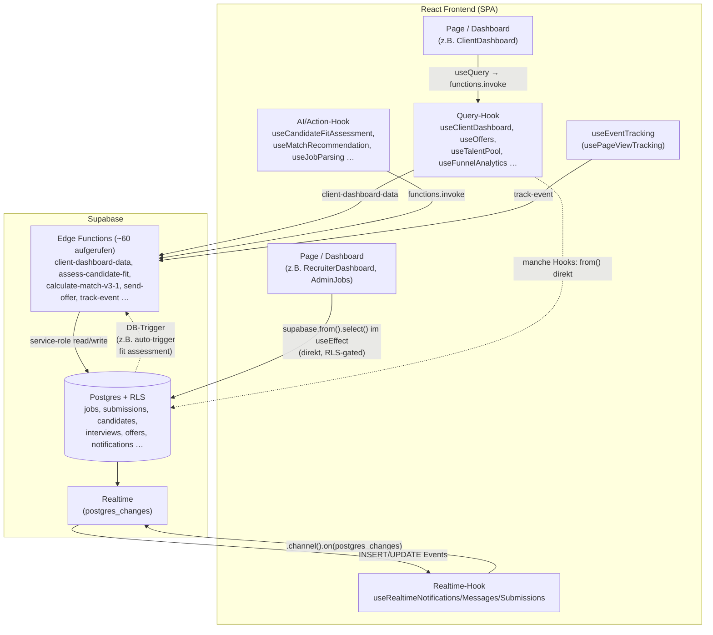

## 13. Frontend-Architektur & Design-System

> Domäne: Frontend-Shell (Routing, Layout, Auth-Gate), das Design-System (Tailwind-Theme + shadcn/ui), die drei Persona-Dashboards (client / recruiter / admin) sowie die Datenfetching-Muster (TanStack Query vs. direkte Supabase-Calls vs. Edge Functions).
>
> Quellcode-Stand der Analyse: `main` @ `9903dbd`. Verifizierte Zahlen (auf Disk): **80 Pages** (`src/pages/**/*.tsx`), **380 Komponenten** (`src/components/**/*.tsx`), **89 Hooks** (`src/hooks/`), **44 shadcn-UI-Primitives** (`src/components/ui/`), **79 Edge Functions** (`supabase/functions/`), **93 Migrationen** (`supabase/migrations/`). Das Frontend ruft **~60 distinkte Edge Functions** über `supabase.functions.invoke()` an (57 Call-Sites).

---

### 13.1 Überblick & Schichtenmodell

Das Frontend ist eine **Single-Page-Application** (Vite 5 + React 18 + TypeScript + SWC). Es gibt **kein SSR**, **kein Code-Splitting** und **kein Lazy-Loading** — `src/App.tsx` importiert alle 80 Pages statisch (Top-of-File `import`), wodurch ein einziger, großer JS-Bundle entsteht (siehe Friction-Point F7).

```
main.tsx  ──► App.tsx ──► Provider-Stack ──► AppRoutes (React Router) ──► Pages ──► DashboardLayout ──► shadcn/ui
   │                          │                                                          │
   │                          ├─ QueryClientProvider (TanStack Query)                    └─ Tailwind-Theme (CSS-Variablen + .light Klasse)
   │                          ├─ TooltipProvider
   │                          ├─ Toaster (Radix)  +  Sonner (next-themes!)
   │                          ├─ BrowserRouter
   │                          └─ AuthProvider (Supabase Auth → user_roles)
   │
   └─ Pre-Render Theme-Bootstrap: liest localStorage['matchunt-theme'] und setzt .light vor dem ersten Paint
```

**Provider-Stack** (`src/App.tsx:466-479`), von außen nach innen:

| Reihenfolge | Provider | Quelle | Zweck |
|---|---|---|---|
| 1 | `QueryClientProvider` | `@tanstack/react-query` | Server-State-Cache (eine globale `new QueryClient()` ohne Default-Options, `App.tsx:107`) |
| 2 | `TooltipProvider` | `@/components/ui/tooltip` (Radix) | App-weite Tooltips |
| 3 | `Toaster` | `@/components/ui/toaster` (Radix Toast) | Imperative Toasts via `use-toast` |
| 4 | `Sonner` | `@/components/ui/sonner` | Zweites Toast-System (via `sonner`) — **liest `next-themes`** |
| 5 | `BrowserRouter` | `react-router-dom` 6 | Client-Routing |
| 6 | `AuthProvider` | `@/lib/auth` | Session + Rolle, Context für `useAuth()` |
| 7 | `CookieConsentBanner` | `@/components/gdpr` | DSGVO-Cookie-Banner (Geschwister von `AppRoutes`) |

> **Doppeltes Toast-System.** Es laufen zwei parallele Toast-Implementierungen: Radix `Toaster` (`use-toast`) **und** `Sonner`. Komponenten importieren mal `toast` aus `sonner` (z.B. `AIRecommendationBadge.tsx:9`), mal `useToast` aus `@/hooks/use-toast` (z.B. `JobsList.tsx`, `useCandidateFitAssessment.ts:3`). Das ist eine inkonsistente, redundante Abhängigkeit (Friction-Point F4).

---

### 13.2 Routing & ProtectedRoute

Das gesamte Routing liegt zentral in `src/App.tsx` (`AppRoutes`, `App.tsx:137-464`). Es gibt **keine** verschachtelten Layout-Routes (React-Router `<Route element={<Layout/>}>`-Pattern wird nicht genutzt) — stattdessen rendert **jede Page selbst** `<DashboardLayout>` (60 Pages tun das, verifiziert). Das ist Wiederholung statt Komposition (Friction-Point F5).

**`ProtectedRoute`** (`src/App.tsx:109-135`) ist der einzige Auth-Gate:

```
1. loading  → Spinner (animate-spin)
2. !user    → <Navigate to="/auth">
3. role === 'admin' → immer durchlassen (Admin-Superuser, App.tsx:125)
4. allowedRoles gesetzt & role nicht enthalten → Redirect auf Persona-Home
5. sonst → children
```

Bemerkenswert: **Admins haben Zugriff auf ALLE Routen** (`App.tsx:125-127`), nicht nur auf `/admin/*`. Es gibt keine clientseitige Verifikations-Gate-Logik in `ProtectedRoute` (KYC-Status wird erst innerhalb der Pages über `VerificationStatusBanner` / `useClientVerification` behandelt, nicht beim Routing).

#### Routen-Map nach Persona

| Persona | Prefix | Anzahl Routen | Home | Beispiele |
|---|---|---|---|---|
| **client** | `/dashboard/*` | ~22 | `/dashboard` | `jobs`, `jobs/new`, `jobs/:id`, `command/:jobId`, `interviews`, `candidates`, `offers`, `placements`, `analytics`, `messages`, `settings`, `billing`, `privacy`, `team`, `integrations` |
| **recruiter** | `/recruiter/*` | ~16 | `/recruiter` | `jobs`, `jobs/:id`, `candidates`, `candidates/:id`, `submissions`, `submissions/:id`, `earnings`, `payouts`, `notifications`, `messages`, `profile`, `influence`, `talent-pool`, `integrations`, `privacy` |
| **admin** | `/admin/*` | ~21 | `/admin` | `clients`, `recruiters`, `jobs`, `candidates`, `interviews`, `placements`, `deal-health`, `payments`, `payouts`, `invoices`, `fraud`, `analytics`, `activity`, `users`, `settings`, `matching-config`, `domains`, `skill-synonyms`, `outreach`, `outreach/company/:id` |
| **public** | `/`, `/auth`, … | ~17 | `/` | Landing (`Index`), `Auth`, Marketing (`about/contact/blog/guides/docs/help/careers/press/impressum`), Token-Flows (`interview/select/:token`, `interview/respond/:token`, `offer/view/:token`, `offer/accepted`, `invite/:token`, `reference/:token`) |

**Stale-Route-Redirects** (Hinweis auf abgelöste IA): `/dashboard/talent`, `/dashboard/pipeline`, `/dashboard/pipeline/:jobId`, `/dashboard/command-center` → alle `<Navigate to="/dashboard">` (`App.tsx:175-183`). Mehrere importierte Pages sind **nicht** geroutet (toter Code, Friction-Point F6): `ClientCandidatesOverview` (`App.tsx:18`), `TalentHub` (`:20`), `ClientBewerberPage` wird statt `ClientCandidatesOverview` auf `/dashboard/candidates` gemountet (`:178-182`).

---

### 13.3 DashboardLayout — die geteilte Shell

`src/components/layout/DashboardLayout.tsx` ist die **eine** App-Shell für alle drei Personas. Es ist **persona-bewusst, nicht persona-getrennt**: Die Navigations-Items werden zur Laufzeit aus der Rolle abgeleitet.

```text
DashboardLayout(children)
 ├─ useAuth() → { user, role, signOut }
 ├─ Header (sticky, bg-card)
 │   ├─ <MatchuntWordmark size="md">  → Link auf getDashboardHome(role)
 │   ├─ <GlobalSearch>
 │   ├─ <NotificationBell>            → useRealtimeNotifications
 │   └─ User-DropdownMenu (Email, Rolle, Einstellungen, Abmelden)
 ├─ Sidebar (fixed, w-64, md:block — auf Mobile ausgeblendet!)
 │   ├─ navItems = role==='admin' ? adminNavItems : role==='recruiter' ? recruiterNavItems : clientNavItems
 │   ├─ Aktiv-Logik: location.pathname === href || startsWith(href)   (DashboardLayout.tsx:190-191)
 │   └─ Footer: Einstellungen-Link + <ThemeToggle/> + "Theme"-Label
 └─ <main className="md:ml-64">  →  container py-6  →  children
 └─ <KeyboardShortcutsHelp>  (geöffnet via useDashboardKeyboardShortcuts)
```

- **NavItem-Listen** sind hartcodiert im Layout: `clientNavItems` (8 Items, `DashboardLayout.tsx:84-93`), `recruiterNavItems` (12 Items, `:95-108`), `adminNavItems` (19 Items, `:110-130`).
- **Routing-Bug verborgen im Layout:** `settingsHref` für Recruiter zeigt auf `/recruiter/settings` (`DashboardLayout.tsx:138`), aber **diese Route existiert nicht** in `App.tsx` → fällt auf `NotFound`. Client (`/dashboard/settings`) und Admin (`/admin/settings`) sind korrekt. (Friction-Point F8.)
- **Mobile:** Die Sidebar ist `hidden … md:block` (`:186`) — auf Mobilgeräten gibt es **keine Navigation** (kein Hamburger/Sheet-Drawer). `use-mobile.tsx` existiert, wird hier aber nicht genutzt.

**Geteilt vs. persona-spezifisch (Zusammenfassung):**

| Ebene | Geteilt | Persona-spezifisch |
|---|---|---|
| Shell | `DashboardLayout` (Header, Sidebar-Gerüst, User-Menü) | NavItem-Arrays je Rolle (in derselben Datei) |
| Auth | `ProtectedRoute`, `AuthProvider`, `useAuth` | `allowedRoles`-Prop pro Route |
| UI-Kit | `src/components/ui/*` (44 shadcn-Primitives), `MatchuntLogo/Wordmark`, `ThemeToggle` | — |
| Dashboards | — | `ClientDashboard`, `RecruiterDashboard`, `AdminDashboard` (komplett getrennte Page-Komponenten) |
| Hooks | `useEventTracking`, `useRealtime*`, `usePermissions` | `useClientDashboard`, `useRecruiterStats`/`useRecruiterTasks`, Admin nutzt direkte `supabase.from()`-Queries |
| Cross-cutting | `usePageViewTracking` (alle Dashboards rufen `track-event`) | — |

---

### 13.4 Die drei Persona-Dashboards im Vergleich

Die drei Einstiegs-Dashboards offenbaren **drei unterschiedliche Datenfetching-Philosophien** — ein zentrales Architektur-Symptom der Domäne:

| Aspekt | `ClientDashboard` | `RecruiterDashboard` | `AdminDashboard` |
|---|---|---|---|
| Datei | `src/pages/dashboard/ClientDashboard.tsx` | `src/pages/recruiter/RecruiterDashboard.tsx` | `src/pages/admin/AdminDashboard.tsx` |
| Fetch-Muster | **TanStack Query** via `useClientDashboard()` | **Imperativ**: `useEffect` + `useState` + direkte `supabase`-Calls | **Imperativ + Hooks**: `useEffect` + `useFraudSignals` + `useDealHealthList` |
| Backend | 1 Aufruf: Edge Function `client-dashboard-data` (Server-Aggregation) | viele direkte `supabase.from()`-Queries im Client | direkte `supabase.from()`-Queries + 2 Query-Hooks |
| Caching | `staleTime 30s`, `refetchInterval 60s`, `refetchOnWindowFocus` (`useClientDashboard.ts:92-94`) | keines (manueller Fetch beim Mount, `[user]`-dep) | gemischt |
| Loading/Error | `isLoading`/`error`/`refetch` aus Query | lokale `useState`-Flags | lokale `useState`-Flags |

Das **`client-dashboard-data`-Pattern ist der Goldstandard** der Codebasis: Eine einzige Edge Function aggregiert Stats, Actions, Live-Jobs, Activity und Health-Score serverseitig (`useClientDashboard.ts:68-95`). Die Recruiter/Admin-Dashboards holen die Daten dagegen client-seitig zusammen (N+1-anfällig, kein Cache). Diese **Inkonsistenz** ist Friction-Point F1.

---

### 13.5 Datenfetching-Muster (drei Wege zur DB)

Es existieren parallel **drei** Zugriffsmuster auf das Supabase-Backend:



**Muster 1 — TanStack Query (~21 Hooks).** `useQuery`/`useMutation` in: `useClientDashboard`, `useOffers`, `useTalentPool`, `useFunnelAnalytics`, `useInterviewAnalytics`, `useInterviewFeedback`, `useScorecards`, `useReferenceChecks`, `useSimilarCandidates`, `useOrganization(+Invites)`, `usePermissions`, `useBewerber`, `useCandidateConflicts`, `useCompanyEnrichment/Import`, `useCompanyOutreach`, `useOutreach(+Companies)`, `useFilteredLeads`, `useCareerCrawl`. Diese liefern Cache, Stale-Time, Refetch.

**Muster 2 — Imperative `supabase.from()` im `useEffect`** (die Mehrheit der Pages). Manuelles `useState`/`setLoading`, kein Cache, oft N+1-Queries. Beispiele: `RecruiterDashboard`, `AdminDashboard`, `JobsList`, `RecruiterJobs`, `RecruiterCandidates`. RLS schützt diese Calls serverseitig.

**Muster 3 — Edge-Function-Invokes für AI/Aktionen.** ~60 distinkte Functions. AI/Aktions-Hooks wie `useCandidateFitAssessment` (→ `assess-candidate-fit`, `useCandidateFitAssessment.ts:145`), `useMatchScoreV31` (→ `calculate-match-v3-1`), `useJobParsing` (→ `parse-job-pdf`/`parse-job-url`), `useOffers`/`create-offer`, `send-offer`, `process-payout`.

**Muster 4 (Querschnitt) — Realtime.** `useRealtimeNotifications` (`channel('notifications-realtime')`, Tabelle `notifications`), `useRealtimeMessages` (Tabelle `messages`), `useRealtimeSubmissions` (Tabelle `submissions`). Per `supabase.channel().on('postgres_changes', …)`.

---

### 13.6 Design-System & Theming

#### 13.6.1 Token-Architektur

Das Theme ist **dark-first** und basiert auf HSL-CSS-Variablen, die in `src/index.css` definiert und in `tailwind.config.ts` als `hsl(var(--token))` gemappt werden.

- **`:root` = Dark Mode** (Default). Monochromer Graustufen-Look: `--background: 0 0% 4%`, `--foreground: 0 0% 98%`, `--card: 0 0% 8%` (`index.css` `@layer base`).
- **`.light` = Light-Override.** Eine Klasse `.light` auf `<html>` invertiert die Tokens (`--background: 0 0% 98%`, etc.).
- **Pre-Paint-Bootstrap** in `main.tsx:5-9`: liest `localStorage['matchunt-theme']`; bei `'light'` wird `document.documentElement.classList.add('light')` **vor** dem Render gesetzt → kein Theme-Flash.
- shadcn-Komponenten konsumieren ausschließlich semantische Tokens (`bg-background`, `text-muted-foreground`, `border-border`, `bg-card`), gemappt in `tailwind.config.ts:51+`.

#### 13.6.2 Der eigene Theme-Hook (NICHT next-themes)

Die App nutzt einen **selbstgebauten** `useTheme` (`src/hooks/useTheme.ts`), nicht `next-themes`:

```ts
// src/hooks/useTheme.ts  (STORAGE_KEY = 'matchunt-theme')
theme = localStorage['matchunt-theme'] ?? 'dark'
useEffect → theme==='light' ? html.classList.add('light') : remove('light')
toggleTheme → dark ⇄ light
```

`ThemeToggle` (`src/components/ui/ThemeToggle.tsx:3`) konsumiert diesen Hook und wird im Sidebar-Footer von `DashboardLayout` gerendert. `next-themes` ist zwar in `package.json`, aber es gibt **keinen** `ThemeProvider` und **keine** `next-themes`-Nutzung — **außer einer**: `src/components/ui/sonner.tsx:1` importiert `useTheme` aus `next-themes`.

#### 13.6.3 Markenidentität (Matchunt)

- `MatchuntLogo` (`src/components/ui/MatchuntLogo.tsx`): Inline-SVG (zwei `<path>`-Glyphen, `fill="currentColor"`) → erbt automatisch die Theme-Foreground-Farbe.
- `MatchuntWordmark` (`src/components/ui/MatchuntWordmark.tsx`): Logo + Text „Matchunt.ai", drei Größen (`sm/md/lg`). Im Header von `DashboardLayout` als `size="md"`.
- Schrift: `Inter` (Google Fonts Import in `index.css`), als `--font-sans` gesetzt.

#### 13.6.4 Theme-Inkonsistenzen (verifiziert)

> Dies ist das problematischste Cluster der Domäne. Drei voneinander unabhängige Befunde:

**(A) Invertierte `darkMode`-Konfiguration.** `tailwind.config.ts:4` setzt:
```ts
darkMode: ["class", ".light"]
```
Das weist Tailwind an, **`dark:`-Varianten zu aktivieren, wenn die Klasse `.light` am Element hängt** — also genau im **Light-Modus**. Die App ist aber dark-first (`:root` = dunkel) und setzt `.light` nur im hellen Modus. Effekt: Die **314 `dark:`-Utility-Verwendungen in 52 Dateien** (verifiziert per Grep, z.B. `MatchScoreCardV2.tsx`, `CandidateFitAssessmentCard.tsx`, `ClientCandidateCard.tsx`) greifen **im falschen Modus** bzw. heben sich gegen die CSS-Variablen-Inversion auf. Das ist die strukturelle Wurzel der „Theme-Inkonsistenz". → Friction-Point **F2 (critical)**.

**(B) Sonner liest das falsche Theme-System.** `src/components/ui/sonner.tsx:7`:
```ts
const { theme = "system" } = useTheme(); // aus next-themes — KEIN Provider vorhanden
```
Ohne `next-themes`-`ThemeProvider` fällt `theme` auf `"system"` zurück und folgt **nie** dem App-Theme (`matchunt-theme`). Toasts können daher im hellen App-Modus dunkel (oder umgekehrt) erscheinen. → Friction-Point **F3 (medium)**.

**(C) Hardcodierte Farben umgehen die Tokens.** Beispiele:
- `button.tsx:18` — `hero`-Variante: `bg-gradient-to-r from-[hsl(222,47%,20%)] to-[hsl(222,55%,12%)]` (Navy-Blau), obwohl das CSS-Gradient-Token `--gradient-navy` monochrom-grau definiert ist. Die `hero`-Variante wird u.a. in `JobsList.tsx:329` genutzt.
- Akzentfarben wie `text-amber-600`, `text-green-600`, `bg-green-500/10` (`JobsList.tsx:252,423,445`) und `text-emerald-600` (`CandidateFitAssessmentCard.tsx:414`) sind feste Tailwind-Paletten, nicht Theme-Tokens → im Light-Modus teils schwacher Kontrast.
- Öffentliche/Token-Seiten mit festem Hell-/Dunkel-Look: 24 Dateien mit `text-white`, mehrere mit `bg-white` (`ViewOffer.tsx`, `SelectSlot.tsx`, `InterviewResponsePage.tsx`, diverse `public/*`).

**(D) „Festverdrahtetes Dunkel" auf Altseiten / Live-Lag.** `src/pages/dashboard/JobsList.tsx` wurde zuletzt **2026-02-09** geändert (verifiziert via `git log`). Im aktuellen Code nutzt JobsList bereits Theme-Tokens (`bg-card`, `text-muted-foreground`) — d.h. der **Code** folgt dem Theme. Der gemeldete „helles Theme greift nicht / fest dunkel"-Effekt entsteht durch (i) das invertierte `darkMode` (B oben), (ii) hardcodierte Akzent-/Navy-Farben und (iii) **den Live-Lag**: Das deployte Frontend hängt hinter `main` zurück, sodass ältere, dunkel-verdrahtete Stände live noch sichtbar sind. → siehe Open Questions.

---

### 13.7 Render-Loop „Maximum update depth exceeded" (verifiziert)

Das Symptom ist bestätigt, die genaue Quelle ist im Code **nicht eindeutig statisch lokalisierbar** (typisch für intermittierende Effekt-Loops). Die Architektur weist mehrere **risikoreiche Muster** auf, die dieses Symptom erzeugen können:

1. **`useEffect` mit Funktions-Dependency aus Hook.** Mehrere Effekte hängen von Callbacks ab, die in Hooks zurückgegeben werden, z.B. `AIRecommendationBadge.tsx:34-44` (`}, [candidateId, jobId, autoLoad, hasLoaded, getCachedRecommendation, generateRecommendation, matchResult]`). Solange die Hook-Callbacks **mit `useCallback` memoisiert** sind (hier: `useMatchRecommendation` nutzt `useCallback`, verifiziert) und ein `hasLoaded`-Guard existiert, ist es stabil — bricht aber sofort, wenn ein Consumer eine **nicht-memoisierte** Inline-Funktion oder ein **neu erzeugtes Objekt** (`matchResult`, Options-Objekt) als Prop durchreicht.
2. **`fetchData`/`refresh`-Callbacks als Effekt-Dep.** `useJobCommandData.ts:211-213` (`}, [fetchData]`) und `useCalendarAvailability.ts:219-221` (`}, [refreshAvailability]`) sind nur deshalb sicher, weil die Callbacks mit `useCallback` auf stabile Deps (`[user]` bzw. `[checkCalendarConnection, fetchBusySlots, daysAhead]`) memoisiert sind. Jede künftige Änderung, die eine instabile Dep einführt, erzeugt eine Endlosschleife.
3. **`useEffect`, der State setzt, der in der eigenen Dep-Liste steht.** Gefunden (alle aktuell durch Guards geschützt, aber fragil): `TeamManagement.tsx:35` (`setSelectedOrgId`, dep `[organizations, selectedOrgId]`), `CandidateInterviewsCard.tsx:116`, `ScorecardEvaluationForm.tsx:58`, `useInterviewSession.ts:70`. Diese „set-state-in-own-deps"-Muster sind die klassischen Auslöser von „Maximum update depth exceeded", sobald der Guard (`if (!x) setX(...)`) wegfällt oder die Bedingung instabil wird.
4. **`AuthProvider`-Pattern.** `auth.tsx:31-38` setzt im `onAuthStateChange`-Callback via `setTimeout(…, 0)` den Rollen-Fetch ab. Das ist bewusst entkoppelt (Supabase-Empfehlung gegen Deadlocks), aber das doppelte Setzen von `session`/`user` (einmal in `onAuthStateChange`, einmal in `getSession().then`) kann bei Consumer-Effekten, die auf `user`/`role` reagieren und ihrerseits State setzen, Kaskaden auslösen.

> **Empfehlung:** Den konkreten Loop über React-DevTools-Profiler / „why-did-you-render" auf der live betroffenen Route einkreisen. Architektonisch: alle Hook-Rückgabe-Callbacks konsequent `useCallback`-memoisieren, Options-/Result-Objekte vor Übergabe an Effekt-konsumierende Komponenten stabilisieren, und „set-state-in-own-deps"-Effekte in `useMemo`/abgeleiteten State oder Reducer überführen.

---

### 13.8 Wichtigste Frontend → Backend-Vernetzungen (Beispiele)

| Frontend (Page/Hook) | Mechanismus | Edge Function | Schreibt/Liest Tabellen | Trigger/Realtime/Folge |
|---|---|---|---|---|
| `ClientDashboard` / `useClientDashboard` | `useQuery` → `functions.invoke` | `client-dashboard-data` | liest `jobs`, `submissions`, `candidates`, `interviews`, `offers`, `activity_logs` | Polling 60s |
| `CandidateFitAssessmentCard` / `useCandidateFitAssessment` | `functions.invoke` | `assess-candidate-fit` | schreibt `candidate_fit_assessments`, liest `submissions`/`candidates`/`jobs` | DB-Trigger `auto-trigger` (jüngst, Commits `9903dbd`/`7b19928`) startet die Function serverseitig |
| `JobDetail` (recruiter) / Match-Hooks | `functions.invoke` | `calculate-match-v3-1` (+ v2/v3) | liest `jobs`/`candidates`, schreibt Score-Felder/`submissions.match_score` | nährt Ranking-UI |
| `CreateJob` / `useJobParsing`, `useJobPdfParsing` | `functions.invoke` | `parse-job-pdf`, `parse-job-url`, `enrich-job-data`, `format-job-for-recruiters` | schreibt `jobs` | Folge: Job-Aktivierung |
| `RecruiterCandidates` / Import | `functions.invoke` | `parse-cv`, `parse-pdf`, `hubspot-sync` | schreibt `candidates` | — |
| Offer-Flows / `useOffers` | `functions.invoke` | `create-offer`, `send-offer`, `process-offer-response` | schreibt `offers`, `offer_events` | `offers` Realtime |
| `NotificationBell` / `useRealtimeNotifications` | `channel().on(postgres_changes)` | — | liest/abonniert `notifications` | Realtime INSERT/UPDATE |
| Messaging / `useRealtimeMessages` | `channel().on(postgres_changes)` | — | abonniert `messages` | Realtime |
| Pipeline-UIs / `useRealtimeSubmissions` | `channel().on(postgres_changes)` | — | abonniert `submissions` | Realtime (Triple-Blind-Trigger feuern serverseitig) |
| Alle Dashboards / `usePageViewTracking` (`useEventTracking`) | `functions.invoke` | `track-event` | schreibt `platform_events` | analytics-Pipeline |
| Payouts / `usePayouts`, `useStripeConnect` | `functions.invoke` | `process-payout`, `stripe-connect` | schreibt `payout_requests`, `stripe_accounts` | Stripe-Webhooks |
| DSGVO-Hub / `useConsent` etc. | `functions.invoke` | `gdpr-export`, `gdpr-deletion` | `data_export_requests`, `data_deletion_requests` | — |

---

### 13.9 Build- & Tooling-Kontext

- **Vite** mit `@vitejs/plugin-react-swc` (`vite.config.ts:2`), Alias `@ → ./src` (`:15`).
- **`lovable-tagger`** als Dev-only-Plugin (`vite.config.ts:4,12`) — die App wird (auch) über Lovable entwickelt; das erklärt teils generierten/uneinheitlichen Code (zwei Toast-Systeme, gemischte Fetch-Muster).
- **shadcn/ui** (44 Primitives in `src/components/ui/`), konfiguriert über `components.json`.
- **Kein** Test-Framework, **kein** Storybook, **kein** Code-Splitting im Router.

---

### 13.10 Friction-Points (Kurzreferenz)

| # | Bereich | Problem | Schwere |
|---|---|---|---|
| F1 | Datenfetching | Drei divergierende Muster; nur ClientDashboard nutzt server-aggregierte Edge Function + Query-Cache, Recruiter/Admin holen client-seitig (N+1, kein Cache) | high |
| F2 | Theme | `darkMode: ["class", ".light"]` invertiert die `dark:`-Varianten (314 Verwendungen / 52 Dateien greifen im falschen Modus) | critical |
| F3 | Theme | `sonner.tsx` liest `useTheme` aus `next-themes` ohne Provider → folgt nie `matchunt-theme` | medium |
| F4 | UI-Kit | Doppeltes Toast-System (Radix `use-toast` + Sonner) parallel im Einsatz | low |
| F5 | Layout | Jede der 60 Pages rendert `<DashboardLayout>` selbst statt Layout-Route | medium |
| F6 | Routing | Importierte, ungeroutete Pages (`ClientCandidatesOverview`, `TalentHub`) = toter Code | low |
| F7 | Performance | Kein Code-Splitting/Lazy-Loading; alle 80 Pages eager importiert → großer Single-Bundle | medium |
| F8 | Routing | `DashboardLayout` verlinkt `/recruiter/settings`, das nicht existiert → NotFound | medium |
| F9 | Stabilität | „Maximum update depth exceeded": fragile Effekt-Dependency-Muster (set-state-in-own-deps, Callback-Deps) | high |
| F10 | Mobile | Keine Mobile-Navigation (Sidebar `hidden md:block`, kein Drawer) | medium |
| F11 | Deploy | Live-Frontend hängt hinter `main` (alte, dunkel wirkende Stände sichtbar) | medium |

---

*Ende Sektion 13.*
